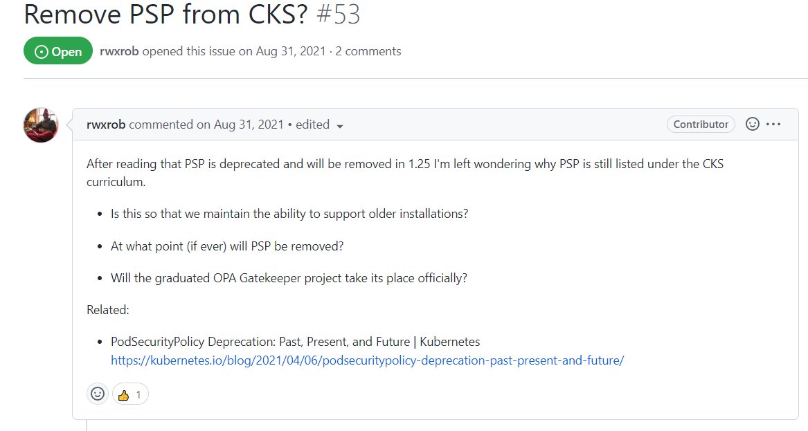
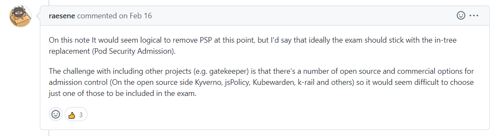

# CKS 最新考纲解读

CKS 最新考纲下载链接：https://github.com/cncf/curriculum

<iframe src="https://github.com/cncf/curriculum/blob/master/CKS_Curriculum_%20v1.24.pdf" style="width:800px; height:500px;" frameborder="0"></iframe>

### Remove PSP from CKS?

> https://github.com/cncf/curriculum/issues/53

# CKS 考试注意事项

## CKS 考试注意事项

1. 考试细节：

   - 必须通过CKA考试，且CKA证书在有效期内，才可以考CKS。

   - 当前 CKS 考试版本，请查看 https://github.com/cncf/curriculum/

   - 考试时间 2 个小时。

   - Number of questions: 15-20 hands-on performance based tasks

   - Passing score: 67%

   - Cost: $300 USD, One (1) year exam eligibility, with a free retake within the year.

2. 熟练使用`kubectl`指令。

3. 推荐一个模拟题网站，每道题都去做一下（至少做两遍），有类似的真题出现，[CKS Exam Series](https://itnext.io/cks-exam-series-1-create-cluster-security-best-practices-50e35aaa67ae)

4. 考试模拟器

   - CKS/CKA/CKAD 考试模拟器，https://killer.sh/。收费30美元。等学习准备好了，先去模拟考一次，再去参加正式考试。

   - CKS Simulator Preview Kubernetes 1.19
     - https://killer.sh/course/preview/bf573045-49c8-44c3-b2e5-8eec7b8eaab3

5. 查看云原生安全白皮书 [Cloud Native Security Whitepaper](https://github.com/cncf/sig-security/blob/master/security-whitepaper/CNCF_cloud-native-security-whitepaper-Nov2020.pdf)

6. 一个非常有用的Github仓库，包含了许多考试相关资料。[walidshaari/Certified-Kubernetes-Security-Specialist](https://github.com/walidshaari/Certified-Kubernetes-Security-Specialist)

7. 推荐两本书

   - [Learn Kubernetes Security](https://learning.oreilly.com/library/view/learn-kubernetes-security/9781839216503/)

     

      - [Container Security](https://learning.oreilly.com/library/view/container-security/9781492056690/)

## CKS Exam Info

Read the Curriculum          https://github.com/cncf/curriculum
Read the Handbook           https://docs.linuxfoundation.org/tc-docs/certification/lf-candidate-handbook
Read the important tips    https://docs.linuxfoundation.org/tc-docs/certification/important-instructions-cks
Read the FAQ                      https://docs.linuxfoundation.org/tc-docs/certification/faq-cka-ckad-cks  

## Kubernetes documentation

熟悉Kubernetes文档并能够使用搜索，快速找到答案。
https://kubernetes.io/docs
https://github.com/kubernetes
https://kubernetes.io/blog
https://github.com/aquasecurity/trivy
https://docs.sysdig.com
https://falco.org/docs
https://gitlab.com/apparmor/apparmor/-/wikis/Documentation  

## 总结

总体来说，CKS 的考试规范以及流程跟 CKA 差不多。网上预约考试，考官检查考试环境，桌子上不能有任何纸张，等等。

考试的时候可以使用两个显示器，可以一个屏幕做题，另外一个屏幕打开 Kubernetes 官网查阅资料。  