# 容器技术

2013年的时候，PaaS这一理念被提出。Docker公司也是从那个时候开始展露头角，那个时候Docker公司还叫dotCloud。

## 1. 容器是什么？和虚拟化到底有啥不一样？

看图一目了然：容器撇掉了臃肿的操作系统，只需把基础的库文件打包带走就可以了，所以身轻如燕。

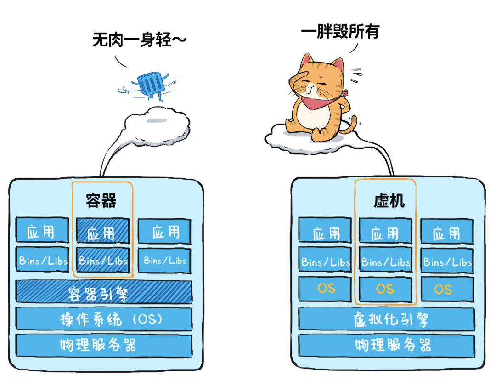


容器是一种轻量级的虚拟化技术，因为它跟虚拟机比起来，它少了一层 hypervisor 层。先看一下下面这张图，这张图简单描述了一个容器的启动过程。

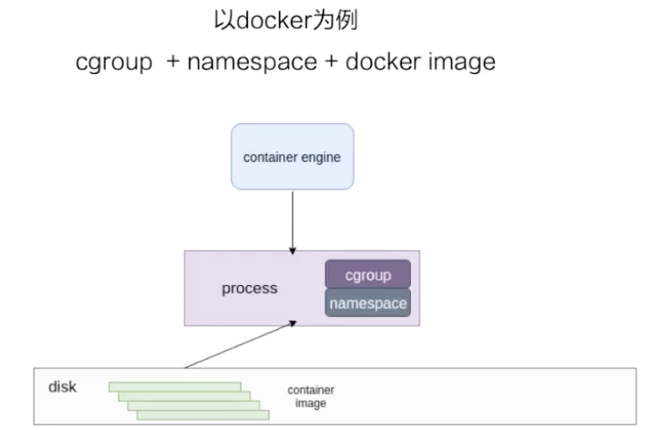

 

最下面是一个磁盘，容器的镜像是存储在磁盘上面的。上层是一个容器引擎，容器引擎可以是 docker，也可以是其它的容器引擎。引擎向下发一个请求，比如说创建容器，然后这时候它就把磁盘上面的容器镜像，运行成在宿主机上的一个进程。

对于容器来说，最重要的是怎么保证这个进程所用到的资源是被隔离和被限制住的，在 Linux 内核上面是由 cgroup 和 namespace 这两个技术来保证的。接下来以 docker 为例，来详细介绍一下资源隔离和资源限制。

 

### 资源隔离 - namespace

 namespace 是用来做资源隔离的，在 Linux 内核上有七种 namespace，docker 中用到了前六种。第七种 cgroup namespace 在 docker 本身并没有用到，但是在 runC 实现中实现了 cgroup namespace。

1. mount

   第一个是mount namespace，mount namespace 就是保证容器看到的文件系统的视图是容器镜像提供的一个文件系统，也就是说它看不见宿主机上的其他文件。当然我们也可以通过一些参数将宿主机上的文件mount进容器中，让它在容器里面可见。

2. uts

   第二个是 uts namespace，uts namespace 主要是隔离了 hostname 和 domain。

   > **hostname 和 domain 的区别？**
   >
   > hostname 指的是计算机的昵称。或者说是这台计算机的 device name。
   >
   > domain 多用于互联网上，domain指的是网站的地址，相当于一个物理地址。比如说“google.com”。那这个domain “google.com”真正指向的IP地址是 "216.58.216.164"。相比于"216.58.216.164"，domain name “google.com”更容易记忆。
   >
   > hostname 和 domain组合起来就是所谓的完全限定域名(FQDN)。
   >
   > hostname 是人类可读的标签，通常用于在网络上区分不同的设备。hostname 基本上就是分配给这台计算机的域名。它是一个人类可读的昵称，对应于一个独特的网络硬件MAC地址。术语hostname 和 domain 经常互换使用，但两者之间有细微的区别。domain的创建基本上是为了让IP地址更人性化。
   >
   > http://www.differencebetween.net/technology/difference-between-hostname-and-domain-name/
   >
   > 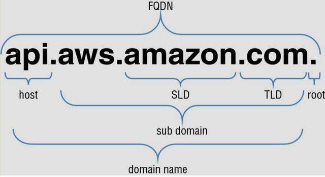

3. pid

   第三个是 pid namespace，pid namespace 是保证了容器的 init 进程是以 1 号进程来启动的。

4. network

   第四个是network namespace，除非容器用 host 网络这种模式之外，其他所有的网络模式都有一个自己的 network namespace 的文件。

5. user

   第五个是 user namespace，user namespace 是控制用户 UID 和 GID 在容器内部和宿主机上的一个映射。

6. ipc

   第六个是 IPC namespace，IPC namespace 控制了进程间的通信，比如说信号量。

7. cgroup

   第七个是 cgroup namespace，cgroup namespace提供了一个视图，可以查看各个cgroup namespace。比如 `/proc/[pid]/cgroup` 文件。

 

### 资源限制 - cgroup

#### 两种 cgroup 驱动

cgroup 主要是做资源限制的，docker 容器有两种 cgroup 驱动：一种是 systemd 的，另外一种是 cgroupfs 的。

-  systemd cgroup driver

  **systemd** 的 cgroup 驱动。这个驱动是因为 systemd 本身可以提供一个 cgroup 管理方式。所以如果用 systemd 做 cgroup 驱动的话，所有的写 cgroup 操作都必须通过 systemd 的接口来完成，不能手动更改 cgroup 的文件。

- cgroupfs cgroup driver 

  **cgroupfs** 比较好理解。比如说你要限制使用多少内存，要用多少 CPU，其实直接把 pid 写入对应的一个 cgroup 文件，然后把对应需要限制的资源也写入相应的 memory cgroup 文件和 CPU 的 cgroup 文件就可以了。

#### 容器中常用的 cgroup

接下来看一下容器中常用的 cgroup。Linux 内核本身是提供了很多种 cgroup，但是 docker 容器用到的大概只有下面六种：

1. **cpu cgroup**: 限制CPU的使用率；
2. **memory cgroup**：限制进程内存的使用量；
3. **device cgroup**：device 控制了你可以在容器中看到的 device 设备；
4. **freezer cgroup**：在批量作业管理系统中，freezer cgroup非常有用，根据系统管理员的需求，启动和停止任务集，以便调度机器的资源；
5. **blkio cgroup**：用于限制块设备I/O速率；
6. **pid cgroup**：限制容器里面可以用到的最大进程数量。

> 参考资料：
>
> http://www.differencebetween.net/technology/difference-between-hostname-and-domain-name/
>
> https://man7.org/linux/man-pages/man7/namespaces.7.html
>
> https://www.kernel.org/doc/Documentation/cgroup-v1/freezer-subsystem.txt


## 2. 除了Docker还有什么？

Docker≠容器，Docker只是众多容器引擎之一。容器引擎主要负责两件事：

第一，负责容器的整个生命周期管理，从生到死；

第二、负责本地容器镜像的构建和管理。同时配合镜像仓库，完成海量镜像的存储和管理。

差不多与Docker同时期，CoreOS 公司推出了自己研制的 Rocket（后来叫 rkt）容器。它们的原理基本都是类似的， 都是基于 Cgroups 和 Namespace 实现的“沙箱”。

Cgroups 也称Linux Cgroups，全称是 Linux Control Group。它最主要的作用就是用来为进程设置资源限制，包括 CPU、内存、磁盘、网络带宽等等。此外，Cgroups 还能够对进程进行优先级设置、审计，以及将进程挂起和恢复等操作。

Namespace 的作用是“隔离”，它让应用进程只能看到该 Namespace 内的“世界”。举个例子来说，Docker容器内的进程只能看到自己容器内的进程，而看不到其他容器或者宿主机的进程。

### **Containerd 与 Docker**

#### **容器运行时**

Containerd与Docker都属于容器运行时，**何为容器运行时？**

容器运行时顾名思义就是要掌控容器运行的整个生命周期，以 docker 为例，其作为一个整体的系统，主要提供的功能如下：

- 制定容器镜像格式
- 构建容器镜像 `docker build`
- 管理容器镜像 `docker images`
- 管理容器实例 `docker ps`
- 运行容器 `docker run`
- 实现容器镜像共享 `docker pull/push`

然而这些功能均可由小的组件单独实现，且没有相互依赖。而后 Docker 公司与 CoreOS 和 Google 共同创建了 OCI (Open Container Initial)，并提供了两种规范：

- 运行时规范(https://github.com/opencontainers/runtime-spec) 描述如何运行`filesystem bundle`
- 镜像规范(https://github.com/opencontainers/image-spec) 制定镜像格式、操作等

> filesystem bundle(文件系统束): 定义了一种将容器编码为文件系统束的格式，即以某种方式组织的一组文件，并包含所有符合要求的运行时对其执行所有标准操作的必要数据和元数据，即config.json 与根文件系统。

而后，Docker、Google等开源了用于运行容器的工具和库 runc，作为 OCI 的一种实现参考。在此之后，各种运行时工具和库也慢慢出现，例如 rkt、containerd、cri-o 等，然而这些工具所拥有的功能却不尽相同，有的只有运行容器(runc、lxc)，而有的除此之外也可以对镜像进行管理(containerd、cri-o)。目前较为流行的说法是将容器运行时分成了 low-level 和 high-level 两类。

**low-level:** 指的是仅关注运行容器的容器运行时，调用操作系统，使用 namespace 和 cgroup 实现资源隔离和限制。

**high-level:** 指包含了更多上层功能，例如 grpc调用，镜像存储管理等。


#### CRI、OCI 之间的关系？ CRI、Containerd 以及 Docker 这些容器运行时之间的关系？

##### 什么是 CRI？

为了能够更好的理解下边的图片，要先交代下 K8s 的一个限制条件：那就是 K8s 只能与 CRI 运行时通信。

对于**什么是 CRI 运行时**？我们暂可以简单的将它理解为与 Docker 同等的存在（一种容器容器运行时的实现）。CRI 是什么？CRI（Container Runtime Interface）是 K8s 定义的一组与容器运行时进行交互的接口，用于将 K8s 平台与特定的容器实现解耦。在 K8s 早期的版本中，对于容器环境的支持是通过 hard code 方式直接调用 Docker API 的，后来为了支持更多的容器运行时和更精简的容器运行时，K8s 提出了CRI。

下面我们来看图说话：

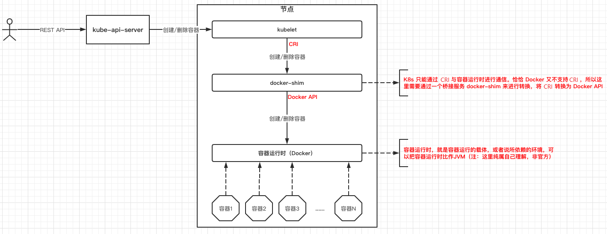

通过上边的图片我们可以看到，K8s 是通过 docker-shim 作为桥接服务，将 CRI 转换为 Docker API，然后与 Docker 进行通信的。大家注意一下这里的 docker-shim，这也是后来CNCF宣布弃用 Docker 的理由。

CRI 运行时有两个实现方案：

1. Containerd：Containerd 是 Docker 的一部分，提供的 CRI 都是由 Docker 提供的。

2. CRI-O：CRI-O 在本质上属于纯 CRI 运行时，因此不包含除 CRI 之外的任何其他内容。

   

##### 什么是OCI？

当我们谈论“容器运行时”时，请注意我们到底是在谈论哪种类型的运行时，这里运行时分为两种：

- CRI 运行时
- OCI 运行时

OCI（Open Container Initiative），可以看做是"容器运行时"的一个标准，它使用 Linux 内核系统调用，例如 cgroups 和 namespace 来生成容器，按此标准实现的”容器运行时“有 runC 和 gVisor。


##### CRI、OCI 之间的关系？

还是通过图片来说明下吧：

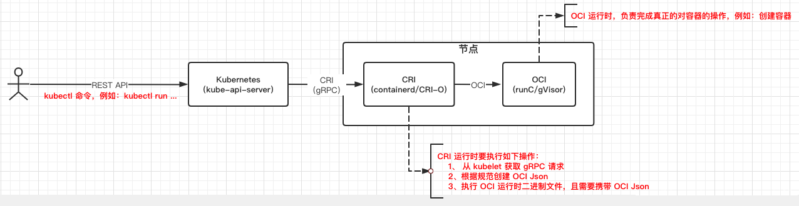

通过上边的图片，我们可以得出如下结论：**实际对容器的操作最终还是要交给 OCI，CRI 也只是个中转。**


##### Docker, Kubernetes, OCI, CRI-O, containerd & runc 之间的关系？

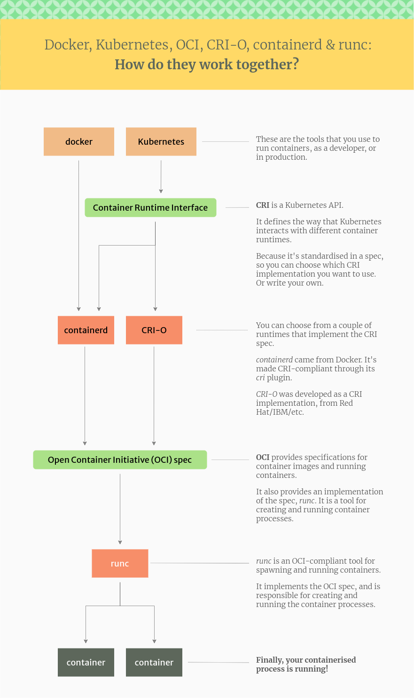

> 参考资料：
>
> https://www.tutorialworks.com/difference-docker-containerd-runc-crio-oci/


##### **既生瑜何生亮？**

CNCF 官方宣布在k8s v1.20版本后不在使用Docker作为默认运行时。大家肯定好奇 CNCF 为什么要这么做。我们从两个层面来分析八卦一下，非技术层面和技术层面。

这个还得从 Containerd 和 Docker 的前世今生以及爱恨情仇说起。在几年之前，Docker 公司在容器技术领域强势崛起，一家独大，Google、RedHat 这样的巨头们都产生了很大的危机感，因此他们想与 Docker 公司一起联合研发一个开源的容器运行时作为Docker 技术的核心依赖。然而 Docker 公司很高冷的表示：我不干！巨头们听到这个回答就很不爽啊！因此通过一些手段对 Docker 公司软硬兼施，使其将 libcontainer 捐给了开源社区，也就是现在的 runc，一个 low level 的容器运行时。此外，巨头们又成立了 CNCF 基金会去对抗 Docker 公司的一家独大，CNCF 成立的思路很明确：在容器领域干不过 Docker，那就搞容器上层的建设 -- 容器编排，从此 K8s 诞生了。虽然 Docker 公司也尝试使用 Swarm 去对抗 K8s，但最终也失败了。

自此，K8s 慢慢成为云原生领域的事实标准，每年也有K8s相关的技术峰会 - KubeCon，其生态也越做越大、越做越完善。Docker 公司为了融入生态，开源了 Docker 的核心依赖 containerd 。此外 K8s 为了对接下一层的容器，也因为其中立性搞了一个运行时接口，也就是 CRI（Container Runtime Interface），runc、containerd 等运行时都去支持此接口。由于当时确实没有啥 high level 的 runtime，oci-o 虽然支持 CRI 接口，但其功能太弱；containerd 也尚未成熟，而且其当时的定位是嵌入到系统中，并非给终端用户使用；rkt 有自己的一套体系（后来这个项目也失败了）。只能暂时为了适配 Docker 搞了个 shim，将 CRI 转换为 Docker API。K8s 和 Docker 进入了冷静期，双方都在各自优化自己，互不干扰。然而平静之下仍是暗潮汹涌，CNCF 社区一直在不断完善 containerd，其定位也发生了改变，由原来的系统嵌入组件，变成了今天的"工业标准容器运行时"，并提供给终端用户使用。直到前年（2020年），K8s 宣布废弃使用Docker，而改用 Containerd。其实除了这些商业因素，另一方面 K8s 已经提供了标准接口对接底层容器运行时，不想在单独维护一个类似于 Docker shim 的适配层去迎合不同的运行时，比如Docker。

所以简单总结一下就是，非技术层面，不希望 Docker 一家独大。技术层面，不想在维护适配层 Docker shim 去适配Docker的API。

> 参考资料：
>
> https://blog.csdn.net/cymm_liu/article/details/89021480
>
> https://blog.csdn.net/yangchao1125/article/details/111209995
>
> https://kubernetes.io/blog/2020/12/02/dockershim-faq/
>
> https://kubernetes.io/docs/setup/production-environment/container-runtimes/

## 3. Containerd 架构

### Containerd 架构

我们回到技术层面上来看看 Containerd 的架构是什么样的。首先看 Containerd 的功能：

- 支持 OCI 的镜像标准
- OCI 的容器运行时
- 镜像的推送和拉取
- 容器运行时生命周期管理
- network namespace 管理，支持容器网络加入已有的 namespace

我们一起来看看Containerd官网的架构图。


Containerd 的设计是一个大的插件系统，图中每一个虚线框其实就对应一个插件。

从下往上看，底层支持 arm 和 x86 架构，支持 Linux 和 windows 系统。

中间 containerd 包含三层： Backend、core、API。其中 Backend 中 Runtime plugin 提供了容器运行时的具体操作，为了支持不同的容器运行时 containerd 也提供了一系列的 `containerd-shim`。 Core 则是核心部分，提供了各种功能的服务，比如常用的是 `Images Service` 提供了镜像相关的操作。再往上则是 API 层，通过 GRPC 与客户端连接，并提供了Metrics 相关的API 给 Prometheus 使用，来进行监控。

最上层则是各种客户端，包括 K8s 的 kubelet，containerd 自己的命令行 ctr 等。

简化一下上图：

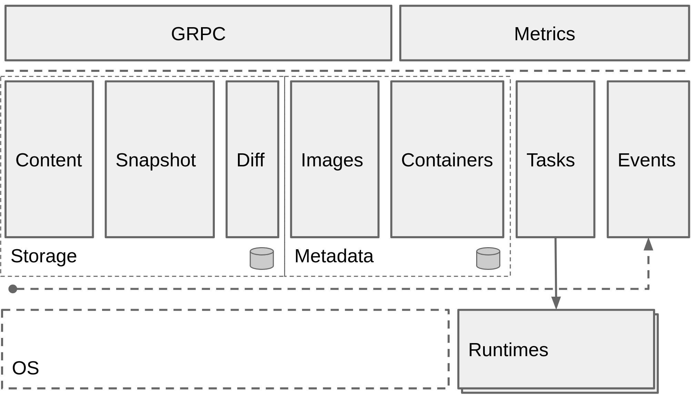

简化后，Containerd 分为三大块： 

1. Runtime plugin 提供了容器运行时的具体操作，比如runc，或者gVisor。
2. Storage 管理镜像文件的存储，Metadata 管理镜像和容器的元数据；
3. 对外以GRPC 的方式提供API；

### Containerd 架构详解 - 容器流程示例

接下来我们以两个示例来详细解释一下容器的流程是怎么工作的，下面的两张图是基于 containerd 的架构画的一个容器的工作流程。

 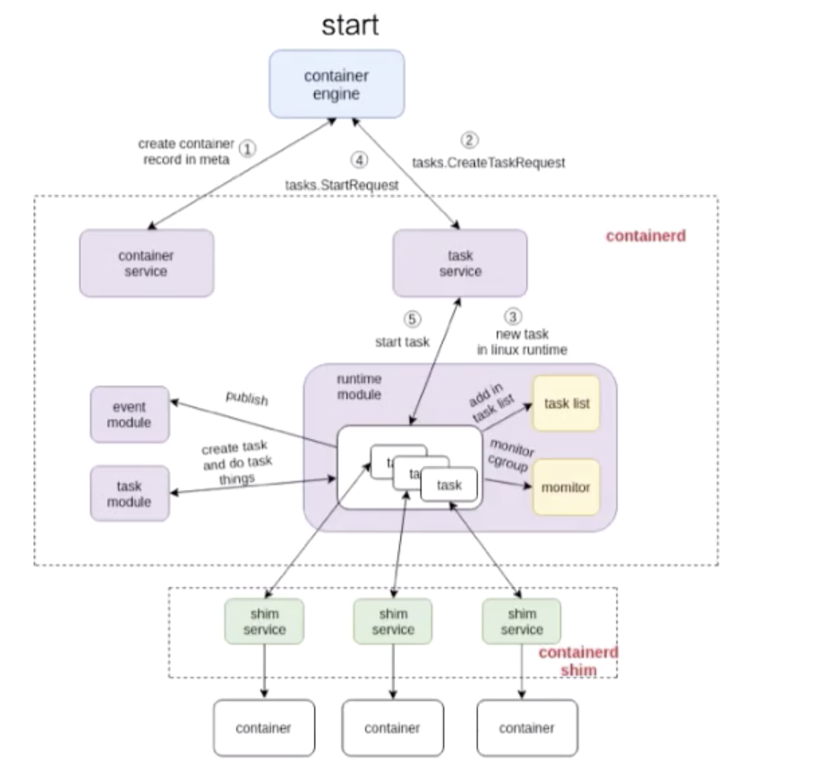

#### start 流程

这张图由三个部分组成：

- 第一个部分是容器引擎部分；
- 两个虚线框框起来的 containerd 和 containerd-shim，它们两个是属于 containerd 架构的部分。
- 最下面就是 container 的部分，由具体的容器运行时来创建容器，可以认为是 shim 去操作 runC 命令创建的一个容器。

看一下这个流程是怎么工作的，图中也标明了 数字顺序1、2、3、4、5。这个数字顺序就是 containerd 怎么去创建一个容器的流程。首先它会去创建一个 matadata，然后会去发请求给 task service 说要去创建容器。通过中间一系列的组件，最终把请求下发到一个 shim。containerd 和 shim 的交互其实也是通过 GRPC 来做交互的，containerd 把创建请求发给 shim 之后，shim 会去调用容器运行时runC创建一个容器出来，以上就是容器创建的流程。

#### exec 流程

接下来看下面这张图，是怎么 exec (进入) 一个容器的。和 start 流程非常相似，都会通过task service。和上面的图一样，我们在图中也能看到数字顺序 1、2、3、4、5、6，这些步骤代表了 containerd 去做 exec 的一个先后顺序。

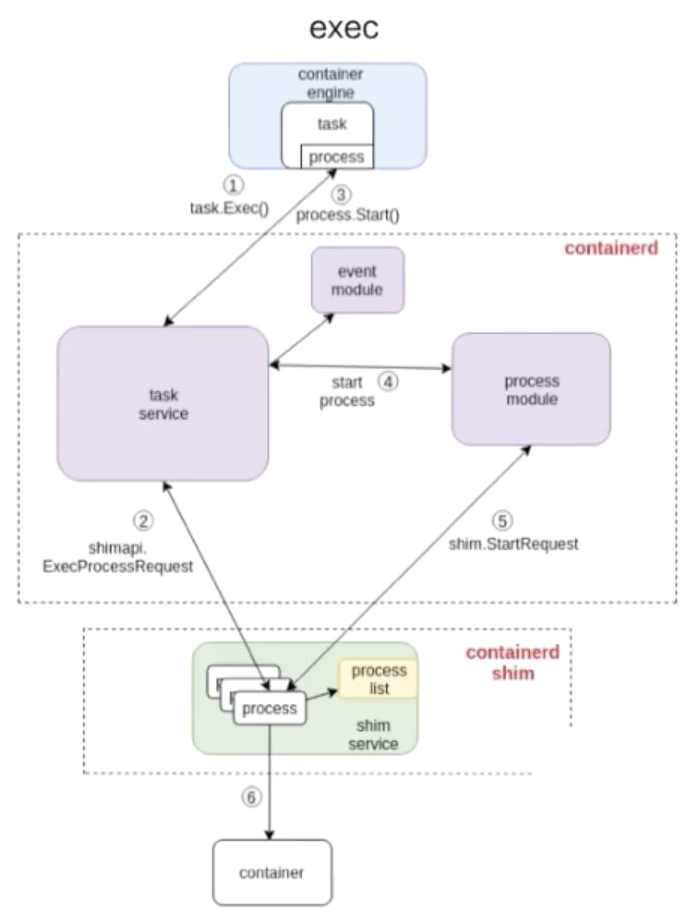

由上图可以看出，exec 的操作最终还是发给 containerd-shim 的。对容器来说，去 start 一个容器和去 exec 一个容器，其实并没有本质的区别。 

最终的一个区别无非就是，是否对容器中的进程做一个 namespace 的创建：

- start 的时候，容器进程的 namespace 是需要去专门创建的。

- exec 的时候，需要把这个进程加入到一个已有的 namespace 里面；

  

### 后话

其实 containerd 的社区一直很活跃，这个项目的成熟离不开社区各位的贡献。大家如果有兴趣的话，也可以深入研究一下其内部设计，为社区做贡献。同时作为使用者，我们大致了解一下Containerd的架构即可，不必深究。

> 参考资料：
>
> https://containerd.io/
>
> https://zhuanlan.zhihu.com/p/361325982
>
> 第15讲 深入剖析Linux容器 - https://developer.aliyun.com/course/1651?spm=5176.10731542.0.0.541a20beUT9hbb
>
> [Kubernetes实践入门指南 07 容器引擎 containerd 落地实践.md](https://learn.lianglianglee.com/%E4%B8%93%E6%A0%8F/Kubernetes%20%E5%AE%9E%E8%B7%B5%E5%85%A5%E9%97%A8%E6%8C%87%E5%8D%97/07%20%E5%AE%B9%E5%99%A8%E5%BC%95%E6%93%8E%20containerd%20%E8%90%BD%E5%9C%B0%E5%AE%9E%E8%B7%B5.md)


## 4. Docker/OCI 镜像、编写Dockerfile

那为什么Docker可以打败其他公司，占据主导地位。主要的原因，还是创新性的提出了Docker 镜像的概念。这是一种非常便利的打包机制。这种机制直接打包了应用运行所需要的整个操作系统，从而保证了本地环境和云端环境的高度一致，避免了用户通过“试错”来匹配两种不同运行环境之间差异的痛苦过程。

### 容器镜像

以 docker 镜像为例来讲一下容器镜像的构成。docker 镜像是基于联合文件系统的。简单描述一下联合文件系统，大概的意思就是说，它允许文件是存放在不同的层级上面的，但是最终是可以通过一个统一的视图，看到这些层级上面的所有文件。

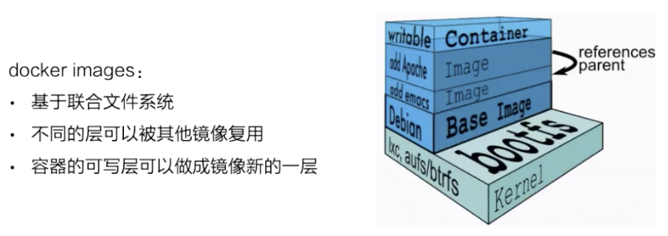

如上图所示，右边是从 docker 官网拿过来的容器存储的一个结构图。这张图非常形象的表明了 docker 的存储，docker 的存储是基于联合文件系统，是分层的。每一层是一个 Layer，这些 Layer 由不同的文件组成，它是可以被其他镜像所复用的。可以看一下，当镜像被运行成一个容器的时候，最上层就会是一个容器的读写层。这个容器的读写层也可以通过 commit 把它变成一个镜像顶层最新的一层。

docker 镜像的存储，它的底层是可以基于不同的文件系统的，比如 AUFS、btrfs、devicemapper 还有 overlay。

 

#### 以 overlay 为例讲解存储流程

接下来我们以 overlay 这个文件系统为例，看一下 docker 镜像是怎么在磁盘上进行存储的。先看一下下面这张图，简单地描述了 overlay 文件系统的工作原理 。

 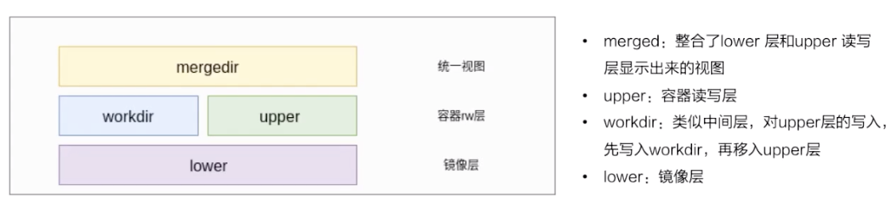

 最下层是一个 lower 层，也就是镜像层，它是一个只读层。右上层是一个 upper 层，upper 是容器的读写层，upper 层采用了写时复制的机制，也就是说只有对某些文件需要进行修改的时候才会从 lower 层把这个文件拷贝上来，之后所有的修改操作都会对 upper 层的副本进行修改。 

与upper层 并列的有一个 workdir层，它的作用是充当一个中间层的作用。也就是说，当对 upper 层里面的副本进行修改时，会先放到 workdir，然后再从 workdir 移到 upper 里面去，这个就是 overlay 的工作机制。 

最上面的是 mergedir，是一个统一视图层。从 mergedir 里面可以看到 upper 和 lower 中所有数据的整合。

 

#### 基于 overlay 存储，怎么对容器里面的文件进行操作？

接下来我们讲一下基于 overlay 这种存储，怎么对容器里面的文件进行操作？

**读操作**

先看一下读操作，容器刚创建出来的时候，upper 其实是空的。这个时候如果去读的话，所有数据都是从 lower 层读上来的。

**写操作**

写操作如刚才所提到的，overlay 的 upper 层有一个写时复制的机制，对一些文件需要进行操作的时候，overlay 会去做一个 copy up 的动作，然后会把文件从 lower 层拷贝上来，之后的一些写修改都会对这个部分进行操作。

**删除操作**

然后看一下删除操作，overlay 里面其实是没有真正的删除操作的。它所谓的删除其实是通过对文件进行标记，然后从最上层的统一视图层去看，看到这个文件如果做了标记，就不显示这个文件，然后就认为这个文件是被删掉的。这个标记有两种方式：

- 一种是 whiteout 的方式。
- 第二个就是通过设置目录的一个扩展权限，通过设置扩展参数来做到目录的删除。


### Dockerfile 示例讲解：

> 公司环境下需要配置docker proxy才能访问官方的Docker镜像。可以参考下面的代码配置docker proxy。
>
> ```sh
> # Set docker proxy
> # To enable the service, run the systemctl enable docker.service command.
> systemctl enable docker.service
> mkdir -p /usr/lib/systemd/system/docker.service.d
> cat << EOF > /usr/lib/systemd/system/docker.service.d/http_proxy.conf
> [Service]
> Environment="HTTP_PROXY=http://web-proxy.houston.softwaregrp.net:8080" "HTTPS_PROXY=http://web-proxy.houston.softwaregrp.net:8080"
> EOF
> # You need to configure another proxy when you set the Docker-Content-Trust on. Run the following commands:
> # export http_proxy=http://web-proxy.houston.softwaregrp.net:8080
> # export https_proxy=http://web-proxy.houston.softwaregrp.net:8080
> 
> # Run the systemctl daemon-reload command to reload the configuration.
> systemctl daemon-reload
> # Run the service docker restart command to restart docker.
> service docker restart
> # Run the docker pull hello-world command to check if you can pull images from Docker Hub.
> docker pull hello-world
> 
> docker login xxx.com -u [username] -p [password]
> ```

#### 之前的做法

在 Docker 17.05 版本之前，我们构建 Docker 镜像时，通常会采用以下两种方式：

1. 全部放入一个 Dockerfile
2. 分散到多个 Dockerfile

##### 1. 全部放入一个 Dockerfile

一种方式是将所有的构建过程编包含在一个 `Dockerfile` 中，包括项目及其依赖库的编译、测试、打包等流程，这里可能会带来的一些问题：

  * 镜像层次多，镜像体积较大，部署时间变长

  * 源代码存在泄露的风险

例如，编写 `app.go` 文件，该程序输出 `Hello World!`

```go
package main

import "fmt"

func main(){
    fmt.Printf("Hello World!");
}
```

编写 `Dockerfile.one` 文件

```dockerfile
FROM golang:alpine

RUN apk --no-cache add git ca-certificates

WORKDIR /go/src/github.com/go/helloworld/

COPY app.go .

# 编译 go 二进制包，并复制到 /root 目录下
RUN go get -d -v github.com/go-sql-driver/mysql \
  && CGO_ENABLED=0 GOOS=linux go build -a -installsuffix cgo -o app . \
  && cp /go/src/github.com/go/helloworld/app /root

WORKDIR /root/

CMD ["./app"]
```

构建镜像

```bash
$ docker build -t go/helloworld:1 -f Dockerfile.one .
```

##### 2. 分散到多个 Dockerfile

另一种方式，就是我们事先在一个 `Dockerfile` 中，将项目及其依赖库编译测试打包好后，再将其拷贝到运行环境中，这种方式需要我们编写两个 `Dockerfile` 和一些编译脚本才能将其两个阶段自动整合起来，这种方式虽然可以很好地规避第一种方式存在的风险，但明显部署过程较复杂。

例如，编写 `Dockerfile.build` 文件

```dockerfile
FROM golang:alpine

RUN apk --no-cache add git

WORKDIR /go/src/github.com/go/helloworld

COPY app.go .

RUN go get -d -v github.com/go-sql-driver/mysql \
  && CGO_ENABLED=0 GOOS=linux go build -a -installsuffix cgo -o app .
```

编写 `Dockerfile.copy` 文件

```dockerfile
FROM alpine:latest

RUN apk --no-cache add ca-certificates

WORKDIR /root/

COPY app .

CMD ["./app"]
```

新建 `build.sh`

```shell
#!/bin/sh
echo Building go/helloworld:build

docker build -t go/helloworld:build . -f Dockerfile.build

docker create --name extract go/helloworld:build
docker cp extract:/go/src/github.com/go/helloworld/app ./app
docker rm -f extract

echo Building go/helloworld:2

docker build --no-cache -t go/helloworld:2 . -f Dockerfile.copy
rm ./app
```

现在运行脚本即可构建镜像

```bash
$ chmod +x build.sh

$ ./build.sh
```

对比两种方式生成的镜像大小。

```bash
$ docker image ls
REPOSITORY      TAG    IMAGE ID        CREATED         SIZE
go/helloworld   2      f7cf3465432c    22 seconds ago  6.47MB
go/helloworld   1      f55d3e16affc    2 minutes ago   295MB
```

可以明显的看到在镜像大小方面，“分散到多个 Dockerfile”这种做法可以极大的压缩镜像大小。


#### 使用多阶段构建

为解决以上问题，Docker v17.05 开始支持多阶段构建 (`multi stage builds`)。使用多阶段构建我们就可以很容易解决前面提到的问题，并且只需要编写一个 `Dockerfile`：

例如，编写 `Dockerfile` 文件

```dockerfile
# 我们可以使用关键字`as`只构建某一阶段的镜像
FROM golang:alpine as builder

RUN apk --no-cache add git

WORKDIR /go/src/github.com/go/helloworld/

RUN go get -d -v github.com/go-sql-driver/mysql

COPY app.go .

RUN CGO_ENABLED=0 GOOS=linux go build -a -installsuffix cgo -o app .

FROM alpine:latest as prod

RUN apk --no-cache add ca-certificates

WORKDIR /root/

# 从上一阶段的镜像中复制文件
COPY --from=0 /go/src/github.com/go/helloworld/app .

CMD ["./app"]
```

构建镜像

```bash
$ docker build -t go/helloworld:3 .
```

对比三个镜像大小，使用多阶段构建的镜像体积仅有6.46MB。

```bash
$ docker image ls
REPOSITORY        TAG   IMAGE ID         CREATED            SIZE
go/helloworld     3     d6911ed9c846     7 seconds ago      6.47MB
go/helloworld     2     f7cf3465432c     22 seconds ago     6.47MB
go/helloworld     1     f55d3e16affc     2 minutes ago      295MB
```

##### 构建时从其他镜像复制文件

上面例子中我们使用 `COPY --from=0 /go/src/github.com/go/helloworld/app .` 从上一阶段的镜像中复制文件，我们也可以复制**任意**镜像中的文件。例如，从nginx镜像中复制`/etc/nginx/nginx.conf`到当前镜像中。

```docker
$ COPY --from=nginx:latest /etc/nginx/nginx.conf /nginx.conf
```

> 参考资料：
>
> 更多 Dockerfile 的用法可以参考 [Dockerfile reference](https://docs.docker.com/engine/reference/builder/)
>
> https://yeasy.gitbook.io/docker_practice/image/multistage-builds
>
> https://github.com/GoogleCloudPlatform/kubernetes-engine-samples/tree/master/hello-app


## 5. Docker的常用命令

- docker search 关键词 在Docker Hub中搜索镜像

- docker pull命令下载镜像
- docker rmi命令删除镜像
- docker run命令启动镜像
- docker ps命令列举出所有运行中的Docker容器
- docker version查看docker的版本信息
- docker info 查看Docker的系统信息，例如CPU、内存、容器个数等
- docker start/stop/restart 容器id 启动、停止和重启指定的容器
- docker build -t 标签名称 目录，构建Docker镜像，-t表示指定一个标签
- docker tag 为镜像打标签
- 更多的命令可以使用docker --help 查看，如果想查询docker run命令的用法，可以使用docker run --help进行查看。

## 6. Podman

Podman 原来是 CRI-O 项目的一部分，后来被分离成一个单独的项目叫 libpod。Podman 的使用体验和 Docker 类似，不同的是Podman 没有守护进程 daemon。以前使用 Docker CLI 的时候，Docker CLI 会通过 gRPC API 去跟 Docker Engine 说“我要启动一个容器”，然后 Docker Engine 才会通过 OCI运行时（默认是 runc）来启动一个容器。这就意味着容器的进程不可能是 Docker CLI 的子进程，而是 Docker Engine 的子进程。

Podman 比较简单粗暴，它不使用 Daemon，而是直接通过 OCI运行时（默认也是 runc）来启动容器。并且 Podman 使用 Linux 的 fork/exec 模型来启动容器，所以容器的进程是 Podman 的子进程，且 Podman 不需要 root 权限。而 Docker 采用的是 C/S（客户端/服务器）模型。

### 安装 Podman

```shell
# Before starting, it is recommended to update your system with the latest version. 
# You can do it with the following command:
apt-get update -y

# By default, Podman is not available in the Ubuntu 18.04 default repository. 
# So, you will need to add the repository for that.
apt-get install software-properties-common -y
add-apt-repository -y ppa:projectatomic/ppa

# Next, install Podman with the following command:
apt-get install podman -y

# Once Podman has been installed, you can check all the information of Podman with the following command:
podman info
```

安装完 Podman 后，运行`podman info`，你将看到如下输出：

```shell
# You should see the following output:
host:
BuildahVersion: 1.8.3
Conmon:
package: 'conmon: /usr/bin/conmon'
path: /usr/bin/conmon
version: 'conmon version 0.3.0, commit: unknown'
Distribution:
distribution: ubuntu
version: "18.04"
MemFree: 338325504
MemTotal: 1033875456
OCIRuntime:
package: 'cri-o-runc: /usr/bin/runc'
path: /usr/bin/runc
version: 'runc version spec: 1.0.1-dev'
SwapFree: 1709174784
SwapTotal: 1709174784
arch: amd64
cpus: 1
hostname: ubuntu1804
kernel: 4.15.0-20-generic
os: linux
rootless: false
uptime: 17m 40.72s
registries:
blocked: null
insecure: null
search: null
store:
ConfigFile: /etc/containers/storage.conf
ContainerStore:
number: 0
GraphDriverName: overlay
GraphOptions: null
GraphRoot: /var/lib/containers/storage
GraphStatus:
Backing Filesystem: extfs
Native Overlay Diff: "true"
Supports d_type: "true"
Using metacopy: "false"
ImageStore:
number: 0
RunRoot: /var/run/containers/storage
VolumePath: /var/lib/containers/storage/volumes
```


### 如何使用 Podman

在正式开始使用 Podman 之前，我们最好指定一下默认的镜像仓库，默认从某镜像仓库中搜索指定的镜像。

例如将`docker.io`指定为默认的镜像仓库，只需修改文件`/etc/containers/registries.conf`。

```shell
# You can do it with the following command:
echo -e "[registries.search]\nregistries = ['docker.io']" | sudo tee /etc/containers/registries.conf
```

让我们来试一试，运行以下指令

```shell
podman run hello-world
```

你会看见Podman默认从`docker.io`搜索并拉取镜像，成功运行镜像，输出`Hello from Docker!`

```shell
Trying to pull docker.io/library/hello-world...Getting image source signatures
Copying blob 1b930d010525 done
Copying config fce289e99e done
Writing manifest to image destination
Storing signatures
Hello from Docker!
```

Podman的指令几乎跟Docker的指令是一模一样的，例如常见的有：

- podman images

- podman ps -a
- podman stop
- podman start
- podman rm --latest

```shell
# you can see the list of downloaded images with the following command:
$ podman images

# You should see the following output:
REPOSITORY TAG IMAGE ID CREATED SIZE
docker.io/library/hello-world latest fce289e99eb9 6 months ago 6.14 kB
```

```shell
# You can also see the running container with the following command:
$ podman ps -a

# You should see the following output:
CONTAINER ID IMAGE COMMAND CREATED STATUS PORTS NAMES
c6c20824a698 docker.io/library/hello-world:latest /hello 3 minutes ago Exited (0) 3 minutes ago upbeat_elion
```

```shell
# You can start and stop the container with the following command:
$ podman stop --latest
$ podman start --latest
```

```shell
# To remove the container, run the following command:
$ podman rm --latest
```

如果你习惯了使用Docker命令，或者代码中写了大量的Docker命令，你不想修改。你甚至可以为Podman指定alias为docker，然后就可以按以前的习惯运行docker指令，但实际后端运行的是Podman。

```shell
$ alias docker=podman
```

> 参考资料：
>
> https://blog.csdn.net/alex_yangchuansheng/article/details/102618128
>
> https://help.clouding.io/hc/en-us/articles/360011382320-How-to-Install-and-Use-Podman-on-Ubuntu-18-04

## 7. 作业：基于nginx做一个image，访问首页显示“Hello World”

```dockerfile
FROM nginx:latest

RUN sed -i 's/Welcome to nginx/Hello World/g' /usr/share/nginx/html/index.html
```

扩展阅读：

[容器这么傲娇，全靠K8S撑腰！](https://mp.weixin.qq.com/s/qRZiOKTT9laWrGnlsYhLbA)

[容器技术的前世今生](https://mp.weixin.qq.com/s/3bjEU9_KJecMqtfd1NhJTA)

[Docker 底层原理浅析](https://mp.weixin.qq.com/s/Cau8rZCPsMxBYRUuGQ5seQ)

[Docker 实战总结（非常全面），收藏了！](https://mp.weixin.qq.com/s/kyocXVW2VSE9zp6PdnUNPg)