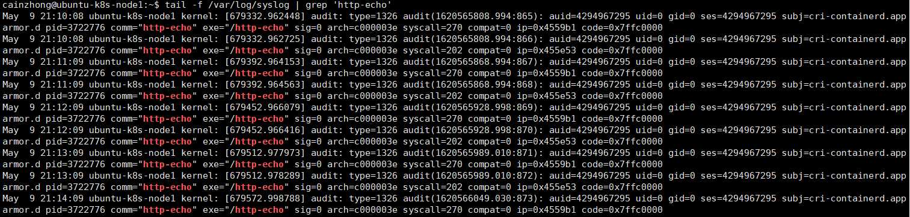

# 系统强化 / System Hardening

## 1. 减小系统的被攻击面

#### 强化容器镜像 / Harden a container image

强化容器镜像是指遵循安全最佳实践来构建容器镜像，以减少攻击面。

容器镜像本质上是一个文件，它捆绑了应用程序的二进制文件、依赖项以及应用程序的配置项等等。Docker提供了一种标准化的方法，称为Dockerfile。Dockerfile包含一系列指令，例如复制文件、配置环境变量、配置开放端口和容器入口点，Docker引擎（Docker daemon）可以理解这些指令，并用以构建容器镜像。每个Dockerfile指令将在容器镜像中创建一个文件层。

在看Dockerfile的示例之前，让我们先了解一些基本的Dockerfile指令：

- FROM: 指定基础镜像
- RUN: 运行指定的命令
- ENV: 设置环境变量
- CMD: 容器启动时的默认命令
- COPY/ADD: 复制命令，把文件复制到镜像中。COPY 只能复制本地文件，ADD 可以复制远程文件，类似于scp命令。
- EXPOSE: 暴漏容器运行时的监听端口给外部
- ENTRYPOINT: 类似于CMD, 容器启动时的默认命令
  - ENTRYPOINT和CMD不同组合的执行情况，请参考 [Understand how CMD and ENTRYPOINT interact](https://docs.docker.com/engine/reference/builder/#understand-how-cmd-and-entrypoint-interact)
- WORKDIR: 设置工作目录，对RUN，CMD，ENTRYPOINT，COPY，ADD生效。如果目录不存在则会创建，也可以设置多次。
- USER: 设置启动容器的用户，可以是用户名或UID

现在，让我们看一个Dockerfile的例子，你能发现其中的安全隐患吗？

```dockerfile
FROM ubuntu
  
# Add MySQL configuration
COPY my.cnf /etc/mysql/conf.d/my.cnf
COPY mysqld_charset.cnf /etc/mysql/conf.d/mysqld_charset.cnf

RUN apt-get update && \
    apt-get -yq install mysql-server-5.6 &&

# Add MySQL scripts
COPY import_sql.sh /import_sql.sh
COPY run.sh /run.sh

# Configure credentials
COPY secret-token .                                                # Layer X
RUN /etc/register.sh ./secret-token                                # Layer Y
RUN rm ./secret-token # delete secret token again                  # Layer Z

EXPOSE 3306
CMD ["/run.sh"]
```

上面的Dockerfile第一眼看上去，它完全符合安全建议。它复制一个文件秘密令牌，使用它，然后删除它。但由于Docker的工作方式，每个RUN、COPY和ADD命令都会创建一个新层，并且每个层都会持久化在容器镜像中。
这意味着即使文件秘密令牌在LAYER Z被删除，它仍然包含在LAYER X和LAYER Y的中。在这种情况下，最好通过外部变量的方式传递给Dockerfile。

```dockerfile
# Configure credentials
COPY secret-token .                                       # LAYER X
RUN /etc/register.sh ./secret-token                       # LAYER Y
RUN rm ./secret-token # delete secret token again         # LAYER Z
```


##### CIS Docker benchmarks

CIS组织制定了有关容器的安全最佳实践，称为CIS Docker benchmarks，让我们先看一下CIS Docker benchmarks的安全建议：

- **为容器镜像创建一个用户，并用此用户来运行容器**：使用非root用户来运行容器是一个很好的做法。如果以root用户运行容器，意味着如果攻击者成功地从容器中逃脱，他们将直接获得对主机的root访问权限。
- **使用受信任的基础镜像来构建自己的镜像**：我们不能完全相信从公共仓库下载的容器镜像，里面很有可能包含恶意软件或者挖矿程序。推荐使用官方镜像。
- **不要在容器镜像中安装不必要的包**：安装不必要的包将增加攻击面。有时，你可能需要在构建镜像的过程中安装一些工具，一定要记得在Dockerfile的末尾删除它们。
- **扫描并重建容器镜像，以应用安全补丁**：随着时间的推移，越来越多的新漏洞被发现，定期扫描容器镜像是个好习惯。一旦发现任何漏洞，请尝试重新构建镜像来应用安全补丁。
- **确保更新未缓存在Dockerfile中**：在安装软件之前，你可能会更新包存储库。例如，在Dockerfile中运行`RUN apt-get update`，Docker引擎将缓存此文件层，因此，当你再次构建容器镜像时，Docker引擎将直接使用缓存的旧包存储库信息来安装软件，这将阻止你安装最新的软件程序。因此，推荐在单个Dockerfile指令中使用`RUN apt-get update && apt-get install xxx`，或者在Docker build命令中使用`--no cache` 参数。
- **不要在容器镜像中使用 `setuid` 和 `setgid` 权限**：`setuid` 和 `setgid` 可用于权限提升，因为具有此类权限的文件可以使用所有者的权限而不是启动器的权限执行。你应该仔细检查具有 `setuid` 和 `setgid` 权限的文件，并删除那些不需要此类权限的文件。
- **在Dockerfile中使用COPY而不是ADD**：COPY指令只能将文件从本地计算机复制到镜像的文件系统，而ADD指令不仅可以从本地计算机复制文件，还可以从远程URL检索文件到镜像的文件系统。使用ADD可能会将来自网络的恶意文件添加到容器镜像中。
- **不要在Dockerfile中存储敏感信息**：有许多工具可以提取容器镜像的文件层。如果在容器镜像中存储了任何敏感信息，那么这些敏感信息很容易被别人窃取。一个常见的错误是使用ENV指令在环境变量中存储密码。
- **仅安装已验证的软件包**：这类似于仅使用受信任的基础镜像。只安装你信赖的软件。


#### 配置pod（或pod模板）的安全属性 / Configure the security attributes of pods (or pod templates) 

##### 为pods设置主机级别的命名空间 / Setting host-level namespaces for pods

以下属性用于设置主机级别的命名空间 / host-level namespaces：

**hostPID**：默认值为false。如果将其设置为true，则该Pod可以看到Pod所在节点上的所有进程。

**hostNetwork**：默认值为false。如果将其设置为true，则该Pod可以看到Pod所在节点上的所有网络堆栈信息。

**hostIPC**：默认值为false。如果将其设置为true，则该Pod可以看到Pod所在节点上的所有IPC。IPC进程间通信(Inter-Process Communication)就是指多个进程之间相互通信，交换信息的方法。

以下是Pod使用主机级别命名空间的例子，在日常环境中，你不应该这样使用，这将打破Pod的安全边界。

```yaml
apiVersion: v1
kind: Pod
metadata:
  name: ubuntu-1
  labels:
    app: util
spec:
  containers:
  - name: ubuntu
    image: ubuntu
    imagePullPolicy: Always
  hostPID: true
  hostNetwork: true
  hostIPC: true
```

##### 容器安全上下文 / Security context for containers

以下是容器安全上下文的主要属性：

- **privileged**：默认值为false。如果将其设置为true，则容器中的进程本质上等同于root用户。

- **capabilities**：容器运行时向容器授予了一组默认的capabilities。授予的默认capabilities如下：CAP_SETPCAP, CAP_MKNOD, CAP_AUDIT_WRITE, CAP_CHOWN, CAP_NET_RAW, CAP_DAC_OVERRIDE, CAP_FOWNER, CAP_FSETID, CAP_KILL, CAP_SETGID, CAP_SETUID, CAP_NET_BIND_SERVICE, CAP_SYS_CHROOT, 和 CAP_SETFCAP。你可以通过配置此属性来添加额外的capabilities或删除某些默认值。应谨慎添加诸如CAP_SYS_ADMIN 和 CAP_NETWORK_ADMIN之类的capabilities。对于默认的capabilities，还应该删除那些不必要的capabilities。

  > capabilities(7) — Linux manual page  https://man7.org/linux/man-pages/man7/capabilities.7.html

- **allowPrivilegeEscalation**：默认值为true。此属性控制进程是否可以获得比其父进程更多的权限。
- **readOnlyRootFilesystem**：默认值为false。如果将其设置为true，容器的根文件系统将变为只读，这意味着库文件、配置文件等都是只读的，不能被篡改。将readOnlyRootFilesystem设置为true是一种很好的安全实践。
- **runAsNonRoot**：默认值为false。如果将其设置为true，容器中的进程将不能以root用户运行（UID=0）。如果以root用户运行，kubelet将阻止容器启动。
- **runAsUser**：指定UID来运行容器。
- **runAsGroup**：与runAsUser类似，指定GID来运行容器。

当你了解了这些安全属性，你就可以根据业务需求提出自己的安全强化策略。一般来说，最佳安全实践如下：

- 除非必要，否则不要在**privileged**模式下运行容器。
- 除非必要，否则不要添加额外**capabilities**。
- 删除未使用的默认**capabilities**。
- 以非root用户运行容器。
- 添加**runAsNonRoot**属性。
- 将容器根文件系统设置为只读。

现在，让我们看一个为容器配置安全上下文的示例：

```yaml
apiVersion: v1
kind: Pod
metadata:
  name: nginx-security-pod
spec:
  containers:
  - name: nginx
    image: docker.io/library/nginx:1.19.4
    securityContext:
      privileged: false
      capabilities:
        drop:
        - all
        add: ["chown","net_bind_service"]
  hostNetwork: false
  hostIPC: false
  hostPID: false
```

这里我们特别注意一下`capabilities`字段部分，我们先将所有的默认Linux capabilities删除，然后根据最小权限原则，只添加nginx所必须的Linux capabilities。

如果我们此时在将`chown`或者`net_bind_service`中任一一个Linux capabilities删除，都会导致Pod启动失败。

> 扩展阅读：
>
> https://www.golinuxcloud.com/kubernetes-securitycontext-capabilities/


##### Pod的安全上下文 / Security context for pods

Pod级别的安全上下文，这意味着安全属性将应用于Pod中的所有容器。以下是Pod级别的主要安全属性列表：

- **fsGroup**：此属性的有效性取决于卷类型。它允许kubelet使用补充GID将装载卷的所有权设置到Pod。
- **runAsUser**：指定UID来运行容器。
- **runAsGroup**：与runAsUser类似，指定GID来运行容器。
- **runAsNonRoot**：默认值为false。如果将其设置为true，容器中的进程将不能以root用户运行（UID=0）。如果以root用户运行，kubelet将阻止容器启动。

## 2. 限制对外网的访问

  ### 使用NetworkPolicy限制对外网的访问

在” Kubernetes 集群安全强化  Cluster Hardening， 使用网络策略NetworkPolicy限制集群网络访问 “章节中，我们已经介绍过NetworkPolicy。我们同样可以使用NetworkPolicy限制对外网的访问。

```
apiVersion: networking.k8s.io/v1
kind: NetworkPolicy
metadata:
  name: foo-deny-external-egress
spec:
  podSelector:
    matchLabels:
      app: foo
  policyTypes:
  - Egress
  egress:
  - ports:
    - port: 53
      protocol: UDP
    - port: 53
      protocol: TCP
  - to:
    - namespaceSelector: {}
```

对于此NetworkPolicy的一些说明：

- 此NetworkPolicy将应用于带标签为`app=foo`的Pod，且仅作用于Egress，即出站请求。

- 此NetworkPolicy允许了所有用于DNS解析的出站请求，53/udp 或者 53/tcp会用于DNS解析。
  - TODO，神奇的UDP53端口，为什么开了53端口，其他端口的请求也通了。
- `to:` 部分指定了一个 `namespaceSelector: {}`。这将选取所有namespace下的所有Pod，他们的出站请求是被允许的。
- 且没有列出外部服务的IP地址，因此所有出站的外部请求将被拒绝。

> 参考资料：
>
> https://github.com/ahmetb/kubernetes-network-policy-recipes/blob/master/14-deny-external-egress-traffic.md

顺便，我们再来复习一下NetworkPolicy。

##### 限制一个应用程序的流量 / LIMIT traffic to an application

Pod包含标签（app: bookstore 和 role: api）只允许来自Pod包含标签（app: bookstore）的请求。


```yaml
kind: NetworkPolicy
apiVersion: networking.k8s.io/v1
metadata:
  name: api-allow
spec:
  podSelector:
    matchLabels:
      app: bookstore
      role: api
  ingress:
  - from:
      - podSelector:
          matchLabels:
            app: bookstore
```


## 3. 使用Linux系统安全模块

  ### 使用AppArmor限制容器对资源的访问

AppArmor是一个高效和易于使用的Linux系统安全应用程序。在Ubuntu中已经预安装了此安全应用程序。

AppArmor profile通常定义进程拥有哪些Linux capabilities，容器可以访问哪些网络资源和文件等等。

AppArmor不是Kubernetes中的对象，而是Linux的系统安全应用程序。

让我们看一个示例，假设你有一个AppArmor profile来阻止任何文件写入活动：

```shell
#include <tunables/global>
profile k8s-apparmor-example-deny-write flags=(attach_disconnected) {
  #include <abstractions/base>
  file,
  # Deny all file writes.
  deny /** w,
}
```

首先，我们需要安装此AppArmor profile

```shell
# apparmor_parser k8s-apparmor-example-deny-write
apparmor_parser -q [AppArmor profile path]
```

当AppArmor profile成功加载后，通过更新Pod注释的方式，以使用AppArmor profile来保护容器。以下是将AppArmor profile应用于容器的示例：

```yaml
---
apiVersion: v1
kind: Pod
metadata:
  name: hello-apparmor
  annotations:
    # Tell Kubernetes to apply the AppArmor profile "k8s-apparmor-example-deny-write".
    container.apparmor.security.beta.kubernetes.io/hello: localhost/k8s-apparmor-example-deny-write
spec:
  containers:
  - image: busybox
    imagePullPolicy: IfNotPresent
    name: hello
    command: [ "sh", "-c", "echo 'Hello AppArmor!' && sleep 1h" ]
```

在hello-apparmor里面的容器基本没干什么事情，只输出了一句“Hello AppArmor!”，然后就开始`sleep`。但是，当你进入容器，并尝试写入任何文件时，此操作将被AppArmor阻止。

  ### 使用Seccomp限制容器内进程的系统调用

Seccomp 代表安全计算模式（secure computing mode），自Linux 2.6.12版本以后，一直是Linux内核的一个特性。 它可以限制进程的系统调用。 Kubernetes 允许你将加载到节点上的 seccomp 配置文件，应用于 Pod 和容器。

接下来，我们看一看在Kubernetes中如何使用Seccomp限制容器内进程的系统调用。

本实验基于Ubuntu 20和Kubernetes v1.20。

#### 开启Seccomp

Seccomp是Linux内核的一个特性。为了确保seccomp在你的系统上是启用的，运行以下命令（默认是开启状态）：

```shell
$ cat /boot/config-`uname -r` | grep CONFIG_SECCOMP=
CONFIG_SECCOMP=y
```

#### 安装自定义seccomp配置文件

默认情况下，kubelet会从`/var/lib/kubelet/seccomp/`目录下读取seccomp配置文件。我们创建3个seccomp配置文件，并将其复制到`/var/lib/kubelet/seccomp/profiles/` 的目录中。

```shell
mkdir -p /var/lib/kubelet/seccomp/profiles
```

```json
# audit.json
{
    "defaultAction": "SCMP_ACT_LOG"
}
```

```json
# violation.json
{
    "defaultAction": "SCMP_ACT_ERRNO"
}
```

```json
# fine-grained.json
{
    "defaultAction": "SCMP_ACT_ERRNO",
    "architectures": [
        "SCMP_ARCH_X86_64",
        "SCMP_ARCH_X86",
        "SCMP_ARCH_X32"
    ],
    "syscalls": [
        {
            "names": [
                "accept4",
                "epoll_wait",
                "pselect6",
                "futex",
                "madvise",
                "epoll_ctl",
                "getsockname",
                "setsockopt",
                "vfork",
                "mmap",
                "read",
                "write",
                "close",
                "arch_prctl",
                "sched_getaffinity",
                "munmap",
                "brk",
                "rt_sigaction",
                "rt_sigprocmask",
                "sigaltstack",
                "gettid",
                "clone",
                "bind",
                "socket",
                "openat",
                "readlinkat",
                "exit_group",
                "epoll_create1",
                "listen",
                "rt_sigreturn",
                "sched_yield",
                "clock_gettime",
                "connect",
                "dup2",
                "epoll_pwait",
                "execve",
                "exit",
                "fcntl",
                "getpid",
                "getuid",
                "ioctl",
                "mprotect",
                "nanosleep",
                "open",
                "poll",
                "recvfrom",
                "sendto",
                "set_tid_address",
                "setitimer",
                "writev"
            ],
            "action": "SCMP_ACT_ALLOW"
        }
    ]
}
```

#### 使用 Seccomp 配置文件创建 Pod 以进行系统调用审核 / Create a Pod with a Seccomp profile for syscall auditing

首先，将 `audit.json` 配置文件应用到新的 Pod 中，该配置文件将记录该进程的所有系统调用。

```yaml
# audit-pod.yaml
apiVersion: v1
kind: Pod
metadata:
  name: audit-pod
  labels:
    app: audit-pod
spec:
  securityContext:
    seccompProfile:
      type: Localhost
      localhostProfile: profiles/audit.json
  containers:
  - name: test-container
    image: hashicorp/http-echo:0.2.3
    args:
    - "-text=just made some syscalls!"
    securityContext:
      allowPrivilegeEscalation: false
```

在集群中创建 Pod：

```shell
kubectl apply -f audit-pod.yaml
```

这个配置文件并不限制任何系统调用，所以这个 Pod 会成功启动。

```shell
kubectl get pod/audit-pod
NAME        READY   STATUS    RESTARTS   AGE
audit-pod   1/1     Running   0          30s
```

暴露该Pod的服务，并访问该端点。

```shell
kubectl expose pod/audit-pod --type NodePort --port 5678
```

检查该服务的Cluster IP。

```shell
kubectl get svc/audit-pod
```

```shell
NAME        TYPE       CLUSTER-IP       EXTERNAL-IP   PORT(S)          AGE
audit-pod   NodePort   10.111.236.228   <none>        5678:31250/TCP   21m
```

现在你可以启动一个临时Pod，使用 `curl` 命令，从集群内部来访问audit-pod端点。

```shell
kubectl run -it --rm --image=infoblox/dnstools dns-client
```

```shell
dnstools# curl 10.111.236.228:5678
just made some syscalls!
```

服务有返回了，证明该进程正在运行中，但是实际上执行了哪些系统调用呢？因为该 Pod 是在本地集群中运行的， 你可以在 `/var/log/syslog` 日志中看到具体的系统调用。打开一个新的终端窗口，使用 `tail` 命令来查看来自 `http-echo` 的调用输出：

```shell
tail -f /var/log/syslog | grep 'http-echo'
```



开始下一个实验之前，请清理该 Pod 和 Service：

```shell
kubectl delete pod/audit-pod
kubectl delete svc/audit-pod
```

#### 使用导致违规的 Seccomp 配置文件创建 Pod / Create Pod with Seccomp Profile that Causes Violation

以下Pod示例，将使用Seccomp配置文件，该Seccomp配置文件不允许任何系统调用。

```yaml
# violation-pod.yaml
apiVersion: v1
kind: Pod
metadata:
  name: violation-pod
  labels:
    app: violation-pod
spec:
  securityContext:
    seccompProfile:
      type: Localhost
      localhostProfile: profiles/violation.json
  containers:
  - name: test-container
    image: hashicorp/http-echo:0.2.3
    args:
    - "-text=just made some syscalls!"
    securityContext:
      allowPrivilegeEscalation: false
```

在集群中创建 Pod：

```
kubectl apply -f violation-pod.yaml
```

如果你检查 Pod 的状态，你将会看到该 Pod 启动失败。

```
kubectl get pod/violation-pod
NAME            READY   STATUS             RESTARTS   AGE
violation-pod   0/1     CrashLoopBackOff   1          6s
```

如上例所示，`http-echo` 进程需要大量的系统调用。通过设置 `"defaultAction": "SCMP_ACT_ERRNO"`， 来指示 seccomp 在任何系统调用上均出错。这是非常安全的，但是会删除执行有意义的操作的能力。 

开始下一个实验之前，请清理该 Pod 和 Service：

```
kubectl delete pod/violation-pod
kubectl delete svc/violation-pod
```

#### 使用设置仅允许需要的系统调用的配置文件来创建 Pod / Create Pod with Seccomp Profile that Only Allows Necessary Syscalls

如果你看一下 `fine-grained.json` 文件，你会注意到它相比于`violation.json`，增加了许多允许运行的系统调用。 理想情况下，Pod将成功运行，并且你将不会看到任何发送到 `syslog` 的消息。

```yaml
# fine-pod.yaml
apiVersion: v1
kind: Pod
metadata:
  name: fine-pod
  labels:
    app: fine-pod
spec:
  securityContext:
    seccompProfile:
      type: Localhost
      localhostProfile: profiles/fine-grained.json
  containers:
  - name: test-container
    image: hashicorp/http-echo:0.2.3
    args:
    - "-text=just made some syscalls!"
    securityContext:
      allowPrivilegeEscalation: false
```
在集群中创建 Pod：

```shell
kubectl apply -f fine-pod.yaml
```

这个 Pod 会成功启动。

```shell
kubectl get pod/fine-pod
```

```shell
NAME        READY   STATUS    RESTARTS   AGE
fine-pod   1/1     Running   0          30s
```

暴露该Pod的服务，并访问该端点。

```shell
kubectl expose pod/fine-pod --type NodePort --port 5678
```

检查该服务的Cluster IP。

```shell
kubectl get svc/fine-pod
```

```shell
NAME       TYPE       CLUSTER-IP     EXTERNAL-IP   PORT(S)          AGE
fine-pod   NodePort   10.96.254.17   <none>        5678:32454/TCP   4s
```

现在你可以启动一个临时Pod，使用 `curl` 命令，从集群内部来访问fine-pod端点。

```shell
kubectl run -it --rm --image=infoblox/dnstools dns-client
```

```shell
dnstools# curl 10.96.254.17:5678
just made some syscalls!
```

使用 `tail` 命令来查看，将看不到任何来自 `http-echo` 的调用输出：

```shell
tail -f /var/log/syslog | grep 'http-echo'
```

请清理该 Pod 和 Service：

```
kubectl delete pod/fine-pod
kubectl delete svc/fine-pod
```


> 参考资料：
>
> https://kubernetes.io/docs/tutorials/clusters/seccomp/
>
> https://docs.openshift.com/container-platform/3.3/admin_guide/seccomp.html
>
> https://gardener.cloud/documentation/guides/applications/secure-seccomp/
>
> https://github.com/containers/crun/issues/359

