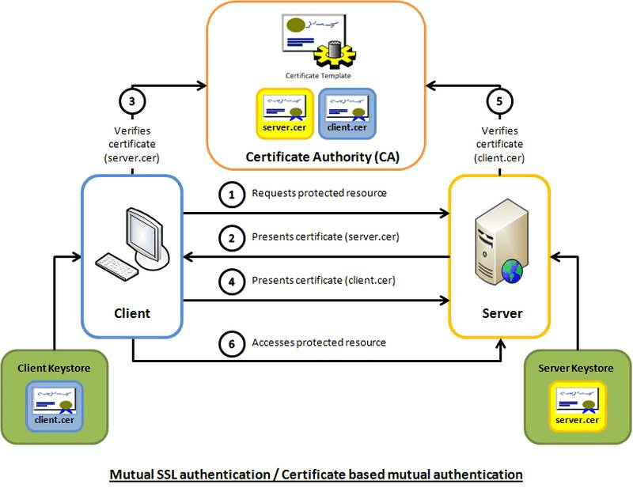

# 最小化微服务漏洞 / Minimize Microservice Vulnerabilities  

## 1. 使用PSP，OPA，安全上下文提高安全性

### 了解并配置Pod安全策略 （PSP）

PodSecurityPolicy是Kubernetes集群级别的资源（cluster-level resource），控制Pod需要遵循的安全规范。我们可以通过PodSecurityPolicy来限制大多数Pod以有限访问权限运行，同时只允许少数Pod以特殊权限运行。

你可以将PodSecurityPolicy视为评估Pod是否满足其定义的安全属性。只有那些满足PodSecurityPolicy所定义的安全属性要求的Pod才会被允许进入集群。例如，PodSecurityPolicy可以用来阻止特权Pod的启动。以下是PodSecurityPolicy的主要安全属性：

- **privileged**：确定pod是否可以在特权模式下运行。
- **hostPID**：确定pod是否可以使用主机PID命名空间。
- **hostNetwork**：确定pod是否可以使用主机网络命名空间。
- **hostIPC**：确定pod是否可以使用主机IPC命名空间。默认设置为true。
- **allowedCapabilities**：指定可添加到容器的**capabilities**列表。默认设置为空。
- **defaultAddCapabilities**：指定默认情况下将添加到容器的**capabilities**列表。默认设置为空。
- **requiredDropCapabilities**：指定将从容器中删除的**capabilities**列表。请注意，不能在**allowedCapabilities**和**requiredDropCapabilities**字段中同时指定功能。默认设置为空。
- **readOnlyRootFilesystem**：当设置为true时，PodSecurityPolicy将强制容器使用只读根文件系统运行。如果该属性在容器的安全上下文中显式设置为false，pod将被拒绝运行。默认设置为false。
- **runAsUser**：指定可在pod和容器的安全上下文中允许设置的用户id。默认设置允许所有。
- **runAsGroup**：指定可在pod和容器的安全上下文中允许设置的组id。默认设置允许所有。
- **allowPrivilegeEscalation**：确定pod是否可以提交请求以允许权限提升。默认设置为true。
- **allowedHostPaths**：指定可由pod挂载的宿主机路径列表。默认设置允许所有。
- **volumes**：指定可由pod挂载的卷类型的列表。例如，secret、configmap和hostpath都是有效的卷类型。默认设置允许所有。
- **seLinux**：指定可在pod和容器的安全上下文中允许设置的seLinux标签。默认设置允许所有。

我们来看一个PodSecurityPolicy的例子：

```yaml
apiVersion: policy/v1beta1
kind: PodSecurityPolicy
metadata:
    name: example
spec:
  allowedCapabilities:
  - NET_ADMIN
  - IPC_LOCK
  allowedHostPaths:
  - pathPrefix: /dev
  - pathPrefix: /run
  fsGroup:
    rule: RunAsAny
  hostNetwork: true
  privileged: true
  runAsUser:
    rule: RunAsAny
  supplementalGroups:
    rule: RunAsAny
  volumes:
  - hostPath
  - secret
```

这个PodSecurityPolicy允许NET_ADMIN和IPC_LOCK，允许Pod挂载卷，secret和hostPath，且hostPath只能是`/dev`或者`/run`开头的路径。它不强制任何文件系统组ID或补充组，还允许容器以任何用户身份运行、访问主机网络名称空间和作为特权容器运行。

#### 启用PodSecurityPolicy

PodSecurityPolicy是以admission controller的方式存在，且默认是不开启的，但一般推荐开启此功能。

> Kubernetes 1.21 starts the deprecation process for PodSecurityPolicy. As with all feature deprecations, PodSecurityPolicy will continue to be fully functional for several more releases. The current plan is to remove PSP from Kubernetes in the 1.25 release.
>
> ## Why is PodSecurityPolicy going away?
>
> In the years since PodSecurityPolicy was first introduced, we have realized that PSP has some serious usability problems that can’t be addressed without making breaking changes.
>
> The way PSPs are applied to Pods has proven confusing to nearly everyone that has attempted to use them. It is easy to accidentally grant broader permissions than intended, and difficult to inspect which PSP(s) apply in a given situation. The “changing Pod defaults” feature can be handy, but is only supported for certain Pod settings and it’s not obvious when they will or will not apply to your Pod. Without a “dry run” or audit mode, it’s impractical to retrofit PSP to existing clusters safely, and it’s impossible for PSP to ever be enabled by default.（总结成一句话就是 PSP 不好用，很多人还不会用，还经常用错，导致集群出现问题。）

可以通过修改`/etc/kubernetes/manifests/kube-apiserver.yaml`，在`--enable-admission-plugins`字段中添加字段`PodSecurityPolicy`开启功能。

```yaml
apiVersion: v1
kind: Pod
metadata:
  annotations:
    kubeadm.kubernetes.io/kube-apiserver.advertise-address.endpoint: 192.168.56.101:6443
  creationTimestamp: null
  labels:
    component: kube-apiserver
    tier: control-plane
  name: kube-apiserver
  namespace: kube-system
spec:
  containers:
  - command:
    - kube-apiserver
    - --advertise-address=192.168.56.101
    - --allow-privileged=true
    - --authorization-mode=Node,RBAC
    - --client-ca-file=/etc/kubernetes/pki/ca.crt
    - --enable-admission-plugins=NodeRestriction,PodSecurityPolicy    # THIS LINE
   ...
```

#### 实践：使用PodSecurityPolicy

##### 1. 创建 PodSecurityPolicy

```shell
# 创建Namespace
[root@k8s-master1 manifests]# kubectl create ns psp
namespace/psp created
# 创建PodSecurityPolicy
[root@k8s-master1 psp]# kubectl create -f unprivileged-psp.yaml
podsecuritypolicy.policy/unprivileged created
# 创建ServiceAccount
[root@k8s-master1 psp]# kubectl create serviceaccount psp -n psp
serviceaccount/psp created
```

```yaml
---
apiVersion: policy/v1beta1
kind: PodSecurityPolicy
metadata:
  name: unprivileged
spec:
  privileged: false
  allowPrivilegeEscalation: false
  allowedCapabilities:
  - '*'
  volumes:
  - '*'
  hostNetwork: false
  hostIPC: false
  hostPID: false
  seLinux:
    rule: RunAsAny
  runAsUser:
    rule: RunAsAny
  runAsGroup:
    rule: RunAsAny
  supplementalGroups:
    rule: RunAsAny
  fsGroup:
    rule: RunAsAny
```

测试namespace psp下的serviceaccount psp是否有权限使用podsecuritypolicy/unprivileged？

```shell
# 使用Namespace psp下的serviceaccount psp，测试是否可以使用podsecuritypolicy/unprivileged
[root@k8s-master1 psp]# kubectl --as=system:serviceaccount:psp:psp -n psp auth can-i use podsecuritypolicy/unprivileged
Warning: resource 'podsecuritypolicies' is not namespace scoped in group 'policy'
no
```

测试结果显示，

Namespace psp下的serviceaccount psp没有权限使用podsecuritypolicy/unprivileged。需要创建对应的Role和RoleBinding，namespace psp下的serviceaccount psp才有权限使用podsecuritypolicy/unprivileged。

如果不赋予`system:serviceaccount:psp`使用podsecuritypolicy/unprivileged的权限，那么将无法创建Pod。你将看到如下报错。

```shell
kubectl --as=system:serviceaccount:psp:psp -n psp create -f- <<EOF
apiVersion: v1
kind: Pod
metadata:
  name: nginx
  namespace: psp
spec:
  containers:
    - name: nginx
      image: nginx:1.19.5
EOF
```

```shell
Error from server (Forbidden): error when creating "STDIN": pods is forbidden: User "system:serviceaccount:psp:psp" cannot create resource "pods" in API group "" in the namespace "psp"
```

##### 2. 创建Role 和 RoleBinding

```shell
[root@k8s-master1 psp]# kubectl create -f unprivileged-psp-role-rolebinding.yaml 
role.rbac.authorization.k8s.io/psp:unprivileged created
rolebinding.rbac.authorization.k8s.io/psp:unprivileged created
```

```yaml
---
apiVersion: rbac.authorization.k8s.io/v1
kind: Role
metadata:
  name: psp:unprivileged
  namespace: psp
rules:
- apiGroups:
  - policy
  resourceNames:
  - unprivileged
  resources:
  - podsecuritypolicies
  verbs:
  - use

---
apiVersion: rbac.authorization.k8s.io/v1
kind: RoleBinding
metadata:
  name: psp:unprivileged
  namespace: psp
roleRef:
  apiGroup: rbac.authorization.k8s.io
  kind: Role
  name: psp:unprivileged
# 将Role绑定给namespace psp下所有的ServiceAccount
subjects:
- kind: Group
  name: system:serviceaccounts:psp
  apiGroup: rbac.authorization.k8s.io
```

再次，测试namespace psp下的serviceaccount psp是否有权限使用podsecuritypolicy/unprivileged？

```shell
[root@k8s-master1 psp]# kubectl --as=system:serviceaccount:psp:psp -n psp auth can-i use podsecuritypolicy/unprivileged
Warning: resource 'podsecuritypolicies' is not namespace scoped in group 'policy'
yes
```

从测试结果可以看出，已经有权限可以使用podsecuritypolicy/unprivileged。

理论上可以正常创建Pod了。

##### 3. 创建 Pod 并使用 PodSecurityPolicy

```shell
kubectl --as=system:serviceaccount:psp:psp -n psp create -f- <<EOF
apiVersion: v1
kind: Pod
metadata:
  name: nginx
  namespace: psp
spec:
  containers:
    - name: nginx
      image: nginx:1.19.5
EOF
```

但是，依然提示错误，错误信息如下：

```shell
Error from server (Forbidden): error when creating "STDIN": pods is forbidden: User "system:serviceaccount:psp:psp" cannot create resource "pods" in API group "" in the namespace "psp"
```

从错误信息中，可以大致判断出，serviceaccount psp没有创建pod的权限，赋予相应的权限即可，命令如下：

```shell
[root@k8s-master1 psp]# kubectl create rolebinding cluster-role-edit --clusterrole=edit --serviceaccount=psp:psp -n psp
rolebinding.rbac.authorization.k8s.io/cluster-role-edit created
```

这个时候，就真的可以创建Pod成功了。

```shell
pod/nginx created
```

如果，我们这时创建一个特权Pod会发生什么？

```shell
kubectl --as=system:serviceaccount:psp:psp -n psp create -f- <<EOF
apiVersion: v1
kind: Pod
metadata:
  name: nginx
  namespace: psp
spec:
  containers:
    - name: nginx
      image: nginx:1.19.5
      securityContext:
        privileged: true  # THIS LINE
EOF
```

因为`privileged: true`违反了podsecuritypolicy/unprivileged定义的规则，则Pod创建失败，报错信息如下：

```shell
Error from server (Forbidden): error when creating "STDIN": pods "nginx" is forbidden: PodSecurityPolicy: unable to admit pod: [spec.containers[0].securityContext.privileged: Invalid value: true: Privileged containers are not allowed spec.containers[0].securityContext.privileged: Invalid value: true: Privileged containers are not allowed spec.containers[0].securityContext.privileged: Invalid value: true: Privileged containers are not allowed]
```

**Kubernetes 将在 v1.21 中弃用 PSP（PodSecurityPolicy），并将在 v1.25 中移除该 API。**因此不建议在生产环境中使用PodSecurityPolicy，但是目前CKS考试题目中还会有PodSecurityPolicy，大家还是需要掌握一下。

> Kubernetes 将弃用 PSP https://mp.weixin.qq.com/s/6W7i1rtcdH8ZLnTVhKZeKw

### 了解并配置OPA Gatekeeper

Open Policy Agent Gatekeeper 可以作为PodSecurityPolicy的替代者，帮助在Kubernetes环境中执行安全策略和加强集群的安全治理。OPA Gatekeeper跟PSP一样，以admission controller的方式存在，准确的说是验证许可控制器/validating admission controller。

这是一个开源工具，符合 CNCF 社区行为规范（CNCF Code of conduct）的开源项目。

接下来，我们将研究如何将 OPA Gatekeeper 用作验证许可控制器是如何工作的。

我们通过实践的例子来了解 OPA Gatekeeper 是如何工作的？


#### 实践：安装并使用 OPA Gatekeeper

##### 1. 安装

你可以通过以下命令安装OPA Gatekeeper：

```
kubectl apply -f https://raw.githubusercontent.com/open-policy-agent/gatekeeper/release-3.1/deploy/gatekeeper.yaml
```

##### 2. 使用

假设我们现在有这样一个需求，所有创建的Kubernetes命名空间需要包含“gatekeeper”标签。对于使用OPA Gatekeeper来说，我们需要创建 `Constraint Templates` 和对应的 `Constraints`。两者的关系好比Java的方法和Java的方法入参。

###### Constraint Templates

下面是一个`Constraint Templates`示例，它要求`Constraints`所描述的标签都必须存在：

```yaml
apiVersion: templates.gatekeeper.sh/v1beta1
kind: ConstraintTemplate
metadata:
  name: k8srequiredlabels
spec:
  crd:
    spec:
      names:
        kind: K8sRequiredLabels
      validation:
        # Schema for the `parameters` field
        openAPIV3Schema:
          properties:
            labels:
              type: array
              items: string
  targets:
    - target: admission.k8s.gatekeeper.sh
      rego: |
        package k8srequiredlabels

        violation[{"msg": msg, "details": {"missing_labels": missing}}] {
          provided := {label | input.review.object.metadata.labels[label]}
          required := {label | label := input.parameters.labels[_]}
          missing := required - provided
          count(missing) > 0
          msg := sprintf("you must provide labels: %v", [missing])
        }
```

运行以下命令创建 `ConstraintTemplate` ：

```shell
kubectl apply -f https://raw.githubusercontent.com/open-policy-agent/gatekeeper/master/demo/basic/templates/k8srequiredlabels_template.yaml
```

###### Constraints

然后使用`Constraints`来执行约束。此`Constraints`使用上面`ConstraintTemplate` 中定义的`K8sRequiredLabels`模板来确保在所有命名空间的yaml文件中必须包含“gatekeeper”标签。

```yaml
apiVersion: constraints.gatekeeper.sh/v1beta1
kind: K8sRequiredLabels
metadata:
  name: ns-must-have-gk
spec:
  match:
    kinds:
      - apiGroups: [""]
        kinds: ["Namespace"]
  parameters:
    labels: ["gatekeeper"]
```

运行以下命令创建 `Constraints`：

```shell
kubectl apply -f https://raw.githubusercontent.com/open-policy-agent/gatekeeper/master/demo/basic/constraints/all_ns_must_have_gatekeeper.yaml
```

##### 3. 验证：

###### 创建Namespace，**不包含**“gatekeeper”标签。

```yaml
# ns-do-no-have-label-gk.yaml
apiVersion: v1
kind: Namespace
metadata:
  name: "test"
```

运行 `kubectl create -f ns-do-no-have-label-gk.yaml`，提示以下报错。

```shell
[root@shc-sma-cd74 ~]# kubectl create -f ns-has-label-gk.yaml             
Error from server ([ns-must-have-gk] you must provide labels: {"gatekeeper"}): error when creating "ns-has-label-gk.yaml": admission webhook "validation.gatekeeper.sh" denied the request: [ns-must-have-gk] you must provide labels: {"gatekeeper"}
```

###### 创建Namespace，**包含**“gatekeeper”标签。Namespace可以正常创建。

```yaml
# ns-has-label-gk.yaml
apiVersion: v1
kind: Namespace
metadata:
  name: "test"
  labels:
    gatekeeper: "abc"
```

> 参考资料：
>
> https://open-policy-agent.github.io/gatekeeper/website/docs/howto/

##### 更多 OPA Gatekeeper的使用示例

https://github.com/open-policy-agent/gatekeeper-library 是一个社区维护的OPA Gatekeeper的使用示例。

###### 拒绝所有来自`docker.io/library/`的images

提供如下的 Constraint Templates 和 Constraints：

**Constraint Templates**

```yaml
# Constraint Templates
# blacklistimages_template.yaml
---
apiVersion: templates.gatekeeper.sh/v1beta1
kind: ConstraintTemplate
metadata:
  name: blacklistimages
spec:
  crd:
    spec:
      names:
        kind: BlacklistImages
  targets:
  - target: admission.k8s.gatekeeper.sh
    rego: |
      package k8strustedimages
      images {
        image := input.review.object.spec.containers[_].image
        not startswith(image, "docker-fake.io/")
        not startswith(image, "google-gcr-fake.com/")
      }
      violation[{"msg": msg}] {
        not images
        msg := "not trusted image!"
      }
```

**Constraints**

```yaml
# Constraints
# pod-trusted-images.yaml
---
apiVersion: constraints.gatekeeper.sh/v1beta1
kind: BlacklistImages
metadata:
  name: pod-trusted-images
spec:
  match:
    kinds:
    - apiGroups:
      - ""
      kinds:
      - Pod
```


**实操：**

```shell
[root@shc-sma-cd74 ~]# kubectl get crd
NAME                                                 CREATED AT
blacklistimages.constraints.gatekeeper.sh            2021-01-19T14:21:12Z
configs.config.gatekeeper.sh                         2021-01-19T09:29:15Z
constraintpodstatuses.status.gatekeeper.sh           2021-01-19T09:29:16Z
constrainttemplatepodstatuses.status.gatekeeper.sh   2021-01-19T09:29:17Z
constrainttemplates.templates.gatekeeper.sh          2021-01-19T09:29:18Z

[root@shc-sma-cd74 ~]# kubectl get constrainttemplates
NAME              AGE
blacklistimages   15h
[root@shc-sma-cd74 ~]# kubectl edit constrainttemplates blacklistimages
---
apiVersion: templates.gatekeeper.sh/v1beta1
kind: ConstraintTemplate
metadata:
  name: blacklistimages
spec:
  crd:
    spec:
      names:
        kind: BlacklistImages
  targets:
  - target: admission.k8s.gatekeeper.sh
    rego: |
      package k8strustedimages
      images {
        image := input.review.object.spec.containers[_].image
        not startswith(image, "docker-fake.io/")
        not startswith(image, "google-gcr-fake.com/")
        not startswith(image, "docker.io/library/")    # Add this line
      }
      violation[{"msg": msg}] {
        not images
        msg := "not trusted image!"
      }
```

**验证：**

```yaml
# hello-blacklistimages.yaml
---
apiVersion: v1
kind: Pod
metadata:
  name: hello-blacklistimages
spec:
  containers:
  - image: docker.io/library/busybox
    imagePullPolicy: IfNotPresent
    name: hello
    command: [ "sh", "-c", "echo 'Hello blacklistimages!' && sleep 1h" ]
```

创建`hello-blacklistimages.yaml`，提示错误：

```shell
$ kubectl create -f hello-blacklistimages.yaml 
Error from server ([pod-trusted-images] not trusted image!): error when creating "hello-blacklistimages.yaml": admission webhook "validation.gatekeeper.sh" denied the request: [pod-trusted-images] not trusted image!
```


##### 模拟运行 / Dry Run

当向正在运行的Kubernetes集群应用新的约束（`Constraints`）时，模拟运行（Dry Run）会很有帮助，因为它允许在集群中部署约束，测试约束，而不必强制执行它们。在约束的“status”字段中显示遇到的违规信息。
如果要使用模拟运行，请将`enforcementAction:dryrun`添加到`Constraints`中，`enforcementAction`的默认值为`deny`，默认行为是拒绝任何违规的准入请求。

以下是`enforcementAction:dryrun`的例子：

```yaml
apiVersion: constraints.gatekeeper.sh/v1beta1
kind: K8sRequiredLabels
metadata:
  name: ns-must-have-gk
spec:
  enforcementAction: dryrun    # SEE HERE
  match:
    kinds:
      - apiGroups: [""]
        kinds: ["Namespace"]
  parameters:
    labels: ["gatekeeper"]
status:
  auditTimestamp: "2019-08-15T01:46:13Z"
  enforced: true
  violations:
  - enforcementAction: dryrun      # SEE HERE
    kind: Namespace
    message: 'you must provide labels: {"gatekeeper"}'
    name: default
  - enforcementAction: dryrun
    kind: Namespace
    message: 'you must provide labels: {"gatekeeper"}'
    name: gatekeeper-system
```

#### 紧急恢复 / Emergency Recovery

如果出现OPA Gatekeeper使Kubernetes集群运行不正常的情况，可以禁用OPA Gatekeeper的webhook，这将跳过所有OPA Gatekeeper的准入检查，从而使Kubernetes集群恢复正常。

运行以下命令禁用OPA Gatekeeper的webhook。删除前，记得备份gatekeeper-validating-webhook-configuration，重新创建gatekeeper-validating-webhook-configuration可以重新启用OPA Gatekeeper。

```shell
kubectl delete validatingwebhookconfigurations.admissionregistration.k8s.io gatekeeper-validating-webhook-configuration
```

#### 卸载

你可以通过以下命令卸载OPA Gatekeeper：

```shell
kubectl delete -f https://raw.githubusercontent.com/open-policy-agent/gatekeeper/master/deploy/gatekeeper.yaml
```

> 参考资料：
>
> https://github.com/open-policy-agent/gatekeeper
>
> https://open-policy-agent.github.io/gatekeeper/website/docs/howto/
>
> https://github.com/open-policy-agent/gatekeeper-library
>
> https://kubernetes.io/blog/2019/08/06/opa-gatekeeper-policy-and-governance-for-kubernetes/


### Pod Security Admission（PSA）

> Pod Security Admission 在 Kubernetes v1.23 处于 beta 版本，在 Kubernetes v1.25 已正式成为稳定版。

Pod Security Admission 是 Kubernetes 官方内置的，PodSecurityPolicy（PSP） 的继任者。

虽然 PSP 和 PSA 都以 admission controller 的方式运行， 但 PSP 和 PSA 的一个明显区别是， PSA 只支持验证许可控制器 / validating admission controller，而不支持 mutating admission controller，不能像 PSP 一样动态修改 K8s 对象资源。

在了解怎么使用 Pod Security Admission（PSA）之前，我们需要先了解什么是 Pod Security Standards？

#### 什么是 Pod Security Standards？

Pod Security Standards 定义了三种不同的策略（policies），从“宽松”到“限制”不同的三种策略。策略如下：

- **Privileged**：Pod 的创建以及运行不受限制；
- **Baseline**：Pod 的创建以及运行，受最普遍的安全策略限制，适用于大多数场景。
- **Restricted**：Pod 的创建以及运行被高度限制，是最严格的安全策略，可能会导致大量现存的 Pod 不能正常启动或运行。

##### 策略详情

###### Privileged

Privileged 代表 Pod 的创建以及运行不受限制。这种类型的策略一般用于系统级别的 Pod，或者一些特权 Pod，以及一些受信任的用户创建的基础设施级别的 Pod。 

###### **Baseline**

Baseline（基线策略）是针对常见的 Pod 使用的，同时防止一些常见的特权升级问题。

下表列出了 Baseline（基线策略）包含的安全策略。

<table>
	<caption style="display:none">Baseline policy specification</caption>
	<tbody>
		<tr>
			<th>Control</th>
			<th>Policy</th>
		</tr>
		<tr>
			<td style="white-space: nowrap">HostProcess</td>
			<td>
				<p>Windows pods offer the ability to run <a href="/docs/tasks/configure-pod-container/create-hostprocess-pod">HostProcess containers</a> which enables privileged access to the Windows node. Privileged access to the host is disallowed in the baseline policy. 
				<p><strong>Restricted Fields</strong></p>
				<ul>
					<li><code>spec.securityContext.windowsOptions.hostProcess</code></li>
					<li><code>spec.containers[*].securityContext.windowsOptions.hostProcess</code></li>
					<li><code>spec.initContainers[*].securityContext.windowsOptions.hostProcess</code></li>
					<li><code>spec.ephemeralContainers[*].securityContext.windowsOptions.hostProcess</code></li>
				</ul>
				<p><strong>Allowed Values</strong></p>
				<ul>
					<li>Undefined/nil</li>
					<li><code>false</code></li>
				</ul>
			</td>
		</tr>
		<tr>
			<td style="white-space: nowrap">Host Namespaces</td>
			<td>
				<p>Sharing the host namespaces must be disallowed.</p>
				<p><strong>Restricted Fields</strong></p>
				<ul>
					<li><code>spec.hostNetwork</code></li>
					<li><code>spec.hostPID</code></li>
					<li><code>spec.hostIPC</code></li>
				</ul>
				<p><strong>Allowed Values</strong></p>
				<ul>
					<li>Undefined/nil</li>
					<li><code>false</code></li>
				</ul>
			</td>
		</tr>
		<tr>
			<td style="white-space: nowrap">Privileged Containers</td>
			<td>
				<p>Privileged Pods disable most security mechanisms and must be disallowed.</p>
				<p><strong>Restricted Fields</strong></p>
				<ul>
					<li><code>spec.containers[*].securityContext.privileged</code></li>
					<li><code>spec.initContainers[*].securityContext.privileged</code></li>
					<li><code>spec.ephemeralContainers[*].securityContext.privileged</code></li>
				</ul>
				<p><strong>Allowed Values</strong></p>
				<ul>
					<li>Undefined/nil</li>
					<li><code>false</code></li>
				</ul>
			</td>
		</tr>
		<tr>
			<td style="white-space: nowrap">Capabilities</td>
			<td>
				<p>Adding additional capabilities beyond those listed below must be disallowed.</p>
				<p><strong>Restricted Fields</strong></p>
				<ul>
					<li><code>spec.containers[*].securityContext.capabilities.add</code></li>
					<li><code>spec.initContainers[*].securityContext.capabilities.add</code></li>
					<li><code>spec.ephemeralContainers[*].securityContext.capabilities.add</code></li>
				</ul>
				<p><strong>Allowed Values</strong></p>
				<ul>
					<li>Undefined/nil</li>
					<li><code>AUDIT_WRITE</code></li>
					<li><code>CHOWN</code></li>
					<li><code>DAC_OVERRIDE</code></li>
					<li><code>FOWNER</code></li>
					<li><code>FSETID</code></li>
					<li><code>KILL</code></li>
					<li><code>MKNOD</code></li>
					<li><code>NET_BIND_SERVICE</code></li>
					<li><code>SETFCAP</code></li>
					<li><code>SETGID</code></li>
					<li><code>SETPCAP</code></li>
					<li><code>SETUID</code></li>
					<li><code>SYS_CHROOT</code></li>
				</ul>
			</td>
		</tr>
		<tr>
			<td style="white-space: nowrap">HostPath Volumes</td>
			<td>
				<p>HostPath volumes must be forbidden.</p>
				<p><strong>Restricted Fields</strong></p>
				<ul>
					<li><code>spec.volumes[*].hostPath</code></li>
				</ul>
				<p><strong>Allowed Values</strong></p>
				<ul>
					<li>Undefined/nil</li>
				</ul>
			</td>
		</tr>
		<tr>
			<td style="white-space: nowrap">Host Ports</td>
			<td>
				<p>HostPorts should be disallowed, or at minimum restricted to a known list.</p>
				<p><strong>Restricted Fields</strong></p>
				<ul>
					<li><code>spec.containers[*].ports[*].hostPort</code></li>
					<li><code>spec.initContainers[*].ports[*].hostPort</code></li>
					<li><code>spec.ephemeralContainers[*].ports[*].hostPort</code></li>
				</ul>
				<p><strong>Allowed Values</strong></p>
				<ul>
					<li>Undefined/nil</li>
					<li>Known list</li>
					<li><code>0</code></li>
				</ul>
			</td>
		</tr>
		<tr>
			<td style="white-space: nowrap">AppArmor</td>
			<td>
				<p>On supported hosts, the <code>runtime/default</code> AppArmor profile is applied by default. The baseline policy should prevent overriding or disabling the default AppArmor profile, or restrict overrides to an allowed set of profiles.</p>
				<p><strong>Restricted Fields</strong></p>
				<ul>
					<li><code>metadata.annotations["container.apparmor.security.beta.kubernetes.io/*"]</code></li>
				</ul>
				<p><strong>Allowed Values</strong></p>
				<ul>
					<li>Undefined/nil</li>
					<li><code>runtime/default</code></li>
					<li><code>localhost/*</code></li>
				</ul>
			</td>
		</tr>
		<tr>
			<td style="white-space: nowrap">SELinux</td>
			<td>
				<p>Setting the SELinux type is restricted, and setting a custom SELinux user or role option is forbidden.</p>
				<p><strong>Restricted Fields</strong></p>
				<ul>
					<li><code>spec.securityContext.seLinuxOptions.type</code></li>
					<li><code>spec.containers[*].securityContext.seLinuxOptions.type</code></li>
					<li><code>spec.initContainers[*].securityContext.seLinuxOptions.type</code></li>
					<li><code>spec.ephemeralContainers[*].securityContext.seLinuxOptions.type</code></li>
				</ul>
				<p><strong>Allowed Values</strong></p>
				<ul>
					<li>Undefined/""</li>
					<li><code>container_t</code></li>
					<li><code>container_init_t</code></li>
					<li><code>container_kvm_t</code></li>
				</ul>
				<hr />
				<p><strong>Restricted Fields</strong></p>
				<ul>
					<li><code>spec.securityContext.seLinuxOptions.user</code></li>
					<li><code>spec.containers[*].securityContext.seLinuxOptions.user</code></li>
					<li><code>spec.initContainers[*].securityContext.seLinuxOptions.user</code></li>
					<li><code>spec.ephemeralContainers[*].securityContext.seLinuxOptions.user</code></li>
					<li><code>spec.securityContext.seLinuxOptions.role</code></li>
					<li><code>spec.containers[*].securityContext.seLinuxOptions.role</code></li>
					<li><code>spec.initContainers[*].securityContext.seLinuxOptions.role</code></li>
					<li><code>spec.ephemeralContainers[*].securityContext.seLinuxOptions.role</code></li>
				</ul>
				<p><strong>Allowed Values</strong></p>
				<ul>
					<li>Undefined/""</li>
				</ul>
			</td>
		</tr>
		<tr>
			<td style="white-space: nowrap"><code>/proc</code> Mount Type</td>
			<td>
				<p>The default <code>/proc</code> masks are set up to reduce attack surface, and should be required.</p>
				<p><strong>Restricted Fields</strong></p>
				<ul>
					<li><code>spec.containers[*].securityContext.procMount</code></li>
					<li><code>spec.initContainers[*].securityContext.procMount</code></li>
					<li><code>spec.ephemeralContainers[*].securityContext.procMount</code></li>
				</ul>
				<p><strong>Allowed Values</strong></p>
				<ul>
					<li>Undefined/nil</li>
					<li><code>Default</code></li>
				</ul>
			</td>
		</tr>
		<tr>
  			<td>Seccomp</td>
  			<td>
  				<p>Seccomp profile must not be explicitly set to <code>Unconfined</code>.</p>
  				<p><strong>Restricted Fields</strong></p>
				<ul>
					<li><code>spec.securityContext.seccompProfile.type</code></li>
					<li><code>spec.containers[*].securityContext.seccompProfile.type</code></li>
					<li><code>spec.initContainers[*].securityContext.seccompProfile.type</code></li>
					<li><code>spec.ephemeralContainers[*].securityContext.seccompProfile.type</code></li>
				</ul>
				<p><strong>Allowed Values</strong></p>
				<ul>
					<li>Undefined/nil</li>
					<li><code>RuntimeDefault</code></li>
					<li><code>Localhost</code></li>
				</ul>
  			</td>
  		</tr>
		<tr>
			<td style="white-space: nowrap">Sysctls</td>
			<td>
				<p>Sysctls can disable security mechanisms or affect all containers on a host, and should be disallowed except for an allowed "safe" subset. A sysctl is considered safe if it is namespaced in the container or the Pod, and it is isolated from other Pods or processes on the same Node.</p>
				<p><strong>Restricted Fields</strong></p>
				<ul>
					<li><code>spec.securityContext.sysctls[*].name</code></li>
				</ul>
				<p><strong>Allowed Values</strong></p>
				<ul>
					<li>Undefined/nil</li>
					<li><code>kernel.shm_rmid_forced</code></li>
					<li><code>net.ipv4.ip_local_port_range</code></li>
					<li><code>net.ipv4.ip_unprivileged_port_start</code></li>
					<li><code>net.ipv4.tcp_syncookies</code></li>
					<li><code>net.ipv4.ping_group_range</code></li>
				</ul>
			</td>
		</tr>
	</tbody>
</table>

###### Restricted

Restricted，受限制的策略，Pod 的创建以及运行将被高度限制，是最严格的安全策略，可能会导致大量现存的 Pod 不能正常启动或运行。

此策略是为了强化 Pod 的安全最佳实践，但会牺牲一定的兼容性。

下表列出了 Restricted（受限制的策略）包含的安全策略。
<table>
	<caption style="display:none">Restricted policy specification</caption>
	<tbody>
		<tr>
			<td><strong>Control</strong></td>
			<td><strong>Policy</strong></td>
		</tr>
		<tr>
			<td colspan="2"><em>Everything from the baseline profile.</em></td>
		</tr>
		<tr>
			<td style="white-space: nowrap">Volume Types</td>
			<td>
				<p>The restricted policy only permits the following volume types.</p>
				<p><strong>Restricted Fields</strong></p>
				<ul>
					<li><code>spec.volumes[*]</code></li>
				</ul>
				<p><strong>Allowed Values</strong></p>
				Every item in the <code>spec.volumes[*]</code> list must set one of the following fields to a non-null value:
				<ul>
					<li><code>spec.volumes[*].configMap</code></li>
					<li><code>spec.volumes[*].csi</code></li>
					<li><code>spec.volumes[*].downwardAPI</code></li>
					<li><code>spec.volumes[*].emptyDir</code></li>
					<li><code>spec.volumes[*].ephemeral</code></li>
					<li><code>spec.volumes[*].persistentVolumeClaim</code></li>
					<li><code>spec.volumes[*].projected</code></li>
					<li><code>spec.volumes[*].secret</code></li>
				</ul>
			</td>
		</tr>
		<tr>
			<td style="white-space: nowrap">Privilege Escalation (v1.8+)</td>
			<td>
				<p>Privilege escalation (such as via set-user-ID or set-group-ID file mode) should not be allowed. <em><a href="#policies-specific-to-linux">This is Linux only policy</a> in v1.25+ <code>(spec.os.name != windows)</code></em></p>
				<p><strong>Restricted Fields</strong></p>
				<ul>
					<li><code>spec.containers[*].securityContext.allowPrivilegeEscalation</code></li>
					<li><code>spec.initContainers[*].securityContext.allowPrivilegeEscalation</code></li>
					<li><code>spec.ephemeralContainers[*].securityContext.allowPrivilegeEscalation</code></li>
				</ul>
				<p><strong>Allowed Values</strong></p>
				<ul>
					<li><code>false</code></li>
				</ul>
			</td>
		</tr>
		<tr>
			<td style="white-space: nowrap">Running as Non-root</td>
			<td>
				<p>Containers must be required to run as non-root users.</p>
				<p><strong>Restricted Fields</strong></p>
				<ul>
					<li><code>spec.securityContext.runAsNonRoot</code></li>
					<li><code>spec.containers[*].securityContext.runAsNonRoot</code></li>
					<li><code>spec.initContainers[*].securityContext.runAsNonRoot</code></li>
					<li><code>spec.ephemeralContainers[*].securityContext.runAsNonRoot</code></li>
				</ul>
				<p><strong>Allowed Values</strong></p>
				<ul>
					<li><code>true</code></li>
				</ul>
				<small>
					The container fields may be undefined/<code>nil</code> if the pod-level
					<code>spec.securityContext.runAsNonRoot</code> is set to <code>true</code>.
				</small>
			</td>
		</tr>
		<tr>
			<td style="white-space: nowrap">Running as Non-root user (v1.23+)</td>
			<td>
				<p>Containers must not set <tt>runAsUser</tt> to 0</p>
				<p><strong>Restricted Fields</strong></p>
				<ul>
					<li><code>spec.securityContext.runAsUser</code></li>
					<li><code>spec.containers[*].securityContext.runAsUser</code></li>
					<li><code>spec.initContainers[*].securityContext.runAsUser</code></li>
					<li><code>spec.ephemeralContainers[*].securityContext.runAsUser</code></li>
				</ul>
				<p><strong>Allowed Values</strong></p>
				<ul>
					<li>any non-zero value</li>
					<li><code>undefined/null</code></li>
				</ul>
			</td>
		</tr>
		<tr>
  			<td style="white-space: nowrap">Seccomp (v1.19+)</td>
  			<td>
  				<p>Seccomp profile must be explicitly set to one of the allowed values. Both the <code>Unconfined</code> profile and the <em>absence</em> of a profile are prohibited. <em><a href="#policies-specific-to-linux">This is Linux only policy</a> in v1.25+ <code>(spec.os.name != windows)</code></em></p>
  				<p><strong>Restricted Fields</strong></p>
				<ul>
					<li><code>spec.securityContext.seccompProfile.type</code></li>
					<li><code>spec.containers[*].securityContext.seccompProfile.type</code></li>
					<li><code>spec.initContainers[*].securityContext.seccompProfile.type</code></li>
					<li><code>spec.ephemeralContainers[*].securityContext.seccompProfile.type</code></li>
				</ul>
				<p><strong>Allowed Values</strong></p>
				<ul>
					<li><code>RuntimeDefault</code></li>
					<li><code>Localhost</code></li>
				</ul>
				<small>
					The container fields may be undefined/<code>nil</code> if the pod-level
					<code>spec.securityContext.seccompProfile.type</code> field is set appropriately.
					Conversely, the pod-level field may be undefined/<code>nil</code> if _all_ container-
					level fields are set.
				</small>
  			</td>
  		</tr>
		  <tr>
			<td style="white-space: nowrap">Capabilities (v1.22+)</td>
			<td>
				<p>
					Containers must drop <code>ALL</code> capabilities, and are only permitted to add back
 					the <code>NET_BIND_SERVICE</code> capability. <em><a href="#policies-specific-to-linux">This is Linux only policy</a> in v1.25+ <code>(.spec.os.name != "windows")</code></em>
				</p>
				<p><strong>Restricted Fields</strong></p>
				<ul>
					<li><code>spec.containers[*].securityContext.capabilities.drop</code></li>
					<li><code>spec.initContainers[*].securityContext.capabilities.drop</code></li>
					<li><code>spec.ephemeralContainers[*].securityContext.capabilities.drop</code></li>
				</ul>
				<p><strong>Allowed Values</strong></p>
				<ul>
					<li>Any list of capabilities that includes <code>ALL</code></li>
				</ul>
				<hr />
				<p><strong>Restricted Fields</strong></p>
				<ul>
					<li><code>spec.containers[*].securityContext.capabilities.add</code></li>
					<li><code>spec.initContainers[*].securityContext.capabilities.add</code></li>
					<li><code>spec.ephemeralContainers[*].securityContext.capabilities.add</code></li>
				</ul>
				<p><strong>Allowed Values</strong></p>
				<ul>
					<li>Undefined/nil</li>
					<li><code>NET_BIND_SERVICE</code></li>
				</ul>
			</td>
		</tr>
	</tbody>
</table>


##### 策略模式

一旦 PSA 功能被启用或webhook安装,您可以配置名称空间定义允许控制舱安全模式下您想要使用在每个名称空间。Kubernetes定义了一组标签,您可以设置定义预定义的豆荚安全标准水平您想要使用一个名称空间。您选择的标签定义了控制平面需要什么行动如果检测到潜在的违反:

我们可以为 PSA 的安全策略指定不同的运行模式，有以下三种模式：

###### **enforce**

任何违反预定义安全策略的 Pod 将被拒绝创建以及运行。

###### **audit**

违反预定义安全策略的 Pod 将被允许创建以及运行，但会在 Pod 上添加一个 audit annotation，指示此 Pod 违反的安全策略。

###### **warn**

违反预定义安全策略的 Pod 将被允许创建以及运行，但会返回警告信息给用户。 

除了可以指定策略模式，我们还可以将策略模式应用于特定的 Kubernetes 版本，例如将某策略模式只应用于 Kubernetes v1.22。这样可以避免 Kubernetes 在版本升级时，假设有安全策略的变化，依然保持原行为的一致性。


#### 为 Namespace 应用 PSA

通过为 Namespace 打 Label 的方式，我们可以为 Namespace 添加一个或多个 PSA 策略及策略模式。

- REQUIRED: `pod-security.kubernetes.io/<MODE>: <LEVEL>`
- OPTIONAL: `pod-security.kubernetes.io/<MODE>-version: <VERSION>` (defaults to latest)

```sh
# The per-mode level label indicates which policy level to apply for the mode.
#
# MODE must be one of `enforce`, `audit`, or `warn`.
# LEVEL must be one of `privileged`, `baseline`, or `restricted`.
pod-security.kubernetes.io/<MODE>: <LEVEL>

# Optional: per-mode version label that can be used to pin the policy to the
# version that shipped with a given Kubernetes minor version (for example v1.25).
#
# MODE must be one of `enforce`, `audit`, or `warn`.
# VERSION must be a valid Kubernetes minor version, or `latest`.
pod-security.kubernetes.io/<MODE>-version: <VERSION>
```


##### 为命名空间 `test-ns` 应用 Pod Security Standard：

- 策略：baseline
- 策略模式：warn
- K8s 版本：v1.22

```sh
kubectl label --overwrite ns test-ns \
  pod-security.kubernetes.io/warn=baseline \
  pod-security.kubernetes.io/warn-version=v1.22
```


##### 模拟运行策略 / Dry Run

我们可以想象，一旦我们使用了“策略 Restricted + 模式 enforce”，可能会导致大量 Pod 无法正常运行。所以我们可以使用以下命令，模拟一下使用了 “策略 Restricted + 模式 enforce” 之后的情况，评估了哪些当前运行的 Pod 可能会违反预定义的安全策略。

```sh
$ kubectl label --dry-run=server --overwrite ns --all \
    pod-security.kubernetes.io/enforce=baseline
Warning: kuard: privileged
namespace/default labeled
namespace/kube-node-lease labeled
namespace/kube-public labeled
Warning: kube-proxy-vxjwb: host namespaces, hostPath volumes, privileged
Warning: kube-proxy-zxqzz: host namespaces, hostPath volumes, privileged
Warning: kube-apiserver-kind-control-plane: host namespaces, hostPath volumes
Warning: etcd-kind-control-plane: host namespaces, hostPath volumes
Warning: kube-controller-manager-kind-control-plane: host namespaces, hostPath volumes
Warning: kindnet-cl5ln: non-default capabilities, host namespaces, hostPath volumes
Warning: kube-scheduler-kind-control-plane: host namespaces, hostPath volumes
Warning: kindnet-6ptww: non-default capabilities, host namespaces, hostPath volumes
namespace/kube-system labeled
namespace/local-path-storage labeled
```


##### 组合 Pod Security Standards

相比于仅设置一种策略模式，往往我们可以设置多组“策略 + 模式”，提供不同维度的安全防护。例如强制执行某策略，但另一策略只需要 审计 audit 即可。如如下所示：

```sh
apiVersion: v1
kind: Namespace
metadata:
  name: test-ns
  labels:
    pod-security.kubernetes.io/enforce: baseline
    pod-security.kubernetes.io/audit: restricted
    pod-security.kubernetes.io/warn: restricted
```

强制执行 baseline 预定义安全策略，而对于 restricted 预定义安全策略，我们只要求添加审计 audit 和警示信息即可。

###### 演示 Pod Security Standards

我们创建一个 Nginx Pod 来演示上图 Pod Security Standards 的效果：

```yaml
# 创建如下的 Nginx Pod
apiVersion: v1
kind: Pod
metadata:
  name: nginx
spec:
  containers:
    - image: nginx
      name: nginx
      ports:
        - containerPort: 80
```

在控制台，我们将看到如下的警示信息（warning）。列出了 Pod 违反的 restricted 的预定义安全策略，以及补救措施。因 Pod 没有违反 baseline 的预定义安全策略，所以 Pod 成功创建。  

```sh
$ kubectl apply -f pod.yaml
Warning: would violate "latest" version of "restricted" PodSecurity profile: allowPrivilegeEscalation != false (container "nginx" must set securityContext.allowPrivilegeEscalation=false), unrestricted capabilities (container "nginx" must set securityContext.capabilities.drop=["ALL"]), runAsNonRoot != true (pod or container "nginx" must set securityContext.runAsNonRoot=true), seccompProfile (pod or container "nginx" must set securityContext.seccompProfile.type to "RuntimeDefault" or "Localhost")
pod/nginx created
laevenso@feu [(⎈ |kind-kind:test-ns)]  in ~
$ kubectl get pods
NAME    READY   STATUS    RESTARTS   AGE
nginx   1/1     Running   0          6s
```


##### 为所有 Namespace 应用 Pod Security Standards

除了用为 Namespace 添加 Label 的方式，来配置 Pod Security Standards 之外。我们还可以使用 AdmissionConfiguration 资源配置集群范围的安全策略和豁免策略。

使用 AdmissionConfiguration 资源添加的 Pod Security Standards 将被应用于所有的 Namespace，但通过 Namespace 标签的方式添加的 Pod Security Standards，优先级更高。

但 Kubernetes 没有提供 restful api 来创建 AdmissionConfiguration 资源，需要集群管理员将 AdmissionConfiguration 配置文件放到指定路径下 `--admission-control-config-file`。

例如，我们创建如下的 AdmissionConfiguration 配置文件，强制执行 baseline 预定义安全策略，而对于 restricted 预定义安全策略，我们只要求添加审计 audit 和警示信息即可。对于命名空间 `kube-system` 可以豁免此策略。

```sh
apiVersion: apiserver.config.k8s.io/v1
kind: AdmissionConfiguration
plugins:
- name: DefaultPodSecurity
  configuration:
    apiVersion: pod-security.admission.config.k8s.io/v1alpha1
    kind: PodSecurityConfiguration
    defaults:
      enforce: "baseline"
      enforce-version: "latest"
      audit: "restricted"
      audit-version: "latest"
      warn: "restricted"
      warn-version: "latest"
    exemptions:
      usernames: []
      runtimeClassNames: []
      namespaces: [kube-system]
```


#### 总结

与 PSP 相比，继任者 PSA 似乎是一个更简单的实现，并达到了相同的效果。预定义的安全策略，让用户更容易上手，而不需要翻阅大量的文档，了解每一个安全相关字段的含义，并编写自己的 PSP 文件。

使用”策略 + 模式“的方式，可以自由组合，提供了灵活性，同时将”策略 + 模式“应用了命名空间，也更容易使用。

个人认为，Pod Security Admission 和 Pod Security Standards，越是简单的东西，未来越有可能被大范围的使用。

并且 Pod Security Admission 在 Kubernetes v1.23 还处于 beta 版本，但在 Kubernetes v1.25 已正式成为稳定版。大家可以放心使用了。

> 参考资料：
>
> https://kubernetes.io/docs/concepts/security/pod-security-admission/
>
> https://kubernetes.io/docs/concepts/security/pod-security-standards/
>
> https://kubernetes.io/docs/tasks/configure-pod-container/enforce-standards-namespace-labels/
>
> https://medium.com/@LachlanEvenson/hands-on-with-kubernetes-pod-security-admission-b6cac495cd11


### 了解并配置Pod或容器安全上下文（securityContext）

这部分已经在 ”系统强化  System Hardening“ 章节讲过了，由此也可以看出容器安全上下文（securityContext）的重要性，不仅可以强化系统，还可以最小化微服务漏洞。

接下来，我们在简单的复习一下。

```yaml
apiVersion: v1
kind: Pod
metadata:
  name: busybox-pod
  labels:
    app: busybox
spec:
  containers:
  - name: busybox
    image: busybox
    command: [ "sh", "-c", "echo 'Hello AppArmor!' && sleep 1h" ]
    securityContext:                      # SEE HERE
      readOnlyRootFilesystem: true        # SEE HERE  
      runAsUser: 1999                     # SEE HERE
      runAsGroup: 1999                    # SEE HERE 
```

上面的容器安全上下文是什么含义？

**readOnlyRootFilesystem** 的值被设置为true，容器的根文件系统将变为只读，这意味着库文件、配置文件等都是只读的，不能被篡改。将readOnlyRootFilesystem设置为true是一种很好的安全实践。

**runAsUser** 的值被设置为 1999，代表容器中的进程将以用户 id 1999 启动。

**runAsGroup** 的值被设置为 1999，代表容器中启动的进程所属的组id 为 1999。


## 2. 管理Kubernetes Secret

### 使用Kubernetes Secret存储敏感信息

创建Kubernetes Secret时，可以使用`Secret`的`type`字段指定具体的类型，Kubernetes为一些常见的使用场景提供了几种内置的Secret类型。

| 内置类型                              | 用法                                     |
| ------------------------------------- | ---------------------------------------- |
| `Opaque`                              | 用户定义的任意数据                       |
| `kubernetes.io/service-account-token` | 服务账号令牌                             |
| `kubernetes.io/dockercfg`             | `~/.dockercfg` 文件的序列化形式          |
| `kubernetes.io/dockerconfigjson`      | `~/.docker/config.json` 文件的序列化形式 |
| `kubernetes.io/basic-auth`            | 用于基本身份认证的凭据                   |
| `kubernetes.io/ssh-auth`              | 用于 SSH 身份认证的凭据                  |
| `kubernetes.io/tls`                   | 用于 TLS 客户端或者服务器端的数据        |
| `bootstrap.kubernetes.io/token`       | 启动引导令牌数据                         |

日常使用中，较多出现的两种Secret类型是`Opaque` 和 `kubernetes.io/tls`。

`Opaque` 类型的 Secret 多用于 key value 形式的密码；

`kubernetes.io/tls` 类型的 Secret 多用于证书。

#### 使用 kubectl *命令创建*  Secret

分别使用以下命令创建Secret。

```shell
# 创建`Opaque`类型的Secret
root@ubuntu-k8s-master1:~# kubectl create secret generic my-secret --from-literal=key1=supersecret --from-literal=key2=topsecret
secret/my-secret created
root@ubuntu-k8s-master1:~# kubectl get secret my-secret -o yaml
apiVersion: v1
data:
  key1: c3VwZXJzZWNyZXQ=
  key2: dG9wc2VjcmV0
kind: Secret
metadata:
  ...
  name: my-secret
  namespace: default
type: Opaque

# 创建`kubernetes.io/tls`类型的Secret
kubectl create secret tls tls-secret --cert=path/to/tls.cert --key=path/to/tls.key
```

> 参考资料：
>
> kubectl create secret generic 命令详解 http://docs.kubernetes.org.cn/556.html
>
> kubectl create secret tls 命令详解   http://docs.kubernetes.org.cn/558.html


## 3. 在多租户环境中使用沙箱运行容器（例如gvisor，kata容器）

### 了解为什么要部署沙箱

有些Pod可能需要更高的安全性，可以对不同的Pod，使用不同的容器运行时，提供更强的隔离性。

### 什么是gVisor？

gVisor是谷歌发布的一款新型沙箱容器运行时，能够为容器提供更安全的隔离性，同时比虚拟机化技术（ VM）更轻量。

容器基于共享内核，安全性是大家关注的一大要点，而gVisor对于内核的隔离，介于容器和虚拟机之间。

gvisor的容器运行时称之为runsc。

### 实践：安装并使用 gvisor 运行 Pod

#### 1. 运行以下命令安装 runsc & containerd-shim-runsc-v1：

```shell
ARCH=$(uname -m)
URL=https://storage.googleapis.com/gvisor/releases/release/latest/${ARCH}
wget ${URL}/runsc ${URL}/runsc.sha512 ${URL}/containerd-shim-runsc-v1 ${URL}/containerd-shim-runsc-v1.sha512
sha512sum -c runsc.sha512 -c containerd-shim-runsc-v1.sha512
rm -f *.sha512
chmod a+rx runsc containerd-shim-runsc-v1
sudo mv runsc containerd-shim-runsc-v1 /usr/local/bin
```

#### 2. 配置containerd使用runsc：

```shell
# Configure containerd
sudo mkdir -p /etc/containerd
sudo containerd config default | sudo tee /etc/containerd/config.toml
# Update `/etc/containerd/config.toml`.
cat <<EOF | sudo tee /etc/containerd/config.toml
disabled_plugins = ["restart"]
[plugins.linux]
  shim_debug = true
[plugins.cri.containerd.runtimes.runsc]
  runtime_type = "io.containerd.runsc.v1"
EOF

# Restart `containerd`:
sudo systemctl restart containerd
```

#### 3. 配置RuntimeClass，使用gVisor运行Pod

##### 3.1 创建Kubernetes RuntimeClass

```shell
# Install the RuntimeClass for gVisor:
cat <<EOF | kubectl apply -f -
apiVersion: node.k8s.io/v1beta1
kind: RuntimeClass
metadata:
  name: gvisor
handler: runsc
EOF
```

##### 3.2 使用gVisor RuntimeClass创建一个Pod：

```shell
cat <<EOF | kubectl apply -f -
apiVersion: v1
kind: Pod
metadata:
  name: nginx-gvisor
spec:
  runtimeClassName: gvisor
  containers:
  - name: nginx
    image: nginx:1.19.2
EOF
```

##### 3.3 【验证】使用`dmesg`（*dmesg*命令用于显示开机信息）确认Pod运行状态：

```shell
root@ubuntu-k8s-master1:/home/sftpuser# kubectl exec -it nginx-gvisor -- dmesg
[    0.000000] Starting gVisor...
[    0.240987] Checking naughty and nice process list...
[    0.525185] Constructing home...
[    0.785101] Accelerating teletypewriter to 9600 baud...
[    1.126662] Verifying that no non-zero bytes made their way into /dev/zero...
[    1.616683] Consulting tar man page...
[    1.823984] Generating random numbers by fair dice roll...
[    2.291683] Recruiting cron-ies...
[    2.684354] Moving files to filing cabinet...
[    2.799629] Letting the watchdogs out...
[    2.900680] Granting licence to kill(2)...
[    2.924301] Ready!
```

> 参考资料：
>
> https://gvisor.dev/docs/user_guide/containerd/quick_start/
>
> https://gvisor.dev/docs/user_guide/install/


## 4. 实现Pod和Pod之间的双向TLS认证

### 了解什么是mTLS（mutual TLS）

什么是 mTLS（双向认证）？它是一个过程，在这个过程中，客户端和服务器端都通过证书验证彼此身份。相信 TLS 大家都比较熟悉，就是 server 端提供一个授信证书，当我们使用 https 协议访问server端时，client 会向 server 端索取证书并认证（浏览器会与自己的授信域匹配或弹出不安全的页面）。
mTLS 则是由同一个 root ca 生成两套证书，即客户端证书和服务端证书。客户端使用 https 访问服务端时，**双方会交换证书**，并进行认证，认证通过方可通信。




#### mTLS（双向认证）的过程

1. 客户端向服务器端发起 https 请求；

2. 服务器端向客户端展示自己的证书（server.cer）;

3. 客户端向 CA 验证服务器端证书（server.cer）是否可信；

4. 如果服务器端证书（server.cer）可信，继续进行请求通信。客户端向服务器端发送自己的证书（client.cer）;

5. 同样，服务器端向 CA 验证客户端端证书（client.cer）是否可信；

6. 如果 CA 验证通过，客户端证书（client.cer）可信，那么客户端就可以访问服务器端的资源了。

   

### 实践：使用mTLS进行安全通信

#### 生成证书

##### 生成根证书（ROOT CA）

此根证书用于自签名，会被浏览器认为是不可信，若在生产环境中，需要通过CA机构签发服务端/客户端证书。

```shell
# CommonName（CN）：标识与证书关联的主机名或所有者，这里通常是发行人的名称。
openssl req -x509 -sha256 -newkey rsa:4096 -keyout ca.key -out ca.crt -days 356 -nodes -subj '/CN=My Cert Authority'
```

##### 生成 Server 端证书

这里的CN是服务器的主机名。 仅当服务器证书安装在主机名与CN匹配的服务器上时，服务器证书才有效。

```shell
openssl req -new -newkey rsa:4096 -keyout server.key -out server.csr -nodes -subj '/CN=tzhong.com'
openssl x509 -req -sha256 -days 365 -in server.csr -CA ca.crt -CAkey ca.key -set_serial 01 -out server.crt
```

##### 生成 Client 端证书

这里CN通常是客户端/用户的名称。

```shell
# 这里生成 crt 类型的证书
openssl req -new -newkey rsa:4096 -keyout client.key -out client.csr -nodes -subj '/CN=My Client'
openssl x509 -req -sha256 -days 365 -in client.csr -CA ca.crt -CAkey ca.key -set_serial 02 -out client.crt
```

#### Ingress 配置

这里使用ingress-nginx-controller。
首先我们需要在ingress-nginx-controller所在的 namespace 下创建对应的 secret。

```shell
kubectl create secret tls tls-secret --cert=path/to/tls.cert --key=path/to/tls.key

kubectl create secret tls ca-secret -n ingress-nginx --cert=ca.crt --key=ca.key
kubectl create secret tls tls-secret -n ingress-nginx --cert=server.crt --key=server.key
```

创建Ingress：

```yaml
# mtls-ingress.yaml
apiVersion: networking.k8s.io/v1
kind: Ingress
metadata:
  name: mtls-ingress
  namespace: ingress-nginx
  annotations:
    # Enable client certificate authentication
    nginx.ingress.kubernetes.io/auth-tls-verify-client: "on"
    # Create the secret containing the trusted ca certificates
    nginx.ingress.kubernetes.io/auth-tls-secret: "ingress-nginx/ca-secret"
    # Specify the verification depth in the client certificates chain
    nginx.ingress.kubernetes.io/auth-tls-verify-depth: "1"
    # Specify if certificates are passed to upstream server
    nginx.ingress.kubernetes.io/auth-tls-pass-certificate-to-upstream: "true"
spec:
  rules:
  - host: adam.tzhong.com
    http:
      paths:
      - path: /
        pathType: ImplementationSpecific
        backend:
          service:
            name: nginx
            port:
              number: 80
  tls:
  - hosts:
      - adam.tzhong.com
    secretName: tls-secret

# kubectl apply -f mtls-ingress.yaml
```

#### 验证

这里我们随便起一个 nginx 的服务:

```shell
kubectl create deployment nginx -n ingress-nginx --image=docker.io/library/nginnginx:1.19.5 
kubectl expose deployment nginx -n ingress-nginx --type=NodePort --port=80 --target-port=80
```

##### 不带Client端证书访问Ingress-Nginx

通过 `curl` 访问我们的服务 `curl -k https://adam.tzhong.com:30443/`，会发现返回了一个 400 的response

```shell
$ curl -k https://adam.tzhong.com:30443/
  % Total    % Received % Xferd  Average Speed   Time    Time     Time  Current
                                 Dload  Upload   Total   Spent    Left  Speed
100   230  100   230    0     0  10454      0 --:--:-- --:--:-- --:--:-- 10454<html>
<head><title>400 No required SSL certificate was sent</title></head>
<body>
<center><h1>400 Bad Request</h1></center>
<center>No required SSL certificate was sent</center>
<hr><center>nginx</center>
</body>
</html>
```

这就说明服务端认为我们是不可信的，因为没有携带 Client 端证书。当我们携带 Client 端证书去访问时，则会返回正常页面。

##### 带Client端证书访问Ingress-Nginx

```shell
$ curl -k --cert client.crt --key client.key https://adam.tzhong.com:30443/       % Total    % Received % Xferd  Average Speed   Time    Time     Time  Current
                                 Dload  Upload   Total   Spent    Left  Speed
100   612  100   612    0     0  16105      0 --:--:-- --:--:-- --:--:-- 16105<!DOCTYPE html>
<html>
<head>
<title>Welcome to nginx!</title>
<style>
    body {
        width: 35em;
        margin: 0 auto;
        font-family: Tahoma, Verdana, Arial, sans-serif;
    }
</style>
</head>
<body>
<h1>Welcome to nginx!</h1>
<p>If you see this page, the nginx web server is successfully installed and
working. Further configuration is required.</p>

<p>For online documentation and support please refer to
<a href="http://nginx.org/">nginx.org</a>.<br/>
Commercial support is available at
<a href="http://nginx.com/">nginx.com</a>.</p>

<p><em>Thank you for using nginx.</em></p>
</body>
</html>
```

> 参考资料：
>
> https://zhuanlan.zhihu.com/p/140752944?from_voters_page=true
>
> https://kubernetes.github.io/ingress-nginx/examples/auth/client-certs/