# 供应链安全 / Supply Chain Security  

供应链安全的意思是，尽可能的将对安全的关注点前移（Shift Left）。比如前移至开发人员构建容器镜像阶段。在容器启动时，使用准入控制器 Admission Control 验证容器镜像，以及使用一些容器镜像扫描工具，检查容器镜像中是否包含已知的漏洞。

## 1. 容器安全

#### 选择尽可能小的基础镜像

- **使用Distroless容器镜像**：“Distroless”容器镜像只包含应用程序及其运行时所需的依赖项，不包含包管理器、shell等等其他一些在标准Linux发行版的应用程序。Distroless容器镜像是由Google开发维护的，所以还是值得信赖的，不用担心恶意软件的注入。

  常见的Distroless容器镜像有：

  - [gcr.io/distroless/java-debian10](https://github.com/GoogleContainerTools/distroless/blob/master/java/README.md)
  - [gcr.io/distroless/nodejs-debian10](https://github.com/GoogleContainerTools/distroless/blob/master/nodejs/README.md)

  在以下链接中，你可以找到有关Distroless的更多介绍以及更多可使用容器镜像 https://github.com/GoogleContainerTools/distroless

- **不要在容器镜像中安装不必要的包**：安装不必要的包将增加攻击面。有时，你可能需要在构建镜像的过程中安装一些工具，一定要记得在Dockerfile的末尾删除它们。这一点在“系统强化 / System Hardening - 强化容器镜像 / Harden a container image”章节也同样提到过。

#### 对容器镜像进行签名和验证

镜像签名的目的是为了保护镜像。镜像签名包括签署容器镜像并将其签名存储在安全位置。然后，容器运行时利用策略来确定是否应使用未签名或不安全的镜像。需要指出的是：数字签名并不表示镜像没有任何漏洞。仅用于确保镜像的完整性，未被恶意篡改。

**镜像签名和验证流程**

镜像签名可理解为，使用私钥对镜像的清单摘要（manifest）进行某种数学运算，并生成签名文件的过程，签名文件也将被安全的保存在镜像服务器中。

镜像验证可理解为，使用公钥解密签名文件，并将镜像的清单摘要与解密的签名文件进行比较的过程。

下图展示了生成签名和解密签名的过程：私钥加密、公钥解密。

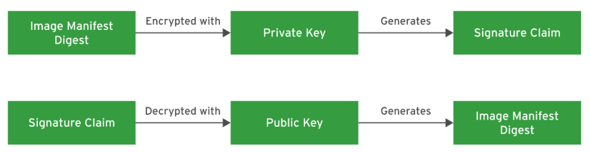

## 2. 防止恶意容器的创建

#### 通过黑名单/白名单来限制访问容器镜像仓库

在 “最小化微服务漏洞  Minimize Microservice Vulnerabilities” 章节，我们介绍过OPA Gatekeeper，我们可以通过OPA Gatekeeper来配置黑名单/白名单，限制访问容器镜像仓库。我们先来回顾一下OPA Gatekeeper的工作原理。

OPA Gatekeeper作为微服务部署在你的Kubernetes集群中，当你往Kubernetes集群中创建Workload时，比如一个Pod，kube-apiserver会将Pod的yaml文件发送给OPA Gatekeeper，OPA Gatekeeper校验yaml文件是否符合OPA所定义的约束（Constraint），来决定允许或者拒绝创建 Pod。

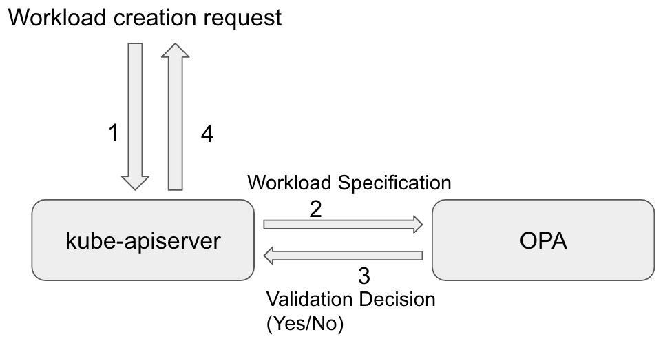

下面的代码，演示了只允许来自容器镜像仓库`openpolicyagent`的Pod才能被正常创建。

```yaml
---
# constraint.yaml
apiVersion: constraints.gatekeeper.sh/v1beta1
kind: K8sAllowedRepos
metadata:
  name: repo-is-openpolicyagent
spec:
  match:
    kinds:
      - apiGroups: [""]
        kinds: ["Pod"]
    namespaces:
      - "default"
  parameters:
    repos:
      - "openpolicyagent"

---
# example_allowed.yaml
apiVersion: v1
kind: Pod
metadata:
  name: opa-allowed
spec:
  containers:
    - name: opa
      image: openpolicyagent/opa:0.9.2
      args:
        - "run"
        - "--server"
        - "--addr=localhost:8080"
      resources:
        limits:
          cpu: "100m"
          memory: "30Mi"
          
---
# example_disallowed.yaml
apiVersion: v1
kind: Pod
metadata:
  name: nginx-disallowed
spec:
  containers:
    - name: nginx
      image: nginx
      resources:
        limits:
          cpu: "100m"
          memory: "30Mi"
```

> 参考资料：
>
> https://github.com/open-policy-agent/gatekeeper-library/tree/master/library/general/allowedrepos


#### 了解准入控制器 Admission Control

##### 什么是准入控制器？

准入控制器是Kubernetes的原生特性，可以帮助Kubernetes管理员定义允许在集群上运行的内容，控制进入集群的内容。例如，强制执行Pod的安全策略（PSP，PSA），阻止部署易受攻击的容器镜像（OPA Gatekeeper）。

准入控制器是一段代码，它会在请求通过认证和授权之后、对象被持久化之前拦截到达 Kubernetes API 服务器的请求。这些控制器被编译进 `kube-apiserver` 的二进制文件中，并且只能由集群管理员使用`--enable-admission-plugins`和`admission-control-config-file`标志来启用和配置。

有两类特殊的准入控制器，分别是`MutatingAdmissionWebhook` 和 `ValidatingAdmissionWebhook`，分别对Kubernetes API对象执行变更和验证操作。

准入控制过程分为两个阶段。第一阶段，运行变更准入控制器。第二阶段，运行验证准入控制器。 需要说明的是，某些准入控制器既是变更准入控制器又是验证准入控制器。

如果任何一个阶段的任何控制器拒绝了该API请求，则整个请求将立即被拒绝，并向终端用户返回一个错误。

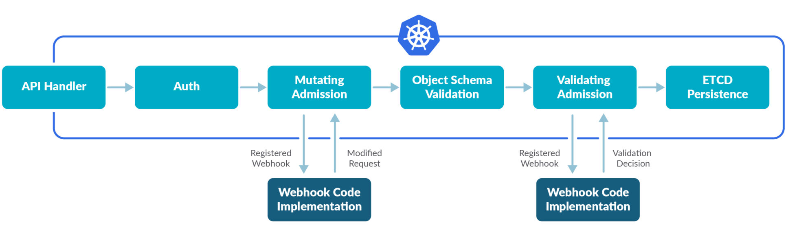

##### 常见的准入控制器

**AlwaysPullImages**

该准入控制器会修改每一个新创建的 Pod 的镜像拉取策略为 Always 。 这在多租户集群中是有用的，这样可以保证用户的私有镜像只能被那些有凭证的人使用。 如果没有这个准入控制器，一旦镜像被拉取到节点上，任何在此节点上的 Pod 都可以通过镜像名称来直接使用，而不需要对镜像进行任何授权检查。 

**ImagePolicyWebhook**

ImagePolicyWebhook 准入控制器允许使用一个后端的 webhook 做出准入决策。

**PodSecurityPolicy （已弃用）**

此准入控制器负责在创建和修改 Pod 时根据请求的安全上下文和可用的 Pod 安全策略确定是否可以执行请求。

> 参考资料：
>
> https://sysdig.com/blog/kubernetes-admission-controllers/
>
> https://kubernetes.io/docs/reference/access-authn-authz/admission-controllers/


#### 了解并配置 ImagePolicyWebhook

##### 什么是 ImagePolicyWebhook ？

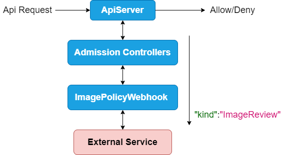

我们已经知道当一个Api Request发送到Kubernetes ApiServer之后，会经过Authentication，Authorization，Admission Controllers，然后最终决定是接受请求还是拒绝请求。比如这个请求可能是创建一个Pod。而ImagePolicyWebhook也是一种Admission Controller。那ImagePolicyWebhook是如何工作的呢？其实真正Allow/Deny Api Request 的并不是ImagePolicyWebhook，而是External Service。

ImagePolicyWebhook里面会配置External Service的具体信息，比如服务器地址，然后将请求转发给External Service，由 External Service 根据自己的业务逻辑，返回允许或者拒绝创建Pod。

下面是示例的Request Body。

```yaml
{
  "apiVersion":"imagepolicy.k8s.io/v1alpha1",
  "kind":"ImageReview",
  "spec":{
    "containers":[
      {
        "image":"myrepo/myimage:v1"
      },
      {
        "image":"myrepo/myimage@sha256:beb6bd6a68f114c1dc2ea4b28db81bdf91de202a9014972bec5e4d9171d90ed"
      }
    ],
    "annotations":{
      "mycluster.image-policy.k8s.io/ticket-1234": "break-glass"
    },
    "namespace":"mynamespace"
  }
}
```

我们可以自己实现External Service的代码，并将其部署成一个Server。解析上面的Request Body。根据自己的业务逻辑，返回允许或者拒绝创建Pod。

如果是允许创建Pod的Response结构如下所示：

```yaml
{
  "apiVersion": "imagepolicy.k8s.io/v1alpha1",
  "kind": "ImageReview",
  "status": {
    "allowed": true
  }
}
```

如果是拒绝创建Pod的Response结构如下所示：

```yaml
{
  "apiVersion": "imagepolicy.k8s.io/v1alpha1",
  "kind": "ImageReview",
  "status": {
    "allowed": false,
    "reason": "image currently blacklisted"
  }
}
```


##### 实践：配置 ImagePolicyWebhook

###### 1. 创建`admission_config.yaml`

```shell
mkdir -p /etc/kubernetes/admission
cd /etc/kubernetes/admission
vi admission_config.yaml
```

```yaml
# /etc/kubernetes/admission/admission_config.yaml
apiVersion: apiserver.config.k8s.io/v1
kind: AdmissionConfiguration
plugins:
  - name: ImagePolicyWebhook
    configuration:
      imagePolicy:
        kubeConfigFile: /etc/kubernetes/admission/kubeconf
        allowTTL: 50
        denyTTL: 50
        retryBackoff: 500
        defaultAllow: false # DENY ALL PODS IF SERVICE NOT AVAILABLE
```

###### 2. 创建External Service的配置文件 `/etc/kubernetes/admission/kubeconf`

```yaml
# /etc/kubernetes/admission/kubeconf
apiVersion: v1
kind: Config

# clusters refers to the remote service.
clusters:
- cluster:
    # CA for verifying the remote service.
    certificate-authority: /etc/kubernetes/admission/external-cert.pem  
    server: https://external-service:1234/check-image # URL of remote service to query. Must use 'https'.
  name: image-checker

contexts:
- context:
    cluster: image-checker
    user: api-server
  name: image-checker
current-context: image-checker
preferences: {}

# users refers to the API server's webhook configuration.
users:
- name: api-server
  user:
    # cert for the webhook admission controller to use
    client-certificate: /etc/kubernetes/admission/apiserver-client-cert.pem     
    # key matching the cert
    client-key:  /etc/kubernetes/admission/apiserver-client-key.pem             
```

###### 3. 在Kubernetes Apiserver中注册ImagePolicyWebhook 

```shell
vim /etc/kubernetes/manifests/kube-apiserver.yaml
```

按如下方式修改`kube-apiserver.yaml`：

```yaml
apiVersion: v1
kind: Pod
metadata:
...
  name: kube-apiserver
  namespace: kube-system
spec:
  containers:
  - command:
    - kube-apiserver
    - --admission-control-config-file=/etc/kubernetes/admission/admission_config.yaml
    - --enable-admission-plugins=NodeRestriction,ImagePolicyWebhook
    ...
    volumeMounts:
    - mountPath: /etc/kubernetes/admission
      name: admission
      readOnly: true
  ...
  volumes:
  - hostPath:
      path: /etc/kubernetes/admission
      type: DirectoryOrCreate
    name: admission
  ...
```

等待Apiserver 被重启。

```shell
kubectl get pod -n kube-system
```

但是你可能看不到ApiServer Pod被启动，因为所有Pod的创建都被ImagePolicyWebhook拒绝了，即使是ApiServer Pod也不例外。但是ApiServer的容器仍然在运行，因为kubelet会直接运行ApiServer的容器。

###### 4. 验证

如下代码所示，我们可以看到，创建nginx pod的请求被拒绝了。

```shell
[root@k8s-master1 ~]#kubectl run nginx --image=nginx
Error from server (Forbidden): pods "nginx" is forbidden: Post "https://external-service:1234/check-image?timeout=30s": dial tcp: lookup external-service on 192.168.1.1:53: no such host
```

当然，我们可以将`/etc/kubernetes/admission/admission_config.yaml`文件修改为`defaultAllow: true`。这样当External Service服务不可用时，默认的行为是允许创建Pod，而不是拒绝创建Pod。

> **Note:** 
>
> [flavio/kube-image-bouncer](https://github.com/flavio/kube-image-bouncer) 
>
> A simple webhook endpoint server that can be used to validate the images being created inside of the kubernetes cluster.

> 参考资料：
>
> https://kubernetes.io/docs/reference/access-authn-authz/admission-controllers/#imagepolicywebhook
> https://itnext.io/cks-exam-series-5-imagepolicywebhook-8d09f1ceee70


## 3. 分析文件及镜像安全隐患

#### 分析Dockerfile、Kubernetes yaml文件的安全隐患

我们在 "系统强化 / System Hardening -- 强化容器镜像“ 章节已经看过一个存在安全隐患的Dockerfile的例子，我们再来回顾一下。

```dockerfile
FROM ubuntu
  
# Add MySQL configuration
COPY my.cnf /etc/mysql/conf.d/my.cnf
COPY mysqld_charset.cnf /etc/mysql/conf.d/mysqld_charset.cnf

RUN apt-get update && \
    apt-get -yq install mysql-server-5.6 &&

# Add MySQL scripts
COPY import_sql.sh /import_sql.sh
COPY run.sh /run.sh

# Configure credentials
COPY secret-token .                                       # LAYER X
RUN /etc/register.sh ./secret-token                       # LAYER Y
RUN rm ./secret-token # delete secret token again         # LAYER Z

EXPOSE 3306
CMD ["/run.sh"]
```

上面的Dockerfile第一眼看上去，它完全符合安全建议。它复制一个文件秘密令牌，使用它，然后删除它。但由于Docker的工作方式，每个RUN、COPY和ADD命令都会创建一个新层，并且每个层都会持久化在容器镜像中。
这意味着即使文件秘密令牌在LAYER Z被删除，它仍然包含在LAYER X和LAYER Y的中。在这种情况下，最好通过外部变量的方式传递给Dockerfile。

我们再来看一个Kubernetes yaml文件中存在的安全隐患：

```yaml
# /opt/course/22/files/statefulset-nginx.yaml
...
apiVersion: apps/v1
kind: StatefulSet
metadata:
  name: web
spec:
  serviceName: "nginx"
  replicas: 2
  selector:
    matchLabels:
      app: nginx
  template:
    metadata:
      labels:
        app: nginx
    spec:
      containers:
      - name: nginx
        image: k8s.gcr.io/nginx-slim:0.8
        env:
        - name: Username
          value: Administrator
        - name: Password
          value: MyDiReCtP@sSw0rd               # NOT GOOD
        ports:
        - containerPort: 80
          name: web
```

在statefulset-nginx.yaml文件中，密码通过环境变量的方式直接暴露在容器中。更好的方式，应该是通过K8s Secret的方式注入到容器中。

当然，开源社区也有一些工具可以帮助我们分析Kubernetes资源文件中存在的安全风险。例如：KUBESEC。

##### KUBESEC

下载链接：https://kubesec.io/

###### 实践：使用 KUBESEC

**示例Kubernetes资源**：

```yaml
# score-0-cap-sys-admin.yml
apiVersion: v1
kind: Pod
metadata:
  name: security-context-demo
spec:
  containers:
  - name: sec-ctx-demo
    image: gcr.io/google-samples/node-hello:1.0
    securityContext:
      capabilities:
        add:
          - SYS_ADMIN
```

**使用kubesec扫描Kubernetes资源文件：**

```shell
$ ./kubesec scan score-0-cap-sys-admin.yml 
```

**kubesec输出：**

```shell
[
  {
    "object": "Pod/security-context-demo.default",
    "valid": true,
    "fileName": "score-0-cap-sys-admin.yml",
    "message": "Failed with a score of -30 points",
    "score": -30,
    "scoring": {
      "critical": [
        {
          "id": "CapSysAdmin",
          "selector": "containers[] .securityContext .capabilities .add == SYS_ADMIN",
          "reason": "CAP_SYS_ADMIN is the most privileged capability and should always be avoided",
          "points": -30
        }
      ],
      "advise": [
        {
          "id": "ApparmorAny",
          "selector": ".metadata .annotations .\"container.apparmor.security.beta.kubernetes.io/nginx\"",
          "reason": "Well defined AppArmor policies may provide greater protection from unknown threats. WARNING: NOT PRODUCTION READY",
          "points": 3
        },
        {
          "id": "ServiceAccountName",
          "selector": ".spec .serviceAccountName",
          "reason": "Service accounts restrict Kubernetes API access and should be configured with least privilege",
          "points": 3
        },
        {
          "id": "SeccompAny",
          "selector": ".metadata .annotations .\"container.seccomp.security.alpha.kubernetes.io/pod\"",
          "reason": "Seccomp profiles set minimum privilege and secure against unknown threats",
          "points": 1
        },
        {
          "id": "LimitsCPU",
          "selector": "containers[] .resources .limits .cpu",
          "reason": "Enforcing CPU limits prevents DOS via resource exhaustion",
          "points": 1
        },
        {
          "id": "LimitsMemory",
          "selector": "containers[] .resources .limits .memory",
          "reason": "Enforcing memory limits prevents DOS via resource exhaustion",
          "points": 1
        },
        {
          "id": "RequestsCPU",
          "selector": "containers[] .resources .requests .cpu",
          "reason": "Enforcing CPU requests aids a fair balancing of resources across the cluster",
          "points": 1
        },
        {
          "id": "RequestsMemory",
          "selector": "containers[] .resources .requests .memory",
          "reason": "Enforcing memory requests aids a fair balancing of resources across the cluster",
          "points": 1
        },
        {
          "id": "CapDropAny",
          "selector": "containers[] .securityContext .capabilities .drop",
          "reason": "Reducing kernel capabilities available to a container limits its attack surface",
          "points": 1
        },
        {
          "id": "CapDropAll",
          "selector": "containers[] .securityContext .capabilities .drop | index(\"ALL\")",
          "reason": "Drop all capabilities and add only those required to reduce syscall attack surface",
          "points": 1
        },
        {
          "id": "ReadOnlyRootFilesystem",
          "selector": "containers[] .securityContext .readOnlyRootFilesystem == true",
          "reason": "An immutable root filesystem can prevent malicious binaries being added to PATH and increase attack cost",
          "points": 1
        },
        {
          "id": "RunAsNonRoot",
          "selector": "containers[] .securityContext .runAsNonRoot == true",
          "reason": "Force the running image to run as a non-root user to ensure least privilege",
          "points": 1
        },
        {
          "id": "RunAsUser",
          "selector": "containers[] .securityContext .runAsUser -gt 10000",
          "reason": "Run as a high-UID user to avoid conflicts with the host's user table",
          "points": 1
        }
      ]
    }
  }
]
```

> 参考资料：
>
> https://github.com/controlplaneio/kubesec
>
> https://kubesec.io/

#### 使用工具扫描镜像漏洞

##### 实践：使用 trivy 扫描镜像漏洞

`trivy`是一个简单易用的镜像漏洞扫描工具。

###### 1. 安装

**在 RHEL/CentOS 下安装 trivy** 

```shell
$ sudo vim /etc/yum.repos.d/trivy.repo
[trivy]
name=Trivy repository
baseurl=https://aquasecurity.github.io/trivy-repo/rpm/releases/$releasever/$basearch/
gpgcheck=0
enabled=1
$ sudo yum -y update
$ sudo yum -y install trivy
```

**在 Debian/Ubuntu 下安装 trivy**

```shell
sudo apt-get install wget apt-transport-https gnupg lsb-release
wget -qO - https://aquasecurity.github.io/trivy-repo/deb/public.key | sudo apt-key add -
echo deb https://aquasecurity.github.io/trivy-repo/deb $(lsb_release -sc) main | sudo tee -a /etc/apt/sources.list.d/trivy.list
sudo apt-get update
sudo apt-get install trivy
```

###### 2. 使用

使用命令 `trivy image python:3.4-alpine` 扫描镜像 `python:3.4-alpine`。从 trivy 的输出可以看出，此镜像包含很多 CVE。

```shell
$ trivy image python:3.4-alpine
2022-02-14T11:40:00.617+0800	INFO	Need to update DB
2022-02-14T11:40:00.617+0800	INFO	Downloading DB...
21.65 MiB / 21.65 MiB [----------------------------------------------------------------------------------------------] 100.00% 555.32 KiB p/s 40s
2022-02-14T11:41:41.803+0800	INFO	Detected OS: alpine
2022-02-14T11:41:41.803+0800	INFO	Detecting Alpine vulnerabilities...
2022-02-14T11:41:41.803+0800	INFO	Number of language-specific files: 1
2022-02-14T11:41:41.803+0800	INFO	Detecting python-pkg vulnerabilities...
2022-02-14T11:41:41.804+0800	WARN	This OS version is no longer supported by the distribution: alpine 3.9.2
2022-02-14T11:41:41.804+0800	WARN	The vulnerability detection may be insufficient because security updates are not provided

python:3.4-alpine (alpine 3.9.2)
================================
Total: 37 (UNKNOWN: 0, LOW: 4, MEDIUM: 16, HIGH: 13, CRITICAL: 4)

+--------------+------------------+----------+-------------------+---------------+---------------------------------------+
|   LIBRARY    | VULNERABILITY ID | SEVERITY | INSTALLED VERSION | FIXED VERSION |                 TITLE                 |
+--------------+------------------+----------+-------------------+---------------+---------------------------------------+
| expat        | CVE-2018-20843   | HIGH     | 2.2.6-r0          | 2.2.7-r0      | expat: large number of                |
|              |                  |          |                   |               | colons in input makes parser          |
|              |                  |          |                   |               | consume high amount...                |
|              |                  |          |                   |               | -->avd.aquasec.com/nvd/cve-2018-20843 |
+              +------------------+          +                   +---------------+---------------------------------------+
|              | CVE-2019-15903   |          |                   | 2.2.7-r1      | expat: heap-based buffer              |
|              |                  |          |                   |               | over-read via crafted XML input       |
|              |                  |          |                   |               | -->avd.aquasec.com/nvd/cve-2019-15903 |
+--------------+------------------+----------+-------------------+---------------+---------------------------------------+
| libbz2       | CVE-2019-12900   | CRITICAL | 1.0.6-r6          | 1.0.6-r7      | bzip2: out-of-bounds write            |
|              |                  |          |                   |               | in function BZ2_decompress            |
|              |                  |          |                   |               | -->avd.aquasec.com/nvd/cve-2019-12900 |
+--------------+------------------+----------+-------------------+---------------+---------------------------------------+
| libcrypto1.1 | CVE-2019-1543    | HIGH     | 1.1.1a-r1         | 1.1.1b-r1     | openssl: ChaCha20-Poly1305            |
|              |                  |          |                   |               | with long nonces                      |
|              |                  |          |                   |               | -->avd.aquasec.com/nvd/cve-2019-1543  |
+              +------------------+          +                   +---------------+---------------------------------------+
|              | CVE-2020-1967    |          |                   | 1.1.1g-r0     | openssl: Segmentation                 |
|              |                  |          |                   |               | fault in SSL_check_chain              |
|              |                  |          |                   |               | causes denial of service              |
|              |                  |          |                   |               | -->avd.aquasec.com/nvd/cve-2020-1967  |
+              +------------------+          +                   +---------------+---------------------------------------+
|              | CVE-2021-23840   |          |                   | 1.1.1j-r0     | openssl: integer                      |
|              |                  |          |                   |               | overflow in CipherUpdate              |
|              |                  |          |                   |               | -->avd.aquasec.com/nvd/cve-2021-23840 |
+              +------------------+          +                   +---------------+---------------------------------------+
|              | CVE-2021-3450    |          |                   | 1.1.1k-r0     | openssl: CA certificate check         |
|              |                  |          |                   |               | bypass with X509_V_FLAG_X509_STRICT   |
|              |                  |          |                   |               | -->avd.aquasec.com/nvd/cve-2021-3450  |
+              +------------------+----------+                   +---------------+---------------------------------------+
|              | CVE-2019-1547    | MEDIUM   |                   | 1.1.1d-r0     | openssl: side-channel weak            |
|              |                  |          |                   |               | encryption vulnerability              |
|              |                  |          |                   |               | -->avd.aquasec.com/nvd/cve-2019-1547  |
+              +------------------+          +                   +               +---------------------------------------+
|              | CVE-2019-1549    |          |                   |               | openssl: information                  |
|              |                  |          |                   |               | disclosure in fork()                  |
|              |                  |          |                   |               | -->avd.aquasec.com/nvd/cve-2019-1549  |
+              +------------------+          +                   +---------------+---------------------------------------+
|              | CVE-2019-1551    |          |                   | 1.1.1d-r2     | openssl: Integer overflow in RSAZ     |
|              |                  |          |                   |               | modular exponentiation on x86_64      |
|              |                  |          |                   |               | -->avd.aquasec.com/nvd/cve-2019-1551  |
+              +------------------+          +                   +---------------+---------------------------------------+
|              | CVE-2020-1971    |          |                   | 1.1.1i-r0     | openssl: EDIPARTYNAME                 |
|              |                  |          |                   |               | NULL pointer de-reference             |
|              |                  |          |                   |               | -->avd.aquasec.com/nvd/cve-2020-1971  |
+              +------------------+          +                   +---------------+---------------------------------------+
|              | CVE-2021-23841   |          |                   | 1.1.1j-r0     | openssl: NULL pointer dereference     |
|              |                  |          |                   |               | in X509_issuer_and_serial_hash()      |
|              |                  |          |                   |               | -->avd.aquasec.com/nvd/cve-2021-23841 |
+              +------------------+          +                   +---------------+---------------------------------------+
|              | CVE-2021-3449    |          |                   | 1.1.1k-r0     | openssl: NULL pointer dereference     |
|              |                  |          |                   |               | in signature_algorithms processing    |
|              |                  |          |                   |               | -->avd.aquasec.com/nvd/cve-2021-3449  |
+              +------------------+----------+                   +---------------+---------------------------------------+
|              | CVE-2019-1563    | LOW      |                   | 1.1.1d-r0     | openssl: information                  |
|              |                  |          |                   |               | disclosure in PKCS7_dataDecode        |
|              |                  |          |                   |               | and CMS_decrypt_set1_pkey             |
|              |                  |          |                   |               | -->avd.aquasec.com/nvd/cve-2019-1563  |
+              +------------------+          +                   +---------------+---------------------------------------+
|              | CVE-2021-23839   |          |                   | 1.1.1j-r0     | openssl: incorrect SSLv2              |
|              |                  |          |                   |               | rollback protection                   |
|              |                  |          |                   |               | -->avd.aquasec.com/nvd/cve-2021-23839 |
+--------------+------------------+----------+                   +---------------+---------------------------------------+
| libssl1.1    | CVE-2019-1543    | HIGH     |                   | 1.1.1b-r1     | openssl: ChaCha20-Poly1305            |
|              |                  |          |                   |               | with long nonces                      |
|              |                  |          |                   |               | -->avd.aquasec.com/nvd/cve-2019-1543  |
+              +------------------+          +                   +---------------+---------------------------------------+
|              | CVE-2020-1967    |          |                   | 1.1.1g-r0     | openssl: Segmentation                 |
|              |                  |          |                   |               | fault in SSL_check_chain              |
|              |                  |          |                   |               | causes denial of service              |
|              |                  |          |                   |               | -->avd.aquasec.com/nvd/cve-2020-1967  |
+              +------------------+          +                   +---------------+---------------------------------------+
|              | CVE-2021-23840   |          |                   | 1.1.1j-r0     | openssl: integer                      |
|              |                  |          |                   |               | overflow in CipherUpdate              |
|              |                  |          |                   |               | -->avd.aquasec.com/nvd/cve-2021-23840 |
+              +------------------+          +                   +---------------+---------------------------------------+
|              | CVE-2021-3450    |          |                   | 1.1.1k-r0     | openssl: CA certificate check         |
|              |                  |          |                   |               | bypass with X509_V_FLAG_X509_STRICT   |
|              |                  |          |                   |               | -->avd.aquasec.com/nvd/cve-2021-3450  |
+              +------------------+----------+                   +---------------+---------------------------------------+
|              | CVE-2019-1547    | MEDIUM   |                   | 1.1.1d-r0     | openssl: side-channel weak            |
|              |                  |          |                   |               | encryption vulnerability              |
|              |                  |          |                   |               | -->avd.aquasec.com/nvd/cve-2019-1547  |
+              +------------------+          +                   +               +---------------------------------------+
|              | CVE-2019-1549    |          |                   |               | openssl: information                  |
|              |                  |          |                   |               | disclosure in fork()                  |
|              |                  |          |                   |               | -->avd.aquasec.com/nvd/cve-2019-1549  |
+              +------------------+          +                   +---------------+---------------------------------------+
|              | CVE-2019-1551    |          |                   | 1.1.1d-r2     | openssl: Integer overflow in RSAZ     |
|              |                  |          |                   |               | modular exponentiation on x86_64      |
|              |                  |          |                   |               | -->avd.aquasec.com/nvd/cve-2019-1551  |
+              +------------------+          +                   +---------------+---------------------------------------+
|              | CVE-2020-1971    |          |                   | 1.1.1i-r0     | openssl: EDIPARTYNAME                 |
|              |                  |          |                   |               | NULL pointer de-reference             |
|              |                  |          |                   |               | -->avd.aquasec.com/nvd/cve-2020-1971  |
+              +------------------+          +                   +---------------+---------------------------------------+
|              | CVE-2021-23841   |          |                   | 1.1.1j-r0     | openssl: NULL pointer dereference     |
|              |                  |          |                   |               | in X509_issuer_and_serial_hash()      |
|              |                  |          |                   |               | -->avd.aquasec.com/nvd/cve-2021-23841 |
+              +------------------+          +                   +---------------+---------------------------------------+
|              | CVE-2021-3449    |          |                   | 1.1.1k-r0     | openssl: NULL pointer dereference     |
|              |                  |          |                   |               | in signature_algorithms processing    |
|              |                  |          |                   |               | -->avd.aquasec.com/nvd/cve-2021-3449  |
+              +------------------+----------+                   +---------------+---------------------------------------+
|              | CVE-2019-1563    | LOW      |                   | 1.1.1d-r0     | openssl: information                  |
|              |                  |          |                   |               | disclosure in PKCS7_dataDecode        |
|              |                  |          |                   |               | and CMS_decrypt_set1_pkey             |
|              |                  |          |                   |               | -->avd.aquasec.com/nvd/cve-2019-1563  |
+              +------------------+          +                   +---------------+---------------------------------------+
|              | CVE-2021-23839   |          |                   | 1.1.1j-r0     | openssl: incorrect SSLv2              |
|              |                  |          |                   |               | rollback protection                   |
|              |                  |          |                   |               | -->avd.aquasec.com/nvd/cve-2021-23839 |
+--------------+------------------+----------+-------------------+---------------+---------------------------------------+
| musl         | CVE-2019-14697   | CRITICAL | 1.1.20-r4         | 1.1.20-r5     | musl libc through 1.1.23 has          |
|              |                  |          |                   |               | an x87 floating-point stack           |
|              |                  |          |                   |               | adjustment imbalance, related...      |
|              |                  |          |                   |               | -->avd.aquasec.com/nvd/cve-2019-14697 |
+              +------------------+----------+                   +---------------+---------------------------------------+
|              | CVE-2020-28928   | MEDIUM   |                   | 1.1.20-r6     | In musl libc through 1.2.1,           |
|              |                  |          |                   |               | wcsnrtombs mishandles particular      |
|              |                  |          |                   |               | combinations of destination buffer... |
|              |                  |          |                   |               | -->avd.aquasec.com/nvd/cve-2020-28928 |
+--------------+------------------+----------+                   +---------------+---------------------------------------+
| musl-utils   | CVE-2019-14697   | CRITICAL |                   | 1.1.20-r5     | musl libc through 1.1.23 has          |
|              |                  |          |                   |               | an x87 floating-point stack           |
|              |                  |          |                   |               | adjustment imbalance, related...      |
|              |                  |          |                   |               | -->avd.aquasec.com/nvd/cve-2019-14697 |
+              +------------------+----------+                   +---------------+---------------------------------------+
|              | CVE-2020-28928   | MEDIUM   |                   | 1.1.20-r6     | In musl libc through 1.2.1,           |
|              |                  |          |                   |               | wcsnrtombs mishandles particular      |
|              |                  |          |                   |               | combinations of destination buffer... |
|              |                  |          |                   |               | -->avd.aquasec.com/nvd/cve-2020-28928 |
+--------------+------------------+----------+-------------------+---------------+---------------------------------------+
| sqlite-libs  | CVE-2019-8457    | CRITICAL | 3.26.0-r3         | 3.28.0-r0     | sqlite: heap out-of-bound             |
|              |                  |          |                   |               | read in function rtreenode()          |
|              |                  |          |                   |               | -->avd.aquasec.com/nvd/cve-2019-8457  |
+              +------------------+----------+                   +---------------+---------------------------------------+
|              | CVE-2019-19244   | HIGH     |                   | 3.28.0-r2     | sqlite: allows a crash                |
|              |                  |          |                   |               | if a sub-select uses both             |
|              |                  |          |                   |               | DISTINCT and window...                |
|              |                  |          |                   |               | -->avd.aquasec.com/nvd/cve-2019-19244 |
+              +------------------+          +                   +---------------+---------------------------------------+
|              | CVE-2019-5018    |          |                   | 3.28.0-r0     | sqlite: Use-after-free in             |
|              |                  |          |                   |               | window function leading               |
|              |                  |          |                   |               | to remote code execution              |
|              |                  |          |                   |               | -->avd.aquasec.com/nvd/cve-2019-5018  |
+              +------------------+          +                   +---------------+---------------------------------------+
|              | CVE-2020-11655   |          |                   | 3.28.0-r3     | sqlite: malformed window-function     |
|              |                  |          |                   |               | query leads to DoS                    |
|              |                  |          |                   |               | -->avd.aquasec.com/nvd/cve-2020-11655 |
+              +------------------+----------+                   +---------------+---------------------------------------+
|              | CVE-2019-16168   | MEDIUM   |                   | 3.28.0-r1     | sqlite: Division by zero in           |
|              |                  |          |                   |               | whereLoopAddBtreeIndex in sqlite3.c   |
|              |                  |          |                   |               | -->avd.aquasec.com/nvd/cve-2019-16168 |
+              +------------------+          +                   +---------------+---------------------------------------+
|              | CVE-2019-19242   |          |                   | 3.28.0-r2     | sqlite: SQL injection in              |
|              |                  |          |                   |               | sqlite3ExprCodeTarget in expr.c       |
|              |                  |          |                   |               | -->avd.aquasec.com/nvd/cve-2019-19242 |
+--------------+------------------+----------+-------------------+---------------+---------------------------------------+

Python (python-pkg)
===================
Total: 2 (UNKNOWN: 0, LOW: 0, MEDIUM: 1, HIGH: 1, CRITICAL: 0)

+---------+------------------+----------+-------------------+---------------+---------------------------------------+
| LIBRARY | VULNERABILITY ID | SEVERITY | INSTALLED VERSION | FIXED VERSION |                 TITLE                 |
+---------+------------------+----------+-------------------+---------------+---------------------------------------+
| pip     | CVE-2019-20916   | HIGH     | 19.0.3            |          19.2 | python-pip: directory traversal       |
|         |                  |          |                   |               | in _download_http_url() function      |
|         |                  |          |                   |               | in src/pip/_internal/download.py      |
|         |                  |          |                   |               | -->avd.aquasec.com/nvd/cve-2019-20916 |
+         +------------------+----------+                   +---------------+---------------------------------------+
|         | CVE-2021-3572    | MEDIUM   |                   |          21.1 | python-pip: Incorrect handling of     |
|         |                  |          |                   |               | unicode separators in git references  |
|         |                  |          |                   |               | -->avd.aquasec.com/nvd/cve-2021-3572  |
+---------+------------------+----------+-------------------+---------------+---------------------------------------+
```


**查询nginx:1.16.1-alpine是否包含CVE-2020-15999和CVE-2020-1967**

```shell
trivy image nginx:1.16.1-alpine | grep -E 'CVE-2020-1967|CVE-2020-15999' 
```

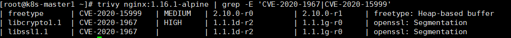

> 参考资料：
>
> https://github.com/aquasecurity/trivy
>
> https://aquasecurity.github.io/trivy/v0.18.3/installation/
>
> https://aquasecurity.github.io/trivy/v0.18.3/quickstart/


## 4. 案例分享

### 启用 FIPS 标准，强化容器安全

#### 什么是 FIPS？

FIPS 的全称是 “Federal Information Processing Standards”，美国联邦信息处理标准。FIPS 是美国政府对数据及其加密的一套安全标准。FIPS 由美国联邦政府公开并鼓励大家遵循此标准，并由美国商务部下属的国家标准与技术协会(NIST)监督。任何组织或者机构，如果想将其软件卖给美国联邦政府，那么此软件必须遵守FIPS 标准。


我们可以将 FIPS 简单的理解为，“只被允许使用有限的、安全的加密算法”，FIPS 标准主要涉及的范围是“加密模块”。

大多数的 Linux 系统都支持 FIPS 标准，但一般都是非默认开启的。Linux 系统中负责加密的模块一般是 “OpenSSL 加密模块”，很多上层的软件最终都会依赖于 OpenSSL 来处理加解密操作。所以一般而言，要使 Linux 操作系统支持 FIPS 标准，那就是要使 “OpenSSL 加密模块” 支持 FIPS 标准。

> Ubuntu，Oracle Linux，Red Hat Enterprise Linux 都支持 FIPS 标准。

#### 为 RHEL/CentOS 7 and 8 开启 FIPS

我们可以参考 https://github.com/zagarjr/enablefips 开启 FIPS 标准。

我们主要来讲讲如何验证系统是否启用了 FIPS 标准？有如下两种方式：

- cat /proc/sys/crypto/fips_enabled
  - 如果输出为 0 表示没有开启 FIPS，1 则表示开启了 FIPS。
- openssl md5 /dev/null
  - 如果一旦 FIPS 被开启，MD5 哈希算法将不能被使用。

##### 以下加密算法是被 FIPS 允许的：

- Symmetric Key
  - AES, Triple-DES, Escrowed Encryption Standard
- Asymmetric Key
  - DSA, RSA, ECDSA
- Hash Standards
  - SHA-1, SHA-224, SHA-256, SHA-384, SHA-512, SHA-512/224, SHA-512/256
- Message authentication
  - CCM, GCM, GMAC, CMAC, HMAC

如果对于一个远端系统，我们可以通过发送 SSL 握手（SSL handshake）请求的方式，验证对端系统是否遵守了 FIPS 标准。

###### Cipher Suites in TLS/SSL

我们补充一点 Cipher Suites in TLS/SSL 的知识。Cipher Suites 可以理解为一套加密算法，我们可以使用这一套加密算法，完成 SSL 握手。每套 Cipher Suites 为以下任务指定一个算法：

- Key exchange / 密钥交换
- Bulk encryption / 批量加密算法
- Message authentication / 信息验证

**Key exchange / 密钥交换**

“Key exchange / 密钥交换”使用非对称加密算法（Asymmetric Key），来加密 Key，这个 Key 会在 SSL 握手阶段在 Client 和 Server 之间交换。非对称加密算法适用于加密少量数据。

**Bulk encryption / 数据压缩**

“Bulk encryption / 批量加密算法” 使用对称加密算法（Symmetric Key），加密客户端和服务器之间的消息交换。对称加密算法适用于加密大量数据。

**Message authentication / 信息验证**

"Message authentication / 信息验证" 使用 Hash 算法验证消息签名，确保消息的完整性。


> 例如 AES256-GCM-SHA384 就代表：
>
> Key exchange = 缺省，使用默认值，一般是 RSA
>
> Bulk encryption = AES256-GCM
>
> Message authentication = SHA384 

> 参考资料：
>
> https://learn.microsoft.com/en-us/windows/win32/secauthn/cipher-suites-in-schannel
>
> https://medium.com/@kasunpdh/ssl-handshake-explained-4dabb87cdce


已知：

- **CAMELLIA-SHA** 是一个不被 FIPS 标准认可的加密算法。
- **AES256-GCM-SHA384** 是一个被 FIPS（FIPS 140-2）标准认可的加密算法。

使用如下命令，指定 SSL 握手的加密算法：

```sh
(echo "GET /" ; sleep 1) | openssl s_client -connect cainzhong.net:37082 -cipher CAMELLIA-SHA 
(echo "GET /" ; sleep 1) | openssl s_client -connect cainzhong:37082 -cipher AES256-GCM-SHA384
```

结果如下图所示：

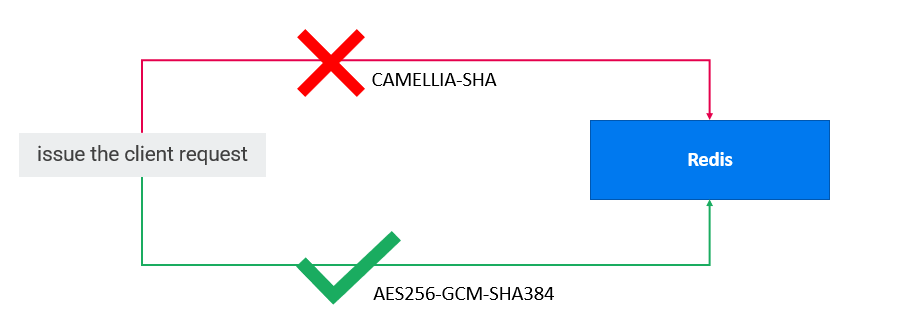

- 当使用不被 FIPS 标准认可的加密算法 CAMELLIA-SHA，尝试连接 Redis 服务器时，连接在 SSL 握手阶段就失败。
- 当使用被 FIPS 标准认可的加密算法 AES256-GCM-SHA384，尝试连接 Redis 服务器时，连接成功。

以上操作，只是想让大家先对 FIPS 标准有一个感性的认知。如果想真正启用 FIPS 功能，操作系统层面支持 FIPS 是一个方面，还有另一个方面是，应用程序也要支持 FIPS。

针对不同的开发语言，不同的软件，会有不同的方式去支持 FIPS。例如像 Redis 软件，因为它底层就是使用 OpenSSL 当做加密模块的，所以对于 Redis 来说，支持 FIPS 标准相对容易，只要宿主机操作系统开启了 FIPS，那么 Redis 也相当于开启了 FIPS，因为大家共用同一个 OpenSSL 加密模块。

那如果对于不用 OpenSSL 加密模块的开发语言来说，比如 Java，那应该怎么办呢？

### Java 应用程序如何支持 FIPS 标准？

答案是：BouncyCastle。

其实针对不同的 JDK 版本，有不同的 Provider 来支持 FIPS。例如：

- Oracle JDK 
  - Use RSA JSSE and RSA JCE providers
- IDM JDK
  - Use IBMJSSE2 Provider
- OpenJDK
  - Use BouncyCastle as provider to create TrustStore
  - Use BouncyCastle as provider to create KeyStore

但鉴于我们的代码本来就是使用的 OpenJDK，所以也没有过多纠结，直接就选择了 BouncyCastle。而且 Oracle JDK 和 IDM JDK 都是收费版的 JDK，我们一般会选择开源免费的软件。

BouncyCastle，或者简称为 bc，大家应该也都不会太陌生，这是一个比较知名的为 Java 提供加密功能的 API，或者说 jar 包。

```xml
<!-- The FIPS 140-2 Bouncy Castle Crypto package is a Java implementation of cryptographic algorithms certified to FIPS 140-2 level 1. This jar contains JCE provider and low-level API for the BC-FJA version 1.0.2.3, FIPS Certificate #3514. Please see certificate for certified platform details. -->
<!-- https://mvnrepository.com/artifact/org.bouncycastle/bc-fips -->
<dependency>
    <groupId>org.bouncycastle</groupId>
    <artifactId>bc-fips</artifactId>
    <version>1.0.2.3</version>
</dependency>

<!-- The Bouncy Castle Java APIs for the TLS, including a JSSE provider. The APIs are designed primarily to be used in conjunction with the BC FIPS provider. The APIs may also be used with other providers although if being used in a FIPS context it is the responsibility of the user to ensure that any other providers used are FIPS certified and used appropriately. -->
<!-- https://mvnrepository.com/artifact/org.bouncycastle/bctls-fips -->
<dependency>
    <groupId>org.bouncycastle</groupId>
    <artifactId>bctls-fips</artifactId>
    <version>1.0.13</version>
</dependency>
```

#### Java 应用程序支持 FIPS 的大致流程

- Add BC Libraries.

  - Add bc-fips-1.0.2.3.jar and bctls-fips-1.0.13.jar into `../jre/lib/ext`

- Modify java.security.

  ```properties
  security.provider.1=org.bouncycastle.jcajce.provider.BouncyCastleFipsProvider
  security.provider.2=sun.security.provider.Sun
  security.provider.3=org.bouncycastle.jsse.provider.BouncyCastleJsseProvider fips:BCFIPS
  
  ssl.KeyManagerFactory.algorithm=PKIX
  
  securerandom.source=file:/dev/random
  ```

- Use FIPS compliant TrustStore to override default cacerts.

  - Use BouncyCastle as provider to create TrustStore.

    ```sh
    # Run the following command to convert cacerts to BCFKS:
    keytool -importkeystore -srckeystore cacerts -srcstoretype JKS -srcstorepass changeit -srcprovidername SUN -destkeystore truststore.bcfks -deststoretype BCFKS -deststorepass changeit -destprovidername BCFIPS -providerclass org.bouncycastle.jcajce.provider.BouncyCastleFipsProvider -providerpath bc-fips-1.0.2.1.jar
    
    # Add CA certs into truststore.bcfks, such as ca.crt
    keytool -importcert -file ca.crt -alias vaultca -keystore truststore.bcfks -storepass changeit -storetype BCFKS -providername BCFIPS -providerclass org.bouncycastle.jcajce.provider.BouncyCastleFipsProvider -providerpath bc-fips-1.0.2.1.jar -noprompt
    ```

    

- Use FIPS compliant KeyStore to start Java application.

  - Use BouncyCastle as provider to create KeyStore.

    ```sh
    # Generate KeyStore keystore.p12
    openssl pkcs12 -export -certpbe PBE-SHA1-3DES -name servercert -in /var/run/secrets/boostport.com/server.crt -inkey /var/run/secrets/boostport.com/server.key \
    -out /var/run/secrets/boostport.com/keystore.p12 -password pass:${KEY_STORE_PASSWORD}
    
    # Convert keystore.p12 to BCFKS.
    keytool -importkeystore -deststoretype bcfks -destkeystore /var/run/secrets/boostport.com/keystore.bcfks -srckeystore /var/run/secrets/boostport.com/keystore.p12 \
    -srcstoretype pkcs12 -providerclass org.bouncycastle.jcajce.provider.BouncyCastleFipsProvider \
    -alias servercert -srcstorepass ${KEY_STORE_PASSWORD} -deststorepass ${KEY_STORE_PASSWORD}
    ```

    

##### Java Options 启动参数

```properties
-Djavax.net.ssl.trustStore=/var/cert/itsma-truststore.bcfks
-Djavax.net.ssl.trustStorePassword=${TRUST_STORE_PASSWORD}
-Djavax.net.ssl.trustStoreType=BCFKS
-Dorg.bouncycastle.fips.approved_only=true
--server.ssl.key-store=/var/cert/keystore.bcfks
--server.ssl.key-store-password=${KEY_STORE_PASSWORD}
--server.ssl.key-store-provider=BCFIPS
--server.ssl.key-store-type=BCFKS
```


我们在操作系统层面开启了 FIPS，修改了 Java 应用程序，使其支持 FIPS。好像能改的都改了，还有什么遗漏的吗？大家想一想？

##### Red Hat Universal Base Image

还有 Dockerfile 没有改，Dockerfile的 base image 没有改，即 Dockerfile 的 FROM 部分。

```dockerfile
FROM alpine:%%ALPINE_VERSION%%

LABEL maintainer="NGINX Docker Maintainers <docker-maint@nginx.com>"

ENV NGINX_VERSION %%NGINX_VERSION%%
ENV PKG_RELEASE   %%PKG_RELEASE%%

...
```


很多时候，我们在编写 Dockerfile 的时候，如果我们想要使用 Nginx，我们大概率会从网上寻找编译好的 Nginx 镜像，比如从hub.docker.com 寻找可用的容器镜像。应该很少有人会想着，从源代码开始编译一个 Nignx 镜像吧？

从 docker hub 的截图来看，这个容器镜像看着不错，还是官方认证的 **DOCKER OFFICIAL IMAGE**，可用放心使用。

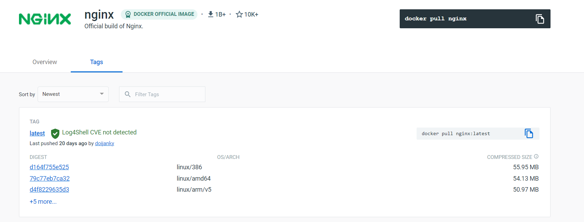

这在一般情况下是没有问题的，那如果是 FIPS 标准呢？大家有没有想过 Nginx 镜像的基础镜像又是谁呢？

通过查看 Nginx 官方的 Dockerfile 可知，Nginx 镜像的基础镜像是 **alpine**。alpine 是一个很轻量级的操作系统镜像，但它好像并不支持 FIPS 标准。

> Nginx Dockerfile：https://github.com/nginxinc/docker-nginx/blob/master/Dockerfile-alpine-slim.template

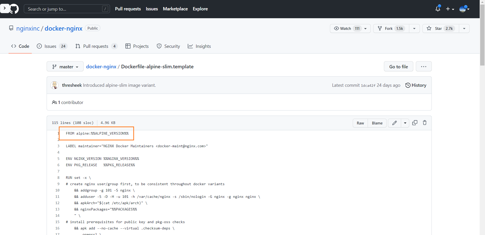

因此，我们是不是需要替换基础镜像，然后自己编译 Nginx 镜像？这当然是一种办法。但出于省事的目的，专业的事情还是交给专业的人员，比如 Red Hat Universal Base Image。

Red Hat Universal Base Image 是 Red Hat 公司推出的，专门为容器化准备的轻量级 Linux 操作系统，只保留了必须的软件。

并且 Red Hat 官方同时提供了基于 Red Hat Universal Base Image 编译的 Nginx，省去了我们自己编译维护容器镜像的成本。


上图是 Red Hat 官方提供的容器镜像仓库，我们可以在里面找到很多其他基于 ubi 的容器镜像，例如 python，Java。

并可以查看对应的 Dockerfile，我们可以清晰的看到，这里的 Nginx 1.20 就是基于 ubi8 编译的。

```dockerfile
FROM ubi8/s2i-core:rhel8.6

EXPOSE 8080
EXPOSE 8443

ENV NAME=nginx \
    NGINX_VERSION=1.20 \
    NGINX_SHORT_VER=120 \
    VERSION=0

...
```


> 参考资料：
>
> https://www.hypr.com/security-encyclopedia/federal-information-processing-standard#:~:text=The%20Federal%20Information%20Processing%20Standards,of%20the%20Department%20of%20Commerce.


## 5. 案例分享

### 容器镜像扫描

问：我们xxx公司会定期扫描容器镜像吗？

答：我所在的公司会，会定期扫描容器镜像，基本上是一天扫一次，因为每天都有新的代码被签入 github，也会有新的镜像被编译出来。因为受 FedRAMP 项目的影响，我们对 CVE 的态度，几乎是 ”零容忍“ 的态度，必须修复，无论此 CVE 的危险评级多低。

FedRAMP 是一个美国政府范围内的项目，因为云技术的发展，FedRAMP 提供了一套标准化的安全和风险评估方法，来保证美国联邦政府使用的云服务是安全可靠的，并促进联邦政府获得更安全的云服务。FIPS 就包含在 FedRAMP 项目内。

### 扫描容器镜像的两个方案

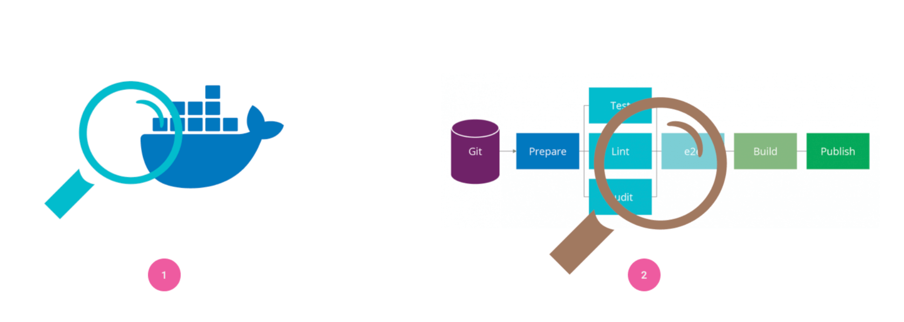

#### 方案1： 对镜像仓库进行定期扫描

通过这种方式，我们需要为镜像仓库添加一个安全扫描程序，扫描程序可以是一个定时任务（Cron Job） 作业，也可以是由特定的人触发的可执行操作。

如果是一个定时任务，它将在特定时刻由定时任务自动触发。例如，Docker Hub 会在特定的时间扫描他们的官方注册表，当有任何漏洞被扫描出来时，它会向镜像维护者发送报警信息。

#### 方案2：将扫描工具集成到 Pipeline 中

另一种方法是在 Pipeline 上对镜像产物进行扫描，这样更加简单高效。当我们将代码推送到代码存储库时， Pipeline 将自动执行扫描镜像的命令。因为 Pipeline 每次都是无差别地执行，所以我们可以发现任何安全问题并及时报警修复。

现在，越来越多的团队或公司使用敏捷来开发他们的项目。如果我们能够尽早地发现任何安全问题或者漏洞，我们就可以在产品发布之前降低产品的安全风险。 Pipeline 是确保每一行代码和基础运行环境的安全性是的最好方法之一，因为它可以在提交代码时自动执行。

提问互动环节，你们会选择方案1还是方案2呢？听听大家的想法？

说说我们的做法：

既不是方案1，也不是方案2，有点像两种方案的结合体。

方案2 无疑能提供更大的灵活性，但缺点是，对于我们公司来说，这样的扫描频率有点高了。

1. 如果每次镜像编译之后都进行一次镜像扫描，这频率有点过高了，而且很多扫描可能都是无用的。例如，可能功能还处于开发阶段，开发人员只是想编译一个镜像进行功能测试，功能还没有稳定，在这个时候扫描镜像，有点无效扫描，有点浪费资源。
2. 过高的镜像扫描频率，会消耗大量 Jenkins 服务器的资源。我们原本正常的 CI/CD Pipeline 已经让 Jenkins 服务器的资源捉襟见肘，如果每次镜像编译之后就扫描镜像，那么至少 CI Pipeline 消耗的资源就会翻倍，这个资源消耗有点承受不起。
3. 最终还是在再三权衡之下（trade off），选择了每天定时扫描一次。因为我们每天都会部署一套新环境，我们只要保证新环境的镜像都被扫描过了即可，这样也兼顾了安全性，所有被真实用到的镜像都被扫描过了，不扫描测试镜像，减少资源的消耗。
4. 为什么不用方案1 的定期扫描？方案1 的定期扫描很大程度上依赖于镜像仓库提供的镜像扫描功能，我们期望不跟特定的容器镜像仓库绑定，可以自由选择社区上的镜像扫描工具。

### 镜像扫描工具对比

针对上述解决方案，我们调查了 Trivy、Claire、Anchore Engine、Quay、Docker hub 和 GCR 等几种扫描工具，从不同维度进行对比。

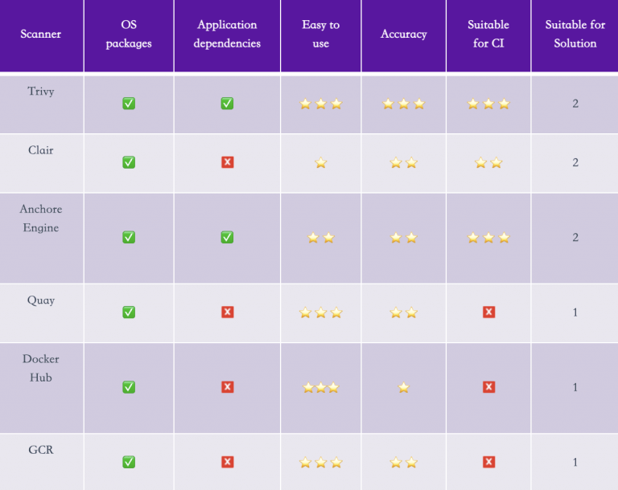

首先，我们可以将这些扫描工具按照其执行的环境进行简单的分类。

因为 Docker Hub、GCR 和 Quay 是需要在服务端，也就是容器注册中心（镜像仓库）运行的， 所以适合方案1。

Trivy、Clair 和 Anchor Engine 可以在 Pipeline 上工作，所以适合于方案2。

对于第一个维度：OS Package，这些所有的扫描工具都可以做到，但是对于第二个维度：Application dependencies，只有 Trivy 和 Anchore Engine 可以做到，对于第五个维度: Suitable for CI, 只有前三个符合条件。

对于漏洞数据库的更新，Clair 会定期从一组配置的源中获取漏洞元数据库（Vulnnerability Database），并将数据存储在其数据库中，只要不获取最新的漏洞元数据，每次执行都用之前的漏洞数据库，漏洞数据库的时效性有点差。 Trivy 和 Anchore Engine 则是每次运行都将下载最新的漏洞数据库并将其缓存在本地文件中，当扫描工具再次运行时，它将检查并更新数据库以保持数据库为最新状态。

同时，对比 Trivy、Clair 和 Anchore Engine，这三者的社区都非常活跃，所以我们不用过于担心在使用过程中遇到问题，没人帮我们解决。 

而且作为一种工具，它必须是易于使用的，并且有良好的文档可供参考。经过调研，发现 Trivy 的文档非常详细，非常友好， 而且 Trivy 的使用方式更加友好，比如我们可以过滤掉（.trivyignore）你指定的漏洞，对于最新发现的漏洞，官方没有给出修复版本，这时候我们就可以忽略这个漏洞继续构建，但 Anchore Engine 做不到。

2020年3月16日，领先的云原生应用和基础设施安全平台供应商 Aqua Security 宣布，其开源的 Trivy 镜像扫描工具将作为一个集成选项添加到其使用的云原生平台、CNCF 的 Harbor 注册表和 Mirantis Docker Enterprise 中。

### 有感而发

这里也有感而发一下，对做好安全的一些想法。我觉得如果要做好安全，那么你的知识面一定要广，不仅限于安全领域的知识，IT领域的知识都要有所涉猎。对于安全领域的知识，那一定要深入研究。

就像刚刚举的“扫描容器镜像”的例子，如果说我们要把“扫描容器镜像"这件事情落地，那我们也需要对 Jenkins 的知识有所了解，那当然不一定要求安全人员写 Jenkins Pipeline。那我们需要大致了解 Jenkins Pipeline 是个什么东西，能做些什么？然后就有可能联想到将镜像扫描工具 trivy 和 pipeline 一起使用，达到自动化的目的。

总结成一句话就是，“安全要跟 DevOps，CICD pipeline搭配起来使用，效果更佳。”

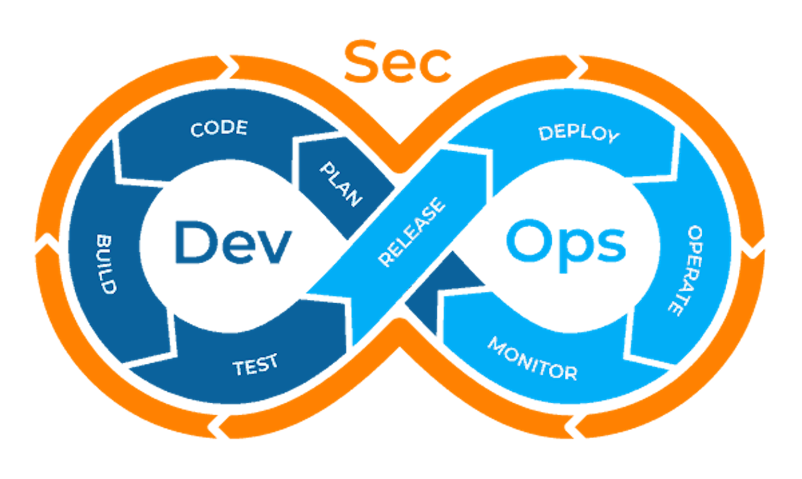

> 参考资料：
>
> https://insights.thoughtworks.cn/container-scanning-tools-recommendation/