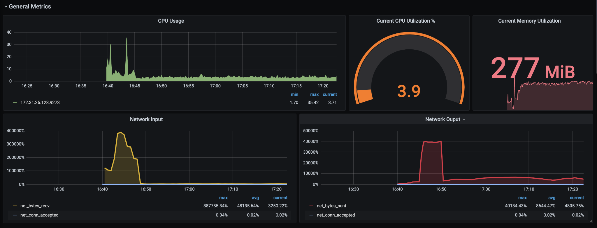
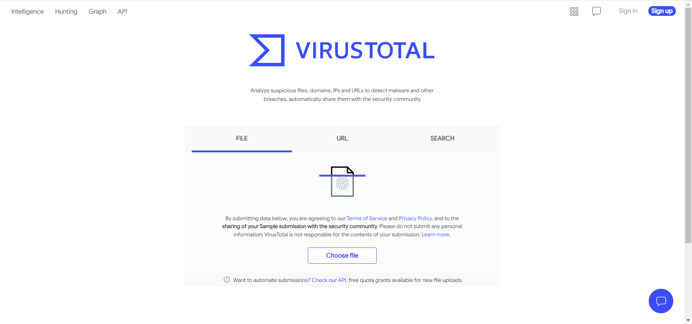
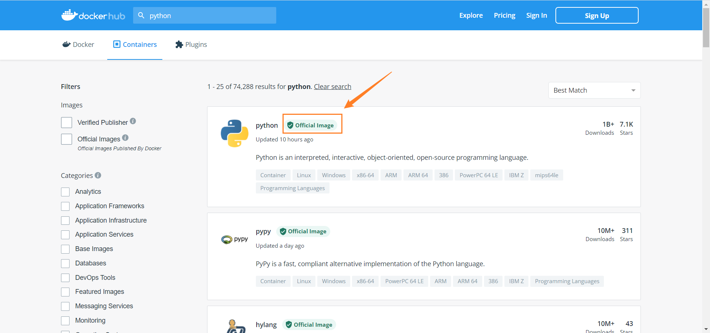
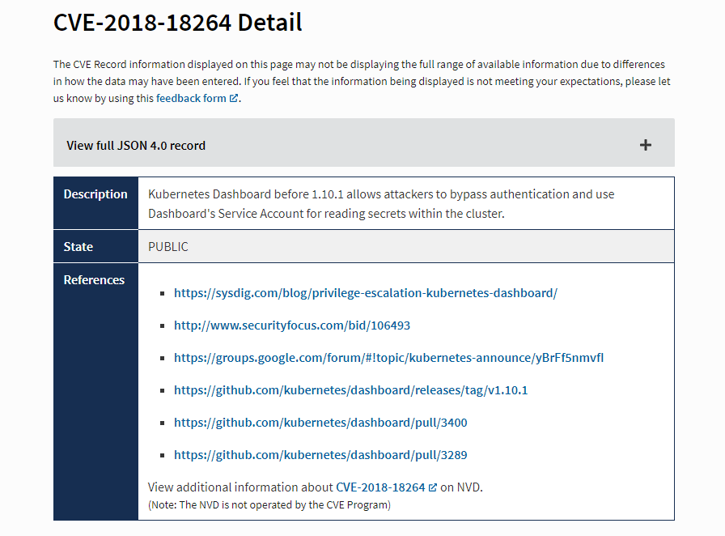
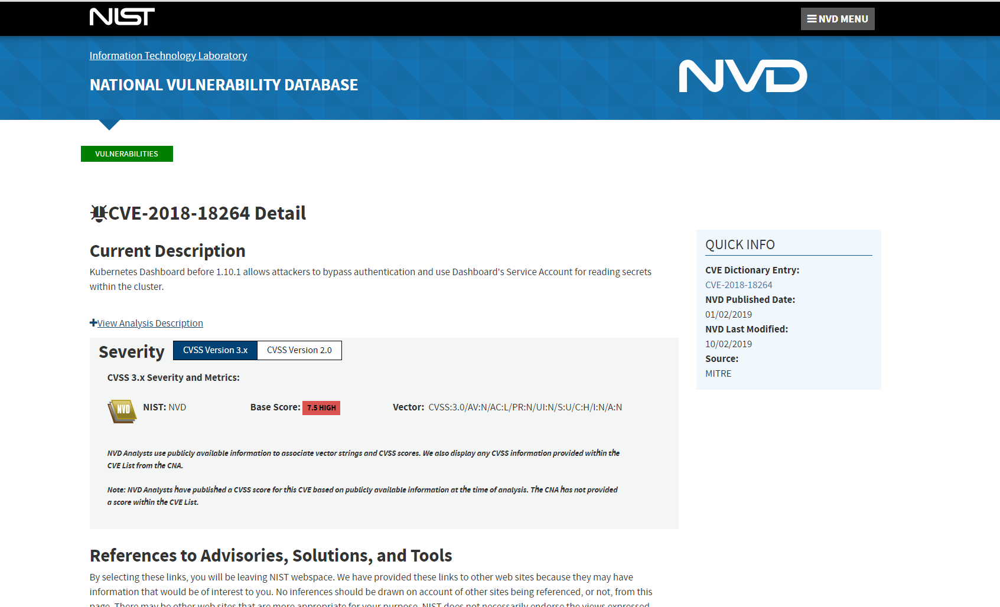
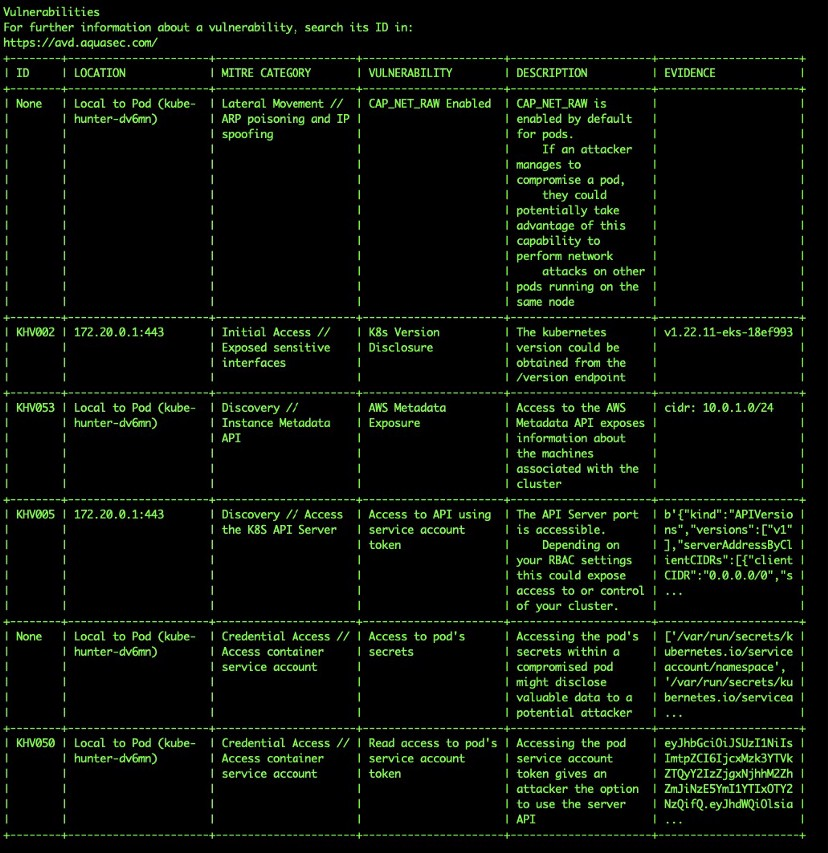
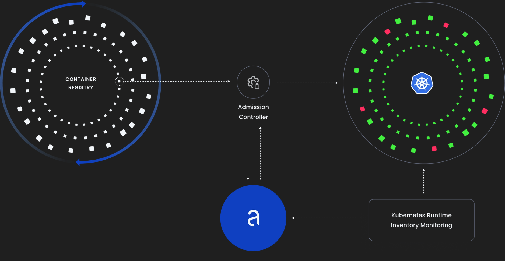
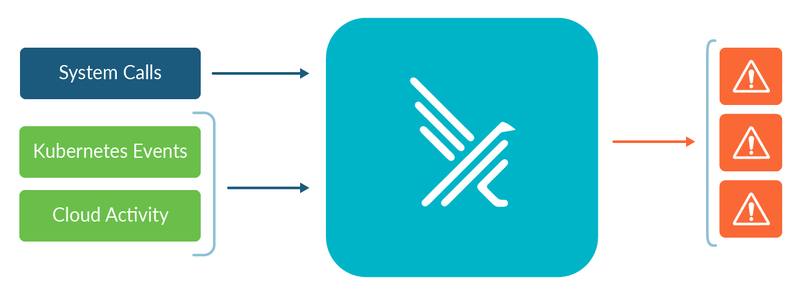

# Kubernetes常见漏洞 / Kubernetes CVEs(Common Vulnerabilities and Exposures)

## Kubernetes 常见漏洞

### 1. 检测和分析加密货币挖矿攻击（Crypto-Mining Attacks）

随着区块链和比特币的流行，加密货币挖矿攻击变得越来越常见，这个现象非常值得大家注意。使用计算资源验证事务，从而获取加密货币的过程称为挖掘，这个过程由矿工软件（crypto-miner）完成。

安全研究人员发现很多黑客事件与挖矿有关，在受害者的基础设施中运行各种矿工软件，以达到挖矿的目的。

Kubernetes 集群的默认配置，安全性极低，人人都可以访问集群，以及Kubernetes 集群强大的计算能力，使 Kubernetes 集群成为加密货币挖矿攻击的理想目标。同时，Kubernetes 集群的复杂性也使得加密挖掘活动难以被检测到。

#### 分析加密货币挖矿攻击

##### 加密货币挖矿攻击简介

区块链构成了加密货币的基础。简而言之，区块链以块的方式构成一条数字资产链。这些块中包含交易信息以及参与交易的人员信息，并将此块作为数字签名。每个加密货币都被关联到一条区块链。验证交易记录，并将交易记录添加到区块链中，这个过程被称为挖矿。挖矿是一种资源密集型操作，你甚至可以在个人电脑上进行挖矿，Kubernetes集群的资源可用性，使其成为攻击者赚取加密货币（比特币）的理想目标。

一个比较形象的比喻，加密货币挖矿就好比有人偷偷用你家的WiFi，而且使用迅雷疯狂下载电影。导致你上网体验极差，甚至网页可能都打不开。

挖矿也一样，当有一个挖矿进程在运行时，此节点上其他应用程序的运行将受到严重影响，因为挖矿过程可能占用大量CPU资源。

**目前已知的加密货币挖矿攻击有两种：**

1. 通过应用程序漏洞，例如跨站点脚本（cross-site scripting）、SQL 注入（SQL injection）、远程代码执行（remote code execution）等，获得系统访问权限，然后下载并执行矿工软件。
2. 恶意容器镜像。 当一个容器镜像中包含矿工软件时，当我们拉取并运行此容器镜像时，挖矿就开始了。

尽管，在互联网上我们可以找到不同类型的矿工软件，但一般来说，它们都有一个共同特征。挖矿是一种资源密集型操作，它的一般特征是会占用大量的CPU资源。

有时，也会将受害者的机器加入到矿池中，以协作的方式进行挖矿。

#### 实例：加密货币挖矿攻击 “特斯拉的Kubernetes集群”

针对特斯拉的Kubernetes 集群的加密货币挖掘攻击发生在2018 年，由 RedLock 发现。 虽然攻击发生在很久以前，但我们还是可以从中学习到两件事：

1. 安全漏洞使攻击成为可能
2. 攻击模式

##### **安全漏洞**

黑客侵入了特斯拉的Kubernetes Dashboard，特斯拉使用了Kubernetes的默认配置，Kubernetes Dashboard 并没有任何密码保护，任何人都可以随意的登入到Kubernetes Dashboard 中。并且黑客从Kubernetes Dashboard 中获得了很多Kubernetes Secrets信息，从而侵入到了它们整个的 Kubernetes 集群中。

##### **攻击模式**

黑客在隐藏他们的足迹方面也做得很好，很长一段时间都没有被发现。 以下是一些值得注意的攻击模式：

- 挖矿过程并没有占用太多CPU资源，所以Pod的CPU使用率也并不太高；
- 与大多数加密货币挖矿案例不同，挖矿过程没有加入任何知名的矿池。 相反，它有自己的挖矿服务器。
- 挖矿过程与挖矿服务器之间的通信是加密的。

通过以上操作，黑客试图隐藏常见的加密货币挖掘模式，以便逃避检测。

##### **经验教训**

错误的配置是导致被黑客攻击的主要方式。加密货币挖掘有一些典型模式，例如，挖矿过程会与矿池通信，挖矿过程通常会占用大量的CPU资源。然而，黑客也可能会故意伪装自己的挖矿行为以逃避检测。

接下来，让我们使用开源工具来检测 Kubernetes 集群中的典型加密货币挖掘行为。

#### 检测加密货币挖矿攻击

我们将讨论如何使用开源工具检测加密货币的挖矿行为。检测加密货币的挖矿行为，还是基于典型的挖矿模式：

1. 高 CPU 占用率
2. 与矿池通信
3. 矿工软件执行的命令行
4. 矿工软件的二进制签名

请注意，每个单独的措施都有其自身的局限性，将它们结合起来使用，提高检测的成功率。但是，仍然存在一些高级挖矿攻击方式，例如攻击特斯拉的方式。 与本公司的安全团队，或第三方安全公司合作，为您的 Kubernetes 集群提供完整的安全检测方案。

##### 监控CPU使用率

假设我们运行了一个Nginx Pod，此Pod里面有矿工软件。我们可以利用 Prometheus 和 Grafana 监控 Pod 的 CPU 使用率。从下图中可以看到，Nginx Pod大部分的 CPU 使用率都小于 10%。当执行挖矿过程时，你会发现CPU使用率飙升（16:40 ~ 16:45 分之间，有两个CPI使用率的尖峰）。

但CPU使用率飙升就一定是被挖矿攻击了吗？也不一定，但至少任何的CPU突然飙升都值得关注，并分析其原因。也有可能是用户数的激增，突然的访问量激增导致的CPU使用率上升，那这就是好事了。



##### 检测与矿池的网络流量

还有一种典型的挖矿行为是“与矿池通信”，通过同一个矿池，与其他挖矿流程协同工作，以高效挖矿。

在 Falco 的默认规则中，有一个规则可以检测到出站流量与已知矿池的连接。接下来，让我们看看这个Falco的规则。

> 列出了大量已知的矿池服务器端口和矿池服务器地址：

```yaml
- list: miner_ports
  items: [
        25, 3333, 3334, 3335, 3336, 3357, 4444,
        5555, 5556, 5588, 5730, 6099, 6666, 7777,
        7778, 8000, 8001, 8008, 8080, 8118, 8333,
        8888, 8899, 9332, 9999, 14433, 14444,
        45560, 45700
    ]

- list: miner_domains
  items: [
      "asia1.ethpool.org","ca.minexmr.com",
      "cn.stratum.slushpool.com","de.minexmr.com",
      "eth-ar.dwarfpool.com","eth-asia.dwarfpool.com",
      "eth-asia1.nanopool.org","eth-au.dwarfpool.com",
      "eth-au1.nanopool.org","eth-br.dwarfpool.com",
      "eth-cn.dwarfpool.com","eth-cn2.dwarfpool.com",
      "eth-eu.dwarfpool.com","eth-eu1.nanopool.org",
      "eth-eu2.nanopool.org","eth-hk.dwarfpool.com",
      "eth-jp1.nanopool.org","eth-ru.dwarfpool.com",
      "eth-ru2.dwarfpool.com","eth-sg.dwarfpool.com",
      "eth-us-east1.nanopool.org","eth-us-west1.nanopool.org",
      "eth-us.dwarfpool.com","eth-us2.dwarfpool.com",
      "eu.stratum.slushpool.com","eu1.ethermine.org",
      "eu1.ethpool.org","fr.minexmr.com",
      "mine.moneropool.com","mine.xmrpool.net",
      "pool.minexmr.com","pool.monero.hashvault.pro",
      "pool.supportxmr.com","sg.minexmr.com",
      "sg.stratum.slushpool.com","stratum-eth.antpool.com",
      "stratum-ltc.antpool.com","stratum-zec.antpool.com",
      "stratum.antpool.com","us-east.stratum.slushpool.com",
      "us1.ethermine.org","us1.ethpool.org",
      "us2.ethermine.org","us2.ethpool.org",
      "xmr-asia1.nanopool.org","xmr-au1.nanopool.org",
      "xmr-eu1.nanopool.org","xmr-eu2.nanopool.org",
      "xmr-jp1.nanopool.org","xmr-us-east1.nanopool.org",
      "xmr-us-west1.nanopool.org","xmr.crypto-pool.fr",
      "xmr.pool.minergate.com", "rx.unmineable.com",
      "ss.antpool.com","dash.antpool.com",
      "eth.antpool.com","zec.antpool.com",
      "xmc.antpool.com","btm.antpool.com",
      "stratum-dash.antpool.com","stratum-xmc.antpool.com",
      "stratum-btm.antpool.com"
      ]
```

> https://github.com/falcosecurity/falco/blob/master/rules/falco_rules.yaml#L2719-L2762

##### 矿工软件执行的命令行

Stratum 挖矿协议是最常见的挖矿协议，使用 Stratum 挖矿协议与挖矿服务器进行通信。在 Falco 的默认规则中，根据命令行中的关键字检测，检测是否有挖矿软件。

```yaml
- rule: Detect crypto miners using the Stratum protocol
  desc: Miners typically specify the mining pool to connect to with a URI that begins with 'stratum+tcp'
  condition: spawned_process and (proc.cmdline contains "stratum+tcp" or proc.cmdline contains "stratum2+tcp" or proc.cmdline contains "stratum+ssl" or proc.cmdline contains "stratum2+ssl")
  output: Possible miner running (command=%proc.cmdline container=%container.info image=%container.image.repository)
  priority: CRITICAL
  tags: [process, mitre_execution]
```

##### 矿工软件的二进制签名

对于一些已知的矿工软件，我们可以检查文件的hash值，与已知的矿工软件hash值进行对比，以发现矿工软件。利用 https://www.virustotal.com/gui/home/upload 可以帮助鉴定是否是恶意软件。

https://www.virustotal.com/gui/home/upload  是一个网站，我们可以通过上传文件的方式检查文件是否是恶意软件，同时 virustotal 也提供API，当我们获得了某文件的hash值后，我们可以通过restful call的形式，向virustotal发起请求，来验证此文件是否属于恶意软件。



#### 防御加密货币挖矿攻击

我们讨论了几种检测加密货币挖矿行为的方法。 接下来，我们将讨论如何防御加密货币挖矿攻击。
通常我们通过保护 Kubernetes 集群来防御攻击。 所以，这不仅仅可以做到防御挖矿攻击，也可以用于防御各种攻击。

四大防区：

1. Kubernetes 集群的安全强化  Cluster Hardening
2. Kubernetes集群的安全构建
3. 工作负载的安全部署
4. 保护Kubernetes运行时

##### Kubernetes集群的搭建

有多种方式来搭建 Kubernetes 集群，例如 kops 和 kubeadm。 无论您使用哪种工具来搭建Kubernetes集群，每个 Kubernetes 组件都需要合理的安全配置。
使用 kube-bench 对您的 Kubernetes 集群进行基准测试，并完善安全配置。 确保启用 RBAC，--anonymous-auth 标志被禁用，网络连接加密等等。

- 为Kubernetes 控制平面、kubelet 等配置身份验证和授权（authentication and authorization）
- 保护 Kubernetes 组件之间的通信，例如，kube-apiserver、kubelet、kube-apiserver 和 etcd 之间的通信
- 为 etcd 启用静态数据加密
- 确保您不会启动不必要的组件，例如 Kubernetes Dashboard 
- 确保所有必要的准入控制器都已启用，禁用已废弃的准入控制器

##### Kubernetes集群的安全构建

保护 Kubernetes 集群还包括保护微服务。保护微服务必须从 CI/CD 开始。

- 修复容器镜像扫描工具发现的漏洞，防止黑客利用程序漏洞成功入侵系统。
- 对 Dockerfile 进行安全扫描，确保容器镜像中没有存储敏感数据，所有依赖包也会时常更新。
- 扫描容器镜像中的可执行文件以确保没有恶意软件在容器镜像内播种。
- 为工作负载（Pod）配置正确的 Kubernetes 安全上下文。遵循最小权限原则，限制容器对系统的资源访问，例如限制访问宿主机命名空间、宿主机文件路径等。删除不必要的 Linux capabilities，仅保留必需的 Linux capabilities。
- 不要启用自动挂载 Service Account 功能。 如果工作负载不需要 Service Account，那就不要赋予它 Service Account。
- 遵循最小权限原则，尝试理解您的工作负载正在执行的任务，并且只授予 Service Account 所需的最小权限。
- 遵循最小权限原则，尝试估计工作负载的资源使用情况，并对工作负载应用适当的资源请求和限制（CPU & Memory）。

##### 工作负载的安全部署

使用准入控制器和其他机制，充当您工作负载的安全守门员。 以下是一些关键的对策：

- 为命名空间和工作负载应用网络策略。 限制入站请求或者出站请求。例如禁止访问已知的挖矿网站。

- 使用 Open Policy Agent (OPA)  确保只会拉取来自受信任的 image registries 的容器镜像。例如，人人都可以往 Docker Hub 上传镜像，很有可能你从 Docker Hub 下载的容器镜像就包含矿工软件，因此我们不应该将所有的 Docker Hub 镜像视为受信任的镜像，只相信那些官方发布的镜像。

  

- 使用 OPA 或 Pod 安全上下文，来限制工作负载有限的 Linux capabilities  和对主机级别的访问。

- 最好在工作节点上启用 AppArmor，为每个容器镜像配置AppArmor profile。当您知道您的容器将运行哪些进程时，将其写入白名单。拒绝白名单以外的进程。例如挖矿进程，将被AppArmor阻止。

##### 保护Kubernetes运行时

- 部署监控工具，例如 Prometheus 和 Grafana，监控 Kubernetes 集群中的资源使用情况。例如挖矿可能会引发 CPU 使用率的激增，当我们发现CPU使用率激增时，就要引起重视，分析其原因。
- 启用 Kubernetes 的审计策略以记录 Kubernetes 事件。
- 确保整个Kubernetes 集群的高可用性。
- 使用 Secret 管理工具，例如 Vault，管理和存储 Kubernetes 中的敏感信息。
- 部署像 Falco 这样的检测工具来检测 Kubernetes 集群中的可疑活动。


### 2. Kubernetes常见漏洞分析及应对方法

我们可以在 https://cve.mitre.org/ 中找到所有公开的安全漏洞（Common Vulnerabilities and Exposures (CVEs) ）。此网站由 MITRE Corporation  维护。

CVE ID由三部分组成，字符串“CVE”，年份和漏洞ID，例如 CVE-2018-18264，代表此 CVE 是在 2018 年被发现的。每个 CVE 条目包括一个简短的描述，这有助于了解漏洞的原因和严重性。
每个 CVE 都有一个与之关联的严重性评级。 MITRE Corporation 使用通用漏洞评分系统 (Common Vulnerability Scoring System (CVSS) ) 来为每个CVE评分。
对于高危CVE，建议立即采取行动。你可以在 https://cve.mitre.org/ 的 References 中找到更多技术细节以及应对方案。

查看下图可以看到对 “CVE-2018-18264” 的详细描述。

https://www.cve.org/CVERecord?id=CVE-2018-18264



查看 “通用漏洞评分系统 Common Vulnerability Scoring System (CVSS) “ 可以知道此 CVE 的严重性评级， 7.3 High。此 CVE 已经属于高危CVE，建议立即采取行动，例如升级 Kubernetes 版本。



> 参考链接：
>
> https://www.cve.org/CVERecord?id=CVE-2018-18264
>
> https://nvd.nist.gov/vuln/detail/CVE-2018-18264

### 3. 使用第三方工具扫描Kubernetes常见漏洞

时刻关注Kubernetes的安全漏洞，最好的方式是加入[kubernetes-security-announce](https://groups.google.com/forum/#!forum/kubernetes-security-announce) 小组，每天都可以收到大量Kubernetes安全方面的邮件。缺点也显而易见，邮件太多了，会让你有点不知所措，很容易就错过了很多可能很重要的邮件。

因此Aqua公司开发和维护了一款开源工具， kube-hunter，可以帮助识别Kubernetes系统中存在的已知安全漏洞。

> https://kubernetes.io/docs/reference/issues-security/security/

#### 实践：安装以及使用kube-hunter

1. 克隆github仓库

   ```shell
   git clone https://github.com/aquasecurity/kube-hunter
   ```

2. 创建Pod kube-hunter

   ```shell
   kubectl create -f job.yaml
   ```

3. 查看Pod kube-hunter的日志。当使用kube-hunter发现了Kubernetes漏洞后，应尽快处理。

   


## 从Kubernetes CVE中学习经验教训

### DoS issues in JSON parsing – CVE-2019-1002100  

Patch 操作是我们经常会使用到的一种技术手段，用于更新 API 对象。在Kubernetes中，开发人员可以使用 `kubectl patch` 命令更新Kubernetes API对象，比如更新Deployment对象。如下所示：

```yaml
spec:
  template:
    spec:
      containers:
      - name: db
        image: redis
```

以上代码片段表明，我们将在Deployment对象中新添加一个Redis容器。

`kubectl patch`命令同时允许json格式的方式去Patch Deployment，就是将以上代码片段转换成json格式发送给 kube-apiserver。kube-apiserver会去解析json，然后进行Patch操作。如果说黑客准备了一段特制的json，然后将这段json发送给kube-apiserver。这会引起kube-apiserver被DoS攻击，最终导致kube-apiserver异常退出，此时集群将不能正常提供服务。

#### 缓解策略 / Mitigation strategy

我们可以通过以下这些策略来强化我们的集群，防止 CVE-2019-1002100 的发生。

- 使用实时监控工具，比如像 Prometheus 和 Grafana，及时的发现集群中的高内存使用率，并及时发出警告邮件。
- 搭建高可用集群，多master集群，这个时候，即使发生了 CVE-2019-1002100 所说的情况，当一台master不能正常提供服务时，通过故障切换（failover）的方式，我们依然有其他master继续提供服务。
- 限制用户的权限，最小权限原则。如果用户不需要PATCH权限，那我们就不要赋予此用户PATCH权限。一定程度上也可以避免 CVE-2019-1002100 的发生。
- 先在Staging环境或者测试环境上，运行一下 `kubectl patch` 命令，保证不会出错。毕竟开发运维人员不是完美的，总会犯错，发生DoS攻击，也有可能是开发运维人员无意中构建了一个恶意的Patch指令。

通常认为，DoS攻击是一种低重要性的问题，但如果DoS攻击发生在一些核心组件上，我们就必须提高警惕了。当DoS攻击发生在kube-apiserver上时，就会导致整个集群不能正常提供服务。


## 常用开源工具总结

市面上有很多关注于 Kubernetes 和容器安全的工具，下面只列出了一些开源工具，并且这些开源工具有良好的声誉，活跃的社区，以及Github的高分（Star）。

### CIS benchmark

#### kube-bench

根据文档 “CIS Kubernetes Benchmark” 检查 Kubernetes 集群是否按文档安全部署，Kubernetes 的配置是否符合安全规范。


> 参考资料：
>
> https://github.com/aquasecurity/kube-bench


### Kubernetes YAML 文件扫描 / Kubernetes Deployment Codes Analysis

#### Kubesec

Kubesec 是一款安全风险分析工具。它扫描 .yaml 文件，发现潜在的安全问题。


#### Kube-linter

KubeLinter 扫描分析 Kubernetes YAML 文件以及 Helm charts，发现潜在的安全问题。


### 镜像扫描工具 / Image Vulnerability Scanning

#### Trivy

Trivy 是一款简单并全面的镜像扫描工具，可以扫描镜像、文件系统、和Git 仓库可能存在的安全风险。Trivy 可以检测操作系统级别的漏洞，例如 *Alpine, RHEL, CentOS* 等。还有特定于开发语言的第三方包，例如 npm package。此外，Trivy 还可以扫描 “基础设施代码(IaC)” 文件，例如 Terraform，Dockerfile，Kubernetes YAML 文件，检测潜在的配置问题，在真正部署前，提前暴露安全问题。Trivy 也能发现文件中硬编码（hardcoded）的密码，API Keys 和 Token 令牌等敏感信息。

Trivy 非常容易上手使用，只需安装一个二进制包，就可以扫描使用了。

使用 Trivy 扫描镜像：

```sh
trivy image ubuntu:latest
git clone  https://github.com/kubernetes/examples.git
trivy fs --security-checks vuln,secret,config examples/
trivy config examples/
```


使用 Trivy 扫描 Kubernetes 集群：

```sh
trivy k8s --report=summary
```


#### Anchore（开源但收费）

Anchore 也是一款镜像扫描工具，但提供完整的企业级解决方案。

- Deploy only secure images.
  - Prevent deployment of images that don’t meet your organization’s security policies using a Kubernetes admission controller. Set your preferences to ensure that only scanned images are permitted.
- Ongoing visibility.
  - Easily integrate with Kubernetes to ensure that all running container images have been scanned and monitor for new images.
- Continuous container security.
  - Monitor Kubernetes clusters to identify which vulnerabilities exist in active containers. Quickly identify if a new vulnerability impacts running containers.



> 参考资料：
>
> https://github.com/aquasecurity/trivy
>
> https://anchore.com/kubernetes/
>
> https://github.com/anchore/anchore-cli#command-line-examples


### Pod安全策略 / Policy and Governance for Kubernetes (Admission Control)

#### OPA Gatekeeper

Open Policy Agent Gatekeeper 可以作为PodSecurityPolicy的替代者，帮助在Kubernetes环境中执行安全策略和加强集群的安全治理。OPA Gatekeeper跟PSP一样，以admission controller的方式存在，准确的说是验证许可控制器/validating admission controller。

我们可以自定义 gatekeeper 策略，常见的安全策略有：

当创建 Pod 时：

- 只允许特定镜像前缀

- Pod 必须具备资源限制


拒绝所有来自`docker.io/library/`的images

> 参考资料：
>
> https://github.com/open-policy-agent/gatekeeper
>
> https://github.com/open-policy-agent/gatekeeper-library
>
> https://kubernetes.io/blog/2019/08/06/opa-gatekeeper-policy-and-governance-for-kubernetes/


### 运行时安全检测 / Runtime Security

#### Falco

Falco是一款Linux安全工具，可以对Linux系统调用行为进行监控。Falco可用于监控Kubernetes运行时安全。

##### What can Falco detect?

- A shell is running inside a container or pod in Kubernetes.
- A container is running in privileged mode, or is mounting a sensitive path, such as `/proc`, from the host.
- A server process is spawning a child process of an unexpected type.
- Unexpected read of a sensitive file, such as `/etc/shadow`.
- A non-device file is written to `/dev`.
- A standard system binary, such as `ls`, is making an outbound network connection.
- A privileged pod is started in a Kubernetes cluster.




#### kube-hunter

扫描 Kubernetes 系统中的安全缺陷或漏洞（CVEs）。


> 参考资料：
>
> https://falco.org/docs/getting-started/installation/
>
> https://github.com/aquasecurity/kube-hunter


> 参考资料：
>
> https://devops.cisel.ch/kubernetes-containers-and-code-security-tools