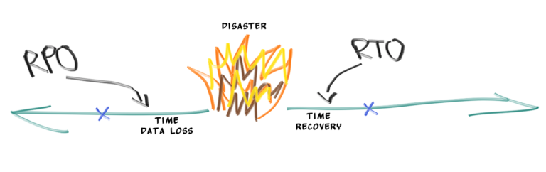
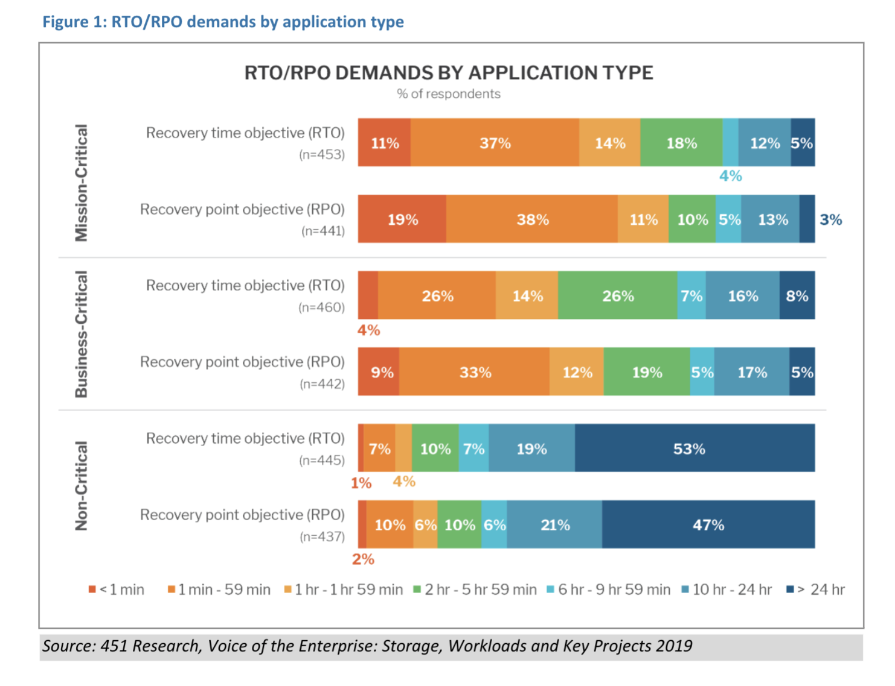
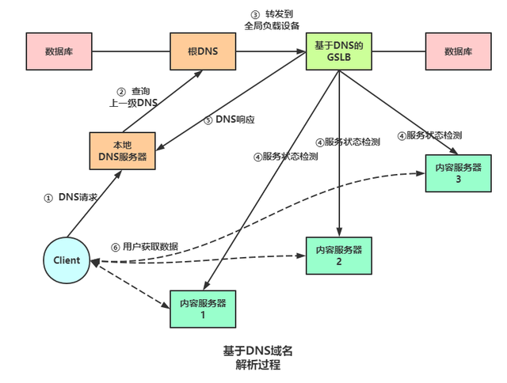
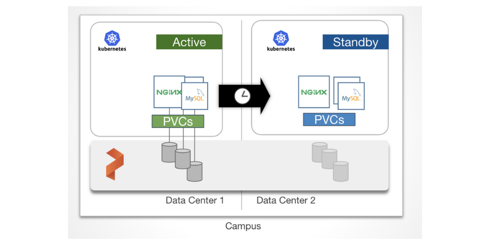
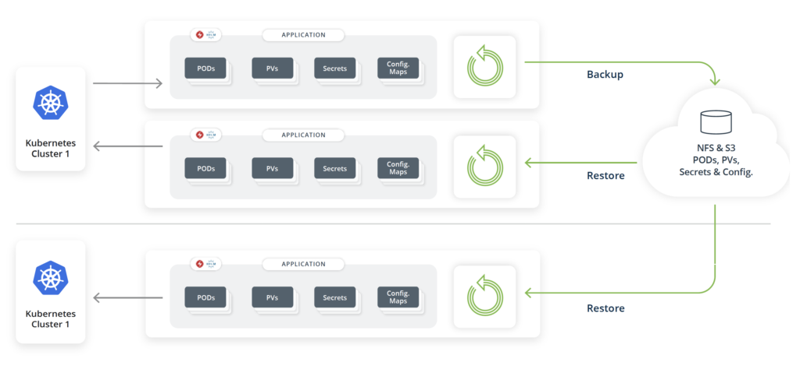
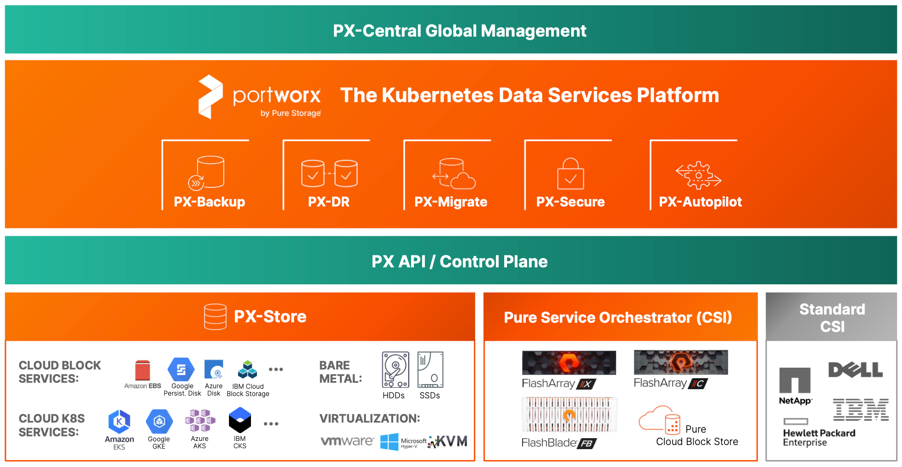
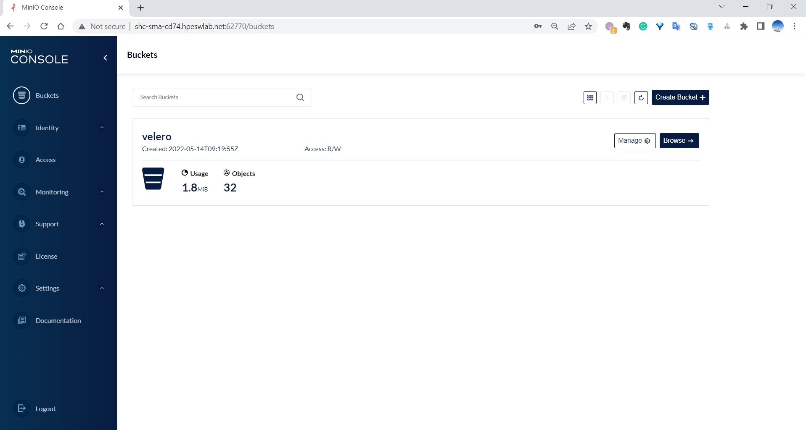
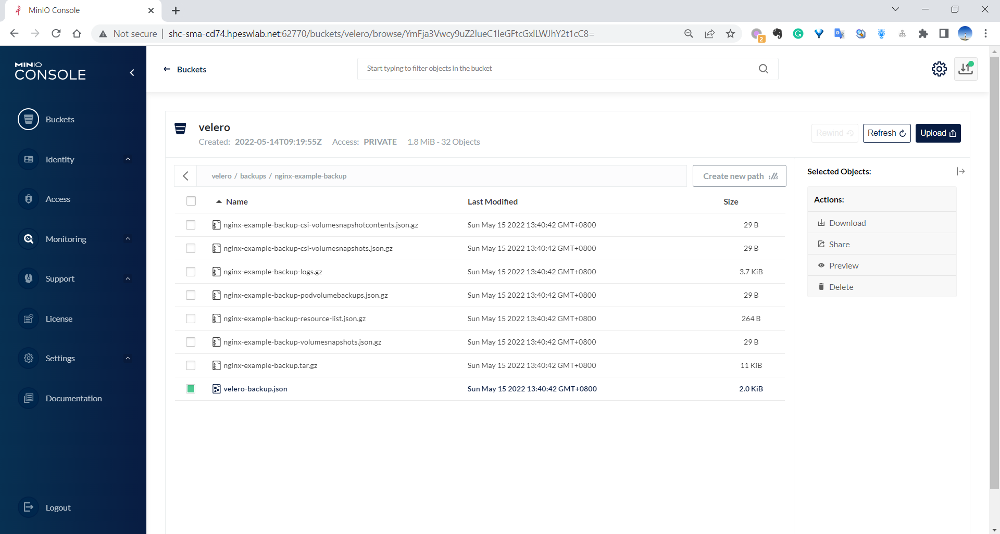

# Kubernetes 的灾难恢复（灾备/Disaster recovery）

## 如何实现灾难恢复（Disaster recovery）？

对于数据中心来说，什么是灾难，或者故障？

灾难，或者故障，并不总是意味着台风或者洪水地震等自然灾害来临，导致数据中心受损。也有可能是网络中断（网线被挖掘机挖断），数据中心火灾等人为事故。以及硬件故障，云供应商不能正常提供服务，甚至是一些安全漏洞。

传统观点认为，灾难恢复计划（DRP - Disaster Recovery Plan ）只适用于本公司自己建造以及管理运维的数据中心或服务平台。

随着 “一切都是服务（ XaaS - X as a Service ）” 的兴起，许多云供应商提供了许多云服务产品，例如 “容器即服务（CaaS - container-as-a-service）”，“ Kubernetes 即服务 （ Kubernetes-as-a-service（KaaS）“ 等，使企业能够更容易的运行容器或者 Pod。

虽然这类云服务产品具有很高的 ”可用性服务级别协议（SLA - service level agreements）“，但也不能保证云服务就不会出现任何问题，我们也要假设当云服务出现问题时，我们的应用程序，以及数据应该怎么办？如何来缓解丢失数据的风险？

Kubernetes 通常使用虚拟机（VM）来运行主节点以及工作节点，这些虚拟机一般托管在自有的数据中心或者云服务商那里。

例如，在2021年12月底，亚马逊的美东地区（US-EAST region ）就经历了多次服务不可用，影响了大量的企业和服务，例如热门网站迪士尼+、Netflix等服务被中断。像这种区域性事件，如果我们的 Kubernetes 应用程序也运行在美东地区的话，那么我们的服务也将变得不可用。

### 灾难恢复计划（DRP）

因此，我们也应该为 Kubernetes 应用程序制定灾难恢复计划（DRP）。

如果我们决定在 Kubernetes 上运行业务应用程序，则不能忽视因为停机或者各类安全事件导致的潜在危险。问题不在于危险是否会发生。危险一定会发生，而在于何时发生。

灾难恢复计划（DRP）不应该是一本厚厚的，没有人会去看的，没人能理解的，几百页的文档。而应该是一份简单的操作手册，强调：

- 应该做什么？
- 由谁来做？

并在尽可能短的时间内恢复业务。

对于 Kubernetes 环境来说，一份有效的灾难恢复计划（DRP）应该有以下三个基本特征：

1. 易操作性
2. 可重复性
3. 适应性

并且这些特征都是相互关联的。制定一份符合这些特征的灾难恢复计划将帮助我们节省更多时间、金钱，并让服务能够快速的重新上线，恢复正常业务。


#### **1. 易操作性**

我们要确保灾难恢复计划的易操作性，这样才能保证，在灾难来临时，我们的团队可以很容易的根据操作手册来执行计划中的步骤，使服务重新上线。

创建灾难恢复计划时，我们必须结合自身应用程序的需求，做出五个关键决策：

1. 灾难恢复的策略？
2. 灾难恢复的目标时间（RTO - recovery time objective ）？
3. 灾难恢复的还原点（ RPO - recovery point objective ）？
4. 流量切换？
5. 备份数据？

接下来，我们来聊聊这五个关键决策都代表了什么含义。

##### **灾难恢复的策略**

通常，灾难恢复的策略有以下几种：

1. 备份和恢复 / Backup and restore
2. 主备切换 / Active standby
3. 双主备份 / Active active

每种灾难恢复策略都有其利弊。根据应用程序 SLA 要求和成本预算，我们需要仔细评估，帮助确定可接受的 RPO 和 RTO。


##### **灾难恢复的目标时间 RTO & 灾难恢复的还原点 RPO**



简而言之：

- RTO 是指我们的系统在重新上线之前，将要忍受的停机时间。这段时间的停机不能对企业带来明显的影响。

- RPO 是指我们的系统可以承受的因停机而损失的数据量（按时间衡量）。可以理解为最近的一次快照或备份与停机发生的这段时间内的数据将丢失。例如，我们的系统会在每天的中午12点和午夜12点进行一次备份，那么最坏的情况是，我们将丢失12个小时的数据，例如故障发生在 23:59:59，那么从12:01 到 23:59 这段时间内的数据将丢失。

例如，假设 RTO 为15分钟，RPO 为5分钟，那么这意味着我们的系统必须在15分钟内，或更短的时间内恢复服务。并且最多允许5分钟内的数据丢失。

RTO/RPO 的数值越小，企业可以越快恢复业务，但成本也越高。所以我们需要根据我们系统的 SLA 要求和成本预算，仔细确定 RTO/RPO 目标。

有一项对 IT 企业的调查报告，调查报告显示，随着应用程序重要性的增加，RPO 和 RTO 的数值则会不断减小。例如，48% 的企业要求关键性的应用服务，RTO 需少于1小时，57% 的企业要求关键性的应用服务，RPO 需小于1小时。（1小时内恢复系统，只能容忍1小时内的数据丢失。）



> 参考资料：
>
> https://portworx.com/blog/kubernetes-data-management-perspective-understanding-rto-rpo/


##### **流量切换**

在流量切换方面，当故障发生时，需要确保我们的网络流量能够故障切换（failover）到新群集或者备用集群（根据灾难恢复策略的不同）一般我们可以通过更改DNS条目，或全局负载均衡（Global Server Load Balance, GSLB）手动或自动实现故障切换。

> 全局负载均衡（Global Server Load Balance, GSLB）,全局负载均衡是指对分别放置在不同的地理位置的服务器群间作负载均衡。服务器负载均衡是指对本地的服务器群做负载均衡。主要用于在多个区域拥有自己服务器的站点，为了使全球用户只以一个IP地址或域名就能访问到离自己最近的服务器，从而获得最快的访问速度。
>
> **服务器群选择**
>
> 对于全局负载均衡而言，其核心就是服务器群的选择。对于某个特定的客户，应该将其定向到哪一个服务群？应该使用什么标准来进行这种选择？一般情况下，主要考虑两个因素：临近程度和负载大小。
>
> **基于DNS的GSLB**
>
> 用户访问某个网站时，需要首先通过域名解析服务（DNS）获得网站的IP。域名解析通常不是一次性完成的，常常需要查询若干不同的域名服务器才能找到对应的IP。如下图所示，用户首先在本地配置一个本地DNS服务器地址，本地DNS服务器收到DNS请求后若不能解析，会将请求转发给更高一级的DNS服务器直到找到域名对应的IP或确定域名不存在。
>
> 
>
> 对于加入了GSLB的情况，一个GSLB设备（可能是一个4层交换机）会最终代替DNS服务器完成域名解析。
>
> 
>
> **参考资料：**
>
> https://baijiahao.baidu.com/s?id=1705954384087524394&wfr=spider&for=pc


##### **备份数据**

在 Kubernetes 集群中，我们需要备份哪些数据呢？大致可以分成以下三类。

1. Kubernetes 数据
   - 容器镜像
   - Kubernetes YAMLs （Deployment，Pod，Service，Ingress）
2. 基础架构数据
   - K8s 集群自定义配置
     - K8s 节点配置（添加的 节点 Label）
     - 开启的 K8s 功能
   - etcd
3. 数据
   - 文件数据 / Persistent Volumes
   - 数据库

根据集群的拓扑结构，自定义配置的不同，我们可能需要备份基础架构数据，也可能不需要备份。


#### **2. 可重复性**

我们应该定期进行演习（Dry Run），就像消防演习一样，模拟当灾难情况发生时，我们应该怎么做。每次演习，都能够帮助我们仔细评估我们的准备工作是否足够，同时也是对员工的培训。根据演习结果，我们需要定期审查和更新我们的灾难恢复计划。


一切都是熟能生巧，我们越多的对 Kubernetes 环境进行灾难恢复测试，我们团队成员就越有信心在灾难发生时，能够妥善处理灾难。

如果我们能自动化灾难恢复的过程，这是非常好的，但这并不是强制的，我们并不能预测所有可能发生的故障，并编码对应的故障解决方案。我们只能尽可能的去分析可能发生故障的情况。有一句名言：Design for Failure and Nothing Fails. 放在这里也挺合适的，我们要尽可能多的考虑各种失败的情况，提前做好防范措施。那我们就一定能成功，不会遇到那些已知的失败情况。

操作员和灾难恢复计划制定者的技术能力也是灾难恢复计划的重要组成部分。原因有二：

首先，操作员能够使用自制脚本或其他工具尽可能多地自动化计划中的步骤。

第二，随着系统的更新迭代，以及新技术的出现，随着一次次的灾难演习，DRP 的制定者需要不断的更新优化灾难恢复计划。


#### **3. 适应性**

始终从长远考虑，确保每个人都能清楚地理解灾难恢复计划，并时时更新。我们可以从一个简单的灾难恢复计划开始，随着演习的进行，或者系统环境的变化（变得更复杂），不断更新我们的计划。

确保以下几点，可以让我们的计划更具适应性：

- 选择合适的灾难恢复策略，因地制宜，不要为了技术而技术，不一定要选择最复杂的双主备份方案。
- 根据 **RTO & RPO** 制定合适的备份和还原计划。
- 进行演习，确保每个人都理解，以及更新灾难恢复计划。

不计划就是计划失败（Failing to plan is planning to fail.）。虽然今天的 IT 基础设施比几年前更加强健，但系统比以往任何时候都更加复杂和分散。一个有效的灾难恢复计划（ DRP）应该是简单的、可重复的和适应性强的。虽然没有完美的计划，但我们可以从现在开始，不断的推演，不断的完善我们的计划。

虽然灾难恢复计划不需要我们每天都要执行，但当灾难发生时，它却至关重要。


#### **总结**

一个成功的灾难恢复计划并不是我们用了多少前沿的新技术，而是选择了适合自己的技术方案，跑通整个流程，跑通各个环节。

当制定灾难恢复计划（DRP）时，我们需要准备回答以下问题：

- 我们需要备份哪些数据？
- 我们的数据，需要多久备份一次？
- 我们能够承受多少量级的数据丢失，而不引起重要的客户问题？ 
- 我们需要保证，多久我们的服务必须重新上线？
- 我们需要双主备份 / Active active 的灾难恢复的策略吗？
- 如何快速的实现流量切换/故障切换？




## Kubernetes 的灾难恢复解决方案

让我们看看市面上一些流行的 Kubernetes 灾难恢复解决方案。

### 1. TrilioVault for Kubernetes

TrilioVault for Kubernetes 是一个云原生的，可以用于公有云以及混合云的场景中，以满意企业的各种场景需求。

TrilioVault for Kubernetes 提供了整个 Kubernetes 应用程序的备份和恢复，包括数据、元数据和任何与 Kubernetes 相关的对象。

TrilioVault 还可以与许多第三方中间件做集成。例如：

Kubernetes 平台支持：RedHat OpenShift，SUSE RANCHER，Amazon EKS，Google GKE，VMware Tanzu

后端存储支持，S3，NFS等

数据库支持：PostgresSQL，mongoDB，elasticsearch，influxdb，MariaDB，redis，etcd，MySQL

工具：Grafana，Prometheus


**TrilioVault 是如何工作的 ?**



大致流程就是，将 Kubernetes 相关资源备份至远端存储，例如 NFS，S3。

然后当灾难发生时，从远端存储恢复 Kubernetes 相关资源。

> TrilioVault 属于商业解决方案，非免费。更多资料，https://www.trilio.io/triliovault-for-kubernetes/


### 2. Portworx by Pure Storage

Portworx 为企业提供了完整的集成解决方案，包括持久性存储、数据保护、灾难恢复、数据安全、跨云和数据迁移等等。以及运行在Kubernetes 中应用程序的自动化容量管理。



> Portworx 属于商业解决方案，非免费。更多资料：
>
> https://portworx.com/
>
> https://www.purestorage.com/products/cloud-native-applications/portworx.html


### 3. Velero

Velero 是一款开源免费工具，我们可以在公有云和私有云环境中运行 Velero，Velero 可以帮助我们做以下这些事情：

- 备份和恢复 Kubernetes 资源
- 迁移 Kubernetes 集群
- 克隆 Kubernetes 生产环境，用于开发和测试环境

> https://velero.io/
>
> https://github.com/vmware-tanzu/velero


Kubernetes 的灾难恢复并不是一件容易的事。Kubernetes 并不能以传统的方式做备份，往往 Kubernetes 的应用程序是由多个组件构成的，仅用虚拟机快照（VM Snapshot）的方式是不够的，还需要给 NFS 存储，数据库做备份，为了保证数据的一致性，各部分的存储资源，需同时做备份。

从本质上来说，灾难恢复的本质其实就是 “数据可移植性” 的扩展。

为 Kubernetes 的灾难恢复计划选择合适的工具也很重要，接下来，我们讲讲如何使用 Velero。

> 参考资料：
>
> Best of 2021 – How to Implement Disaster Recovery for Kubernetes： https://containerjournal.com/editorial-calendar/best-of-2021/disaster-recovery-for-kubernetes/
>
> Disaster Recovery for Kubernetes：https://petri.com/disaster-recovery-kubernetes/
>
> Disaster recovery in a Kubernetes system: Best practices and solutions：https://techgenix.com/kubernetes-disaster-recovery/


## Velero

Velero 有两部分组成：

1. CLI 工具

2. 运行于 Kubernetes 集群之上的服务器

   

### Velero 是如何工作的？


当我们运行命令 `velero backup create test-backup` 创建 Velero 备份时，主要的工作流如下所示：

1. 本地 `Velero` 客户端发送备份指令给 `Kubernetes API Server`，并在 Kubernetes 集群内创建对象 `Backup`。
2. `BackupController` 监测 `Backup` 对象。
3. `BackupController` 监测到 `Backup` 对象，并开始备份流程。`BackupController` 会向 `Kubernetes API Server` 查询相关数据。
4. `BackupController` 将备份文件上传到远端的对象存储中，例如 AWS S3。

Velero  在 Kubernetes 集群中创建了很多 `CRD` 资源，以及相关的控制器，进行备份恢复等操作实质上是对相关 `CRD` 的操作。

默认情况下，`velero backup create ...` 命令会对持久卷进行磁盘快照。 可以通过添加附加标志 `--snapshot-volumes=false` 来取消磁盘快照。运行 Velero 帮助命令，查看更多可选项 `velero backup create --help`。


#### Kubernetes 首选版本号

Velero 使用 Kubernetes API Server 的首选版本号为每个 Kubernetes 资源做备份。 在恢复 Kubernetes 资源时，为了确保恢复成功，目标 Kubernetes 集群中必须存在相同的 `apiVersion`。  

例如，如果正在备份的 Kubernetes 集群，存在资源 Deployment，并且在 API group  下有 `v1alpha1`、`v1beta1` 和 `v1` 三个版本，而 Kubernetes API Server 的首选版本号是 `v1`，那么所有 Deployment 资源都将备份为 `v1`版本。 在恢复这个集群的备份时，确保目标集群必须具有  API group `v1`，以便恢复资源 Deployment。 注意，`v1` 不需要是目标集群的首选版本，只是需要 `v1` 存在即可。  

换言之，尽量在相同版本的 Kubernetes 集群中做备份和恢复操作。

> 参考资料：
>
> https://velero.io/docs/v1.8/how-velero-works/


### Velero 的后端存储

Velero 支持两种关于后端存储的自定义资源 `CRD`，分别是 `BackupStorageLocation` 和 `VolumeSnapshotLocation`。

它们分别用于配置 Velero 的备份与持久卷快照的存储位置。  

- `BackupStorageLocation` 定义了 Kubernetes 备份资源将被存放的位置。Velero 原生支持 AWS，Azure，GCP 作为后端存储。 

  ```yaml
  # kubectl get BackupStorageLocation default -n velero -o yaml
  apiVersion: velero.io/v1
  kind: BackupStorageLocation
  metadata:
    labels:
      component: velero
    name: default
    namespace: velero
  spec:
    config:
      region: minio
      s3ForcePathStyle: "true"
      s3Url: http://minio.velero.svc:9000
    default: true
    objectStorage:
      bucket: velero
    provider: aws
  ```

- `VolumeSnapshotLocation` 定义了持久卷快照的存储位置。 Velero 支持 AWS，Azure，Portworx 的持久卷快照。 `VolumeSnapshotLocation` 示例如下所示：

  ```yaml
  apiVersion: velero.io/v1
  kind: VolumeSnapshotLocation
  metadata:
    name: aws-default
    namespace: velero
  spec:
    provider: aws
    config:
      region: us-west-2
      profile: "default"
  ```

   

用户可以预先配置一个或多个 `BackupStorageLocations` 和 `VolumeSnapshotLocations`。 

这种配置设计，支持如下的使用情况：  

- 在一个 Kubernetes 集群中，可能同时存在 EBS volumes and Portworx volumes，可以同时对其进行持久卷快照。
- 为了保证更高要求的安全性，我们可以同时将 Velero 备份存储到 AWS 的美国东部地区和美国西部地区，或者其他的云存储供应商。

> 参考资料：
>
> https://velero.io/docs/v1.8/locations/


### 备份

Velero 支持两种备份方式，分别为 "按需备份" 和 “定时备份"。

#### 按需备份 / On-demand backups

运行命令 `velero backup create ...`，直接将 Velero 备份上传到云端的对象存储中，例如 AWS S3 中。

命令示例：

```sh
velero backup create nginx-backup --selector app=nginx
```


#### 定时备份 / Scheduled backups

对于运维人员来说，保证集群的稳定性是必不可少的，这就需要我们开启定时备份功能。好在 Velero 支持定时备份。

Velero 会按 `<SCHEDULE NAME>-<TIMESTAMP>` 格式保存备份文件。其中 `<TIMESTAMP>` 的格式化为 `YYYYMMDDhhmmss`。

例子：

```sh
# 每天备份一次
velero schedule create nginx-daily --schedule="0 1 * * *" --selector app=nginx

# Alternatively, you can use some non-standard shorthand cron expressions:
velero schedule create nginx-daily --schedule="@daily" --selector app=nginx

# Create a backup every 6 hours
velero schedule create NAME --schedule="0 */6 * * *"

# Create a backup every 6 hours with the @every notation
velero schedule create NAME --schedule="@every 6h"

# 更多 cron 的用法，请参考：https://pkg.go.dev/github.com/robfig/cron?utm_source=godoc
```


> 参考资料：
>
> https://velero.io/docs/v1.8/contributions/minio/


#### 还原 / Restores

使用如下命令进行还原操作：

```sh
# 还原
velero restore create --from-backup nginx-backup

# 查询还原记录，当还原操作成功后，将显示 ‘Completed’ 状态。
velero restore get
NAME                          BACKUP         STATUS      WARNINGS   ERRORS    ...                
nginx-backup-20170727200524   nginx-backup   Completed   0          0         ...

# 如果还原失败，可以通过如下命令查看原因
velero restore describe <RESTORE_NAME>
```


> 参考资料：
>
> https://velero.io/docs/v1.8/how-velero-works/


### 实践：在 On-premise 环境备份还原 Kubernetes 集群

#### 1. 安装 Velero Command Line 工具

1. 从官网 https://github.com/vmware-tanzu/velero/releases 下载最新的压缩包。

   ```sh
   wget https://github.com/vmware-tanzu/velero/releases/download/v1.8.1/velero-v1.8.1-linux-amd64.tar.gz
   ```

2. 执行以下解压命令：

   ```shell
   tar -xvf velero-v1.8.1-linux-amd64.tar.gz
   ```

3. 解压缩后，将二进制可执行文件  `velero`  移动到 `$PATH` 目录（对于大多数 Linux 用户来说，`$PATH` 目录就是 `/usr/local/bin` ）。  

   ```sh
   cp velero-v1.8.1-linux-amd64/velero /usr/local/bin/
   ```

4. 测试

   ```sh
   $ velero
   Velero is a tool for managing disaster recovery, specifically for Kubernetes
   cluster resources. It provides a simple, configurable, and operationally robust
   way to back up your application state and associated data.
   
   If you're familiar with kubectl, Velero supports a similar model, allowing you to
   execute commands such as 'velero get backup' and 'velero create schedule'. The same
   operations can also be performed as 'velero backup get' and 'velero schedule create'.
   
   Usage:
     velero [command]
   
   Available Commands:
     backup            Work with backups
     backup-location   Work with backup storage locations
     bug               Report a Velero bug
     client            Velero client related commands
     completion        Generate completion script
     create            Create velero resources
     debug             Generate debug bundle
     delete            Delete velero resources
     describe          Describe velero resources
     get               Get velero resources
     help              Help about any command
     install           Install Velero
     plugin            Work with plugins
     restic            Work with restic
     restore           Work with restores
     schedule          Work with schedules
     snapshot-location Work with snapshot locations
     uninstall         Uninstall Velero
     version           Print the velero version and associated image
   
   Flags:
         --add_dir_header                   If true, adds the file directory to the header
         --alsologtostderr                  log to standard error as well as files
         --colorized optionalBool           Show colored output in TTY. Overrides 'colorized' value from $HOME/.config/velero/config.json if present. Enabled by default
         --features stringArray             Comma-separated list of features to enable for this Velero process. Combines with values from $HOME/.config/velero/config.json if present
     -h, --help                             help for velero
         --kubeconfig string                Path to the kubeconfig file to use to talk to the Kubernetes apiserver. If unset, try the environment variable KUBECONFIG, as well as in-cluster configuration
         --kubecontext string               The context to use to talk to the Kubernetes apiserver. If unset defaults to whatever your current-context is (kubectl config current-context)
         --log_backtrace_at traceLocation   when logging hits line file:N, emit a stack trace (default :0)
         --log_dir string                   If non-empty, write log files in this directory
         --log_file string                  If non-empty, use this log file
         --log_file_max_size uint           Defines the maximum size a log file can grow to. Unit is megabytes. If the value is 0, the maximum file size is unlimited. (default 1800)
         --logtostderr                      log to standard error instead of files (default true)
     -n, --namespace string                 The namespace in which Velero should operate (default "core")
         --skip_headers                     If true, avoid header prefixes in the log messages
         --skip_log_headers                 If true, avoid headers when opening log files
         --stderrthreshold severity         logs at or above this threshold go to stderr (default 2)
     -v, --v Level                          number for the log level verbosity
         --vmodule moduleSpec               comma-separated list of pattern=N settings for file-filtered logging
   
   Use "velero [command] --help" for more information about a command.
   ```

   

> 参考资料：
>
> https://velero.io/docs/v1.8/contributions/minio/


#### 2. 安装 MinIO 服务器

Minio 是一款开源的对象存储服务器，兼容 AWS S3协议。

1. 使用以下 YAML 文件创建 Minio 服务器。

    ```sh
    kubectl apply -f ./00-minio-deployment-modified.yaml
    ```

    ```yaml
    # 00-minio-deployment-modified.yaml
    ---
    apiVersion: v1
    kind: Namespace
    metadata:
      name: velero
    
    ---
    apiVersion: v1
    kind: PersistentVolume
    metadata:
      name: minio-pv
      labels:
        pv: minio
    spec:
      capacity:
        storage: 10Gi
      volumeMode: Filesystem
      accessModes:
      - ReadWriteOnce
      persistentVolumeReclaimPolicy: Retain
      nfs:
        # mkdir /var/vols/itom/itsma/global-volume/velero
        # chmod 777 /var/vols/itom/itsma/global-volume/velero
        path: /var/vols/itom/itsma/global-volume/velero
        server: shc-sma-cd74.hpeswlab.net
    
    ---
    kind: PersistentVolumeClaim
    apiVersion: v1
    metadata:
      name: minio-pvc
      namespace: velero
      labels:
        app: minio
    spec:
      accessModes:
        - ReadWriteOnce
      resources:
        requests:
          storage: 10Gi
      selector:
        matchLabels:
          pv: minio
    
    ---
    apiVersion: apps/v1
    kind: Deployment
    metadata:
      namespace: velero
      name: minio
      labels:
        component: minio
    spec:
      strategy:
        type: Recreate
      selector:
        matchLabels:
          component: minio
      template:
        metadata:
          labels:
            component: minio
        spec:
          volumes:
            - name: storage                      # This Line.
              persistentVolumeClaim:             # This Line.
               claimName: minio-pvc              # This Line.
          # - name: storage
          #   emptyDir: {}
            - name: config
              emptyDir: {}
          containers:
          - name: minio
            image: minio/minio:latest
            imagePullPolicy: IfNotPresent
            args:
            - server
            - /storage
            - --config-dir=/config
            - --console-address=:9001             # This Line.
            env:
            - name: MINIO_ACCESS_KEY              # This Line.
              value: "minio"                      # This Line.
            - name: MINIO_SECRET_KEY              # This Line.
              value: "minio123"                   # This Line.
            ports:
            - containerPort: 9000
            - containerPort: 9001                 # This Line.
            volumeMounts:
            - name: storage
              mountPath: "/storage"
            - name: config
              mountPath: "/config"
    
    ---
    apiVersion: v1
    kind: Service
    metadata:
      namespace: velero
      name: minio
      labels:
        component: minio
    spec:
      # ClusterIP is recommended for production environments.
      # Change to NodePort if needed per documentation,
      # but only if you run Minio in a test/trial environment, for example with Minikube.
      # type: ClusterIP
      type: NodePort
      ports:
        - name: api                          # This Line.
          port: 9000                         # This Line.
          targetPort: 9000                   # This Line.
          protocol: TCP                      # This Line.
        - name: console                      # This Line.
          port: 9001                         # This Line.
          targetPort: 9001                   # This Line.
          protocol: TCP                      # This Line.
      selector:
        component: minio
    
    ---
    apiVersion: batch/v1
    kind: Job
    metadata:
      namespace: velero
      name: minio-setup
      labels:
        component: minio
    spec:
      template:
        metadata:
          name: minio-setup
        spec:
          restartPolicy: OnFailure
          volumes:
          - name: config
            emptyDir: {}
          containers:
          - name: mc
            image: minio/mc:latest
            imagePullPolicy: IfNotPresent
            command:
            - /bin/sh
            - -c
            - "mc --config-dir=/config config host add velero http://minio:9000 minio minio123 && mc --config-dir=/config mb -p velero/velero"
            volumeMounts:
            - name: config
              mountPath: "/config"
    ```

    > 在默认的 `velero-v1.8.1-linux-amd64\examples\minio\00-minio-deployment.yaml` 提供的 YAML 文件上做了以下修改：
    >
    > 1. 添加 PV 和 PVC 替代 emptyDir。
    > 2. 暴露 MinIO 的 Console 端口 9001，以便通过浏览器访问 MinIO

1. 验证安装：

    ```sh
    $ kubectl get pods -n velero
    NAME                    READY   STATUS      RESTARTS   AGE
    minio-6754cfd79-xq8cv   1/1     Running     0          105s
    minio-setup-c5s66       0/1     Completed   0          105s
    ```

3. 查询 Minio 的 NodePort

   ```sh
   $ kubectl get svc/minio -n velero 
   NAME    TYPE       CLUSTER-IP      EXTERNAL-IP   PORT(S)                        AGE
   minio   NodePort   172.17.20.234   <none>        9000:4722/TCP,9001:62770/TCP   52s
   # 使用端口 9001 对应的 NodePort 访问 MinIO 的 UI 界面，即 NodePort：62770
   ```

4. 访问 http://[host name]:62770，登录 MinIO。用户名密码为 minio / minio123。

   

   > 登录密码由 Deployment 的环境变量指定。
   >
   > ```yaml
   >     env:
   >     - name: MINIO_ACCESS_KEY              # This Line.
   >       value: "minio"                      # This Line.
   >     - name: MINIO_SECRET_KEY              # This Line.
   >       value: "minio123"                   # This Line.
   > ```

> 参考资料：
>
> https://min.io/
>
> https://velero.io/docs/v1.8/contributions/minio/
>
> https://docs.min.io/docs/minio-docker-quickstart-guide.html
>
> https://www.ibm.com/docs/en/cloud-private/3.2.0?topic=console-namespace-is-stuck-in-terminating-state


#### 3. 安装 Velero 服务器

1. 新建 `credentials-velero` 文件

   ```properties
   [default]
   aws_access_key_id = minio
   aws_secret_access_key = minio123
   ```

2. 运行以下命令创建 Velero 服务器。

   ```shell
   # Without Restic and without Volume Snapshot.
   velero install \
       --provider aws \
       --plugins velero/velero-plugin-for-aws:v1.2.1 \
       --bucket velero \
       --secret-file ./credentials-velero \
       --use-volume-snapshots=false \
       --backup-location-config region=minio,s3ForcePathStyle="true",s3Url=http://minio.velero.svc:9000
       
   # With Restic and with Volume Snapshot.
   # Restic is a modern backup program that can back up your files.
   # Restic Integration
   # Velero has support for backing up and restoring Kubernetes volumes using a free open-source backup tool called restic.
   velero install \
       --provider aws \
       --plugins velero/velero-plugin-for-aws:v1.2.1 \
       --bucket velero \
       --secret-file ./credentials-velero \
       --use-volume-snapshots=true \
       --backup-location-config region=minio,s3ForcePathStyle="true",s3Url=http://minio.velero.svc:9000  \
       --snapshot-location-config region="minio" \
       --use-restic
       
       
   velero install \
    --provider aws \
    --plugins velero/velero-plugin-for-aws:v1.0.0 \
    --bucket velero2  \
    --secret-file ./credentials-velero  \
    --use-volume-snapshots=true \
    --backup-location-config region=default,s3ForcePathStyle="true",s3Url=http://minio.10.x.y.z.nip.io  \
    --image velero/velero:v1.4.0  \
    --snapshot-location-config region="default" \
    --use-restic
   ```

3. 验证安装：

   ```sh
   $ kubectl get pods -n velero
   NAME                      READY   STATUS      RESTARTS   AGE
   minio-6754cfd79-xq8cv     1/1     Running     0          14m
   minio-setup-c5s66         0/1     Completed   0          14m
   velero-55c9c79cf8-v4mvc   1/1     Running     0          7s           # This Line.
   ```

   > 删除 Velero
   >
   > ```sh
   > kubectl delete deployment,crd,clusterrolebinding -n velero -l component=velero
   > ```

> 其他云平台安装方式，请参考：
>
> https://vmware-tanzu.github.io/helm-charts/
>
> https://github.com/vmware-tanzu/velero-plugin-for-aws#Install-and-start-Velero
>
> https://github.com/vmware-tanzu/velero-plugin-for-microsoft-azure#install-and-start-velero
>
> https://github.com/vmware-tanzu/velero-plugin-for-gcp#install-and-start-velero


#### 4. 创建 Kubernetes Demo 资源

创建 Kubernetes 对象，包括：

- Namespace: nginx-example
- StorageClass: nfs-storage
- PersistentVolume: nginx-pv
- PersistentVolumeClaim: nginx-logs
- Deployment: nginx-deployment
- Service: my-nginx

**注意：** 

创建的 Kubernetes 资源中包括 PV 对象，但是 PV 对象的 `persistentVolumeReclaimPolicy` 不能是 `Delete`，否则 `velero restore` 不能恢复 PV。详情请看 Github Issue。

> Not restoring PV because it doesn't have a snapshot and its reclaim policy is Delete.
>
> https://github.com/vmware-tanzu/velero/issues/1145

```sh
kubectl apply -f ./nginx-demo.yaml

kubectl get pods -n nginx-example
```

```yaml
# nginx-demo.yaml
---
apiVersion: v1
kind: Namespace
metadata:
  name: nginx-example
  labels:
    app: nginx

---
# storage class manifest
apiVersion: storage.k8s.io/v1
kind: StorageClass
metadata:
  name: nfs-storage
provisioner: kubernetes.io/no-provisioner

---
apiVersion: v1
kind: PersistentVolume
metadata:
  name: nginx-pv
spec:
  capacity:
    storage: 10Gi
  volumeMode: Filesystem
  accessModes:
  - ReadWriteOnce
  # Not restoring PV because it doesn't have a snapshot and its reclaim policy is Delete.
  # https://github.com/vmware-tanzu/velero/issues/1145
  persistentVolumeReclaimPolicy: Retain
  storageClassName: nfs-storage
  nfs:
    path: /var/vols/itom/itsma/global-volume
    server: shc-sma-cd74.hpeswlab.net

---
kind: PersistentVolumeClaim
apiVersion: v1
metadata:
  name: nginx-logs
  namespace: nginx-example
  labels:
    app: nginx
spec:
  storageClassName: nfs-storage
  accessModes:
    - ReadWriteOnce
  resources:
    requests:
      storage: 50Mi

---
apiVersion: apps/v1
kind: Deployment
metadata:
  name: nginx-deployment
  namespace: nginx-example
spec:
  replicas: 1
  selector:
    matchLabels:
      app: nginx
  template:
    metadata:
      labels:
        app: nginx
      # annotations:
      #   pre.hook.backup.velero.io/container: fsfreeze
      #   pre.hook.backup.velero.io/command: '["/sbin/fsfreeze", "--freeze", "/var/log/nginx"]'
      #   post.hook.backup.velero.io/container: fsfreeze
      #   post.hook.backup.velero.io/command: '["/sbin/fsfreeze", "--unfreeze", "/var/log/nginx"]'
    spec:
      volumes:
        - name: nginx-logs
          persistentVolumeClaim:
           claimName: nginx-logs
      containers:
      - image: nginx:1.17.6
        name: nginx
        ports:
        - containerPort: 80
        volumeMounts:
          - mountPath: "/var/log/nginx"
            name: nginx-logs
            readOnly: false
      - image: ubuntu:bionic
        name: fsfreeze
        securityContext:
          privileged: true
        volumeMounts:
          - mountPath: "/var/log/nginx"
            name: nginx-logs
            readOnly: false
        command:
          - "/bin/bash"
          - "-c"
          - "sleep infinity"

  
---
apiVersion: v1
kind: Service
metadata:
  labels:
    app: nginx
  name: my-nginx
  namespace: nginx-example
spec:
  ports:
  - port: 80
    targetPort: 80
  selector:
    app: nginx
  type: LoadBalancer
```


#### 5. 使用 Velero 备份 Kubernetes 资源

1. 备份前，确认 Kubernetes 资源处于正常状态。

   ```sh
   kubectl get pods -n nginx-example
   kubectl get pv
   ```

2. 使用 Velero 备份 Kubernetes 资源，仅备份命名空间 `nginx-example` 下的所有 Kubernetes 资源。但会包括使用到的 PV。

   ```sh
   velero backup create nginx-example-backup --include-namespaces nginx-example --wait
   
   # velero client config set namespace velero
   
   # 更多命令，请使用 --help 查看
   velero backup create --help
   ```

3. 我们可以通过 MinIO 的 UI 查看备份的数据，如下图所示为备份文件 nginx-example-backup。下载 nginx-example-backup，解压后我们可以看到 Kubernetes 的资源文件，以及日志信息。

   

#### 6. 模拟 Kubernetes 资源受损

```sh
# Simulate a disaster:
kubectl delete ns nginx-example
kubectl delete pv nginx-pv

# 查看 Kubernetes 是否真实被删除
kubectl get pods -n nginx-example
kubectl get pv
```


#### 7. 使用 Velero 还原 Kubernetes 资源

```shell
velero restore create --from-backup nginx-example-backup --wait

# 查看 Kubernetes 是否真实被还原
kubectl get pv
kubectl get pods -n nginx-example
```


#### 8. 备份/还原 Volume

> 建议使用 Restic 或者 rsync 等工具，单独备份 Volume（NFS）。

Velero supports backing up and restoring Kubernetes volumes using a free open-source backup tool called [restic](https://github.com/restic/restic). This support is considered beta quality. Please see the list of [limitations](https://velero.io/docs/main/restic/#limitations) to understand if it fits your use case.

##### To back up

Velero supports two approaches of discovering pod volumes that need to be backed up using Restic:

- Opt-in approach: Where every pod containing a volume to be backed up using Restic must be annotated with the volume’s name.
- Opt-out approach: Where all pod volumes are backed up using Restic, with the ability to opt-out any volumes that should not be backed up.

###### Steps:

1. Let’s write some random data in the Pod. Restic compresses data, so if it is not random you will not know the performance.

   ```sh
   $ kubectl get pods -n nginx
   NAME                                READY   STATUS    RESTARTS   AGE
   nginx-deployment-694bc67b4b-l7t76   2/2     Running   0          3h36m
   
   $ kubectl -n nginx-example exec -it nginx-deployment-694bc67b4b-zx8xs -- /bin/bash
   # dd if=/dev/urandom of=/var/log/nginx/test-file3.txt count=512000 bs=1024
   
   # ls -lh /var/log/nginx               
   total 501M
   -rw-r--r--.  1 1999 1999   24 May 20 07:27 access.log
   -rw-r--r--.  1 1999 1999    0 May 20 04:10 error.log
   -rw-r--r--.  1 1999 1999 500M May 20 07:48 test-file3.txt
   ```

2. To backup all pod volumes.

   ```sh
   # To backup all pod volumes using restic without having to apply annotation on the pod, run the velero install command with the --default-volumes-to-restic flag.
   # By default, where every pod containing a volume to be backed up using Restic must be annotated with the volume’s name.
   # kubectl -n YOUR_POD_NAMESPACE annotate pod/YOUR_POD_NAME backup.velero.io/backup-volumes=YOUR_VOLUME_NAME_1,YOUR_VOLUME_NAME_2,...
   velero backup create nginx-example-volume-backup --default-volumes-to-restic --include-namespaces nginx-example --wait
   ```

##### To restore

Regardless of how volumes are discovered for backup using Restic, the process of restoring remains the same.

1. Restore from your Velero backup:

   ```bash
   velero restore create --from-backup BACKUP_NAME OPTIONS...
   
   velero restore create --from-backup nginx-example-volume-backup --wait
   ```

2. When the restore completes, view information about your pod volume restores:

   ```bash
   velero restore describe YOUR_RESTORE_NAME
   ```

   ```bash
   kubectl -n velero get podvolumerestores -l velero.io/restore-name=YOUR_RESTORE_NAME -o yaml
   ```

> 参考资料：
>
> https://medium.com/techlogs/using-velero-and-restic-to-backup-kubernetes-2f0f812da4db
>
> https://velero.io/docs/main/restic/


#### 9. 删除 Velero 备份

```sh
velero backup delete nginx-example-backup
```

> 参考资料：
>
> https://velero.io/docs/v1.8/contributions/minio/
>
> https://devops.cisel.ch/backup-kubernetes-pv-with-velero-the-new-approach
>
> https://velero.io/docs/v1.8/examples/


> A Complete Guide to PostgreSQL Backup & Recovery
>
> https://www.enterprisedb.com/postgresql-database-backup-recovery-what-works-wal-pitr