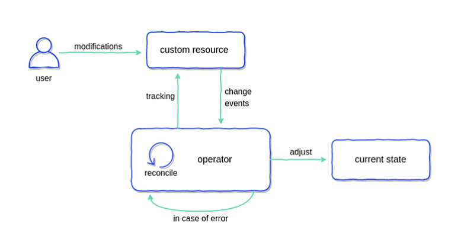
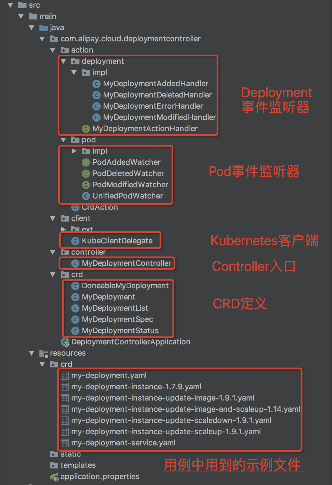

# 了解一下 Kubernetes 的 Operator 模式

我们已经学习过 Kubernetes 自带的管理有状态应用的控制器 StatefulSet，它能够完成应用的拓扑顺序状态管理，比如，重启时按照顺序重建 Pod，以及结合 PVC 完成应用的存储状态管理。

在 Kubernetes 生态中还有一种更灵活、编程友好的解决方案 -- Operator， 它能让使用者根据自己应用的特性定义应用对象和管理对象的控制器。

## 什么是 CRD？

在了解 Operator 之前，我们先来讲讲，什么是 CustomResourceDefinition，简称 CRD？

CRD 是 Kubernetes 为提高可扩展性，让开发者可以自定义资源（如Deployment，StatefulSet等）的一种方法。

CRD 仅仅是资源的定义，不包含任何的业务逻辑，需要我们自己编写 Controller，由 Controller 去监听 CRD 的 CRUD 事件，并编写对应的业务逻辑。

### 创建 CustomResourceDefinition

创建一个 CRD，跟 Kubernetes 中的其他 YAML 文件很类似。以下面文件为例：

```yaml
# resourcedefinition.yaml
apiVersion: apiextensions.k8s.io/v1
kind: CustomResourceDefinition
metadata:
  # name must match the spec fields below, and be in the form: <plural>.<group>
  name: crontabs.stable.example.com
spec:
  # group name to use for REST API: /apis/<group>/<version>
  group: stable.example.com
  # list of versions supported by this CustomResourceDefinition
  versions:
    - name: v1
      # Each version can be enabled/disabled by Served flag.
      served: true
      # One and only one version must be marked as the storage version.
      storage: true
      schema:
        openAPIV3Schema:
          type: object
          properties:
            spec:
              type: object
              properties:
                cronSpec:
                  type: string
                image:
                  type: string
                replicas:
                  type: integer
  # either Namespaced or Cluster
  scope: Namespaced
  names:
    # plural name to be used in the URL: /apis/<group>/<version>/<plural>
    plural: crontabs
    # singular name to be used as an alias on the CLI and for display
    singular: crontab
    # kind is normally the CamelCased singular type. Your resource manifests use this.
    kind: CronTab
    # shortNames allow shorter string to match your resource on the CLI
    shortNames:
    - ct
```

这是一个最基本的 CRD 定义，包含最少的必要字段。这里主要说明一下 `names` 和 `schema` 字段，`names` 字段指定了，我们用 kubectl 与自定义资源（Custom Resource）进行交互时的名字，例如我们可以使用 `kubectl get crontabs` 查询自定义资源（Custom Resource）。

并且所有的自定义资源（Custom Resource）中必须包含 `schema` 中定义的 `properties` 字段。

我们必须记住，如果 CRD 没有控制器 Controller，那么 CRD 只是声明性对象，不会起任何作用。我们可以编写 Controller 对 `schema` 中的字段进行操作，例如 `cronSpec` 字段，我们用它来表示 CronJob 运行的频率。

当我们创建 CustomResourceDefinition（CRD）时，Kubernetes API 服务器会为每一个版本的 CRD 生成一个 RESTful 的资源路径。CRD 的作用域可以是 namespace 级别的，也可以是集群级别的，这取决于 CRD 的 `scope` 字段。和其他现有的内置对象一样，当 namespace 被删除时，该 namespace 下的所有 CRD 资源也会被删除。CustomResourceDefinition 本身是不受 namespace 限制的，对所有 namespace 可见。

我们将上述 CRD 保存为文件，并使用 kubectl 命令创建它：

```sh
$ kubectl apply -f resourcedefinition.yaml
customresourcedefinition.apiextensions.k8s.io/crontabs.stable.example.com created
```

一个新的 RESTful 资源路径将被创建出来：

```sh
/apis/stable.example.com/v1/namespaces/*/crontabs/...
```

我们可以通过此 RESTful 资源路径创建和管理自定义对象。这些自定义对象的 YAML 规范就是由刚刚创建的 CRD 所定义的。


### 创建自定义对象 Custom Resource

当 CustomResourceDefinition 对象创建之后，我们就可以创建自定义对象 （Custom Resource）了。

```yaml
# my-crontab.yaml
apiVersion: "stable.example.com/v1"
kind: CronTab
metadata:
  name: my-new-cron-object
spec:
  cronSpec: "* * * * */5"
  image: my-awesome-cron-image
```

然后使用 kubectl 命令创建自定义对象 CronTab。

```sh
$ kubectl apply -f my-crontab.yaml
crontab.stable.example.com/my-new-cron-object created
```

我们也可以使用 kubectl 命令管理自定义对象 CronTab，就跟操作 Kubernetes 内置对象一样。

```sh
$ kubectl get crontab
NAME                 AGE
my-new-cron-object   118s

# 也可以使用 short name 查询 CronTab
$ kubectl get ct my-new-cron-object -o yaml
apiVersion: stable.example.com/v1
kind: CronTab
metadata:
  annotations:
    kubectl.kubernetes.io/last-applied-configuration: |
      {"apiVersion":"stable.example.com/v1","kind":"CronTab","metadata":{"annotations":{},"name":"my-new-cron-object","namespace":"default"},"spec":{"cronSpec":"* * * * */5","image":"my-awesome-cron-image"}}
  creationTimestamp: "2022-06-07T13:32:23Z"
  generation: 1
  name: my-new-cron-object
  namespace: default
  resourceVersion: "7944"
  uid: a658af97-e8a5-49ee-933f-706e8fbfe83d
spec:
  cronSpec: '* * * * */5'
  image: my-awesome-cron-image
```


## 什么是 Operator ?

Operator 概念是由 CoreOS 的工程师于2016年提出的，它让工程师可以根据应用独有的领域逻辑为应用编写自定义的控制器。这句话说的有点虚空，但总结一下就是下面这个公式。

**Operator = CRD + Controller**

CRD 仅仅是资源的定义，而由 Controller 负责去监听 CRD 的 CRUD 事件，并执行自定义业务逻辑。




### 如何去实现一个 Controller 呢？

那么如何去实现一个 Controller 呢？可以使用 Go 来实现，不论是参考资料还是开源支持都非常好，推荐有 Go 语言基础的同学优先考虑用 [client-go](https://github.com/kubernetes/client-go) 作为 Kubernetes 的客户端，用 [KubeBuilder](https://github.com/kubernetes-sigs/kubebuilder) 生成代码骨架。附上一个官方的 Controller 示例项目：[sample-controller](https://github.com/kubernetes/sample-controller)。

对于 Java 来说，我们可以使用 [Fabric8](https://github.com/fabric8io/kubernetes-client) 作为 Kubernetes 的客户端。对 Pod、Deployment 都有 DSL 定义，而且构建对象是以 Builder 模式构建的，代码写起来比较舒服。

无论是  [client-go](https://github.com/kubernetes/client-go) 还是 [Fabric8](https://github.com/fabric8io/kubernetes-client)，这些客户端本质上都是通过 REST 接口来与 Kubernetes API Server 通信的。

Controller 的逻辑其实很简单：监听 CRD 实例（以及关联的资源）的 CRUD 事件，然后执行相应的业务逻辑。

可以参考代码：https://github.com/songxinjianqwe/deployment-controller，Fork 地址：https://github.com/cainzhong/deployment-controller

**项目工程结构**



> 参考资料：
>
> https://blog.csdn.net/kevin_tech/article/details/113362038
>
> https://www.servicemesher.com/blog/kubernetes-crd-quick-start/


### 运行 Controller

我们可以将 Controller 代码容器化后，打包成镜像，以 Deployment 的形式部署到 Kubernetes 集群中。然后 Controller 就可以监控 CRD 的 CRUD 事件，并作出对应的业务逻辑反馈。

> 参考资料：
>
> https://zhuanlan.zhihu.com/p/246550722


## 什么时候使用 Operator ？

与任何工具一样，我们不能滥用 Operator。 Operator 提供了一种将 Kubernetes 与我们的业务用例更紧密结合的方式。

在评估 Operator 的潜在用例时，我们必须考虑其复杂性。一般来说，如果复杂的解决方案不能提供良好的回报，建议避免使用它们。考虑到这一点，建议谨慎使用 Operator，除非它能带给你极大的回报。

虽然使用 Operator 有可能可以解决你的问题，但 Kubernetes 的内置对象也可以解决你的问题，那为什么不使用 Kubernetes 的内置对象呢？并且 Kubernetes 的内置对象有完善的文档，易于理解学习。

我们来举一个例子，你可能想创建一个 CRD，将 Deployment，Service，Ingress 全部捆绑在一个自定义资源中。你不仅需要编写自定义控制器才能使 CRD 真正的工作，这种方法明显增加了不必要的复杂性，可能对于项目新手来说，也很难理解你的 CRD。

如您所见，创建 CRD 是一个相对简单的过程。但寻找好的用例，这可能会非常棘手。请谨慎评估您的用例，以确保 CRD 能够很好地解决您的问题，并且不会使事情变得不必要地复杂，这一点至关重要。

如果 CRD 非常适合您的用例，那么它会变得非常有价值。

### CRD vs. ConfigMap

但从我个人而言，我至今没有发现一个特别适合使用 Operator 的用例。见得比较多的是，大家把 CRD 当做 ConfigMap 在使用，但并不能完全等价于 ConfigMap，它们之间还是存在比较明显的区别的。

- ConfigMap 的设计目的是为 Pod 提供配置参数。ConfigMap 可以以文件或者环境变量的方式挂载到 Pod 中。
- CRD 也可以由 Pod 使用，但只能通过 Restful 请求 （Kubernetes API）的方式来使用。 CRD 相比于 ConfigMap 的好处是，能自定义更复杂的结构化数据。

对于适合 Operator 或者 CRD 的用例，不知道大家有何想法？听听大家的想法。

> 参考资料：
>
> https://thenewstack.io/kubernetes-crds-what-they-are-and-why-they-are-useful/
>
> https://loft.sh/blog/kubernetes-crds-custom-resource-definitions/
>
> https://kubernetes.io/docs/concepts/extend-kubernetes/api-extension/custom-resources/
>
> https://kubernetes.io/docs/concepts/extend-kubernetes/operator/