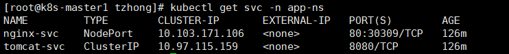

# Troubleshooting Pod-to-Pod Communication Cross Nodes

**现象描述：**打开Service `nginx-svc`的NodePort，Pod nginx运行在k8s-node1上。   在k8s-master1上运行`curl http://localhost:30309`，最终Connection timed out。但在k8s-node1上运行`curl http://localhost:30309`，可以正常获得返回。

*查看`nginx-svc`的NodePort*



*在k8s-master1上，测试`curl http://localhost:30309`的结果*

   

   *在k8s-node1上，测试`curl http://localhost:30309`的结果*

   

**补充一点：**当两个Pod在不同Node上时，它们之间的通信也是有问题的。应该是同样的问题，都属于跨Node通信存在问题。stackoverflow上可以找到类似的问题[could not communicate cross node's pod in kubernetes cluster using flannel](https://stackoverflow.com/questions/62171023/could-not-communicate-cross-nodes-pod-in-kubernetes-cluster-using-flannel)，但是人家虚拟机部署在阿里云上，然后重装集群，问题就解决了。但是我是装在本机的，重装也没有解决问题。

**再补充一点：**如果集群用的是NAT + host-only的网卡，那么从master node上的pod里面发请求到worker node上的pod，网络是不通的。但如果两个pod都在master/worker node上，网络请求就是通的。
然后，我又搭了一套集群，用的是桥接网卡，然后pod之间的网络，就没有上述现象，一切畅通无阻。master node上的pod可以正常发请求给worker node上的pod，反之亦然。难道跟host-only的网卡有关系？

**解题思路：**

尝试了以下几种方式：

1. 怀疑可能是防火墙的原因，把vm的防火墙，笔记本电脑的防火墙（Windows防火墙）都关了，跨Node的Pod通信还是不通。

2. 查看了iptables，也没发现有啥异样的规则（其实也没看懂iptables的规则）

   ```shell
   yum install -y net-tools
   iptables -L
   ```

3. 整理了一下各个网卡的信息，想`ping`一下到底是哪个网络不通。

   | k8s-master1                                                  | k8s-node1                                                    |
   | ------------------------------------------------------------ | ------------------------------------------------------------ |
   | NAT用于VM访问外网                                                10.0.2.15/24 | NAT用于VM访问外网                                              10.0.2.16/24 |
   | Host-Only 用于VM间通信（k8s集群间通信）       192.168.56.101/24 | Host-Only 用于VM间通信（k8s集群间通信）      192.168.56.102/24 |
   | docker0                                                                      172.17.0.1/16 | docker0                                                                     172.17.0.1/16 |
   | flannel.1                                                                     10.244.0.0/32 | flannel.1                                                                    10.244.1.0/32 |
   | cni0                                                                             10.244.0.1/24 | cni0                                                                             10.244.1.1/24 |

   

   | k8s-master1           | Ping   -->  k8s-node1 |
   | --------------------- | --------------------- |
   | `Ping 192.168.56.102` | 通的                  |
   | `Ping 10.244.1.0`     | 不通，长时间卡住      |
   | `Ping 10.244.1.1`     | 不通，长时间卡住      |

   | k8s-node1             | Ping   -->  k8s-master1 |
   | --------------------- | ----------------------- |
   | `Ping 192.168.56.101` | 通的                    |
   | `Ping 10.244.1.0`     | 不通，长时间卡住        |
   | `Ping 10.244.1.1`     | 不通，长时间卡住        |

   测试结果，基本能确定是flannel.1的网络问题，但为什么会这样？还是不确定。

   ```shell
   # 安装 route
   [root@k8s-master1 tzhong]# yum install -y net-tools
   
   # kubeadm装完k8s后，查看routing table（未修改前）
   [root@k8s-master1 tzhong]# route
   Kernel IP routing table
   Destination     Gateway         Genmask         Flags Metric Ref    Use Iface
   default         gateway         0.0.0.0         UG    100    0        0 enp0s3
   10.0.2.0        0.0.0.0         255.255.255.0   U     100    0        0 enp0s3
   10.244.0.0      0.0.0.0         255.255.255.0   U     0      0        0 cni0
   10.244.1.0      10.244.1.0      255.255.255.0   UG    0      0        0 flannel.1
   172.17.0.0      0.0.0.0         255.255.0.0     U     0      0        0 docker0
   192.168.56.0    0.0.0.0         255.255.255.0   U     101    0        0 enp0s8
   ```

   ​		

   重点关注下面这条规则，这条规则的大致意思是，从k8s-master1上发出的请求，目的IP在10.244.1.0/24网段内的，都通过flannel.1转发。好像一切看起来都没啥问题，直到我去看了cd13的环境后。

   ```
   10.244.1.0      10.244.1.0      255.255.255.0   UG    0      0        0 flannel.1
   ```

   下面是cd13环境的routing table：

   ```
   [root@shc-sma-cd13 ~]# route
   Kernel IP routing table
   Destination     Gateway         Genmask         Flags Metric Ref    Use Iface
   default         _gateway        0.0.0.0         UG    100    0        0 ens160
   15.119.80.0     0.0.0.0         255.255.240.0   U     100    0        0 ens160
   172.16.8.0      shc-sma-cd14.hp 255.255.255.0   UG    0      0        0 ens160
   172.16.52.0     0.0.0.0         255.255.255.0   U     0      0        0 cni0
   172.16.69.0     shc-sma-cd15.hp 255.255.255.0   UG    0      0        0 ens160
   172.17.0.0      0.0.0.0         255.255.0.0     U     0      0        0 docker0
   192.168.122.0   0.0.0.0         255.255.255.0   U     0      0        0 virbr0
   ```

   可以发现两条比较奇怪的规则，172.16.8.0和172.16.69.0都属于`pod-network-cidr`，它们竟然没有通过flannel.1转发，直接用的虚拟机的网卡。

   ```
   172.16.8.0      shc-sma-cd14.hp 255.255.255.0   UG    0      0        0 ens160
   172.16.69.0     shc-sma-cd15.hp 255.255.255.0   UG    0      0        0 ens160
   ```

   然后，我就突发奇想，要不我也这样试试，以此类推，就是通过enp0s8网卡进行转发。

   做一个简单的总结就是，属于网段10.244.1.0/24的Pod通过flannel.1转发请求，但是flannel.1本身就连不通，所以请求也就转发不出去。那思路就是换一张网卡转发，换成enp0s8网卡。

   最终测试结果，换成enp0s8网卡后，Pod之间跨Node的通信就正常了，但这也不能说明flannel.1的网络配置就有问题，问题可能还是flannel.1的网络转发被什么block了。

   **如何修改？**

   分别在k8s-master1 和 k8s-node1添加routing table

   ```shell
   # k8s-master1 运行下面的指令，添加routing table。10.244.1.0 为k8s-node1上flannel.1网卡地址
   route add -net 10.244.1.0 netmask 255.255.255.0 enp0s8
   route add -net 10.244.1.0 netmask 255.255.255.0 gw 10.244.1.0
   
   # 修改后
   [root@k8s-master1 ~]# route
   Kernel IP routing table
   Destination     Gateway         Genmask         Flags Metric Ref    Use Iface
   default         gateway         0.0.0.0         UG    100    0        0 enp0s3
   10.0.2.0        0.0.0.0         255.255.255.0   U     100    0        0 enp0s3
   10.244.0.0      0.0.0.0         255.255.255.0   U     0      0        0 cni0
   10.244.1.0      10.244.1.0      255.255.255.0   UG    0      0        0 enp0s8
   10.244.1.0      0.0.0.0         255.255.255.0   U     0      0        0 enp0s8
   10.244.1.0      10.244.1.0      255.255.255.0   UG    0      0        0 flannel.1
   172.17.0.0      0.0.0.0         255.255.0.0     U     0      0        0 docker0
   192.168.56.0    0.0.0.0         255.255.255.0   U     101    0        0 enp0s8
   ```

   相比于修改前，新增了两条规则：

   ```shell
   10.244.1.0      10.244.1.0      255.255.255.0   UG    0      0        0 enp0s8
   10.244.1.0      0.0.0.0         255.255.255.0   U     0      0        0 enp0s8
   ```

   同样的方法，在k8s-node1 运行下面的指令。

   ```shell
   # k8s-node1 运行下面两行，添加routing table。 10.244.0.0 为 k8s-master1上flannel.1网卡地址
   route add -net 10.244.0.0 netmask 255.255.255.0 enp0s8
   route add -net 10.244.0.0 netmask 255.255.255.0 gw 10.244.0.0
   ```

   **测试：**

   下载 [nginx-k8s-master1-pod.yaml](./nginx-k8s-master1-pod.yaml) 文件，将在k8s-master1上创建一个Pod nginx。

   下载 [nginx-pod-svc.yaml](./nginx-pod-svc.yaml)文件，将在k8s-node1上创建一个Pod nginx。

   

   运行以下指令：

   ```shell
   # 从k8s-master1上的Pod里面发请求到k8s-node1上的Pod里面。
   [root@k8s-master1 tzhong]# kubectl exec -it nginx-k8s-master1 -- curl http://nginx-svc
   <!DOCTYPE html>
   <html>
   <head>
   <title>Welcome to nginx!</title>
   <style>
       body {
           width: 35em;
           margin: 0 auto;
           font-family: Tahoma, Verdana, Arial, sans-serif;
       }
   </style>
   </head>
   <body>
   <h1>Welcome to nginx!</h1>
   <p>If you see this page, the nginx web server is successfully installed and
   working. Further configuration is required.</p>
   
   <p>For online documentation and support please refer to
   <a href="http://nginx.org/">nginx.org</a>.<br/>
   Commercial support is available at
   <a href="http://nginx.com/">nginx.com</a>.</p>
   
   <p><em>Thank you for using nginx.</em></p>
   </body>
   </html>
   
   
   # 从k8s-node1上的Pod里面发请求到k8s-master1上的Pod里面。
   [root@k8s-master1 tzhong]# kubectl exec -it nginx -- curl http://nginx-k8s-master1-svc
   <!DOCTYPE html>
   <html>
   <head>
   <title>Welcome to nginx!</title>
   <style>
       body {
           width: 35em;
           margin: 0 auto;
           font-family: Tahoma, Verdana, Arial, sans-serif;
       }
   </style>
   </head>
   <body>
   <h1>Welcome to nginx!</h1>
   <p>If you see this page, the nginx web server is successfully installed and
   working. Further configuration is required.</p>
   
   <p>For online documentation and support please refer to
   <a href="http://nginx.org/">nginx.org</a>.<br/>
   Commercial support is available at
   <a href="http://nginx.com/">nginx.com</a>.</p>
   
   <p><em>Thank you for using nginx.</em></p>
   </body>
   </html>
   ```

   测试通过，都能正常拿到返回，问题解决！

   【2020.11.24  14:40】但为什么会造成这种现象呢？未知，猜测还是跟NAT + Host-Only网卡有关，且NAT作为网卡1，Host-Only作为网卡2。后面试试，Host-Only作为网卡1，NAT作为网卡2，问题是否就不能重现了。

   【2020.11.24  16:15】试过了，Host-Only作为网卡1，NAT作为网卡2，问题依旧。

   ###### 方案二：
   
   **解决方案**
   
   因为是`flannel`使用的默认网卡1导致了这个问题的产生，所以我们需要使用`--iface`参数手动指定它使用网卡2来进行通信，这就需要修改`flannel`的配置文件，执行如下命令即可进行修改：
   
   ```
   sudo kubectl edit daemonset kube-flannel-ds-amd64 -n kube-system
   ```
   
   如果你执行后出现了`Error from server (NotFound): daemonsets.extensions "kube-flannel-ds-amd64" not found`的问题，按照下列步骤找到其配置文件名称：
   
   https://www.jianshu.com/p/ed1ae8443fff
   
   > 参考资料：
   >
   > flannel not creating routes correctly              https://github.com/coreos/flannel/issues/1141
   >
   > Linux添加临时路由及永久路由的方法               https://blog.csdn.net/sinat_31500569/article/details/70149241
   >
   > 快速理解VirtualBox的四种网络连接方式          https://www.cnblogs.com/york-hust/archive/2012/03/29/2422911.html
   >
   > flannel 网络不通的问题                                      http://www.dockerone.com/question/563
   >
   > [After uninstalling calico, new pods are stuck in container creating state](https://stackoverflow.com/questions/61672804/after-uninstalling-calico-new-pods-are-stuck-in-container-creating-state)