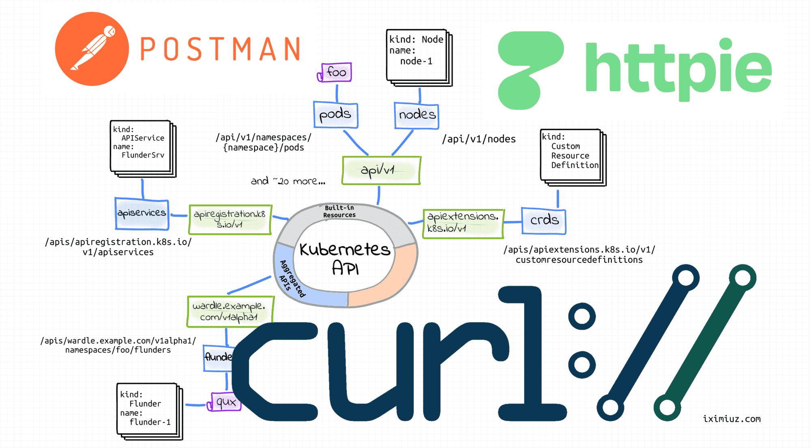

# Kubernetes 核心概念

## 1. 什么是 Kubernetes

Kubernetes 脱胎于 Google 的 Borg 系统，是一个功能强大的容器编排系统。从几年前的容器编排三足鼎立（Kubernetes、Mesos、Swarm），到如今，Kubernetes 已经完全赢得编排之战，成为社区及业界公认的容器编排的事实标准。

那为什么要叫"Kubernetes"呢？其实这里面也有一层寓意在里面。Kubernetes 这个单词来自希腊语，它的中文翻译是“舵手”的意思。可以看到Kubernetes的logo就是一个轮船的舵。


 

我们在来看看Docker的logo是长什么样子的？一头鲸鱼上面背着很多箱子，跟一艘货船装了很多集装箱的图片很像。
                                       


所以说，这个时候寓意就很明显了，Docker你得听我的，Kubernetes的，由我来掌握方向，掌舵，我说去哪就去哪。

## 2. Kubernetes 的核心功能

Kubernetes 有如下几个核心的功能：

- 服务的发现与负载的均衡；

- 容器的自动装箱，我们也会把它叫做 scheduling，就是“调度”，把一个容器放到一个集群的某一台机器上；

- Kubernetes 会帮助我们去做容器的自动修复（自愈）。在一个集群中，经常会出现宿主机的问题或者说是 OS 的问题，导致容器本身的不可用，Kubernetes 会自动地对这些不可用的容器进行恢复（重启容器）；

- Kubernetes 会帮助我们去做应用的发布与应用的回滚，以及与应用相关的配置密文的管理；

  ```sh
  # You can use the following command to inspect the history of your Deployment:
  kubectl rollout history deployment/app
  # And you can rollback to a specific version with:
  kubectl rollout undo deployment/app --to-revision=2
  ```

- Kubernetes 支持  Job 类型的任务，进行批量任务处理和定时任务处理；

- 为了让整个集群、应用更富有弹性，Kubernetes 也支持水平扩展。

 

下面，我们以三个例子跟大家更切实地介绍一下 Kubernetes 的核心功能。

### 1. 调度

Kubernetes 可以把用户提交的容器放到 Kubernetes 管理的集群的某一台工作节点上去。Kubernetes 的调度器是执行这项功能的组件，它会观察正在被调度的容器的大小、规格。

比如说它所需要的 CPU以及它所需要的 memory，然后在集群中找一台相对比较空闲的机器来进行一次调度。在下面这个例子中，它可能会把红颜色的这个容器放置到第二台空闲的机器上，来完成一次调度的工作。


### 2. 自动修复（自愈）

Kubernetes 有一个节点健康检查的功能，它会监测这个集群中所有的宿主机，当宿主机本身出现故障，或者软件出现故障的时候，节点健康检查机制将立马发现此故障，并进行后续的自动修复过程。

Kubernetes 会把运行在这些失败节点上的容器进行自动迁移，迁移到一个正在健康运行的宿主机上，来完成集群内容器的一个自动修复过程。

 


### 3、水平伸缩

Kubernetes 有业务负载检查的能力，它会监测业务上所承担的负载，如果这个业务本身的 CPU 利用率过高，或者响应时间过长，它可以对这个业务进行一次扩容。

 比如说在下面的例子中，黄颜色的过度忙碌，Kubernetes 就可以把黄颜色负载从一份变为三份。接下来，它就可以通过负载均衡把原来打到第一个黄颜色上的负载平均分到三个黄颜色的负载上去，以此来提高响应的时间。

 

 以上就是 Kubernetes 三个核心能力的简单介绍。

## 3. Kubernetes 的架构

 Kubernetes 架构是一个比较典型的二层架构，或者说是 server-client 架构。Master 作为中央的管控节点，会去与 Node 进行一个连接。


 

所有 UI、CLI、这些用户侧的组件，只会和 Master 进行连接，把希望的状态或者想执行的命令下发给 Master，Master 会把这些命令或者状态下发给相应的节点，进行最终的执行。

Kubernetes 的 Master节点，或者可以称之为Kubernetes Control Plane（Master这个词带种族歧视，Black Lives Matter），包含四个主要的组件：kube-api-server、kube-controller-manager、kube-scheduler 以及 etcd。如下图所示：

 

### 控制平面组件（Control Plane Components）

- **kube-apiserver**：顾名思义是用来处理 API 请求的，Kubernetes 中所有的组件都会和 kube-apiserver 进行交互，组件与组件之间一般不进行独立的交互，都依赖于 kube-apiserver 进行消息的传送。kube-apiserver 设计上也考虑了水平伸缩，也就是说，它可以通过部署多个实例进行水平伸缩。 我们可以运行 kube-apiserver 的多个实例，并在这些实例之间平衡流量。

- **etcd**：是一个分布式的存储系统，kube-apiserver 中所需要的原信息都被存储在 etcd 中，etcd 本身是一个兼具一致性和高可用性的键值数据库，通过 etcd 保证整个 Kubernetes 的 Master 组件的高可用性。

- **kube-scheduler**：就是调度器，“调度器”顾名思义就是完成调度的操作，就是我们刚才介绍的有关“调度”的例子中，就是由kube-scheduler调度器完成的。把一个用户提交的Container容器，依据它对 CPU、memory 的请求大小，找一台合适的节点，进行放置。

- **kube-controller-manager**：就是控制器，它用来完成对集群状态的管理。比如刚刚我们提到的自动修复和水平伸缩的例子，都是由 kube-controller-manager 来进行完成的。Kubernetes有很多不同的控制器，负者不同的任务。从逻辑上讲，每个控制器都是一个单独的进程，但是为了降低复杂性，它们都被编译到同一个可执行文件，并在一个进程中运行。

  这些控制器包括:

  - 节点控制器（Node Controller）: 负责在节点出现故障时进行通知和响应。
  - 副本控制器（Replication Controller）: 负责为系统中的每个副本控制器对象（ReplicaSet）维护正确数量的 Pod。
  - 端点控制器（Endpoints Controller）: 填充端点(Endpoints)对象(即关联 Service 与 Pod)。
  - 服务帐户和令牌控制器（Service Account & Token Controllers）: 为新的命名空间创建默认帐户和 API 访问令牌。

- **cloud-controller-manager**：cloud-controller-manager是 k8s 1.8 的 alpha 特性，目前依然是beta特性。是将 Kubernetes 与云环境集成的最佳方式。如果你在本地环境中（on-premise）运行 Kubernetes，不需要部署cloud-controller-manager。

  与 kube-controller-manager 类似，cloud-controller-manager 将若干逻辑上独立的控制器组合在同一个可执行文件中，并在一个进程中运行。 你可以对其执行水平扩容（运行不止一个副本）以提升性能或者增强容错能力。

  控制器的实际运行情况依赖于特定的云供应商：

  - 节点控制器（Node Controller）: 用于在节点终止响应后检查云供应商以确定节点是否已被删除

  - 路由控制器（Route Controller）: 用于在底层云基础架构中设置路由

  - 服务控制器（Service Controller）: 用于创建、更新和删除云供应商的负载均衡器

###    Node 组件

Kubernetes 的 Node 是真正运行业务负载的组件，每个业务负载会以 Pod 的形式运行。一个 Pod 中可以运行一个或者多个容器，真正去运行这些 Pod 的组件叫做 **kubelet**，也就是 Node 上最为关键的组件。

Node组件在每个工作节点上运行。

   - **kubelet**：kubelet 接收一组PodSpecs，确保这些 PodSpecs 中描述的容器处于运行状态且健康（创建容器）。kubelet 不会管理不是由 Kubernetes 创建的容器。
   - **kube-proxy**：在每个工作节点上运行的网络代理，实现 Kubernetes Service 概念的一部分。kube-proxy 维护每个工作节点上的网络规则，允许集群内部Pod之间的网络通信，和集群外部至Pod的网络通信。
   - **容器运行时（Container Runtime）**：容器运行时是负责运行容器的软件。Kubernetes 支持多个容器运行时: docker、 containerd、CRI-O 以及任何实现 Kubernetes CRI (容器运行环境接口)。

接下来我们通过一个例子来讲解这些组件之间是如何相互沟通相互通信的，来协调完成一次Pod的调度执行操作的。


 

用户可以通过 UI 或者 CLI 提交一个 Pod 给 Kubernetes 进行部署，这个 Pod 请求首先会通过 CLI 或者 UI 提交给 Kubernetes API Server，下一步 API Server 会把这个信息写入到它的存储系统 etcd中，之后 Scheduler 会通过 API Server 的 watch 或者叫做 notification 机制得到以下信息：“有一个 Pod 需要被调度”。

这个时候 Scheduler 会根据Pod的定义进行一次调度决策，在完成这次调度之后，它会向 API Server 报告说：“OK！这个 Pod 需要被调度到某一个节点上。”

 这个时候 API Server 接收到这次操作之后，会把这次的结果再次写到 etcd 中，然后 API Server 会通知相应的节点进行此 Pod 真正的启动操作。相应节点的 kubelet 会得到这个通知，kubelet 就会去调用容器运行时来真正的启动和配置这个容器，比如调用 Storage Plugin 去配置存储，Network Plugin 去配置网络。

 

###    插件（Addons）

使用 Kubernetes 工作负载（DaemonSet、 Deployment等）实现集群功能。 因为这些插件提供集群级别的功能，所以大都位于kube-system 命名空间。

   - **DNS**：此插件属于非必需组件，但几乎所有 Kubernetes 集群都需要 DNS 服务，它为 Kubernetes 服务提供 DNS 记录。

   - **Web 界面（仪表盘）**：Dashboard 是基于 Web 的用户界面，它使用户可以管理集群中运行的Pod以及集群本身并进行故障排查。


## 4. Kubernetes 的核心概念与它的 API

### 核心概念

#### Pod

Pod 是 Kubernetes 中的一个最小调度以及资源单位。用户可以通过 Yaml文件的方式创建一个 Pod，并让 Kubernetes 对这个 Pod 进行调度，也就是把它放在某一个 Kubernetes 管理的节点上运行起来。一个 Pod 简单来说是对一组容器的抽象，它里面会包含一个或多个容器。

比如像下面这幅图里面，它包含了两个容器，每个容器可以指定它所需要资源大小。比如说，一个核的CPU一个的 G 内存，或者说 0.5 个核的 CPU，0.5 个 G 的内存。

当然在这个 Pod 中也可以包含一些其他所需要的资源：比如说对 Volume 卷存储的定义。比如说此 Pod 需要 100 个 GB 的存储。

 

 

在 Pod 里面，我们也可以去定义容器所需要运行的方式。比如说运行容器的 Command，以及运行容器的环境变量等等。Pod 这个抽象也给这些容器提供了一个共享的运行环境，它们会共享同一个网络环境，这些容器可以用 localhost 进行直接的通信。而 Pod 与 Pod 之间，是互相隔离的，不能通过localhost进行通信。

下面是一份 Pod yaml 的示例：

```yaml
apiVersion: v1
kind: Pod
metadata:
  name: hello
spec:
  containers:
  - name: hello
    image: busybox
    command: ['sh', '-c', 'echo "Hello, Kubernetes!" && sleep 3600']
```

 

#### Volume

Volume 就是卷的概念，它是用来管理 Kubernetes 存储的，用来声明 Pod 中的容器可以访问的（外部）文件目录，一个卷可以被挂载在 Pod 中的一个或者多个容器的指定路径下面。 

而 Volume 本身是一个抽象的概念，一个 Volume 可以支持多种不同类型的后端存储。比如说 Kubernetes 的 Volume 就支持了很多存储插件，它可以支持本地的存储，可以支持分布式的存储，比如说像 ceph，GlusterFS。同时也可以支持云存储，比如说像 AWS 的 Amazon Elastic File System (*Amazon EFS*)，微软的 Azure Files。

 

#### Deployment

Deployment 是在 Pod 这个抽象上更为上层的一个抽象，它可以定义一组 Pod 的副本数目、以及这个 Pod 的版本。一般大家用 Deployment 这个抽象来做真正的应用管理，而 Pod 是组成 Deployment 最小的单元。

Kubernetes 通过 Controller，也就是我们刚才提到的控制器去维护 Deployment 中 Pod 的数目，它也会帮助 Deployment 自动修复处于故障中的 Pod。

比如说我们可以定义一个 Deployment，这个 Deployment 里面需要两个 Pod，当一个 Pod 处于故障中的时候，控制器就会监测到，重新把 Deployment 中的 Pod 数目从一个恢复到两个，通过重新生成一个新的 Pod。通过控制器，可以帮助完成不同的发布策略。比如说进行滚动升级，进行重新生成的升级，或者进行版本的回滚。


#### Service

Service 提供了一个或者多个 Pod 实例的稳定访问地址。

比如在上面的例子中，我们看到一个 Deployment 可能有两个甚至更多个完全相同的 Pod。对于一个外部用户来讲，访问哪个 Pod 其实都是一样的，所以它希望做一次负载均衡，在做负载均衡的同时，我只想访问某一个固定的 VIP，也就是 Virtual IP 地址，而不希望访问每一个具体的 Pod IP 地址。 

我们刚才提到，一个 Deployment 的某个 Pod 可能因为某些原因处于故障而重新创建一个新的 Pod。对于一个外部用户来说，如果我们提供了多个具体的 Pod IP 地址，那么这个用户需要不停地去更新 Pod IP 地址列表，当一个 Pod 被重新创建时，新的 Pod就会有新的 IP地址，老的 POD IP 地址也就失效了。我们希望有一个抽象，把所有 Pod 的访问能力抽象成一个第三方的 IP 地址，实现这个的 Kubernetes 的抽象就叫 Service。

Service 支持多种网络访问方式，支持 Cluster IP，上面我们讲过的 kuber-proxy 的组网形式。也支持 NodePort、 LoadBalancer 等其他网络访问方式。

 

 

#### Namespace

Namespace 是用来做一个集群内部的逻辑隔离的，它包括鉴权、资源管理等。Kubernetes 的每个资源，比如刚才讲的 Pod、Deployment、Service 都属于一个 Namespace，同一个 Namespace 中的资源需要命名的唯一性，不同的 Namespace 中的资源可以重名。

Namespace 的一个实际用例，比如像我们公司，有很多不同的产品部署在Kubernetes之上。不同的产品分属于不同的部门，我们希望在视图上就有一个隔离，针对不同的 Namespace，也可以实行不同的安全策略。


#### Kubernetes  API

下面我们介绍一下 Kubernetes API 的基础知识。从 high-level 上看，Kubernetes API 都是以 **HTTP** 的形式对外暴露请求的。用户可以通过`kubectl`命令行工具，也可以通过自己构建HTTP请求的方式，访问 Kubernetes  API，以达到操作管理 Kubernetes 集群的目的。

本质上来讲，`kubectl`命令行工具最终也是以构建HTTP请求的方式去跟 Kubernetes API Server 进行通信。

我们以获取Pod的信息为例。

我们可以通过 `kubectl` 命令获得某个Pod的信息，如下所示：

```shell
$ kubectl get pods coredns-stljg -n kube-system
NAME            READY   STATUS    RESTARTS   AGE
coredns-stljg   1/1     Running   0          5d7h
```

在使用`kubectl`命令时，我们也可以添加 `-v` 参数，查看更详细的信息，可以查看整个REST请求的过程。如下所示：

```shell
[root@shc-sma-cd74 2058]# kubectl get pods coredns-stljg -n kube-system -v8
I0309 23:06:02.324470   18341 loader.go:372] Config loaded from file:  /root/.kube/config
I0309 23:06:02.328677   18341 cert_rotation.go:137] Starting client certificate rotation controller
# 注意此行，有REST请求的 url 信息
I0309 23:06:02.378414   18341 round_trippers.go:463] GET https://shc-sma-cd74.hpeswlab.net:8443/api/v1/namespaces/kube-system/pods/coredns-stljg
# 注意此行，有REST请求的 Request Headers 信息
I0309 23:06:02.378460   18341 round_trippers.go:469] Request Headers:
I0309 23:06:02.378492   18341 round_trippers.go:473]     Accept: application/json;as=Table;v=v1;g=meta.k8s.io,application/json;as=Table;v=v1beta1;g=meta.k8s.io,application/json
I0309 23:06:02.378519   18341 round_trippers.go:473]     User-Agent: kubectl/v1.23.3 (linux/amd64) kubernetes/816c97a
# Response Status
I0309 23:06:02.411306   18341 round_trippers.go:574] Response Status: 200 OK in 32 milliseconds
I0309 23:06:02.411379   18341 round_trippers.go:577] Response Headers:
I0309 23:06:02.411420   18341 round_trippers.go:580]     Content-Type: application/json
I0309 23:06:02.411457   18341 round_trippers.go:580]     X-Kubernetes-Pf-Flowschema-Uid: 31a3ad55-d7a3-44ea-9805-6357df33b474
I0309 23:06:02.411497   18341 round_trippers.go:580]     X-Kubernetes-Pf-Prioritylevel-Uid: a58a37d5-0720-40cc-8874-67b462e05ba2
I0309 23:06:02.411537   18341 round_trippers.go:580]     Date: Wed, 09 Mar 2022 15:06:02 GMT
I0309 23:06:02.411991   18341 round_trippers.go:580]     Audit-Id: 2d7cddcc-c1e3-4a8a-854c-2e3daf02b54a
I0309 23:06:02.412026   18341 round_trippers.go:580]     Cache-Control: no-cache, private
# Response Body
I0309 23:06:02.412959   18341 request.go:1181] Response Body: {"kind":"Table","apiVersion":"meta.k8s.io/v1","metadata":{"resourceVersion":"517"},"columnDefinitions":[{"name":"Name","type":"string","format":"name","description":"Name must be unique within a namespace. Is required when creating resources, although some resources may allow a client to request the generation of an appropriate name automatically. Name is primarily intended for creation idempotence and configuration definition. Cannot be updated. More info: http://kubernetes.io/docs/user-guide/identifiers#names","priority":0},{"name":"Ready","type":"string","format":"","description":"The aggregate readiness state of this pod for accepting traffic.","priority":0},{"name":"Status","type":"string","format":"","description":"The aggregate status of the containers in this pod.","priority":0},{"name":"Restarts","type":"string","format":"","description":"The number of times the containers in this pod have been restarted and when the last container in this pod has restarted.","priority":0},{"name":"Age","type":"strin [truncated 5579 chars]
NAME            READY   STATUS    RESTARTS   AGE
coredns-stljg   1/1     Running   0          5d7h
```


 `kubectl` 命令对应的 `curl`命令如下：

```shell
curl https://[kube-apiserver]/api/v1/namespaces/kube-system/pods/coredns-stljg
```

我们可以大致看一下这个url的组成。因为我们是获取Pod的信息，那么v1代表的就是Pod的apiVersion；kube-system 代表的就是Pod所在的namespace。coredns-stljg 是具体的Pod名字。





接下来我们使用cURL命令简单演示如何以REST的方式使用Kubernetes API，方便我们使用开发语言原生的HTTPS方式操作Kubernetes集群。演示包括创建和删除Pod，创建和修改Deployment。

1. 从kubeconfig文件中提取ca、key和apiserver信息，命令如下。

   ```yaml
   $ kubectl config view
   apiVersion: v1
   clusters:
   - cluster:
       certificate-authority: /opt/cdf/ssl/ca.crt
       # API Server
       server: https://shc-sma-cd74.hpeswlab.net:8443
     name: cdf-kubernetes
   contexts:
   - context:
       cluster: cdf-kubernetes
       user: kubectl
     name: kubectl-kube-api
   current-context: kubectl-kube-api
   kind: Config
   preferences: {}
   users:
   - name: kubectl
     user:
       # CA
       client-certificate: /opt/client-cert.pem
       # Key
       client-key: /opt/client-key.pem
   ```

2. 使用cURL命令操作Kubernetes API，执行以下命令查看当前集群中所有Namespaces。

   ```bash
   APISERVER=https://shc-sma-cd74.hpeswlab.net:8443
   curl --cert client-cert.crt --key client-key.key -k $APISERVER/api/v1/namespaces
   ```

3. 常用的Pod相关操作。

   - 执行以下命令查看default命名空间下的所有Pods。

     ```shell
     curl --cert client-cert.pem --key client-key.pem -k $APISERVER/api/v1/namespaces/default/pods
     ```

   - 执行以下命令创建Pod（JSON格式）。

     ```shell
     cat nginx-pod.json
     {
         "apiVersion":"v1",
         "kind":"Pod",
         "metadata":{
             "name":"nginx",
             "namespace": "default"
         },
         "spec":{
             "containers":[
                 {
                     "name":"ngnix",
                     "image":"nginx:alpine",
                     "ports":[
                         {
                             "containerPort": 80
                         }
                     ]
                 }
             ]
         }
     }
     
     curl --cert client-cert.pem --key client-key.pem -k $APISERVER/api/v1/namespaces/default/pods -X POST --header 'content-type: application/json' -d@nginx-pod.json
     ```

     

   - 执行以下命令创建Pod（YAML格式）。

     ```shell
     cat nginx-pod.yaml
     apiVersion: v1
     kind: Pod
     metadata:
       name: nginx
       namespace: default
     spec:
       containers:
       - name: nginx
         image: nginx:alpine
         ports:
         - containerPort: 80
     
     curl --cert client-cert.pem --key client-key.pem -k $APISERVER/api/v1/namespaces/default/pods -X POST --header 'content-type: application/yaml' --data-binary @nginx-pod.yaml
     ```

   - 执行以下命令查询Pod状态。

     ```shell
     curl --cert client-cert.pem --key client-key.pem -k $APISERVER/api/v1/namespaces/default/pods/nginx
     ```

   - 执行以下命令查询Pod logs。

     ```shell
     curl --cert client-cert.pem --key client-key.pem -k $APISERVER/api/v1/namespaces/default/pods/nginx/log
     ```

   - 执行以下命令删除Pod。

     ```shell
     curl --cert client-cert.pem --key client-key.pem -k $APISERVER/api/v1/namespaces/default/pods/nginx -X DELETE
     ```

   

4. 常用的Deployment相关操作。

   - 创建Deployment示例YAML文件如下。

     ```shell
     cat nginx-deploy.yaml
     apiVersion: apps/v1
     kind: Deployment
     metadata:
       name: nginx-deploy
       labels:
         app: nginx
     spec:
       replicas: 2
       selector:
         matchLabels:
           app: nginx
       template:
         metadata:
           labels:
             app: nginx
         spec:
           containers:
           - name: nginx
             image:  nginx:alpine
             ports:
             - containerPort: 80
             resources:
               requests:
                 cpu: "2"
                 memory: "4Gi"
     
     curl --cert client-cert.pem --key client-key.pem -k $APISERVER/apis/apps/v1/namespaces/default/deployments -X POST --header 'content-type: application/yaml' --data-binary @nginx-deploy.yaml
     ```

   - 执行以下命令查看Deployment。

     ```shell
     curl --cert client-cert.pem --key client-key.pem -k $APISERVER/apis/apps/v1/namespaces/default/deployments
     ```

   - 执行以下命令更新Deployment（修改replicas副本数量）。

     ```shell
     curl --cert client-cert.pem --key client-key.pem -k $APISERVER/apis/apps/v1/namespaces/default/deployments/nginx-deploy -X PATCH -H 'Content-Type: application/strategic-merge-patch+json' -d '{"spec": {"replicas": 4}}'
     ```

   - 执行以下命令更新Deployment（修改容器镜像）。

     ```shell
     curl --cert client-cert.pem --key client-key.pem -k $APISERVER/apis/apps/v1/namespaces/default/deployments/nginx-deploy -X PATCH -H 'Content-Type: application/strategic-merge-patch+json' -d '{"spec": {"template": {"spec": {"containers": [{"name": "nginx","image": "nginx:1.7.9"}]}}}}'
     ```

     

> 参考资料：
>
> https://www.alibabacloud.com/help/zh/doc-detail/160530.htm
>
> https://developer.aliyun.com/lesson_1651_16894?spm=5176.10731542.0.0.5cbf29daK2fTKS#_16894
>
> https://iximiuz.com/en/posts/kubernetes-api-call-simple-http-client/
>
> https://kubernetes.io/zh/docs/concepts/
>
> https://kubernetes.io/docs/concepts/overview/what-is-kubernetes/
>
> [Kubernetes的11大基本概念及重要概念性理解](https://www.infoq.cn/article/B84dZUFCJB86VgDjZKPp)
>
> [Kubernetes的基本概念](https://www.y2p.cc/2017/03/28/kubernetes-concept/)
>
> https://kubernetes.io/docs/concepts/overview/components/


## 5. 作业：使用kubeadm安装集群

- 要求：安装 Kubernetes 最新版

- 参考资料:
  -  [Centos7搭建k8s环境教程，一次性成功，收藏了！](https://mp.weixin.qq.com/s/uR0ig2vpIq0EIWmz39rH-g)
  - 官方文档 [Creating a cluster with kubeadm](https://kubernetes.io/docs/setup/production-environment/tools/kubeadm/create-cluster-kubeadm/)
- 扩展阅读：
  - 有一个ansible playbook可以推荐给大家。初学者可以跟着一步步看原理，后期还可以自己定制化。主要是容易产生兴趣。https://github.com/easzlab/kubeasz
  - 可用于部署生产级别的Kubernetes的开源项目 https://github.com/kubernetes-sigs/kubespray

4. 作业：使用kubeadm升级集群

   - 参考资料:
     - 官方文档 [Upgrading kubeadm clusters](https://kubernetes.io/docs/tasks/administer-cluster/kubeadm/kubeadm-upgrade/)

5. 作业：etcd数据备份与还原

   - 参考资料：
     - [Backing up an etcd cluster](https://kubernetes.io/docs/tasks/administer-cluster/configure-upgrade-etcd/#backing-up-an-etcd-cluster)
     - [Restoring an etcd cluster](https://kubernetes.io/docs/tasks/administer-cluster/configure-upgrade-etcd/#restoring-an-etcd-cluster)

6. 作业：kubectl的使用

   - 参考资料：
     - [kubectl Cheat Sheet](https://kubernetes.io/docs/reference/kubectl/cheatsheet/)
     - [Kubectl Reference Docs](https://kubernetes.io/docs/reference/generated/kubectl/kubectl-commands)

7. 作业：部署一个HA（多master）的K8S集群

   - 参考资料：[使用Kubeadm设置Kubernetes集群的高可用性](https://mp.weixin.qq.com/s/zhwb3SVprfBct-u1oOR72w)


