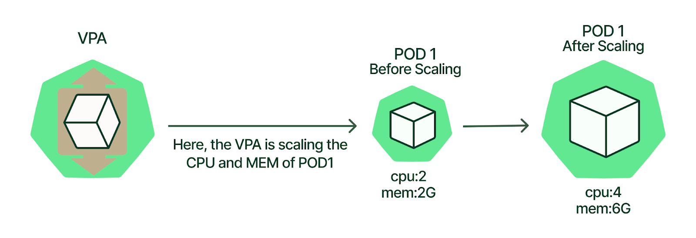

# Kubernetes 核心概念扩展之 Kubernetes Autoscaling

## 1. Kubernetes Autoscaling 介绍

Kubernetes Autoscaling（弹性伸缩）是 Kubernetes 平台最引人注目的特性之一。它可以大大节省 Kubernetes 管理员的运维时间，同时可以有效防止性能瓶颈的出现，从而节约财务成本。但是，设置 Kubernetes Autoscaling 需要了解许多配置参数，即使是经验丰富的Kubernetes 管理员也会感到困惑，但是为了最大限度地利用这一特性，我们还是需要对 Kubernetes Autoscaling 的工作原理有深入的了解。接下来让我们从三个维度来讲解 Kubernetes Autoscaling，试图深入的了解 Kubernetes Autoscaling。

### Kubernetes Autoscaling 的三个维度

Kubernetes Autoscaling 帮助 Kubernetes 管理员无需手动配置集群，以匹配不断变化的应用程序工作负载的需要。Kubernetes 可以通过调整 Pod 的可用资源，比如 CPU 和 Memory（垂直扩展），Pod 的副本数量（水平扩展），甚至通过添加或者删除 Kubernetes 集群中的节点数量来达到弹性伸缩的目的。

对于 Pod 而言，有两种类型的自动伸缩器：

- Vertical Pod Autoscaler (VPA) ，即 Pod 的垂直自动扩展，VPA 可以增加或减少分配给每个Pod 的 CPU 和内存。
- Horizontal Pod Autoscaler (HPA) ，即 Pod 的水平自动扩展，HPA通过复制或者终止 Pod 副本，从而改变总的 Pod 数目。

对于整个 Kubernetes 集群而言，我们有：

- Kubernetes Cluster Autoscaler (CA)，即集群自动扩展，通过添加或删除集群的节点，以提供承载工作负载所需的适当数量的计算资源。

综合运用三个不同维度的 Kubernetes Autoscaling，有助于在出现性能瓶颈时而导致的停机，与避免过度供应（Overprovision，即提供多余的计算资源，以便不时之需）之间达成近乎实时的微妙平衡。


大多数应用程序的工作负载都具有规律性，此规律一般由用户驱动，比如每天的某个时段，或者每周的某个时段，应用程序的负载会相对较高。这种应用程序负载的可变性或者不确定性，可能导致：

- 突发的负载压力，应用程序的性能因资源限制而降低；
- 为应对突发的负载压力，准备过多的计算资源，导致不必要的开销。

例如，对于一般企业而言，应用程序的高峰时间都集中在工作时间，员工都在工作时间时使用应用程序，而在周末和节假日，属于应用程序的低峰时间，几乎无人在使用应用程序。

针对于一些企业财务系统，在每个月的月底与月初之间，是用户使用系统最为活跃的时间。

而对于一些批处理应用程序而言，通常会安排在深夜无人的时候运行。

还有一些季节性的流量模式，比如京东618，天猫双11，都会导致某个时段的流量峰值压力突然增加。


对于可预测或不可预测的突发流量，系统管理员必须时刻准备着，以便在几秒钟内调配集群容量，以响应各种可预测的，或者意外的，集群容量调整。并在峰值压力过后，删除不需要的容量。

此时，Kubernetes Autoscaling 就有了用武之地，可以大大的为系统管理员或者运维人员减负。Kubernetes Autoscaling 随着应用程序工作负载的变化，自动调整集群容量，不再需要手动调整，一切都是自动化的。

> 参考资料：
>
> https://www.kubecost.com/kubernetes-autoscaling


## 2. Kubernetes Vertical Pod Autoscaler (VPA)

Kubernetes Vertical Pod Autoscaler (VPA) 能够根据每个 Pod 的历史资源使用情况，自动调整容器的 “资源请求” 和 “资源约束”，例如：

1. 容器使用的最小资源请求，作为容器调度时资源分配的依据：（容器至少需要的资源是多少）
   - `resources.requests.cpu`
   - `resources.requests.memory`
2. 容器可使用最大资源约束：（容器最多可以使用的资源是多少）
   - `resources.limits.cpu`
   - `resources.limits.memory`

正确使用容器的资源请求和资源约束，可以帮助我们在容器级别，高效地自动分配 Kubernetes 集群的资源。

接下来，我们尝试从技术角度理解 VPA 是如何工作的，以及它的作用是什么？这将使我们能够更好的理解 VPA，更好地使用 VPA。

### 什么是 Kubernetes VPA？

Kubernetes Vertical Pod Autoscaler（VPA）是一个安装在 Kubernetes 集群中的组件（Deployment）。特别注意，VPA 是需要额外安装的。 能够根据每个 Pod 的历史资源使用情况，自动调整容器的资源请求和资源约束。

接下来，我们先了解一些 VPA 相关的重要概念。

#### Kubernetes VPA 的资源配置类型

使用 VPA 时，我们可以管理 Pod 容器的两种不同类型的资源配置：

1. 资源请求 / `resources.requests`
2. 资源约束 / `resources.limits`

##### 什么是 “资源请求”？

“资源请求” 定义容器所需的最小资源量。例如，一个应用程序至少需要 256MB 以上的内存，通过配置 “资源请求”，Kubernetes 会保证容器至少有 256MB 的内存资源可用。

##### 什么是 ”资源约束“？

"资源约束" 定义容器可以使用的最大资源量。例如，我们可能希望某应用程序占用的内存不超过 512MB，我们就可以通过配置 ”资源约束“ 来保证这一点。

#### Kubernetes VPA 和 HPA 区别

从本质上讲，VPA 和 HPA 的区别在于它们的扩展方式。HPA 通过添加或删除 Pod，从而达到水平扩展容量的目的。然而，VPA 通过增加或减少 CPU、内存来扩展现有的 Pod容器，从而垂直扩展集群容量。下表详细说明了 Kubernetes VPA 和 HPA 之间的差异。

| 所需容量调整     | 水平扩展（HPA） | 垂直扩展（VPA）                    |
| ---------------- | --------------- | ---------------------------------- |
| 需要更多的资源   | 添加 Pod        | 增加现有 Pod 容器的 CPU 或内存资源 |
| 不需要更多的资源 | 删除 Pod        | 减少现有 Pod 容器的 CPU 或内存资源 |

通过下图我们来尝试了解 VPA 的工作原理：




#### VPA 组件

VPA 有三个主要组件：VPA Recommender, VPA Updater, 和 VPA Admission Controller。让我们来看看每个组件的功能。

##### VPA Recommender：

- 监控 Pod 的资源利用率，并建议最佳的 “资源请求” 和 ”资源约束“。

##### VPA Updater：

- 使用驱逐（Evict）Pod 的方式，达到更新 Pod 的 “资源请求” 或者 ”资源约束“ 的目的。

##### VPA Admission Controller：

- 每当 VPA Updater 驱逐并重新启动一个 Pod 时，在新 Pod 启动之前，更改 Pod 的 "资源请求” 或者 ”资源约束“。
- VPA 利用了 Kubernetes 的 Admission Controller，因此只有当 Pod 被重新创建时，VPA 才能更改 Pod 的 资源限制，所以必须驱逐或者重启 Pod。（有关 Admission Controller 的知识会在后续章节详细讲解。）

### Kubernetes VPA 是如何工作的？

下面让我们来探讨一下，Kubernetes VPA 是如何工作的？

下图展示了 Kubernetes VPA 是如何工作的，并给每个步骤编了号。

**让我们仔细看看每一个步骤 VPA 都做了什么？**

1. 用户配置/部署 VPA；

2. VPA Recommender 读取 VPA 配置，从度量指标服务器（Metrics Server）读取 Pod 的资源利用率；

3. VPA Recommender 给出建议的 Pod  “资源请求” 或者 ”资源约束“ ；

4. VPA Updater 读取建议的 Pod  “资源请求” 或者 ”资源约束“ ；

5. VPA Updater 以驱逐的方式，删除一个 Pod；

6. Deployment 意识到 Pod 已经被删除，将重新创建 Pod 副本以匹配其副本配置。

7. 当 Pod 处于重新创建的过程中时，VPA Admission Controller 读取建议的 Pod  “资源请求” 或者 ”资源约束“ 。

8. 在新 Pod 启动之前，VPA Admission Controller 会将建议的 Pod  “资源请求” 或者 ”资源约束“ 写入到 Pod 中，随后在启动 Pod。

   > 由于 Kubernetes 不支持更改正在运行中的 Pod的资源限制，VPA 无法用新的资源限制更新现有的 Pod。因此只能通过重启 Pod 的方式，使新的资源限制生效。


#### Kubernetes VPA 的更新模式 / Kubernetes VPA Auto-Update Mode

VPA 中的 `updateMode` 有多个选项，它们分别是：

- **Off** ：表示 VPA 只提供建议，不会自动更改资源限制。
- **Initial**：表示 VPA 只在 Pod 创建时更改资源限制，以后不会更改它们。
- **Recreate**：表示 VPA 在 Pod 创建时更改资源限制，也可以通过驱逐现有 Pod 来更改资源限制。
- **Auto mode**：目前此模式等同于 **Recreate** 。 表示 VPA 在 Pod 创建时分配资源请求，也可以通过驱逐现有 Pod 来更新资源限制。

> Reference:
>
> https://github.com/kubernetes/autoscaler/blob/master/vertical-pod-autoscaler/pkg/apis/autoscaling.k8s.io/v1/types.go#L126-L142


### VerticalPodAutoscaler 示例 Yaml

下面是一个 VerticalPodAutoscaler 的示例 Yaml

```yaml
# This config creates a deployment with two pods, each requesting 100 millicores
# and trying to utilize slightly above 500 millicores (repeatedly using CPU for
# 0.5s and sleeping 0.5s).
# It also creates a corresponding Vertical Pod Autoscaler that adjusts the
# requests.
# Note that the update mode is left unset, so it defaults to "Auto" mode.
---
apiVersion: "autoscaling.k8s.io/v1"
kind: VerticalPodAutoscaler
metadata:
  name: hamster-vpa
spec:
  # recommenders field can be unset when using the default recommender.
  # When using an alternative recommender, the alternative recommender's name
  # can be specified as the following in a list.
  # recommenders: 
  #   - name: 'alternative'
  targetRef:
    apiVersion: "apps/v1"
    kind: Deployment
    name: hamster
  resourcePolicy:
    containerPolicies:
      - containerName: '*'                                  # 1
        minAllowed:                                         # 2
          cpu: 100m 
          memory: 50Mi
        maxAllowed:                                         # 3
          cpu: 1
          memory: 500Mi
        controlledResources: ["cpu", "memory"]              # 4
---
apiVersion: apps/v1
kind: Deployment
metadata:
  name: hamster
spec:
  selector:
    matchLabels:
      app: hamster
  replicas: 2
  template:
    metadata:
      labels:
        app: hamster
    spec:
      securityContext:
        runAsNonRoot: true
        runAsUser: 65534 # nobody
      containers:
        - name: hamster
          image: k8s.gcr.io/ubuntu-slim:0.1
          resources:                                      # 5
            requests:
              cpu: 100m
              memory: 50Mi
          command: ["/bin/sh"]
          args:
            - "-c"
            - "while true; do timeout 0.5s yes >/dev/null; sleep 0.5s; done"
```

**# 1** 此 VPA 将作用于此 Deployment 下面的所有容器。

**#2**  不会设置低于此值的 “资源请求”。

**# 3** 不会设置高于此值的 “资源请求”。

**# 4** 指定要自动缩放的资源类型。

**# 5**: VPA 将根据 Pod 的资源使用率，调整 "资源限制"。

请注意，此 VPA 未设置更新模式 `.spec.updatePolicy.updateMode`，因此使用默认的更新模式，`Auto`。

但是在实际的生产环境中，我们很少使用 `Auto` 更新模式。比较多见的是使用 **Off** 更新模式，表示 VPA 只提供建议，不会自动更改资源限制。

在系统投入生产之前，我们应该做一次全面的压力测试，为每个 Pod，每个容器，设置合理的 ”资源限制“。但现实往往并非如此，在没有完全了解 Pod 的资源消耗之前，我们就赶着时间把 Pod 部署到生产环境中。通常，为了安全起见，我们会为集群配置过多的资源，以防资源不够，但这就导致了集群整体的资源利用率低。

在这种情况下，我们可以利用 VPA，帮助监控 Pod 的资源利用率，并给出合适的 ”资源限制“ 值。然后由我们的工程师，审核过后，最终手动的将 ”资源限制“ 值应用于 Pod 之上。手动更新保证了生产环境的稳定性，不要因为 VPA，在集群流量高峰时，驱逐 Pod 来自动更新 “资源限制”，导致集群短时的性能瓶颈。

在这个例子中，VPA 并不是一个自动缩放器，而是一个资源调优辅助工具。

 在 **Off** 更新模式下，可以运行以下 `kubectl` 命令，从 VPA 获得建议：

```shell
$ kubectl describe vpa <vpa-name>

...
Recommendation:
  Container Recommendations:
    Container Name: coredns
    Lower Bound:
      Cpu: 25m
      Memory: 262144k
    Target:
      Cpu: 25m
      Memory: 262144k
    Uncapped Target:
      Cpu: 25m
      Memory: 262144k
    Upper Bound:
      Cpu: 427m
      Memory: 916943343  
```

VPA 将为每个容器提供 “资源请求” 的建议值。使用 `Target` 作为 CPU 和内存的 “资源请求” 值。


### Kubernetes VPA 的局限性

VPA 可以应用于大多数的应用程序中，且都很有用，但是我们需要记住以下几个重要的限制：

- 不要在同一个 Deployment 或者 StatefulSet 上同时使用 VPA 和 HPA。VPA 和 HPA 都是基于 CPU 和内存使用率来进行扩展的。如果当一个指标（CPU/内存）达到指定的阈值时，VPA 和 HPA 将同时发生扩展事件，这可能出现未知的副作用，从而导致问题。

- VPA 可能会建议比集群中可用资源更多的资源，由于资源不足，从而导致 Pod 无法分配节点。为了避免出现此情况，最好设置 *LimitRange* ，这将保证 Pod 不会使用超过 *LimitRange* 定义的资源限制。

- 使用 VPA 时，请确保在 **Vertical Pod Autoscaler** 对象中，为每个 Pod 设置允许的最大建议值。因为 VPA 的建议值有可能超过集群的可用资源。

- VPA 应该用于有状态的工作负载，因为有状态的工作负载很难水平扩展。

  

### 演示：如何使用 VPA

现在我们已经了解了 VPA 的概念，接下来让我们实际的安装和使用一下 VPA。

> 前提：一个可正常运行的 Kubernetes 集群。

1. 安装 Metrics Server
2. 安装 VPA
3. 演示 VPA 示例

#### 安装 Metrics Server

首先，当我们有了一个可以正常运行的 Kubernetes 集群之后，我们可以运行以下命令来确认当前集群中是否已安装 metrics server：

```shell
$ kubectl get apiservice | grep -i metrics
```

如果没有输出，那么表明此集群中还没有安装 metrics server。

同时，我们也可以使用以下命令查看集群中是否已安装 metrics server：

```shell
$ kubectl top pods -n kube-system
error: Metrics API not available
```

接下来，我们可以运行以下命令安装 metrics server。

```shell
# Clone the below repo:
$ git clone --branch v1.0.0 git@github.com:nonai/k8s-example-files.git

# Apply the changes on the entire files as shown below:
$ kubectl apply -f .
serviceaccount/metrics-server created
clusterrole.rbac.authorization.k8s.io/system:aggregated-metrics-reader created
clusterrole.rbac.authorization.k8s.io/system:metrics-server created
rolebinding.rbac.authorization.k8s.io/metrics-server-auth-reader created
clusterrolebinding.rbac.authorization.k8s.io/metrics-server:system:auth-delegator created
clusterrolebinding.rbac.authorization.k8s.io/system:metrics-server created
service/metrics-server created
deployment.apps/metrics-server created
apiservice.apiregistration.k8s.io/v1beta1.metrics.k8s.io created

# Verify the deployment:
$ kubectl get pods -n kube-system
NAME                             READY       STATUS       RESTARTS       AGE
...
metrics-server-9f459d97b-j4mnr   1/1         Running      0              117s
...
```

当我们安装完 metrics server 后，通过以下命令就可以查看 Pod 或者 Node 的度量指标了。

```shell
# Access metrics API directly:
$ kubectl get --raw /apis/metrics.k8s.io/v1beta1 | jq
{
  "kind": "APIResourceList",
  "apiVersion": "v1",
  "groupVersion": "metrics.k8s.io/v1beta1",
  "resources": [
    {
      "name": "nodes",
      "singularName": "",
      "namespaced": false,
      "kind": "NodeMetrics",
      "verbs": [
        "get",
        "list"
      ]
    },
    {
      "name": "pods",
      "singularName": "",
      "namespaced": true,
      "kind": "PodMetrics",
      "verbs": [
        "get",
        "list"
      ]
    }
  ]
}

$ kubectl get --raw /apis/metrics.k8s.io/v1beta1/nodes | jq
...
...

# Use kubectl to get metrics:
$ kubectl top pods -n kube-system
NAME                                    CPU(cores)       MEMORY(bytes)
aws-node-8g4wk                          4m               40Mi
coredns-86d9946576-g49sk                2m               8Mi
coredns-86d9946576-kxw4h                2m               8Mi
kube-proxy-64gjd                        1m               11Mi
metrics-server-9f459d97b-j4mnr          3m               1
```


#### 安装 VPA

执行以下命令安装 VPA。

克隆下面的存储库，检查特定的提交（用于本教程），并将目录更改为“autoscaler/vertical pod autoscaler”

```shell
# Clone the repository
$ git clone https://github.com/kubernetes/autoscaler.git

# Check out the specific commit which is used for this tutorial
$ git checkout bb860357f691313fca499e973a5241747c2e38b2

$ cd autoscaler/vertical-pod-autoscaler

# We can preview installation by using the below command:
$ ./hack/vpa-process-yamls.sh print

# Install the VPA:
$ ./hack/vpa-up.sh
customresourcedefinition.apiextensions.k8s.io/verticalpodautoscalercheckpoints.autoscaling.k8s.io created
customresourcedefinition.apiextensions.k8s.io/verticalpodautoscalers.autoscaling.k8s.io created
clusterrole.rbac.authorization.k8s.io/system:metrics-reader created
clusterrole.rbac.authorization.k8s.io/system:vpa-actor created
clusterrole.rbac.authorization.k8s.io/system:vpa-checkpoint-actor created
clusterrole.rbac.authorization.k8s.io/system:evictioner created
clusterrolebinding.rbac.authorization.k8s.io/system:metrics-reader created
clusterrolebinding.rbac.authorization.k8s.io/system:vpa-actor created
clusterrolebinding.rbac.authorization.k8s.io/system:vpa-checkpoint-actor created
clusterrole.rbac.authorization.k8s.io/system:vpa-target-reader created
clusterrolebinding.rbac.authorization.k8s.io/system:vpa-target-reader-binding created
clusterrolebinding.rbac.authorization.k8s.io/system:vpa-evictionter-binding created
serviceaccount/vpa-admission-controller created
clusterrole.rbac.authorization.k8s.io/system:vpa-admission-controller created
clusterrolebinding.rbac.authorization.k8s.io/system:vpa-admission-controller created
clusterrole.rbac.authorization.k8s.io/system:vpa-status-reader created
clusterrolebinding.rbac.authorization.k8s.io/system:vpa-status-reader-binding created
serviceaccount/vpa-updater created
deployment.apps/vpa-updater created
serviceaccount/vpa-recommender created
deployment.apps/vpa-recommender created
Generating certs for the VPA Admission Controller in /tmp/vpa-certs.
Generating RSA private key, 2048 bit long modulus (2 primes)
........................+++++
.................................+++++
e is 65537 (0x010001)
Generating RSA private key, 2048 bit long modulus (2 primes)
.....................................................+++++
..........+++++
e is 65537 (0x010001)
Signature ok
subject=CN = vpa-webhook.kube-system.svc
Getting CA Private Key
Uploading certs to the cluster.
secret/vpa-tls-certs created
Deleting /tmp/vpa-certs.
deployment.apps/vpa-admission-controller created
service/vpa-webhook created

# 检查 Pod 的状态，应该会看到一些 VPA 相关的 Pod 正在运行：
$ kubectl get pods -n kube-system
NAME                                        READY   STATUS    RESTARTS   AGE
...
metrics-server-9f459d97b-j4mnr              1/1     Running    0         14m
vpa-admission-controller-6cd546c4f-qsf82    1/1     Running    0         3m
vpa-recommender-6855ff754-6bb4g             1/1     Running    0         3m
vpa-updater-9fd7bfbd5-pvfrj                 1/1     Running    0         3m
```


#### 演示 VPA 示例

当我们配置好 Metrics Server 和 VPA 之后，让我们以一个最基本的应用程序为例，其将部署到我们的 Kubernetes 集群之上。

此演示将关注 CPU 的使用率，并根据 VPA 建议修改资源限制。

还是刚刚克隆的 github 项目仓库，将目录更改为 `kubernetes tutorials/src/master/001/vpa demo/`：

```shell
$ cd kubernetes-tutorials/src/master/001/vpa-demo/
$ ls -1
deployment.yaml  # ---> will have a config for the application.
vpa.yaml         # ---> will contain the config for the VPA.
```

此目录下有两个文件，`deployment.yaml` 和 `vpa.yaml`  。

我们将执行以下步骤来测试 VPA：

1. 部署示例应用程序。

   ```shell
   $ kubectl apply -f vpa-demo
   deployment.apps/hamster created
   verticalpodautoscaler.autoscaling.k8s.io/hamster-vpa created
   ```

2. Pod 至少运行5分钟，并检查 VPA 建议。

   ```shell
   $ kubectl get vpa
   NAME          MODE    CPU      MEM        PROVIDED       AGE
   hamster-vpa   Off     271m     262144k    True           5m10s
   
   $kubectl describe vpa hamster-vpa
   ```

   

   从输出结果中，我们可以看到：

   **TODO**

   - **Lower Bound**：是建议的容器的最小 “资源请求” 值；
   - **Upper Bound**：是建议的容器的最大 “资源请求” 值；
   - **Target**：建议的容器的 “资源请求” 值。一般作为基准值，工程师根据经验自由调整。

在上面的演示中，我们会根据 VPA 给出的建议，然后手动的更新资源限制。如果我们想自动的完成更新，可以将 **`updateMode`** 修改为 **"`Auto`"**

下面是一个使用 **Auto mode** 的 `VerticalPodAutoscaler`：

```yaml
apiVersion: autoscaling.k8s.io/v1beta2
kind: VerticalPodAutoscaler
metadata:
  name: nginx-vpa
  namespace: vpa
spec:
  targetRef:
    apiVersion: "apps/v1"
    kind: Deployment
    name: nginx
  updatePolicy:
    updateMode: "Auto"            # This Line.
  resourcePolicy:
    containerPolicies:
    - containerName: "nginx"
      minAllowed:
        cpu: "250m"
        memory: "100Mi"
      maxAllowed:
        cpu: "500m"
        memory: "600Mi"
```


#### 忽略容器的自动扩展

假设我们有一个运行两个容器的 Pod，并且我们只希望一个容器基于 VPA 进行扩展。另一个容器（例如用于性能监控的代理容器）不应扩展，因为它不需要进行扩展。

我们可以通过选择不需要扩展的容器，将其 `containerPolicies` 设置为 `Off`。

以用于性能监控的代理容器为例：

```yaml
apiVersion: autoscaling.k8s.io/v1
kind: VerticalPodAutoscaler
metadata:
  name: my-opt-vpa
spec:
  targetRef:
    apiVersion: "apps/v1"
    kind:       Deployment
    name:       my-vpa-deployment
  updatePolicy:
    updateMode: "Auto"
  resourcePolicy:
    containerPolicies:
    - containerName: newrelic-sidecar-container
      mode: "Off"
```


> 参考资料：
>
> https://www.kubecost.com/kubernetes-autoscaling/kubernetes-vpa
>
> https://github.com/kubernetes/autoscaler/tree/master/vertical-pod-autoscaler
>
> Production Kubernetes - Chapter 13. Autoscaling  https://learning.oreilly.com/library/view/production-kubernetes/9781492092292/


## 3. Kubernetes Horizontal Pod Autoscaler (HPA)

### 什么是 HPA？

HPA 是一种水平弹性伸缩的形式，HPA 一般根据 CPU 或内存的资源利用率自动调整 Deployment 或者 StatefulSet 的 Pod 副本数量。HPA 也可以根据自定义或外部指标（custom or external metrics）做出自动调整（auto scaling）的决策。

在 Kubernetes 中，HPA 是最常见的弹性收缩工具，并且 Kubernetes 默认支持 HPA，不需要额外安装 Deployment 等组件。

有别于 VPA，HPA 调整的是 Pod 副本的数量，而不是分配给单个容器的资源限制。

HPA 可以在我们完成初始化配置后自动工作。使用 HPA 也非常简单，我们只需定义 Pod 副本的最小和最大副本数量即可。

HPA 配置完成后，*Horizontal Pod Autoscaler controller* 负责检查度量指标，然后相应地新建或者删除 Pod 副本。默认情况下，HPA 每15秒检查一次度量指标。

为了检查度量指标，HPA 依赖于 *Metrics Server*。我们可以从 *Metrics Server* 中获得标准的资源使用率数据，例如节点，Pod 的 CPU 和内存使用情况。HPA 也可以从外部源收集度量指标，例如负载均衡器上指示流量的活动会话数（the number of active sessions）。


虽然 HPA 的扩展过程是自动的，但在某些情况下，我们还可以根据可预测的负载波动，调整 HPA 的策略。例如：

- 根据一天中的活动时间，调整 Pod 副本数量；
- 为周末或非高峰时段设置不同的 Pod 副本数量；
- 基于事件，调整 Pod 副本数量，例如某些电商促销活动。

### HPA 是如何工作的？


简单地说，HPA 的工作方式是不断循环 “检查、更新、再次检查” 的模式。

下面我们来看看，循环中每个步骤都具体在干嘛？

1. HPA 持续查询 *Metrics Server* 以获取资源使用情况；
2. 根据收集到的资源使用情况，HPA 将计算所需的副本数量；
3. 然后，HPA 通过修改 Deployment 的 replica 字段，调整 Pod 的副本数量；
4. 最后，Deployment 更改所需的 Pod 副本数量；
5. 回到步骤1，重新开始下一个循环。


### HorizontalPodAutoscaler 示例 Yaml

下面是一个 HorizontalPodAutoscaler 的示例 Yaml

```yaml
apiVersion: apps/v1
kind: Deployment
metadata:
  name: sample
spec:
  selector:
    matchLabels:
      app: sample
  template:
    metadata:
      labels:
        app: sample
    spec:
      containers:
        - name: sample
          image: 'sample-image:1.0'
          resources:
            requests:
              cpu: 100m                       # 1
---
apiVersion: autoscaling/v1
kind: HorizontalPodAutoscaler
metadata:
  name: sample
spec:
  scaleTargetRef:
    apiVersion: apps/v1
    kind: Deployment
    name: sample
  minReplicas: 1                               # 2
  maxReplicas: 3                               # 3
  targetCPUUtilizationPercentage: 75           # 4
```

**#1**，使用 HPA，必须要为工作负载（Deployment）设置 “资源请求”。

**#2**，在进行 Pod 的水平缩容时，Pod 副本数量永远不会低于此值。
**#3**，在进行 Pod 的水平扩展时，Pod 副本数量永远不会高于此值。
**#4**，如果 Pod 的实际 CPU 使用率超过该值，则 Pod 副本数量增加；如果低于此值，则 Pod 副本数量减少。

> 建议使用新版本的 HorizontalPodAutoscaler，`apiVersion: autoscaling/v2`。
>
> 支持同时使用多个指标，CPU 和 内存，以及自定义指标。

以上例子，是最常见自动水平扩展的例子。适用范围广，而且实现起来相对简单。然而，有一点需要明确的是，并非所有的工作负载都可以应用水平扩展。比如对于，有状态的工作负载来说，就不适合水平扩展，垂直扩展（VPA）更适合有状态的工作负载。

> 参考资料：
>
> https://kubernetes.io/docs/tasks/run-application/horizontal-pod-autoscale-walkthrough/#create-horizontal-pod-autoscaler

### HPA 的局限性

虽然 HPA 是一个强大的工具，但它并不适用于所有情况，也不能解决所有的集群资源问题。以下是最常见的例子：

- HPA 不适合应用于有状态的工作负载，比如 StatefulSet。
- HPA 最著名的一个局限性是，HPA 不会作用于 DaemonSet 对象。
- 在许多情况下，我们可以组合 HPA 和 VPA，但一定要使用自定义指标来驱动 HPA。如果只使用CPU 和内存指标，则不建议同时使用 HPA 和 VPA。可能造成 HPA 和 VPA 在同时工作的场景。
- 如果我们没有为 Pod 设置资源请求，将不能使用 HPA。
- 如果集群资源不足，将无法继续添加新的 Pod。但我们可以通过使用 Cluster Autoscaler (CA) 来自动添加节点。


### 演示：如何使用 HPA

为了帮助我们更好的理解 HPA，接下来我们通过一个例子来演示，如何使用 HPA？示例主要包括以下几个步骤：

> 前提：一个可正常运行的 Kubernetes 集群。

1. 安装 Metrics Server
2. 部署示例应用程序
3. 安装 Horizontal Pod Autoscaler
4. 增加负载
5. 监控 HPA事件
6. 降低负载

#### 安装 Metrics Server

首先，当我们有了一个可以正常运行的 Kubernetes 集群之后，我们可以运行以下命令来确认当前集群中是否已安装 metrics server：

```shell
$ kubectl get apiservice | grep -i metrics
```

如果没有输出，那么表明此集群中还没有安装 metrics server。

同时，我们也可以使用以下命令查看集群中是否已安装 metrics server：

```shell
$ kubectl top pods -n kube-system
error: Metrics API not available
```

接下来，我们可以运行以下命令安装 metrics server。

```shell
# Clone the below repo:
$ git clone --branch v1.0.0 git@github.com:nonai/k8s-example-files.git

# Apply the changes on the entire files as shown below:
$ kubectl apply -f .
serviceaccount/metrics-server created
clusterrole.rbac.authorization.k8s.io/system:aggregated-metrics-reader created
clusterrole.rbac.authorization.k8s.io/system:metrics-server created
rolebinding.rbac.authorization.k8s.io/metrics-server-auth-reader created
clusterrolebinding.rbac.authorization.k8s.io/metrics-server:system:auth-delegator created
clusterrolebinding.rbac.authorization.k8s.io/system:metrics-server created
service/metrics-server created
deployment.apps/metrics-server created
apiservice.apiregistration.k8s.io/v1beta1.metrics.k8s.io created

# Verify the deployment:
$ kubectl get pods -n kube-system
NAME                             READY       STATUS       RESTARTS       AGE
...
metrics-server-9f459d97b-j4mnr   1/1         Running      0              117s
...
```

当我们安装完 metrics server 后，通过以下命令就可以查看 Pod 或者 Node 的度量指标了。

```shell
# Access metrics API directly:
$ kubectl get --raw /apis/metrics.k8s.io/v1beta1 | jq
{
  "kind": "APIResourceList",
  "apiVersion": "v1",
  "groupVersion": "metrics.k8s.io/v1beta1",
  "resources": [
    {
      "name": "nodes",
      "singularName": "",
      "namespaced": false,
      "kind": "NodeMetrics",
      "verbs": [
        "get",
        "list"
      ]
    },
    {
      "name": "pods",
      "singularName": "",
      "namespaced": true,
      "kind": "PodMetrics",
      "verbs": [
        "get",
        "list"
      ]
    }
  ]
}

$ kubectl get --raw /apis/metrics.k8s.io/v1beta1/nodes | jq
...
...

# Use kubectl to get metrics:
$ kubectl top pods -n kube-system
NAME                                    CPU(cores)       MEMORY(bytes)
aws-node-8g4wk                          4m               40Mi
coredns-86d9946576-g49sk                2m               8Mi
coredns-86d9946576-kxw4h                2m               8Mi
kube-proxy-64gjd                        1m               11Mi
metrics-server-9f459d97b-j4mnr          3m               1
```


#### 部署示例应用程序

运行以下命令，我们将部署一个基于 Apache 和 PHP 的容器镜像。

```shell
$ cat deployment.yml
apiVersion: apps/v1
kind: Deployment
metadata:
 name: hpa-demo-deployment
spec:
 selector:
   matchLabels:
     run: hpa-demo-deployment
 replicas: 1
 template:
   metadata:
     labels:
       run: hpa-demo-deployment
   spec:
     containers:
     - name: hpa-demo-deployment
       image: k8s.gcr.io/hpa-example
       ports:
       - containerPort: 80
       resources:
         limits:
           cpu: 500m
         requests:
           cpu: 200m
           
$ kubectl apply -f deployment.yml
deployment.apps/hpa-demo-deployment created

$ kubectl get pods
NAME                                   READY   STATUS    RESTARTS   AGE
hpa-demo-deployment-6b988776b4-b2hkb   1/1     Running   0          20s

$ kubectl get deploy
NAME                  READY   UP-TO-DATE   AVAILABLE   AGE
hpa-demo-deployment   1/1     1            1           9s

# Create the Kubernetes service for `hpa-demo-deployment`
$ cat service.yaml
apiVersion: v1
kind: Service
metadata:
 name: hpa-demo-deployment
 labels:
   run: hpa-demo-deployment
spec:
 ports:
 - port: 80
 selector:
   run: hpa-demo-deployment
   
$ kubectl apply -f service.yaml
service/hpa-demo-deployment created

$ kubectl get svc
NAME                  TYPE        CLUSTER-IP       EXTERNAL-IP   PORT(S)   AGE
hpa-demo-deployment   ClusterIP   10.100.124.139                 80/TCP    7s
```

由上面的信息，可知：

- Kubernetes 的 Service Name 是 `hpa-demo-deployment`；
- 服务的 IP 地址是 `10.100.124.139`，且端口为 `80/TCP`。


#### 创建 Yaml 文件 - HorizontalPodAutoscaler 

接下来，我们创建 Yaml 文件 - Horizontal Pod Autoscaler。在流量增加时，增加 Pod 副本数量，在流量减少时，减少 Pod 副本数量。

运行以下命令创建 HorizontalPodAutoscaler：

```shell
$ cat hpa.yaml
apiVersion: autoscaling/v1
kind: HorizontalPodAutoscaler
metadata:
 name: hpa-demo-deployment
spec:
 scaleTargetRef:
   apiVersion: apps/v1
   kind: Deployment
   name: hpa-demo-deployment
 minReplicas: 1
 maxReplicas: 10
 targetCPUUtilizationPercentage: 50
 
# Apply the changes:
$ kubectl apply -f hpa.yaml
horizontalpodautoscaler.autoscaling/hpa-demo-deployment created

# Verify the HPA deployment:
$ kubectl get hpa
NAME                  REFERENCE                         TARGETS     MINPODS    MAXPODS     REPLICAS   AGE
hpa-demo-deployment   Deployment/hpa-demo-deployment    0%/50%      1          10          0          8s
```

上面的输出显示，HPA 可以从数量 1 到 10 调整 `Deployment/hpa-demo-deployment` 的 Pod 副本数量。 `TARGETS` 字段的 50% 表示，当 Pod 的 CPU 使用率达到 50%，将新增 Pod，而 0% 表示的是当前的 CPU 使用率。


#### 增加负载

为了实时测试 HPA，我们需要增加集群的负载，并促使 HPA 作出响应。

首先，我们检查一下当前 Deployment 的状态：

```shell
$ kubectl get deploy
NAME                          READY     UP-TO-DATE     AVAILABLE      AGE
hpa-demo-deployment           1/1       1              1              23s
```

接下来，我们将启动一个 Pod，并不断的向 `hpa-demo-deployment` 发送请求。

```shell
$ kubectl run -i --tty load-generator --rm --image=busybox --restart=Never -- /bin/sh -c "while sleep 0.01; do wget -q -O- http://hpa-demo-deployment; done"
```

当触发负载测试后，使用以下命令，该命令将每隔30秒显示一次 HPA 的状态：

```shell
$ kubectl get hpa -w
NAME                  REFERENCE                        TARGETS   MINPODS   MAXPODS   REPLICAS   AGE
hpa-demo-deployment   Deployment/hpa-demo-deployment   0%/50%    1         10        1          15m
...
...
hpa-demo-deployment   Deployment/hpa-demo-deployment   38%/50%   1         10        7          25m
```

通过上面的命令，我们可以看到，随着负载测试的增加，Pod 的数量从 1 个增加到了 7 个：

```shell
$ kubectl get deploy
NAME                    READY     UP-TO-DATE     AVAILABLE     AGE
hpa-demo-deployment     7/7       7              7             21m
```


#### 监测 HPA 事件

如果要查看 HPA 在扩展时执行的步骤，我们可以通过使用以下命令查看 Events：

```shell
$ kubectl describe deploy hpa-demo-deployment
Name:                   hpa-demo-deployment
Namespace:              default
CreationTimestamp:      Mon, 30 Aug 2021 17:15:34 +0530
Labels:                 
Annotations:            deployment.kubernetes.io/revision: 1
Selector:               run=php-apache
Replicas:               7 desired | 7 updated | 7 total | 7 available | 0 NewReplicaSet:          hpa-demo-deployment-d4cf67d68 (7/7 replicas created)
...
...
Events:
  Type    Reason             Age    From                   Message
  ----    ------             ----   ----                   -------
  Normal  ScalingReplicaSet  12m    deployment-controller  Scaled up replica set hpa-demo-deployment-d4cf67d68 to 1
  Normal  ScalingReplicaSet  5m39s  deployment-controller  Scaled up replica set hpa-demo-deployment-d4cf67d68 to 4
  Normal  ScalingReplicaSet  5m24s  deployment-controller  Scaled up replica set hpa-demo-deployment-d4cf67d68 to 5
  Normal  ScalingReplicaSet  4m38s  deployment-controller  Scaled up replica set hpa-demo-deployment-d4cf67d68 to 7
```

我们可以看到，Pod 的数量从1到4，然后是5，最后是7。


#### 降低负载

最后，我们将停止负载测试，来看看 HPA 将作何反应？

> 使用 `Ctrl + C` 来停止负载测试的 Pod。

最终，Pod 的数量又将回到 1。

```shell
$ kubectl get hpa
NAME                REFERENCE                       TARGETS  MINPODS MAXPODS REPLICAS  AGE
hpa-demo-deployment  Deployment/hpa-demo-deployment  0%/50%     1       10    1        25m

$ kubectl get deployment hpa-demo-deployment
NAME                      READY       UP-TO-DATE       AVAILABLE         AGE
hpa-demo-deployment       1/1         1                1                 25m
```


### HPA 总结

最后，我们来回顾一下 HPA 的知识点： 

- HPA 是 Kubernetes 原生支持的自动伸缩方案，用于扩展 Deployment 的 Pod 副本数量。HPA 根据观察到的指标和给定的阈值来增加或减少 Pod 的副本数量。
- HPA 根据容器级别的 “资源请求” 值做出扩展决策。因此，必须为所有容器配置 “资源请求” 值。
- 必须在 Kubernetes 集群上安装 Metrics Server，HPA 才能工作。
- 由于 HPA 固有的局限性，当 HPA 与 Cluster Autoscaler 结合使用时，HPA 的使用效果最好。当集群上的现有节点耗尽时，HPA 无法扩展 Pod 时，需要 Cluster Autoscaler 来帮助在Kubernetes 集群中添加新节点。

> 参考资料：
>
> https://www.kubecost.com/kubernetes-autoscaling/kubernetes-hpa
>
> https://kubernetes.io/docs/tasks/run-application/horizontal-pod-autoscale-walkthrough/


## 4. Custom Autoscaling

针对于 Pod 的自动扩缩容，我们介绍了 HPA 和 VPA。但如果想实现自动调整工作负载的目的，并不仅限于 HPA 和 VPA。我们可以使用任何可以自动化的方式，来达到目的。

例如，如果我们知道每天的某个固定时间段，系统的流量将增加，我们可以使用 Kubernetes CronJob，更新相关 Deployment 的副本数量，以最简单的方式实现工作负载的自动调整。
事实上，如果我们能以一种最简单、直接的方式解决问题，更倾向于使用简单的解决方案。简单的解决方案，保证了整体系统架构的简洁性，更不容易出现问题。


## 5. Kubernetes Cluster Autoscaler (CA)

### 什么是 Cluster Autoscaler (CA) ？

Cluster Autoscaler (CA) 可以自动调整 Kubernetes 集群的节点数量。CA 每10秒检查一次，以检测任何处于 Pending 状态的 Pod。当没有足够的资源来运行Pod 时，CA 会自动添加一个节点来运行新的 Pod。或者当节点的资源使用率低于某个阈值时，也可以删除此节点，以节省节点资源。

不同于 HPA 和 VPA，HPA 和 VPA 都是作用于 Pod 级别的自动扩缩容；而 CA 是作用于集群级别的自动扩缩容。


### Cluster Autoscaler (CA) 的工作原理

在集群自动扩展的场景中，当由于资源不足而导致 Pod 处于 Pending 状态（不可调度的）时，CA会自动启动，并向集群中添加额外的工作节点。


上面的图表，一步一步地，直观地展示了集群自动扩缩容的过程。

上图说明了，当需要增加集群节点时，CA 的决策过程。类似的，也适用于自动缩容的场景，在自动缩容的场景下，CA 可以将多个节点上的 Pod 合并到一个节点上，从而释放多余的节点。

在自动缩容的场景下，HPA 将减少工作负载的数量，CA 将查找长期未充分利用的节点，如果未充分利用的节点上的 Pod 可以被重新调度到其他节点。那么 CA 将释放未充分利用的节点，从而释放资源。

以下四步为，在集群自动扩展的场景下的具体步骤：

1. 当 CA 处于活动状态时，它将检查处于 Pending 状态的 Pod。默认的扫描间隔是10秒，可以使用 `--scan-interval` 修改扫描间隔。

2. 如果有任何因集群资源不足而处于 Pending 状态的 Pod，CA 将启动一个新的工作节点来扩展集群，只要这在管理员配置的约束范围内。公共云提供商如 AWS、Azure、GCP 支持Kubernetes 的 Cluster Autoscaler 功能。

   例如，AWS EKS 使用 [Auto Scaling group](https://docs.aws.amazon.com/autoscaling/ec2/userguide/what-is-amazon-ec2-auto-scaling.html) 为 Kubernetes 集群自动添加或者删除 EC2 虚拟机。

3. Kubernetes 将新配置的节点注册到控制平面，以便 Kubernetes 调度器可以使用新节点来调度Pod。

4. 最后，Kubernetes 调度器将处于 Pending 状态的 Pod 调度到新节点上。


### Cluster Autoscaler 示例 Yaml

下面是一个 CA 的示例 Yaml

```yaml
apiVersion: apps/v1
kind: Deployment
metadata:
  name: aws-cluster-autoscaler
spec:
  replicas: 1
  selector:
    matchLabels:
      app.kubernetes.io/name: aws-cluster-autoscaler
  template:
    metadata:
      labels:
        app.kubernetes.io/name: aws-cluster-autoscaler
    spec:
      containers:
        - name: aws-cluster-autoscaler
          image: 'us.gcr.io/k8s-artifacts-prod/autoscaling/cluster-autoscaler:v1.18'
          command:
            - ./cluster-autoscaler
            - '--cloud-provider=aws'                              # 1
            - '--namespace=kube-system'
            - '--nodes=1:10:worker-auto-scaling-group'            # 2
            - '--logtostderr=true'
            - '--stderrthreshold=info'
            - '--v=4'
          env:
            - name: AWS_REGION
              value: us-east-2
          livenessProbe:
            httpGet:
              path: /health-check
              port: 8085
          ports:
            - containerPort: 8085
```

**# 1**，指定支持 Cluster Autoscaler 的云提供商，此处为 aws。
**# 2**，指定使用 AWS EKS 的 Auto Scaling group，`worker-auto-scaling-group`。允许 CA 自动扩展此 Auto Scaling group 中的虚拟机数量。允许扩缩容的虚拟机数量在1到10之间。


### CA 的局限性

Cluster Autoscaler 有以下局限性，我们必须知道：

- CA 不会使用 CPU 或内存使用情况来做出扩缩容决策。这意味着 CA 不会检测到 Pod 未实际使用的计算资源，从而导致集群资源的浪费和利用率低下。也说明了，为 Pod 设置合理的 “资源限制”，特别是 ”资源请求" 的重要性。
- 每当有扩展集群的请求时，CA 会在30到60秒内向云提供商发出扩展请求。云提供商创建节点的实际时间可能是几分钟或更长。此延迟意味着在等待扩展集群容量时，应用程序性能可能会下降。


### CA 总结

Cluster Autoscaler 在 Kubernetes 集群中起着至关重要的作用，它通过向集群中添加节点来确保足够的计算资源，并通过移除节点来降低基础设施成本。CA 通过检查处于 Pending 状态的 Pod，相当于告诉 CA，需要扩展集群容量了，和检测未充分利用的节点，相当于告诉 CA，该缩小集群容量了。CA 比 VPA 和 HPA 更易于实现和维护，但这并不意味着 CA 应该取代它们。应结合使用HPA，VPA 和 CA，达到最佳效果。

具体的 CA 演示，请参考， https://www.kubecost.com/kubernetes-autoscaling/kubernetes-cluster-autoscaler

> 参考资料：
>
> https://www.kubecost.com/kubernetes-autoscaling/kubernetes-cluster-autoscaler


## 6. Cluster Overprovisioning / 预留空间

我们需要明确的一点是，只有当存在 Pending 状态的 Pod 时，Kubernetes 因为没有足够的资源分配给 Pod，Cluster Autoscaler 才会尝试去扩展集群容量。所以当 CA 采取措施去扩展集群节点时，Kubernetes 集群的容量已经是满负载的。这意味着，我们的系统可能要经历短暂的服务不能响应。

所以才有了 “Cluster Overprovisioning / 预留空间” 这一概念的出现。 

首先，我们需要明确，我们是否可以接受短暂的服务不能响应，如果可以，那么也就没必要使用 Cluster Overprovisioning。本质上来说，Cluster Overprovisioning 属于以空间换时间，会增加节点资源的成本。

再讲 Cluster Overprovisioning 之前，我们先来看看，Workload Overprovisioning ，工作负载的 Overprovisioning。


### Workload Overprovisioning

我们可以将 HPA 中的目标资源利用率（例如，`targetCPUUtilizationPercentage`）设置的足够低，以便工作负载，也就是 Pod，在没有达到满负荷运行的时候就开始扩展工作负载，给 CA 创建新节点预留出足够的时间，以防出现短暂的服务不能响应。但同时，我们也需要考虑，我们为了防止出现短暂的服务不能响应，将目标资源利用率设置得太低，从而导致集群，长期的处于 **Workload Overprovisioning** 的状态。而真正出现流量尖峰，导致服务不能响应，对于我们的系统来说，也可能只是罕见事件。


### Cluster Overprovisioning

那什么是 **Cluster Overprovisioning** ？我们可以为集群多添加一个节点，为 HPA 的水平扩展提供足够的缓冲区。这样可以防止我们将 HPA 的目标资源利用率设置的过低，从而导致频繁出现工作负载高负荷运行的警报。

以防 CA 回收节点，我们需要在备用（standby）节点上部署 Pod，但这些 Pod 不真正消耗节点的资源。

**Cluster Overprovisioning** 的工作原理是创建一个低优先级的 Deployment，Deployment 会创建低优先级的 Pod。这些 Pod 使用 “资源请求” 从集群请求资源，但实际上并不消耗任何资源。

当真正的业务 Pod 需要水平扩展时，这些低优先级的 Pod 可以被驱逐，以腾出资源空间给业务 Pod。

下图大致展示了 Cluster Overprovisioning 的工作方式。


#### cluster-overprovisioner

我们可以直接使用 cluster-overprovisioner，帮助我们创建 overprovisioning 的 Deployment。

> cluster-overprovisioner：https://github.com/deliveryhero/helm-charts/tree/master/stable/cluster-overprovisioner

- 大致原理同上，定义一个低优先级的 PriorityClass。当资源不足时，其他高优先级的 Pod 启动时，会驱逐低优先级的 Pod。

  ```yaml
  # Define priority class for overprovisioning pods. Priority -1 will be reserved for overprovisioning pods as it is the lowest priority that triggers scaling clusters. Other pods need to use priority 0 or higher in order to be able to preempt overprovisioning pods. You can use following definitions.
  ---
  apiVersion: scheduling.k8s.io/v1
  kind: PriorityClass
  metadata:
    name: overprovisioning
  value: -1
  globalDefault: false
  description: "Priority class used by overprovisioning."
  ```

- 创建 2 个 Deployment，一个为 Deployment "overprovisioning"，负责定义 ”资源请求“，请求节点资源，但不真正使用节点资源 。另一个为 Deployment "overprovisioning-autoscaler"，负责更改 Deployment "overprovisioning" 的副本数量，以达到占用节点，以防回收的目的。

  ```yaml
  # Create deployments that will reserve resources. "overprovisioning" deployment will reserve resources and "overprovisioning-autoscaler" deployment will change the size of reserved resources. You can use following definitions.
  ---
  apiVersion: apps/v1
  kind: Deployment
  metadata:
    name: overprovisioning
    namespace: default
  spec:
    replicas: 1
    selector:
      matchLabels:
        run: overprovisioning
    template:
      metadata:
        labels:
          run: overprovisioning
      spec:
        priorityClassName: overprovisioning
        containers:
        - name: reserve-resources
          image: k8s.gcr.io/pause
          resources:
            requests:
              cpu: "200m"
  ---
  apiVersion: apps/v1
  kind: Deployment
  metadata:
    name: overprovisioning-autoscaler
    namespace: default
    labels:
      app: overprovisioning-autoscaler
  spec:
    selector:
      matchLabels:
        app: overprovisioning-autoscaler
    replicas: 1
    template:
      metadata:
        labels:
          app: overprovisioning-autoscaler
      spec:
        containers:
          - image: k8s.gcr.io/cluster-proportional-autoscaler-amd64:1.1.2
            name: autoscaler
            command:
              - ./cluster-proportional-autoscaler
              - --namespace=default
              - --configmap=overprovisioning-autoscaler
              - --default-params={"linear":{"coresPerReplica":1}}
              - --target=deployment/overprovisioning
              - --logtostderr=true
              - --v=2
  ```

  

## 总结

如果您的系统，有需要应对流量的变化，如果可能的话，请首先考虑使用水平扩缩容。在开发应用程序时，应考虑应用程序频繁启停的情况，最好使用自定义指标来进行水平扩缩容，例如每秒的请求数，因为往往 CPU 和内存并不是最好的指标，来指示水平扩缩容。

测试系统的扩缩容是否按照我们的预期运行，从而不断优化效率，提高用户的使用感受。

当扩容的工作负载的容量超出集群的容量时，请考虑使用 Cluster Autoscaler。

当流量尖峰到来时，需要保证系统实时的服务响应，7x24 的高可用性，那么请考虑 Cluster Overprovisioning，添加备用节点。