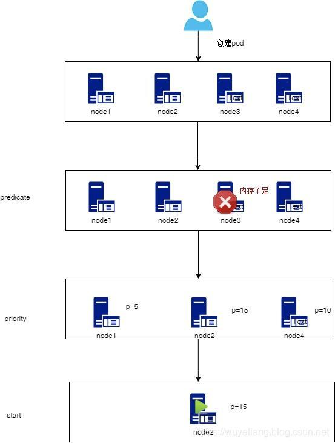

# Kubernetes工作负载（Workloads）与调度（Scheduling）

## 1. 什么是Pod？

Pod，是 Kubernetes 项目中最小的 API 对象。如果换一个更专业的说法，我们可以这样描述：Pod，是 Kubernetes 项目的原子调度单位。

在容器技术章节讲到Docker属于“单进程模型”（容器的“单进程模型”，并不是指容器里只能运行“一个”进程，而是指容器没有管理多个进程的能力），而Pod就可以理解为将多个Docker容器组合在一起，从而形成一个进程组。

那我们为什么需要Pod？有Docker容器不就够了吗？这个可以从以下两点进行分析：

### 1. 超亲密关系

在实际开发过程中，经常遇到这样的情况，容器之间会发生直接的文件交换、使用 localhost 或者 Socket 文件进行本地通信、会发生非常频繁的远程调用、需要共享某些 Linux Namespace（比如，一个容器要加入另一个容器的 Network Namespace）等等。像这样容器间的紧密协作，我们可以称为**“超亲密关系”**，并且具有”超亲密关系“的容器必须部署在同一台宿主机上。

但也并不是说，所有有“关系”的容器都属于同一个 Pod。比如，PHP 应用容器和 MySQL 虽然会发生访问关系，但并没有必要、也不应该部署在同一台机器上，它们更适合做成两个 Pod。

### 2. 容器设计模式

为了理解这一层含义，先介绍一下Pod 的实现原理。

首先，关于 Pod 最重要的一个事实是：它只是一个**逻辑概念**。也就是说，Kubernetes 真正处理的，还是宿主机操作系统上 Linux 容器的 Namespace 和 Cgroups，而并不存在一个所谓的 Pod 的边界或者隔离环境。那么，Pod 又是怎么被“创建”出来的呢？答案是：**Pod，其实是一组共享了某些资源的容器。**具体的说：Pod 里的所有容器，共享的是同一个 Network Namespace，并且可以声明共享同一个 Volume。那这么来看的话，一个有 A、B 两个容器的 Pod，不就是等同于一个容器（容器 A）共享另外一个容器（容器 B）的网络和 Volume 的玩儿法么？这好像通过 docker run --net --volumes-from 这样的命令就能实现嘛，比如：

```
$ docker run --net=B --volumes-from=B --name=A image-A ...
```

但是，你有没有考虑过，如果真这样做的话，容器 B 就必须比容器 A 先启动，这样一个 Pod 里的多个容器就不是对等关系，而是拓扑关系了。所以，在 Kubernetes 项目里，Pod 的实现需要使用一个中间容器，这个容器叫作 Infra 容器。在这个 Pod 中，Infra 容器永远都是第一个被创建的容器，而其他用户定义的容器，则通过 Join Network Namespace 的方式，与 Infra 容器关联在一起。这样的组织关系，可以用下面这样一个示意图来表达：


如上图所示，这个 Pod 里有两个用户容器 A 和 B，还有一个 Infra 容器。很容易理解，在 Kubernetes 项目里，Infra 容器一定要占用极少的资源，所以它使用的是一个非常特殊的镜像，叫作：k8s.gcr.io/pause。这个镜像是一个用汇编语言编写的、永远处于“暂停”状态的容器，解压后的大小也只有 100~200 KB 左右。而在 Infra 容器“Hold 住”Network Namespace 后，用户容器就可以加入到 Infra 容器的 Network Namespace 当中了。

这也就意味着，对于 Pod 里的容器 A 和容器 B 来说：

- 它们可以直接使用 localhost 进行通信；

- 它们看到的网络设备跟 Infra 容器看到的完全一样；

- 一个 Pod 只有一个 IP 地址，也就是这个 Pod 的 Network Namespace 对应的 IP 地址。


基于Pod可以共享Volume的特性，容器设计模式里有一种最常用的模式，它的名字叫：**sidecar**。我举两个例子。

**第一个最典型的例子是：WAR 包与 Web 服务器。**

我们现在有一个 Java Web 应用的 WAR 包，它需要被放在 Tomcat 的 webapps 目录下运行起来。假如，你现在只能用 Docker 来做这件事情，那该如何处理这个组合关系呢？

- 一种方法是，把 WAR 包直接放在 Tomcat 镜像的 webapps 目录下，做成一个新的镜像运行起来。可是，这时候，如果你要更新 WAR 包的内容，或者要升级 Tomcat 镜像，就要重新制作一个新的发布镜像，非常麻烦。
- 另一种方法是，你压根儿不管 WAR 包，永远只发布一个 Tomcat 容器。不过，这个容器的 webapps 目录，就必须声明一个 hostPath 类型的 Volume，从而把宿主机上的 WAR 包挂载进 Tomcat 容器当中运行起来。不过，这样你就必须要解决一个问题，即：如何让每一台宿主机，都预先准备好这个存储有 WAR 包的目录呢？实际上，有了 Pod 之后，这样的问题就很容易解决了。我们可以把 WAR 包和 Tomcat 分别做成镜像，然后把它们作为一个 Pod 里的两个容器“组合”在一起。这个 Pod 的配置文件如下所示：

```yaml

apiVersion: v1
kind: Pod
metadata:
  name: javaweb-2
spec:
  initContainers:
  - image: geektime/sample:v2
    name: war
    command: ["cp", "/sample.war", "/app"]
    volumeMounts:
    - mountPath: /app
      name: app-volume
  containers:
  - image: geektime/tomcat:7.0
    name: tomcat
    command: ["sh","-c","/root/apache-tomcat-7.0.42-v2/bin/start.sh"]
    volumeMounts:
    - mountPath: /root/apache-tomcat-7.0.42-v2/webapps
      name: app-volume
    ports:
    - containerPort: 8080
      hostPort: 8001 
  volumes:
  - name: app-volume
    emptyDir: {}
```

在这个 Pod 中，我们定义了两个容器，第一个容器使用的镜像是 geektime/sample:v2，这个镜像里只有一个 WAR 包（sample.war）放在根目录下。而第二个容器则使用的是一个标准的 Tomcat 镜像。

不过，你可能已经注意到，WAR 包容器的类型不再是一个普通容器，而是一个 Init Container 类型的容器。

在 Pod 中，所有 Init Container 定义的容器，都会比 spec.containers 定义的用户容器先启动。并且，Init Container 容器会按顺序逐一启动，而直到它们都启动并且退出了，用户容器才会启动。

所以，这个 Init Container 类型的 WAR 包容器启动后，执行了一句"cp /sample.war /app"，把应用的 WAR 包拷贝到 /app 目录下，然后退出。而后这个 /app 目录，就挂载了一个名叫 app-volume 的 Volume。

接下来就很关键了。Tomcat 容器，同样声明了挂载 app-volume 到自己的 webapps 目录下。所以，等 Tomcat 容器启动时，它的 webapps 目录下就一定会存在 sample.war 文件：这个文件正是 WAR 包容器启动时拷贝到这个 Volume 里面的，而这个 Volume 是被这两个容器共享的。像这样，我们就用一种“组合”方式，解决了 WAR 包与 Tomcat 容器之间耦合关系的问题。

实际上，这个所谓的“组合”操作，正是容器设计模式里最常用的一种模式，它的名字叫：**sidecar**。顾名思义，sidecar 指的就是我们可以在一个 Pod 中，启动一个辅助容器，来完成一些独立于主进程（主容器）之外的工作。比如，在我们的这个应用 Pod 中，Tomcat 容器是我们要使用的主容器，而 WAR 包容器的存在，只是为了给它提供一个 WAR 包而已。所以，我们用 Init Container 的方式优先运行 WAR 包容器，扮演了一个 sidecar 的角色。

**第二个例子，则是容器的日志收集。**

比如，我现在有一个应用，需要不断地把日志文件输出到容器的 /var/log 目录中。这时，我就可以把一个 Pod 里的 Volume 挂载到应用容器的 /var/log 目录上。

然后，我在这个 Pod 里同时运行一个 **sidecar** 容器，它也声明挂载同一个 Volume 到自己的 /var/log 目录上。

这样，接下来 sidecar 容器就只需要做一件事儿，那就是不断地从自己的 /var/log 目录里读取日志文件，转发到 MongoDB 或者 Elasticsearch 中存储起来。这样，一个最基本的日志收集工作就完成了。

跟第一个例子一样，这个例子中的 sidecar 的主要工作也是使用共享的 Volume 来完成对文件的操作。


### Bare Pod 与 Static Pod

#### Bare Pod

区别于由`Deployment`, `StatefulSet`, `DaemonSet`等创建的Pod。我们也可以直接创建Pod。就像"WAR 包与 Web 服务器"中的例子。

```yaml
apiVersion: v1
kind: Pod
metadata:
  name: javaweb-2
  ...
```

#### Static Pod

Static Pod直接由`kubelet`创建，不依赖于kube-apiserver。主要用于K8s集群的引导启动阶段，例如`kube-apiserver`, `kube-controller-manager`, `kube-scheduler`都属于Static Pod，直接由kubelet创建，你可以在`/etc/kubernetes/manifests`找到它们的yaml文件（针对`kubeadm`安装的环境）。其他环境可以通过以下方式，查询`staticPodPath`的路径。

1. 运行`systemctl status kubelet -l`获得`--config=/var/lib/kubelet/config.yaml`


2. 查看`/var/lib/kubelet/config.yaml`，知道`staticPodPath`位于`/etc/kubernetes/manifests`。

   

3. 打开`/etc/kubernetes/manifests/`即可看到所有的Static Pod的yaml文件。

   

## Pod的生命周期、探针

### Pod的生命周期

Pod 遵循一个预定义的生命周期，起始于 `Pending` 阶段，如果其中至少有一个容器正常启动，则进入 `Running`，之后取决于 Pod 中是否有容器以失败状态结束而进入 `Succeeded` 或者 `Failed` 阶段。

Pod 的 `status` 字段中包含一个 `phase` 字段。下面展示了 `phase` 的值及描述：

| 取值        | 描述                                                         |
| ----------- | ------------------------------------------------------------ |
| `Pending`   | Pod 已被 Kubernetes 系统接受，但有一个或者多个容器尚未创建亦未运行。此阶段包括等待 Pod 被调度的时间和通过网络下载镜像的时间， |
| `Running`   | Pod 已经绑定到了某个节点，Pod 中所有的容器都已被创建。至少有一个容器在运行中，或者正处于启动或重启状态。 |
| `Succeeded` | Pod 中的所有容器都已成功终止，并且不会再重启。这种情况在运行一次性任务时最为常见。 |
| `Failed`    | Pod 中的所有容器都已终止，并且至少有一个容器是因为失败终止。也就是说，容器以非 0 状态退出或者被系统终止。 |
| `Unknown`   | 因为某些原因无法取得 Pod 的状态。这种情况通常是因为与 Pod 所在主机通信失败。 |

更进一步地，Pod 对象的 Status 字段，还可以再细分出一组 Conditions。这些细分状态的值包括：PodScheduled、Ready、Initialized，以及 Unschedulable。它们主要用于描述造成当前 Status 的具体原因是什么。

比如，Pod 当前的 Status 是 Pending，对应的 Condition 是 Unschedulable，这就意味着它的调度出现了问题。

而其中，Ready 这个细分状态非常值得我们关注：它意味着 Pod 不仅已经正常启动（Running 状态），而且已经可以对外提供服务了。这两者之间（Running 和 Ready）是有区别的，你不妨仔细思考一下。

Pod 的这些状态信息，是我们判断应用运行情况的重要标准，尤其是 Pod 进入了非“Running”状态后，你一定要能迅速做出反应，根据它所代表的异常情况开始跟踪和定位，而不是去手忙脚乱地查阅文档。

### 容器状态

Kubernetes 会跟踪 Pod 中每个容器的状态，就像它跟踪 Pod 总体上的阶段`phase`一样。 你可以使用[容器生命周期回调](https://kubernetes.io/zh/docs/concepts/containers/container-lifecycle-hooks/) 在容器生命周期的特定时间点触发事件。

一旦`kube-scheduler`将 Pod 分派给某个节点，`kubelet` 就通过 [容器运行时](https://kubernetes.io/docs/setup/production-environment/container-runtimes) 开始为 Pod 创建容器。 容器的状态有三种：`Waiting`（等待）、`Running`（运行中）和 `Terminated`（已终止）。

要检查 Pod 中容器的状态，你可以使用 `kubectl describe pod <pod 名称>`。 其输出中包含 Pod 中每个容器的状态。

每种状态都有特定的含义：

#### `Waiting` （等待）

容器启动前的准备阶段。例如，从容器镜像仓库拉取容器镜像，或者向容器配置 [Secret](https://kubernetes.io/zh/docs/concepts/configuration/secret/) 数据等等。 当你使用 `kubectl` 来查询包含 `Waiting` 状态的容器的 Pod 时，你也会看到一个 Reason 字段，其中给出了容器处于等待状态的原因。

#### `Running`（运行中）

`Running` 状态表明容器正在执行状态并且没有问题发生。 如果配置了 `postStart` 回调，那么该回调已经执行完成。 如果你使用 `kubectl` 来查询包含 `Running` 状态的容器的 Pod 时，你也会看到 关于容器进入 `Running` 状态的信息。

#### `Terminated`（已终止）

处于 `Terminated` 状态的容器可能是正常结束，也有可能是因为某些原因失败而结束。 如果你使用 `kubectl` 来查询包含 `Terminated` 状态的容器的 Pod 时，你会看到 容器进入此状态的原因、退出代码以及容器执行期间的起止时间。

如果容器配置了 `preStop` 回调，则该回调会在容器进入 `Terminated` 状态之前执行。

#### 容器重启策略

Pod 的 `spec` 中包含一个 `restartPolicy` 字段，其可能取值包括 Always、OnFailure 和 Never。默认值是 Always。

`restartPolicy` 适用于 Pod 中的所有容器。`restartPolicy` 仅针对同一节点上 `kubelet` 的容器重启动作。


### 容器生命周期回调

Kubernetes 会跟踪 Pod 中每个容器的状态，就像它跟踪 Pod 总体上的阶段`phase`一样。 你可以使用[容器生命周期回调](https://kubernetes.io/zh/docs/concepts/containers/container-lifecycle-hooks/) 在容器生命周期的特定时间点触发事件。

#### 容器回调

有两个回调暴露给容器：

##### `PostStart`

`PostStart`，这个回调在创建容器之后立即执行。 但是，不能保证回调会在容器入口点（ENTRYPOINT）之前执行。当然，如果 `postStart` 执行超时或者错误，Kubernetes 会在该 Pod 的 Events 中报出该容器启动失败的错误信息，导致 Pod 也处于失败的状态。

##### `PreStop`

`PreStop`，发生的时机，则是在容器被杀死之前（比如，收到了 SIGKILL 信号）。而需要明确的是，`preStop` 操作的执行是同步的。所以，它会阻塞当前的容器杀死流程，直到这个 Hook 定义操作完成之后，才允许容器被杀死，这跟 `postStart` 不一样。

举例：在这个例子中，我们在容器成功启动之后，在 /usr/share/message 里写入了一句“欢迎信息”（即 `postStart` 定义的操作）。而在这个容器被删除之前，我们则先调用了 nginx 的退出指令（即 preStop 定义的操作），从而实现了容器的“优雅退出”。

```yaml
apiVersion: v1
kind: Pod
metadata:
  name: lifecycle-demo
spec:
  containers:
  - name: lifecycle-demo-container
    image: nginx
    lifecycle:
      postStart:
        exec:
          command: ["/bin/sh", "-c", "echo Hello from the postStart handler > /usr/share/message"]
      preStop:
        exec:
          command: ["/usr/sbin/nginx","-s","quit"]
```


### 探针

探针是由 [kubelet](https://kubernetes.io/zh/docs/reference/command-line-tools-reference/kubelet/) 对容器执行的定期诊断。 `kubelet`提供三种方式以实现定期诊断：

- [ExecAction](https://kubernetes.io/docs/reference/generated/kubernetes-api/v1.19/#execaction-v1-core)： 在容器内执行指定命令。如果命令退出时返回码为 0 则认为诊断成功。
- [TCPSocketAction](https://kubernetes.io/docs/reference/generated/kubernetes-api/v1.19/#tcpsocketaction-v1-core)： 对容器的 IP 地址上的指定端口执行 TCP 检查。如果端口打开，则诊断被认为是成功的。
- [HTTPGetAction](https://kubernetes.io/docs/reference/generated/kubernetes-api/v1.19/#httpgetaction-v1-core)： 对容器的 IP 地址上指定端口和路径执行 HTTP Get 请求。如果响应的状态码大于等于 200 且小于 400，则诊断被认为是成功的。

每次探测都将获得以下三种结果之一：

- `Success`（成功）：容器通过了诊断。
- `Failure`（失败）：容器未通过诊断。
- `Unknown`（未知）：诊断失败，因此不会采取任何行动。

`kubelet` 提供了三种类型的探针，针对不同的探测，kubelet会作出不同的反应：

- `livenessProbe`：指示容器是否正在运行。如果存活态探测失败，则 `kubelet` 会杀死容器， 并且容器将根据其[重启策略](https://kubernetes.io/zh/docs/concepts/workloads/pods/pod-lifecycle/#restart-policy)进行重启。如果容器不提供存活探针， 则默认状态为 `Success`。
- `readinessProbe`：指示容器是否准备好为请求提供服务。如果就绪态探测失败， 端点控制器将从与 Pod 匹配的Endpoints列表中删除该 Pod 的 IP 地址。 如果容器不提供就绪态探针，则默认状态为 `Success`。
- `startupProbe`: 指示容器中的应用是否已经启动。如果提供了启动探针，则所有其他探针都会被禁用，直到此探针成功为止。如果启动探测失败，`kubelet` 将杀死容器，而容器依其 [重启策略](https://kubernetes.io/zh/docs/concepts/workloads/pods/pod-lifecycle/#restart-policy)进行重启。 如果容器没有提供启动探测，则默认状态为 `Success`。

有一点需要强调的是，Pod 的恢复过程，永远都是发生在当前节点上，而不会跑到别的节点上去。事实上，一旦一个 Pod 与一个节点（Node）绑定，除非这个绑定发生了变化（pod.spec.node 字段被修改），否则它永远都不会离开这个节点。这也就意味着，如果这个宿主机宕机了，这个 Pod 也不会主动迁移到其他节点上去。

而如果你想让 Pod 出现在其他的可用节点上，就必须使用 Deployment 这样的“控制器”来管理 Pod，哪怕你只需要一个 Pod 副本。

#### 何时该使用存活态探针?

如果容器中的进程能够在遇到问题或不健康的情况下自行崩溃，则不一定需要存活态探针; `kubelet` 将根据 Pod 的`restartPolicy` 自动执行修复操作。

如果你希望容器在探测失败时被杀死并重新启动，那么请指定一个存活态探针， 并指定`restartPolicy` 为 "`Always`" 或 "`OnFailure`"。

#### 何时该使用就绪态探针?

如果要仅在探测成功时才开始向 Pod 发送请求流量，请指定就绪态探针。 就绪态探针的存在意味着 Pod 将在启动阶段不接收任何数据，并且只有在就绪态探针探测成功后才开始接收数据。

如果你的容器需要加载大规模的数据、配置文件或者在启动期间执行迁移操作，可以添加一个就绪态探针。

如果你希望容器能够自行进入维护状态，也可以指定一个就绪态探针。

> **说明：** 请注意，如果你只是想在 Pod 被删除时能够排空请求，则不一定需要使用就绪态探针；在删除 Pod 时，Pod 会自动将自身置于未就绪状态，无论就绪态探针是否存在。 等待 Pod 中的容器停止期间，Pod 会一直处于未就绪状态。

#### 何时该使用启动探针？

对于所包含的容器需要较长时间才能启动就绪的 Pod 而言，启动探针是有用的。 你不再需要配置一个较长的存活态探测时间间隔，只需要设置另一个独立的配置选定， 对启动期间的容器执行探测，从而允许使用远远超出存活态时间间隔所允许的时长。

如果你的容器启动时间通常超出 `initialDelaySeconds + failureThreshold × periodSeconds` 总值，你应该设置一个启动探针，对存活态探针所使用的同一端点执行检查。

下面是一个使用了`livenessProbe`, `readinessProbe`, `startupProbe`的例子。

```yaml
apiVersion: v1
kind: Pod
metadata:
  name: goproxy
  labels:
    app: goproxy
spec:
  containers:
  - name: goproxy
    image: k8s.gcr.io/goproxy:0.1
    ports:
    - name: liveness-port
      containerPort: 8080
      hostPort: 8080
    readinessProbe:
      tcpSocket:
        port: 8080
      initialDelaySeconds: 5
      periodSeconds: 10
    livenessProbe:
      exec:
        command:
        - cat
        - /tmp/healthy
      initialDelaySeconds: 5
      periodSeconds: 5
    startupProbe:
      httpGet:
        path: /healthz
        port: liveness-port
      failureThreshold: 30
      periodSeconds: 10
```


## 2. 什么是Deployment？

#### 什么是Deployment，和Pod的区别？

Pod和Deployment都是Kubernetes API中的对象。Deployment通过ReplicaSet管理创建Pod。Deployment将使用Pod模板来创建Pod。在生产环境中，使用更多的是Deployment，而不是直接使用Pod。

#### 主要用途 - 部署无状态应用

##### 无状态服务

无状态服务是指该服务运行的实例不会在本地存储或需要持久化的数据，并且多个实例对于同一个请求响应的结果是完全一致的。例如nginx就是典型的无状态服务。

相关的Kubernetes资源有：ReplicaSet、ReplicationController、Deployment等。

由于是无状态服务，所以这些控制器创建的Pod序号都是随机值。并且在缩容的时候并不会明确缩容某一个Pod，而是随机的，因为所有实例得到的返回值都是一样，所以缩容任何一个Pod都可以。

##### 创建 Deployment

下面是 Deployment 示例。其中创建了一个 ReplicaSet，负责启动三个 `nginx` Pods：

```yaml
apiVersion: apps/v1
kind: Deployment
metadata:
  name: nginx-deployment
  labels:
    app: nginx
spec:
  replicas: 3
  selector:
    matchLabels:
      app: nginx
  template:
    metadata:
      labels:
        app: nginx
    spec:
      containers:
      - name: nginx
        image: nginx:1.14.2
        ports:
        - containerPort: 80
```

在该例中：

- 创建名为 `nginx-deployment`（由 `.metadata.name` 字段标明）的 Deployment。
- 该 Deployment 创建三个（由 `replicas` 字段标明）Pod 副本。

- `selector` 字段定义 Deployment 如何查找要管理的 Pods。 在这里，`spec.selector.matchLabels`和`spec.template.metadata.labels`定义的标签（`app: nginx`）相匹配。

- `template`字段包含以下子字段：
  - `labels` 字段表示Pod被打上 `app: nginx` 标签。
  - Pod 模板规约（即 `.spec.template.spec` 字段）指示 Pods 运行一个 `nginx` 容器。
  - 创建一个容器并使用 `name` 字段将其命名为 `nginx`。

运行以下命令创建 Deployment ：

```shell
kubectl apply -f https://k8s.io/examples/controllers/nginx-deployment.yaml –record
```

##### Deployment，与 ReplicaSet，以及 Pod 的关系

那么，在具体的实现上，这个 Deployment，与 ReplicaSet，以及 Pod 的关系是怎样的呢？我们可以用一张图把它描述出来：


通过这张图，我们就很清楚地看到，一个定义了 `replicas=3` 的 Deployment，与它的 ReplicaSet，以及 Pod 的关系，实际上是一种“层层控制”的关系。

其中，ReplicaSet 负责通过“控制器模式”，保证系统中 Pod 的个数永远等于指定的个数（比如，3 个）。这也正是 Deployment 只允许容器的 `restartPolicy=Always` 的主要原因：只有在容器能保证自己始终是 Running 状态的前提下，ReplicaSet 调整 Pod 的个数才有意义。

而在此基础上，Deployment 同样通过“控制器模式”，来操作 ReplicaSet 的个数和属性，进而实现“水平扩展 / 收缩”和“滚动更新”这两个编排动作。

#### 扩缩容（scale applications）

“水平扩展 / 收缩”非常容易实现，Deployment Controller 只需要修改它所控制的 ReplicaSet 的 Pod 副本个数就可以了。

比如，把这个值从 3 改成 4，那么 Deployment 所对应的 ReplicaSet，就会根据修改后的值自动创建一个新的 Pod。这就是“水平扩展”了；“水平收缩”则反之。而用户想要执行这个操作的指令也非常简单，就是 kubectl scale，比如：

```shell
$ kubectl scale deployment nginx-deployment --replicas=4
deployment.apps/nginx-deployment scaled
```

#### 滚动更新/回滚

```yaml
[root@k8s-master1 tzhong]# kubectl get deployments
NAME               READY   UP-TO-DATE   AVAILABLE   AGE
nginx-deployment   3/3     3            3           43s
```

通过`kubectl get deployments`这条命令，我们可以看到Deployment当前的状态信息。这里首先介绍一下各个状态字段所代表的含义。

1. READY：分子代表当前处于Ready状态的Pod个数，分母代表期望的 Pod 个数（spec.replicas 的值）；
2. UP-TO-DATE：当前处于最新版本的 Pod 的个数，所谓最新版本指的是 Pod 的 Spec 部分与 Deployment 里 Pod 模板里定义的完全一致；
3. AVAILABLE：当前已经可用的 Pod 的个数，即：既是 Running 状态，又是最新版本，并且已经处于 Ready（健康检查正确）状态的 Pod 的个数。

一般通过READY和UP-TO-DATE这两个字段，就能决定当前Deployment是否已经处于创建完毕或者更新完毕状态。

接下来，我们在看看这个 Deployment 所控制的 ReplicaSet的状态：
```shell
[root@k8s-master1 tzhong]# kubectl get rs
NAME                          DESIRED   CURRENT   READY   AGE
nginx-deployment-6b474476c4   3         3         3       48s
```

ReplicaSet 的名字，则是由 Deployment 的名字和一个随机字符串共同组成。这个随机字符串叫作 pod-template-hash，在我们这个例子里就是：6b474476c4。

ReplicaSet 会把这个随机字符串加在它所控制的所有 Pod 的标签里，从而保证这些 Pod 不会与集群里的其他 Pod 混淆。如下图所示：

```yaml
apiVersion: v1
kind: Pod
metadata:
  annotations:
    cni.projectcalico.org/podIP: 10.244.1.41/32
    cni.projectcalico.org/podIPs: 10.244.1.41/32
  creationTimestamp: "2020-12-01T15:51:16Z"
  generateName: nginx-deployment-6b474476c4-
  labels:
    app: nginx
    pod-template-hash: 6b474476c4        # Here
 ...
spec:
  containers:
  - image: nginx:1.14.2
    imagePullPolicy: IfNotPresent
    name: nginx
    ports:
    - containerPort: 80
      protocol: TCP
 ...
```

而 ReplicaSet 的 DESIRED、CURRENT 和 READY 字段的含义，和 Deployment 中是一致的。

这个时候，如果我们**修改了 Deployment 的 Pod 模板，“滚动更新”就会被自动触发**。

修改 Deployment 有很多方法。比如，我可以直接使用 kubectl edit 指令编辑 Etcd 里的 API 对象。

```shell
$ kubectl edit deployment/nginx-deployment
... 
    spec:
      containers:
      - name: nginx
        image: nginx:1.14.2 # 1.14.2 -> 1.19.5
        ports:
        - containerPort: 80
...
deployment.extensions/nginx-deployment edited
```

这个 `kubectl edit` 指令，会帮你直接打开 nginx-deployment 的 API 对象。然后，你就可以修改这里的 Pod 模板部分了。比如，在这里，我将 nginx 镜像的版本升级到了 1.19.5。

> 备注：kubectl edit 并不神秘，它不过是把 API 对象的内容下载到了本地文件，让你修改完成后再提交上去。

`kubectl edit` 指令编辑完成后，保存退出，Kubernetes 就会立刻触发“滚动更新”的过程。

如果这个时候，我们在去运行命令`kubectl get rs`，可以看到，首先，当你修改了 Deployment 里的 Pod 定义之后，Deployment Controller 会使用这个修改后的 Pod 模板，创建一个新的 ReplicaSet（hash=757fdd4bd），这个新的 ReplicaSet 的初始 Pod 副本数是：0。

```
[root@k8s-master1 tzhong]# kubectl get rs
NAME                          DESIRED   CURRENT   READY   AGE
nginx-deployment-6b474476c4   3         3         3       15m
nginx-deployment-757fdd4bd    0         0         0       1s
```

同时，我们也可以通过查看 Deployment 的 Events，查看“滚动更新”的整个过程，使用命令`kubectl describe deployment nginx-deployment`：


由上图可以看出，nginx-deployment-757fdd4bd（新）一直被Scaled up，数字从1,2,3这样的变化，即最终，“水平扩展"出了3个Pod。

而nginx-deployment-6b474476c4（旧）一直被Scaled down，数字从2,1,0这样变化，即：“水平收缩”，直至为0个Pod。

而且可以发现，Scaled up和Scaled down是交替进行的。像这样，将一个集群中正在运行的多个 Pod 版本，交替地逐一升级的过程，就是“滚动更新”。

在这个“滚动更新”过程完成之后，我们在查看一下新、旧两个 ReplicaSet 的最终状态：

```shell
[root@k8s-master1 tzhong]# kubectl get rs
NAME                          DESIRED   CURRENT   READY   AGE
nginx-deployment-6b474476c4   0         0         0       20m
nginx-deployment-757fdd4bd    3         3         3       5m22s
```

其中，旧 ReplicaSet（hash=6b474476c4）已经被“水平收缩”成了 0 个Pod。而新ReplicaSet（hash=757fdd4bd）被“水平扩展"成了3个Pod。

##### 滚动更新的优势

这种“滚动更新”的好处是显而易见的。比如，在升级刚开始的时候，集群里只有 1 个新版本的 Pod。如果这时，新版本 Pod 有问题启动不起来，那么“滚动更新”就会停止，从而允许开发和运维人员介入。而在这个过程中，由于应用本身还有两个旧版本的 Pod 在线，所以服务并不会受到太大的影响。

当然，这也就要求你一定要使用 Pod 的 Health Check 机制检查应用的运行状态，而不是简单地依赖于容器的 Running 状态。要不然的话，虽然容器已经变成 Running 了，但服务很有可能尚未启动，“滚动更新”的效果也就达不到了。

##### 滚动更新的速率

而为了进一步保证服务的连续性，Deployment Controller 还会确保，在任何时间窗口内，只有指定比例的 Pod 处于离线状态。同时，它也会确保，在任何时间窗口内，只有指定比例的新 Pod 被创建出来。这两个比例的值都是可以配置的，默认都是 DESIRED 值的 25%。

所以，在上面这个 Deployment 的例子中，它有 3 个 Pod 副本，那么控制器在“滚动更新”的过程中永远都会确保至少有 75%的Pod处于可用状态，最多有25%的Pod处于不可用状态（maxUnavailable）。至多有 125%的Pod 同时存在于集群中（maxSurge）。这个策略，是 Deployment 对象的一个字段，名叫 RollingUpdateStrategy，如下所示：

```shell
apiVersion: apps/v1
kind: Deployment
metadata:
  name: nginx-deployment
  labels:
    app: nginx
spec:
...
  strategy:
    type: RollingUpdate
    rollingUpdate:
      maxSurge: 1
      maxUnavailable: 1
```

滚动更新的速率主要由`maxSurge` 和 `maxUnavailable`两个字段决定。

###### Max Surge

`maxSurge` 指定的是在现有Pod的数量之上，在一次“滚动”中，Deployment 控制器还可以创建多少个新 Pod。

当`maxSurge`以百分比的形式表示时，比如：`maxSurge=50%`，指的是至多有 150%的Pod（新Pod + 老Pod） 同时存在于集群中，计算出的Pod数量，如果有小数点，则向上取整。

###### Max Unavailable

`maxUnavailable` 指的是，在一次“滚动”中，Deployment 控制器可以删除多少个旧 Pod。

当`maxUnavailable` 以百分比的形式表示时，比如：`maxUnavailable=50%`，指的是我们最多可以一次删除 `50% * spec.replicas` 数量个 Pod。计算出的Pod数量，如果有小数点，则向下取整。

 `maxSurge` 和 `maxUnavailable` 不能同时为0。假设它们的值都是0，那么表示既不能删除旧Pod，也不能新增Pod，那就无法滚动更新了。

##### 回滚

结合以上讲述，现在我们可以扩展一下 Deployment、ReplicaSet 和 Pod 的关系图了。


如上所示，Deployment 的控制器，实际上控制的是 ReplicaSet 的数目，以及每个 ReplicaSet 的属性。

而一个应用的版本，对应的正是一个 ReplicaSet；这个版本应用的 Pod 数量，则由 ReplicaSet 通过它自己的控制器（ReplicaSet Controller）来保证。

通过这样的多个 ReplicaSet 对象，Kubernetes 项目就实现了对多个“应用版本”的描述。

而明白了“应用版本和 ReplicaSet 一一对应”的设计思想之后，我就可以为你讲解一下Deployment 对应用进行版本控制的具体原理了。即“**回滚**”。

这一次，我会使用一个叫 `kubectl set image` 的指令，直接修改 nginx-deployment 所使用的镜像。这个命令的好处就是，你可以不用像 `kubectl edit` 那样需要打开编辑器。

不过这一次，我把这个镜像名字修改成为了一个错误的名字，比如：nginx:1.91。这样，这个 Deployment 就会出现一个升级失败的版本。

我们一起来实践一下：

```shell
[root@k8s-master1 tzhong]# kubectl set image deployment/nginx-deployment nginx=nginx:1.91
deployment.apps/nginx-deployment image updated
```

由于这个 nginx:1.91 镜像在 Docker Hub 中并不存在，所以这个 Deployment 的“滚动更新”被触发后，会立刻报错并停止。

我们只需要执行一条 `kubectl rollout undo` 命令，就能把整个 Deployment 回滚到上一个版本：

```shell
[root@k8s-master1 tzhong]# kubectl rollout undo deployment/nginx-deployment
deployment.apps/nginx-deployment rolled back
```

如果我们想回滚到更早之前的版本，要怎么办呢？可以使用 `kubectl rollout history` 命令，每次 Deployment 的变更都会被记录下来。

```
[root@k8s-master1 tzhong]# kubectl rollout history deployment/nginx-deployment
deployment.apps/nginx-deployment 
REVISION  CHANGE-CAUSE
1         <none>
2         <none>
3         <none>
5         <none>
6         <none>
```

*备注：*

*CHANGE-CAUSE为none是因为我们创建Deployment的时候，没有指定–record参数。例如，我们可以这样操作：*

```shell
$ kubectl create -f nginx-deployment.yaml --record
```

*–record 参数的作用，是记录下每次操作所执行的命令，以方便后面查看。*

更可以使用以下命令，来查看每次变更的具体细节。

```shell
$ kubectl rollout history deployment/nginx-deployment --revision=2
```

想回滚到某个历史版本，只需指定版本号即可。具体的指令的用法如下：

```shell
$ kubectl rollout undo deployment/nginx-deployment --to-revision=2
```

这样，Deployment Controller 还会按照“滚动更新”的方式，完成对 Deployment 的降级操作。

不过，你可能已经想到了一个问题：我们对 Deployment 进行的每一次更新操作，都会生成一个新的 ReplicaSet 对象，是不是有些多余，甚至浪费资源呢？

没错。所以，Kubernetes 项目还提供了一个指令，使得我们对 Deployment 的多次更新操作，最后只生成一个 ReplicaSet。具体的做法是，在更新 Deployment 前，你要先执行一条 `kubectl rollout pause` 指令。它的用法如下所示：

```shell
$ kubectl rollout pause deployment/nginx-deployment
deployment.extensions/nginx-deployment paused
```

这个 `kubectl rollout pause` 的作用，是让这个 Deployment 进入了一个“暂停”状态。所以接下来，你就可以随意使用 `kubectl edit` 或者 `kubectl set image` 指令，修改这个 Deployment 的内容了。

由于此时 Deployment 正处于“暂停”状态，所以我们对 Deployment 的所有修改，都不会触发新的“滚动更新”，也不会创建新的 ReplicaSet。

而等到我们对 Deployment 修改操作都完成之后，只需要再执行一条 `kubectl rollout resume` 指令，就可以把这个 Deployment“恢复”回来，如下所示：

```shell
$ kubectl rollout resume deployment/nginx-deployment
```

而在这个 `kubectl rollout resume` 指令执行之前，在 `kubectl rollout pause` 指令之后的这段时间里，我们对 Deployment 进行的所有修改，最后只会触发一次“滚动更新”。

不过，即使你像上面这样小心翼翼地控制了 ReplicaSet 的生成数量，随着应用版本的不断增加，Kubernetes 中还是会为同一个 Deployment 保存很多很多不同的 ReplicaSet。

那么，我们又该如何控制这些“历史”ReplicaSet 的数量呢？

很简单，Deployment 对象有一个字段，叫作 `spec.revisionHistoryLimit`，就是 Kubernetes 为 Deployment 保留的“历史版本”个数。所以，如果把它设置为 0，你就再也不能做回滚操作了。

#### 自修复无状态应用

Kubernetes的自修复特性，确保集群始终以最佳状态运行。借助于Kubernetes对Pod执行了`livenessProbe`和`readinessProbe`探测，以检查Pod是否按照期望的状态工作。`livenessProbe`将检查容器的运行状态，如果此容器探测失败，Kubernetes将终止它，并根据重启策略创建一个新的容器。`readinessProbe`将检查容器的服务请求功能，如果此容器探测失败，Kubernetes将删除相关Pod的IP地址。


## 3. 什么是StatefulSet？

### 部署有状态应用，以及特性

#### 有状态服务

有状态服务是指需要数据存储功能的服务，例如MySql数据库、Kafka、Zookeeper等。每个实例都需要有自己独立的持久化存储。相关的Kubernetes资源为：StatefulSet，每个Pod都有特定的名称和网络标识。比如Pod名是由`$(StatefulSet 名称)-$(序号)`组成。

有状态的Pod是用来运行有状态应用的，所以其在数据卷上存储的数据非常重要，在 Statefulset缩容时，如果自动删除了对应的数据，这将是灾难性的。基于这个原因，对于StatefulSet应用，一般将持久卷设置为手动删除。

在进行缩容操作的时候，可以明确知道会先缩容哪一个Pod，数字最大的被最先缩容掉。并且StatefulSet在有实例不健康的情况下是不允许做缩容操作的。StatefulSet缩容任何时候只会操作一个Pod实例，所以有状态应用的缩容不会很迅速。

容器技术诞生后，大家很快发现，它用来封装“无状态应用”（Stateless Application），尤其是 Web 服务，非常好用。但是，一旦你想要用容器运行“有状态应用”，其困难程度就会直线上升。而且，这个问题解决起来，单纯依靠容器技术本身已经无能为力，这也就导致了很长一段时间内，“有状态应用”几乎成了容器技术圈子的“忌讳”，大家一听到这个词，就纷纷摇头。

不过，Kubernetes 项目还是成为了“第一个吃螃蟹的人”。

得益于“控制器模式”的设计思想，Kubernetes 项目很早就在 Deployment 的基础上，扩展出了对“有状态应用”的初步支持。这个编排功能，就是：StatefulSet。

#### 什么时候选择使用StatefulSet？

应用的多个实例之间存在**拓扑状态**或者**存储状态**。

##### 拓扑状态

拓扑状态。这种情况意味着，应用的多个实例之间不是完全对等的关系。这些应用实例，必须按照某些顺序启动，比如应用的主节点 A 要先于从节点 B 启动。而如果你把 A 和 B 两个 Pod 删除掉，它们再次被创建出来时也必须严格按照这个顺序才行。并且，新创建出来的 Pod，必须和原来 Pod 的网络标识一样，这样原先的访问者才能使用同样的方法，访问到这个新 Pod。

##### 存储状态

存储状态。这种情况意味着，应用的多个实例分别绑定了不同的存储数据。对于这些应用实例来说，Pod A 第一次读取到的数据，和隔了十分钟之后再次读取到的数据，应该是同一份，哪怕在此期间 Pod A 被重新创建过。这种情况最典型的例子，就是一个数据库应用的多个存储实例。所以，StatefulSet 的核心功能，就是通过某种方式记录这些状态，然后在 Pod 被重新创建时，能够为新 Pod 恢复这些状态。

#### Headless Service在StatefulSet场景下的使用（拓扑状态）

##### 什么是Headless Service？

Service 是 Kubernetes 项目中用来将一组 Pod 暴露给外界访问的一种机制。比如，一个 Deployment 有 3 个 Pod，那么我就可以定义一个 Service。然后，用户只要能访问到这个 Service，它就能访问到某个具体的 Pod。

那么，这个 Service 又是如何被访问的呢？

第一种方式，是以 Service 的 VIP（Virtual IP，即：虚拟 IP）方式。比如：当我访问 10.0.23.1 这个 Service 的 IP 地址时，10.0.23.1 其实就是一个 VIP，它会把请求转发到该 Service 所代理的某一个 Pod 上。这里的具体原理，我会在后续的 Service 章节中进行详细介绍。

第二种方式，就是以 Service 的 DNS 方式。比如：这时候，只要我访问“my-svc.my-namespace.svc.cluster.local”这条 DNS 记录，就可以访问到名叫 my-svc 的 Service 所代理的某一个 Pod。

而在第二种 Service DNS 的方式下，具体还可以分为两种处理方法：

第一种处理方法，是 Normal Service。这种情况下，你访问“my-svc.my-namespace.svc.cluster.local”解析到的，正是 my-svc 这个 Service 的 VIP，后面的流程就跟 VIP 方式一致了。

而第二种处理方法，正是 Headless Service。这种情况下，你访问“<pod-name>.my-svc.my-namespace.svc.cluster.local”解析到的，直接就是 my-svc 代理的某一个 Pod 的 IP 地址。

可以看到，这里的区别有两点：

1. Headless Service 不需要分配一个 VIP，而是可以直接以 DNS 记录的方式解析出被代理 Pod 的 IP 地址。
2. 与Normal Service方式相比，DNS记录的开头部分多了一个<pod-name>。

##### 实践：创建Headless Service和StatefulSet 

下面是一个标准的 Headless Service 对应的 YAML 文件：

```yaml
apiVersion: v1
kind: Service
metadata:
  name: nginx
  labels:
    app: nginx
spec:
  ports:
  - port: 80
    name: web
  clusterIP: None   # Here
  selector:
    app: nginx
```

可以看到，所谓的 Headless Service，其实仍是一个标准 Service 的 YAML 文件。只不过，它的 clusterIP 字段的值是：None，即：这个 Service，没有一个 VIP 作为“头”。这也就是 Headless 的含义。所以，这个 Service 被创建后并不会被分配一个 VIP，而是会以 DNS 记录的方式暴露出它所代理的 Pod。

而它所代理的 Pod，依然是通过 Label Selector 机制选择出来的，即：所有携带了 app=nginx 标签的 Pod，都会被这个 Service 代理起来。

然后关键来了。当你按照这样的方式创建了一个 Headless Service 之后，它所代理的所有 Pod 的 IP 地址，都会被绑定一个**这样格式的 DNS 记录**，如下所示：（注意这条DNS记录中的开头部分，<pod-name>）

```shell
<pod-name>.<svc-name>.<namespace>.svc.cluster.local
```

现在我们再编写一个 StatefulSet 的 YAML 文件，如下所示：

```yaml
apiVersion: apps/v1
kind: StatefulSet
metadata:
  name: web
spec:
  serviceName: "nginx"   # Here
  replicas: 2
  selector:
    matchLabels:
      app: nginx
  template:
    metadata:
      labels:
        app: nginx
    spec:
      containers:
      - name: nginx
        image: nginx:1.9.1
        ports:
        - containerPort: 80
          name: web
```

这个 YAML 文件，和Deployment的YAML文件相比，唯一区别就是多了一个 serviceName=nginx 字段。且对于StatefulSet来说，serviceName字段是一个必填字段，否则在创建StatefulSet资源时会提示如下错误。

```shell
error: error validating "statefulset-nginx.yaml": error validating data: ValidationError(StatefulSet.spec): missing required field "serviceName" in io.k8s.api.apps.v1.StatefulSetSpec; if you choose to ignore these errors, turn validation off with --validate=false
```

serviceName字段的作用，就是告诉 StatefulSet 控制器，在执行控制循环（Control Loop）的时候，请使用 nginx 这个 Headless Service 来保证 Pod 的“可解析身份”。

也就是说，会创建两条DNS记录，

```shell
# <pod-name>.<svc-name>.<namespace>.svc.cluster.local
web-0.nginx.default.svc.cluster.local
web-1.nginx.default.svc.cluster.local
```

然后我们创建这两个YAML文件，做一些实验：

```shell
[root@k8s-master1 tzhong]# kubectl create -f headless-svc-nginx.yaml 
service/nginx created
[root@k8s-master1 tzhong]# kubectl get svc
NAME                    TYPE        CLUSTER-IP       EXTERNAL-IP   PORT(S)        AGE
kubernetes              ClusterIP   10.96.0.1        <none>        443/TCP        25h
nginx                   ClusterIP   None             <none>        80/TCP         4s
nginx-svc               NodePort    10.103.236.60    <none>        80:31371/TCP   25h

[root@k8s-master1 tzhong]# kubectl create -f statefulset-nginx.yaml 
statefulset.apps/web created

[root@k8s-master1 tzhong]# kubectl get pods -o wide
NAME                READY   STATUS    RESTARTS   AGE    IP            NODE          NOMINATED NODE   
web-0               1/1     Running   0          4m7s   10.244.1.16   k8s-node1     <none>           <none>
web-1               1/1     Running   0          4m6s   10.244.1.17   k8s-node1     <none>           <none>
```

你会发现由StatefulSet 创建的Pod，会按照数字由小到大的顺序，例如0,1,2,3的顺序创建。只有当数字编号为0的Pod，处于Ready状态后，才会继续创建数字编号为1的Pod。

如果是删除StatefulSet，那么会反过来，会按照数字由大到小的顺序，例如3,2,1,0的顺序删除。只有当数字编号为3的Pod，被删除后，才会继续删除数字编号为2的Pod。

使用命令`kubectl run -it --rm --image=infoblox/dnstools dns-client`启动一个临时Pod，测试一下StatefulSet 的网络情况。

```shell
[root@k8s-master1 tzhong]# kubectl run -it --rm --image=infoblox/dnstools dns-client
If you don't see a command prompt, try pressing enter.
# nslookup nginx会返回Headless Service所绑定的所有可用Pod的IP地址。这里返回了两个，分别是10.244.1.17和10.244.1.16
dnstools# nslookup nginx
Server:		10.96.0.10
Address:	10.96.0.10#53

Name:	nginx.default.svc.cluster.local
Address: 10.244.1.17
Name:	nginx.default.svc.cluster.local
Address: 10.244.1.16

# 测试如何访问单个Pod
dnstools# nslookup web-0.nginx
Server:		10.96.0.10
Address:	10.96.0.10#53

Name:	web-0.nginx.default.svc.cluster.local
Address: 10.244.1.16

# 测试如何访问单个Pod
dnstools# nslookup web-1.nginx
Server:		10.96.0.10
Address:	10.96.0.10#53

Name:	web-1.nginx.default.svc.cluster.local
Address: 10.244.1.17

# 测试如何访问单个Pod，使用完整的DNS记录，在跨namespace访问的情况下，需要填写完整的DNS记录。
dnstools# nslookup web-0.nginx.default.svc.cluster.local
Server:		10.96.0.10
Address:	10.96.0.10#53

Name:	web-0.nginx.default.svc.cluster.local
Address: 10.244.1.16

# 用curl测试访问 web-0.nginx.default.svc.cluster.local
dnstools# curl http://web-0.nginx.default.svc.cluster.local
<!DOCTYPE html>
<html>
<head>
<title>Welcome to nginx!</title>
<style>
    body {
        width: 35em;
        margin: 0 auto;
        font-family: Tahoma, Verdana, Arial, sans-serif;
    }
</style>
</head>
<body>
<h1>Welcome to nginx!</h1>
<p>If you see this page, the nginx web server is successfully installed and
working. Further configuration is required.</p>

<p>For online documentation and support please refer to
<a href="http://nginx.org/">nginx.org</a>.<br/>
Commercial support is available at
<a href="http://nginx.com/">nginx.com</a>.</p>

<p><em>Thank you for using nginx.</em></p>
</body>
</html>

# 用curl测试访问 web-1.nginx.default.svc.cluster.local
dnstools# curl http://web-1.nginx.default.svc.cluster.local
<!DOCTYPE html>
<html>
<head>
<title>Welcome to nginx!</title>
<style>
    body {
        width: 35em;
        margin: 0 auto;
        font-family: Tahoma, Verdana, Arial, sans-serif;
    }
</style>
</head>
<body>
<h1>Welcome to nginx!</h1>
<p>If you see this page, the nginx web server is successfully installed and
working. Further configuration is required.</p>

<p>For online documentation and support please refer to
<a href="http://nginx.org/">nginx.org</a>.<br/>
Commercial support is available at
<a href="http://nginx.com/">nginx.com</a>.</p>

<p><em>Thank you for using nginx.</em></p>
</body>
</html>

# 发现不指定<pod-name>，也可以访问通，但到底是web-0还是web-1在提供服务呢？
dnstools# curl http://nginx.default.svc.cluster.local
<!DOCTYPE html>
<html>
<head>
<title>Welcome to nginx!</title>
<style>
    body {
        width: 35em;
        margin: 0 auto;
        font-family: Tahoma, Verdana, Arial, sans-serif;
    }
</style>
</head>
<body>
<h1>Welcome to nginx!</h1>
<p>If you see this page, the nginx web server is successfully installed and
working. Further configuration is required.</p>

<p>For online documentation and support please refer to
<a href="http://nginx.org/">nginx.org</a>.<br/>
Commercial support is available at
<a href="http://nginx.com/">nginx.com</a>.</p>

<p><em>Thank you for using nginx.</em></p>
</body>
</html>

# 使用traceroute查看，到底是web-0还是web-1在提供服务？
# 有时候是web-1, 10.244.1.17，# 有时候是web-0, 10.244.1.16。
# 具体返回哪个IP地址，这个跟kube-dns(这里用的是coredns)的负载均衡策略有关，coredns默认的负载均衡策略是random。
# 具体可参考 https://coredns.io/plugins/proxy/#policies
dnstools# traceroute nginx.default.svc.cluster.local
traceroute to nginx.default.svc.cluster.local (10.244.1.17), 30 hops max, 46 byte packets
 1  192.168.56.102 (192.168.56.102)  0.005 ms  0.023 ms  0.016 ms
 2  10-244-1-17.nginx-svc.default.svc.cluster.local (10.244.1.17)  0.026 ms  0.015 ms  0.012 ms

dnstools# traceroute nginx.default.svc.cluster.local
traceroute to nginx.default.svc.cluster.local (10.244.1.16), 30 hops max, 46 byte packets
 1  192.168.56.102 (192.168.56.102)  0.005 ms  0.004 ms  0.003 ms
 2  web-0.nginx.default.svc.cluster.local (10.244.1.16)  0.002 ms  0.004 ms  0.003 ms
```


#### 实践：Persistent Volume Claim 的使用(存储状态)

刚刚讲的Headless Service，主要是StatefulSet 如何保证应用实例的拓扑状态。接下来我们讲StatefulSet 如何解决存储状态，也就是PV/PVC的应用。

我们先回顾一下，`emptyDir`的用法。

```yaml
apiVersion: v1
kind: Pod
metadata:
  name: nginx-use-emptyDir
spec:
  containers:
    - image: nginx:1.19.4
      name: nginx
      volumeMounts:
        - mountPath: /cache
          name: cache-volume
  volumes:                            # Here
    - name: cache-volume              # Here
      emptyDir: {}                    # Here
```

还有`hostPath`的用法。都是相对简单的，直接在Pod的YAML文件中定义，不需要创建额外的Kubernetes对象。

```yaml
apiVersion: v1
kind: Pod
metadata:
  name: nginx-use-hostpath
spec:
  containers:
  - image: nginx:1.19.4
    name: nginx
    volumeMounts:
    - mountPath: /test-pd
      name: test-volume
  volumes:
  - name: test-volume
    hostPath:
      # directory location on host
      path: /mnt
      # this field is optional
      type: Directory
```

接下来，简单介绍一下PV和PVC的使用方式。

PV和PVC通过`storageClassName: manual`绑定在一起。

在Pod中通过`.spec.volumes.persistentVolumeClaim.claimName`声明使用的PVC为`task-pv-claim`。

Pod，PVC和PV三者的关系，类似于Pod -> PVC -> PV这样的传递关系，PVC就好像是Java语音中的接口，而PV就是具体的实现类。

在换一个角度，对于Pod来说，就是将把`hostPath.path: "/mnt/data"`挂载到container的`/usr/share/nginx/html`路径下。

```yaml
---
apiVersion: v1
kind: PersistentVolume
metadata:
  name: task-pv-volume
  labels:
    type: local
spec:
  storageClassName: manual
  capacity:
    storage: 10Gi
  accessModes:
    - ReadWriteOnce
  hostPath:
    path: "/mnt/data"
    
---
apiVersion: v1
kind: PersistentVolumeClaim
metadata:
  name: task-pv-claim
spec:
  storageClassName: manual
  accessModes:
    - ReadWriteOnce
  resources:
    requests:
      storage: 3Gi
      
---
apiVersion: v1
kind: Pod
metadata:
  name: task-pv-pod
spec:
  volumes:
    - name: task-pv-storage
      persistentVolumeClaim:
        claimName: task-pv-claim        # Here
  containers:
    - name: task-pv-container
      image: nginx
      ports:
        - containerPort: 80
          name: "http-server"
      volumeMounts:
        - mountPath: "/usr/share/nginx/html"
          name: task-pv-storage
```

阅读上面的YAML文件，主要想表达的是Bare Pod是如何声明Volume存储的，通过`.spec.volumes.persistentVolumeClaim.claimName`字段，找到同名的PVC，PVC在通过`storageClassName`找到对应的PV。

那么，对于StatefulSet来说，我们可以使用相同的方式吗？好像不太行。

因为我们期望，对于由StatefulSet产生的Pod，每个Pod所使用的Volume都是不同的，一个Pod对应一个Volume。

那在StatefulSet的YAML文件中，该如何定义Volume存储呢？接下来介绍Persistent Volume Claim。

```yaml

---
apiVersion: v1
kind: PersistentVolume
metadata:
  name: www-web-0
  labels:
    type: local
spec:
  storageClassName: manual
  capacity:
    storage: 10Gi
  accessModes:
    - ReadWriteOnce
  persistentVolumeReclaimPolicy: Retain
  nfs:
    path: /var/vols/nfs/www-web-0
    server: 192.168.56.101
  volumeMode: Filesystem
    
---
apiVersion: v1
kind: PersistentVolumeClaim
metadata:
  name: www-web-0
spec:
  storageClassName: manual
  accessModes:
    - ReadWriteOnce
  resources:
    requests:
      storage: 1Gi

---
apiVersion: v1
kind: PersistentVolume
metadata:
  name: www-web-1
  labels:
    type: local
spec:
  storageClassName: manual
  capacity:
    storage: 10Gi
  accessModes:
    - ReadWriteOnce
  persistentVolumeReclaimPolicy: Retain
  nfs:
    path: /var/vols/nfs/www-web-0
    server: 192.168.56.101
  volumeMode: Filesystem
    
---
apiVersion: v1
kind: PersistentVolumeClaim
metadata:
  name: www-web-1
spec:
  storageClassName: manual
  accessModes:
    - ReadWriteOnce
  resources:
    requests:
      storage: 1Gi

---
apiVersion: v1
kind: Service
metadata:
  name: nginx
  labels:
    app: nginx
spec:
  ports:
  - port: 80
    name: web
  clusterIP: None
  selector:
    app: nginx

---
apiVersion: apps/v1
kind: StatefulSet
metadata:
  name: web
spec:
  serviceName: "nginx"
  replicas: 2
  selector:
    matchLabels:
      app: nginx
  template:
    metadata:
      labels:
        app: nginx
    spec:
      containers:
      - name: nginx
        image: nginx:1.19.4
        imagePullPolicy: IfNotPresent
        ports:
        - containerPort: 80
          name: web
        volumeMounts:
        - name: www
          mountPath: /usr/share/nginx/html
  volumeClaimTemplates:        # Here
  - metadata:
      name: www
    spec:
      accessModes:
      - ReadWriteOnce
      storageClassName: manual
      resources:
        requests:
          storage: 1Gi
```

通过阅读上面的YAML文件，我们可以发现StatefulSet，`name: web`定义了一段volumeClaimTemplates，`name: www`。那么StatefulSet的Pod，web-0就会去绑定名称为www-web-0的PVC。Pod，web-1就会去绑定名称为www-web-1的PVC。volumeClaimTemplates会尝试去绑定名称为[volumeClaimTemplates Name]-[StatefulSet Name]-[编号]的PVC。

这里，我们提前创建好了PV和PVC。在实际情况中，对于volumeClaimTemplates，大多会采用动态绑定的方式，但这需要使用支持Dynamic Volume Provisioning的StorageClass。目前对于NFS来说，暂无官方的**[Provisioner](https://kubernetes.io/docs/concepts/storage/storage-classes/#provisioner)**。

在实际的项目中，作为一个应用开发者，可能对持久化存储项目（例如NFS等）一窍不通，自然不会编写它们对应的 Volume 定义文件。所谓“术业有专攻”，这些关于 Volume 的管理和远程持久化存储的知识，不仅超越了开发者的知识储备，还会有暴露公司基础设施秘密的风险。

所以一般都会有专业的基础设施团队或者运维人员负责编写，而应用开发人员，直接使用PVC即可。

正是因为volumeClaimTemplates，还有PV和PVC，使得 StatefulSet 对存储状态的管理成为了可能。

#### 实践：部署NFS Provisioner

##### 部署NFS Server

```shell
# rpcbind runs on NFS servers to respond to port-mapping requests from clients. https://serverfault.com/questions/1015970/is-rpcbind-needed-for-an-nfs-client
yum install -y rpcbind
# Install the NFS server.
yum install -y nfs-utils
# Enable the rpcbind and nfs-server services.
systemctl enable rpcbind
systemctl start rpcbind
systemctl enable nfs-server
systemctl start nfs-server

# Create a directory for each NFS volume.
mkdir -p /var/vols/nfs/www-web-0
mkdir -p /var/vols/nfs/www-web-1

chmod -R 755 /var/vols/nfs/www-web-0
chmod -R 755 /var/vols/nfs/www-web-1
# Add a group (GID=1999) and user (UID=1999)
groupadd -g 1999 itsma
useradd -g 1999 -u 1999 itsma
# Change the owner of each directory that you created. 
chown -R 1999:1999 /var/vols/nfs/www-web-0
chown -R 1999:1999 /var/vols/nfs/www-web-1
# In the /etc/exports file, export the NFS directories by adding the following line for each of them.
echo "/var/vols/nfs/www-web-0 *(rw,sync,anonuid=1999,anongid=1999,root_squash)" >> /etc/exports
echo "/var/vols/nfs/www-web-1 *(rw,sync,anonuid=1999,anongid=1999,root_squash)" >> /etc/exports

exportfs -ra
# Check the exported NFS volumes.
showmount -e

# Install nfs-utils on master & worker nodes, too. Otherwise, command `mount` will be failed.
yum install -y nfs-utils
```


##### 在Kubernetes集群中部署NFS Provisioner

###### 第一步 部署NFS Server

**安装：**

```shell
# rpcbind runs on NFS servers to respond to port-mapping requests from clients. https://serverfault.com/questions/1015970/is-rpcbind-needed-for-an-nfs-client
yum install -y rpcbind
# Install the NFS server.
yum install -y nfs-utils
# Enable the rpcbind and nfs-server services.
systemctl enable rpcbind
systemctl start rpcbind
systemctl enable nfs-server
systemctl start nfs-server

# Create a directory for each NFS volume.
mkdir -p /var/vols/nfs/dynamic 

chmod -R 755 /var/vols/nfs/dynamic
# Add a group (GID=1999) and user (UID=1999)
groupadd -g 1999 itsma
useradd -g 1999 -u 1999 itsma
# Change the owner of each directory that you created. 
chown -R 1999:1999 /var/vols/nfs/dynamic
# In the /etc/exports file, export the NFS directories by adding the following line for each of them.
echo "/var/vols/nfs/dynamic *(rw,sync,anonuid=1999,anongid=1999,root_squash)" >> /etc/exports

# Run the exportfs command to make the local directory we configured available to remote hosts.
exportfs -ra
# Check the exported NFS volumes.
showmount -e
# See more details about our export file system, you can run “exportfs -v”.
exportfs -v
```

**测试：**

```shell
# Install nfs-utils on master & worker nodes, too. Otherwise, command `mount` will be failed.
yum install -y nfs-utils

# Test the nfs configurations. Log onto one of the worker nodes and mount the nfs filesystem.
mount -t nfs 192.168.56.101:/var/vols/nfs/dynamic /mnt
# Verifyed that NFS is confgured correctly, un-mount the filesystem.
mount | grep dynamic
umount /mnt
```


###### 第二步 部署NFS Provisioner

你可以在[此处](./nfs-provisioning)找到所需的YAML文件。

修改`deployment.yaml`文件，将“NFS Server IP”和“NFS exported directory”修改成对应的值。

```yaml
...
          env:
            - name: PROVISIONER_NAME
              value: example.com/nfs
            - name: NFS_SERVER
              # NFS Server IP
              value: 192.168.56.101
            - name: NFS_PATH
              # NFS exported directory
              value: /var/vols/nfs/dynamic
      volumes:
        - name: nfs-client-root
          nfs:
            # NFS Server IP
            server: 192.168.56.101
            # NFS exported directory
            path: /var/vols/nfs/dynamic
```

运行以下命令，创建Kubernetes资源。

```shell
# Deploying Service Account and Role Bindings
kubectl create -f nfs-client-provisione-service-account.yaml
# Deploying Storage Class
kubectl create -f storage-class.yaml
# Deploying NFS Provisioner
kubectl create -f nfs-client-provisioner-deployment.yaml
```

###### 第三步 创建一个Pod，使用 Persistent Volume Claims

运行以下命令创建PVC，请注意，我们只是创建了PVC，并没有创建PV。但通过`kubectl get pvc`可以查看到，我们刚刚创建的PVC已经处于Bound状态。这就是**NFS Provisioner**提供的功能，自动创建PV。

```shell
# Create a PVC, a PV will be bound to it dynamically.
[root@k8s-master1 nfs-provisioning]# kubectl create -f managed-nfs-storage-pvc1.yaml 
persistentvolumeclaim/managed-nfs-storage-pvc1 created
[root@k8s-master1 nfs-provisioning]# kubectl get pvc
NAME                       STATUS    VOLUME                                     CAPACITY   ACCESS MODES   STORAGECLASS          AGE
managed-nfs-storage-pvc1   Bound     pvc-c525a1a6-142f-4c2d-a28a-28daa5b07499   500Mi      RWX            managed-nfs-storage   5s
[root@k8s-master1 nfs-provisioning]# kubectl get pv
NAME                                       CAPACITY   ACCESS MODES   RECLAIM POLICY   STATUS   CLAIM                              STORAGECLASS          REASON   AGE
pvc-c525a1a6-142f-4c2d-a28a-28daa5b07499   500Mi      RWX            Delete           Bound    default/managed-nfs-storage-pvc1   managed-nfs-storage            11s
```

然后我们就可以把处于Bound状态的PVC，给Pod使用了。

```yaml
apiVersion: v1
kind: Pod
metadata:
  name: nginx-managed-nfs-storage
spec:
  containers:
  - name: nginx
    image: nginx:1.19.4
    imagePullPolicy: IfNotPresent
    ports:
    - containerPort: 80
      name: web
    volumeMounts:
    - name: managed-nfs-storage
      mountPath: /usr/share/nginx/html
  volumes:
  - name: managed-nfs-storage
    persistentVolumeClaim:
      claimName: managed-nfs-storage-pvc1
```


###### 第四步 创建一个StatefulSet，使用 `volumeClaimTemplates`

首先我们看一下StatefulSet的YAML文件，主要看一下volumeClaimTemplates部分，

```yaml
---
apiVersion: v1
kind: Service
metadata:
  name: nginx-pvc-template
  labels:
    app: nginx-pvc-template
spec:
  ports:
  - port: 80
    name: web
  clusterIP: None
  selector:
    app: nginx-pvc-template

---
apiVersion: apps/v1
kind: StatefulSet
metadata:
  name: nginx-pvc-template-sts
spec:
  serviceName: "nginx-pvc-template"
  replicas: 1
  selector:
    matchLabels:
      app: nginx-pvc-template
  template:
    metadata:
      labels:
        app: nginx-pvc-template
    spec:
      containers:
      - name: nginx
        image: nginx:1.19.4
        imagePullPolicy: IfNotPresent
        ports:
        - containerPort: 80
          name: web
        volumeMounts:
        - name: managed-nfs-storage
          mountPath: /usr/share/nginx/html
  volumeClaimTemplates:
  - metadata:
      name: managed-nfs-storage
    spec:
      accessModes:
      - ReadWriteOnce
      storageClassName: managed-nfs-storage
      resources:
        requests:
          storage: 1Gi
```

运行以下命令创建StatefulSet，观察现象。

```shell
# 创建Service，StatefulSet
[root@k8s-master1 nfs-provisioning]# kubectl create -f nginx-pvc-template-sts.yaml 
service/nginx-pvc-template created
statefulset.apps/nginx-pvc-template-sts created
[root@k8s-master1 nfs-provisioning]# kubectl get pvc
NAME                                           STATUS    VOLUME                                     CAPACITY   ACCESS MODES   STORAGECLASS          AGE
managed-nfs-storage-nginx-pvc-template-sts-0   Bound     pvc-457ac9f3-bd21-4830-8d09-ceabb5d58124   1Gi        RWO            managed-nfs-storage   13s
[root@k8s-master1 nfs-provisioning]# kubectl get pv
NAME                                       CAPACITY   ACCESS MODES   RECLAIM POLICY   STATUS   CLAIM                                                  STORAGECLASS          REASON   AGE
pvc-457ac9f3-bd21-4830-8d09-ceabb5d58124   1Gi        RWO            Delete           Bound    default/managed-nfs-storage-nginx-pvc-template-sts-0   managed-nfs-storage            26s            
```

由上面的实验过程可以发现，当StatefulSet被创建的时候，会根据`volumeClaimTemplates`的定义创建PVC，PVC名字的命名规范为[`.spec.volumeClaimTemplates.metadata.name`]-[StatefulSet Name]-[编号]，此处PVC的名字为`managed-nfs-storage-nginx-pvc-template-sts-0`。

然后因为在PVC的定义里面申明了`storageClassName: managed-nfs-storage`，也就是我们刚刚创建的NFS Provisioner，NFS Provisioner会帮你自动创建PV。

在NFS Server对应的路径下，也能找到PV所对应的目录。

```shell
[root@k8s-master1 dynamic]# pwd
/var/vols/nfs/dynamic
[root@k8s-master1 dynamic]# ls
default-managed-nfs-storage-nginx-pvc-template-sts-0-pvc-457ac9f3-bd21-4830-8d09-ceabb5d58124
```

###### 总结

以上的第三、四步，主要想说明的是在kubernetes集群中，对于NFS Provisioner的两种不同用法。即：通过声明PVC的方式和`volumeClaimTemplates`的方式。


> 参考资料：
>
> 极客时间：《深入剖析Kubernetes》 张磊  - 节选自“18 | 深入理解StatefulSet（一）：拓扑状态”
>
> https://kubernetes.io/docs/tasks/configure-pod-container/configure-persistent-volume-storage/
>
> https://dev.to/techworld_with_nana/difference-between-emptydir-and-hostpath-volume-types-in-kubernetes-286g
>
> https://blog.exxactcorp.com/deploying-dynamic-nfs-provisioning-in-kubernetes/

> 扩展阅读：
>
> - [为什么不建议把数据库部署在Docker容器内](https://mp.weixin.qq.com/s/gvjbNarQDOAMcu3C7t72-g)


## 4. 什么是DaemonSet?

#### 基本概念

顾名思义，DaemonSet 的主要作用，是让你在 Kubernetes 集群里，运行一个 Daemon Pod。 所以，这个 Pod 有如下三个特征：

1. 这个 Pod 运行在 Kubernetes 集群里的每一个节点（Node）上；
2. 每个节点上只有一个这样的 Pod 实例；
3. 当有新的节点加入 Kubernetes 集群后，该 Pod 会自动地在新节点上被创建出来；而当旧节点被删除后，它上面的 Pod 也相应地会被回收掉。

这个机制听起来很简单，但 Daemon Pod 的意义是非常重要的。举几个例子：

1. 各种网络插件的 Agent 组件，都必须运行在每一个节点上，用来处理各个节点上的容器网络；
2. 各种存储插件的 Agent 组件，也必须运行在每一个节点上，用来在各个节点上挂载远程存储目录，操作容器的 Volume 目录；
3. 各种监控组件和日志组件，也必须运行在每一个节点上，负责各个节点上的监控信息和日志搜集。

#### 编写一个DaemonSet 

```yaml
apiVersion: apps/v1
kind: DaemonSet
metadata:
  name: fluentd-elasticsearch
  namespace: kube-system
  labels:
    k8s-app: fluentd-logging
spec:
  selector:
    matchLabels:
      name: fluentd-elasticsearch
  template:
    metadata:
      labels:
        name: fluentd-elasticsearch
    spec:
      tolerations:
      # this toleration is to have the daemonset runnable on master nodes
      # remove it if your masters can't run pods
      - key: node-role.kubernetes.io/master
        effect: NoSchedule
      containers:
      - name: fluentd-elasticsearch
        image: quay.io/fluentd_elasticsearch/fluentd:v2.5.2
        resources:
          limits:
            memory: 200Mi
          requests:
            cpu: 100m
            memory: 200Mi
        volumeMounts:
        - name: varlog
          mountPath: /var/log
        - name: varlibdockercontainers
          mountPath: /var/lib/docker/containers
          readOnly: true
      terminationGracePeriodSeconds: 30
      volumes:
      - name: varlog
        hostPath:
          path: /var/log
      - name: varlibdockercontainers
        hostPath:
          path: /var/lib/docker/containers
```

可以看到，DaemonSet 跟 Deployment 其实非常相似，只不过是没有 replicas 字段。

#### Daemon Pods是如何被调度的

那DaemonSet又是如何将Pod调度到每个Node上的呢？答案是`NodeAffinity`。

```yaml
nodeAffinity:
  requiredDuringSchedulingIgnoredDuringExecution:
    nodeSelectorTerms:
    - matchFields:
      - key: metadata.name
        operator: In
        values:
        - target-host-name
```

这里nodeAffinity 的含义是：requiredDuringSchedulingIgnoredDuringExecution：它的意思是说，这个 nodeAffinity 必须在每次调度的时候予以考虑。同时，这也意味着你可以设置在某些情况下不考虑这个 nodeAffinity；

这个 Pod，将来只允许运行在“metadata.name”是“target-host-name”的节点上。

nodeAffinity的定义部分会由DaemonSet controller自动的添加上去，"target-host-name"也会替换成每个Node的名字。

同时也会自动添加`toleration `，针对不同的kubernetes版本，会添加不同的`toleration `字段。具体可以参见下表。

| Toleration Key                           | Effect     | Version | Description                                                  |
| ---------------------------------------- | ---------- | ------- | ------------------------------------------------------------ |
| `node.kubernetes.io/not-ready`           | NoExecute  | 1.13+   | DaemonSet pods will not be evicted when there are node problems such as a network partition. |
| `node.kubernetes.io/unreachable`         | NoExecute  | 1.13+   | DaemonSet pods will not be evicted when there are node problems such as a network partition. |
| `node.kubernetes.io/disk-pressure`       | NoSchedule | 1.8+    |                                                              |
| `node.kubernetes.io/memory-pressure`     | NoSchedule | 1.8+    |                                                              |
| `node.kubernetes.io/unschedulable`       | NoSchedule | 1.12+   | DaemonSet pods tolerate unschedulable attributes by default scheduler. |
| `node.kubernetes.io/network-unavailable` | NoSchedule | 1.12+   | DaemonSet pods, who uses host network, tolerate network-unavailable attributes by default scheduler. |

#### 实践：滚动更新与回滚

DaemonSet 支持滚动更新，同时也可以像 Deployment 一样，将 DaemonSet 回滚到某个指定的历史版本。

而我们曾经提到过 Deployment 管理版本，靠的是“一个版本对应一个 ReplicaSet 对象”。可是，DaemonSet 控制器操作的直接就是 Pod，并没有 ReplicaSet 这样的对象参与其中。那么，它的这些版本又是如何维护的呢？

所谓，一切皆对象！

在 Kubernetes 项目中，任何你觉得需要记录下来的状态，都可以被用 API 对象的方式实现。当然，“版本”也不例外。Kubernetes v1.7 之后添加了一个 API 对象，名叫 ControllerRevision，专门用来记录某种 Controller 对象的版本。

比如，你可以通过如下命令查看 fluentd-elasticsearch 对应的 ControllerRevision：

```shell
$ kubectl get controllerrevision -n kube-system -l name=fluentd-elasticsearch
NAME                               CONTROLLER                             REVISION   AGE
fluentd-elasticsearch-64dc6799c9   daemonset.apps/fluentd-elasticsearch   2          1h
```

而如果你使用 kubectl describe 查看这个 ControllerRevision 对象：

```shell
$ kubectl describe controllerrevision fluentd-elasticsearch-64dc6799c9 -n kube-system
Name:         fluentd-elasticsearch-64dc6799c9
Namespace:    kube-system
Labels:       controller-revision-hash=2087235575
              name=fluentd-elasticsearch
Annotations:  deprecated.daemonset.template.generation=2
              kubernetes.io/change-cause=kubectl set image ds/fluentd-elasticsearch fluentd-elasticsearch=k8s.gcr.io/fluentd-elasticsearch:v2.2.0 --record=true --namespace=kube-system
API Version:  apps/v1
Data:
  Spec:
    Template:
      $ Patch:  replace
      Metadata:
        Creation Timestamp:  <nil>
        Labels:
          Name:  fluentd-elasticsearch
      Spec:
        Containers:
          Image:              k8s.gcr.io/fluentd-elasticsearch:v2.2.0
          Image Pull Policy:  IfNotPresent
          Name:               fluentd-elasticsearch
...
Revision:                  2
Events:                    <none>
```

就会看到，这个 ControllerRevision 对象，实际上是在 Data 字段保存了该版本对应的完整的 DaemonSet 的 API 对象。并且，在 Annotation 字段保存了创建这个对象所使用的 kubectl 命令。接下来，我们可以尝试将这个 DaemonSet 回滚到 Revision=1 时的状态：

```shell
$ kubectl rollout undo daemonset fluentd-elasticsearch --to-revision=1 -n kube-system
daemonset.extensions/fluentd-elasticsearch rolled back
```


## 5. 什么是Job与CronJob

#### 部署离线业务

Job主要用于满足“离线业务”，或者说“计算业务”。

#### 运行示例 Job

下面是一个 Job 配置示例。它负责计算 π 到小数点后 2000 位，并将结果打印出来。 此计算大约需要 10 秒钟完成。

```yaml
apiVersion: batch/v1
kind: Job
metadata:
  name: pi
spec:
  template:
    spec:
      containers:
      - name: pi
        image: perl
        command: ["perl",  "-Mbignum=bpi", "-wle", "print bpi(2000)"]
      restartPolicy: Never
  backoffLimit: 4
```

对于Job，大致的yaml结构和Deployment很类似。但有几个字段需要特别注意一下：

1. `restartPolicy`，在 Job 对象里只允许被设置为 Never 和 OnFailure，这是因为离线计算的 Pod 永远都不应该被重启，否则结果将被重新计算；而在 Deployment 对象里，restartPolicy 则只允许被设置为 Always。

2. `backoffLimit`，在有些情形下，你可能希望 Job 在经历若干次重试之后直接进入失败状态，因为这很可能意味着遇到了配置错误。 为了实现这点， `.spec.backoffLimit` 字段定义了重试次数，而这个字段的默认值是 6。需要注意的是，Job Controller 重新创建 Pod 的间隔是呈指数增加的，即下一次重新创建 Pod 的动作会分别发生在 10 s、20 s、40 s …后，最多 6 分钟。

3. `activeDeadlineSeconds`，你可以为 Job 的 `.spec.activeDeadlineSeconds` 设置一个秒数值。 该值适用于 Job 的整个生命期，无论 Job 创建了多少个 Pod。 一旦 Job 运行时间达到 `activeDeadlineSeconds` 秒，其所有运行中的 Pod 都会被终止，并且 Job 的状态更新为 `type: Failed` 及 `reason: DeadlineExceeded`。

   注意 Job 的 `.spec.activeDeadlineSeconds` 优先级高于其 `.spec.backoffLimit` 设置。 因此，如果一个 Job 正在重试一个或多个失效的 Pod，该 Job 一旦到达 `activeDeadlineSeconds` 所设的时限即不再部署额外的 Pod，即使其重试次数还未达到 `backoffLimit` 所设的限制。

4. `parallelism`，定义的是一个 Job 在任意时间最多可以启动多少个 Pod 同时运行；

5. `completions`，定义的是 Job 至少要完成的 Pod 数目，即 Job 的最小完成数。

#### Cron Jobs

使用 [`CronJob`](https://kubernetes.io/zh/docs/concepts/workloads/controllers/cron-jobs/) 创建一个在指定时间/日期运行的 Job，类似于 UNIX 系统上的 `cron` 工具。

##### 示例

下面的 CronJob 示例清单会在每分钟打印出当前时间和问候消息：

```yaml
apiVersion: batch/v1beta1
kind: CronJob
metadata:
  name: hello
spec:
  schedule: "*/1 * * * *"
  jobTemplate:
    spec:
      template:
        spec:
          containers:
          - name: hello
            image: busybox
            imagePullPolicy: IfNotPresent
            args:
            - /bin/sh
            - -c
            - date; echo Hello from the Kubernetes cluster
          restartPolicy: OnFailure
```

CronJob 是一个专门用来管理 Job 对象的控制器。只不过，它创建和删除 Job 的依据，是 schedule 字段定义的、一个标准的Unix Cron格式的表达式。

##### Cron 时间表语法

```
# ┌───────────── 分钟 (0 - 59)
# │ ┌───────────── 小时 (0 - 23)
# │ │ ┌───────────── 月的某天 (1 - 31)
# │ │ │ ┌───────────── 月份 (1 - 12)
# │ │ │ │ ┌───────────── 周的某天 (0 - 6) （周日到周一；在某些系统上，7 也是星期日）
# │ │ │ │ │                                   
# │ │ │ │ │
# │ │ │ │ │
# * * * * *
```

| 输入                   | 描述                         | 相当于    |
| ---------------------- | ---------------------------- | --------- |
| @yearly (or @annually) | 每年 1 月 1 日的午夜运行一次 | 0 0 1 1 * |
| @monthly               | 每月第一天的午夜运行一次     | 0 0 1 * * |
| @weekly                | 每周的周日午夜运行一次       | 0 0 * * 0 |
| @daily (or @midnight)  | 每天午夜运行一次             | 0 0 * * * |
| @hourly                | 每小时的开始一次             | 0 * * * * |

例如，下面这行指出必须在每个星期五的午夜以及每个月 13 号的午夜开始任务：

```
0 0 13 * 5
```

要生成 CronJob 时间表表达式，你还可以使用 [crontab.guru](https://crontab.guru/) 之类的 Web 工具。

需要注意的是，由于定时任务的特殊性，很可能某个 Job 还没有执行完，另外一个新 Job 就产生了。这时候，你可以通过spec.concurrencyPolicy 字段来定义具体的处理策略。比如：
concurrencyPolicy=Allow，这也是默认情况，这意味着这些 Job 可以同时存在；
concurrencyPolicy=Forbid，这意味着不会创建新的 Pod，该创建周期被跳过；
concurrencyPolicy=Replace，这意味着新产生的 Job 会替换旧的、没有执行完的 Job。


## 6. 实践：使用ConfigMaps和Secrets配置应用程序

```yaml
---
apiVersion: v1
kind: ConfigMap
metadata:
  name: env-config
  namespace: default
data:
  log_level: INFO

---
apiVersion: v1
kind: ConfigMap
metadata:
  name: special-config
  namespace: default
data:
  SPECIAL_LEVEL: very
  SPECIAL_TYPE: charm
  
---
apiVersion: v1
kind: Secret
metadata:
  name: mysecret
type: Opaque
data:
  username: YWRtaW4=
  password: MWYyZDFlMmU2N2Rm

---
apiVersion: v1
kind: Pod
metadata:
  name: dapi-test-pod
spec:
  containers:
    - name: test-container
      image: k8s.gcr.io/busybox
      command: [ "/bin/sh", "-c", "env && ls /etc/config/ && ls /etc/foo" ]
      env:
        - name: LOG_LEVEL # Define the environment variable
          valueFrom:
            configMapKeyRef:
              name: env-config
              key: log_level
      envFrom:      
      # Configure all key-value pairs in a ConfigMap as container environment variables
      - configMapRef:
          name: special-config
      volumeMounts:
      - name: config-volume
        mountPath: /etc/config
      - name: foo
        mountPath: "/etc/foo"
        readOnly: true
  volumes:
    - name: config-volume
      configMap:
        # Provide the name of the ConfigMap containing the files you want to add to the container
        name: special-config
    - name: foo
      secret:
        secretName: mysecret
  restartPolicy: Never
```


> 参考资料：
>
> https://www.cnblogs.com/yaohong/p/11505670.html
>
> https://kubernetes.io/docs/tasks/configure-pod-container/configure-pod-configmap/

## 7. 深入理解控制器工作原理

现在，我们一起来回顾一下这个名叫 nginx-deployment 的例子：

```yaml
apiVersion: apps/v1
kind: Deployment
metadata:
  name: nginx-deployment
spec:
  selector:
    matchLabels:
      app: nginx
  replicas: 2
  template:
    metadata:
      labels:
        app: nginx
    spec:
      containers:
      - name: nginx
        image: nginx:1.7.9
        ports:
        - containerPort: 80
```

这个 Deployment 定义的编排动作非常简单，即：确保携带了 app=nginx 标签的 Pod 的个数，永远等于 spec.replicas 指定的个数，即 2 个。

这就意味着，如果在这个集群中，携带 app=nginx 标签的 Pod 的个数大于 2 的时候，就会有旧的 Pod 被删除；反之，就会有新的 Pod 被创建。

这时，你也许就会好奇：究竟是 Kubernetes 项目中的哪个组件，在执行这些操作呢？

我在前面介绍 Kubernetes 架构的时候，曾经提到过一个叫作 kube-controller-manager 的组件。

实际上，这个组件，就是一系列控制器的集合。我们可以查看一下 Kubernetes 项目的 pkg/controller 目录：

```shell
$ cd kubernetes/pkg/controller/
$ ls -d */              
deployment/             job/                    podautoscaler/          
cloud/                  disruption/             namespace/              
replicaset/             serviceaccount/         volume/
cronjob/                garbagecollector/       nodelifecycle/          replication/            statefulset/            daemon/
...
```

这个目录下面的每一个控制器，都以独有的方式负责某种编排功能。而我们的 Deployment，正是这些控制器中的一种。

实际上，这些控制器之所以被统一放在 pkg/controller 目录下，就是因为它们都遵循 Kubernetes 项目中的一个通用编排模式，即：控制循环（control loop）。

比如，现在有一种待编排的对象 X，它有一个对应的控制器。那么，我就可以用一段 Go 语言风格的伪代码，为你描述这个控制循环：

```go
for {
    实际状态 := 获取集群中对象X的实际状态（Actual State）
    期望状态 := 获取集群中对象X的期望状态（Desired State）
    if 实际状态 == 期望状态{
        什么都不做
    } else {
        执行编排动作，将实际状态调整为期望状态
    }
}
```

在具体实现中，实际状态往往来自于 Kubernetes 集群本身。

比如，kubelet 通过心跳汇报的容器状态和节点状态，或者监控系统中保存的应用监控数据，或者控制器主动收集的它自己感兴趣的信息，这些都是常见的实际状态的来源。

而期望状态，一般来自于用户提交的 YAML 文件。

比如，Deployment 对象中 Replicas 字段的值。很明显，这些信息往往都保存在 Etcd 中。

接下来，以 Deployment 为例，我和你简单描述一下它对控制器模型的实现：

1. Deployment 控制器从 Etcd 中获取到所有携带了“app: nginx”标签的 Pod，然后统计它们的数量，这就是实际状态；
2. Deployment 对象的 Replicas 字段的值就是期望状态；Deployment 控制器将两个状态做比较，然后根据比较结果，确定是创建 Pod，还是删除已有的 Pod。

可以看到，一个 Kubernetes 对象的主要编排逻辑，实际上是在第三步的“对比”阶段完成的。

这个操作，通常被叫作调谐（Reconcile）。这个调谐的过程，则被称作“Reconcile Loop”（调谐循环）或者“Sync Loop”（同步循环）。

所以，如果你以后在文档或者社区中碰到这些词，都不要担心，它们其实指的都是同一个东西：控制循环。

而调谐的最终结果，往往都是对被控制对象的某种写操作。

比如，增加 Pod，删除已有的 Pod，或者更新 Pod 的某个字段。这也是 Kubernetes 项目“面向 API 对象编程”的一个直观体现。

其实，像 Deployment 这种控制器的设计原理，就是我们前面提到过的，“用一种对象管理另一种对象”的“艺术”。

其中，这个控制器对象本身，负责定义被管理对象的期望状态。比如，Deployment 里的 replicas=2 这个字段。

而被控制对象的定义，则来自于一个“模板”。比如，Deployment 里的 template 字段。

可以看到，Deployment 这个 template 字段里的内容，跟一个标准的 Pod 对象的 API 定义，丝毫不差。而所有被这个 Deployment 管理的 Pod 实例，其实都是根据这个 template 字段的内容创建出来的。

像 Deployment 定义的 template 字段，在 Kubernetes 项目中有一个专有的名字，叫作 PodTemplate（Pod 模板）。

这个概念非常重要，因为后面我要讲解到的大多数控制器，都会使用 PodTemplate 来统一定义它所要管理的 Pod。更有意思的是，我们还会看到其他类型的对象模板，比如 Volume 的模板。

至此，我们就可以对 Deployment 以及其他类似的控制器，做一个简单总结了：


如上图所示，类似 Deployment 这样的一个控制器，实际上都是由上半部分的控制器定义（包括期望状态），加上下半部分的被控制对象的模板组成的。

这就是为什么，在所有 API 对象的 Metadata 里，都有一个字段叫作 ownerReference，用于保存当前这个 API 对象的拥有者（Owner）的信息。

### 总结

我们以 Deployment 为例，详细分享了 Kubernetes 项目如何通过一个称作“控制器模式”（controller pattern）的设计方法，来统一地实现对各种不同的对象或者资源进行的编排操作。对于 StatefulSet、DaemonSet 等等，它们无一例外地都有这样一个甚至多个控制器的存在，并遵循控制循环（control loop）的流程，完成各自的编排逻辑。实际上，跟 Deployment 相似，这些控制循环最后的执行结果，要么就是创建、更新一些 Pod（或者其他的 API 对象、资源），要么就是删除一些已经存在的 Pod（或者其他的 API 对象、资源）。但也正是在这个统一的编排框架下，不同的控制器可以在具体执行过程中，设计不同的业务逻辑，从而达到不同的编排效果。这个实现思路，正是 Kubernetes 项目进行容器编排的**核心原理**。

> 参考资料：
>
> 极客时间：《深入剖析Kubernetes》 张磊  - 节选自“16 | 编排其实很简单：谈谈“控制器”模型”
>
> https://blog.csdn.net/weixin_34113237/article/details/91472697
>
> https://www.infoq.cn/article/VoxldzvYhzZoHtkXAUDa

## 8. Kubernetes的调度策略

调度器通过 Kubernetes 的监测（Watch）机制来发现集群中新创建且尚未被调度到 Node 上的 Pod。 调度器会将发现的每一个未调度的 Pod 调度到一个合适的 Node 上来运行。 调度器会依据下文的调度原则来做出调度选择。

当客户端向API Server提交创建 Pod 的请求后，有一个重要的步骤就是由调度器程序kube-scheduler从当前集群中选择一个可用的最佳节点来接收并运行它。

对于每个待创建的 Pod 来说，调度过程通常分为两个阶段：1. 过滤，2. 打分。过滤阶段用来过滤掉不符合调度规则的Node，打分阶段建立在过滤阶段之上，为每个符合调度的Node进行打分，分值越高则被调度到该Node的机率越大。

### kube-scheduler调度介绍

kube-scheduler是Kubernetes 集群的默认调度器，并且是集群控制面(master)的一部分。对每一个新创建的Pod或者是未被调度的Pod，kube-scheduler会选择一个最优的Node去运行这个Pod。

然而，Pod内的每一个容器对资源都有不同的需求，而且Pod本身也有不同的资源需求。因此，Pod在被调度到Node上之前，根据这些特定的资源调度需求，需要对集群中的Node进行一次过滤。

在一个集群中，满足一个Pod调度请求的所有Node称之为可调度节点。如果没有任何一个Node能满足Pod的资源请求，那么这个Pod将一直停留在未调度状态直到调度器能够找到合适的Node。

调度器先在集群中找到一个Pod的所有可调度节点，然后根据一系列函数对这些可调度节点打分，然后选出其中得分最高的Node来运行Pod。之后，调度器将这个调度决定通知给kube-apiserver，这个过程叫做绑定。

### kube-scheduler 调度流程

**kube-scheduler 给一个 Pod 做调度选择包含两个步骤：**

1.过滤（Predicates 预选策略）2.打分（Priorities 优选策略）

**过滤阶段：**过滤阶段会将所有满足 Pod 调度需求的 Node 选出来。例如，PodFitsResources 过滤函数会检查候选 Node 的可用资源能否满足 Pod 的资源请求。在过滤之后，得出一个 Node 列表，里面包含了所有可调度节点；通常情况下，这个 Node 列表包含不止一个 Node。如果这个列表是空的，代表这个 Pod 不可调度。

**打分阶段：**在过滤阶段后调度器会为 Pod 从所有可调度节点中选取一个最合适的 Node。调度器会给每一个可调度节点进行打分。最后，kube-scheduler 会将 Pod 调度到得分最高的 Node 上。如果存在多个得分最高的 Node，kube-scheduler 会从中随机选取一个。

整体流程如下图所示：




#### 常用的预选策略

1. CheckNodeCondition：Node报告给API Server说自己磁盘、网络不可用或者kubelet还没有准备好运行Pods等问题，则不会调度Pod；
2. PodFitsHost：检查Pod是否通过主机名指定了特定的Node，也就是说是否在Pod中定义了nodeName属性；
3. PodFitsHostPorts：检查Node上是否存在当前被调度Pod的端口（例如Pod 定义了hostPort属性（pod.spec.containers.ports.hostPort）），如果被调度Pod用的端口已被占用，则此Node被过滤掉；
4. MatchNodeSelector：检查Pod是否有pods.spec.nodeSelector这个字段，如果有，那么Pod必须运行在携有这些标签的节点上；否则Pod无法被调度；
5. PodFitsResources：检查节点是否有足够的资源来运行这个 Pod；
6. PodToleratesNodeTaints：如果Pod定义了Tolerates（容忍度），即pods.spec.tolerations，那么就检查Pod上的spec.tolerations可容忍的污点是否完全包含节点上的污点，如果是，表示这个节点可以被选定；
7. CheckNodeMemoryPressure：检查节点内存是否存在压力；
8. CheckNodePIDPressure：检查节点 PID 数量是否压力过大；
9. CheckNodeDiskPressure：检查内存/磁盘 IO是否压力过大；
10. MatchInterPodAffinity：检查Pod是否满足亲和性或者反亲和性；

 **Pod 在被调度的时候，启用的所有预选策略要逐一评估，都要满足，一票否决制。**


#### 常用的优选函数

**每一个优选函数的最大得分是10分。（得分范围是0-10）**

1. InterPodAffinityPriority：遍历Pod 的亲和性条目，优先将 Pod 调度到相同的拓扑上，如同一个节点上；
2. LeastRequestedPriority：节点上放置的Pod越多，这些Pod使用的资源越多，这个Node给出的打分就越低，所以优先调度到Pod少及资源使用少的节点上；
3. MostRequestedPriority：尽量调度到已经使用过的 Node 上，表示尽可能的把一个节点的资源先用完，这个和 LeastRequestedPriority 相反，二者不能同时使用。默认未启用；
4. BalancedResourceAllocation：优先平衡各节点的资源使用，以cpu和内存占用率作为评估标准；
5. NodeAffinityPriority：优先调度到匹配 NodeAffinity （Node亲和性调度）的节点上；
6. TaintTolerationPriority：将Pod对象的spec.toleration与节点的taint列表项进行匹配度检查，优先调度到匹配 TaintToleration (污点) 的节点上;
7. ImageLocalityPriority：尽量将使用大镜像的容器调度到已经下拉了该镜像的节点上。默认未启用；
8. ServiceSpreadingPriority：尽量将同一个 Service 的 Pod 分布到不同节点上，尽量提高 Pod 的高可用性； 

**启用的优选函数会逐一评估，最后得分相加，根据最终得分来优选节点！**


### K8s 的高级调度方式

**nodeAffinity**：表示Node亲和性调度。表示这个 Pod 对这个节点有一定的倾向性。

**podAffinity / podAntiAffinity**：Pod的亲和性，和 Pod 的反亲和性调度。有时我们期望某些Pod运行在同一个节点上，或者我们期望某些Pod不要运行在同一个节点上； 

**taints / tolerations**：污点和污点容忍调度。可以在某些节点上打上污点，表示这些节点不让 Pod 在其上面运行。为某Pod设置容忍tolerations，那么该Pod就可以被调度到该节点上。taints是定义在节点之上的，tolerations是定义在Pod之上的。

一般是基于最大资源的空闲率来调度。

#### Pod 亲和性调度之nodeAffinity

##### Pod亲和性调度之nodeName

nodeNamed这种调度方式比较简单，我们可以指定Pod在哪台Node上运行，通过spec.nodeName参数来指定Node主机名称即可。如下所示：

```yaml
apiVersion: v1
kind: Pod
metadata:
  name: nodename-pod
spec:
  # 指定该 Pod 运行在 k8s-node02 节点上
  nodeName: k8s-node02
  containers:
  - image: busybox:latest
    name: nodename-containers
    command: [ "/bin/sh", "-c", "tail -f /etc/passwd" ]
```

##### Pod亲和性调度之nodeSelector

nodeSelector用于将Pod调度到匹配Label的Node上,所以要先给node打上标签，然后在Pod配置清单中选择指定Node的标签。先规划Node节点的用途，然后打标签，例如将两台Node节点划分给不同团队使用：

```shell
# 为Node节点打标签，将两台Node节点划分给不同团队使用：
kubectl label nodes k8s-node01 team=sigma
kubectl label nodes k8s-node02 team=omega
```

```yaml
apiVersion: v1
kind: Pod
metadata:
  name: nodeselector-pod
spec:
  nodeSelector:                # 指定标签选择器
    team: sigma                # label指定给 team: sigma
  containers:
  - image: busybox:latest
    name: nodeselector-containers
    command: [ "/bin/sh", "-c", "tail -f /etc/passwd" ]
```

```shell
# 删除Node节点的标签
kubectl label nodes k8s-node02 team-
kubectl label nodes k8s-node03 team-
```

##### Pod亲和性调度之nodeAffinity

nodeAffinity 的用法相较于nodeName，nodeSelector，会更高级，能完成复杂的Node亲和性调度。目前有两种节点亲和性调度：

**RequiredDuringSchedulingIgnoredDuringExecution：**Node必须满足Pod制定的规则才可以将Pod调度到该Node上。相当于硬限制。
**PreferredDuringSchedulingIgnoreDuringExecution：**强调优先满足制定规则，调度器会优先将Pod调度到满足了Pod制定的规则的Node上。如果没有满足Pod制定的规则的Node，依然可以将 Pod 调度到某个不满足要求的Node上。相当于软限制。

- **IgnoredDuringExecution**的意思是，如果一个 Pod 所在的节点在 Pod 运行期间标签发生了变更，不在符合该 Pod 的节点亲和性需求，则系统将忽略Node上标签的变化，该 Pod 依然能在该节点上运行。

**简而言之：**

- requiredDuringSchedulingIgnoredDuringExecution：硬亲和性，必须满足
- preferredDuringSchedulingIgnoredDuringExecution：软亲和性，不是必须，尽量满足，优先运行在满足条件的节点上。

下面是设置了NodeAffinity调度的一个例子：
- RequiredDuringSchedulingIgnoredDuringExecution 要求只运行在amd64的节点上；
- PreferredDuringSchedulingIgnoreDuringExecution 要求尽量运行在磁盘类型为ssd的节点上。

```yaml
apiVersion: v1
kind: Pod
metadata:
  name: with-node-affinity
spec:
  affinity:
    nodeAffinity:
      # 要求只运行在amd64的节点上
      requiredDuringSchedulingIgnoredDuringExecution:
        nodeSelectorTerms:
        - matchExpressions:
          - key: beta.kubernetes.io/arch
            operator: In
            values:
            - amd64
      # 要求尽量运行在磁盘类型为ssd的节点上
      preferredDuringSchedulingIgnoredDuringExecution:
      - weight: 1
        preference:
          matchExpressions:
          - key: disk-type
            operator: In
            values:
            - ssd
  containers:
  - name: with-node-affinity
    image: google/pause
```

NodeAffinity 语法支持的操作符包括：

1. In
2. NotIn
3. Exists
4. DoesNotExit
5. Gt
6. Lt

NodeAffinity规则设置的注意事项如下：

如果同时定义了nodeSelector和nodeAffinity，name必须两个条件都得到满足，pod才能最终运行在指定的node上。
如果nodeAffinity指定了多个nodeSelectorTerms，那么其中一个能够匹配成功即可。
如果在nodeSelectorTerms中有多个matchExpressions，则一个节点必须满足所有matchExpressions才能运行该pod。


> 参考资料：
>
> https://blog.csdn.net/zhangshaohuas/article/details/107380234

#### Pod 亲和性调度之 podAffinity / podAntiAffinity

##### **podAffinity介绍**

出于高效通信的需求，我们要把几个Pod对象运行在比较近的位置，例如App Pod与DB Pod，我们的App Pod需要连接DB Pod，这个时候就需要把这两个Pod运行在较近的位置以便于网络通信，一般可以按照区域、机房、地区等来划分。像这种就属于Pod的亲和性调度。但是有时候出于安全或者分布式考虑，也有可能将Pod运行在不同区域、不同机房，这个时候Pod的关系就是为反亲和性。

podAffinity也被分为硬亲和性和软亲和性，其原理与Node中的硬亲和性及软亲和性一致。

**硬亲和性（required）**：硬亲和性是强制性规则，它是Pod调度时必须要满足的规则，而在不存在满足规则的Node时，Pod对象会被置为Pending状态。

**软亲和性（preferred）**：软亲和性是一种柔性调度限制，它倾向于将Pod对象运行于某类特定节点之上，而调度器也将尽量满足此需求，但在无法满足需求时它将退而求其次地选择一个不匹配规则的节点之上。

我们可以通过为Pod的Yaml文件配置podAffinity或者podAntiAffinity。我们可以指定一个硬亲和性（required）规则，或者一个软亲和性（preferred）规则，或者两者都指定。如果同时指定了这两种规则，则节点必须首先满足硬亲和性（required）规则，然后尝试满足软亲和性（preferred）规则。

我们来看一下下面的示例，为Pod配置亲和性和反亲和性。

在本例中，Pod的亲和性规则表明，只有当该Node节点至少有一个已运行的 Pod，且此Pod具有标签`security=S1`时，Pod 才能被调度到该节点上。

```yaml
apiVersion: v1
kind: Pod
metadata:
  name: with-pod-affinity
spec:
  affinity:
    # 配置 podAffinity
    podAffinity: 
      # 表明这是一个硬亲和性（required）规则
      requiredDuringSchedulingIgnoredDuringExecution: 
      - labelSelector:
          matchExpressions:
          - key: security    # 需要匹配到的键和值(标签)。
# 该操作符表示现有Pod上的标签与此Pod中matchExpression参数中的值集之间的关系。可以是In、NotIn、Exists或DoesNotExist。
            operator: In     
            values:
            - S1             # 需要匹配到的键和值(标签)。  
        topologyKey: failure-domain.beta.kubernetes.io/zone
  containers:
  - name: with-pod-affinity
    image: docker.io/ocpqe/hello-pod
    
# 以下Pod具有标签`security=S1`，如果在任何Node节点都找不到具有标签`security=S1`的Pod，那么Pod ‘with-pod-affinity’将一直处于Pending状态，等待被调度。
apiVersion: v1
kind: Pod
metadata:
  name: security-s1
  labels:
    security: S1
spec:
  containers:
  - name: security-s1
    image: docker.io/ocpqe/hello-pod
```


Pod 的反亲和性规则表明，如果某个节点已经在运行一个具有标签`security=S2`的 Pod 时，那么尽量不让该 Pod 调度到该节点上。

```yaml
apiVersion: v1
kind: Pod
metadata:
  name: with-pod-antiaffinity
spec:
  affinity:
    # 配置 podAntiAffinity
    podAntiAffinity: 
      # 表明这是一个软亲和性（preferred）规则
      preferredDuringSchedulingIgnoredDuringExecution: 
      # 为软亲和性（preferred）规则指定权重。优先选择权重最高的节点
      - weight: 100  
        podAffinityTerm:
          labelSelector:
            matchExpressions:
            - key: security 
              operator: In 
              values:
              - S2
          topologyKey: kubernetes.io/hostname
  containers:
  - name: with-pod-affinity
    image: docker.io/ocpqe/hello-pod
```

##### Pod 亲和性的权重

如何理解`weight`权重代表的意思？preferredDuringSchedulingIgnoredDuringExecution中权重字段的取值范围是1 ~ 100。对于所有满足调度要求的每个节点(资源请求、preferredDuringScheduling亲和性表达式等)，调度器将对每个Node节点，针对符合要求的每一项规则进行打分，并计算一个总分。然后将该分数与节点的其他优选函数的分数相加。总分最高的节点为首选节点。

那 `weight: 100` 和 `weight: 50 ` 有什么区别？区别主要在于，当有多个亲和性规则时，哪个亲和性规则的权重更高，相当于在计算总分时能够给予加分。

```yaml
 affinity:
  podAffinity:
    preferredDuringSchedulingIgnoredDuringExecution:
    - weight: 50
      podAffinityTerm:
        labelSelector:
          matchExpressions:
          - key: app.kubernetes.io/name
            operator: In
            values:
            - test-1
        topologyKey: kubernetes.io/hostname
  podAntiAffinity:
    preferredDuringSchedulingIgnoredDuringExecution:
    - weight: 100
      podAffinityTerm:
        labelSelector:
          matchExpressions:
          - key: app.kubernetes.io/name
            operator: In
            values:
            - test-2          
        topologyKey: kubernetes.io/hostname
```


> 参考资料：
>
> https://docs.openshift.com/container-platform/3.11/admin_guide/scheduling/pod_affinity.html
>
> https://stackoverflow.com/questions/59759795/how-does-weight-affect-pod-scheduling-when-affinity-rules-are-set
>
> https://stackoverflow.com/questions/70987889/in-kubernetes-are-podaffinity-and-podantiaffinity-weights-compared-to-each-othe


#### Pod 亲和性调度之污点与容忍 - Taints and Tolerations

污点（taint）是定义在Node之上的键值型的数据，用于让节点拒绝将Pod调度并运行于该Node节点上，除非该Pod对象具有接纳Node污点的容忍度。而容忍度（tolerations）是定义在Pod对象的键值型数据，用于配置其可容忍的Node污点，而且调度器仅能将Pod对象调度至其能够容忍该Node污点的Node之上。如下图所示：


- Pod-A具备k8s-node01污点的容忍度，所以能够被调度器调度至k8s-node01上。
- Pod-A不完全具备k8s-node02污点的容忍度，所以不能被调度至k8s-node02。
- Pod-A虽然具备容忍度，但同样可以调度至没有污点的k8s-node03节点上。
- Pod-B自身没有容忍度，所以只能被调度至没有污点的k8s-node03节点上。

##### 污点类型介绍

污点Taint 被定义在 nodeSpec 中，容忍度Toleration被定义在PodSpec中，他们都是键值型数据，但又都额外支持一个效果（effect）标记，语法格式为 `key=value:effect`。其中key和value的用法及格式与Pod标签的用法相似，而effect则用于定义对Pod对象的排斥等级，它主要包含以下三种排斥等级。

1. **NoSchedule** ：为Node添加污点等级为NoSchedule，除容忍此污点的Pod以外的其它Pod将不能被调度到该节点。类似于亲和性调度的硬规则。
2. **PreferNoSchedule**：为Node添加污点等级为PreferNoSchedule，不能容忍此污点的Pod对象，尽量不要调度到该节点，如果没有其它节点可以供Pod调度时，也会将没有容忍此污点的Pod对象调度到该节点。类似于亲和性调度的软规则。
3. **NoExecute**：为Node添加污点等级为NoExecute，能容忍此污点的Pod将被调度到此节点，而且节点上现存的Pod对象因节点使用了NoExceute等级的污点，则现存的Pod将被驱赶至其它满足条件的Node，除非现存Pod容忍了当前节点的污点。

##### 容忍度介绍

Pod对象的容忍度可以通过其`spec.tolerations`字段进行添加，根据使用的操作符不同，主要有两种可用的形式：

1. 容忍度与污点信息完全匹配的等值关系，使用`Equal`操作符。
2. 判断污点是否存在的匹配方式，使用`Exists`操作符。

容忍度所用到的参数`spec.tolerations`，具有以下几个参数：

- **operator**：此值被称为运算符，值可以是`Equal` 或者 `Exists`。`Equal` 表示容忍度与污点的信息需要完全匹配。`Exists`表示容忍度与污点信息的是否存在的匹配方式。一般情况下，使用`Exists`参数时，不需要定义value，表示匹配所有值，意味着它可以容忍一切，只要key存在就行。
- **effect**：指定匹配的污点等级，为空表示匹配所有等级的污点，值可以为 `NoSchedule | PreferNoSchedule | NoExecut `。
- **key**：指定Node上污点的键key。
- **value**：指定Node上污点的值value。
- **tolerationSeconds**：用于定义延迟驱赶当前Pod对象的时长，如果设置为0或者负值系统将立即驱赶当前Pod。单位为秒。

接下来，我们来看一个示例：

```shell
# 我们为 node1 添加污点 `key1=value1`, taint effect 为 `NoSchedule`。这意味着Pod就不能被调度到该节点，除非Pod具有相对应的 `Tolerations`
kubectl taint nodes node1 key1=value1:NoSchedule
```

为 Pod 配置 `Tolerations`。Pod就可以被正常的调度到 node1 上了。

```yaml
apiVersion: v1
kind: Pod
metadata:
  name: nginx
  labels:
    env: test
spec:
  containers:
  - name: nginx
    image: nginx
    imagePullPolicy: IfNotPresent
  tolerations:
  - key: "example-key"
    operator: "Exists"
    effect: "NoSchedule"
```

```shell
# 如果要删除 taint，可以运行以下命令
kubectl taint nodes node1 key1=value1:NoSchedule-
```

##### Taints 和 Tolerations 的使用场景

污点和容忍度是一种灵活的调度方式，来引导Pod远离节点或驱逐Pod。以下是一些用例

- **专用节点 Dedicated Nodes**：如果我们希望专用一组节点供特定的一组用户独占使用，我们可以向这些节点添加污点，例如，`kubectl taint nodes nodename dedicated=groupName:NoSchedule`，然后向 Pod 添加相应的容忍。带有容忍的 Pod 将被允许使用受污染的（专用的）节点，以及集群中的任何其他节点。如果我们只想让Pod运行在专业节点上，也可以结合 `nodeAffinity` 使用，例如为Node添加标签 `dedicated=groupName`，为Pod添加`nodeAffinity.requiredDuringSchedulingIgnoredDuringExecution`。

- **具有特殊硬件的节点**：在一个集群中，一小部分节点具有特殊的硬件，例如gpu，最好保留那些需要特殊硬件的节点，从而为后期到达的需要特殊硬件的 Pod 留下空间。这可以通过污染具有专用硬件的节点来实现。例如，`kubectl taint nodes nodename special=true:NoSchedule`  或者 `kubectl taint nodes nodename special=true:PreferNoSchedule`，并为使用特殊硬件的 Pod 添加相应的容忍。

- **基于污染的驱逐**：当某些情况发生时，节点控制器（node controller）会自动污染节点，并驱逐该节点上的 Pod。以下是K8s自带的污点：

  - **node.kubernetes.io/not-ready**：节点未就绪。对应于NodeCondition `Ready` 是 `False` 的情况；
  - **node.kubernetes.io/unreachable**：节点控制器与节点不可达。对应于NodeCondition `Ready` 是 `Unknown` 的情况；
  - **`node.kubernetes.io/memory-pressure`**：节点内存存在压力；
  - **`node.kubernetes.io/disk-pressure`**：节点硬盘存在压力；
  - **`node.kubernetes.io/pid-pressure`**：节点PID存在压力；
  - **`node.kubernetes.io/network-unavailable`**：节点网络不可用；
  - **`node.kubernetes.io/unschedulable`**：节点不可调度。

  如果要驱逐某个节点，节点控制器或kubelet会添加具有NoExecute效果的相关污染。如果故障状态恢复正常，kubelet或节点控制器会自动删除相关的污染。

  当节点发生以上的污染情况时，Pod会被如何驱逐呢？因为默认添加的是NoExecute污点等级的效果，会对已经在节点上运行的 Pod 产生如下影响：

  - 不能容忍此污点的 Pod 会被立即驱逐（evict）；
  - Pod 定义了容忍此污点，不会被驱逐出此节点；
  - 不能容忍此污点的 Pod ，但定义了`tolerationSeconds`，在`tolerationSeconds`指定的时间范围内不会被驱逐，过了时间在驱逐。

  例如，在发生网络分区时，我们可能希望将具有大量本地状态的应用程序长时间绑定到节点，希望分区能够恢复，从而避免网络抖动对我们的业务带来的影响。我们可以为 Pod 设置如下的的容忍度：

  ```yaml
  tolerations:
  - key: "node.kubernetes.io/unreachable"
    operator: "Exists"
    effect: "NoExecute"
    tolerationSeconds: 6000
  ```


#### 更简单的节点选择约束

##### nodeSelector

`nodeSelector` 是节点选择约束的最简单推荐形式。你可以将 `nodeSelector` 字段添加到 Pod 的规约中，然后  Kubernetes 只会将 Pod 调度到所指定标签的节点上。

1. 给节点添加标签：

   ```sh
   kubectl label nodes <your-node-name> disktype=ssd
   ```

2. 创建一个 Pod，被调度到 有 disktype=ssd 标签的节点：

   ```yaml
   # 此 Pod 配置文件描述了一个拥有节点选择器 disktype: ssd 的 Pod。这表明该 Pod 将被调度到 有 disktype=ssd 标签的节点。
   apiVersion: v1
   kind: Pod
   metadata:
     name: nginx
     labels:
       env: test
   spec:
     containers:
     - name: nginx
       image: nginx
       imagePullPolicy: IfNotPresent
     nodeSelector:                      # This line.
       disktype: ssd                    # This line.
   ```


##### nodeName

`nodeName` 是比亲和性或者 `nodeSelector` 更为直接的形式。`nodeName` 是 Pod 规约中的一个字段。如果 `nodeName` 字段不为空，调度器会忽略该 Pod， 直接将 Pod 放到指定的节点上。使用 `nodeName` 规则的优先级会高于使用 `nodeSelector` 或亲和性与非亲和性的规则。

但使用 `nodeName` 来选择节点的方式有一些局限性：

- 如果指定的节点不存在，则 Pod 无法运行。
- 如果指定的节点无法提供用来运行 Pod 所需的资源，则 Pod 无法运行， 而其失败原因中会给出是否因为内存或 CPU 不足而造成无法运行。
- 在云环境中的节点名称并不总是可预测的，也不总是稳定的。

下面是一个使用 `nodeName` 字段的 Pod 规约示例：

```yaml
# Pod 只能运行在节点 kube-01 之上。
apiVersion: v1
kind: Pod
metadata:
  name: nginx
spec:
  containers:
  - name: nginx
    image: nginx
  nodeName: kube-01          # This line.
```


> 参考资料：
>
> https://kubernetes.io/zh-cn/docs/tasks/configure-pod-container/assign-pods-nodes/
>
> https://cloud.tencent.com/developer/article/1644857
>
> https://www.cnblogs.com/cmxu/p/12255993.html
>
> https://kubernetes.io/docs/concepts/scheduling-eviction/taint-and-toleration/#example-use-cases


## 9. 资源限制如何影响Pod调度

当你定义 Pod 时可以选择性地为每个容器设定所需要的资源数量。 最常见的可设定资源是 CPU 和内存（RAM）大小。

当你为 Pod 中的 Container 指定了资源 **请求** 时，调度器就利用该信息决定将 Pod 调度到哪个节点上。 当你还为 Container 指定了资源 **约束** 时，kubelet 就可以确保运行的容器不会使用超出所设约束的资源。 kubelet 会根据资源 **请求** 为容器预留系统资源。

### 请求和约束 

如果 Pod 运行所在的节点具有足够的可用资源，容器可能且可以使用超出对应资源 `request` 属性所设置的资源量。不过，容器不可以使用超出其资源 `limit` 属性所设置的资源量。

例如，如果你将容器的 `memory` 的请求量设置为 256 MiB，而该容器所处的 Pod 被调度到一个具有 8 GiB 内存的节点上，并且该节点上没有其他 Pods 运行，那么该容器就可以尝试使用更多的内存。

如果你将某容器的 `memory` 约束设置为 4 GiB，kubelet 和容器运行时就会确保该约束生效。 容器运行时会禁止容器使用超出所设置资源约束的资源。 例如：当容器中进程尝试使用超出所允许内存量的资源时，系统内核会将尝试申请内存的进程终止， 并引发内存不足（OOM）错误。

约束值可以以被动方式来实现，系统会在发现违例时进行干预，或者通过强制生效的方式实现，系统会避免容器用量超出约束值。不同的容器运行时采用不同方式来实现相同的限制。

**说明：**

如果某 Container 设置了自己的内存限制但未设置内存请求，Kubernetes 自动为其设置与内存限制相同的请求值。类似的，如果某 Container 设置了 CPU 限制值但未设置 CPU 请求值，则 Kubernetes 自动为其设置 CPU 请求，并使之与 CPU 限制值相同。

### 资源类型 

*CPU* 和内存都是资源类型。每种资源类型具有其基本单位。 

**CPU** 表达的是计算处理能力，Kubernetes 中的一个 CPU 等于云平台上的 **1 个 vCPU/核**和裸机 Intel 处理器上的 **1 个超线程**。

我们也可以使用带小数点的 CPU 请求。`spec.containers[].resources.requests.cpu` 为 0.5 的容器能够获得请求 1 CPU 的容器的一半 CPU 资源。表达式 `0.1` 等价于表达式 `100m`， 可以看作 “100 millicpu”。有些人说成是“一百毫 cpu”，其实说的是同样的事情。 具有小数点，如 `0.1`的请求由 API 转换为 `100m`；最大精度是 `1m`。 因此，或许我们应该优先考虑使用 `100m` 的形式。

CPU 总是按绝对数量来使用的，不可以使用相对数量； 0.1 的 CPU 在单核、双核的机器上的意义是一样的。

**内存** 的单位是字节。内存的约束和请求以字节为单位。同时可以使用以下后缀之一以整数的形式来表示内存： E、P、T、G、M、k。也可以使用对应的 2 的幂数：Ei、Pi、Ti、Gi、Mi、Ki表示内存。 例如，以下表达式所代表的是大致相同的值：

```
128974848、129M、123Mi
```

下面是个例子。

以下 Pod 有两个 Container。每个容器的请求为 0.25 cpu 和 64MiB 内存， 每个容器的资源约束为 0.5 cpu 和 128MiB 内存。 你可以认为该 Pod 的资源请求为 0.5 cpu 和 128 MiB 内存，资源限制为 1 cpu 和 256MiB 内存。Pod的资源请求和资源限制即所有容器资源数量相加。

```yaml
apiVersion: v1
kind: Pod
metadata:
  name: frontend
spec:
  containers:
  - name: app
    image: images.my-company.example/app:v4
    resources:
      requests:
        memory: "64Mi"
        cpu: "250m"
      limits:
        memory: "128Mi"
        cpu: "500m"
  - name: log-aggregator
    image: images.my-company.example/log-aggregator:v6
    resources:
      requests:
        memory: "64Mi"
        cpu: "250m"
      limits:
        memory: "128Mi"
        cpu: "500m"
```


### 资源限制如何影响Pod调度

如果不限制容器对资源的使用，如果其中一个容器出现异常，那么会消耗该宿主机上面的所有资源，可能会导致其他容器没有可用的资源，从而无法正常提供服务。

为了防止该事情的发生就会对容器资源做限制。在K8s层面，有两个配置可以实行对资源的限制：

1. 容器可使用最大资源约束
   - `resources.limits.cpu`
   - `resources.limits.memory`

2. 容器使用的最小资源需求，作为容器调度时资源分配的依据：（容器最小使用的资源是多少）
   - `resources.requests.cpu`
   - `resources.requests.memory`

其实在调度的时候只有`requests`会影响调度，而`limit`只是一个实际的限制。只不过都被定义在`resource`字段下。


#### 资源请求如何影响 Pod 的调度

当你创建一个 Pod 时，Kubernetes 调度程序将为 Pod 选择一个节点。 每个节点对每种资源类型都有一个容量上限：可为 Pod 提供的 CPU 和内存量。 调度程序确保对于每种资源类型，所调度的容器的资源请求的总和小于节点的容量。 


#### 资源约束如何影响 Pod 的调度

当 kubelet 启动 Pod 中的容器时，它会将 CPU 和内存约束信息传递给容器运行时。

如果容器使用的内存超过其内存限制，则可能会被终止并重新启动。

如果一个容器内存用量超过其内存请求值，那么当节点内存不足时，容器所处的 Pod 可能被驱逐。

每个容器可能被允许也可能不被允许使用超过其 CPU 约束的处理时间。 但是，容器不会由于 CPU 使用率过高而被杀死。


#### 超过容器限制的内存

下面我们来看一个例子，我们将创建一个 Pod，尝试分配超出其限制的内存。 这是一个 Pod 的配置文件，其拥有一个容器，该容器的内存请求为 50 MiB，内存约束为 100 MiB：

```yaml
apiVersion: v1
kind: Pod
metadata:
  name: memory-demo-2
  namespace: mem-example
spec:
  containers:
  - name: memory-demo-2-ctr
    image: polinux/stress
    resources:
      requests:
        memory: "50Mi"
      limits:
        memory: "100Mi"
    command: ["stress"]
    args: ["--vm", "1", "--vm-bytes", "250M", "--vm-hang", "1"]
```

在配置文件的 `args` 部分中，你可以看到容器会尝试分配 250 MiB 内存，这远高于 100 MiB 的限制。

当我们尝试创建 Pod 并查看 Pod 的状态时。此时，容器可能正在运行或被杀死。重复前面的命令，直到容器被杀掉：

```shell
NAME            READY     STATUS      RESTARTS   AGE
memory-demo-2   0/1       OOMKilled   1          24s
```

获取容器更详细的状态信息：

```shell
kubectl get pod memory-demo-2 --output=yaml --namespace=mem-example
```

输出结果显示：由于内存溢出（OOM），容器已被杀掉：

```shell
lastState:
   terminated:
     containerID: docker://65183c1877aaec2e8427bc95609cc52677a454b56fcb24340dbd22917c23b10f
     exitCode: 137
     finishedAt: 2017-06-20T20:52:19Z
     reason: OOMKilled
     startedAt: null
```


#### 超过整个节点容量的内存

内存请求和约束是与容器相关联的，但将 Pod 视为具有内存请求和约束，也是有一定道理的。 Pod 的内存请求是 Pod 中所有容器的内存请求之和。 同理，Pod 的内存限制是 Pod 中所有容器的内存限制之和。

Pod 的调度基于请求。只有当节点拥有足够满足 Pod 内存请求的内存时，才会将 Pod 调度至节点上运行。CPU请求 `resources.requests.cpu` 也是同样的道理。

然后我们在来看一个例子，我们将创建一个 Pod，其内存请求超过了你集群中的任意一个节点所拥有的内存。 这是该 Pod 的配置文件，其拥有一个请求 1000 GiB 内存的容器，这应该超过了我们集群中任何节点的内存容量。

```shell
apiVersion: v1
kind: Pod
metadata:
  name: memory-demo-3
  namespace: mem-example
spec:
  containers:
  - name: memory-demo-3-ctr
    image: polinux/stress
    resources:
      limits:
        memory: "1000Gi"
      requests:
        memory: "1000Gi"    # 请求 1000 GiB 内存
    command: ["stress"]
    args: ["--vm", "1", "--vm-bytes", "150M", "--vm-hang", "1"]
```

当我们创建 Pod 后，查看其状态会发现，Pod 处于 PENDING 状态。 这意味着，该 Pod 没有被调度至任何节点上运行，并且它会无限期的保持该状态：

```
kubectl get pod memory-demo-3 --namespace=mem-example
NAME            READY     STATUS    RESTARTS   AGE
memory-demo-3   0/1       Pending   0          25s
```

查看关于 Pod 的详细信息：

```shell
kubectl describe pod memory-demo-3 --namespace=mem-example
```

输出结果显示：由于节点内存不足，该容器无法被调度：

```shell
Events:
  ...  Reason            Message
       ------            -------
  ...  FailedScheduling  No nodes are available that match all of the following predicates:: Insufficient memory (3).
```


#### 内存请求和限制的目的

通过为集群中运行的容器配置内存请求和约束，我们可以有效利用集群节点上可用的内存资源。 通过将 Pod 的内存请求保持在较低水平，你可以更好地安排 Pod 调度。 通过让内存限制大于内存请求，我们可以完成两件事：

- Pod 可以进行一些突发活动，从而更好的利用可用内存。
- Pod 在突发活动期间，可使用的内存被限制在合理的数量范围内。

> 参考资料：
>
> https://kubernetes.io/zh/docs/concepts/configuration/manage-resources-containers/
>
> https://kubernetes.io/zh/docs/tasks/configure-pod-container/assign-memory-resource/
>
> https://stackoverflow.com/questions/67606063/kubernetes-cpu-request-and-total-resources-doubts


#### 配置 Pod 的服务质量

Kubernetes 使用 QoS 等级来决定 Pod 的调度和驱逐策略。

##### QoS （Quality of Service）等级

Kubernetes 创建 Pod 时就会给每个Pod指定了下列一种 QoS 等级：

- Guaranteed
- Burstable
- BestEffort

##### 创建一个 QoS 等级为 Guaranteed 的 Pod

对于 QoS 等级为 Guaranteed 的 Pod：

- Pod 中的每个容器都必须指定内存约束和内存请求。
- 对于 Pod 中的每个容器，内存约束必须等于内存请求。
- Pod 中的每个容器都必须指定 CPU 约束和 CPU 请求。
- 对于 Pod 中的每个容器，CPU 约束必须等于 CPU 请求。

这些限制同样适用于初始化容器和应用程序容器。

下面是包含一个容器的 Pod 配置文件。 容器设置了内存请求和内存约束，值都是 200 MiB。 容器设置了 CPU 请求和 CPU 约束，值都是 700 milliCPU：

```yaml
apiVersion: v1
kind: Pod
metadata:
  name: qos-demo
  namespace: qos-example
spec:
  containers:
  - name: qos-demo-ctr
    image: nginx
    resources:
      limits:
        memory: "200Mi"
        cpu: "700m"
      requests:
        memory: "200Mi"
        cpu: "700m"
```

当我们创建 Pod 后，也可以通过查看 Pod 详情，来确认 Pod 的 QoS 等级：

```shell
kubectl get pod qos-demo --namespace=qos-example --output=yaml
```

结果表明 Kubernetes 为 Pod 配置的 QoS 类为 Guaranteed。

```yaml
spec:
  containers:
    ...
    resources:
      limits:
        cpu: 700m
        memory: 200Mi
      requests:
        cpu: 700m
        memory: 200Mi
  ...
status:
  qosClass: Guaranteed
```

Kubernetes调度程序会将 QoS 等级为 Guaranteed 的 Pod调度到有足够资源的节点上。如果没有节点能满足 Pod 的资源请求和资源约束，则调度失败。


##### 创建一个 QoS 等级为 Burstable 的 Pod

如果满足下面条件，将会指定 Pod 的 QoS 类为 Burstable：

- Pod 不符合 Guaranteed QoS 类的标准。
- Pod 中至少一个容器具有内存或 CPU 请求。

下面是包含一个容器的 Pod 配置文件。 容器设置了内存限制 200 MiB 和内存请求 100 MiB。

```yaml
apiVersion: v1
kind: Pod
metadata:
  name: qos-demo-2
  namespace: qos-example
spec:
  containers:
  - name: qos-demo-2-ctr
    image: nginx
    resources:
      limits:
        memory: "200Mi"
      requests:
        memory: "100Mi"
```

创建 Pod 后，查看 Pod 详情：

```shell
kubectl get pod qos-demo-2 --namespace=qos-example --output=yaml
```

结果表明 Kubernetes 为 Pod 配置的 QoS 等级为 Burstable。

```yaml
spec:
  containers:
  - image: nginx
    imagePullPolicy: Always
    name: qos-demo-2-ctr
    resources:
      limits:
        memory: 200Mi
      requests:
        memory: 100Mi
  ...
status:
  qosClass: Burstable
```

因为 Burstable Pod 的写法组合很多，Kubernetes调度器将不能保证Burstable Pod被放置在有足够资源的节点上。


##### 创建一个 QoS 等级为 BestEffort 的 Pod

对于 QoS 等级为 BestEffort 的 Pod，Pod 中的容器必须没有设置内存和 CPU 限制或请求。

下面是包含一个容器的 Pod 配置文件。 容器没有设置内存和 CPU 限制或请求。

```yaml
apiVersion: v1
kind: Pod
metadata:
  name: qos-demo-3
  namespace: qos-example
spec:
  containers:
  - name: qos-demo-3-ctr
    image: nginx
```

创建 Pod 后，查看 Pod 详情：

```shell
kubectl get pod qos-demo-3 --namespace=qos-example --output=yaml
```

结果表明 Kubernetes 为 Pod 配置的 QoS 类为 BestEffort。

```yaml
spec:
  containers:
    ...
    resources: {}
  ...
status:
  qosClass: BestEffort
```

Kubernetes调度器不能保证BestEffort Pod 放在有足够资源的节点上。但是，它们可以使用节点上任意数量的空闲CPU和内存资源。这有时会导致与其他 Pod 的资源竞争。


我们通过一张图，再来看一下Kubernetes 对于 QoS 等级的定义：

- Guaranteed
- Burstable
- BestEffort


要理解QoS类，必须知道cpu/内存的“请求”和“约束”的概念。"请求“保证了容器可以获得的资源，”约束“是限制了容器可获得的最大资源。


##### Guaranteed、Burstable 和 BestEffort Pods 如何被Kubelet驱逐?

当节点资源不足时，Kubelet会触发Pod驱逐。这些驱逐旨在回收资源，以避免发生系统内存不足(OOM)事件。我们可以为kublet指定资源阈值，一旦突破阈值，就会触发Kubelet将Pod驱逐。

Pod 的 QoS 等级会影响它被Kubelet驱逐的顺序。顺序是首先驱逐 BestEffort Pods，如果资源压力依然存在，在驱逐 Burstable Pods，最后才是 Guaranteed Pods。


## 10. Pod 的优先级和抢占

我们可以为 Pod 设置优先级。 优先级表示一个 Pod 相对于其他 Pod 的重要性。 如果一个 Pod 无法被调度，调度程序会尝试抢占（驱逐）优先级较低的 Pod， 以使该 Pod 可以被正常调度。

> **警告：**
>
> 在一个并非所有用户都是可信的集群中，恶意用户可能以最高优先级创建 Pod， 导致其他 Pod 被驱逐或者无法被调度。 管理员可以使用 ResourceQuota 来阻止用户创建高优先级的 Pod。 参见 [默认限制优先级消费](https://kubernetes.io/zh/docs/concepts/policy/resource-quotas/#limit-priority-class-consumption-by-default)。

### 如何使用优先级和抢占

要使用优先级和抢占：

1. 新增一个或多个 PriorityClass
2. 创建 Pod，并将其字段 `priorityClassName` 设置为新增的 PriorityClass。

先看示例：

```yaml
---
apiVersion: scheduling.k8s.io/v1
kind: PriorityClass
metadata:
  name: high-priority
value: 1000000
globalDefault: false
description: "此 PriorityClass 应仅用于 XYZ Pod。"

---
apiVersion: v1
kind: Pod
metadata:
  name: nginx
  labels:
    env: test
spec:
  containers:
  - name: nginx
    image: nginx
    imagePullPolicy: IfNotPresent
  priorityClassName: high-priority
```


#### PriorityClass

PriorityClass 是一个集群级别的对象，没有命名空间的约束。PriorityClass  定义了优先级类名称和优先级整数值之间的映射。 优先级类名称在 PriorityClass 对象元数据的 `name` 字段中指定，优先级整数值在 `value` 字段中指定。值越大，优先级越高。 PriorityClass 对象的名称必须是有效的 [DNS 子域名](https://kubernetes.io/zh/docs/concepts/overview/working-with-objects/names#dns-subdomain-names)， 并且不能以 `system-` 为前缀。

PriorityClass 对象可以设置任何小于或等于 10 亿的 32 位整数值。 较大的数字通常是为不应被抢占或驱逐的关键的系统 Pod 所保留的。 集群管理员应该为这类映射分别创建独立的 PriorityClass 对象。

PriorityClass 还有两个可选字段：`globalDefault` 和 `description`。 `globalDefault` 字段表示这个 PriorityClass 的值应该用于没有 `priorityClassName` 的 Pod。 系统中只能存在一个 `globalDefault` 设置为 true 的 PriorityClass。 如果不存在设置了 `globalDefault` 的 PriorityClass， 则没有 `priorityClassName` 的 Pod 的优先级为零。

`description` 字段是一个任意字符串。 它用来告诉集群用户何时应该使用此 PriorityClass。

**关于 PodPriority 和现有集群的注意事项**

- 如果你升级一个已经存在的但尚未使用此特性的集群，该集群中已经存在的 Pod 的优先级等效于零。
- 添加一个将 `globalDefault` 设置为 `true` 的 PriorityClass 不会改变现有 Pod 的优先级。 此类 PriorityClass 的值仅用于添加 PriorityClass 后创建的 Pod。
- 如果你删除了某个 PriorityClass 对象，则使用被删除的 PriorityClass 名称的现有 Pod 保持不变， 但是你不能再创建使用已删除的 PriorityClass 名称的 Pod。

**PriorityClass 示例**

```yaml
apiVersion: scheduling.k8s.io/v1
kind: PriorityClass
metadata:
  name: high-priority
value: 1000000
globalDefault: false
description: "此 PriorityClass 应仅用于 XYZ Pod。"
```


##### 非抢占式 PriorityClass

配置了 `preemptionPolicy: Never` 的 Pod 将被放置在调度队列中较低优先级 Pod 之前， 但它们不能抢占其他 Pod。等待调度的非抢占式 Pod 将留在调度队列中，直到有足够的可用资源， 它才可以被调度。非抢占式 Pod，像其他 Pod 一样，受调度程序回退的影响。 这意味着如果调度程序尝试调度这些 Pod，但无法调度它们，它们将以更低的频率被重试， 从而允许其他优先级较低的 Pod 排在它们之前。

非抢占式 Pod 仍可能被其他高优先级 Pod 抢占。

`preemptionPolicy` 默认为 `PreemptLowerPriority`， 允许该 PriorityClass 的 Pod 抢占优先级较低的 Pod，默认行为就是 `PreemptLowerPriority`。如果 `preemptionPolicy` 设置为 `Never`，则使用该 PriorityClass 的 Pod 将是非抢占式的。

对于从事数据科学计算的 Pod，是使用非抢占式 PriorityClass 的常见用例。用户可以提交一个 Pod，希望其能够优先于其他 Pod 执行，但不希望因为抢占运行中的 Pod 而导致 Pod 中的计算工作被中断。 设置为 `preemptionPolicy: Never` 的高优先级作业将在其他排队的 Pod 之前被调度， 只要集群具有足够的计算资源。

**非抢占式 PriorityClass 示例**

```yaml
apiVersion: scheduling.k8s.io/v1
kind: PriorityClass
metadata:
  name: high-priority-nonpreempting
value: 1000000
preemptionPolicy: Never               # This line.
globalDefault: false
description: "This priority class will not cause other pods to be preempted."
```


#### Pod 优先级

当你创建了 PriorityClass 对象之后， 你就可以创建 Pod，并指定 Pod 的 `priorityClassName` 字段。 优先级准入控制器将使用 `priorityClassName` 字段并填充优先级的整数值。 如果未找到所指定的 PriorityClass，则拒绝创建 Pod。

以下的 Pod 示例，它使用了前面示例中的 PriorityClass。 优先级准入控制器检查 Pod 规约并将其优先级解析为 1000000。

```yaml
apiVersion: v1
kind: Pod
metadata:
  name: nginx
  labels:
    env: test
spec:
  containers:
  - name: nginx
    image: nginx
    imagePullPolicy: IfNotPresent
  priorityClassName: high-priority    # This line.
```

##### Pod 优先级对调度顺序的影响

当启用 Pod 优先级时，调度程序会按优先级对未调度的 Pod 进行排序， 在调度队列中，优先级较高的 Pod 会被放置其他优先级较低的Pod 之前。 因此，如果满足调度要求，优先级较高的 Pod 可能会比优先级较低的 Pod 更早调度。 如果优先级较高的 Pod 无法被调度，调度程序将继续尝试调度其他优先级较低的 Pod。

##### 抢占

Pod 被创建后会进入调度队列等待调度。 调度器从队列中挑选一个 Pod 并尝试将它调度到某个节点上。 如果没有找到满足 Pod 要求的节点，则触发 Pod 的抢占逻辑。 

让我们将未被调度的 Pod 称为 P。Pod 的抢占逻辑试图找到一个 Node 节点， 当找到 Node 节点后，将删除该节点上一个或多个优先级低于 P 的 Pod，以腾出空间将 P 调度到该节点上。 

> 参考资料：
>
> https://kubernetes.io/zh-cn/docs/concepts/scheduling-eviction/_print/#pg-60e5a2861609e0848d58ce8bf99c4a31


## 11. Pod 拓扑分布约束

我们可以使用 *拓扑分布约束（Topology Spread Constraints）* 来控制 Pod 在集群内的分布， 例如区域（Region）、可用区（Zone）、节点和其他用户自定义的拓扑域。 这样做有助于实现高可用并提升资源利用率。

### 先决条件

#### 节点标签

拓扑分布约束依赖于节点标签来标识每个节点所在的拓扑域。 例如，某节点可能具有标签：`node=node1,zone=us-east-1a,region=us-east-1`

假设你拥有具有以下标签的 Kubernetes 集群：

```
NAME    STATUS   ROLES    AGE     VERSION   LABELS
node1   Ready    <none>   4m26s   v1.16.0   node=node1,zone=zoneA
node2   Ready    <none>   3m58s   v1.16.0   node=node2,zone=zoneA
node3   Ready    <none>   3m17s   v1.16.0   node=node3,zone=zoneB
node4   Ready    <none>   2m43s   v1.16.0   node=node4,zone=zoneB
```

那么，从逻辑上看集群如下：


### Pod 的分布约束

我们可以定义一个或多个 `topologySpreadConstraint` 来指示 kube-scheduler 如何根据与现有的 Pod 的关联关系将 Pod 部署到集群中合适的位置。

```yaml
apiVersion: v1
kind: Pod
metadata:
  name: mypod
spec:
  topologySpreadConstraints:
    - maxSkew: <integer>
      topologyKey: <string>
      whenUnsatisfiable: <string>
      labelSelector: <object>
```

- **maxSkew** 描述 Pod 分布不均的程度。这是给定拓扑类型中任意两个拓扑域中匹配的 Pod 之间的最大允许差值。它必须大于零。取决于`whenUnsatisfiable`的取值， 其语义会有不同。
- 当 `whenUnsatisfiable` 等于 "DoNotSchedule" 时，`maxSkew` 是目标拓扑域中匹配的 Pod 数与全局最小值（例如，如果你有 3 个拓扑域，分别具有 0 个、2 个 和 3 个匹配的 Pod，则全局最小值为 0。）之间可存在的最大差值。
  - 当 `whenUnsatisfiable` 等于 "ScheduleAnyway" 时，调度器会更为偏向能够降低偏差值的拓扑域。

- **topologyKey** 是节点标签的键。如果两个节点使用此键标记并且具有相同的标签值， 则调度器会将这两个节点视为处于同一拓扑域中。调度器试图在每个拓扑域中放置数量均衡的 Pod。
- **whenUnsatisfiable** 指示如果 Pod 不满足分布约束时如何处理：
  - `DoNotSchedule`（默认）告诉调度器不要调度。
  - `ScheduleAnyway` 告诉调度器仍然继续调度，按偏差最小化来对 Node 节点进行排序，将 Pod 调度到偏差最小的 Node 节点上。
- **labelSelector** 用于查找匹配的 Pod。匹配此标签的 Pod 将被统计， 以确定相应拓扑域中 Pod 的数量。

当 Pod 定义了不止一个 `topologySpreadConstraint`，这些约束之间是逻辑与的关系。 kube-scheduler 会为新的 Pod 寻找一个能够满足所有约束的节点。

我们可以执行 `kubectl explain Pod.spec.topologySpreadConstraints` 命令以了解更多关于 topologySpreadConstraints 的信息。

**例子：单个 TopologySpreadConstraint**

假设我们拥有一个 4 节点的集群，其中标记为 `foo:bar` 的 3 个 Pod 分别位于 node1、node2 和 node3 中：


如果我们希望新创建的 Pod 能够均匀分布在现有的可用区域中，则可以按如下设置其 Pod 规约：

```yaml
kind: Pod
apiVersion: v1
metadata:
  name: mypod
  labels:
    foo: bar
spec:
  topologySpreadConstraints:
  - maxSkew: 1
    topologyKey: zone
    whenUnsatisfiable: DoNotSchedule
    labelSelector:
      matchLabels:
        foo: bar
  containers:
  - name: pause
    image: k8s.gcr.io/pause:3.1
```

`topologyKey: zone` 意味着 Pod 只会被调度到存在标签键值为 `zone:<任何值>` 的节点。

`whenUnsatisfiable: DoNotSchedule` 告诉调度器如果新的 Pod 不满足约束， 则让其保持未调度状态。

如果调度器将新的 Pod 放入 "zoneA"，Pods 分布将变为 [3, 1]，因此实际的偏差为 2（3 - 1）。这违反了 `maxSkew: 1` 的约定。此示例中，新 Pod 只能放置在 "zoneB" 上：


或者


我们可以调整 Pod 规约以满足各种要求：

- 将 `maxSkew` 更改为更大的值，比如 "2"，这样新的 Pod 也可以放在 "zoneA" 上。
- 将 `topologyKey` 更改为 "node"，以便将 Pod 均匀分布在节点上而不是拓扑域中。 在上面的例子中，如果 `maxSkew` 保持为 "1"，那么新创建的 Pod 只能放在 "node4" 上。
- 将 `whenUnsatisfiable: DoNotSchedule` 更改为 `whenUnsatisfiable: ScheduleAnyway`， 以确保新的 Pod 始终可以被调度，但尽量讲其放置在匹配 Pod 数量较少的拓扑域中。 

**例子：多个 TopologySpreadConstraints**

下面的例子建立在前面例子的基础上。假设我们拥有一个 4 节点的集群，其中 3 个标记为 `foo:bar` 的 Pod 分别位于 node1、node2 和 node3 上：


使用 2 个 TopologySpreadConstraint 来控制 Pod 在 区域和节点两个维度上的分布：

```yaml
kind: Pod
apiVersion: v1
metadata:
  name: mypod
  labels:
    foo: bar
spec:
  topologySpreadConstraints:
  - maxSkew: 1
    topologyKey: zone
    whenUnsatisfiable: DoNotSchedule
    labelSelector:
      matchLabels:
        foo: bar
  - maxSkew: 1
    topologyKey: node
    whenUnsatisfiable: DoNotSchedule
    labelSelector:
      matchLabels:
        foo: bar
  containers:
  - name: pause
    image: k8s.gcr.io/pause:3.1
```

在这种情况下，为了匹配第一个约束，新的 Pod 只能放置在 "zoneB" 中；而在第二个约束中， 新的 Pod 只能放置在 "node4" 上。最后两个约束的结果加在一起，唯一可行的选择是放置在 "node4" 上。


### 节点亲和性与节点选择器的相互作用

如果 Pod 定义了 `spec.nodeSelector` 或 `spec.affinity.nodeAffinity`， 调度器将在偏差计算中跳过不匹配的节点。

**示例：TopologySpreadConstraints 与 NodeAffinity**

假设你有一个跨越 zoneA 到 zoneC 的 5 节点集群：


而且我们需要将 "zoneC" 必须被排除在外。在这种情况下，可以按如下方式编写 YAML， 以便将 "mypod" 放置在 "zoneB" 上，而不是 "zoneC" 上。同样，`spec.nodeSelector` 也要一样处理。

```yaml
kind: Pod
apiVersion: v1
metadata:
  name: mypod
  labels:
    foo: bar
spec:
  topologySpreadConstraints:
  - maxSkew: 1
    topologyKey: zone
    whenUnsatisfiable: DoNotSchedule
    labelSelector:
      matchLabels:
        foo: bar
  affinity:
    nodeAffinity:
      requiredDuringSchedulingIgnoredDuringExecution:
        nodeSelectorTerms:
        - matchExpressions:
          - key: zone
            operator: NotIn
            values:
            - zoneC
  containers:
  - name: pause
    image: k8s.gcr.io/pause:3.1
```


> 参考资料：
>
> https://kubernetes.io/zh-cn/docs/concepts/workloads/pods/pod-topology-spread-constraints/


## 12. 配置多个调度器

TODO，请参考 https://kubernetes.io/zh-cn/docs/tasks/extend-kubernetes/configure-multiple-schedulers/

> 参考资料：
>
> https://kubernetes.io/zh-cn/docs/tasks/extend-kubernetes/configure-multiple-schedulers/


> 参考资料：
>
> https://kubernetes.io/zh/docs/tasks/configure-pod-container/quality-service-pod/
>
> https://www.replex.io/blog/everything-you-need-to-know-about-kubernetes-quality-of-service-qos-classes
>
> https://medium.com/blutv/qos-classes-of-k8s-pods-722238a61c93


参考资料：

> 极客时间：《深入剖析Kubernetes》 张磊 - "容器编排于Kubernetes作业管理（15讲）"
>
> https://kubernetes.io/zh/docs/concepts/workloads/pods/pod-lifecycle/#pod-phase
>
> https://kubernetes.io/zh/docs/concepts/containers/container-lifecycle-hooks/
>
> https://www.alibabacloud.com/blog/pod-lifecycle-container-lifecycle-hooks-and-restartpolicy_594727
>
> https://kubernetes.io/docs/tasks/configure-pod-container/configure-liveness-readiness-startup-probes/
>
> https://cloud.tencent.com/developer/article/1635459