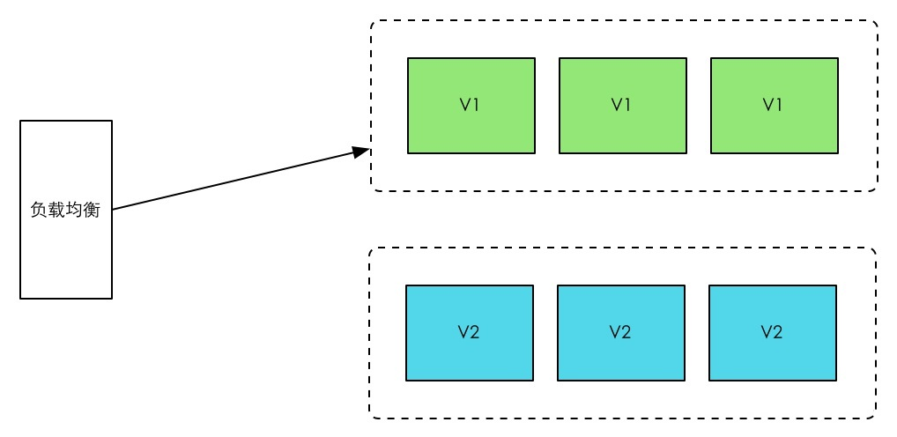
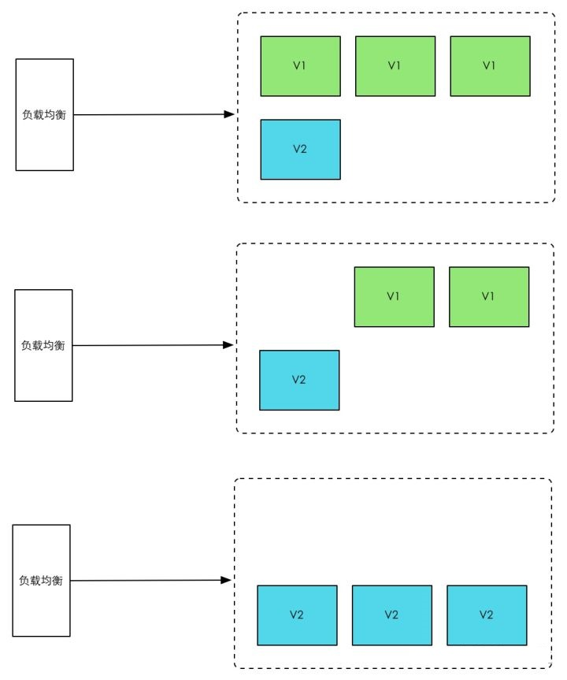
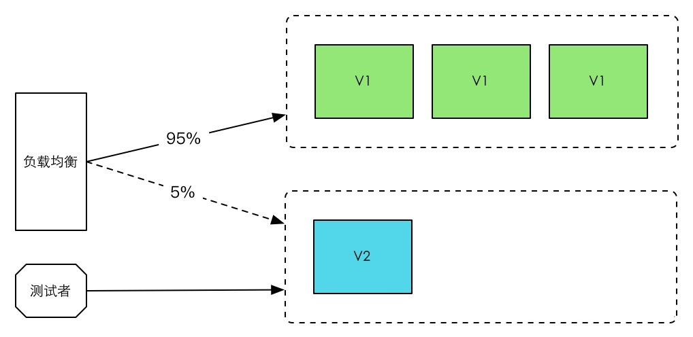

# 什么是蓝绿部署（Blue-Green Deployment），滚动更新，金丝雀发布（Canary Deployment） 灰度发布，AB测试？

在一般情况下，升级服务器端应用，需要将应用源码或程序包上传到服务器，然后停止掉老版本服务，再启动新版本。但是这种简单的发布方式存在两个问题，一方面，在新版本升级过程中，服务是暂时中断的，另一方面，如果新版本有BUG，升级失败，回滚起来也非常麻烦，容易造成更长时间的服务不可用。

为了解决这些问题，人们研究出了多种发布策略，下面我们一一介绍

## 蓝绿部署（Blue-Green Deployment）

所谓蓝绿部署，是指同时运行两个版本的应用，如上图所示，蓝绿部署的时候，并不停止掉老版本，而是直接部署一套新版本，等新版本运行起来后，再将流量切换到新版本上。但是蓝绿部署要求在升级过程中，同时运行两套程序，对硬件的要求就是日常所需的二倍，比如日常运行时，需要10台服务器支撑业务，那么使用蓝绿部署，你就需要购置20台服务器。

## 滚动更新

滚动发布能够解决掉蓝绿部署时对硬件要求增倍的问题。

所谓滚动升级，就是在升级过程中，并不一下子启动所有新版本，是先启动1台新版本，再停止1台老版本，然后再启动1台新版本，再停止1台老版本，直到升级完成，这样的话，如果日常需要10台服务器，那么升级过程中也就只需要11台就行了。

但是滚动升级有一个问题，在开始滚动升级后，流量会直接流向已经启动起来的新版本，但是这个时候，新版本是不一定可用的，可能需要进一步的测试才能确认是否真正可用。那么在滚动升级期间，整个系统就处于非常不稳定的状态，如果发现了问题，也难以确定是新版本还是老版本造成的问题。

为了解决这个问题，我们需要为滚动升级实现流量控制能力。

## 金丝雀发布（Canary Deployment）/ 灰度发布

金丝雀发布也叫灰度发布，起源是，矿井工人发现，金丝雀对瓦斯气体很敏感，矿工会在下井之前，先放一只金丝雀到井中，如果金丝雀不叫了，就代表瓦斯浓度高。

在灰度发布开始后，先启动一个新版本应用，但是并不直接将流量切过来，而是测试人员对新版本进行线上测试，启动的这个新版本应用，就是我们的金丝雀。如果没有问题，那么可以将少量的用户流量导入到新版本上，然后再对新版本做运行状态观察，收集各种运行时数据，如果此时对新旧版本做各种数据对比，就是所谓的**A/B测试**。

当确认新版本运行良好后，再逐步将更多的流量导入到新版本上，在此期间，还可以不断地调整新旧两个版本的运行的服务器副本数量，以使得新版本能够承受越来越大的流量压力。直到将100%的流量都切换到新版本上，最后关闭剩下的老版本服务，完成金丝雀发布/灰度发布。

如果在金丝雀发布/灰度发布过程中（灰度期）发现了新版本有问题，就应该立即将流量切回老版本上，这样，就会将负面影响控制在最小范围内。

## AB测试

AB测试一般有 2 个目的：

1. 判断哪个更好：例如，有 2 个 UI 设计，究竟是 A 更好一些，还是 B 更好一些，我们需要用户测试判定。
2. 计算收益：例如，最近新上线了一个直播功能，那么直播功能究竟给平台带了来多少额外的 DAU，多少额外的使用时长，多少直播以外的视频观看时长等

我们一般比较熟知的是上述第 1 个目的，对于第 2 个目的，**对于收益的量化，计算 ROI，往往对数据分析师和管理者非常重要**。

对于一般的 AB测试，其实本质上就是把平台的流量均匀分为几个组，每个组添加不同的策略，然后根据这几个组的用户数据指标，例如：留存、人均观看时长、基础互动率等等核心指标，最终选择一个最好的组上线。

> 参考资料：
>
> https://zhuanlan.zhihu.com/p/42671353
>
> https://www.zhihu.com/question/20045543