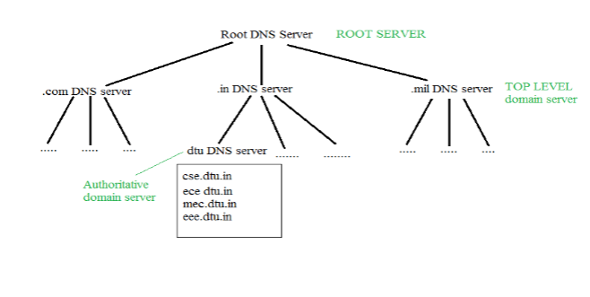

# Kubernetes服务与网络

## 1. Kubernetes 网络模型

### VirtualBox 网络模式

在开始将 Kubernetes 集群的网络方案之前，我们先看看，如果我们在自己的笔记本电脑上搭一套Kubernetes集群，我们将如何选择 VirtualBox 的网络模式。

VirtualBox 主要有以下几种网络模式，我们分别对它们进行介绍：

1. 网络地址转换（NAT） / Network Address Translation (NAT)
2. NAT 网络 / NAT Network
3. 桥接网卡 / Bridged Networking
4. 内部网络 / Internal Networking
5. 仅主机（Host-only）网络 / Host-only Networking

#### 网络地址转换（NAT） / Network Address Translation (NAT)

##### 网络地址转换（NAT）是如果工作的？

IP 地址分为 “公网地址” 和 “私有地址”。公网地址有 IANA 统一分配，用于连接互联网；而私有地址可以自由分配，用于私有网络内部通信。

随着互联网用户的快速增长，2019 年 11 月 25 日全球的公网 IPv4 地址已耗尽。我们可以使用 NAT（ Network Address Translation ）技术解决 IPv4 地址不够用的问题。

NAT 技术是将私有地址转换成公网地址，使私有网络中的主机可以通过少量公网地址访问互联网。但 NAT只是一种过渡技术，从根本上解决问题，是采用支持更大地址空间的下一代 IP 技术，即 IPv6 协议，它提供了几乎用不完的地址空间。

###### NAT 技术

IP 地址中预留了 3 个私有地址网段，在私有网络内，可以任意使用。


其余的 IP 地址可以在互联网上使用，由 IANA 统一管理，称为公网地址。


NAT 解决了 IPv4 地址不够用的问题，另外 NAT 屏蔽了私网用户真实地址，提高了私网用户的安全性。

典型的 NAT 组网模型，网络通常是被划分为私网和公网两部分，各自使用独立的地址空间。私网使用私有地址 10.0.0.0/24 ，而公网使用公网地址。为了让主机 A 和 B 访问互联网上的服务器 Server ，需要在网络边界部署一台 NAT 设备用于执行地址转换。NAT 设备通常是路由器或者防火墙。

例如下图，位于局域网内的机器 `10.7.86.2` 尝试 `ping 14.215.177.39`，`14.215.177.39`是位于公网的一台服务器。首先请求将经过路由器，通过 NAT 技术，将源 IP `10.7.86.2` 转换成路由器的公网 IP `14.215.177.121`， 请求最终到达目标地址 `14.215.177.39`。对于服务器 `14.215.177.39` 来说，它认为是 `14.215.177.121` 这个 IP 地址在访问它，服务器对私网IP地址没有任何感知。


那么当使用网络地址转换 Network Address Translation (NAT) 来创建虚拟机时，各台虚拟机的网络拓扑可以参见下图： 

> 注意，每台虚拟机的 IP 地址跟宿主机的 IP 地址不在相同的子网下。


例如，我们创建了3台虚拟机（Client OS），`10.0.2.15` 作为默认的 IP 地址被分配给3台虚拟机，默认的网关IP地址为 `10.0.2.2`，缺省网段为 `10.0.2.0/24`。

如果宿主机（HostOS）可以访问 Internet，那么虚拟机（Client OS）也可以访问 Internet。从物理网络的角度来看，所有实际来自不同虚拟机（Client OS）的数据包都来自于 Vbox 进程。如果，任何来自物理网络的用户（网络上的其他机器）需要访问某台虚拟机（Client OS），可以在VirtualBox软件上配置 “端口转发”。

更多关于如何配置 “端口转发”， 可以参考 [How to Configure Port Forwarding in VirtualBox](https://www.howtogeek.com/122641/how-to-forward-ports-to-a-virtual-machine-and-use-it-as-a-server/)


#### NAT 网络 / NAT Network

在 NAT 网络模式下，VBox上的所有虚拟机共享同一个 NAT 路由器。就像我们家里用的 wifi 路由器一样。

“网络地址转换 / Network Address Translation (NAT)” 和 “NAT 网络 / NAT NetworkNAT Network” 的关键区别在于，在“NAT 网络 / NAT NetworkNAT Network”中，所以虚拟机共享相同的路由器和网关。


#### 桥接网络 / Bridged Networking

在桥接网络模式下，虚拟机和宿主机在同一网段中进行桥接。换句话说，虚拟机直接连接到物理网络。如果有DHCP服务器，虚拟机会自动获取IP地址。理论上讲，在桥接模式下，无论是虚拟机还是VBox本身都可以为网络提供DHCP服务，但这很可能会导致不可预知的 IP 冲突，所以不建议这么做。


#### 内部网络 / Internal Networking

假设我们在开发网络应用程序，我们不可避免地要捕获网络数据包进行调试或者测试。大多数时候，工程师可能更喜欢桥接模式。有时选择内部网络模式其实更好。例如，如果数据包会影响到物理网络，我们应该在宿主机上防止这种情况的发生。或者，如果我们想排除不必要的数据包的干扰，以简化调试的分析过程。这时，我们可能需要一个被隔离的内部网络，如下图所示：


我们可以在其中一台虚拟机上配置 DHCP 服务。也可以直接为各个虚拟机分配静态 IP 地址。


#### 仅主机（Host-only）网络 / Host-only Networking

在仅主机（Host-only）网络模式下，就像内部网络模式一样，唯一的区别是宿主机也被添加到内部网络中。但 guest 虚拟机依然无法访问外网。


### VirtualBox 网络模式的使用

根据上文对各个 VirtualBox 网络模式的介绍，我们大致可以总结出下表：

| 网络模式                                                | 解释                                                         |
| :------------------------------------------------------ | :----------------------------------------------------------- |
| 网络地址转换（NAT） / Network Address Translation (NAT) | NAT 协议通过具有公网 ip 的 host 主机作为代理， 实现了无公网 ip 的 guest 虚拟机的互联网访问需求。但 guest 虚拟机之间无法相互通信。 |
| NAT 网络 / NAT Network                                  | 本质上也是 NAT，不同的是这种模式下共享相同的路由器和网关。   |
| 桥接网卡 / Bridged Networking                           | guest 虚拟机之间可以相互通信，host 主机也可以与 guest 虚拟机进行通信。同时虚拟机也可以访问外网。但一般需要依赖于 host 主机所在的物理局域网的 DHCP 服务器自动分配一个 ip地址。 |
| 内部网络 / Internal Networking                          | guest 虚拟机之间可以相互通信，但 host 主机无法与 guest 虚拟机进行通信。guest 虚拟机也无法访问外网。 |
| 仅主机（Host-only）网络 / Host-only Networking          | guest 虚拟机之间可以相互通信，host 主机也可以与 guest 虚拟机进行通信。但虚拟机无法访问外网。 |

同时，我们可以列出为了搭建 Kubernetes 集群，需要满足的网络条件如下：

1. 虚拟机之间可以相互通信；
2. 宿主机可以访问虚拟机，方便使用像 Xshell 这种SSH客户端工具；
3. 虚拟机可以访问外网，比如拉取容器镜像。

根据要求，我们可以为每台虚拟机指定两张网卡，选择 “网络地址转换（NAT） / Network Address Translation (NAT)” + “仅主机（Host-only）网络 / Host-only Networking” 的方式组建 Kubernetes 集群。

1. “网络地址转换（NAT） / Network Address Translation (NAT)” 网卡满足虚拟机访问外网的需求；
2. “仅主机（Host-only）网络 / Host-only Networking”  网卡满足虚拟机之间可以相互通信，同时 host 主机也可以与 虚拟机进行通信。

大家可能也注意到，如果我使用 “桥接网卡 / Bridged Networking”可以一下子同时满足3个要求。的确如此。但选用 “桥接网卡 / Bridged Networking” 的劣势在于虚拟机的 IP 地址需要由宿主机所在的物理网络的 DHCP 服务器分配。假设，我在家里搭建好了 Kubernetes 集群，我家的路由器给虚拟机分配的 IP 地址是 `192.168.0.x/24`。我现在到星巴克，想把 Kubernetes 集群启动起来，发现无法启动，这里有两个可能的原因：

1. 星巴克的路由器不给我的虚拟机分配 IP 地址，需要手机登录一下才能上网；
2. 星巴克的路由器分配的 IP 地址可能不是 `192.168.0.x/24`。一般来讲，Kubernetes 集群都会使用静态 IP 地址连接集群网络。

> 参考资料：
>
> https://rqsir.github.io/2019/05/23/VirtualBox-%E7%BD%91%E7%BB%9C%E6%A8%A1%E5%BC%8F%E6%80%BB%E7%BB%93/
>
> https://totozhang.github.io/2015-12-24-network-topology-in-virtualbox/


### Kubernetes 网络模型 / Kubernetes Network Model

接下来我们讲讲 Kubernetes 的网络，网络是 Kubernetes 的核心部分，但要确切地理解它是如何工作的，还是蛮有挑战性的。

大家想必也都使用过 Kubernetes，在使用的过程中，我想肯定遇到过很多的问题，这些问题大都可能跟网络相关。至少我是这样子的，我遇到过很多跟网络相关的问题，同时，我也花了很多时间来弄清楚，Kubernetes网络它到底是如何工作的。

每个Kubernetes节点，无论是 Master 节点还是 Worker 节点，其实都是一台Linux机器（VM或Bare Metal），它有一个网络命名空间(netns)，其中有一个网络接口作为它的主接口。例如下图中的 `eth0`，就是一台 Linux 机器对外的网络接口。

> eth 是 ethernet 的简写，是“以太网”的意思。如何理解以太网接口？我们可以简单的认为以太网接口就是笔记本电脑的网口，可以连接网线，一端接在笔记本电脑，一端接在在路由器上。
>
> veth 代表 virtual ethernet devices，即虚拟以太网设备。作为各个网络命名空间之间的隧道，构建起网络从一个网络命名空间到另一个网络命名空间的桥梁。
>
> 每一个以太网网络设备都是成对出现的，以达到联通的目的。


我们仔细看上图，可以看到每个Pod也有自己的eth接口，这意味着每个Pod都有自己的网络配置，例如IP地址，路由等。这也意味着每个Pod有自己的网络命名空间，通过eth接口，将各个分隔的网络命名空间连接起来。

我们可以拿生活中的一些事情作为对比，举个例子来说。

假设你和你的同事去上海参加一个会议。你们公司将你和你同事安排在同一家酒店入住。假设这是一家度假型酒店，有很多幢楼，我们可以把每一幢楼想象成一个 Kubernetes节点，而整个酒店就是一个 Kubernetes 集群。

每幢楼里面有多个房间，你和你同事被安排在不同的房间里，每个房间都会配备一台客房电话，这个时候，我们就可以把房间想象成一个 Pod，而客房电话就是一个网络接口，你可以通过电话跟外界沟通。

如果这个时候，你用客房电话与不在酒店的家人联系。你的电话将一层一层，最后通过 `eth0` 这个网络设备将电话打出去，`eth0` 就相当于整个酒店的电话总机。

现在，你跟家人打完电话了，你想约同事出去吃饭了，你想节省一点钱，不用自己的手机打电话，依然使用房间里的客房电话。在酒店登记入住时，前台告诉你说，你可以通过简单的输入房间号码给对方打电话，从一个房间打到另一个房间。酒店有一个内部中央设备允许这种交流发生。这类似于上图中 `cni0` 所扮演的角色，构建起 Pod-to-Pod 之间的网络通信。

碰巧这家酒店有多幢楼，你和你的同事被安排在不同的楼里。不过，前台同时也说过，如果你们在不同的楼里，只需要在房间号前面加上楼号就可以了，比如：`#<building number><room number>`。

酒店的内部中央设备  `cni0`  会注意到这个地址不是当前楼内的房间号。将电话重定向给 `eth0`，`eth0` 在将电话重定向给另外一幢楼，即另一个Kubernetes节点。

刚刚举的例子，大致就是：

- 当两个 Pod 在同一个节点上时，他们是如何通信的？
- 当两个 Pod 不在同一个节点上时，他们是如何通信的？


### Kubernetes集群网络方案 -- Flannel


对于 Kubernetes 来说，Pod 是最小的可调度单元，一个Pod内的所有容器共享同一个网络命名空间，这意味着一个Pod内的所有容器共享同一个网络接口，并且可以通过 `localhost` 相互连接。

并且 Kubernetes 并没有实现自己默认的网络模型，只是对网络模型提出了规范，其实这个规范就是 CNI，Container Networking Interface。交由社区来实现自己的 CNI 插件。目前，社区上有很多种不同的 CNI 插件，flannel 可能是其中最简单的一种。接下来，我们就以 flannel 为例，来了解 Kubernetes 网络模型。

Kubernetes 官网对 CNI 插件提出了以下这些规范：

- Pod 之间不使用网络地址转换（NAT）就能互相通信；
- Kubernetes集群的各个节点，这些节点可能是虚拟的，也可能是物理机，这些节点之间的通信，也不需要经过网络地址转换（NAT）就能互相通信；
- Pod 看到的自己的IP地址应该跟其他Pod看到的IP地址是一样的。

同时 CNI 插件还负责将网络接口插入到容器的网络命名空间中，例如 `veth pair` 对的一端，并对主机进行必要的更改，例如，将 `veth pair` 对的另一端连接到桥接器中（bridge）。

然后为容器（Pod）分配 IP 地址，并通过调用 IPAM （*IP Address Management*）插件创建对应的路由规则。


#### 覆盖网络 / The Overlay Network

Flannel是由CoreOS为Kubernetes网络创建的。但 Flannel 同时也可以作为一款通用软件，在某些场景下，作为一个通用的网络解决方案使用。

为了实现 Kubernetes 的网络模型，flannel 的想法其实很简单，创建另一个运行在主机网络之上的扁平网络（flat network），这就是所谓的覆盖网络（Overlay Network）。在这个覆盖网络中，所有的 Pod 将被分配一个ip地址，它们通过直接调用彼此的ip地址相互通信。

我们可以参见下图中的红框部分就是覆盖网络（Overlay Network）。


**Host network：**所有的VM都在 `172.20.32.0/19` 这个子网下，在此子网下，每台 VM 都会被分配一个 IP 地址，因为所有的 VM 在同一个局域网（LAN）下，所以 VM 之间可以互相通信。

**Flannel overlay network：**Flannel 创建了另一个子网 `100.96.0.0/16`，它是一个更大的网络，可以容纳 2¹⁶(65536) 个 IP 地址，跨越所有的 Kubernetes节点，每个 Pod 将在这个子网内分配一个 IP 地址。

**In-Host docker network：**在每台 VM 内部，Flannel 为每台 VM 分配一个子网 `100.96.x.0/24`，此子网被包含在  `100.96.0.0/16` 子网之内。子网 `100.96.x.0/24` 可以保存 2⁸(256) 个 IP 地址。docker bridge interface `docker0` 就会使用 `100.96.x.0/24` 这个子网来创建新的容器网络空间。

通过这种设计，每个 Pod 都有自己的 IP 地址，都属于覆盖子网 `100.96.0.0/16`。同一个节点内的 Pod 可以通过docker bridge interface `docker0` 相互通信。


##### 同一个节点内 Pod 的通信 / Routing traffic on the same hos


**Pod 4 如何与 Pod 6 建立通信：**

1. 包通过 `eth4` 接口离开 Pod 4 的网络命名空间，然后到达虚拟接口 `veth4` ，最终到达 `cni0`；
2. 包到达 `cni0` 后，在 `cni0` 中寻找Pod 6的地址；
3. 包离开  `cni0` 并被重定向到 `veth6`；
4. 包通过 `veth6`接口到达 Pod 6 的网络命名空间。


##### 不同节点之间 Pod 的通信 / Routing traffic across different hosts


**Pod 1 如何与 Pod 6 建立通信：**

1. 包通过 `eth1` 接口离开 Pod 1 的网络命名空间，然后到达虚拟接口 `veth1` ，最终到达 `cni0`；

2. 包到达 `cni0` 后，在 `cni0` 中寻找Pod 6的地址。但是没找到，发现这是一个非本机的ip地址，然后将包重定向给 `eth0`；

3. 包离开Master 1节点的 `eth0` 并到达网关。网关发现这个包的目的地址属于 Worker 1 节点，将包重定向给 Worker 1 节点的 `eth0` 接口。

4. 包离开 `eth0` 到达 `cni0`，在 `cni0` 中寻找Pod 6的地址，找到了;

5. 包离开 `cni0`，并被重定向到 `veth6` 虚拟接口;

6. 包通过 `veth6`接口到达 Pod 6 的网络命名空间。

   

接下来让我们看另外一张图，更详细的理解"不同节点之间 Pod 的通信"。


假设节点 Node 1 中的容器 container-1 被分配了一个 IP 地址 `100.96.1.2`，并且 container-1 想要连接到节点 Node-2 中 IP 地址为`100.96.2.3`的容器 container-2，我们来看看数据包在覆盖网络 Overlay Network 中是如何流转的。

首先，容器 container-1 将创建一个 IP 数据包 （IP packet），`src: 100.96.1.2 -> dst: 100.96.2.3`。此IP数据包将被发往网关 docker0 bridge。

在每台主机，或者说虚拟机 VM 上，flannel 作为一个守护进程运行，叫做 `flanneld`，`flanneld` 会在 Linux 内核的路由表中创建一些路由规则，下面是节点 Node-1 的路由表：

```shell
admin@ip-172-20-33-102:~$ ip route
default via 172.20.32.1 dev eth0
100.96.0.0/16 dev flannel0  proto kernel  scope link  src 100.96.1.0  # 匹配到这条规则
100.96.1.0/24 dev docker0  proto kernel  scope link  src 100.96.1.1
172.20.32.0/19 dev eth0  proto kernel  scope link  src 172.20.33.102
```

通过查看路由表，我们可以得出，因为 IP 数据包的目的地址是`100.96.2.3`，落在了 `100.96.0.0/16` 这个子网内，所以它匹配到了第二条规则，现在内核知道应该将此数据包发送给 `flannel0` 这个设备。

当内核将数据包发送给 `flannel0` 之后，也相当于将数据包发送给了守护进程 `flanneld`。我们可以从图中看出目的地址 `100.96.2.3` 属于容器 container-2，并且此容器运行在节点 Node-2 上。但是 `flanneld` 怎么知道呢？

Flannel 已经提前将一些信息存储在 etcd 数据库中，etcd 是一个高可用的分布式键值(key-value)数据库。Flannel 将子网与主机的映射关系提前存储到 了 etcd 数据库中，我们可以通过 `etcdctl` 命令来查看子网与主机的映射关系：

```shell
admin@ip-172-20-33-102:~$ etcdctl ls /coreos.com/network/subnets
/coreos.com/network/subnets/100.96.1.0-24
/coreos.com/network/subnets/100.96.2.0-24
/coreos.com/network/subnets/100.96.3.0-24
admin@ip-172-20-33-102:~$ etcdctl get /coreos.com/network/subnets/100.96.2.0-24
{"PublicIP":"172.20.54.98"}
```

因此 `flanneld` 守护进程查询 etcd 获取所有的子网信息，比如上图，我们可以看到3个子网，分别是 `100.96.1.0/24`，`100.96.2.0/24` 和 `100.96.3.0/24`。

然后根据数据包的目的地址 `100.96.2.3` 可知，此 IP 地址属于子网 `100.96.2.0/24`。最后根据子网查询到对应的主机 IP 地址， 即`172.20.54.98`。

现在 `flanneld` 知道了目的地址在节点 Node-2 上，`flanneld`  将原始 IP 数据包再次封装，加上自己的主机 IP 地址，即`172.20.33.102`，和节点 Node-2 的主机 IP地址。将自己的主机 IP 地址作为源地址，目标主机（Node-2）的 IP 地址作为目的地址，重新封装成一个UDP包。因为在每个节点上，`flanneld` 守护进程都监听一个默认的UDP端口 `:8285`。因此，`flanneld`  会将 UDP 包的目的端口设置为8285，并通过 `eth0` 设备将 UDP 包发送出去。

当 UDP 包到达目的主机后，因为 `flanneld` 守护进程监听 UDP 端口 `:8285`，Linux 内核在收到数据包后，将把此 UDP 包发送给 `flanneld` 。然后 `flanneld`  会解包获得 UDP 数据包的有效载荷，即由容器 container-1 创建的原始 IP 数据包。

和节点 Node-1 一样，节点 Node-2 上也存在路由表，将决定 IP 数据包的去向，让我们看看节点 Node-2 上的路由表：

```shell
admin@ip-172-20-54-98:~$ ip route
default via 172.20.32.1 dev eth0
100.96.0.0/16 dev flannel0  proto kernel  scope link  src 100.96.2.0
100.96.2.0/24 dev docker0  proto kernel  scope link  src 100.96.2.1     # 匹配到这条规则
172.20.32.0/19 dev eth0  proto kernel  scope link  src 172.20.54.98
```

IP 数据包的目的地址为 `100.96.2.3`，虽然第二（`100.96.0.0/16`）和第三（`100.96.2.0/24`）条规则都可以匹配目的地址 `100.96.2.3`，但内核会采用最精确的匹配，所以只会匹配第三条规则。该 IP 数据包将被发送到 `docker0` 设备。由于 `docker0` 是一个桥接设备，或者说是网关，节点 Node-2 上的所有容器都会连接到这个桥接设备上，因此 `docker0` 知道本机所有容器的 IP 地址，最终此 IP 数据包被发送给容器 container-2。

上面我们只是看到了 IP 数据包从容器 container-1 到 容器 container-2 的单向传递。当 container-2 将 IP 数据包发送回 container-1 时，反向路径将以完全相同的方式工作。这就是不同节点之间 Pod 通信的工作方式。

##### Flannel 后端通信模式 -  VXLAN，UDP，host-gw

刚刚我们以 Flannel 为例，描述了“同一个节点内 Pod 的通信”和“不同节点之间 Pod 的通信”。在不同节点之间进行通信时，Flannel 提供了 三种方式，分别是 VXLAN，UDP 和 host-gw。刚刚我们举的例子，是基于 UDP 的。

那 VXLAN，UDP 和 host-gw 各自代表什么含义？又有什么区别呢？推荐使用哪个？

Flannel 是基于三层网络实现，即“网络层”。

> 网络层：网络层是比数据链路层更高一级的逻辑层，在这一层工作的主要是路由器，路由器是基于IP地址进行跨网链路的；


###### 基于 UDP 的跨主通信模式


我们在来看一下基于 UDP 的跨主通信模式，Container1的请求经过多层路由，最终到达Container2，这就是三层网络实现方式。但是这里面有一个非常严重的问题，就是`flanneld` 在对 UDP 进行封包解包是运行在用户态的，而数据的传递是在内核态完成，这就造成了为了传递数据，需要在内核态和用户态之间进行频繁的切换，这个切换过程是以一定的性能损耗为代价的。所以在新版本的 Flannel 中，已经不建议在生产环境中使用 UDP 模式，它应该只用于调试和测试目的。

`flannel0` 是一个 TUN 设备，提供了一种通过内核接收和发送数据包的简单方法，但是 TUN 有一个性能损失，数据包必须在用户空间和内核空间之间来回复制。


从上图可以看出，从最初的容器进程发送数据包，它必须在用户空间和内核空间之间复制3次，这将大大增加网络开销，所以你应该避免在生产环境中使用 UDP 模式。

> **什么是 TUN 设备？**
>
> `flannel0` 是一个TUN设备（a TUN device），是由 `flanneld` 守护进程创建的，TUN 是一个在 Linux内核中实现的软件接口，它可以在用户态和内核态之间传递原始 IP 数据包。对于传递 IP 数据包，它有两个方向：
>
> - 当向 `flannel0` 设备写入 IP 数据包时，该数据包将被直接发送到内核态中，内核将根据路由表对该 IP 数据包进行路由；
> - 当一个 IP 数据包到达内核态，并且路由表说，你应该被路由到 `flannel0` 设备，内核将把这个数据包直接发送给创建 `flannel0` 设备的进程，也就是 `flanneld` 守护进程


###### 基于 VXLAN 的跨主通信模式


我们第一眼看上去，“基于 VXLAN 的跨主通信模式”好像和“基于 UDP 的跨主通信模式”没什么区别。其实他们的主要区别在于，对 UDP 包的封包解包，由谁来封包解包。

`VXLAN`即 Virtual Extension LAN 虚拟可扩展局域网，是Linux 内核所支持的一种技术，`VXLAN` 支持完全在内核态完成封包和解包的过程。本质上`VXLAN`是一种隧道技术，通过将虚拟网络中的数据帧封装在实际物理网络中的报文中进行传输。具体实现方式为：将虚拟网络的数据帧添加 `VXLAN` 首部后，封装在物理网络中的 `UDP` 报文中，然后以传统网络的通信方式传送该 `UDP` 报文，到达目的主机后，去掉物理网络报文的头部信息以及 `VXLAN` 首部，将报文交付给目的终端。


图中两台主机T1和T2位于不同的网络中，二者通过路由器来实现互通，而通过 `VXLAN` 可以使得这两台主机在 “逻辑上” 位于同一个网络链路层中。

而与两台主机直接相连的路由器，也在逻辑上构建起了一条在虚拟链路中的通道 `vxlan tunnel`，这样的路由器我们称之为 `vxlan` 隧道终端 （VXLAN Tunnel End Point, **VTEP**）。

> Linux 从内核 3.7 版本开始支持 VXLAN，到 3.12 版本，基本已经完备。


我们在来看一下，“基于 VXLAN 的跨主通信模式”时的一个大致过程：

- 发送端：在Pod A中发起 `ping 10.244.1.21` ，`ICMP` 报文经过 `cni0` 网桥后交由 `flannel.1` 设备处理。 `flannel.1` 设备是一个`VXLAN` 类型的设备，负责封包解包。 因此，在发送端，`flannel.1` 将原始链路层的报文封装成 VXLAN UDP 报文，然后从 `eth0` 发送出去。
- 接收端：Node2收到UDP报文，发现是一个 `VXLAN` 类型的报文，交由 `flannel.1` 进行解包。根据解包后得到的原始报文中的目的IP 地址，将原始报文经由 `cni0` 网桥发送给Pod B。


一般情况下，推荐使用 `VXLAN`。

你可以通过查看官网的 [**`kube-flannel.yml`**](https://github.com/coreos/flannel/blob/master/Documentation/kube-flannel.yml)，在net-conf.json的定义中，查看当前 Flannel 使用的后端转发方式。下图中为：vxlan。

```yaml
kind: ConfigMap
apiVersion: v1
metadata:
  name: kube-flannel-cfg
  namespace: kube-system
  labels:
    tier: node
    app: flannel
data:
  cni-conf.json: |
    {
      "name": "cbr0",
      "plugins": [
        {
          "type": "flannel",
          "delegate": {
            "hairpinMode": true,
            "isDefaultGateway": true
          }
        },
        {
          "type": "portmap",
          "capabilities": {
            "portMappings": true
          }
        }
      ]
    }
  net-conf.json: |
    {
      "Network": "10.244.0.0/16",
      "Backend": {
        "Type": "vxlan"
      }
    }
```

###### 基于 host-gw 的跨主通信模式

在上述的 `VXLAN` 的示例中，Node1 和 Node2 其实是在同一个子网下的，通过桥接模式连接的的两台虚拟机，也就是说它们在同一个二层网络中（网络链路层）。在二层网络互通的情况下，直接配置节点的三层路由（网络层，基于IP地址进行路由）即可互通，不需要使用 `VXLAN` 隧道。要使用 `host-gw` 模式，需要修改 ConfigMap `kube-flannel-cfg` ，将 `Backend.Type` 从 `vxlan` 改为 `host-gw`，然后重启所有 kube-flannel Pod。


在 `host-gw` 模式下，由于不涉及 `VXLAN` 的封包解包，所以不再需要 `flannel.1` 虚拟网卡。 `flanneld` 负责为各节点设置路由，将对应节点Pod子网的下一跳地址指向对应节点的 IP 地址，如图中路由表所示。

由于没有封包解包带来的消耗，`host-gw` 是性能最好的。不过一般在云环境下，都不支持使用 `host-gw` 模式。对于比较有网络经验的用户来说，在条件允许的情况下，比如在私有化部署的场景下，可以考虑使用 `host-gw`。

> 参考资料：
>
> flannel跨主网络通信方案（UDP、VXLAN、HOST-GW）详解 https://cloud.tencent.com/developer/article/1651126
>
> Flannel的两种模式解析（VXLAN、host-gw)  by 水立方 - https://juejin.cn/post/6994825163757846565
>
> https://github.com/coreos/flannel/blob/master/Documentation/backends.md
>
> Kubernetes: Flannel networking https://blog.laputa.io/kubernetes-flannel-networking-6a1cb1f8ec7c
>
> https://mvallim.github.io/kubernetes-under-the-hood/documentation/kube-flannel.html
>
> 二层网络三层网络理解 https://www.jianshu.com/p/a540c16f5b5c

> 扩展阅读：
>
> [Kubernetes Pod 如何获取 IP 地址](https://mp.weixin.qq.com/s/mnDpXuj2xyrr8FZq5xHGNA)


## 2. 容器网络接口（CNI）

> 本章重点：
>
> 1.  常见 CNI 介绍
> 2. 常见 CNI 的基准测试
> 3. 常见CNI 适用场景

在 Kubernetes 中，CNI 代表 Container Network Interface，即 “容器网络接口"。CNI 属于 ”云原生云计算基金会 / Cloud Native Computing Foundation (CNCF) “ 的一个项目。

当人们讨论 CNI 的时候，一般指的都是参考 CNI 规范实现的具体的 CNI 插件 / CNI plugin。CNI 和 CNI 插件之间的关系是，CNI 插件

是根据 CNI 规范实现的可执行二进制文件。在 “Kubernetes 网络模型” 章节，我们已经谈到过，Kubernetes 官网对 CNI 插件的一些规范，我们再来看一下：

- Pod 之间不使用网络地址转换（NAT）就能互相通信；
- Kubernetes集群的各个节点，这些节点可能是虚拟的，也可能是物理机，这些节点之间的通信，也不需要经过网络地址转换（NAT）就能互相通信；
- Pod 看到的自己的IP地址应该跟其他Pod看到的IP地址是一样的。

社区里也有很多 CNI 插件可供我们选择，比如，Calico, Cilium, WeaveNet 和 Flannel 等等。虽然 CNI 插件的实现不尽相同，但一般来说，CNI插件所做的事是相似的。他们执行下列任务：

- 管理/创建容器网络接口；
- 为 Pod 分配IP地址。这通常是通过调用 IP Address Management (IPAM) plugins  来完成的；
- 【可选】执行网络策略（network policies）。

在 CNI 规范中，是否实现网络策略是非强制要求。但是当我们（DevOps / DevSecOps）在选择使用哪个 CNI 插件时，安全性也是非常值得我们考虑，非常重要的一部分。Alexis Ducastel 在他的一篇文章 [Benchmark results of Kubernetes network plugins (CNI) over 10Gbit/s network (Updated: August 2020)](https://itnext.io/benchmark-results-of-kubernetes-network-plugins-cni-over-10gbit-s-network-updated-august-2020-6e1b757b9e49)中，对现有的（2020年8月前）主流 CNI 插件进行了一个很好的对比，我们可以重点关注一下安全方面的对比。

在文章中，主要对以下这些常见的 CNI 插件进行了对比：

- Antrea v.0.9.1 - from VMware Tanzu

- Calico v3.16

- Canal v3.16 (Flannel network + Calico Network Policies)

- Cilium 1.8.2

- Flannel 0.12.0

- Kube-router latest (2020–08–25)

- WeaveNet 2.7.0

- Kube-OVN - from alauda.io 灵雀云

  

### 网络策略 / Network Policies

上面列出的所有CNI 插件中，唯一不支持 Network Policy 只有Flannel，其他的 CNI 插件均能支持网络策略 / Network Policy，包括入站策略和出站策略。


### CNI Encryption

基于所有测试的 CNI 插件，以下 CNI 插件支持 CNI Encryption。

> **CNI Encryption：**CNI Encryption 主要基于 IPsec，当启用 IPsec 时，CNI 插件会将所有网络流量通过一条加密隧道进行通信。
>
> **IPSec（Internet Protocol Security）：**是一组基于网络层的，应用密码学的安全通信协议族。IPSec不是具体指哪个协议，而是一个开放的协议族。
>
> **IPSec协议的设计目标**：是在IPV4和IPV6环境中为网络层流量提供灵活的安全服务。

- Antrea with IPsec
- Calico with wireguard
- Cilium with IPsec
- WeaveNet with IPsec


### 总结

下表用一些主观的限定词，比如 “very fast”, “low” 来代替了实际的测试值。图表有一定的主观性，仅供各位参考，仅表达了作者 Alexis Ducastel 对结果的解释。


> 什么是 MTU？
>
> 在网络中，最大传输单元（MTU）指通过联网设备可以接收的最大数据包的值。可将 MTU 想象为高速公路隧道的高度限制：超过高度限制的汽车和卡车无法通过，就像超过网络 MTU 的数据包无法通过该网络一样。
>
> 不过，与汽车和卡车不同的是，超过 MTU 的数据包可被分解成较小的碎片，从而能通过网络。这个过程称为分片。分片的数据包在到达目的地后便会重新组装。
>
> MTU 以字节数为单位，一个“字节”等于 8 位信息，即 8 个一和零。1,500 字节是最大 MTU 大小。


接下来，我们对图表进行一些总结陈词：

**从性能角度来看**，除了 Kube-OVN 和 Kube-Router，其他所有的 CNI 插件都做得很好。

**从资源消耗的角度来看**，Cilium 比其他竞争对手使用更多的内存 RAM，但该公司宣传他们的 CNI 插件主要针对大规模 Kubernetes 集群，而我们测试只使用了 3 个 Kubernetes 节点，可能与在大规模 Kubernetes 集群下的基准测试情况并不完全相同。Kube-OVN 也消耗了大量的 RAM 和 cpu 资源，但 Kube-OVN 还是一个非常年轻的 CNI 插件，基于 Open vSwitch 实现的 CNI 插件。同样，Antrea 也是基于 Open vSwitch 实现的 CNI 插件，但在资源消耗方面，明显 Antrea 消耗更少资源，性能也更好。

**网络策略方面**，除了 Flannel，其他被测试的 CNI 插件都支持网络策略。并且 Flannel 可能永远不会实现网络策略，因为 Flannel 的目的是：越轻（简单）越好。

**CNI Encryption 方面**，Calico  是最老牌的 CNI 插件之一，但 Calico  直到最近（2020年）才提供加密服务。他们更喜欢使用 wireguard 而不是IPsec，不过的确 wireguard 的性能非常好，完全优于其他的 CNI 插件。当然，由于需要加密网络流量，这会消耗大量的CPU资源，但在带宽性能方面并没有太多下降，并且 Calico 的加密性能大约是第二名的 Cilium 的 6 倍。此外，在集群上部署 Calico 之后，我们可以在任何时候启用或者禁用 wireguard 加密。

不过，值得注意的是，Cilium 能够加密节点到节点的流量，而不仅仅是 Pod 之间的流量。这对于面向公众的集群节点来说，可能是一个非常有吸引力的特性。

最后，基于以上几点，以下是我对不同场景下的用例建议:

- 我需要搭建一个小规模的 Kubernetes 集群，比如 3 个 节点的 Kubernetes 集群，我也不关心安全。那就用 **Flannel**，这是一款最轻最稳定的CNI 插件，同时它也是最老牌的 CNI 插件之一。
- 我需要搭建一个标准的 Kubernetes 集群，不大于 50 个节点（ Sysdig 在 2019 年度容器应用报告中得到的结果，大于 50 节点规模的集群不足 10%），Calico 是我们最好的选择，但不要忘记对 Calico 进行性能调优。使用 Calico，我们可以很方便地使用网络策略、启用/禁用 CNI Encryption 等。
- 我需要搭建一个大规模的 Kubernetes 集群，大于 50 个节点，当前的基准测试，并不是基于大规模 Kubernetes 集群的测试，我们也没有超大量的请求，比如每个节点10Gbit/s 的请求。所以最好的选择是，基于 **Calico** 和 **Cilium** 在大规模 Kubernetes 集群下，先做一轮基准测试，在真正决定使用哪个 CNI 插件，最好是基于自身的使用，定制化基准测试用例。

> 参考资料：
>
> https://itnext.io/benchmark-results-of-kubernetes-network-plugins-cni-over-10gbit-s-network-updated-august-2020-6e1b757b9e49
>
> https://blog.csdn.net/NEUChords/article/details/92968314
>
> https://docs.openshift.com/container-platform/4.7/networking/ovn_kubernetes_network_provider/about-ipsec-ovn.html
>
> https://blog.fleeto.us/post/someting-about-cluster-size/


## 3. 什么是 Service，以及 Endpoint？

### 什么是 Service？

Service是Kubernetes里最核心的资源对象之一，Service定义了一个服务的访问入口地址，前端的应用（Pod）通过这个入口地址访问其背后的一组由Pod副本组成的集群。 Service与其后端Pod副本集群之间则是通过Label Selector来实现链接的。

Service 解决了什么问题？在Kubernetes平台上，Pod是有生命周期，为了可以给客户端一个固定的访问地址，因此需要在客户端和Pod之间添加一个中间层，这个中间层称之为Service。

在Kubernetes中，每个节点都安装了kube-proxy，kube-proxy通过kubernetes中固有的watch请求方法持续监听apiserver。一旦有Service 资源发生变动，例如增删改查的操作，kube-proxy可以及时更新Service到后端Pod节点上的路由规则，这个规则可以是iptables也可以是ipvs，取决于Service实现方式。


### 什么是Endpoint？

Kubernetes在创建Service时，会根据标签选择器 Label Selector 来查找Pod，并创建与 Service 同名的 Endpoint 对象，当 Pod 地址发生变化时，Endpoint 也会随之发生变化，Service 在接收客户端请求的时候，就会通过 Endpoint 将请求转发给后端对应的 Pod，至于具体转发给哪个Pod，由负载均衡 kube-proxy 的路由规则决定。

```shell
# 查看 Endpoints 信息
$ kubectl get ep -n core
NAME                                      ENDPOINTS                                            AGE
aa-svc                                    172.16.0.9:8443                                      31h
alertmanager-operated                     172.16.0.59:9094,172.16.0.59:9094,172.16.0.59:9093   30h
```

1. Endpoint 是Kubernetes集群中的一个资源对象，存储在etcd中，用来记录一个 Service 对应的所有 Pod 的访问地址；
2. 只有当 Service 配置标签选择器 Label Selector，endpoint controller才会自动创建对应的 Endpoint 对象，否则，不会生成Endpoint 对象；
3. 在 Kubernetes 集群中创建一个叫 webapp 的 Service，就会生成一个同名的 Endpoint 对象，Endpoint 里存有 Service 关联 Pod 的ip地址和端口信息。


## 4. Service 工作模式

在介绍 Service 的各种工作模式之前，我们先介绍一下kube-proxy，什么是 kube-proxy？通过kube-proxy的名字，我们大概就可以猜到它是干什么的。一般来说，proxy 所做的是，帮助客户端转发请求至服务端。接受来自客户端的请求，转发至服务端。

### User space代理模式

在这种模式下，kube-proxy通过watch方法持续监听apiserver，以添加和删除Service和Endpoint对象。对于每个新创建的 Service，kube-proxy 都会负责在节点上随机打开一个端口（port），并创建对应的 iptables 规则。kube-proxy 将监听这个随机端口，当请求到达此随机端口时，kube-proxy 会通过 iptables 规则将此请求转发给后端的某个 Pod。

默认情况下，User space代理模式下的 kube-proxy 使用轮询方式，将请求转发到后端 Pod。在创建 Service 对象时，如果指定了 `SessionAffinity` 参数，kube-proxy 在转发请求时也会考虑此参数的配置。

我们看一下下面这张图，来理解一下 User space 代理模式下的请求流向。


简单来说，Pod A 请求 Svc A，请求先从用户空间进入到内核空间，iptables规则将请求转发给kube-proxy所监听的端口，然后再回到用户空间，由kube-proxy完成后端endpoint的选择和代理。这种模式的缺点是显而易见的，流量转发从用户空间进入到内核空间，又从内核空间回到了用户空间，这意味着多次的数据包封包解包。从性能角度来看，User space代理模式并不理想，效率低，有明显的性能瓶颈。但这是最早期 Kubernetes 使用的代理模式。

### iptables代理模式

在iptables代理模式下，不再由kube-proxy完成后端endpoint的选择和代理，而是由 netfilter 根据 iptables 规则来转发流量。在iptables 代理模式下，Kube-proxy 只负责维护并更新iptables规则。任何以Service IP为目标的流量，都会直接由 netfilter 将其转发到后端的 Pod。具体可以看一下下面这张图。


与 User space 代理模式相比，其优点在于，在 iptables代理模式下，流量从用户空间到达内核空间后，不再回到用户空间，而是直接在内核空间完成了流量转发。相比于 User space 代理模式，这样性能开销就低得多。但 iptables代理模式也存在缺点，假设 kube-proxy运行在 iptables代理模式下，如果第一个选择的 Pod 没有响应，连接将直接失败。然而，如果在 User space 代理模式下，kube-proxy 会检测到与第一个 Pod 的连接失败，然后自动重试与其他 Pod 的连接。

iptables代理模式是目前默认Kubernetes集群默认的方案，完全以内核iptables的nat方式实现Service负载均衡。该方式在大规模情况下存在一些性能问题；首先，iptables没有增量更新的功能，更新一条规则需要整体flush，更新时间长，这段时间之内，对流量会有不同程度的影响；此外，iptables规则串行匹配，流量需要经过所有规则的匹配后在进行转发，对时间和内存都是极大的消耗，尤其在大规模集群的情况下，对性能的影响十分明显。


### IPVS代理模式

当 kube-proxy 运行在 IPVS 代理模式下时，kube-proxy组件会管理和利用 IPVS 规则，将Service请求流量转发给后端的Pod。像iptables 规则一样，IPVS 规则也在内核空间中工作。IPVS 规则是建立在 netfilter 之上的。它作为 Linux 内核的一部分，实现了传输层的负载均衡，并且是 Linux Virtual Server (LVS)  的一部分。LVS 运行在宿主机上，可以充当服务器集群的负载均衡器。支持TCP和UDP协议，任何TCP或者UDP请求都可以通过 LVS 转发到集群中某台真实的服务器上。

下图解释了什么是 IPVS代理模式。


与 iptables 代理模式相比，IPVS规则和iptables规则都在内核空间中工作。但是，iptables规则是串行匹配的，规则越多，匹配所花的时间就越长。但是 IPVS 规则则不同，IPVS规则使用哈希表存储目的地址，当数据包到来时，根据数据包的目的地址，通过哈希表能快速查到对应的 IPVS 规则进行流量转发。与 iptables 规则相比，具有更低的延迟和更快的速度。同时 IPVS代理模式还提供更多的负载均衡选项。

不过，如果想使用 IPVS代理模式，需要 Linux 内核支持 IPVS。一般Linux内核版本2.4之后都支持 IPVS。

> ## Commands to find your Linux Kernel Version
>
> To check Linux Kernel version, try the following commands:
>
> 1. **uname -r** : Find Linux kernel version
> 2. **cat /proc/version** : Show Linux kernel version with help of a special file
> 3. **hostnamectl | grep Kernel** : For systemd based Linux distro you can use hotnamectl to display hostname and running Linux kernel version
>
> Reference:
>
> https://www.cyberciti.biz/faq/find-print-linux-unix-kernel-version/


**查看当前Kubernetes集群中，kube-proxy 使用的代理模式：**

可以使用命令：`kubectl get cm kube-proxy-cfg -n kube-system -o yaml`

```shell
$ kubectl get cm kube-proxy-cfg -n kube-system -o yaml
apiVersion: v1
data:
  config.conf: |-
    apiVersion: kubeproxy.config.k8s.io/v1alpha1
    kind: KubeProxyConfiguration
    mode: iptables                  # This Line.
    clusterCIDR: 172.16.0.0/16
    oomScoreAdj: -998
  shc-sma-cd74.hpeswlab.net: export KUBERNETES_SERVICE_HOST=shc-sma-cd74.hpeswlab.net
  shc-sma-cd75.hpeswlab.net: export KUBERNETES_SERVICE_HOST=shc-sma-cd74.hpeswlab.net
  shc-sma-cd76.hpeswlab.net: export KUBERNETES_SERVICE_HOST=shc-sma-cd74.hpeswlab.net
kind: ConfigMap
metadata:
  annotations:
    kubectl.kubernetes.io/last-applied-configuration: |
      {"apiVersion":"v1","data":{"config.conf":"apiVersion: kubeproxy.config.k8s.io/v1alpha1\nkind: KubeProxyConfiguration\nmode: iptables\nclusterCIDR: 172.16.0.0/16\noomScoreAdj: -998"},"kind":"ConfigMap","metadata":{"annotations":{},"labels":{"k8s-app":"kube-proxy"},"name":"kube-proxy-cfg","namespace":"kube-system"}}
  creationTimestamp: "2022-03-14T04:29:03Z"
  labels:
    k8s-app: kube-proxy
  name: kube-proxy-cfg
  namespace: kube-system
  resourceVersion: "3708"
  uid: dec2d3ea-449a-416d-b189-3c20fac272b3
```


**为 kube-proxy 指定 IPVS 代理模式：**

参加可以参考此文档： [Run kube-proxy in IPVS mode](https://github.com/kubernetes/kubernetes/blob/master/pkg/proxy/ipvs/README.md#run-kube-proxy-in-ipvs-mode)

> 参考资料：
>
> https://i4t.com/4567.html
>
> https://github.com/kubernetes/kubernetes/blob/master/pkg/proxy/ipvs/README.md#cluster-created-by-kubeadm


### Service 小结

1. kube-proxy 其实就是管理 Service 的访问入口，包括集群内Pod到Service（Cluster IP）的访问和集群外访问 Service（NodePort）。
2. kube-proxy 管理 Sevice的 Endpoints，该Service对外暴露一个 Virtual IP，也称为Cluster IP，集群内通过访问这个Cluster IP + Port的方式，就能访问到集群内对应的Serivce下的Pod。
3. Service是通过Selector选择器与一组Pod进行绑定的服务抽象，其实就是一个微服务，提供了服务的负载均衡和反向代理的能力，而kube-proxy 的主要作用就是负责 Service 的实现。
4. Service 的另外一个重要作用是，一个服务后端的Pod可能会随着生存灭亡而发生IP的改变，Service的出现，给服务提供了一个固定的IP，而无视后端Endpoint的变化。

kube-proxy 负责为 Service 提供集群内部的服务发现和负载均衡的能力，它运行在每个Node节点之上，负责Pod的网络代理, 它会定时从etcd组件中获取到 Service 信息来做相应的策略，维护网络规则和四层负载均衡工作。在K8s集群中微服务的负载均衡是由kube-proxy实现的，它是K8s集群内部的负载均衡器，也是一个分布式代理服务器，在K8s的每个节点上都有一个，这一设计体现了它的伸缩性优势，Node节点越多，提供负载均衡能力的kube-proxy就越多，保证了高可用性。


### 理解 Linux 下的 Netfilter/iptables

在介绍完 Service 的各种工作模式之后，我们在来深入的理解下， Linux 下的 Netfilter 和 iptables。

Netfilter/iptables 有三部分组成，分别是：

1. Netfilter框架
2.  内核空间的iptables规则
3. 用户空间的iptables 命令行工具

Netfilter 是一个由 Linux 内核提供的框架，可以进行多种网络相关的自定义操作。

例如：

- 网络报文的过滤
- 网络地址转换（NAT）

Netfilter 在 Linux 内核中表现为一系列的hook，并允许Linux 内核模块注册回调函数，Linux内核模块通过回调函数操作网络报文。


#### Netfilter 框架是如何工作的?

**Netfilter 框架中主要包含如下图所示的数据概念，Table，Chain，Match 和 Target。他们之间的关系如下图所示**：

1. Netfilter 中包含一些表（table)，不同的表用来存储不同功能的配置信息；
2. 每个table 里有多个chain，chain表示对报文的拦截处理点（hook）。比如：`PREROUTING`，`INPUT`，`FORWARD`，`OUTPUT` 和 `POSTROUTING`。
3. 每条 chain 包含一些用户配置的规则rule，一条rule包含了一个或多个匹配规则，即 “Match”，每条匹配规则又包含一个执行动作，即 “Target”。如果报文符合匹配（Match）规则后，需要根据该执行动作（Target）来处理报文。


##### Table：

- `Filter Table`：该表用来存储对报文过滤的配置信息，并且该表是 iptables 默认的表。他注册了三个链Chain: `INPUT`、`FORWARD`和`OUTPUT`。
- `NAT Table`：该表用来存储网络地址转换的相关配置信息。NAT功能分SNAT（源地址转换）和DNAT（目的地址转换），SNAT是在协议栈出口进行转换，DNAT是在协议栈入口进行转换。注册了四个链：`PREROUTING`、`INPUT`、`OUTPUT`和`POSTROUTING`。
- `Mangle Table`：该表用来存储那些对报文修改的配置信息，一共注册了五个链：`PREROUTING`、`OUTPUT`、`INPUT`、`FORWARD`和`POSTROUTING`
- `Raw Table`：该表主要是来在协议栈入口处对原始报文进行跟踪和处理，一共注册了两个链，分别为`OUTPUT`（本机生成的报文进入ipv4协议栈的入口），`PREROUTING`（目的ip是本机的报文进入ipv4协议栈的入口）。

- `Security Table`：用于强制网络接入控制，注册了三个链：`INPUT`、`OUTPUT` 和 `FORWARD`


##### Chain：

Netfilter 一共提供了5个hook 拦截点，分别位于 Linux 网络栈中的各个处理节点，如下图所示：


**Netfilter 在五个拦截点拦截报文，每个拦截点对应 iptables 的一个chain：**

- `PREROUTING`：此拦截位于路由之前，报文一致性检查之后，报文一致性检查包括：报文版本、报文长度和checksum。
- `INPUT`：此拦截位于报文经过路由之后，并且目的地是本机的。
- `FORWARD`：此拦截位于报文路由之后，并且目的地是非本机的。
- `OUTPUT`：由本机发出去的报文，此拦截位于路由之前。
- `POSTROUTING`： 所有即将离开本机的报文，此拦截位于路由之后。


**在 Netfilter中，报文有三条处理流程：**

**1. 发往本机的报文：**


**2. 经过本机转发的报文：**


**3. 本机产生往外发送的报文**


##### Match：

Match 代表了对报文的匹配规则，根据用户设置的匹配元素值来对报文进行匹配。在iptables中有标准的匹配元素，标准的匹配元素包括”源/目的IP地址“， ”接收/发送设备“，”传输层协议“，这五个元素。


##### Target：

Target，即执行动作，如果报文被匹配后，就根据该匹配规则后定义的 target 来对报文进行处理。标准的 target 主要有如下几种： `ACCEPT`，`DROP`，`QUEUE`。

- `ACCEPT`： 继续正常处理此报文，即允许报文通过。

- `DROP`：丢弃此报文，不再进行继续处理，即拒绝此报文。
- `QUEUE`：对报文进行重新排队，可以将报文发到用户空间的程序，进行修改或者决定是拒绝或者允许。


#### 如何使用iptables命令行工具?

iptables命令行工具是工作在用户空间的操作工具，用于修改内核空间的规则表，下面给出了几个例子：

- 拒绝来自`192.168.12.4`的报文

  ```shell
  # Drop all incoming packets from address 192.168.12.4
  iptables -I INPUT -s 192.168.12.4 -j DROP
  ```

- 拒绝`ping`任何主机，拒绝 icmp 包通过，也就是拒绝ping

  ```shell
  iptables -A OUTPUT -p icmp -j DROP
  ```

- 删除之前添加的规则（iptables -I INPUT -s 192.168.12.4 -j DROP）

  ```shell
  iptables -D INPUT -s 192.168.12.4 -j DROP
  ```

- 查看 iptables 规则

  ```shell
  iptables -n -L
  ```

  


**iptables 的常用指令和参数的含义：**

**Commands：**

`-A -append`：在所选择的链末添加一条或多条规则。

`-D -delete`：删除一条或多条规则。

`-R -replace`：更新一条规则。

`-I -insert`：向所选链中插入一条或多条规则。

`-L -list`：显示所有规则。

`-F -flush`：清空所有规则。这等于把所有规则一个个的删除。

**Options：**

`-p --protocol`：规则匹配某协议。协议可以是tcp、udp、icmp中的一个或者全部。

`-s --source address[/mask]`：指定源地址，可以是主机名、网络名或IP地址。mask代表网络掩码，例如mask值为24，等同于255.255.255.0。

`-d --destination address[/mask]`：指定目标地址，可以是主机名、网络名或IP地址。mask代表网络掩码，例如mask值为24，等同于255.255.255.0。

`-j --jump target`：指定规则跳转，比如说某个包匹配到这条规则，`-j`则指定包需要匹配的下一条规则。


> 参考资料：
>
> 理解 Linux 下的 Netfilter/iptables https://zhuanlan.zhihu.com/p/81866818
>
> http://blog.chinaunix.net/uid-23871250-id-5825936.html
>
> https://blog.csdn.net/chengxuyuanyonghu/article/details/51897666


## 5. Service 服务发现

服务发现解决了集群内部访问Pod的问题，但很多时候，Pod也需要能够访问集群外部的服务。

### ExternalName

简单的来说ExternalName代理外部的服务，当Pod访问ExternalName的Service时，实际上访问的就是集群外部的服务，让Pod访问集群外部的服务像访问集群内部的服务一样方便。

```yaml
apiVersion: v1
kind: Service
metadata:
  name: my-service
  namespace: default
spec:
  type: ExternalName                     # This line
  externalName: my.database.example.com
```

这个Service就好比一条cname记录，集群内部可以通过访问 `my-service.default.svc.cluster.local`，请求会被映射到`my.database.example.com`。

> **问：**cname记录是什么？他存在的意义是什么？有点不明白cname记录的作用。看资料是用来解析别名的！既然a记录和cname都是用来解析的 ，那么a记录也就完全可以代替cname记录了，cname记录为什么还要存在呢？
>
> **答：**使用A记录和CNAME进行域名解析的区别。A记录就是把一个域名解析到一个IP地址（Address，特制数字IP地址），而CNAME记录就是把域名解析到另外一个域名。其功能是差不多，CNAME将几个主机名指向一个别名，其实跟指向IP地址是一样的，因为这个别名也要做一个A记录的。但是使用CNAME记录可以很方便地变更IP地址。如果一台服务器有100个网站，他们都做了别名，该台服务器变更IP时，只需要变更别名的A记录就可以了。
>
> 
>
> 参考资料：
>
> https://www.zhihu.com/question/22916306


### ClusterIP

ClusterIP 又可以分为普通Service和Headless Service两类：

- 普通Service：会为其分配一个集群内部可访问的固定虚拟IP(Cluster IP)；
- Headless Service `无头服务`：该服务不会被分配ClusterIP，也不会通过kube-proxy做反向代理和负载均衡。而是通过DNS提供稳定的网络ID来访问，DNS会将headless service的后端直接解析为Pod列表，当需要访问StatefulSet的某个Pod时，会使用Headless Service。


**普通Service演示**

我们创建一个Deployment，此 Deployment 会创建 3 个 Pod。 Service 通过 Label Selector 来选择到后端 Pod，并代理他们的请求。普通 Service 也是最常见的 Service。

```yaml
apiVersion: apps/v1
kind: Deployment
metadata:
  name: myapp-svc
spec:
  replicas: 3
  selector:
    matchLabels:
      app: myapp-svc
  template:
    metadata:
      labels:
        app: myapp-svc
    spec:
      containers:
      - name: myapp-svc
        image: ikubernetes/myapp:v1
        imagePullPolicy: IfNotPresent
        ports:
        - containerPort: 80
---
apiVersion: v1
kind: Service
metadata:
  name: myapp-svc
  namespace: default
spec:
  selector:
    app: myapp-svc
  type: ClusterIP      # This Line.
  ports:
  - port: 80
    targetPort: 80
```


**Headless Service演示**

在无头模式中，`clusterIP`为 `None`。

```yaml
[root@k8s-01 ~]# cat k8s-svc.yaml
apiVersion: apps/v1
kind: Deployment
metadata:
  name: myapp-svc
spec:
  replicas: 3
  selector:
    matchLabels:
      app: myapp-svc
  template:
    metadata:
      labels:
        app: myapp-svc
    spec:
      containers:
      - name: myapp-svc
        image: ikubernetes/myapp:v1
        imagePullPolicy: IfNotPresent
        ports:
        - containerPort: 80
---
apiVersion: v1
kind: Service
metadata:
  name: myapp-svc
  namespace: default
spec:
  clusterIP: "None"        # This Line.
  selector:
    app: myapp-svc
  ports:
  - port: 80
    targetPort: 80
```

通过dig命令演示，访问Headless Service，返回Pod列表。

参数说明：myapp-svc为 Service 的名称，default为命名空间， 后面@10.254.0.2是coredns的IP地址，同样也是coredns的ClusterIP。

```shell
[root@k8s-01 ~]# kubectl get svc
NAME         TYPE        CLUSTER-IP   EXTERNAL-IP   PORT(S)   AGE
kubernetes   ClusterIP   10.254.0.1           443/TCP   33d
myapp-svc    ClusterIP   None                 80/TCP    4m33s

## 查看svc及Pod名称
[root@k8s-01 ~]# kubectl get pod,svc -o wide
NAME                             READY   STATUS    RESTARTS   AGE     IP             NODE     NOMINATED NODE   READINESS GATES
pod/myapp-svc-5f8fc8545f-26c8x   1/1     Running   0          7m22s   172.30.168.4   k8s-03              
pod/myapp-svc-5f8fc8545f-hd7pp   1/1     Running   0          7m22s   172.30.216.6   k8s-01              
pod/myapp-svc-5f8fc8545f-kd6xl   1/1     Running   0          7m22s   172.30.192.5   k8s-02              
 
NAME                 TYPE        CLUSTER-IP   EXTERNAL-IP   PORT(S)   AGE     SELECTOR
service/kubernetes   ClusterIP   10.254.0.1           443/TCP   33d     
service/myapp-svc    ClusterIP   None                 80/TCP    7m22s   app=myapp-svc
 
## 查看dns svc ip
[root@k8s-01 ~]# kubectl get svc -n kube-system|grep dns
kube-dns                  ClusterIP   10.254.0.2               53/UDP,53/TCP,9153/TCP        33d
 
##查看dns解析是否为3个pod，以及对应的IP
[root@k8s-01 ~]# dig -t A myapp-svc.default.svc.cluster.local. @10.254.0.2
 
...
;; ANSWER SECTION:
myapp-svc.default.svc.cluster.local. 5 IN A 172.30.168.4
myapp-svc.default.svc.cluster.local. 5 IN A 172.30.216.6
myapp-svc.default.svc.cluster.local. 5 IN A 172.30.192.5
...

# 如果我们使用普通service，dig只会出现一个pod名称
```


### NodePort

除了 ClusterIP 之外，还可以通过 Service的 NodePort 映射到集群内每个节点的相同端口，实现通过 NodeIP + NodePort 的方式，从集群外访问服务。

> 在NodePort中，客户端请求先到达 NodeIP:NodePort --> ClusterIP:ServicePort --> PodIP:ContainerPort

```yaml
apiVersion: extensions/v1beta1
kind: DaemonSet
metadata:
  name: myapp
  labels:
    addonmanager.kubernetes.io/mode: Reconcile
spec:
  template:
    metadata:
      labels:
        app: myapp
    spec:
      containers:
      - name: my-nginx
        image: ikubernetes/myapp:v1
        ports:
        - containerPort: 80
---
apiVersion: v1
kind: Service
metadata:
  name: myapp
  namespace: default
spec:
  selector:
    app: myapp
  type: NodePort               # This Line.
  ports:
  - port: 80
    targetPort: 80
    nodePort: 30080
```

Service的type类型为Nodeport。我们将 Service 的代理端口（port: 80）映射到每个Node节点的端口（nodePort: 30080）。

接下来我们就可以通过任意Node节点的 NodeIP + NodePort 的方式访问到后端的Pod。

```shell
[root@k8s-01 ~]# while true;do curl http://192.168.0.10:30080/hostname.html; sleep 1; done
myapp-xr9m2
myapp-gbcvh
myapp-6gwh9
myapp-xr9m2
myapp-gbcvh
```

### LoadBalancer

LoadBalancer 一般用于公有云场景，比如AWS 的 Amazon Elastic Kubernetes Service（EKS），LoadBalancer类型的 Service 会向所使用的公有云提供商申请一个负载均衡器，实现从集群外通过负载均衡器访问Service服务。


## 6. Service Session会话保持

Session affinity会话保持，又称为会话亲和性，常用于微服务部署中。可以将来自同一个客户端的请求始终转发至同一个后端的Pod。这意味着它会影响Kubernetes调度器调度算法的流量分发，影响负载均衡的效果。因此，当客户端访问Pod时，如果有基于客户端身份保存某些私有信息，并基于这些私有信息追踪用户的活动等一类的需求时，那么应该启用session affinity机制。

Session affinity的效果仅仅在一段时间内生效，默认值为10800秒，超出时长，客户端再次访问会重新调度。该机制仅能基于客户端IP地址识别客户端身份，它会将经由同一个NAT服务器进行原地址转换的所有客户端识别为同一个客户端，由此可知，其调度的效果并不理想。Service 通过 `.spec.sessionAffinity` 和 `.spec.sessionAffinityConfig` 两个字段配置 session affinity。`.spec.sessionAffinity` 字段用于定义要使用的粘性会话的类型，它仅支持使用 `None` 和 `ClientIP` 两种属性值。如下所示：

```shell
$ kubectl explain svc.spec.sessionAffinity
KIND:     Service
VERSION:  v1

FIELD:    sessionAffinity <string>

DESCRIPTION:
     Supports "ClientIP" and "None". Used to maintain session affinity. Enable
     client IP based session affinity. Must be ClientIP or None. Defaults to
     None. More info:
     https://kubernetes.io/docs/concepts/services-networking/service/#virtual-ips-and-service-proxies
```

我们创建一个 ` sessionAffinity: ClientIP ` 的 Service：

```yaml
---
apiVersion: v1
kind: Service
metadata:
  name: myapp
  namespace: default
spec:
  selector:
    app: myapp
  type: NodePort
  sessionAffinity: ClientIP    # This line.
  ports:
  - port: 80
    targetPort: 80
    nodePort: 30080
```

此时我们通过curl请求 Service 时，只会由同一个 Pod 返回请求响应。

```shell
[root@k8s-01 ~]# while true;do curl http://192.168.0.10:30080/hostname.html;sleep 1;done
myapp-cg4lq
myapp-cg4lq
myapp-cg4lq
myapp-cg4lq
myapp-cg4lq
```

如果我们取消 session affinity 配置，那么请求 Service 时会随机调度给某个 Pod，由不同的 Pod 返回请求响应。

```shell
# 取消 session affinity 配置
$ kubectl patch svc myapp -p '{"spec":{"sessionAffinity":"None"}}' 
# 开启 session affinity 配置，同一ip访问同一个pod
# kubectl patch svc myapp -p '{"spec":{"sessionAffinity":"ClusterIP"}}'

$ while true;do curl http://192.168.0.10:30080/hostname.html;sleep 1;done
myapp-pplfn
myapp-wkfqz
myapp-cg4lq
myapp-pplfn
myapp-wkfqz
```

> **需要说明的一点是，Service属于四层调度，无论是iptables还是ipvs都是无法实现https请求或者7层的操作。**


## 7. DNS 服务以及 CoreDNS

### 详解 DNS

域名系统（Domain Name System，DNS）是整个互联网的电话簿，它能够将可被人理解的域名翻译成可被机器理解的 IP 地址，使得互联网的使用者不再需要直接接触很难阅读和理解的 IP 地址。


#### DNS

域名系统在现在的互联网中非常重要，因为服务器的 IP 地址可能会经常变动，如果没有了 DNS，那么可能 IP 地址一旦发生了更改，当前服务器的客户端就没有办法连接到目标服务器了，如果我们为 IP 地址提供一个 “别名”，并在其发生变动时修改别名和 IP 地址的映射关系，那么我们就可以保证集群对外提供的服务能够相对稳定地被其他客户端访问。

DNS 其实就是一个分布式的树状命名系统，它就像一个去中心化的分布式数据库，存储着从域名到 IP 地址的映射关系。



#### 工作原理

在我们对 DNS 有了简单的了解之后，接下来我们就可以进入 DNS 工作原理的部分了，作为用户访问互联网的第一站，当一台主机想要通过域名访问某个服务的内容时，需要先通过当前域名获取对应的 IP 地址。这时就需要通过一个 DNS 解析器负责域名的解析，下面的图片展示了 DNS 查询的执行过程：


1. 本地的 DNS 客户端向 DNS 解析器发出解析域名 `google.com` 的请求；
2. DNS 解析器首先会向就近的根 DNS 服务器 `.` 请求**顶级**域名 DNS 服务器的地址；
3. 拿到顶级域名 DNS 服务器 `com.` 的地址之后，向顶级域名服务器请求负责解析域名 `google.com.`  的名称服务器;（Name Server）；
4. 最后就可以向名称服务器（Name Server）请求域名 `google.com.`  对应的 IP 地址了。

DNS 客户端接受到 IP 地址之后，整个 DNS 解析的过程就结束了，客户端接下来就会通过当前的 IP 地址直接向服务器发送请求。

对于 DNS 解析器，这里使用的 DNS 查询方式是迭代查询，每个 DNS 服务并不会直接返回 DNS 信息，而是会返回另一台 DNS 服务器的位置，由客户端依次询问不同级别的 DNS 服务器直到查询得到预期的结果；另一种查询方式叫做递归查询，也就是 DNS 服务器收到客户端的请求之后会直接返回准确的结果，如果当前服务器没有存储 DNS 信息，就会访问其他的服务器并将结果返回给客户端。

#### 域名层级

域名层级是一个层级的树形结构，树的最顶层是根域名，一般使用 `.` 来表示，例如 `google.com.`，但是在使用时，我们一般会省略掉最后的 `.`，`google.com.` 也就是 “完全限定域名”，也叫 "绝对域名"（fully qualified domain name，FQDN）。


根域名下面的就是 `com`、`net` 和 `me` 等顶级域名以及二级域名 `google.com`，我们一般在各个域名网站中购买和使用的都是二级域名、子域名和主机名。

#### 域名服务器

既然域名的命名空间是树形的，那么用于处理域名解析的 DNS 服务器也是树形的，只是在树的组织和每一层的职责上有一些不同。DNS 解析器从根域名服务器查找到顶级域名服务器的 IP 地址，又从顶级域名服务器查找到权威域名服务器的 IP 地址，最终从权威域名服务器查出了对应服务的 IP 地址。

我们可以使用 dig 命令追踪域名 `google.com` 对应的 IP 地址是如何被解析出来的，首先会先向预置的 13 组根域名服务器发出请求获取顶级域名的地址：

```shell
# dig -t A google.com +trace

; <<>> DiG 9.11.4-P2-RedHat-9.11.4-26.P2.el7_9.9 <<>> -t A google.com +trace
;; global options: +cmd
.			450572	IN	NS	l.root-servers.net.
.			450572	IN	NS	f.root-servers.net.
.			450572	IN	NS	b.root-servers.net.
.			450572	IN	NS	d.root-servers.net.
.			450572	IN	NS	j.root-servers.net.
.			450572	IN	NS	h.root-servers.net.
.			450572	IN	NS	g.root-servers.net.
.			450572	IN	NS	k.root-servers.net.
.			450572	IN	NS	a.root-servers.net.
.			450572	IN	NS	m.root-servers.net.
.			450572	IN	NS	i.root-servers.net.
.			450572	IN	NS	e.root-servers.net.
.			450572	IN	NS	c.root-servers.net.
;; Received 239 bytes from 16.187.185.201#53(16.187.185.201) in 0 ms
```

根域名服务器是 DNS 中最高级别的域名服务器，这些服务器负责返回顶级域的权威域名服务器地址。根域名服务器的数量总共有 13 组，以 `.root-servers.net` 结尾的就是根域名服务器，每个根域名服务器中只存储了顶级域服务器的 IP 地址。虽然根域名服务器总共只有 13 组，但是每一组服务器都通过提供了镜像服务，全球大概也有几百台的根域名服务器在运行。

当 DNS 解析器从根域名服务器中查询到了顶级域名 `.com` 服务器的地址之后，就可以访问其中的一台顶级域名服务器 `ns1.google.com.`，获取到域名 `google.com` 对应的 IP 地址了。

```shell
# 使用 dig 命令查询顶级域名服务器的地址
# dig +short NS google.com
ns3.google.com.
ns1.google.com.
ns2.google.com.
ns4.google.com.
```

```shell
# 从顶级域名服务器获取域名 `google.com` 对应的 IP 地址
# dig +short A ns1.google.com.
216.239.32.10

# dig +short A ns2.google.com.
216.239.34.10

# dig +short A ns3.google.com.
216.239.36.10

# dig +short A ns4.google.com.
216.239.38.10
```

> **DNS 域名解析中 A、AAAA、CNAME、MX、NS 各项记录的作用：**
>
> 域名注册完成后首先需要做域名解析，域名解析就是把域名指向网站所在服务器的IP，让人们通过注册的域名可以访问到网站。IP地址是网络上标识服务器的数字地址，为了方便记忆，使用域名来代替IP地址。域名解析就是域名到IP地址的转换过程，域名的解析工作由DNS服务器完成。DNS服务器会把域名解析到一个IP地址，域名解析时会添加解析记录，这些记录有：`A记录`、`AAAA记录`、`CNAME记录`、`MX记录`、`NS记录`、`TXT记录`、`SRV记录`、`URL转发`。
>
> **`A记录`** ：`A记录`是把一个域名解析到一个IP地址；
>
> **`AAAA记录`**：`A记录` 和 `AAAA记录` 都是指向一个IP地址，但对应的IP版本不同。`A记录`指向`IPv4`地址，`AAAA记录`指向`IPv6`地址。`AAAA记录`是`A记录`的升级版本。
>
> **`CNAME记录`**：`CNAME记录`是把域名解析到另外一个域名，而这个域名最终会指向一个 `A记录`。`CNAME记录`在做IP地址变更时要比`A记录`方便。`CNAME记录`允许将多个名字映射到同一台计算机，当有多个域名需要指向同一服务器IP，此时可以将一个域名做A记录指向服务器IP，然后将其他的域名做别名(即：CNAME)到A记录的域名上。当服务器IP地址变更时，只需要更改A记录的那个域名到新IP上，其它做别名的域名会自动更改到新的IP地址上，而不必对每个域名做更改。
>
> **MX记录**：当建立电子邮箱服务时，需要设置MX记录，指向邮件服务器地址。
>
> **NS记录**： 域名解析服务器记录。如果要将子域名指定给某个域名服务器来解析，需要设置NS记录。
>
> **`TTL`值**：`TTL`－生存时间（Time To Live），表示解析记录在DNS服务器中的缓存时间，`TTL`的时间长度单位是秒。比如：在访问`www.google.com`时，如果在DNS服务器的缓存中没有该记录，就会向某个NS服务器发出请求，获得该记录后，该记录会在DNS服务器上保存`TTL`的时间长度，在`TTL`有效期内访问`www.google.com`，DNS服务器会直接从缓存中返回刚才的记录。
>
> 
>
> 参考资料：
>
> https://itbilu.com/other/relate/EyxzdVl3.html


#### 服务发现

讲到现在，我们其实能够发现 DNS 就是一种最早的服务发现的手段，虽然服务器的 IP 地址可能会经常变动，但是通过相对不会变动的域名，我们总是可以找到提供对应服务的服务器。

在微服务架构中，服务注册的方式其实大体上也只有两种，一种是使用 Zookeeper 和 etcd 等配置管理中心，另一种是使用 DNS 服务，比如说 Kubernetes 中的 CoreDNS 服务。

使用 DNS 在集群中做服务发现其实是一件比较容易的事情，这主要是因为绝大多数的计算机上都会安装 DNS 服务，所以这其实就是一种内置的、默认的服务发现方式，不过使用 DNS 做服务发现也会有一些问题，因为在默认情况下 DNS 记录的失效时间是 600s，这对于集群来讲，600s 也就是 10 分钟，这时间太长了，并不是一个可以接受的时间，在实践中我们往往会启动单独的 DNS 服务满足服务发现的需求。

### CoreDNS

在 Kubernetes 中，服务发现有几种方式：

1. 基于环境变量的方式
2. 基于内部域名的方式

基本上，使用 "基于环境变量的方式" 很少，主要还是使用 “基于内部域名的方式” 来实现服务发现。

其中，基于内部域名的方式，涉及到 Kubernetes 内部域名的解析，而 kubedns，是 Kubernetes 官方的 DNS 解析组件。从 1.11 版本开始，kubeadm 已经开始使用第三方的 CoreDNS 替换官方的 kubedns 作为 Kubernetes 集群的内部域名解析组件。

所以接下来我们的重点，是 CoreDNS，但是在开始 CoreDNS 之前，需要先了解下 kubedns。后续，我们也会对这2个 DNS 组件做对比，分析它们的优劣势。

#### Kubernetes 中的域名是如何解析的？

在 Kubernetes 中，比如服务 a 访问服务 b，对于同一个 Namespace下，可以直接在 Pod 中，通过 `curl b` 来访问。对于跨 Namespace 的情况，服务名后边加上对应 Namespace 即可。比如 `curl b.default`。

那么，我们可能会有几个问题：

1. 服务名是什么？
2. 为什么同一个 Namespace 下，直接访问服务名即可？不同 Namespace 下，需要带上 Namespace 才行？
3. 为什么内部的域名可以做解析，原理是什么？

DNS 如何解析，依赖于容器内 `/etc/resolv.conf`  文件的配置。

```shell
bash-4.4$ cat /etc/resolv.conf 
search default.svc.cluster.local svc.cluster.local cluster.local
nameserver 10.233.0.3
options ndots:5
```

在 `/etc/resolv.conf`  文件中，配置的 DNS Server，一般就是 Kubernetes 中的 Service `kubedns` 的 ClusterIP，这个IP是虚拟IP。

```shell
$ kubectl get svc -n kube-system
NAME                          TYPE        CLUSTER-IP       EXTERNAL-IP   PORT(S)                        AGE
kube-dns                      ClusterIP   10.233.0.3       <none>        53/UDP,53/TCP                  15h
```

所以，所有的域名解析，其实都要经过 `kubedns` 的虚拟 IP `10.233.0.3` 进行解析，不论是 Kubernetes 内部域名还是外部的域名。

Kubernetes 中，域名的全称，必须是 [service-name].[namespace].svc.cluster.local 这种模式。

所以，当我们执行下面的命令时：

```shell
curl b
```

前提，必须得有一个名称为 b 的 Service。

在容器内，会根据  `/etc/resolv.conf`  文件进行域名解析流程。选择域名服务器地址 `10.233.0.3` 进行域名解析。然后，用字符串 “b”，依次带入 `/etc/resolv.conf` 文件中的 search 域进行 DNS 查找，分别是：

```shell
# search 域内容如下，不同的 Pod，第一个域可能会有所不同。
search default.svc.cluster.local svc.cluster.local cluster.local

# 依次在
# 域 `default.svc.cluster.local`
# 域 `svc.cluster.local`
# 域 `cluster.local`
# 中查找 Service `b`，直到找到为止。
```


#### `curl b` 和 `curl b.default` 哪个更高效？

当我们执行 `curl b`，或者执行 `curl b.default`，都可以正常完成 DNS 域名解析。这两个不同的操作，会分别进行不同的 DNS 查找步骤：

1. `curl b` 在第一个域 `default.svc.cluster.local` 中就可以查找到 Service b。（b + default.svc.cluster.local）
2. `curl b.default`，在第一个域 `default.svc.cluster.local` 中查找不到 Service b。当 b.default + default.svc.cluster.local 组合起来后，多了一个 default，然后就导致找不到 Service b 了。反而要在第二个域 `svc.cluster.local` 中才能找到 Service b （ b.default + svc.cluster.local）。

这个时候，我想答案也就很明了了，因为 `curl b.default`，多经过了一次 DNS 查询。所以使用 `curl b` 效率更高。


#### CoreDNS 的配置文件 Corefile

CoreDNS 是模块化且支持可插拔的 DNS 服务器，每个插件都可以为 CoreDNS 添加新功能。 可以通过维护 [Corefile](https://coredns.io/2017/07/23/corefile-explained/)，即 CoreDNS 配置文件， 来定制其行为。 在 Kubernetes 集群中，我们可以通过修改 CoreDNS Corefile 的 ConfigMap 来定制化 CoreDNS的配置文件，即 Corefile。

在 Kubernetes 中，CoreDNS 安装时使用如下默认 Corefile 配置。

```yaml
apiVersion: v1
kind: ConfigMap
metadata:
  name: coredns
  namespace: kube-system
data:
  Corefile: |
    .:53 {
        errors
        health {
            lameduck 5s
        }
        ready
        kubernetes cluster.local in-addr.arpa ip6.arpa {
            pods insecure
            fallthrough in-addr.arpa ip6.arpa
            ttl 30
        }
        prometheus :9153
        forward . /etc/resolv.conf
        cache 30
        loop
        reload
        loadbalance
    }    
```

Corefile 配置包括以下 CoreDNS [插件](https://coredns.io/plugins/)：

- [errors](https://coredns.io/plugins/errors/)：将错误信息输出到标准输出。
- [health](https://coredns.io/plugins/health/)：在 http://localhost:8080/health 处提供 CoreDNS 的健康报告。
- [ready](https://coredns.io/plugins/ready/)：在端口 8181 上提供的一个 HTTP 响应，当所有能够表达自身就绪的插件都已就绪时，返回 HTTP 响应 200 OK。
- [kubernetes](https://coredns.io/plugins/kubernetes/)：CoreDNS 将基于 Kubernetes 的 Service 和 Pod 的 IP 答复 DNS 查询。使用 `ttl` 来定制响应的 TTL（Time to Live / 存活时间）。默认值是 5 秒，TTL 的最小值可以是 0 秒， 最大值为 3600 秒。如果将 TTL 设置为 0， 即禁止对 DNS 记录进行缓存。

- [prometheus](https://coredns.io/plugins/prometheus/)：将在 http://localhost:9153/metrics 上提供 CoreDNS 的度量指标，并且度量指标的值将以 [Prometheus](https://prometheus.io/) 的格式形式展示。

- [forward](https://coredns.io/plugins/forward/): 将不在 Kubernetes 集群域内的任何 DNS 查询都转发到预定义的解析器中 (/etc/resolv.conf)。

  > 我们也可以将非 Kubernetes 集群域内的 DNS 查询转发给特定的域名服务器（172.16.0.1），例如：
  >
  > ```
  > forward .  172.16.0.1
  > ```

- [cache](https://coredns.io/plugins/cache/)：启用缓存。

- [loop](https://coredns.io/plugins/loop/)：检测转发环，如果发现死循环，则中止 CoreDNS 进程。

- [reload](https://coredns.io/plugins/reload)：允许自动重新加载已更改的 Corefile。当我们编辑 ConfigMap 配置后，请等待两分钟，以使更改生效。

- [loadbalance](https://coredns.io/plugins/loadbalance)：DNS 负载均衡器， 将以轮询（round-robin）的方式应答 A、AAAA 和 MX 记录。

我们可以通过修改 ConfigMap 来更改默认的 CoreDNS 行为。

> 参考资料：
>
> https://kubernetes.io/docs/tasks/administer-cluster/dns-custom-nameservers/


#### Pod 的 DNS 策略

我们可以为每个 Pod 设置不同的 DNS 策略。目前 Kubernetes 1.23 支持以下的 DNS 策略，我们可以在 Pod 的 yaml 文件中指定`dnsPolicy` 字段设置不同的 DNS 策略：

- "`Default`": Pod 从运行所在的节点继承域名解析配置。
- "`ClusterFirst`": 使用 kube-dns (或 CoreDNS ) 的域名解析配置，作为 Pod 预置的 DNS 配置。
- "`ClusterFirstWithHostNet`"：同时使用 hostNetwork 和 CoreDNS 的 DNS 配置作为 Pod 的 DNS 配置。对于以 hostNetwork 方式运行的 Pod，应显式设置其 DNS 策略为 "`ClusterFirstWithHostNet`"。
- "`None`": 此设置允许 Pod 忽略 Kubernetes 环境中的 DNS 设置。Pod 会使用其 `dnsConfig` 字段所提供的 DNS 设置。

> **说明：** "Default" 并不是默认 Pod 的默认 DNS 策略。如果 Pod 未明确指定 `dnsPolicy`，则使用 "ClusterFirst"。

##### 默认预设 (Default)

Pod 从运行所在的节点继承域名解析配置。即，该 Pod 的 DNS 配置与宿主机的 DNS 配置完全一致。

```shell
$ cat dns.yml
apiVersion: apps/v1
kind: Deployment
metadata:
  name: dns-none
  namespace: default
spec:
  replicas: 1
  selector:
    matchLabels:
      app: dns
      release: v1
  template:
    metadata:
      labels:
        app: dns
        release: v1
        env: test
    spec:
      containers:
      - name: dns
        image: registry.cn-beijing.aliyuncs.com/google_registry/myapp:v1
        imagePullPolicy: IfNotPresent
        ports:
        - name: http
          containerPort: 80
      dnsPolicy: Default        # This line

$ kubectl apply -f dns.yml
# 验证 POD 的 DNS 配置
$ kubectl exec -it dns-none-84854bb9c-529vp -n default -- cat /etc/resolv.conf
nameserver 10.65.4.17
nameserver 223.5.5.5
search localdomain

# 验证宿主机的 DNS 配置
#cat /etc/resolv.conf
nameserver 10.65.4.17
nameserver 223.5.5.5
search localdomain

# Pod 的 DNS 配置与宿主机的 DNS 配置完全一致。
```

##### 集群优先 (ClusterFirst)

与 Default 相反，会使用 kube-dns (或 CoreDNS ) 的域名解析配置，作为 Pod 预置的 DNS 配置。

```shell
$ cat dns.yml 
apiVersion: apps/v1
kind: Deployment
metadata:
  name: dns-none
  namespace: default
spec:
  replicas: 1
  selector:
    matchLabels:
      app: dns
      release: v1
  template:
    metadata:
      labels:
        app: dns
        release: v1
        env: test
    spec:
      containers:
      - name: dns
        image: registry.cn-beijing.aliyuncs.com/google_registry/myapp:v1
        imagePullPolicy: IfNotPresent
        ports:
        - name: http
          containerPort: 80
      dnsPolicy: ClusterFirst  # This line
# 验证 POD 的 DNS 配置
$ kubectl exec -it dns-none-56bb874bb8-59tcc -n default -- cat /etc/resolv.conf
nameserver 10.66.0.2
search default.svc.cluster.local svc.cluster.local cluster.local localdomain
options ndots:5
```


##### 宿主机与 Kubernetes 共存  (ClusterFirstWithHostNet)

同时使用 hostNetwork 和 CoreDNS 的 DNS 配置作为 Pod 的 DNS 配置。对于以 hostNetwork 方式运行的 Pod，应显式设置其 DNS 策略为 "`ClusterFirstWithHostNet`"。

```shell
$ cat dns.yml 
apiVersion: apps/v1
kind: Deployment
metadata:
  name: dns-none
  namespace: default
spec:
  replicas: 1
  selector:
    matchLabels:
      app: dns
      release: v1
  template:
    metadata:
      labels:
        app: dns
        release: v1
        env: test
    spec:
      hostNetwork: true                    # This line.
      containers:
      - name: dns
        image: registry.cn-beijing.aliyuncs.com/google_registry/myapp:v1
        imagePullPolicy: IfNotPresent
        ports:
        - name: http
          containerPort: 80
      dnsPolicy: ClusterFirstWithHostNet   # This line.
      
# 验证 POD 的 DNS 配置
$ kubectl exec -it dns-none-86nn874ba8-57sar  -n default -- cat /etc/resolv.conf
nameserver 10.66.0.2
search default.svc.cluster.local svc.cluster.local cluster.local localdomain
options ndots:5
```


##### 无策略(None)

清除 Pod 的 DNS 配置，当 `dnsPolicy` 设置成 `None` 之后， Kubernetes 不会为 Pod 预先加载任何 DNS 的配置。因此若将 `dnsPolicy` 设置为 `None` , 为了避免 Pod 里面没有 DNS 配置，最好通过 `dnsConfig` 字段来自定义的 DNS 配置信息。

```shell
$ cat  dns.yml 
apiVersion: apps/v1
kind: Deployment
metadata:
  name: dns-none
  namespace: default
spec:
  replicas: 1
  selector:
    matchLabels:
      app: dns
      release: v1
  template:
    metadata:
      labels:
        app: dns
        release: v1
        env: test
    spec:
      containers:
      - name: dns
        image: registry.cn-beijing.aliyuncs.com/google_registry/myapp:v1
        imagePullPolicy: IfNotPresent
        ports:
        - name: http
          containerPort: 80
      dnsPolicy: None                                # This line.
      dnsConfig:                                     # This line.
        nameservers:                                 # This line.
          - 10.65.4.17                               # This line.
        searches:                                    # This line.
          - ns1.svc.cluster.local                    # This line.
          - google.com                               # This line.
        options:                                     # This line.
          - name: timeout                            # This line.
            value: "2"                               # This line.
# 验证 POD 的 DNS 配置
$ kubectl exec -it dns-none-9585c8cc5-7l869  -n default -- cat /etc/resolv.conf
nameserver 10.65.4.17
search ns1.svc.cluster.local baidu.com
options timeout:2
```


#### 安装部署 CoreDNS

1. 下载：https://github.com/coredns/deployment/tree/master/kubernetes

2. 运行以下指令安装部署 CoreDNS

   ```shell
   $ ./deploy.sh | kubectl apply -f -
   $ kubectl delete --namespace=kube-system deployment kube-dns
   ```

   > **NOTE:** You will need to delete the kube-dns deployment (as above) since while CoreDNS and kube-dns are running at the same time, queries may randomly hit either one.


> 参考资料：
>
> https://draveness.me/dns-coredns/
>
> https://blog.csdn.net/h952520296/article/details/106816680
>
> https://www.geeksforgeeks.org/domain-name-system-dns-in-application-layer/
>
> https://www.jianshu.com/p/ded59d18ed18


## 8. 常见网络故障排查

本节主要介绍各种常见的网络问题以及排错方法，包括 Pod 访问异常、Service 访问异常以及网络安全策略异常等。

说到 Kubernetes 的网络，我们可以简单的做一个归类，网络出现问题，其实无非就是以下三种情况之一：

- Pod 无法访问容器外部网络
- 从容器外部网络无法访问 Pod 
- Pod 之间无法相互访问

当然，以上每种情况还都分别包括本地访问和跨主机访问两种场景，并且一般情况下都是通过 Service 间接访问 Pod。

排查网络问题基本上也是从这几种情况出发，定位出具体的网络异常点，再进而寻找解决方法。网络异常可能的原因比较多，常见的有

- CNI 网络插件配置错误，导致网络不通，比如：
  - IP 网段与现有网络（如当前主机的网段）冲突
  - 插件使用了底层网络不支持的协议
  - 忘记开启 IP 转发等
    - `sysctl net.ipv4.ip_forward`
    - `sysctl net.bridge.bridge-nf-call-iptables`
- Pod 网络路由丢失，比如：
  - 网络中没有 podCIDR 到主机 IP 地址的路由，这些路由如果没有正确配置会导致 Pod 网络通信等问题
- 宿主机或者云平台的安全组、防火墙或者安全策略等阻止了 Pod 网络，比如
  - 非 Kubernetes 管理的 iptables 规则禁止了 Pod 网络
  - 公有云平台的安全组禁止了 Pod 网络（注意 Pod 网络一般与 Node 网络不在同一个网段）
  - 交换机或者路由器的 ACL 禁止了 Pod 网络


接下来，我们看几个实际的例子。

### **Flannel Pod 一直处于 Init:CrashLoopBackOff 状态**

Flannel 网络插件非常容易部署，只要一条命令即可：

```shell
kubectl apply -f https://raw.githubusercontent.com/coreos/flannel/master/Documentation/kube-flannel.yml
```

然而，在部署时，有可能会遇到 Flannel Pod 初始化失败的错误。

```shell
$ kubectl -n kube-system get pod
NAME                            READY     STATUS                  RESTARTS   AGE
kube-flannel-ds-ckfdc           0/1       Init:CrashLoopBackOff   4          2m
kube-flannel-ds-jpp96           0/1       Init:CrashLoopBackOff   4          2m
```

通过查看日志发现：

```shell
$ kubectl -n kube-system logs kube-flannel-ds-jpp96 -c install-cni
cp: can't create '/etc/cni/net.d/10-flannel.conflist': Permission denied
```

我们发现 Flannel Pod 没有权限创建文件。这一般是由于 SELinux 开启导致的，我们可以通过修改 SELinux 配置文件，或者关闭 SELinux 既可解决。有两种方法：

- 永久关闭：修改 `/etc/selinux/config` ，`SELINUX=disabled`
- 临时关闭：通过命令临时修改（重启会丢失）：`setenforce 0`


### Pod 无法分配 IP

Pod 一直处于 ContainerCreating 状态，查看事件发现网络插件无法为其分配 IP

```shell
  Normal   SandboxChanged          5m (x74 over 8m)    kubelet, k8s-agentpool-66825246-0  Pod sandbox changed, it will be killed and re-created.
  Warning  FailedCreatePodSandBox  21s (x204 over 8m)  kubelet, k8s-agentpool-66825246-0  Failed create pod sandbox: rpc error: code = Unknown desc = NetworkPlugin cni failed to set up pod "deployment-azuredisk6-56d8dcb746-487td_default" network: Failed to allocate address: Failed to delegate: Failed to allocate address: No available addresses
```

查看网络插件的 IP 分配情况，进一步发现 IP 地址确实已经全部分配完，但真正处于 Running 状态的 Pod 数却很少：

```
# 详细路径取决于具体的网络插件，当使用 host-local IPAM 插件时，路径位于 /var/lib/cni/networks 下面
$ cd /var/lib/cni/networks/kubenet
$ ls -al|wc -l
258

$ docker ps | grep POD | wc -l
7
```

这有两种可能的原因

- 网络插件本身的问题，Pod 停止后其 IP 未释放
- Pod 重新创建的速度比 Kubelet 调用 CNI 插件回收网络（垃圾回收时删除已停止 Pod 前会先调用 CNI 清理网络）的速度快

对第一个问题，最好联系插件开发者询问修复方法或者临时性的解决方法。当然，如果对网络插件的工作原理很熟悉的话，也可以考虑手动释放未使用的 IP 地址，比如：

- 停止 Kubelet
- 找到 IPAM 插件保存已分配 IP 地址的文件，比如 `/var/lib/cni/networks/cbr0`（flannel）或者 `/var/run/azure-vnet-ipam.json`（Azure CNI）等
- 查询容器已用的 IP 地址，比如 `kubectl get pod -o wide --all-namespaces | grep <node-name>`
- 对比两个列表，从 IPAM 文件中删除未使用的 IP 地址，并手动删除相关的虚拟网卡和网络命名空间（如果有的话）
- 重启启动 Kubelet

而第二个问题则可以给 Kubelet 配置更快的垃圾回收，如：

```yaml
--minimum-container-ttl-duration=15s
--maximum-dead-containers-per-container=1
--maximum-dead-containers=100
```


### Pod 无法解析 DNS

DNS 无法解析有可能是 kube-dns 服务异常导致的，可以通过下面的命令来检查 kube-dns 是否处于正常运行状态

```shell
$ kubectl get pods --namespace=kube-system -l k8s-app=kube-dns
NAME                    READY     STATUS    RESTARTS   AGE
...
kube-dns-v19-ezo1y      3/3       Running   0           1h
...
```

1. 如果 kube-dns 处于 CrashLoopBackOff 状态，我们可以根据 Pod 的一些具体报错信息，进一步分析解决问题。

2. 如果 kube-dns 处于正常 Running 状态，则需要进一步检查是否正确配置了 kube-dns 服务：

   1. 如果 Service kube-dns 不存在，或者 endpoints 列表为空，则说明 Service kube-dns 配置错误，可以重新创建 Service kube-dns。

   2. 如果 kube-dns 的 Pod 和 Service 都正常，那么就需要检查 kube-proxy 是否正确为 kube-dns 配置了负载均衡的 iptables 规则。具体排查方法可以参考下面的 Service 无法访问部分。

      

### Service 无法访问

访问 Service ClusterIP 失败时，可以首先确认是否有对应的 Endpoints。

```shell
kubectl get endpoints <service-name>
```

如果该列表为空，则有可能是该 Service 的 LabelSelector 配置错误，可以用下面的方法确认一下。

```shell
# 查询 Service 的 LabelSelector
kubectl get svc <service-name> -o jsonpath='{.spec.selector}'

# 查询匹配 LabelSelector 的 Pod
kubectl get pods -l key1=value1,key2=value2
```

如果 Endpoints 正常，可以进一步检查：

- Pod 的 containerPort 与 Service 的 containerPort 是否对应
- 直接访问 `podIP:containerPort` 是否正常

再进一步，即使上述配置都正确无误，还有其他的原因会导致 Service 无法访问，比如：

- Pod 内的容器有可能未正常运行或者没有监听在指定的 containerPort 上

- CNI 网络或主机路由异常也会导致类似的问题

- kube-proxy 服务有可能未启动或者未正确配置相应的 iptables 规则，比如正常情况下名为 `hostnames` 的服务会配置以下 iptables 规则

  ```shell
  $ iptables-save | grep hostnames
  -A KUBE-SEP-57KPRZ3JQVENLNBR -s 10.244.3.6/32 -m comment --comment "default/hostnames:" -j MARK --set-xmark 0x00004000/0x00004000
  -A KUBE-SEP-57KPRZ3JQVENLNBR -p tcp -m comment --comment "default/hostnames:" -m tcp -j DNAT --to-destination 10.244.3.6:9376
  -A KUBE-SEP-WNBA2IHDGP2BOBGZ -s 10.244.1.7/32 -m comment --comment "default/hostnames:" -j MARK --set-xmark 0x00004000/0x00004000
  -A KUBE-SEP-WNBA2IHDGP2BOBGZ -p tcp -m comment --comment "default/hostnames:" -m tcp -j DNAT --to-destination 10.244.1.7:9376
  -A KUBE-SEP-X3P2623AGDH6CDF3 -s 10.244.2.3/32 -m comment --comment "default/hostnames:" -j MARK --set-xmark 0x00004000/0x00004000
  -A KUBE-SEP-X3P2623AGDH6CDF3 -p tcp -m comment --comment "default/hostnames:" -m tcp -j DNAT --to-destination 10.244.2.3:9376
  -A KUBE-SERVICES -d 10.0.1.175/32 -p tcp -m comment --comment "default/hostnames: cluster IP" -m tcp --dport 80 -j KUBE-SVC-NWV5X2332I4OT4T3
  -A KUBE-SVC-NWV5X2332I4OT4T3 -m comment --comment "default/hostnames:" -m statistic --mode random --probability 0.33332999982 -j KUBE-SEP-WNBA2IHDGP2BOBGZ
  -A KUBE-SVC-NWV5X2332I4OT4T3 -m comment --comment "default/hostnames:" -m statistic --mode random --probability 0.50000000000 -j KUBE-SEP-X3P2623AGDH6CDF3
  -A KUBE-SVC-NWV5X2332I4OT4T3 -m comment --comment "default/hostnames:" -j KUBE-SEP-57KPRZ3JQVENLNBR
  ```


### 无法访问 Kubernetes API

很多扩展服务需要访问 Kubernetes API 查询需要的数据（比如 kube-dns、Operator 等）。通常在 Kubernetes API 无法访问时，可以首先通过下面的命令验证 Kubernetes API 是否正常工作：

```shell
$ kubectl run curl  --image=appropriate/curl -i -t  --restart=Never --command -- sh
If you don't see a command prompt, try pressing enter.
#
# KUBE_TOKEN=$(cat /var/run/secrets/kubernetes.io/serviceaccount/token)
# curl -sSk -H "Authorization: Bearer $KUBE_TOKEN" https://$KUBERNETES_SERVICE_HOST:$KUBERNETES_SERVICE_PORT/api/v1/namespaces/default/pods
{
  "kind": "PodList",
  "apiVersion": "v1",
  "metadata": {
    "selfLink": "/api/v1/namespaces/default/pods",
    "resourceVersion": "2285"
  },
  "items": [
   ...
  ]
 }
```

如果出现超时错误，则需要进一步确认名为 `kubernetes` 的服务以及 endpoints 列表是否正常：

```shell
$ kubectl get service kubernetes
NAME         TYPE        CLUSTER-IP   EXTERNAL-IP   PORT(S)   AGE
kubernetes   ClusterIP   10.96.0.1    <none>        443/TCP   25m

$ kubectl get endpoints kubernetes
NAME         ENDPOINTS          AGE
kubernetes   172.17.0.62:6443   25m
```

然后可以直接访问 endpoints 查看 kube-apiserver 是否可以正常访问。如果无法访问，通常说明 kube-apiserver 未正常启动，或者有防火墙规则阻止了访问。

但如果出现了 `403 - Forbidden` 错误，则说明 Kubernetes 集群开启了访问授权控制（如 RBAC），此时就需要给 Pod 所用的 ServiceAccount 创建角色和角色绑定授权访问所需要的资源。比如 CoreDNS 就需要创建以下 ServiceAccount 以及角色绑定：

```yaml
# 1. service account
apiVersion: v1
kind: ServiceAccount
metadata:
  name: coredns
  namespace: kube-system
  labels:
      kubernetes.io/cluster-service: "true"
      addonmanager.kubernetes.io/mode: Reconcile
---
# 2. cluster role
apiVersion: rbac.authorization.k8s.io/v1
kind: ClusterRole
metadata:
  labels:
    kubernetes.io/bootstrapping: rbac-defaults
    addonmanager.kubernetes.io/mode: Reconcile
  name: system:coredns
rules:
- apiGroups:
  - ""
  resources:
  - endpoints
  - services
  - pods
  - namespaces
  verbs:
  - list
  - watch
---
# 3. cluster role binding
apiVersion: rbac.authorization.k8s.io/v1
kind: ClusterRoleBinding
metadata:
  annotations:
    rbac.authorization.kubernetes.io/autoupdate: "true"
  labels:
    kubernetes.io/bootstrapping: rbac-defaults
    addonmanager.kubernetes.io/mode: EnsureExists
  name: system:coredns
roleRef:
  apiGroup: rbac.authorization.k8s.io
  kind: ClusterRole
  name: system:coredns
subjects:
- kind: ServiceAccount
  name: coredns
  namespace: kube-system
---
# 4. use created service account
apiVersion: extensions/v1beta1
kind: Deployment
metadata:
  name: coredns
  namespace: kube-system
  labels:
    k8s-app: coredns
    kubernetes.io/cluster-service: "true"
    addonmanager.kubernetes.io/mode: Reconcile
    kubernetes.io/name: "CoreDNS"
spec:
  replicas: 2
  selector:
    matchLabels:
      k8s-app: coredns
  template:
    metadata:
      labels:
        k8s-app: coredns
    spec:
      serviceAccountName: coredns         # This line. 4. use created service account
      ...
```

> 参考资料：
>
> https://kubernetes.feisky.xyz/troubleshooting/network

## 9. 使用kubeadm安装集群，遇到的网络问题

### 故障 1：使用`kubectl log`命令报错

#### 现象描述：

如果当有一个Pod运作在k8s-node1上时，使用`kubectl log`命令报错，报错信息如下图。但是使用命令`kubectl log`查看k8s-master1上的Pod，是可以输出Pod的日志的。


#### 解题思路：

发现报错中存在一个可疑的ip地址，`https://10.0.2.16:10250`。10250是kubelet的端口，以此可以推断是`kube-apiserver`在请求k8s-node1上的kubelet通信有问题。在虚拟机配置网卡阶段，10.0.2.16是属于NAT网卡，仅可以用于访问外网，不能作为k8s集群间通信的ip地址。将10.0.2.16改成Host-Only网卡的ip地址，问题应该就可以解决。

#### 如何修改？

参照以下命令修改kubelet的配置文件，并重启，即可解决问题。`kubectl logs`可以正常使用了。

```shell
vi /usr/lib/systemd/system/kubelet.service.d/10-kubeadm.conf
# 按下图修改，添加 --node-ip=192.168.56.102
systemctl daemon-reload
systemctl restart kubelet
systemctl status kubelet -l
```


其实，在修改kubelet配置前，运行`kubectl get nodes -o wide`命令就可以发现问题，INTERNAL-IP使用的是NAT网卡的ip地址，这是不对的。当修改kubelet配置后，再次运行`kubectl get nodes -o wide`命令，可以发现INTERNAL-IP，变成了Host-Only网卡的ip地址，这样就可以正常使用`kubectl logs`命令了。

*修改前：*


*修改后：*


#### 衍生思考：

那在kubeadm init的时候，我是否可以指定`--node-ip=192.168.56.102`？

使用 kubeadm 安装集群时，可以指定 文件，例如：

`kubeadm init --config=./kubeletcfg.yaml`

```yaml
# kubeletcfg.yaml
--- 
apiVersion: kubeadm.k8s.io/v1beta2
kind: InitConfiguration
nodeRegistration: 
  criSocket: /var/run/containerd/containerd.sock
  kubeletExtraArgs: 
    cgroup-driver: systemd
    container-runtime: remote
    container-runtime-endpoint: "unix:///run/containerd/containerd.sock"
    kubelet-cgroups: /systemd/system.slice
    runtime-cgroups: /system.slice/containerd.service
---
apiVersion: kubelet.config.k8s.io/v1beta1
kind: KubeletConfiguration
cgroupDriver: containerd
---
apiVersion: kubeadm.k8s.io/v1beta2
kind: ClusterConfiguration
networking:
  serviceSubnet: "10.96.0.0/16"
  podSubnet: "10.244.0.0/16"
  dnsDomain: "cluster.local"
controlPlaneEndpoint: "192.168.56.101:6443"
apiServer:
  certSANs:
    - "192.168.56.101"
  extraArgs:
    # 非常重要！需设置为worker node可以访问的master node ip。
    advertise-address: "192.168.56.101"
```


### 故障 2：Could not resolve host: nginx-svc

#### 现象描述：

通过svc name不能访问Pod nginx，无论是使用`http://nginx-svc`还是`http://nginx-svc.app-ns.svc.cluster.local`都不能正常访问。返回报错，`Could not resolve host: nginx-svc`。

但通过Pod IP可以正常访问。


#### **解题思路：**

由现象2的报错信息，`Could not resolve host: nginx-svc`，可以推断出DNS解析有问题，k8s集群中负责DNS解析的Pod是coredns。


#### 如何修改？

查过很多资料，为什么coredns不能解析域名？有几种说法。

1. Linux没有开启IPv4/IPv6转发
2. 各个节点之间时间不同步

以上两种方式都试了，coredns依然不能解析域名。先说一下，以上两种方式的具体做法。

##### Linux开启IPv4/IPv6转发

```shell
# Enable IP forwarding on Linux (IPv4 / IPv6)
echo net.ipv4.ip_forward=1>> /etc/sysctl.conf
echo net.ipv6.conf.all.forwarding=1>> /etc/sysctl.conf

sysctl -w net.ipv4.ip_forward=1
sysctl -w net.ipv6.conf.all.forwarding=1

sysctl -p /etc/sysctl.conf

# 重启coredns
kubectl scale deployment coredns -n kube-system --replicas=0
kubectl scale deployment coredns -n kube-system --replicas=1

# 测试
kubectl exec nginx -n app-ns -- curl http://nginx-svc
kubectl exec nginx -n app-ns -- curl http://nginx-svc.app-ns.svc.cluster.local
kubectl exec nginx -n app-ns -- curl http://10.244.1.19

kubectl run -it --rm --image=infoblox/dnstools dns-client
# If you don't see a command prompt, try pressing enter.
# dnstools# nslookup nginx-svc.app-ns
```

##### 通过网络同步时间

```shell
# 安装 ntpdate
yum install -y ntpdate

# 执行如下命令开始同步时间
ntpdate 0.asia.pool.ntp.org
# 若上面的时间服务器不可用，也可以改用如下服务器进行同步：
# time.nist.gov
# time.nuri.net
# 0.asia.pool.ntp.org
# 1.asia.pool.ntp.org
# 2.asia.pool.ntp.org
# 3.asia.pool.ntp.org

# 最后执行如下命令，将系统时间同步到硬件，防止系统重启后时间被还原。
hwclock --systohc
```

##### 重新部署 CoreDNS

尝试第3种方式，用`coredns/coredns:1.8.0`重新部署（当前版本为`registry.aliyuncs.com/google_containers/coredns:1.6.7`）。神奇的事情发现了，可以正常解析域名了。对比了[coredns-1.6.7](./部署coredns/coredns-1.6.7)和[coredns-1.8.0](./部署coredns/coredns-1.8.0)的yaml文件（ServiceAccount，ClusterRole，ClusterRoleBinding，ConfigMap，Deployment，Service），除了image版本号，没有发现什么大的区别。

得出可能的结论是：

1. coredns-1.6.7需要在Linux系统上进行一些特别的配置，可能是我的配置不对。但是coredns-1.8.0可能已经不需要这些配置了，自动就适配了。但具体是什么配置，没有继续深入研究。但第1,2方式是否会影响域名解析，也不确定，没有再做测试。
2. 在我的另外一套k8s环境上不能重现此问题，同样的安装方式。唯一的不同是，这套有问题的环境装了Calico（[Install Calico for policy and flannel (aka Canal) for networking](https://docs.projectcalico.org/getting-started/kubernetes/flannel/flannel)），是否产生了某种冲突，把coredns搞坏了，然后重装coredns就又好了。【**确认了，就是装了Calico之后，coredns不能解析域名了**】

**如何重新部署coredns**

提前下载，[coredns.yaml.sed](./部署coredns/coredns-1.8.0/coredns.yaml.sed) 和 [deploy.sh](./部署coredns/coredns-1.8.0/deploy.sh)。或者也可从官网下载：

```shell
wget https://raw.githubusercontent.com/coredns/deployment/master/kubernetes/coredns.yaml.sed
wget https://raw.githubusercontent.com/coredns/deployment/master/kubernetes/deploy.sh
```

运行以下命令，重新部署coredn。

```shell
# 安装`deploy.sh`所需的依赖包
yum install -y epel-release
yum install -y jq

./deploy.sh > coredns.yaml
kubectl apply -f coredns.yaml

# 测试
[root@k8s-master1 ~]# kubectl run -it --rm --image=infoblox/dnstools dns-client
If you don't see a command prompt, try pressing enter.
dnstools# nslookup nginx-svc.app-ns
Server:		10.96.0.10
Address:	10.96.0.10#53

Name:	nginx-svc.app-ns.svc.cluster.local
Address: 10.103.171.106
```


> 参考资料：
>
> How to enable IP forwarding on Linux (IPv4 / IPv6)?       https://www.eukhost.com/kb/how-to-enable-ip-forwarding-on-linux-ipv4-ipv6/
>
> Linux - 查看、修改、更新系统时间（自动同步网络时间）https://www.hangge.com/blog/cache/detail_2499.html
>
> coreDNS域名无法解析问题                                                   https://blog.csdn.net/weixin_30549175/article/details/99168876

### 故障 3：Pod之间不能跨Node通信

#### 现象描述：

打开Service `nginx-svc`的NodePort，Pod nginx运行在k8s-node1上。   在k8s-master1上运行`curl http://localhost:30309`，最终Connection timed out。但在k8s-node1上运行`curl http://localhost:30309`，可以正常获得返回。

*查看`nginx-svc`的NodePort*


*在k8s-master1上，测试`curl http://localhost:30309`的结果*

   

 *在k8s-node1上，测试`curl http://localhost:30309`的结果*

   

**补充一点：**如果集群用的是NAT + host-only的网卡，那么从master node上的pod里面发请求到worker node上的pod，网络是不通的。但如果两个pod都在master 或者 worker node上，网络请求就是通的。
然后，我又搭了一套集群，用的是桥接网卡，然后pod之间的网络，就没有上述现象，一切畅通无阻。master node上的pod可以正常发送请求给worker node上的pod，反之亦然。难道跟host-only的网卡有关系？

#### 解题思路：

尝试了以下几种方式：

1. 怀疑可能是防火墙的原因，把vm的防火墙，笔记本电脑的防火墙（Windows防火墙）都关了，跨Node的Pod通信还是不通。

2. 查看了iptables，也没发现有啥异样的规则（其实也没看懂iptables的规则）

   ```shell
   yum install -y net-tools
   iptables -L
   ```

3. 整理了一下各个网卡的信息，想`ping`一下到底是哪个网络不通。

   | k8s-master1                                                  | k8s-node1                                                    |
   | ------------------------------------------------------------ | ------------------------------------------------------------ |
   | NAT用于VM访问外网                                                10.0.2.15/24 | NAT用于VM访问外网                                               10.0.2.16/24 |
   | Host-Only 用于VM间通信（k8s集群间通信）       192.168.56.101/24 | Host-Only 用于VM间通信（k8s集群间通信）      192.168.56.102/24 |
   | docker0                                                                      172.17.0.1/16 | docker0                                                                     172.17.0.1/16 |
   | flannel.1                                                                     10.244.0.0/32 | flannel.1                                                                    10.244.1.0/32 |
   | cni0                                                                             10.244.0.1/24 | cni0                                                                             10.244.1.1/24 |

   | k8s-master1           | Ping   -->  k8s-node1 |
   | --------------------- | --------------------- |
   | `Ping 192.168.56.102` | 通的                  |
   | `Ping 10.244.1.0`     | 不通，长时间卡住      |
   | `Ping 10.244.1.1`     | 不通，长时间卡住      |

   | k8s-node1             | Ping   -->  k8s-master1 |
   | --------------------- | ----------------------- |
   | `Ping 192.168.56.101` | 通的                    |
   | `Ping 10.244.1.0`     | 不通，长时间卡住        |
   | `Ping 10.244.1.1`     | 不通，长时间卡住        |

   测试结果，基本能确定是flannel.1的网络问题，但为什么会这样？还是不确定。

   直到看到这篇文章 [解决k8s无法通过svc访问其他节点pod的问题](https://www.jianshu.com/p/ed1ae8443fff)，完全跟我遇到的问题一模一样。

   文章中提到，`flannel` 可能会默认使用 NAT 网卡，而 NAT 网卡是无法访问其他虚拟机的，从而导致了问题的产生。

   在 flannel 的官方文档中，官方也明确指出了在`vagrant`类型的虚拟机上运行时要注意默认网卡的问题。

   > ## Running on Vagrant
   >
   > Vagrant has a tendency to give the default interface (one with the default route) a non-unique IP (often 10.0.2.15).
   >
   > This causes flannel to register multiple nodes with the same IP.
   >
   > To work around this issue, use `--iface` option to specify the interface that has a unique IP.
   >
   > If you're running on CoreOS, use `cloud-config` to set `coreos.flannel.interface` to `$public_ipv4`.
   >
   > https://github.com/flannel-io/flannel/blob/master/Documentation/running.md#running-on-vagrant

   


#### 如何修改？

因为是 `flannel` 默认使用了 NAT 网卡导致了问题的产生，所以我们需要使用`--iface`参数手动指定 `flannel` 使用 Host-Only 网卡来进行通信。可以参考以下 Yaml 文件来修改。

```yaml
---
apiVersion: apps/v1
kind: DaemonSet
metadata:
  name: kube-flannel-ds
  namespace: kube-system
  labels:
    tier: node
    app: flannel
spec:
  selector:
    matchLabels:
      app: flannel
  template:
    metadata:
      labels:
        tier: node
        app: flannel
   ...
      - name: install-cni
       #image: flannelcni/flannel:v0.16.1 for ppc64le (dockerhub limitations may apply)
        image: rancher/mirrored-flannelcni-flannel:v0.16.1
        command:
        - cp
        args:
        - -f
        - /etc/kube-flannel/cni-conf.json
        - /etc/cni/net.d/10-flannel.conflist
        volumeMounts:
        - name: cni
          mountPath: /etc/cni/net.d
        - name: flannel-cfg
          mountPath: /etc/kube-flannel/
      containers:
      - name: kube-flannel
       #image: flannelcni/flannel:v0.16.1 for ppc64le (dockerhub limitations may apply)
        image: rancher/mirrored-flannelcni-flannel:v0.16.1
        command:
        - /opt/bin/flanneld
        args:
        - --ip-masq
        - --kube-subnet-mgr
        - --iface=enp0s8   # This line. 指定使用 Host-Only 网卡。
     ...
```


### 故障 4：在公司网络或VPN环境下，如何正确配置DNS和docker proxy？

1. 如果在公司网络下，公司会有自己的http_proxy地址，这个地址可能不能被`114.114.114.114`正常解析。需要配置公司的DNS Server地址。如果是使用Pulse Secure软件连接公司VPN网络的，首先找到对应的网卡设备，然后按下图方式找到对应的DNS Server地址。例如：`15.122.222.54`

2. 将`15.122.222.54`写入虚拟机NAT网卡的配置文件中。（每台虚拟机进行同样的操作）

   ```shell
   # 修改NAT网卡配置
   vi /etc/sysconfig/network-scripts/ifcfg-enp0s8
   ```

   

   ```shell
   # 重启网络服务
   service network restart
   ```

3. 配置docker proxy

   ```shell
   # Set docker proxy
   # To enable the service, run the systemctl enable docker.service command.
   systemctl enable docker.service
   mkdir -p /usr/lib/systemd/system/docker.service.d
   cat << EOF > /usr/lib/systemd/system/docker.service.d/http_proxy.conf
   [Service]
   Environment="HTTP_PROXY=http://web-proxy.houston.softwaregrp.net:8080" "HTTPS_PROXY=http://web-proxy.houston.softwaregrp.net:8080"
   EOF
   
   # You need to configure another proxy when you set the Docker-Content-Trust on. Run the following commands:
   # export http_proxy=http://web-proxy.houston.softwaregrp.net:8080
   # export https_proxy=http://web-proxy.houston.softwaregrp.net:8080
   
   # Run the systemctl daemon-reload command to reload the configuration.
   systemctl daemon-reload
   # Run the service docker restart command to restart docker.
   service docker restart
   # Run the docker pull hello-world command to check if you can pull images from Docker Hub.
   docker pull hello-world
   ```

   

> 参考资料：
>
> flannel not creating routes correctly              https://github.com/coreos/flannel/issues/1141
>
> Linux添加临时路由及永久路由的方法               https://blog.csdn.net/sinat_31500569/article/details/70149241
>
> 快速理解VirtualBox的四种网络连接方式          https://www.cnblogs.com/york-hust/archive/2012/03/29/2422911.html
>
> flannel 网络不通的问题                                      http://www.dockerone.com/question/563
