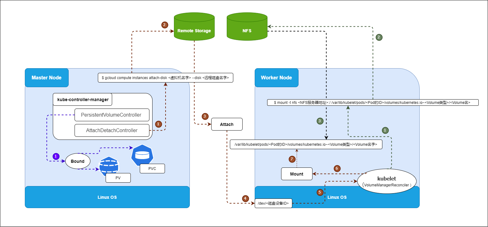
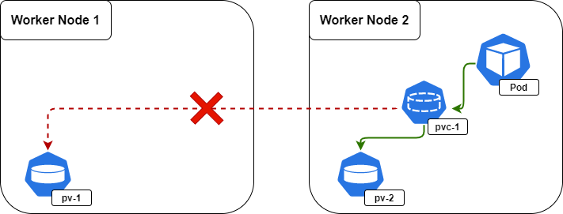

# Kubernetes 存储

Kubernetes 存储是 Kubernetes 系统中提供数据持久化的基础组件，是实现有状态服务的重要保证。Kubernetes 默认提供了主流的存储卷接入方案（In-Tree），同时也提供了插件机制（Out-Of-Tree），允许其他类型的存储服务接入 Kubernetes 系统服务。

## Kubernetes 中存储的应用场景

在Kubernetes中部署和运行的服务大致可以分为以下三类：

- ##### 无状态服务

  Kubernetes 使用 Deployment/ReplicaSet 来保证一个服务的实例数量，如果说某个Pod实例由于某种原因挂掉或崩溃，Deployment/ReplicaSet 会立刻用这个 Pod 的模版，重新创建一个新的 Pod 来替代它。由于是无状态的服务，新 Pod 与旧 Pod 一模一样。此外 Kubernetes 通过 Service（一个 Service 后面可以挂多个Pod）对外提供一个稳定的访问接口，实现服务的高可用。

- ##### 普通有状态服务

  和无状态服务相比，它多了状态保存的需求。Kubernetes 提供了以 PersistentVolumeClaim 和 Persistent Volume 为基础的存储系统，可以实现服务的状态保存。

- ##### 有状态集群服务

  和普通有状态服务相比，它多了集群管理的需求。要运行有状态集群服务要解决的问题有两个，一个是状态保存，另一个是集群管理。Kubernetes为此开发了 StatefulSet，方便有状态集群服务在 Kubernetes 上部署和管理。

  简单来说是通过Init Container来做集群的初始化工作，用 Headless Service 来维持集群成员的稳定关系，用动态存储供给（Dynamic Provisioning）来方便集群扩容。

因此对于“普通有状态服务”和“有状态集群服务”来说，就需要用到 Kubernetes 中的存储。

> 参考资料：
>
> Kubernetes存储系统介绍及机制实现  https://www.kubernetes.org.cn/3462.html

### 几种常见的 Kubernetes 存储

- ##### In-tree volume

  - 临时存储 / Temporary
    - [emptyDir](https://kubernetes.io/docs/concepts/storage/volumes/#emptydir)
  - 短暂存储 / Ephemeral（Local）
    - [configMap](https://kubernetes.io/docs/concepts/storage/volumes/#configmap)
    - [downwardAPI](https://kubernetes.io/docs/concepts/storage/volumes/#downwardapi)
    - [hostPath](https://kubernetes.io/docs/concepts/storage/volumes/#hostpath)
    - [local](https://kubernetes.io/docs/concepts/storage/volumes/#local)
    - [secret](https://kubernetes.io/docs/concepts/storage/volumes/#secret)
  - 永久存储 / Persistent (Networked)
    - [awsElasticBlockStore](https://kubernetes.io/docs/concepts/storage/volumes/#awselasticblockstore)
    - [azureDisk](https://kubernetes.io/docs/concepts/storage/volumes/#azuredisk)
    - [azureFile](https://kubernetes.io/docs/concepts/storage/volumes/#azurefile)
    - [cephfs](https://kubernetes.io/docs/concepts/storage/volumes/#cephfs)
    - [gcePersistentDisk](https://kubernetes.io/docs/concepts/storage/volumes/#gcepersistentdisk)
    - [nfs](https://kubernetes.io/docs/concepts/storage/volumes/#nfs)
    - [persistentVolumeClaim](https://kubernetes.io/docs/concepts/storage/volumes/#persistentvolumeclaim)
    - [vsphereVolume](https://kubernetes.io/docs/concepts/storage/volumes/#vspherevolume)

- ##### Out-of-tree volume plugins

  - [csi](https://kubernetes.io/docs/concepts/storage/volumes/#csi)：容器存储接口 / Container Storage Interface 为 Kubernetes 定义了标准接口，以将任意存储系统暴露给 Pod 使用。如：NFS subdir external provisioner

有关更多的存储，可以参考

- https://kubernetes.io/docs/concepts/storage/volumes/
- https://kubernetes.io/docs/concepts/storage/persistent-volumes/#types-of-persistent-volumes。


接下来，我们先从一些基本概念开始了解。什么是 Volume、PV、PVC、StorageClass ？

## 什么是 Volume、PV、PVC、StorageClass ？

### Volume / 卷

容器中的文件，会临时存放在磁盘上，这给容器中运行的有状态应用程序带来一些问题。 问题之一是当容器崩溃时，文件会丢失，kubelet 会重新启动容器，但容器会以干净的状态重启。 第二个问题是，如何在同一 `Pod` 中的多个容器之间共享文件？

Kubernetes 中的 “Volume / 卷” 这一抽象概念能够帮助解决这两个问题。

目前，Kubernetes 支持很多类型的卷。Pod 可以同时使用任意数目的卷类型。 临时卷类型的生命周期与 Pod 相同，但持久卷可以比 Pod 的存活期长。 当 Pod 不再存在时，Kubernetes 也会销毁临时卷；不过 Kubernetes 不会销毁持久卷。 对于给定 Pod 中任何类型的卷，在容器重启期间数据都不会丢失。

卷的核心概念是 “目录”，“目录” 中存有数据，Pod 中的容器可以访问该 “目录” 中的数据。 根据所采用的不同的卷类型，将决定该 “目录” 是如何生成的，以及使用何种介质保存 “目录” 中的数据。

使用卷时, 在 `.spec.volumes` 字段中设置为 Pod 提供的卷，并在 `.spec.containers[*].volumeMounts` 字段中声明卷在容器中的挂载位置。 

> “Volume / 卷" 更多的是一个抽象的概念，帮助解决 Pod 和容器遇到的数据存储问题。其实 “Volume” 的核心概念是 “目录”，所以一般在提到 “Volume”  的时候，也可以理解为一个远程存储服务挂载在宿主机上的持久化目录；
>
> 参考资料：
>
> https://kubernetes.io/zh/docs/concepts/storage/volumes/


### PV、PVC、StorageClass，这些到底在说啥？

**PV 描述的**，是一个具体的 Volume 的属性，比如 Volume 的类型、挂载目录、远程存储服务器地址等。比如挂载一个 NFS 的目录。通常情况下，PV 对象是由运维人员事先创建在 Kubernetes 集群里待用的。比如，运维人员可以定义这样一个 NFS 类型的 PV，如下所示：

```yaml
apiVersion: v1
kind: PersistentVolume
metadata:
  name: nfs
spec:
  storageClassName: manual
  capacity:
    storage: 1Gi
  accessModes:
    - ReadWriteMany
  nfs:
    server: 10.244.1.4
    path: "/"
```

**而 PVC 描述的**，则是 Pod 所希望使用的持久化存储的属性。比如，Volume 存储的大小、可读写权限等等。PVC 对象通常由开发人员创建；或者以 PVC 模板的方式成为 StatefulSet 的一部分，然后由 StatefulSet 控制器负责创建带编号的 PVC。比如，开发人员可以声明一个 1 GiB 大小的 PVC，如下所示：

```yaml
apiVersion: v1
kind: PersistentVolumeClaim
metadata:
  name: nfs
spec:
  accessModes:
    - ReadWriteMany
  storageClassName: manual
  resources:
    requests:
      storage: 1Gi
```

而用户创建的 PVC 要真正被容器使用起来，就必须先和某个符合条件的 PV 进行绑定。这里要检查的条件，包括两部分：

- 第一个条件，当然是 PV 和 PVC 的 spec 字段。比如，一个 PVC 的 Size 必须小于等于 PV 的 Size，这是因为 PVC 是一个声明的 Volume，实际的 Volume 必须要大于等于声明的 Volume，才能进行绑定。
- 第二个条件，则是 PV 和 PVC 的 storageClassName 字段必须一样。在成功地将 PVC 和 PV 进行绑定之后，Pod 就能够像使用 hostPath 等常规类型的 Volume 一样，在自己的 YAML 文件里声明使用这个 PVC 了，如下所示：

```yaml
apiVersion: v1
kind: Pod
metadata:
  labels:
    role: web-frontend
spec:
  containers:
  - name: web
    image: nginx
    ports:
      - name: web
        containerPort: 80
    volumeMounts:
        - name: nfs
          mountPath: "/usr/share/nginx/html"
  volumes:
  - name: nfs
    persistentVolumeClaim:
      claimName: nfs
```

可以看到，Pod 需要做的，就是在 volumes 字段里声明自己要使用的 PVC 名字。接下来，等这个 Pod 创建之后，kubelet 就会把这个 PVC 所对应的 PV，也就是一个 NFS 类型的 Volume，挂载在这个 Pod 容器内的目录上。

不难看出，PVC 和 PV 的设计，其实跟“面向对象”的思想很类似。好比 Java 中的接口与实现之间的关系。

PVC 可以理解为持久化存储的“接口”，它提供了对某种持久化存储的描述，但不提供具体的实现；而这个持久化存储的实现部分则由 PV 负责完成。这样做的好处是，作为应用开发者，我们只需要跟 PVC 这个“接口”打交道，而不必关心具体的实现是 NFS 还是 Ceph。毕竟这些存储相关的知识太专业了，应该交给专业的人去做。

刚刚我们通过人工方式创建和管理 PV 和 PVC，我们称之为 Static Provisioning，并且通过 StorageClass，将同属于一个 StorageClass 的 PV 和 PVC 绑定在一起。而在 Dynamic Provisioning 的场景下，StorageClass 还可以充当 PV 的模板。

所以我们简单总结一下：

- PVC 描述的，是 Pod 想要使用的持久化存储的属性，比如存储的大小、读写权限等。
- PV 描述的，则是一个具体的 Volume 的属性，比如 Volume 的类型、挂载目录、远程存储服务器地址等
- **StorageClass 的作用**，则是充当 PV 的模板。并且，只有同属于一个 StorageClass 的 PV 和 PVC，才可以绑定在一起。当然，StorageClass 的另一个重要作用，是指定 PV 的 Provisioner（存储插件）。这时候，如果我们的存储插件支持 Dynamic Provisioning 的话，Kubernetes 就可以自动为你创建 PV 了。


## Kubernetes 存储体系架构

**Kubernetes 存储体系架构图：**




刚刚我们讲过，作为应用开发者，我们只需要跟 PVC 这个“接口”打交道，而不必关心具体的实现是 NFS 还是 Ceph。毕竟这些存储相关的知识太专业了，应该交给专业的人去做。

### PV 与 PVC 的绑定

**（下文主要描述的是上图中，左侧紫色的流程线部分）**

当我们在创建 Pod 的时候，系统里并没有合适的 PV 跟 Pod 定义的 PVC 绑定，也就是说此时容器想要使用的 Volume 不存在。这时候，Pod 的启动就会报错。当应用开发中发现这个问题后，会联系运维人员，帮忙创建了一个对应的 PV。

这时候，我们当然希望 Kubernetes 能够再次完成 PVC 和 PV 的绑定操作，从而启动 Pod。所以在 Kubernetes 中，实际上存在着一个专门处理持久化存储的控制器，叫作 Volume Controller。这个 Volume Controller 维护着多个控制循环，其中有一个循环，扮演的就是撮合 PV 和 PVC 的“红娘”的角色。它的名字叫作 PersistentVolumeController。

PersistentVolumeController 会不断地查看当前每一个 PVC，是不是已经处于 Bound（已绑定）状态。如果不是，那它就会遍历所有的、可用的 PV，并尝试将其与这个“单身”的 PVC 进行绑定。这样，Kubernetes 就可以保证用户提交的每一个 PVC，只要有合适的 PV 出现，它就能够很快进入绑定状态，从而结束“单身”之旅。

而所谓将一个 PV 与 PVC 进行“绑定”，其实就是将这个 PV 对象的名字，填在了 PVC 对象的 spec.volumeName 字段上。所以，接下来 Kubernetes 只要获取到这个 PVC 对象，就一定能够找到它所绑定的 PV。

### “两阶段处理”，Attach 和 Mount 

**（下文主要描述的是上图中，棕色流程线的第1 ~ 7 步）**

那么，这个 PV 对象，又是如何变成容器里的一个持久化存储的呢？用一句话总结，所谓容器的 Volume，其实就是将一个宿主机上的目录，跟一个容器里的目录绑定挂载在一起。

而所谓的“持久化 Volume”，指的就是这个宿主机上的目录，具备“持久性”。即：这个目录里面的内容，既不会因为容器的删除而被清理掉，也不会跟当前的宿主机绑定。这样，当容器被重启或者在其他节点上重建出来之后，它仍然能够通过挂载这个 Volume，访问到这些内容。

显然，hostPath 和 emptyDir 类型的 Volume 并不具备这个特征：它们既有可能被 kubelet 清理掉，也不能被“迁移”到其他节点上。所以，大多数情况下，持久化 Volume 的实现，往往依赖于一个远程存储服务，比如：远程文件存储（比如，NFS、GlusterFS）、远程块存储（比如，公有云提供的远程磁盘）等等。而 Kubernetes 需要做的工作，就是使用这些存储服务，来为容器准备一个持久化的宿主机目录，以供将来进行绑定挂载时使用。

而所谓“持久化”，指的是容器在这个目录里写入的文件，都会保存在远程存储中，从而使得这个目录具备了“持久性”。

**这个准备“持久化”宿主机目录的过程，我们可以形象地称为“两阶段处理”。**

接下来，我们通过一个具体的例子来说明。当一个 Pod 调度到一个节点上之后，kubelet 就要负责为这个 Pod 创建它的 Volume 目录。默认情况下，kubelet 为 Volume 创建的目录是如下所示的一个宿主机上的路径：

```
/var/lib/kubelet/pods/<Pod的ID>/volumes/kubernetes.io~<Volume类型>/<Volume名字>
```

接下来，kubelet 要做的操作就取决于你的 Volume 类型了。如果你的 Volume 类型是远程块存储，比如 Google Cloud 的 Persistent Disk（GCE 提供的远程磁盘服务），那么 kubelet 就需要先调用 Goolge Cloud 的 API，将它所提供的 Persistent Disk 挂载到 Pod 所在的宿主机上。

> 备注：你如果不太了解块存储的话，可以直接把它理解为：一块磁盘。

这相当于执行：

```shell
$ gcloud compute instances attach-disk <虚拟机名字> --disk <远程磁盘名字>
```

这一步为虚拟机挂载远程磁盘的操作，对应的正是“两阶段处理”的第一阶段。在 Kubernetes 中，我们把这个阶段称为 **Attach**。

Attach 阶段完成后，为了能够使用这个远程磁盘，kubelet 还要进行第二个操作，即：格式化这个磁盘设备，然后将它挂载到宿主机指定的挂载点上。不难理解，这个挂载点，正是我在前面反复提到的 Volume 的宿主机目录。所以，这一步相当于执行：

```shell
# 通过lsblk命令获取磁盘设备ID
$ sudo lsblk
# 格式化成ext4格式
$ sudo mkfs.ext4 -m 0 -F -E lazy_itable_init=0,lazy_journal_init=0,discard /dev/<磁盘设备ID>
# 挂载到挂载点
$ sudo mkdir -p /var/lib/kubelet/pods/<Pod的ID>/volumes/kubernetes.io~<Volume类型>/<Volume名字>
```

这个将磁盘设备格式化并挂载到 Volume 宿主机目录的操作，对应的正是“两阶段处理”的第二个阶段，我们一般称为：**Mount**。

Mount 阶段完成后，这个 Volume 的宿主机目录就是一个“持久化”的目录了，容器在它里面写入的内容，会保存在 Google Cloud 的远程磁盘中。

#### Mount NFS

**（下文主要描述的是上图中，深绿色流程线的第1 ~ 3 步）**

而如果你的 Volume 类型是远程文件存储（比如 NFS）的话，kubelet 的处理过程就会更简单一些。因为在这种情况下，kubelet 可以跳过“第一阶段”（Attach）的操作，这是因为一般来说，远程文件存储并没有一个“存储设备”需要挂载在宿主机上。所以，kubelet 会直接从“第二阶段”（Mount）开始准备宿主机上的 Volume 目录。在这一步，kubelet 需要作为 client，将远端 NFS 服务器的目录（比如：“/”目录），挂载到 Volume 的宿主机目录上，即相当于执行如下所示的命令：

```shell
$ mount -t nfs <NFS服务器地址>:/ /var/lib/kubelet/pods/<Pod的ID>/volumes/kubernetes.io~<Volume类型>/<Volume名> 
```

通过这个挂载操作，Volume 的宿主机目录就成为了一个远程 NFS 目录的挂载点，后面你在这个目录里写入的所有文件，都会被保存在远程 NFS 服务器上。所以，我们也就完成了对这个 Volume 宿主机目录的“持久化”。

到这里，你可能会有疑问，Kubernetes 又是如何定义和区分这两个阶段的呢？

其实很简单，在具体的 Volume 插件的实现接口上，Kubernetes 分别给这两个阶段提供了两种不同的参数列表：

- 对于“第一阶段”（Attach），Kubernetes 提供的可用参数是 nodeName，即宿主机的名字。
- 而对于“第二阶段”（Mount），Kubernetes 提供的可用参数是 dir，即 Volume 的宿主机目录。

经过了“两阶段处理”，我们就得到了一个“持久化”的 Volume 宿主机目录。所以，接下来，kubelet 只要把这个 Volume 目录通过 CRI 里的 Mounts 参数，传递给 Docker，然后就可以为 Pod 里的容器挂载这个“持久化”的 Volume 了。其实，这一步相当于执行了如下所示的命令：

```shell
$ docker run -v /var/lib/kubelet/pods/<Pod的ID>/volumes/kubernetes.io~<Volume类型>/<Volume名字>:/<容器内的目标目录> 我的镜像 ...
```

以上，就是 Kubernetes 处理 PV 的具体原理了。

> 备注：对应地，在删除一个 PV 的时候，Kubernetes 也需要 Unmount 和 Dettach 两个阶段来处理。这个过程就不再详细介绍了，执行“反向操作”即可。

实际上，你可能已经发现，这个 PV 的处理流程似乎跟 Pod 以及容器的启动流程没有太多的耦合，只要 kubelet 在向 Docker 发起 CRI 请求之前，确保“持久化”的宿主机目录已经处理完毕即可。所以，在 Kubernetes 中，上述关于 PV 的“两阶段处理”流程，是靠独立于 kubelet 主控制循环（Kubelet Sync Loop）之外的两个控制循环来实现的。

其中，“第一阶段”的 Attach（以及 Dettach）操作，是由 Volume Controller 负责维护的，这个控制循环的名字叫作：AttachDetachController。而它的作用，就是不断地检查每一个 Pod 对应的 PV，和这个 Pod 所在宿主机之间挂载情况。从而决定，是否需要对这个 PV 进行 Attach（或者 Dettach）操作。

需要注意，作为一个 Kubernetes 内置的控制器，Volume Controller 自然是 kube-controller-manager 的一部分。所以，AttachDetachController 也一定是运行在 Master 节点上的。当然，Attach 操作只需要调用公有云或者具体存储项目的 API，并不需要在具体的宿主机上执行操作。

而“第二阶段”的 Mount（以及 Unmount）操作，必须发生在 Pod 对应的宿主机上，所以它必须是 kubelet 组件的一部分。这个控制循环的名字，叫作：VolumeManagerReconciler，它运行起来之后，是一个独立于 kubelet 主循环的 Goroutine。

通过这样将 Volume 的处理同 kubelet 的主循环解耦，Kubernetes 就避免了这些耗时的远程挂载操作拖慢 kubelet 的主控制循环，进而导致 Pod 的创建效率大幅下降的问题。实际上，kubelet 的一个主要设计原则，就是它的主控制循环绝对不可以被 block。

### Dynamic Provisioning

**在了解了 Kubernetes 的 Volume 处理机制之后，我们再来看看：StorageClass。**

前面介绍 PV 和 PVC 的时候，曾经提到过，PV 这个对象的创建，是由运维人员完成的。但是，在大规模的生产环境里，这其实是一个非常麻烦的工作。

这是因为，一个大规模的 Kubernetes 集群里很可能有成千上万个 PVC，这就意味着运维人员必须得事先创建出成千上万个 PV。更麻烦的是，随着新的 PVC 不断被提交，运维人员就不得不继续添加新的、能满足条件的 PV，否则新的 Pod 就会因为 PVC 绑定不到 PV 而失败。在实际操作中，这几乎没办法靠人工做到。

所以，Kubernetes 为我们提供了一套可以自动创建 PV 的机制，即：Dynamic Provisioning。

相比之下，前面人工管理 PV 的方式就叫作 Static Provisioning。

Dynamic Provisioning 机制工作的核心，在于一个名叫 StorageClass 的 API 对象。

而 StorageClass 对象的作用，其实就是创建 PV 的模板。具体地说，StorageClass 对象会定义如下两个部分内容：

- 第一，PV 的属性。比如，存储类型、Volume 的大小等等。
- 第二，创建这种 PV 需要用到的存储插件。比如，Ceph 等等。

有了这样两个信息之后，Kubernetes 就能够根据用户提交的 PVC，找到一个对应的 StorageClass 了。然后，Kubernetes 就会调用该 StorageClass 声明的存储插件，创建出需要的 PV。

**举个例子，假如我们的 Volume 的类型是NFS 的话，运维人员就需要定义一个如下所示的 StorageClass：**

```yaml
apiVersion: storage.k8s.io/v1
kind: StorageClass
metadata:
  name: nfs-client
provisioner: k8s-sigs.io/nfs-subdir-external-provisioner
parameters:
  onDelete: retain
```

在这个 YAML 文件里，我们定义了一个名叫 `nfs-client` 的 StorageClass。

这个 StorageClass 的 `provisioner` 字段的值是：`k8s-sigs.io/nfs-subdir-external-provisioner`，这是 Kubernetes 的第三方存储插件的名字，具体关于这个第三方存储插件的信息，可访问 https://github.com/kubernetes-sigs/nfs-subdir-external-provisioner。

而这个 StorageClass 的 `parameters` 字段，就是 PV 的参数。比如：上面例子里的 `onDelete: "retain"`，指的是这个 PV 的回收策略。这表示当用户删除 PersistentVolumeClaim，对应的 PersistentVolume 不会被删除。如果 Volume 包含重要数据时，我们应当将回收策略设置为 `retain`。还有可选的回收策略是 `delete`，这表示的是当用户删除对应的 PersistentVolumeClaim 时，动态配置的 Volume 将被自动删除。

具体的如何部署 **NFS subdir external provisioner**，我们可以参考文档 [How to deploy NFS Subdir External Provisioner to your cluster](https://github.com/kubernetes-sigs/nfs-subdir-external-provisioner#how-to-deploy-nfs-subdir-external-provisioner-to-your-cluster)。

> **NFS subdir external provisioner** is an automatic provisioner that use your *existing and already configured* NFS server to support dynamic provisioning of Kubernetes Persistent Volumes via Persistent Volume Claims. Persistent volumes are provisioned as `${namespace}-${pvcName}-${pvName}`.

其中需要说明的是，当我们部署 **NFS subdir external provisioner** 的时候，有几处需要我们根据自己的 NFS server 信息修改。如下所示：

```yaml
kind: Deployment
apiVersion: apps/v1
metadata:
  name: nfs-client-provisioner
spec:
  replicas: 1
  selector:
    matchLabels:
      app: nfs-client-provisioner
  strategy:
    type: Recreate
  template:
    metadata:
      labels:
        app: nfs-client-provisioner
    spec:
      serviceAccountName: nfs-client-provisioner
      containers:
        - name: nfs-client-provisioner
          image: k8s.gcr.io/sig-storage/nfs-subdir-external-provisioner:v4.0.2
          volumeMounts:
            - name: nfs-client-root
              mountPath: /persistentvolumes
          env:
            - name: PROVISIONER_NAME
              value: k8s-sigs.io/nfs-subdir-external-provisioner
            - name: NFS_SERVER
              value: <YOUR NFS SERVER HOSTNAME>          # YOUR NFS SERVER HOSTNAME
            - name: NFS_PATH
              value: /var/nfs                            # YOUR NFS SERVER exported directory
      volumes:
        - name: nfs-client-root
          nfs:
            server: <YOUR NFS SERVER HOSTNAME>           # YOUR NFS SERVER HOSTNAME
            path: /var/nfs                               # YOUR NFS SERVER exported directory
```

接下来，当我们通过 kubectl create 创建下面的 PVC 对象之后，**NFS subdir external provisioner** 就会帮我们自动创建对应的 PV 和Volume 目录。

```yaml
kind: PersistentVolumeClaim
apiVersion: v1
metadata:
  name: test-claim
 spec:
  storageClassName: nfs-client
  accessModes:
    - ReadWriteMany
  resources:
    requests:
      storage: 1Mi
```

### 思考题

在了解了 PV、PVC 的设计和实现原理之后，你是否依然觉得它有“过度设计”的嫌疑？或者，你是否有更加简单、足以解决你 90% 需求的 Volume 的用法？

> 答：
>
> 正是这套存储体系带来的“解耦”的好处。
>
> 其实，Kubernetes 很多看起来比较“繁琐”的设计（比如“声明式 API”，以及我们今天讲解的“PV、PVC 体系”）的主要目的，都是希望为开发者提供更多的“可扩展性”，给使用者带来更多的“稳定性”和“安全感”。这两个能力的高低，是衡量开源基础设施项目水平的重要标准。

> 参考资料：
>
> https://zhimin-wen.medium.com/persistent-volume-claim-for-statefulset-8050e396cc51
>
> https://www.infoq.cn/article/afju539zmbpp45yy9txj
>
> 极客时间 - 深入剖析 Kubernetes - 28 | PV、PVC、StorageClass，这些到底在说啥？- 张磊 2018-10-26 https://time.geekbang.org/column/article/42698


### 参考文档：在Kubernetes集群中部署 NFS Provisioner

> ###### 第一步 部署 / 安装 NFS Server
>
> ```shell
> # rpcbind runs on NFS servers to respond to port-mapping requests from clients. https://serverfault.com/questions/1015970/is-rpcbind-needed-for-an-nfs-client
> yum install -y rpcbind
> # Install the NFS server.
> yum install -y nfs-utils
> # Enable the rpcbind and nfs-server services.
> systemctl enable rpcbind
> systemctl start rpcbind
> systemctl enable nfs-server
> systemctl start nfs-server
> 
> # Create a directory for each NFS volume.
> mkdir -p /var/vols/nfs/dynamic 
> 
> chmod -R 755 /var/vols/nfs/dynamic
> # Add a group (GID=1999) and user (UID=1999)
> groupadd -g 1999 itsma
> useradd -g 1999 -u 1999 itsma
> # Change the owner of each directory that you created. 
> chown -R 1999:1999 /var/vols/nfs/dynamic
> # In the /etc/exports file, export the NFS directories by adding the following line for each of them.
> echo "/var/vols/nfs/dynamic *(rw,sync,anonuid=1999,anongid=1999,root_squash)" >> /etc/exports
> 
> # Run the exportfs command to make the local directory we configured available to remote hosts.
> exportfs -ra
> # Check the exported NFS volumes.
> showmount -e
> # See more details about our export file system, you can run “exportfs -v”.
> exportfs -v
> ```
>
> **测试：**
>
> ```shell
> # Install nfs-utils on master & worker nodes, too. Otherwise, command `mount` will be failed.
> yum install -y nfs-utils
> 
> # Test the nfs configurations. Log onto one of the worker nodes and mount the nfs filesystem.
> mount -t nfs 192.168.56.101:/var/vols/nfs/dynamic /mnt
> # Verifyed that NFS is confgured correctly, un-mount the filesystem.
> mount | grep dynamic
> umount /mnt
> ```
>
> 
>
> ###### 第二步 部署NFS Provisioner
>
> 具体的如何部署 **NFS subdir external provisioner**，我们可以参考文档 [How to deploy NFS Subdir External Provisioner to your cluster](https://github.com/kubernetes-sigs/nfs-subdir-external-provisioner#how-to-deploy-nfs-subdir-external-provisioner-to-your-cluster)。
>
> 
>
> ###### 第三步 创建一个Pod，使用 Persistent Volume Claims
>
> 通过 kubectl create 创建下面的 PVC 对象。请注意，我们只是创建了PVC，并没有创建PV。但通过`kubectl get pvc`可以查看到，我们刚刚创建的PVC已经处于Bound状态。这就是 **NFS Provisioner** 提供的功能，自动创建PV。
>
> ```yaml
> # Create a PVC, a PV will be bound to it dynamically.
> ---
> kind: PersistentVolumeClaim
> apiVersion: v1
> metadata:
>   name: test-claim
>  spec:
>   storageClassName: nfs-client
>   accessModes:
>     - ReadWriteMany
>   resources:
>     requests:
>       storage: 1Mi
> ```
>
> 然后我们就可以把处于Bound状态的PVC，给Pod使用了。
>
> ```yaml
> apiVersion: v1
> kind: Pod
> metadata:
>   name: nginx-test-claim
> spec:
>   containers:
>   - name: nginx
>     image: nginx:1.19.4
>     imagePullPolicy: IfNotPresent
>     ports:
>     - containerPort: 80
>       name: web
>     volumeMounts:
>     - name: test-claim
>       mountPath: /usr/share/nginx/html
>   volumes:
>   - name: test-claim
>     persistentVolumeClaim:
>       claimName: test-claim
> ```
>
> 
>
> ###### 第四步 创建一个StatefulSet，使用 `volumeClaimTemplates`
>
> 首先我们看一下StatefulSet的YAML文件，注意一下 `volumeClaimTemplates` 部分。
>
> ```yaml
> ---
> apiVersion: v1
> kind: Service
> metadata:
>   name: nginx-pvc-template
>   labels:
>     app: nginx-pvc-template
> spec:
>   ports:
>   - port: 80
>     name: web
>   clusterIP: None
>   selector:
>     app: nginx-pvc-template
> 
> ---
> apiVersion: apps/v1
> kind: StatefulSet
> metadata:
>   name: nginx-pvc-template-sts
> spec:
>   serviceName: "nginx-pvc-template"
>   replicas: 1
>   selector:
>     matchLabels:
>       app: nginx-pvc-template
>   template:
>     metadata:
>       labels:
>         app: nginx-pvc-template
>     spec:
>       containers:
>       - name: nginx
>         image: nginx:1.19.4
>         imagePullPolicy: IfNotPresent
>         ports:
>         - containerPort: 80
>           name: web
>         volumeMounts:
>         - name: nfs-client
>           mountPath: /usr/share/nginx/html
>   volumeClaimTemplates:                     # Here!
>   - metadata:
>       name: nfs-client
>     spec:
>       accessModes:
>       - ReadWriteOnce
>       storageClassName: nfs-client
>       resources:
>         requests:
>           storage: 1Gi
> ```
>
> 通过 kubectl 命令创建StatefulSet 对象，当StatefulSet被创建的时候，会根据 `volumeClaimTemplates` 的定义创建PVC，PVC名字的命名规范为[`.spec.volumeClaimTemplates.metadata.name`]-[`StatefulSet Name`]-[`编号`]，此处PVC的名字为`nfs-client-nginx-pvc-template-sts-0`。
>
> 然后因为我们在 `volumeClaimTemplates` 的定义里面申明了`storageClassName: nfs-client`，NFS Provisioner，也就是 **NFS subdir external provisioner** 会帮我们自动创建 PV。
>
> 登录到 NFS Server，在NFS Server对应的路径下，也能找到 PV 所对应的目录。
>
> 
>
> ###### 总结
>
> 以上的第三、四步，主要想说明的是在kubernetes集群中，对于 NFS Provisioner 的两种不同用法。即：通过声明 PVC 的方式和`volumeClaimTemplates`的方式。
>
> 
>
> ###### 参考资料：
>
> https://github.com/kubernetes-sigs/nfs-subdir-external-provisioner


## PV、PVC体系是不是多此一举？

### 从本地持久化卷谈起

在上一节中，我们详细探讨了 PV、PVC 持久化存储体系在 Kubernetes 项目中的设计和实现原理。并留下来一道思考题：像 PV、PVC 这样的用法，是不是有“过度设计”的嫌疑？PV、PVC 体系是不是多此一举？

比如，我们公司的运维人员可以像往常一样维护一套 NFS 或者 Ceph 服务器，根本不必学习 Kubernetes。而开发人员，则完全可以靠“复制粘贴”的方式，在 Pod 的 YAML 文件里填上 Volumes 字段，而不需要去使用 PV 和 PVC。

实际上，如果只是为了职责划分，PV、PVC 体系确实不见得比直接在 Pod 里声明 Volumes 字段有什么优势。

不过，我们有没有想过这样一个问题，如果Kubernetes 内置的 20 种持久化数据卷实现（ 如 [`awsElasticBlockStore`](https://kubernetes.io/docs/concepts/storage/volumes/#awselasticblockstore) - AWS Elastic Block Store (EBS)，[`azureDisk`](https://kubernetes.io/docs/concepts/storage/volumes/#azuredisk) - Azure Disk，[`nfs`](https://kubernetes.io/docs/concepts/storage/volumes/#nfs) - Network File System (NFS) storage ），都没办法满足我们的容器存储需求时，我们该怎么办？

这个情况乍一听起来有点不可思议。但实际上，凡是鼓捣过开源项目的读者应该都有所体会，“不能用”，“不好用”，“需要定制开发”，这才是落地开源基础设施项目的三大常态。

而在持久化存储领域，用户呼声最高的定制化需求，莫过于支持“本地”持久化存储了。

也就是说，用户希望 Kubernetes 能够直接使用宿主机上的本地磁盘目录，而不依赖于远程存储服务，来提供“持久化”的容器 Volume。

这样做的好处很明显，由于这个 Volume 直接使用的是本地磁盘，尤其是 SSD 盘，它的读写性能相比于大多数远程存储来说，要好得多。这个需求对本地物理服务器部署的私有 Kubernetes 集群来说，非常常见。

所以，Kubernetes 在 v1.10 之后，就逐渐依靠 PV、PVC 体系实现了这个特性。这个特性的名字叫作：Local Persistent Volume。

不过，首先需要明确的是，Local Persistent Volume 并不适用于所有应用。事实上，它的适用范围非常固定，比如：高优先级的系统应用，需要在多个不同节点上存储数据，并且对 I/O 较为敏感。典型的应用包括：分布式数据存储比如 MongoDB、Cassandra 等，分布式文件系统比如 GlusterFS、Ceph 等，以及需要在本地磁盘上进行大量数据缓存的分布式应用。

其次，相比于正常的 PV，一旦这些节点宕机且不能恢复时，Local Persistent Volume 的数据就可能丢失。这就要求使用 Local Persistent Volume 的应用必须具备数据备份和恢复的能力，允许你把这些数据定时备份在其他位置。

接下来，我们来深入探讨一下这个特性。

### Local Persistent Volume 的设计难点

不难想象，Local Persistent Volume 的设计，主要面临两个难点。

- **第一个难点在于**：如何把本地磁盘抽象成 PV。

  可能你会说，Local Persistent Volume，不就等同于 hostPath 加 NodeAffinity 吗？比如，一个 Pod 可以声明使用类型为 Local 的 PV，而这个 PV 其实就是一个 hostPath 类型的 Volume。如果这个 hostPath 对应的目录，已经在节点 A 上被事先创建好了。那么，我只需要再给这个 Pod 加上一个 nodeAffinity=nodeA，不就可以使用这个 Volume 了吗？

  事实上，你绝不应该把一个宿主机上的目录当作 PV 使用。这是因为，这种本地目录的存储行为完全不可控，它所在的磁盘随时都可能被应用写满，甚至造成整个宿主机宕机。而且，不同的本地目录之间也缺乏哪怕最基础的 I/O 隔离机制。

  所以，一个 Local Persistent Volume 对应的存储介质，一定是一块额外挂载在宿主机的磁盘或者块设备（“额外”的意思是，它不应该是宿主机根目录所使用的主硬盘）。这个原则，我们可以称为 **“一个 PV 一块盘”**。

- **第二个难点在于**：调度器如何保证 Pod 始终能被正确地调度到它所请求的 Local Persistent Volume 所在的节点上呢？

  造成这个问题的原因在于，对于常规的 PV 来说，Kubernetes 都是先调度 Pod 到某个节点上，然后，再通过“两阶段处理”来“持久化”这台机器上的 Volume 目录，进而完成 Volume 目录与容器的绑定挂载。

  可是，对于 Local PV 来说，节点上可供使用的磁盘（或者块设备），必须是运维人员提前准备好的。它们在不同节点上的挂载情况可以完全不同，甚至有的节点可以没这种磁盘。

  所以，这时候，调度器就必须能够知道所有节点与 Local Persistent Volume 对应的磁盘的关联关系，然后根据这个信息来调度 Pod。

  这个原则，我们可以称为 **“在调度的时候考虑 Volume 分布”**。在 Kubernetes 的调度器里，有一个叫作 VolumeBindingChecker 的过滤条件专门负责这个事情。在 Kubernetes v1.11 中，这个过滤条件已经默认开启了。

基于上述讲述，在开始使用 Local Persistent Volume 之前，我们首先需要在集群里配置好磁盘或者块设备。在公有云上，这个操作等同于给虚拟机额外挂载一个磁盘。

而在我们部署的私有环境中，我们有两种办法来完成这个步骤。

- 第一种，当然就是给我们的宿主机挂载并格式化一个可用的本地磁盘，这也是最常规的操作；
- 第二种，对于实验环境，我们其实可以在宿主机上挂载几个 RAM Disk（内存盘）来模拟本地磁盘。

### 实践

接下来，我们会使用第二种方法进行实践。首先，在名叫 node-1 的宿主机上创建一个挂载点，比如 /mnt/disks；然后，用几个 RAM Disk 来模拟本地磁盘，如下所示：

```shell
# 在node-1上执行
$ mkdir /mnt/disks
$ for vol in vol1 vol2 vol3; do
    mkdir /mnt/disks/$vol
    mount -t tmpfs $vol /mnt/disks/$vol
done
```

需要注意的是，如果我们希望其他节点也能支持 Local Persistent Volume 的话，那就需要为它们也执行上述操作，并且确保这些磁盘的名字（vol1、vol2 等）都不重复。

接下来，我们就可以为这些本地磁盘定义对应的 PV 了，如下所示：

```yaml
---
apiVersion: v1
kind: PersistentVolume
metadata:
  name: example-pv
spec:
  capacity:
    storage: 5Gi
  volumeMode: Filesystem
  accessModes:
  - ReadWriteOnce
  persistentVolumeReclaimPolicy: Delete
  storageClassName: local-storage
  local:                                       # Here！
    path: /mnt/disks/vol1                      # Here！
  nodeAffinity:                                # Here！
    required:
      nodeSelectorTerms:
      - matchExpressions:
        - key: kubernetes.io/hostname
          operator: In
          values:
          - node-1                             # Here！
```

可以看到，这个 PV 的定义里有一个 `local` 字段，代表它就是一个 Local Persistent Volume；而 `path` 字段，指定的正是这个 PV 对应的本地磁盘的路径，即：`/mnt/disks/vol1`。

在这个 PV 的定义里，有一个 `nodeAffinity` 字段指定 node-1 这个节点的名字。这样，调度器在调度 Pod 的时候，就能够知道一个 PV 与节点的对应关系，从而做出正确的选择。这正是 Kubernetes 实现“在调度的时候就考虑 Volume 分布”的主要方法。

当然了，这也就意味着如果 Pod 要想使用这个 PV，那它就必须运行在 node-1 上。

接下来，我们就可以使用 kubect create 来创建这个 PV，如下所示：

```shell
$ kubectl create -f local-pv.yaml 
persistentvolume/example-pv created

$ kubectl get pv
NAME         CAPACITY   ACCESS MODES   RECLAIM POLICY  STATUS     CLAIM    STORAGECLASS    REASON    AGE
example-pv   5Gi        RWO            Delete          Available           local-storage             16s
```

可以看到，这个 PV 创建后，进入了 Available（可用）状态。

作为使用 PV 和 PVC 的最佳实践，我们需要创建一个 StorageClass 来绑定 PV 和 PVC，如下所示：

```yaml
kind: StorageClass
apiVersion: storage.k8s.io/v1
metadata:
  name: local-storage
provisioner: kubernetes.io/no-provisioner
volumeBindingMode: WaitForFirstConsumer
```

这个 StorageClass 的名字，叫作 local-storage。需要注意的是，在它的 provisioner 字段，我们指定的是 no-provisioner。这是因为 Local Persistent Volume 目前尚不支持 Dynamic Provisioning，所以它没办法在用户创建 PVC 的时候，就自动创建出对应的 PV。也就是说，我们前面创建 PV 的操作，是不可以省略的。

与此同时，这个 StorageClass 还定义了一个 `volumeBindingMode: WaitForFirstConsumer` 的属性。它是 Local Persistent Volume 里一个非常重要的特性，即：**延迟绑定**。

我们知道，当我们提交了 PV 和 PVC 的 YAML 文件之后，Kubernetes 就会根据它们俩的属性，以及它们指定的 StorageClass 来进行绑定。只有绑定成功后，Pod 才能通过声明这个 PVC 来使用对应的 PV。

可是，如果你使用的是 Local Persistent Volume 的话，就会发现，这个流程根本行不通。



比如，现在你有一个 Pod，它声明使用的 PVC 叫作 pvc-1。并且，我们规定，这个 Pod 只能运行在 node-2 上。

而在 Kubernetes 集群中，有两个属性（比如：大小、读写权限）相同的 Local 类型的 PV，pv-1 和 pv-2。

其中，第一个 PV，pv-1，它对应的磁盘所在的节点是 node-1。而第二个 PV，pv-2，它对应的磁盘所在的节点是 node-2。

假设现在，Kubernetes 的 Volume 控制循环里，首先检查到了 pvc-1 和 pv-1 的属性是匹配的，于是就将它们俩绑定在一起。

然后，你用 kubectl create 创建了这个 Pod。这时候，问题就出现了。

调度器看到，这个 Pod 所声明的 pvc-1 已经绑定了 pv-1，而 pv-1 所在的节点是 node-1，根据“在调度的时候考虑 Volume 分布”的原则，这个 Pod 自然会被调度到 node-1 上。

可是，我们前面已经规定过，这个 Pod 根本不允许运行在 node-1 上。所以。最后的结果就是，这个 Pod 的调度必然会失败。

这就是为什么，在使用 Local Persistent Volume 的时候，我们必须想办法推迟这个“绑定”操作。

那么，具体推迟到什么时候呢？

**答案是：推迟到调度的时候。**

所以说，StorageClass 里的 `volumeBindingMode: WaitForFirstConsumer` 的含义，就是告诉 Kubernetes 里的 Volume 控制循环（“红娘”）：虽然你已经发现这个 StorageClass 关联的 PVC 与 PV 可以绑定在一起，但请不要现在就执行绑定操作（即：设置 PVC 的 VolumeName 字段）。

而要等到第一个声明使用该 PVC 的 Pod 出现在调度器之后，调度器再综合考虑所有的调度规则，当然也包括每个 PV 所在的节点位置，来统一决定，这个 Pod 声明的 PVC，到底应该跟哪个 PV 进行绑定。

这样，在上面的例子里，由于这个 Pod 不允许运行在 pv-1 所在的节点 node-1，所以它的 PVC 最后会跟 pv-2 绑定，并且 Pod 也会被调度到 node-2 上。

所以，通过这个延迟绑定机制，原本实时发生的 PVC 和 PV 的绑定过程，就被延迟到了 Pod 第一次调度的时候在调度器中进行，从而保证了这个绑定结果不会影响 Pod 的正常调度。

当然，在具体实现中，调度器实际上维护了一个与 Volume Controller 类似的控制循环，专门负责为那些声明了“延迟绑定”的 PV 和 PVC 进行绑定工作。

通过这样的设计，这个额外的绑定操作，并不会拖慢调度器的性能。而当一个 Pod 的 PVC 尚未完成绑定时，调度器也不会等待，而是会直接把这个 Pod 重新放回到待调度队列，等到下一个调度周期再做处理。

在明白了这个机制之后，我们就可以创建 StorageClass 了，如下所示：

```shell
$ kubectl create -f local-sc.yaml 
storageclass.storage.k8s.io/local-storage created
```

接下来，我们只需要定义一个非常普通的 PVC，就可以让 Pod 使用到上面定义好的 Local Persistent Volume 了，如下所示：

```yaml
kind: PersistentVolumeClaim
apiVersion: v1
metadata:
  name: example-local-claim
spec:
  accessModes:
  - ReadWriteOnce
  resources:
    requests:
      storage: 5Gi
  storageClassName: local-storage
```

可以看到，这个 PVC 没有任何特别的地方。唯一需要注意的是，它声明的 storageClassName 是 local-storage。所以，将来 Kubernetes 的 Volume Controller 看到这个 PVC 的时候，不会为它进行绑定操作。

现在，我们来创建这个 PVC：

```shell
$ kubectl create -f local-pvc.yaml 
persistentvolumeclaim/example-local-claim created

$ kubectl get pvc
NAME                  STATUS    VOLUME    CAPACITY   ACCESS MODES   STORAGECLASS    AGE
example-local-claim   Pending                                       local-storage   7s
```

可以看到，尽管这个时候，Kubernetes 里已经存在了一个可以与 PVC 匹配的 PV，但这个 PVC 依然处于 Pending 状态，也就是等待绑定的状态。

然后，我们编写一个 Pod 来声明使用这个 PVC，如下所示：

```yaml
kind: Pod
apiVersion: v1
metadata:
  name: example-pv-pod
spec:
  volumes:
    - name: example-pv-storage
      persistentVolumeClaim:
       claimName: example-local-claim         # HERE！
  containers:
    - name: example-pv-container
      image: nginx
      ports:
        - containerPort: 80
          name: "http-server"
      volumeMounts:
        - mountPath: "/usr/share/nginx/html"
          name: example-pv-storage
```

这个 Pod 没有任何特别的地方，你只需要注意，它的 `volumes` 字段声明要使用前面定义的、名叫 example-local-claim 的 PVC 即可。

而我们一旦使用 kubectl create 创建这个 Pod，就会发现，我们前面定义的 PVC，会立刻变成 Bound 状态，与前面定义的 PV 绑定在了一起，如下所示：

```shell
$ kubectl create -f local-pod.yaml 
pod/example-pv-pod created

$ kubectl get pvc
NAME                  STATUS    VOLUME       CAPACITY   ACCESS MODES   STORAGECLASS    AGE
example-local-claim   Bound     example-pv   5Gi        RWO            local-storage   6h
```

也就是说，在我们创建的 Pod 进入调度器之后，“绑定”操作才开始进行。

这时候，我们可以尝试在这个 Pod 的 Volume 目录里，创建一个测试文件，比如：

```shell
$ kubectl exec -it example-pv-pod -- /bin/sh
# cd /usr/share/nginx/html
# touch test.txt
```

然后，登录到 node-1 这台机器上，查看一下它的 `/mnt/disks/vol1` 目录下的内容，你就可以看到刚刚创建的这个文件：

```shell
# 在node-1上
$ ls /mnt/disks/vol1
test.txt
```

而如果你重新创建这个 Pod 的话，就会发现，我们之前创建的测试文件，依然被保存在这个持久化 Volume 当中：

```shell
$ kubectl delete -f local-pod.yaml 

$ kubectl create -f local-pod.yaml 

$ kubectl exec -it example-pv-pod -- /bin/sh
# ls /usr/share/nginx/html
# test.txt
```

需要注意的是，我们上面手动创建 PV 的方式，即 Static 的 PV 管理方式，在删除 PV 时需要按如下流程执行操作：

1. 删除使用这个 PV 的 Pod；
2. 从宿主机移除本地磁盘（比如，umount 它）；
3. 删除 PVC；
4. 删除 PV。

如果不按照这个流程的话，这个 PV 的删除就会失败。

当然，由于上面这些创建 PV 和删除 PV 的操作比较繁琐，Kubernetes 其实提供了一个 Static Provisioner 来帮助我们管理这些 PV。比如，我们现在的所有磁盘，都挂载在宿主机的 `/mnt/disks` 目录下。那么，当 Static Provisioner 启动后，它就会通过 DaemonSet，自动检查每个宿主机的 `/mnt/disks` 目录。然后，调用 Kubernetes API，为这些目录下面的每一个挂载，创建一个对应的 PV 对象出来。

更多关于  Static Provisioner 的资料，可以参阅 [Local Persistence Volume Static Provisioner](https://github.com/kubernetes-sigs/sig-storage-local-static-provisioner)

> ### Local Persistence Volume Static Provisioner
>
> Local Persistence Volume Static Provisioner 帮助管理 PersistentVolume 的生命周期，自动侦测宿主机上的本地磁盘，并自动创建 PV。在 PV 释放后，可以进行本地磁盘的清理。 Local Persistence Volume Static Provisioner 不支持 dynamic provisioning。  

### 总结

在本节中，我们详细介绍了 Kubernetes 里 Local Persistent Volume 的实现方式。

可以看到，正是通过 PV 和 PVC，以及 StorageClass 这套存储体系，在不影响 Kubernetes 已有用户的情况下，添加新的持久化存储方案。作为用户，你的 Pod 的 YAML 和 PVC 的 YAML，并没有任何特殊的改变，这个特性所有的实现只会影响到 PV 的处理，也就是由运维人员负责的那部分工作。

而这，正是这套存储体系带来的“解耦”的好处。

其实，Kubernetes 很多看起来比较“繁琐”的设计（比如“声明式 API”，以及我们今天讲解的“PV、PVC 体系”）的主要目的，都是希望为开发者提供更多的“可扩展性”，给使用者带来更多的“稳定性”和“安全感”。这两个能力的高低，是衡量开源基础设施项目水平的重要标准。


> 参考资料：
>
> 极客时间 - 深入剖析 Kubernetes - 29 | PV、PVC体系是不是多此一举？从本地持久化卷谈起 - 张磊 https://time.geekbang.org/column/article/42819
>
> https://github.com/kubernetes-sigs/sig-storage-local-static-provisioner
>
> https://github.com/kubernetes-sigs/sig-storage-local-static-provisioner


## Persistent Volumes 的最佳实践

### 什么是 Persistent Volumes (PVs) ？

PVC 描述的，是 Pod 想要使用的持久化存储的属性，比如存储的大小、读写权限等。与普通卷不同，PV 是 Kubernetes 集群中的一个资源对象。创建 PV 相当于创建一个存储资源对象。要想使用 PV，必须通过 Persistent Volume Claims（PVC）。PVC 是一种存储请求，用于将 PV 挂载到 Pod 中。

集群管理员可以为 PV 指定使用哪种插件类型，存储模式，访问模式，回收策略等配置信息。例如下面的 YAML 文件，我们来看一下每个字段所代表的含义。

```yaml
apiVersion: v1
kind: PersistentVolume
metadata:
  name: pv-1
spec:
  capacity:
   storage: 10Gi
  volumeMode: Filesystem
  accessModes:
   - ReadWriteOnce
  persistentVolumeReclaimPolicy: Retain
  storageClassName: nfs
  mountOptions:
   - nosuid
   - nfsvers=4.1
  nfs:
   path: /tmp
   server: 172.17.0.2
```

#### Capacity / 容量

一般而言，每个 PV 卷都有确定的存储容量。 容量属性是使用 PV 对象的 `capacity` 属性来设置的。

目前，仅支持配置存储大小，例如 `10Gi`。未来可能会包含 IOPS、throughput 等属性。


#### Volume Modes / 卷模式 

针对 PV 持久卷，Kubernetes 支持两种卷模式（`volumeModes`）：`Filesystem（文件系统）` 和 `Block（块存储）`。 `volumeMode` 是一个可选的参数。 如果省略该参数，默认的卷模式是 `Filesystem`。


#### Access Modes / 访问模式

根据存储资源提供者的能力不同，每个 PV 卷可以单独设置为对应存储所支持的访问模式。 例如下图中列出了常见的存储所支持的访问模式。

| Volume Plugin        | ReadWriteOnce | ReadOnlyMany | ReadWriteMany | ReadWriteOncePod |
| :------------------- | :-----------: | :----------: | :-----------: | ---------------- |
| AWSElasticBlockStore |       ✓       |      -       |       -       | -                |
| AzureFile            |       ✓       |      ✓       |       ✓       | -                |
| AzureDisk            |       ✓       |      -       |       -       | -                |
| CephFS               |       ✓       |      ✓       |       ✓       | -                |
| GCEPersistentDisk    |       ✓       |      ✓       |       -       | -                |
| HostPath             |       ✓       |      -       |       -       | -                |
| NFS                  |       ✓       |      ✓       |       ✓       | -                |

以 NFS 举例来说，假设我们有两份 PV 的 YAML 文件，分别为 pv-1 和 pv-2，PV 对应的后端存储都是 NFS。那么我们可以将 pv-1 的访问模式设置为 `ReadWriteMany`，同时也可以将 pv-2 的访问模式设置为 `ReadOnlyMany`。每个 PV 卷都可以单独设置自己的访问模式。

每种访问模式的含义又是什么呢？

- `ReadWriteOnce (RWO)`

  卷可以被一个节点以读写方式挂载。如果多个 Pod 运行在同一个节点上，那么也允许访问此卷。

- `ReadOnlyMany (ROX)`

  卷可以被多个节点以只读方式挂载。

- `ReadWriteMany (RWX)`

  卷可以被多个节点以读写方式挂载。

- `ReadWriteOncePod`

  卷只能被单个 Pod 以读写方式挂载，如果其他 Pod 也想使用这个 PV，那么 Pod 将启动失败。 如果你想确保整个集群中只有一个 Pod 可以读取或写入该 PVC， 请使用ReadWriteOncePod 访问模式。但是 `ReadWriteOncePod`模式是 Kubernetes v1.22 版本的`alpha` 特性，并且只支持`CSI`类型的卷

  对于高度敏感的数据，可能只允许一个用户读写数据，而不允许其他用户。那么可以使用此模式。

  

#### 类 / Class

每个 PV 可以属于某个类（Class），通过将其 `storageClassName` 属性设置为某个 StorageClass 对象的名称。PV 和 PVC 对象通过 `storageClassName` 来进行绑定。


#### 回收策略 / Reclaim Policy

当用户不再使用其存储卷时，可以将 PVC 对象删除，从而允许该资源被回收再利用。PersistentVolume 对象的回收策略告诉集群，后续该如何处理该数据卷。 目前，数据卷可以被 Retain（保留）、Recycle（回收）或 Delete（删除）。

- **保留（Retain）**

  回收策略 Retain 使得用户可以手动回收资源。当 PersistentVolumeClaim 对象被删除时，PersistentVolume 卷仍然存在，对应的数据卷被视为"已释放（released）"。 由于卷上仍然存在着前一申领人的数据，该卷还不能用于其他申领。 管理员可以通过下面的步骤来手动回收该卷：

  1. 如果 PV 正在被 Pod 使用，需要先删除 Pod，然后再删除 PVC；

  2. 删除 PVC 后，此时 PV 是否被删除，取决于其回收策略。如果回收策略为 `Delete` ，则 PV 将会被自动删除；如果回收策略为`Retain`，则 PV 会被保留。

  3. 因为我们设置的回收策略为 `Retain`，此时我们通过 `kubectl get pv` 命令可以看到 PV 依然被保留着，并且状态由 `Bound` 变成了 `Released`，该状态的 PV 无法被新的 PVC 所申领，只有处于 `Available` 状态的 PV 才能被 PVC 所申领。

     ```shell
     $ kubectl get pv
     NAME   CAPACITY  ACCESS MODES  RECLAIM POLICY   STATUS     CLAIM          STORAGECLASS   REASON   AGE
     pv-1   10Gi      RWO           Retain           Released   default/pvc-1  nfs                     10m
     ```

     被保留下来的 PV，在 `spec.claimRef` 字段记录着原来绑定的 PVC 的信息：

     ```shell
     $ kubectl get pv pv-1 -o yaml
     apiVersion: v1
     kind: PersistentVolume
     ......
     spec:
       accessModes:
       - ReadWriteOnce
       capacity:
         storage: 10Gi
       claimRef:
         apiVersion: v1
         kind: PersistentVolumeClaim
         name: pvc-1                                   # HERE！
         namespace: default
         resourceVersion: "792426"                     # HERE！
         uid: 325b013f-0467-4078-88e9-0fc208c6993c     # HERE！
       nfs:
         path: /tmp
         server: 172.17.0.2
       persistentVolumeReclaimPolicy: Retain
       storageClassName: nfs
       volumeMode: Filesystem
     status:
       phase: Released
     ```

  4. 使用 `kubectl edit pv` 命令，删除 PV 中绑定信息的 `resourceVersion` 和 `uid`，即可重新释放 PV，使其状态由 `Released` 变为 `Available`。

     再次查看 PV 的状态，已经变为 `Available`。

     ```shell
     $ kubectl get pv
     NAME   CAPACITY  ACCESS MODES  RECLAIM POLICY   STATUS     CLAIM          STORAGECLASS   REASON   AGE
     pv-1   10Gi      RWO           Retain           Available  default/pvc-1  nfs                     20m
     ```

  5. 由于该 PV 中的 `spec.claimRef.name` 和 `spec.claimRef.namespace` 字段不变，该 PV 依然指向原来的 PVC 名称。重新创建之前删除的 PVC 及 Pod，可以重新绑定 PVC 和 PV，并恢复 Pod 中的数据。

- **删除（Delete）**

  对于支持Delete回收策略的存储卷插件，删除动作会将 PersistentVolume 对象从 Kubernetes 中移除，同时也会从外部基础设施（如 AWS EBS、GCE PD、Azure Disk 或 Cinder 卷）中移除所关联的存储资产。 动态供应的卷会继承其 StorageClass 中设置的回收策略，该策略默认 为 Delete。 管理员需要根据用户的期望来配置 StorageClass；否则 PV 卷被创建之后，用户需要重新编辑或者修补 StorageClass。

- **回收（Recycle）**

  警告：回收策略Recycle已被废弃。取而代之的建议方案是使用动态供应。

  

#### 挂载选项 / Mount Options

Kubernetes 管理员可以指定持久卷被挂载到节点上时使用的附加挂载选项。

> **说明：** 并非所有持久卷类型都支持挂载选项。

以下为常见的支持挂载选项的存储卷类型：

- `awsElasticBlockStore`
- `azureDisk`
- `azureFile`
- `cephfs`
- `gcePersistentDisk`
- `glusterfs`
- `nfs`
- `vsphereVolume`

例如，上面例子中的 PV 文件指定了 `mountOptions`：

```
  mountOptions:
   - nosuid
   - nfsvers=4.1
```

- `nosuid`：禁用 set-user-identifier 或 set-group-identifier。这样可以防止远程用户通过运行 `setuid` / `setgid` 程序获得更高的权限。
- `nfsvers`：指定要使用的 NFS 协议版本。这对于运行多个 NFS 服务器的主机很有用。如果没有指定版本，NFS 使用内核和 mount 命令支持的最高版本。 NFSv4 不支持此选项，不应使用此选项。


### 最佳实践 / Best Practices

在配置 PV 时，Kubernetes 文档建议记住以下这些最佳实践：

1. 为减少管理运维的成本，请避免使用静态方式创建和分配持久卷，推荐使用 Dynamic Provisioning。并在StorageClass 中定义适当的回收策略，以在删除 Pod 后最大限度地降低存储成本。
2. 当使用 “本地持久化卷 / Local Persistent Volume“ 时，根据应用程序的需求进行适当规划，以部署合适大小的节点。即为不同的节点，根据需求提供不同的本地存储容量。
3. 持久卷 PV 的生命周期独立于集群中的任何特定容器。持久卷声明 (PVC) 是容器用户或应用程序对特定类型的存储提出的请求。创建 PV 时，Kubernetes 文档建议如下：
   - 始终在容器配置中包含 PVC；
   - 切勿在容器配置中包含 PV，因为这会将容器紧密耦合到特定卷；
   - 总是有一个默认的 StorageClass；否则，未指定特定类的 PVC 将失败；
   - 为 StorageClasses 赋予有意义的名称。


> 参考资料：
>
> https://loft.sh/blog/kubernetes-persistent-volumes-examples-and-best-practices/
>
> https://kubernetes.io/docs/concepts/storage/persistent-volumes/
>
> https://kubernetes.io/blog/2021/09/13/read-write-once-pod-access-mode-alpha/
>
> https://www.jianshu.com/p/ca6dcc5600cc
>
> https://blog.csdn.net/networken/article/details/108304998
>
> https://access.redhat.com/documentation/en-us/red_hat_enterprise_linux/4/html/reference_guide/s2-nfs-client-config-options

