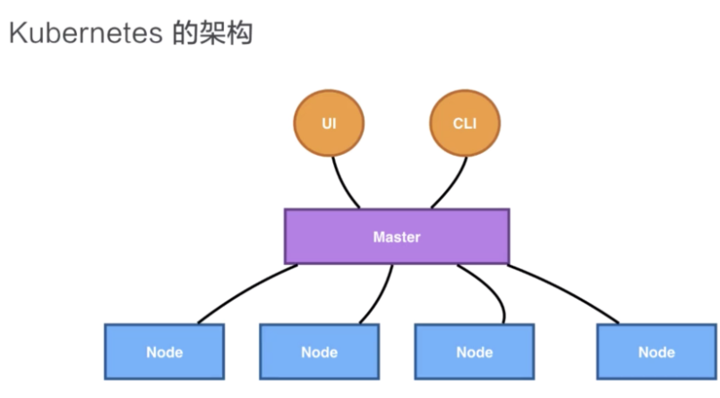
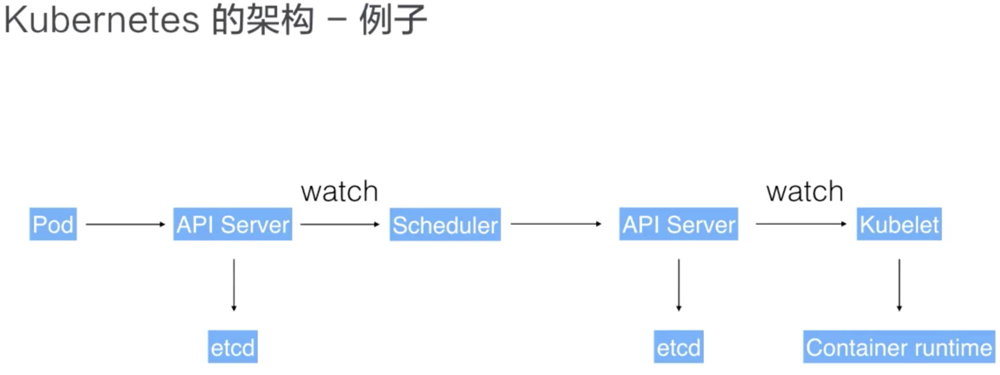

# 如何保护Kubernetes集群

## 概览：Kubernetes集群组件架构

Kubernetes 架构是一个比较典型的二层架构，或者说是 server-client 架构。Master 作为中央的管控节点，会去与 Node 进行一个连接。

 

所有 UI、CLI、这些用户侧的组件，只会和 Master 进行连接，把希望的状态或者想执行的命令下发给 Master，Master 会把这些命令或者状态下发给相应的节点，进行最终的执行。

Kubernetes 的 Master节点，或者可以称之为Kubernetes Control Plane（Master这个词带种族歧视，Black Lives Matter），包含四个主要的组件：kube-api-server、kube-controller-manager、kube-scheduler 以及 etcd。如下图所示：

 

### 控制平面组件（Control Plane Components）

- **kube-apiserver**：顾名思义是用来处理 API 请求的，Kubernetes 中所有的组件都会和 kube-apiserver 进行交互，组件与组件之间一般不进行独立的交互，都依赖于 kube-apiserver 进行消息的传送。kube-apiserver 设计上也考虑了水平伸缩，也就是说，它可以通过部署多个实例进行水平伸缩。 我们可以运行 kube-apiserver 的多个实例，并在这些实例之间平衡流量。

- **etcd**：是一个分布式的存储系统，kube-apiserver 中所需要的原信息都被存储在 etcd 中，etcd 本身是一个兼具一致性和高可用性的键值数据库，通过 etcd 保证整个 Kubernetes 的 Master 组件的高可用性。

- **kube-scheduler**：就是调度器，“调度器”顾名思义就是完成调度的操作，就是我们刚才介绍的有关“调度”的例子中，就是由kube-scheduler调度器完成的。把一个用户提交的Container容器，依据它对 CPU、memory 的请求大小，找一台合适的节点，进行放置。

- **kube-controller-manager**：就是控制器，它用来完成对集群状态的管理。比如刚刚我们提到的自动修复和水平伸缩的例子，都是由 kube-controller-manager 来进行完成的。Kubernetes有很多不同的控制器，负者不同的任务。从逻辑上讲，每个控制器都是一个单独的进程，但是为了降低复杂性，它们都被编译到同一个可执行文件，并在一个进程中运行。

  这些控制器包括:

  - 节点控制器（Node Controller）: 负责在节点出现故障时进行通知和响应。
  - 副本控制器（Replication Controller）: 负责为系统中的每个副本控制器对象（ReplicaSet）维护正确数量的 Pod。
  - 端点控制器（Endpoints Controller）: 填充端点(Endpoints)对象(即关联 Service 与 Pod)。
  - 服务帐户和令牌控制器（Service Account & Token Controllers）: 为新的命名空间创建默认帐户和 API 访问令牌。

- **cloud-controller-manager**：cloud-controller-manager是 k8s 1.8 的 alpha 特性，目前依然是beta特性。是将 Kubernetes 与云环境集成的最佳方式。如果你在本地环境中（on-premise）运行 Kubernetes，不需要部署cloud-controller-manager。

  与 kube-controller-manager 类似，cloud-controller-manager 将若干逻辑上独立的控制器组合在同一个可执行文件中，并在一个进程中运行。 你可以对其执行水平扩容（运行不止一个副本）以提升性能或者增强容错能力。

  控制器的实际运行情况依赖于特定的云供应商：

  - 节点控制器（Node Controller）: 用于在节点终止响应后检查云供应商以确定节点是否已被删除

  - 路由控制器（Route Controller）: 用于在底层云基础架构中设置路由

  - 服务控制器（Service Controller）: 用于创建、更新和删除云供应商的负载均衡器

###    Node 组件

Kubernetes 的 Node 是真正运行业务负载的组件，每个业务负载会以 Pod 的形式运行。一个 Pod 中可以运行一个或者多个容器，真正去运行这些 Pod 的组件叫做 **kubelet**，也就是 Node 上最为关键的组件。

Node组件在每个工作节点上运行。

   - **kubelet**：kubelet 接收一组PodSpecs，确保这些 PodSpecs 中描述的容器处于运行状态且健康（创建容器）。kubelet 不会管理不是由 Kubernetes 创建的容器。
   - **kube-proxy**：在每个工作节点上运行的网络代理，实现 Kubernetes Service 概念的一部分。kube-proxy 维护每个工作节点上的网络规则，允许集群内部Pod之间的网络通信，和集群外部至Pod的网络通信。
   - **容器运行时（Container Runtime）**：容器运行时是负责运行容器的软件。Kubernetes 支持多个容器运行时: docker、 containerd、CRI-O 以及任何实现 Kubernetes CRI (容器运行环境接口)。

接下来我们通过一个例子来讲解这些组件之间是如何相互沟通相互通信的，来协调完成一次Pod的调度执行操作的。

 

用户可以通过 UI 或者 CLI 提交一个 Pod 给 Kubernetes 进行部署，这个 Pod 请求首先会通过 CLI 或者 UI 提交给 Kubernetes API Server，下一步 API Server 会把这个信息写入到它的存储系统 etcd中，之后 Scheduler 会通过 API Server 的 watch 或者叫做 notification 机制得到以下信息：“有一个 Pod 需要被调度”。

这个时候 Scheduler 会根据Pod的定义进行一次调度决策，在完成这次调度之后，它会向 API Server 报告说：“OK！这个 Pod 需要被调度到某一个节点上。”

 这个时候 API Server 接收到这次操作之后，会把这次的结果再次写到 etcd 中，然后 API Server 会通知相应的节点进行此 Pod 真正的启动操作。相应节点的 kubelet 会得到这个通知，kubelet 就会去调用容器运行时来真正的启动和配置这个容器，比如调用 Storage Plugin 去配置存储，Network Plugin 去配置网络。

 

###    插件（Addons）

使用 Kubernetes 工作负载（DaemonSet、 Deployment等）实现集群功能。 因为这些插件提供集群级别的功能，所以大都位于kube-system 命名空间。

   - **DNS**：此插件属于非必需组件，但几乎所有 Kubernetes 集群都需要 DNS 服务，它为 Kubernetes 服务提供 DNS 记录。

   - **Web 界面（仪表盘）**：Dashboard 是基于 Web 的用户界面，它使用户可以管理集群中运行的Pod以及集群本身并进行故障排查。

## 概览：保护Kubernetes集群安全

- 访问控制
  - Kubernetes API
  - kubelet
  - etcd
- 使用TLS加密所有API通信
- API Authentication & API Authorization
- 限制Workload和用户的能力（capabilities）
- 限制集群的资源使用率（CPU、Memory、Pod的数量）
- 限制网络访问
- 启用审计日志（Enable audit logging）
- 限制使用K8s alpha/beta功能
- 时常更新证书、密码等敏感信息
- 关注K8s安全动态和CVE（CVE 的英文全称是“Common Vulnerabilities & Exposures”，通用漏洞披露。）