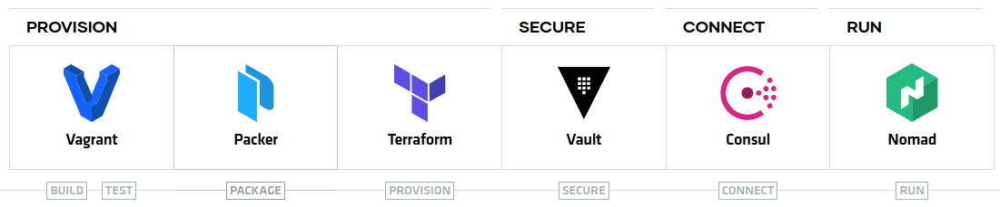

# Kubernetes安全领域知识介绍

## 1. Kubernetes的威胁模型 / Kubernetes Threat modeling

### 什么是威胁模型 / Threat modeling？

Threat modeling是一种分析方法，其做法是在产品设计好之后，根据流程图观察产品的信息流，同时根据给定的几项原则 [STRIDE原则] 找出可能的潜在威胁，然后根据重要性进行修正。


在Threat modeling分析的过程中，有以下这些角色组成：

1. **Asset**: 资产，系统中需要被保护的对象。
2. **Security control**: 对资产采取一些保护措施，如果是一个Web应用的话，一般在应用前面会有一个防火墙软件，用于过滤或抵御恶意攻击。
3. **Threat actor**: 可以理解为黑客组织。
4. **Attack surface**: 易被攻击面，黑客会利用一些已知的漏洞或者不安全的配置来攻击被保护对象。
5. **Threat**: 被保护的对象的潜在风险。
6. **Mitigation**: 采取一定的措施，缓解对被保护对象的威胁。

#### STRIDE原则

在Threat modeling的分析过程中，有一条原则需要遵守，那就是**STRIDE**。

STRIDE 是微软开发的用于威胁建模（Threat modeling）的工具，或者说是一套方法论。 在介绍 STRIDE 威胁建模之前，我们需要了解两个重要的安全概念：安全属性和安全设计原则。 

安全属性和安全设计原则并没有一个绝对的标准答案，不同的资料在介绍安全属性和安全设计原则时会有不同，只是大家从不同的侧重点或者不同的角度来回答问题罢了，所以我们不用过于纠结。

##### 安全属性

说到安全属性首先想到的就是CIA，这里的CIA不是美国中央情报局的缩写，而是Confidentiality （机密性）, Integrity （完整性）, 和 Availability （可用性）三个英文单词的首字母。

- 机密性：保证机密信息不被窃取，窃听者不能了解信息的真实含义。
- 完整性：保证数据的一致性，防止数据被非法用户窜改。
- 可用性：保证合法用户对信息资源的使用不会被不正当的拒绝，如DOS攻击。

除了CIA三个最常见的安全属性外，这里再补充三个：

- 鉴权：身份验证，建立用户身份。
- 授权：明确允许或拒绝用户是否能访问资源，访问哪些资源。
- 认可（不可抵赖)：用户无法在执行某操作后否认执行了此操作。

鉴权和授权比较容易混淆，从名字上看很相似，但是它们是不同的两个安全属性。鉴权是指是否需要验证身份（你是谁？），而授权是指验证身份的等级（你能做什么？）。

打个比方，现在很多公园都是免费对外开放，而以前是收费凭门票进入。这里的是否需要门票就是鉴权问题，有门票的允许进入公园，没有门票的不允许进入。

而还有些公园，不仅需要门票进入，进入以后根据门票的不同，可以游玩的区域和设施是不一样的，只有购买了通票才可以游玩所有区域。这个通票就是我们这里说的超级管理员或者root账户。不同的角色分配不同的权限等级，即为授权。

##### 安全设计原则

下面列出了十个安全设计原则：

- 原则1：最小攻击面
- 原则2：默认安全
- 原则3：权限最小化
- 原则4：纵深防御
- 原则5：失败安全
- 原则6：不信任第三方系统
- 原则7：业务隔离
- 原则8：公开设计
- 原则9：简化系统设计
- 原则10：使用白名单

###### 原则1：最小攻击面

我们在一些web安全防护建议中经常会提到“关闭不必要对外开放的端口”，这就是最小攻击面的一项措施。在网络攻击的生命周期中一个重要环节就是信息收集，这个环节往往也是黑客耗费时间精力最大的一个环节，对最终黑客的攻击成果起了至关重要的影响，越是有经验的黑客，会花更多的时间和精力在信息收集上面，这步做的好，后面就能一击命中。

如果我们能把”最小攻击面“这个安全原则做好，就会大大影响黑客信息收集的成果，最终挫败黑客的攻击。

###### 原则2：默认安全

系统的默认配置带来的安全问题，比如早期一些路由器出厂默认的帐号是admin，密码也是admin。如果我们也没有意识到需要修改默认密码，那么类似这样的系统就很容易被攻破。

###### 原则3：权限最小化

这也是很多人常犯的错误，一个root账号搞定所有系统，虽然维护方便了，但如果黑客攻破了任意一个系统，就直接拿到了最高权限，从而攻破所有系统。

###### 原则4：纵深防御

不要把所有的精力只用在某一点的防御上，仅一点的防御再强，也可能会出现 0 day 漏洞，无法保证100%的安全。 层层设防，多样化，多层次、纵深的防御措施。攻破一层或一类防护后，还有更多层的防护，使得黑客无法破坏整个信息基础设施或应用系统。 

比如：SQL注入攻击的直接原因是拼接SQL参数导致的，因此防止SQL注入攻击，我们首先想到的就是SQL语句预编译的方法，除此之外我们还可以部署WAF系统在系统外围首先进行拦截；数据库的敏感数据加密保存，使得即便被黑客攻入，窃取出去的数据也无法还原出原始信息；多重防御方法结合使用，就是纵深防御。

###### 原则5：失败安全

当异常发生时，异常处理代码处理不当，可能导致意想不到的结果，比如权限提升、信息泄露等。这也是不懂安全的开发人员经常容易忽视的问题，而在黑客攻击的信息收集阶段，黑客就经常利用，对攻击目标故意输错url参数或者路径、构造异常的 Http Post 请求数据，导致服务器出错，如果开发人员对此类错误处理不当，就可能会导致敏感信息泄露，为黑客的下一步攻击提供重要的线索和思路。这些都是在真实案例中发生过的例子。

另外，很多 0 day 漏洞就是通过各种非常规数据的输入设法把程序给搞崩溃，然后被发现的。

###### 原则6：不信任第三方系统

现在的系统越来越复杂，很多都是模块化、组件化的，需要引入第三方的模块或者和第三方的业务系统对接（集成）并使用其提供的数据，我们无法掌控第三方系统的安全性，如果其存在安全漏洞被攻击，需要保证我们自己的系统不会因此而受到影响。

这个威胁也排进了OWASP Top 10：“使用含有已知漏洞的组件”。

###### 原则7：业务隔离

简单一句话就是不要把所有鸡蛋都放在一个篮子里，不至于一个系统被攻破就让黑客拿到了一把“万能钥匙”，可以操作所有的业务功能。

###### 原则8：公开设计

如果是初次接触这个安全原则，可能会很难理解。为了安全，通常会认为我们不应该公开源代码，更加不能公开解密相关的重要源代码。但依据“公开设计”的安全原则，我们期望即使我们公开源代码后，我们的系统依然是安全的。

一个典型相悖于“公开设计”原则的例子就是私有加密算法，误以为使用自己设计的加密算法更加安全。正确的做法是使用标准的RSA、AES等对称或非对称加密算法，我们数据的安全性不应该依赖于算法的保密性，而是要确保加密密钥的安全，只要我们的密钥位数足够长，密钥不被泄露，那我们加密的数据就是安全的。

而在我接触到的真实黑客渗透中，黑客收集目标系统的信息，首先使用常规手段无法攻破系统后，如果这个系统因为是开源或者通过其他手段能拿到全部或者部分源码，黑客就会深入去研究系统的源代码，而常常能找到系统的漏洞或者突破口，进而发起进一步的攻击。我们还不如早点公开源代码，让更多的人，特别是白帽子发现我们代码的漏洞，并主动告知我们，我们也可以尽快修复漏洞。

完全做到“公开设计”在实际中并太多，也比较困难。但我们应该逐渐形成这样的意识，尽可能从保护源代码的思维转化为“公开设计”的思维 ，理想的目标就是即使把所有源代码开放给黑客，黑客也无法攻破系统。

###### 原则9：简化系统设计

其实一直有个疑问困扰着我，就是安全防御技术越来越强，防御手段越来越多，漏洞被不断发现和修补，是不是以后安全问题就会越来越少，最终消灭所有安全问题？

 “简化系统设计” 原则从侧面一定程度解答了这个疑问，随着信息技术、互联网技术的高速发展，系统功能变得强大的同时，系统也变得越来越复杂。越复杂的系统就越容易出现漏洞，特别像是逻辑漏洞这种，漏洞没有固定的模式、固定的特征，很难通过安全设备来防御。复杂度的提高通常也会导致攻击面变大。所以我们应该尽量简化系统设计，当有多种系统设计方案时，应该尽量选择最简单的那种设计方案。

###### 原则10：使用白名单

与白名单相对的就是黑名单，白名单机制可能导致“误杀”，而黑名单机制可能导致“误放”。在平衡“误杀”与“误放”时，通常更倾向于“误杀”，因为一旦“误放”，我们的系统就可能被黑客攻破，而“误杀”带来的问题，可以通过诸如手动添加白名单等机制来解决，同时白名单机制还有可能能够防御各种未发现的安全隐患。


#### 何时做威胁建模？

不像诸如渗透测试等是在已经完成的系统上进行，威胁建模是在设计阶段就应该开展的。 只有在设计阶段，才有最大的弹性空间进行威胁消除更改。最理想的方案就是通过设计来消除潜在威胁。这样做比添加任何安全防护功能都来的更加容易。 （Shift Left）

因为消除不是随时想做就能做到。当产品日益成熟，消除威胁将更加困难，相比于开发早期就采用威胁建模，这需要更多投入与更高难度的取舍。


#### 如何对威胁建模？

威胁建模是一种结构化方法，用来识别、量化并应对威胁，利用抽象的方法来帮助思考风险。威胁建模允许系统安全人员传达安全漏洞的破坏力，然后定义防范或减轻系统威胁的对策，并按轻重缓急实施补救措施。

威胁建模的通用原则步骤：

- 第 1 步：标识资源

- 第 2 步：创建总体体系结构

- 第 3 步：分解应用程序

- 第 4 步：识别威胁

- 第 5 步：记录威胁

- 第 6 步：评价威胁

  

##### STRIDE威胁建模

STRIDE是微软开发的用于威胁建模的工具，或者说是一套方法论，它把威胁分成如下6个维度来考察：

- Spoofing（仿冒）

- Tampering（篡改）

- Repudiation（抵赖）

- Information Disclosure（信息泄露）

- Denial of Service（拒绝服务）

- Escalation of Privilege（权限提升）

  > STRIDE 就是 Spoofing（仿冒），Tampering（篡改），Repudiation（抵赖），Information Disclosure（信息泄露），Denial of Service（拒绝服务），Escalation of Privilege（权限提升）的首字母缩写。

| 威胁          | 对应的安全属性 | 定义                   | 举例                 |
| ------------- | -------------- | ---------------------- | -------------------- |
| 仿冒（S）     | 认证           | 冒充人或物             | 冒充其他用户账号     |
| 篡改（T）     | 完整性         | 修改数据或代码         | 修改订单信息         |
| 抵赖（R）     | 审计           | 不承认做过某行为       | 不承认修改行为       |
| 信息泄露（I） | 保密性         | 信息被泄露或窃取       | 用户信息被泄露       |
| 拒绝服务（D） | 可用性         | 消耗资源、服务可不用   | DDOS 导致网站不可用  |
| 权限提升（E） | 授权           | 未经授权获取、提升权限 | 普通用户提升到管理员 |

STRIDE威胁模型几乎可以涵盖目前绝大部分的安全问题。并且有着详细的流程和方法。

STRIDE 六种威胁刚好与前面介绍的 6个安全属性相对应：

###### Spoofing（仿冒）

我们都或多或少收到过伪基站发送的诈骗短信或是赌博网站广告短信，伪基站在全国各地存在了多年，给社会带来了很大的危害。 伪基站的工作原理就是对应的“仿冒”威胁，手机终端都是连接到就近的移动基站上面，而伪基站相对于手机来说就是仿冒了真正的移动基站，这实际上是利用了2G GSM移动通信中的一个鉴权漏洞，基站会鉴定手机的合法性，但手机不会去鉴定基站的合法性。这样就使假冒的运营商基站也可以和手机之间通信，从而实现了“伪基站”的技术。

这个GSM的鉴权漏洞导致的“仿冒”威胁在3G、4G通信中已经修复，但为什么我们的3G/4G手机同样也收到过伪基站发来的诈骗短信呢？是因为伪基站同时又引入了信号干扰技术，利用手机的主动降频机制，当3G/4G信号不好时，手机会自动降低自己的工作制式到2G，这样就又可以利用GSM的鉴权漏洞，实施“仿冒”攻击。

游戏外挂也是存在多年的一个黑色产业，游戏外挂有三种大类：

第一类是通过按键精灵之类的工具制作的模拟操作的外挂，这样的游戏外挂相对技术含量低，功能有限；

第二类是篡改或注入游戏进程，修改内存数据的，这类游戏外挂数量最多；

而最后第三种就是技术水平最高级的脱机外挂，完全破解游戏的通讯协议，不再需要打开真正的游戏客户端和游戏操作界面，自动完成所有操作，自动进行游戏，这种脱机外挂也是典型的客户端“仿冒”攻击，对于游戏服务器端来说，不能识别客户端这边是真正玩家操作的游戏客户端，还是全自动的外挂机器人在与服务器通信。


上面就是针对当年风靡一时的偷菜游戏的脱机外挂，不用再打开浏览器登录QQ空间，自动就完成了偷菜等操作，偷菜是网页游戏、PC端游戏的脱机外挂会复杂的多。


还记得当年被全国网友诟病的12306订票网站的奇葩验证码吗？其目的就是想防止抢票软件，验证是否是真实旅客的正常手动操作，而抢票软件本质上也是一种仿冒攻击。

###### Tampering（篡改）

举一个身边真实发生的例子，我有一个在某世界500强公司工作的前同事，他们要求在公司移动OA的APP上进行上下班的打卡，当在公司附近一定的范围内，通过这个功能就可以打卡成功，超过公司一定范围，打卡就会失败。但他发现了一个漏洞，通过修改打卡时APP提交给服务器的经纬度数据，无论身处何处都可以打卡成功，这个例子对应的就是“数据篡改”威胁。后来他将这个漏洞提交给了IT部门进行修复。

###### Repudiation（抵赖）

主要指的就是需要保留必要的审计日志、在发生了攻击事件后才可能进行追踪溯源。 

###### Information Disclosure（信息泄露）

用户信息被泄露，很有可能就是因为对异常处理代码处理不当，导致敏感信息被泄露。

###### Denial of Service（拒绝服务）

Denial of Service（拒绝服务），很有可能是因为系统遭受 DDOS 攻击，系统大量消耗资源，最终导致服务可不用。

###### Elevation of Privilege（权限提升）

普通用户提升到管理员权限。


##### STRIDE建模：绘制数据流图

STRIDE建模的第一步就是分解业务场景，绘制数据流图。

威胁建模针对的是一个个具体场景，所以首先需要对我们的系统根据实际情况进行业务场景的分解，比如登录场景、支付场景、灾备场景、热启动场景等等，具体是什么场景以及有多少个场景，是和实际的系统和业务息息相关的，比如京东的电商系统、阿里的公有云系统、华为的移动通信系统，它们的STRIDE威胁建模分解出来的业务场景肯定是完全不一样的。 分解完业务场景以后，就对一个一个的场景分别进行STRIDE威胁建模，每个场景的STRIDE威胁建模是相对独立的。 


###### **输出威胁列表和消减（Mitigation）方案**

当分析完数据流图中的所有对象的潜在威胁以后，就要输出一个威胁列表，威胁列表中的每个威胁项形如下面这样的表格：

| 组件（威胁的目标） | Web 应用程序用户身份验证进程       |
| ------------------ | ---------------------------------- |
| 威胁描述           | 攻击者通过监视网络获取身份验证凭据 |
| 威胁类别           | I                                  |
| 攻击方法           | 利用网络监视软件                   |
| 消减方案（对策）   | 利用 SSL 提供加密通道              |
| 威胁评级           |                                    |

其中很重要一项就是，消减（Mitigation）方案，做这个威胁建模的目的不仅要发现危险，更重要还要提出解决威胁的办法。这里叫“消减方案”而不是“消除方案”是因为在实际做STRIDE威胁分析时，我们发现的每个威胁，由于各种实际原因不一定能肯定根除。

###### **威胁评级**

根据威胁造成的危害对其进行评价。这样就能够首先解决危害最大的威胁，然后再解决其他的威胁。实际上，解决所有找出的威胁也许在经济上是不可行的，可以进行决策，忽略掉一些，因为它们发生的机会很小，即使发生，带来的损失也很小。 

那依据什么标准对威胁评级呢？

**简单评价系统： 危险 = 发生概率 × 潜在的损失**

这种评价方式很容易理解，发生概率大，潜在损失也大的威胁肯定危险等级最高；而发生概率低，潜在损失也低的威胁危险等级最低。发生概率大损失小或者发生概率小损失大的，危险等级就居中。 实际做STRIDE威胁分析时就是用的这种简单评价方式，评价简洁，实施容易，但由于评价标准单一，对于有争议的威胁就可能出现大家对威胁等级的评级意见不统一。（评价偏主观）

因此有了“DREAD威胁评级模型”

###### **DREAD威胁评级模型**

DREAD分别是威胁评级的6个指标的英文首字母。

- 潜在损失(Damage Potential) 如果缺陷被利用，损失有多大？
- 重现性(Reproducibility) 重复产生攻击的难度有多大？
- 可利用性(Exploitability) 发起攻击的难度有多大？
- 受影响的用户(Affected users) 用粗略的百分数表示，有多少用户受到影响？
- 可发现性(Discoverability) 缺陷容易发现吗？

| 等级        | 高                                             | 中                                         | 低                     |
| ----------- | ---------------------------------------------- | ------------------------------------------ | ---------------------- |
| 潜在的损失D | 获取完全验证权限，执行管理员操作，非法上传文件 | 泄露敏感信息                               | 泄露其他信息           |
| 重现性R     | 攻击者可以随意再次攻击                         | 攻击者可以重复攻击，但有时间限制           | 攻击者很难重复攻击过程 |
| 可利用性E   | 初学者短期能掌握攻击方法                       | 熟练的攻击者才能完成这次攻击               | 漏洞利用条件非常苛刻   |
| 受影响用户A | 所有用户，默认配置，关键用户                   | 部分用户，非默认配置                       | 极少数用户，匿名用户   |
| 可发现性D   | 漏洞很显眼，攻击条件很容易获得                 | 在私有区域，部分人能看到，需要深入挖掘漏洞 | 发现漏洞极其困难       |

这6个指标每个指标的评级分为高中低三等，最终威胁的危险评级由这6个指标的加权平均算出。比如CPU芯片的Meltdown和Spectre漏洞，这个威胁因为是涉及硬件底层的漏洞，所以在其上面运行的任何软件或者系统都可能受到影响，而不像通常的某个软件的漏洞，只针对对应的软件。 所以这个漏洞在“潜在的损失”（Damage Potential）这项评分是“高”，但在“可发现性”（Discoverability）这项评分上就是“低”，因为这个底层的漏洞非常难发现，需要有非常丰富经验和技术的研究者花很多时间和精力才可能发现的，事实上这个漏洞的确也是存在了很多年一直没有被发现。

当大家对威胁等级的评级意见不统一时，我们就可以参考上图的每项指标，逐一评级后，最终得出“威胁评级”。（评价更客观）


#### 威胁建模中的一些实际问题

通过上面的介绍我们已经能感受到威胁建模的作用和好处，但在开展威胁建模时，也会面临一些实实在在的问题。

##### 威胁建模的开展不易

进行威胁建模会增加很大的成本，为了消减某项潜在的威胁，开发人员需要在原有功能的代码上增加更多的业务功能以外的代码来提高安全性，增加的这个开发时间，有时甚至会接近功能本身的代码量，增大了成本投入。

而另一方面对于现在绝大部分产品来说，安全性的增强对于用户来说是不敏感的，用户需要的是功能，不出安全问题是理所应当的，安全性很难作为卖点。不仅如此，往往安全性的提升还会带来用户体验的下降，比如前面提到的12306订票网站的奇葩验证码就是一个典型例子，又比如对密码复杂度的要求、连续密码输错锁定帐号一段时间等等这些安全措施都会降低用户体验。 所以威胁建模开展不易，小公司、创业公司很难投入这个成本去做这件事情，通常都是一些大型公司或是对安全性特别敏感的企业才有条件去做这个事情，因为对于这些公司来说，一旦发生安全事件会对其带来非常大的损失和负面影响。例如2014年携程网爆出漏洞，可导致用户的信用卡信息泄露，受此事件影响，携程股价一度暴跌近10%。

##### 安全人员与开发人员的充分沟通

做威胁建模的人员都是安全专业的人，而不是对应业务的开发人员。因为对业务系统并不了解，所以在每次做威胁建模的时候，安全人员首先都要和业务的开发人员进行深入的沟通，而且这个沟通在威胁建模进行过程中还会反复进行，因为安全人员只有充分了解了具体的业务场景，才可能发现其中的潜在威胁。

但实际情况是沟通常常不充分，一方面因为开发人员对他正在开发的这个系统已经非常熟悉，一些他认为不重要或者很简单的东西直接就省略不提，但这个系统对于安全人员来说可能是第一次接触，这样导致一些细节安全人员就没有了解清楚，一些潜在威胁有可能就藏在这些细节里面。 

另一方面，安全人员和开发人员从某种程度来说是对立的，因为最终发现的威胁都会提交给开发人员去修复，开发人员对安全的认识不一定深刻，对一些威胁他可能认为并不重要，但为了消减这个威胁，比如本来100行代码就能完成的功能，需要增加到几百行代码或者是破坏了他代码原本的结构，开发人员往往就不乐意了。所以在业务沟通时，甚至可能故意隐瞒一些细节。

##### 不是所有威胁都能得到及时修复

威胁建模发现的问题不是每一项都一定会解决，因为有些威胁可能会导致大量代码的改动，甚至很难修复，但潜在危险并不大，就可能考虑暂时不修复。

另外也可能由于发版本的时间节点压力，已经没有足够的时间修复，就会推迟到下一个版本再修复。

> 参考资料：
>
> https://www.secrss.com/articles/3298


### Kubernetes集群中的威胁源 / Threat actors in Kubernetes environments

从防御的角度来看，你首先需要了解你的潜在敌人是谁，否则你的防御策略会过于模糊。Kubernetes环境中的威胁源大致可分为三类：

1. **End user 终端用户**：可以连接到应用程序的实体。一般终端用户通过Load Balancer负载均衡器连接至应用程序。有时，Pod也会通过NodePort的方式，将其直接暴露于Internet，终端用户可以通过NodePort直接访问Pod，从而为终端用户添加更多的入口点。
2. **Internal attacker 内部攻击者**：在Kubernetes集群内具有有限访问权限的实体。例如，集群中的恶意容器或者Pod就是内部攻击者的例子。
3. **Privileged attacker 特权攻击者**：在Kubernetes群集内具有管理员访问权限的实体。基础设施管理员、受损的kube-apiserver，恶意节点都是特权攻击者的例子。

各种黑客活动者，根据参与者在系统中的位置，所有这些参与者都可分为上述三类。

下图展示了Kubernetes集群中的威胁源或者威胁参与者：


### Kubernetes集群中的主要威胁

当我们了解了Kubernetes各个组件和威胁源后，我们就可以对Kubernetes集群构建威胁模型。下表介绍了Kubernetes的主要组件、节点和Pods。这些都属于资产，应该受到保护，免受威胁。这些组件中的任何一个受到威胁，都可能导致攻击的下一步，例如权限提升。

另外，请注意kube-apiserver和etcd是Kubernetes集群的大脑和心脏。如果他们中的任何一个被攻破，整个集群就完蛋了。

下表展示了使用默认Kubernetes配置存在的威胁。此外，还展示了开发人员和集群管理员应该如何保护其资产免受这些威胁：


## 2. Kubernetes安全边界

### 什么是安全边界（security boundaries）

安全边界存在于数据层、网络层和系统层。安全边界取决于IT部门或基础架构团队使用的技术。

例如，

1. 公司使用虚拟机来管理他们的应用程序，hypervisor就是虚拟机的安全边界。Hypervisors确保在虚拟机中运行的代码不会从虚拟机逃逸，从而影响物理节点。

2. 当公司开始采用微服务，并使用编排软件来管理其应用程序时，容器是安全边界之一。然而，与hypervisor相比，容器并没有提供一个强大的安全边界，容器在应用层限制系统调用，但不能防止攻击者从内核层绕过这些限制。在容器化环境中，chroot用于防止容器篡改其他容器的文件系统。
3. 在网络层，传统上，防火墙为应用程序提供强大的安全边界。在微服务架构中，Kubernetes中的 Pod 可以与其他人通信。NetworkPolicy用于限制 Pod 和服务之间的通信。
4. 在数据层，内核将对系统或bin目录的写访问限制为只有根用户或系统用户。这是数据层安全边界的一个简单示例。

### 安全边界（security boundaries）和信任边界（trust boundaries）

安全边界和信任边界通常被用作同义词。虽然相似，但这两个术语之间有细微的区别。信任边界是系统更改其信任级别的地方。例如，在传统的web架构中，面向用户的应用程序是安全域的一部分，而内部网络是不同安全域的一部分。把信任边界看作是一堵墙，把安全边界看作墙上的栅栏。在一个系统中识别安全和信任边界是很重要的。它有助于确保在指令和数据跨越边界之前对其进行适当的验证。

例如，CVE-2018-18264允许用户跳过Kubernetes Dashboard的身份验证过程，允许未经身份验证的用户访问集群的敏感信息。


#### Linux系统的安全边界

##### Linux命名空间

我们可以使用“Linux命名空间”达到隔离的目的：

- **HostNetwork**：Pod使用主机的网络名称空间。

- **HostIPC**：Pod使用主机的IPC命名空间。

- **HostPID**：Pod使用主机的PID命名空间。

- **shareProcessNamespace**：同一Pod中的容器将共享一个PID命名空间。

##### Linux capabilities

默认情况下，以下是分配给Kubernetes集群中容器的Linux capabilities列表：

- CAP_SETPCAP

- CAP_MKNOD
- CAP_AUDIT_WRITE
- CAP_CHOWN
- CAP_NET_RAW
- CAP_DAC_OVERRIDE
- CAP_FOWNER
- CAP_FSETID
- CAP_KILL
- CAP_SETGID
- CAP_SETUID
- CAP_NET_BIND_SERVICE
- CAP_SYS_CHROOT
- CAP_SETFCAP

对于大多数微服务来说，这些Linux capabilities应该足够运行日常任务。为了让Pod处于更安全的状态，根据最小权限原则，我们应该删除所有的Linux capabilities，然后只添加应用程序需要的Linux capabilities。

```yaml
---
apiVersion: extensions/v1beta1
kind: Deployment
...
      containers:
      - name: payment
        image: nginx
        securityContext:
          capabilities:
            drop:
              - all
            add:
              - NET_BIND_SERVICE
```

> capabilities(7) — Linux manual page - https://man7.org/linux/man-pages/man7/capabilities.7.html

#### 网络的安全边界

##### 网络策略 / Network policies

NetworkPolicies允许我们为每个Pod设置入站规则（Ingress rule）或者出站规则（Egress rule）来限制Pod之间的网络通信。


#### Kubernetes的安全边界


上图中，绿色的线条代表Kubernetes的安全边界。例如：

##### 容器：

容器使用cgroups, Linux namespaces, AppArmor profiles, 和seccomp profiles为在容器中运行的应用程序提供隔离。

##### Pod：

Pod是一个或多个容器的集合。Pod使用SecurityContext、NetworkPolicy和PodSecurityPolicy等功能，提供Pod级别的隔离。

##### Node：

Kubernetes中的节点也是一个安全边界。可以使用nodeSelector将Pod指定在特定节点上运行。内核和hypervisor对节点上运行的Pod实施安全控制。


#### 安全边界和信任边界在 DMZ 区域中的应用

DMZ 是指非军事区，与军事区和信任区相对应，作用是把允许外部访问的服务器单独放在该区端内（例如，反向代理服务器），使整个需要保护的内部网络接在 DMZ 区域之后，不允许外网直接访问，实现内外网分离，达到安全需求。DMZ 可以理解为一个不同于外网或内网的特殊网络区域，DMZ 内通常放置一些不含机密信息的公用服务器，这样来自外网的访问者可以访问 DMZ 中的服务，但不可能接触到存放在内网中的公司机密或私人信息等，即使 DMZ 中服务器受到破坏，也不会对内网中的机密信息造成影响。

我们可以把 Internet 和 DMZ 看成不同的信任区，它们之间有一道无形的墙，这道墙就是”信任边界“。同理，我们可以把 DMZ 区域和内部网络（Enterprise LAN）看成不同的信任区，它们之间也有一道无形的墙，”信任边界“。

当然对 Internet，DMZ 和内部网络的信任区的可信任程度是不一样的。我们可以按红、黄、绿大致表明其可信任程度。红色代表最不可信任，绿色代表可信任，但也不代表我们可以绝对信息内部网络中的任何其他系统或组件，他们依然有被黑客攻击，从而影响到我们自身系统的风险。

我们可以将不同区域之间的防火墙看做“安全边界”。


## 3. 纵深防御 / Defense in Depth

纵深防御多应用于网络安全，它使用多层安全控制来保护有价值的资产。在传统IT环境中，常见的安全控制手段有：身份验证、加密、授权、日志记录、入侵检测、防病毒软件、虚拟专用网（VPN）、防火墙等等。同样，这些安全控制手段也应被用于Kubernetes集群中。

那在Kubernetes集群中，还有哪些不一样的安全控制手段呢？

### Kubernetes审计介绍

从安全的角度来看，审计使DevOps和安全团队能够通过跟踪Kubernetes集群内部发生的事件，进行异常的检测和预防。

在Kubernetes集群中，我们需要对kube-apiserver进行审计。每当一个请求被发送到kube apiserver时，例如，创建一个命名空间，该请求可能会经历多个阶段。每个阶段将生成一个事件。以下是已知的阶段：

- RequestReceived：审核处理程序收到请求后立即生成事件。
- RequestStarted：在发送响应头和发送响应正文之间生成事件，仅适用于长时间运行的请求，如watch。
- RequestComplete：在发送响应主体时生成事件。
- Panic：发生错误时会生成该事件。

针对不同的阶段，我们可以编写对应的Policy，将事件信息以日志的方式记录下来。

### Kubernetes集群的高可用性

系统的高可用性可确保系统的正常运行，为用户提供7x24小时的服务。假设只有一个应用程序实例提供服务，如果该实例被黑客攻击，而不能正常提供服务，那么所有的用户都不能正常使用该服务了。这对于公司来说，可能造成巨大的损失。

我们可以从两个方面来提高Kubernetes集群的高可用性。

##### Kubernetes工作负载的高可用性

对Deployment或者StatefulSet设置多个副本（replicas）。

##### Kubernetes组件的高可用性

使用Kubernetes的多master方案保证Kubernetes组件的高可用。

### 管理 Kubernetes Secret

在Kubernetes中，有一个内置对象Secret，用于存储敏感信息。默认情况下，敏感信息被以明文的形式存储在etcd中。所以，一般认为用 Secret 保持敏感信息，并不是那么安全。

目前 Kubernetes 也支持静态加密 Secret 数据，但需要手动启动此功能，此功能非默认启用。更多有关“静态加密 Secret 数据”，可参考：https://kubernetes.io/zh-cn/docs/tasks/administer-cluster/encrypt-data/

### 使用 HashiCorp Vault 管理秘钥

一般在生产环境中，更多的使用Vault来存储和管理敏感信息。Vault是CNCF的开源项目。Vault支持敏感信息的安全存储、数据加密、密钥撤销等。

HashiCorp Vault 是一款企业级私密信息管理工具。说起 Vault，不得不提它的创造者HashiCorp公司。HashiCorp是一家专注于DevOps工具链的公司，其旗下明星级产品包括 Vagrant、Packer、Terraform、Consul、Nomad等，再加上 Vault，这些工具贯穿了持续交付的整个流程。



目前，我们公司就是采用 Vault 保存敏感信息。


HashiCorp Vault 的 Slogan 是 A Tool for Managing Secrets，这个口号很好的描述了该产品的定位。大多数软件项目都会不同程度的用到诸如"登录密码/Token/证书/API Key"等私密信息，这些信息用明码保存显然是很不安全的，如果不小心签入到版本控制系统中，还会造成重大的安全问题（这方面的事故我们已经听到过很多次了）。

Vault 就是为了解决这一问题而创立的。它提供了这些功能：

- 集中管理各种私密信息；
- 为私密信息设置租期（Lease），到期后自动失效；
- 密钥的动态生成、注销和滚动更新；
- 动态创建无需保存的一次性登录密钥；
- 作为数据加密/解密接口；
- 完整的审计记录；
- 命令行 以及 RESTful API 访问接口；
- 作为证书服务器
- 作为 OAUTH 服务器


#### Vault 的特性

##### 1. 安全的存储后端

任意的键值对密码都能存储在 Vault 中。Vault 会对存储后端的数据进行加密，所以即使你获得了存储后端的数据，也无法知晓真正的原始信息。Vault 的存储后端可以是文件系统、Consul、etcd 等等。

##### 2. 为私密信息设置租期（Lease），到期后自动失效

在 Vault 中，所有的密码都可以跟租期联系起来。在租期结束时，Vault 会自动销毁对应的密码。客户端能够通过 renew api 对密码进行续租。

##### 3. 动态密码生成

Vault 能够按需生成某些后端的密码，例如：AWS、SQL数据库等等。例如当一个应用需要访问AWS的S3 bucket，应用向 Vault 请求访问S3 bucket的证书，Vault 能按需生成一个指定权限的AWS密钥，并且能够根据租期自动销毁这个密钥。

##### 4. 销毁（撤销）

Vault 支持对密码进行销毁，不仅支持销毁单个密码，还支持销毁与之关联的密码。比如指定某个用户读取的全部密码，或者特定类型的密码。销毁功能能够在密码被泄露的时候辅助锁定系统。

##### 5. 滚动更新密钥

用户可以随时更新存放的私密信息。Vault 提供了加密即服务（encryption-as-a-service）的功能，可以随时将密钥滚动更新到新的密钥版本，同时保留对使用过去的密钥版本加密的值进行解密的能力。 

##### 6. 作为数据加密/解密接口

Vault 可以在不存储数据的情况下，直接对数据进行加密和解密。安全团队只需要定义好加密方法，开发人员可以将加密后的数据存储在，例如SQL之类的后端存储中，而无需设计自己的加密方式。

##### 7. 审计日志

保存详细的审核日志：身份验证，令牌创建，私密信息访问，私密信息撤销等。同时可以将审计日志发送到多个后端以确保冗余副本。

##### 8. 作为证书服务器

Vault 能够作为CA服务器，根据请求信息自动颁发证书。

##### 9. 作为 OAUTH 服务器

Vault 支持多种认证后端，比如 github、Kubernetes、账号密码等等。Vault 能够将这些账号关联成一个用户，在用户认证之后返回一个token 供用户使用。

#### Vault 的补充

#### 关于解封(unsealed)

启动 Vault 时，Vault 处于密封状态(sealed)，必须需要一个解密(unseal)的过程，初始化 Vault 时，他会生成一个加密密钥(Encryption Key)，用于保护所有数据，这个密钥由一个主密钥(Master Key)保护着，默认情况下，Vault 用一种称为 Shamir（沙米尔） 的秘密共享算法，将其分成五份 Key Shares，其中如果有三份或以上的 Key Shares，那么就可以解密主密钥，然后再解封 Vault。

这里的五份主密钥，在实际的工作中为了最大安全化，一般是由五个不同的人负责保管，可以设置指定Key Shares的份数和解密所需要的份数，或者也可以直接禁用这种形式，使用单独的主密钥都是可以的。


> 更多请参考：
>
> https://www.vaultproject.io/
>
> https://www.vaultproject.io/docs/platform/k8s
>
> 
>
> 参考资料：
>
> https://blog.csdn.net/qq_35746632/article/details/123814450
>
> https://shuhari.dev/blog/2018/02/vault-introduction
>
> https://segmentfault.com/a/1190000012959727
>
> http://just4coding.com/2020/03/13/vault-introduction/


### 用Falco探测Kubernetes集群异常

Falco是CNCF的一个开源项目，它可以检测Kubernetes集群中的异常行为。它是一个基于规则的运行时检测引擎，有大约100个现成的检测规则。

### Sysdig 介绍

Sysdig也同样可以检测Kubernetes集群中的异常行为，但比Falco功能更强大。并且有一整套的商业解决方案。


> 参考资料：
>
> https://www.yebaike.com/22/1198608.html