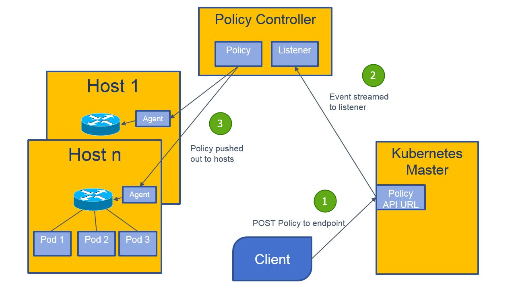
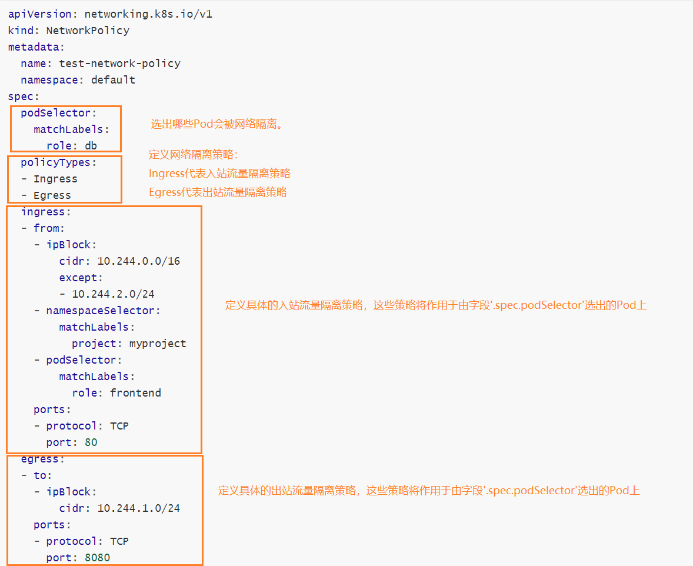
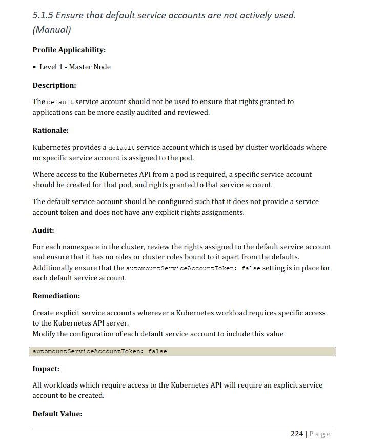
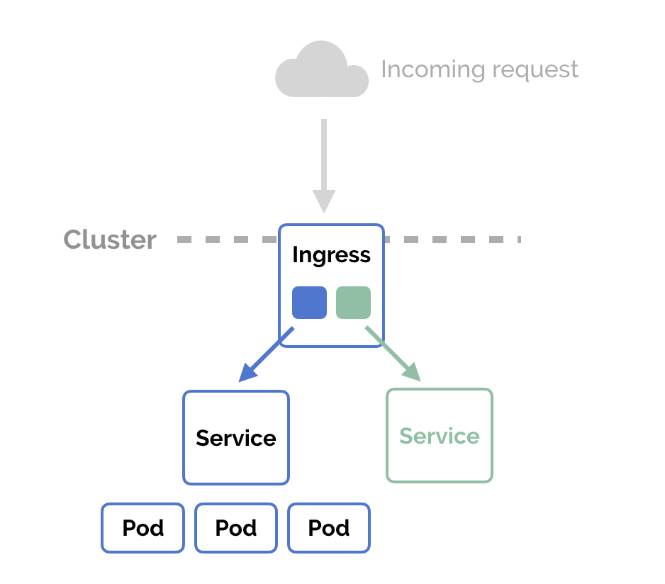
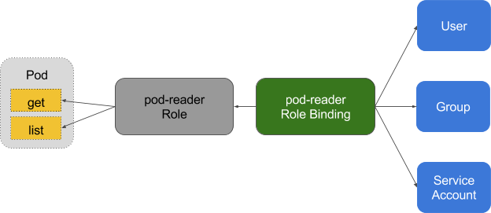

# Kubernetes 集群安全强化  Cluster Hardening

## 1. 使用网络策略NetworkPolicy限制集群网络访问  

### Kubernetes NetworkPolicy 工作原理浅析

Kubernetes 能够把集群中不同Node节点上的Pod连接起来，并且默认情况下，每个Pod之间是可以相互访问的。但在某些场景中，我们希望不同的Pod之间网络不互通，这个时候就需要进行访问控制。

Kubernetes 提供了 NetworkPolicy 的功能，使用NetworkPolicy，可以在IP 地址或端口层面（OSI 第 3 层或第 4 层）进行网络流量控制，支持按 Namespace 或者按 Pod 级别的网络访问控制，底层实现依然是 iptables。

接下来我们简单介绍一下 Kubernetes NetworkPolicy 在 Calico 上的工作原理。



1. 通过 kubectl client 创建 NetworkPolicy 资源；
2. Calico 的 Policy Controller 监听 NetworkPolicy 资源的变化（新增，修改，删除），并写入到 Calico 的 etcd 数据库中；
3. Node 节点上的 Calico Felix（Agent）从 etcd 数据库中获取 NetworkPolicy 资源，并调用 iptables 做相应配置。


#### 例子：Pod 级别的访问控制

我们要对namespace为myns，带有"role: backend"标签的所有 Pod 进行访问控制：只允许标签为"role: frontend"的Pod，并且TCP端口为6379的数据流入，其他流量都不允许。

```yaml
kind: NetworkPolicy
apiVersion: extensions/v1beta1 
metadata:
  name: allow-frontend
  namespace: myns
spec:
  podSelector:            
    matchLabels:
      role: backend
  ingress:                
    - from:              
        - podSelector:
            matchLabels:
              role: frontend
      ports:
        - protocol: TCP
          port: 6379
```


#### 例子：Namespace 级别的访问控制

我们要对标签为"role: frontend"的所有Pod进行访问控制：只允许namespace标签为"user: bob"的各Pod，并且TCP端口为443的数据流入，其他流量都不允许。

```yaml
kind: NetworkPolicy
apiVersion: extensions/v1beta1 
metadata:
  name: allow-tcp-443
spec:
  podSelector:            
    matchLabels:
      role: frontend 
  ingress:
    - ports:
        - protocol: TCP
          port: 443 
      from:
        - namespaceSelector:
            matchLabels:
              user: bob 
```


### 选择器和网络隔离策略

了解了上面的例子之后，想必大家对 NetworkPolicy 资源对象有了一定的了解。接下来，我们做一个归纳总结：

1. 使用选择器，对被选中的 Pod 进行访问控制，主要有3种选择器：
   - `podSelector`
   - `namespaceSelector`
   - `ipBlock`
2. 定义流量隔离策略：
   - Ingress：代表入站流量隔离策略
   - Engress：代表出站流量隔离策略
3. 定义具体的流量隔离策略行为。

我们再来看一个复杂一点的例子：



该NetworkPolicy示例说明：

`default` 命名空间下，带有 `role=db` 标签的 Pod 将被网络隔离，具体如何隔离呢？

1. （Ingress 规则）允许以下 Pod 连接到 `default` 命名空间下，带有 `role=db` 标签的 Pod，且只允许访问80端口：

   `.spec.ingress.from.ipBlock`， `.spec.ingress.from.namespaceSelector`， `.spec.ingress.from.podSelector`三者为或的关系。

   - IP 地址范围为 10.244.0.0 – 10.244.1.255 和 10.244.3.0 – 10.244.255.255 （即，除了 10.244.2.0/24 之外的所有 10.244.0.0/16）
     - [子网掩码换算](https://www.sojson.com/convert/subnetmask.html)

   - 所有带有 `project=myproject` 标签的命名空间，这些命名空间中的所有Pod
   - `default` 命名空间下，带有 `role=frontend` 标签的所有 Pod

2. （Egress 规则）允许从`default` 命名空间下，带有 `role=db` 标签的Pod ，连接到 CIDR 10.244.1.0/24 下 8080 端口，不允许连接其他端口。


#### `.spec.ingress.from` 选择器和 `.spec.egress.to` 选择器的行为

**podSelector 的定义**: 

在与NetworkPolicy相同的命名空间中选择特定的Pod，作为允许入站流量的来源，或允许出站流量的目的地。

**namespaceSelector 的定义**：

选择特定的命名空间，这些命名空间下的所有Pod，作为允许入站流量的来源，或允许出站流量的目的地。

注意：当 podSelector 和 namespaceSelector 同时使用时，注意它们之间的与或关系，即`and`还是`or`。

##### 举例说明：

**与的关系**：在 `from` 数组中仅包含一个元素，只允许来自标有 `role=client` 的 Pod，**且** 该 Pod 所在的名字空间中标有 `user=alice` 的连接。

```yaml
  ...
  ingress:
  - from:
    - namespaceSelector:
        matchLabels:
          user: alice
      podSelector:
        matchLabels:
          role: client
  ...
```

**或的关系**：在 `from` 数组中包含两个元素，允许来自本地命名空间中标有 `role=client` 的 Pod 的连接，**或** 来自任何命名空间中标有 `user=alice` 的任何 Pod 的连接。

```yaml
  ...
  ingress:
  - from:
    - namespaceSelector:
        matchLabels:
          user: alice
    - podSelector:
        matchLabels:
          role: client
  ...
```


**ipBlock 的定义**: 

选择特定的 IP CIDR 范围，作为允许入站流量的来源，或允许出站流量的目的地。一般为集群外部IP，因为集群内部IP，如Pod IP，具有不确定性且随机产生。

注意：请谨慎使用ipBlock

集群的入站和出站机制通常需要重写数据包的源 IP 或目标 IP。 在发生这种情况时，不确定NetworkPolicy处理的是被重写前还是之后的源 IP 或目标 IP， 并且对于网络插件、云提供商、`Service` 实现等的不同组合，其行为可能会有所不同。

对于入站流量而言，某些情况下，NetworkPolicy所作用的源IP可能是实际的原始源IP，也有可能是 `LoadBalancer` 或 Pod 的节点的IP地址。

对于出站流量而言，当Pod通过ExternalName Service出口流量时，数据包的源IP可能会被重写为Service IP和集群外部 IP，依赖于网络插件的不同实现方式， `ipBlock`的行为可能不同。


### 更多 NetworkPolicy 的用例

#### NetworkPolicy 的默认策略

默认情况下，如果命名空间中不存在任何NetworkPolicy，则所有进出该命名空间中 Pod 的流量都被允许。 

#### 拒绝所有入站流量

`podSelector`为空，表示选择`default`命名空间下所有的Pod，没有`.spec.ingress`的定义，表示拒绝所有入站流量。

[`service/networking/network-policy-default-deny-ingress.yaml`](https://raw.githubusercontent.com/kubernetes/website/master/content/zh/examples/service/networking/network-policy-default-deny-ingress.yaml) 

```yaml
apiVersion: networking.k8s.io/v1
kind: NetworkPolicy
metadata:
  name: default-deny-ingress
spec:
  podSelector: {}
  policyTypes:
  - Ingress
```

#### 允许所有入站流量

`podSelector`为空，表示选择`default`命名空间下所有的Pod，有`.spec.ingress`的定义，但是值为空，表示允许所有入站流量。

[`service/networking/network-policy-allow-all-ingress.yaml`](https://raw.githubusercontent.com/kubernetes/website/master/content/zh/examples/service/networking/network-policy-allow-all-ingress.yaml) 

```yaml
apiVersion: networking.k8s.io/v1
kind: NetworkPolicy
metadata:
  name: allow-all-ingress
spec:
  podSelector: {}
  ingress:
  - {}
  policyTypes:
  - Ingress
```

#### 拒绝所有出站流量

`podSelector`为空，表示选择`default`命名空间下所有的Pod，没有`.spec.egress`的定义，表示拒绝所有入站流量。

[`service/networking/network-policy-default-deny-egress.yaml`](https://raw.githubusercontent.com/kubernetes/website/master/content/zh/examples/service/networking/network-policy-default-deny-egress.yaml) 

```yaml
apiVersion: networking.k8s.io/v1
kind: NetworkPolicy
metadata:
  name: default-deny-egress
spec:
  podSelector: {}
  policyTypes:
  - Egress
```

#### 允许所有出站流量

`podSelector`为空，表示选择`default`命名空间下所有的Pod，有`.spec.egress`的定义，但是值为空，表示允许所有入站流量。

[`service/networking/network-policy-allow-all-egress.yaml`](https://raw.githubusercontent.com/kubernetes/website/master/content/zh/examples/service/networking/network-policy-allow-all-egress.yaml)

```yaml
apiVersion: networking.k8s.io/v1
kind: NetworkPolicy
metadata:
  name: allow-all-egress
spec:
  podSelector: {}
  egress:
  - {}
  policyTypes:
  - Egress
```

#### 拒绝所有入口和所有出站流量

`podSelector`为空，表示选择`default`命名空间下所有的Pod，没有`.spec.ingress`和`.spec.egress`的定义，表示拒绝所有入口和所有出站流量。

[`service/networking/network-policy-default-deny-all.yaml`](https://raw.githubusercontent.com/kubernetes/website/master/content/zh/examples/service/networking/network-policy-default-deny-all.yaml) 

```yaml
apiVersion: networking.k8s.io/v1
kind: NetworkPolicy
metadata:
  name: default-deny-all
spec:
  podSelector: {}
  policyTypes:
  - Ingress
  - Egress
```

#### 扩展阅读

以下Github仓库中包含了很多NetworkPolicy的各种用例和示例YAML文件，可以用于参考学习。

- https://github.com/ahmetb/kubernetes-network-policy-recipes


### 实战：使用网络插件Calico，实现NetworkPolicy  

### 实战 Install Calico for policy and flannel (aka Canal) for networking

1. 检查Kubernetes controller manager是否具备以下设置：

   - `--cluster-cidr=<your-pod-cidr>`
   - `--allocate-node-cidrs=true`

   Note：如果是由kubeadm安装的集群，可以通过查看`/etc/kubernetes/manifests/kube-controller-manager.yaml`文件获得Kubernetes controller manager的配置信息。

2. 下载 [canal.yaml](./assets/networkpolicy/canal.yaml)

   ```shell
   curl https://docs.projectcalico.org/manifests/canal.yaml > canal.yaml
   ```

   Note：如果第1步中`--cluster-cidr=10.244.0.0/16`，请跳到下一个步骤。否则请修改`canal.yaml`，打开文件中`CALICO_IPV4POOL_CIDR`部分的注释，将其值设置为和您当前集群的pod CIDR相同的值。

3. 修改`daemonset.apps/canal`的container `calico-node`部分，添加环境变量 `IP_AUTODETECTION_METHOD=interface=eth.*` 因为我们安装k8s集群的时候，使用了两张网卡，分别是NAT和Host-Only，显示的指定为Host-Only的网卡，以防Calico自动绑定的话，可能绑错网卡，导致启动失败。

   ```yaml
               # https://docs.projectcalico.org/reference/node/configuration#ip-autodetection-methods
               - name: IP_AUTODETECTION_METHOD
                 value: "interface=enp0s3"
   ```

4. 运行以下命令安装Calico

```shell
kubectl apply -f canal.yaml
```


**Trobleshooting:** 

安装完Calico后，会发现DNS不能解析了，原因未知。但通过部署新版本的coredns-1.8.0可以解决问题。所需的yaml文件在[这里](./assets/networkpolicy/部署coredns)

```shell
# 删除旧版本的coredns
kubectl delete -f ./coredns-1.6.7/coredns-1.6.7-all-in-one.yaml

# 安装`deploy.sh`所需的依赖包
yum install -y epel-release
yum install -y jq

# 安装新版本的coredns
cd ./coredns-1.8.0
./deploy.sh > coredns.yaml
kubectl apply -f coredns.yaml
```


> 参考资料
>
> https://kubernetes.io/docs/concepts/services-networking/network-policies/
>
> https://docs.projectcalico.org/getting-started/kubernetes/flannel/flannel
>
> https://devops.stackexchange.com/questions/5898/how-to-get-kubernetes-pod-network-cidr
>
> https://www.cnblogs.com/wenxinlee/p/8528180.html


## 2. 使用CIS基准来检查Kubernetes组件（kube-api-server、kube-scheduler、kubelet、etcd）的安全配置  

### 了解什么是CIS（Center for Internet Security）基准  

CIS®（Center for Internet Security）是一个非盈利组织，CIS Controls和 CIS Benchmarks 是保护IT系统和数据免受攻击的，最普遍的全球标准和公认的最佳实践。CIS Benchmarks 提供了一系列指导手册来保护容易受到攻击的操作系统、软件和网络。

> 详细 CIS Benchmarks 完整手册请参考：
>
> https://www.cisecurity.org/benchmark/kubernetes

### 安装和使用 CIS Kubernetes Benchmark 测试工具：kube-bench

[CIS_Kubernetes_Benchmark_v1.6.0.pdf](./assets/CIS_Kubernetes_Benchmark_v1.6.0.pdf) 文档超过200页，通过文档来排查Kubernetes集群的安全性，工作量是巨大的。因此CIS benchmark自动化工具kube-bench应运而生。

> 以下CIS_Kubernetes_Benchmark 文档的一页截图：



kube-bench提供多种安装方式，我们采用最简单也最常用的方式，使用kube-bench安装包的方式安装kube-bench。

```shell
VERSION=0.6.6
curl -L https://github.com/aquasecurity/kube-bench/releases/download/v${VERSION}/kube-bench_${VERSION}_linux_amd64.rpm -o kube-bench_${VERSION}_linux_amd64.rpm
sudo yum install kube-bench_${VERSION}_linux_amd64.rpm -y
# ubuntu
#apt-get install alien
#alien -i kube-bench_${VERSION}_linux_amd64.rpm
```

### 使用kube-bench检测master及worker nodes的安全隐患配置  

```shell
# run kube-bench against a master with version auto-detection
kube-bench run --targets=master
```

```sh
# specify --benchmark to run a specific CIS Benchmark version on worker node
kube-bench node --benchmark cis-1.5
```

注意：在 master node 和 worker node 上都应该使用 kube-bench 检测安全配置，因为 master node 和 worker node 的配置是不一样的。

下图为在 master node 上运行 kube-bench 之后的输出结果，我们可以对输出结果进行审阅，并决定是否做成整改。


> 参考资料：
>
> CIS Benchmarks      https://blog.51cto.com/7308310/2119037
>
> https://www.cisecurity.org/benchmark/kubernetes/
>
> [Learn Kubernetes Security - Chapter 6: Securing Cluster Components - [Benchmarking a cluster's security configuration]](https://learning.oreilly.com/library/view/learn-kubernetes-security/9781839216503/)
>
> https://github.com/aquasecurity/kube-bench
>
> Running kube-bench  https://github.com/aquasecurity/kube-bench#running-kube-bench


## 3. Ingress 的安全配置

#### 了解什么是Ingress

Kubernetes 引入了资源对象 Ingress，Ingress 为 Service 提供了可直接被集群外部访问的虚拟主机、负载均衡、SSL 代理、HTTP 路由等应用层转发功能。

Ingress-NGINX Controller 是 Nginx 官方为 Kubernetes 提供的基于 nginx 实现的 Ingress Controller。

Nginx Ingress 由以下三部分组成：

1. 资源对象 Ingress
2. Ingress 控制器
3. Nginx

##### Nginx Configuration

Ingress 控制器的目标是组装 Nginx 配置文件(nginx.conf)。具体的实现是通过监听资源对象 Ingress 的变化，更新Nginx 配置文件(nginx.conf)，并重载NGINX（nginx reload）。

下面是一个将流量发送到集群内部Service 的简单示例：



#### 为Ingress配置自签名证书，建立TLS安全通信  

你可以通过指定Secret，使Ingress包含TLS私钥和证书，从而建立TLS安全通信。Secret必须包含以下两个字段，`tls.crt`和 `tls.key`，用于指定证书和私钥。例如：

```yaml
apiVersion: v1
kind: Secret
metadata:
  name: testsecret-tls
  namespace: default
data:
  tls.crt: base64 encoded cert
  tls.key: base64 encoded key
type: kubernetes.io/tls
```

在Ingress中引用这个Secret，等于告诉Ingress controller，从客户端到负载均衡器的通信应该基于TLS。

[`service/networking/tls-example-ingress.yaml`](https://raw.githubusercontent.com/kubernetes/website/master/content/en/examples/service/networking/tls-example-ingress.yaml) 

```yaml
apiVersion: networking.k8s.io/v1
kind: Ingress
metadata:
  name: tls-example-ingress
spec:
  tls:
  - hosts:
      - https-example.foo.com
    secretName: testsecret-tls
  rules:
  - host: https-example.foo.com
    http:
      paths:
      - path: /
        pathType: Prefix
        backend:
          service:
            name: service1
            port:
              number: 80
```

#### 实战练习

前提，安装好NGINX Ingress Controller

##### 目的1： 为NGINX Ingress Controller配置默认证书

##### 目的2： 通过Ingress，为不同的host配置不同的TLS证书

1. 安装 Ingress controller，使用NGINX Ingress Controller作为 Ingress controllers。

   ```shell
   # 创建Ingress controller
   # https://kubernetes.github.io/ingress-nginx/deploy/#bare-metal-clusters
   kubectl apply -f https://raw.githubusercontent.com/kubernetes/ingress-nginx/controller-v1.1.1/deploy/static/provider/baremetal/deploy.yaml
   # 创建测试Ingress controller所需的Ingress，SVC，Pod资源
   kubectl apply -f nginx-svc-pod-ingress.yaml
   
   # 查询Ingress controller的NodePort，HTTP请求所对应的NodePort为30080，HTTPS请求所对应的NodePort为30443
   [root@k8s-master1 tzhong]# kubectl get svc -n ingress-nginx
   NAME                       TYPE        CLUSTER-IP      EXTERNAL-IP   PORT(S)                      AGE
   ingress-nginx-controller   NodePort    10.96.168.221   <none>        80:30080/TCP,443:30443/TCP   4m44s
   ```

   ```yaml
   ---
   # For k8s 1.19
   apiVersion: networking.k8s.io/v1
   kind: Ingress
   metadata:
     name: nginx-svc-ingress
     namespace: ingress-nginx
   spec:
     ingressClassName: nginx
     rules:
     - http:
         paths:
         - pathType: ImplementationSpecific
           path: "/"
           backend:
             service:
               name: nginx-svc
               port:
                 number: 80
   
   ---
   apiVersion: v1
   kind: Service
   metadata:
     labels:
       app: nginx
     name: nginx-svc
     namespace: ingress-nginx
   spec:
     ports:
     - name: web
       port: 80
       protocol: TCP
       targetPort: 80
     selector:
       app: nginx
     type: ClusterIP
     
   ---
   apiVersion: v1
   kind: Pod
   metadata:
     labels:
       app: nginx
     name: nginx
     namespace: ingress-nginx
   spec:
     containers:
     - image: nginx:1.19.4
       imagePullPolicy: IfNotPresent
       name: nginx
   ```
   
   打开浏览器，分别使用 `http://192.168.56.101:30080/` 和 `https://192.168.56.101:30443/`访问页面。
   
   页面可以正常打开，但发现证书为ingress-nginx-controller默认生成的Fake证书。
   
   
   
2. 生成自签名证书

   在[此文件目录](./nginx-ingress-controller/generate_certs)下，可以找到所需的脚本文件。在装有openssl的CentOS 7下运行`./generate_certs.sh`。

   ```shell
   [root@k8s-master1 generate_certs]# chmod 777 generate_certs.sh 
   [root@k8s-master1 generate_certs]# ./generate_certs.sh 
   CA根证书的生成步骤
   Generating RSA private key, 2048 bit long modulus
   ........+++
   ...................................................+++
   e is 65537 (0x10001)
   Signature ok
   subject=/C=CN/ST=Shanghai/L=Shanghai/O=Micro Focus/CN=tzhong.com/emailAddress=tzhong@tzhong.com
   Getting Private key
   用户证书的生成步骤
   Server Certificates...
   Generating RSA private key, 1024 bit long modulus
   ............................................++++++
   ..................++++++
   e is 65537 (0x10001)
   Signature ok
   subject=/C=CN/ST=Shanghai/L=Shanghai/O=Micro Focus/emailAddress=tzhong@tzhong.com/CN=cain.tzhong.com
   Getting CA Private Key
   # 最后我们可以获得CA证书（ca.crt，ca.key），和服务器端用户证书（server.crt，server.key）
   [root@k8s-master1 generate_certs]# ls -l
   total 36
   -rw-r--r-- 1 root root 1273 Nov 25 20:46 ca.crt
   -rw-r--r-- 1 root root 1037 Nov 25 20:46 ca.csr
   -rw-r--r-- 1 root root 1675 Nov 25 20:46 ca.key
   -rw-r--r-- 1 root root   17 Nov 25 20:46 ca.srl
   -rwxrwxrwx 1 root root  732 Nov 25 20:45 generate_certs.sh
   -rw-r--r-- 1 root root  318 Nov 25 20:45 req.cnf
   -rw-r--r-- 1 root root 1172 Nov 25 20:46 server.crt
   -rw-r--r-- 1 root root  692 Nov 25 20:46 server.csr
   -rw-r--r-- 1 root root  887 Nov 25 20:46 server.key
   ```

   `generate_certs.sh`

   ```shell
   #!/bin/bash
   echo "CA根证书的生成步骤"
   # Generate CA private key 
   openssl genrsa -out ca.key 2048
   # Generate CSR 
   openssl req -new -key ca.key -out ca.csr -subj "/C=CN/ST=Shanghai/L=Shanghai/O=Micro Focus/CN=tzhong.com/emailAddress=tzhong@tzhong.com"
   # Generate Self Signed certificate（CA 根证书）
   openssl x509 -req -days 365 -in ca.csr -signkey ca.key -out ca.crt
   
   echo "用户证书的生成步骤"
   echo "Server Certificates..."
   # private key
   openssl genrsa -out server.key 1024
   # generate csr
   openssl req -new -key server.key -out server.csr -config req.cnf
   # generate certificate
   openssl x509 -req -days 365 -in server.csr -out server.crt -CA ca.crt -CAkey ca.key -CAcreateserial -extfile req.cnf -extensions v3_req
   ```

   `req.cnf`

   ```
   [req]
   default_bits = 2048
   prompt = no
   default_md = sha256
   x509_extensions = v3_req
   distinguished_name = dn
   
   [dn]
   C = CN
   ST = Shanghai
   L = Shanghai
   O = Micro Focus
   emailAddress = tzhong@tzhong.com
   CN = cain.tzhong.com
   
   [v3_req]
   subjectAltName = @alt_names
   
   [alt_names]
   DNS.1   = adam.tzhong.com
   DNS.2   = eve.tzhong.com
   ```

3. 生成Nginx ingress controller所需的证书secret

   ```yaml
   apiVersion: v1
   data:
     # 使用命令`cat server.crt | base64 -w 0`生成 base64 encoded cert
     tls.crt: base64 encoded cert
     # 使用命令`cat server.key | base64 -w 0`生成 base64 encoded key
     tls.key: base64 encoded key
   kind: Secret
   metadata:
     name: default-ssl-certificate
     namespace: ingress-nginx
   type: Opaque
   ```

4. 为Nginx ingress controller配置自签名证书

   在 `deployment.apps/ingress-nginx-controller` 的 `.spec.template.spec.args` 部分添加以下参数，指明ingress-nginx-controller所使用的证书文件：

   `--default-ssl-certificate=$(POD_NAMESPACE)/default-ssl-certificate`

   ```shell
   # 创建Nginx ingress controller所需的证书secret
   [root@k8s-master1 tzhong]# kubectl create -f default-ssl-certificate.secret.yaml 
   secret/default-ssl-certificate created
   # 重启 deployment.apps/ingress-nginx-controller
   [root@k8s-master1 tzhong]# kubectl edit deployment ingress-nginx-controller -n ingress-nginx
   ...
   deployment.apps/ingress-nginx-controller configured
   ```

5. ```
   [root@k8s-master1 tzhong]# kubectl create -f default-ssl-certificate.secret.yaml 
   secret/default-ssl-certificate created
   
   ```

6. 再次访问 `https://192.168.56.101:30443/`，可以看到ingress-nginx-controller已经使用了自签名证书。

   

7. 创建带TLS的Ingress

   1. 为域名`adam.tzhong.com`生成证书。

      ```shell
      openssl genrsa -out adam-server.key 1024
      # generate csr
      openssl req -new -key adam-server.key -out adam-server.csr -subj "/C=CN/ST=Shanghai/L=Shanghai/O=Micro Focus/CN=adam.tzhong.com"
      # generate certificate
      openssl x509 -req -days 365 -in adam-server.csr -out adam-server.crt -CA ca.crt -CAkey ca.key -CAcreateserial -extensions v3_req
      ```

   2. 获得证书文件adam-server.crt和adam-server.key，同样的方式生成secret

      ```yaml
      ---
      apiVersion: v1
      kind: Secret
      metadata:
        name: adam-server-secret-tls
        namespace: ingress-nginx
      data:
        # 使用命令`cat adam-server.crt | base64 -w 0`生成 base64 encoded cert
        tls.crt: base64 encoded cert
        # 使用命令`cat adam-server.key | base64 -w 0`生成 base64 encoded key
        tls.key: base64 encoded key
      # 注意这里的type不一样
      type: kubernetes.io/tls
      ```

   3. 创建带TLS的Ingress

      ```yaml
      # adam-server-secret-tls-ingress.yaml
      apiVersion: networking.k8s.io/v1
      kind: Ingress
      metadata:
        name: adam-server-tls-ingress
        namespace: ingress-nginx
      spec:
        ingressClassName: nginx
        tls:
        - hosts:
            - adam.tzhong.com
          secretName: adam-server-secret-tls
        rules:
        - host: adam.tzhong.com
          http:
            paths:
            - path: /
              pathType: Prefix
              backend:
                service:
                  name: nginx-svc
                  port:
                    number: 80
      ```
      
      ```shell
      # 使用kubectl命令创建Secret和Ingress资源
      [root@k8s-master1 tzhong]# kubectl apply -f adam-server-secret-tls-ingress.yaml 
      secret/adam-server-secret-tls created
      ```
   
8. 从浏览器发请求

   1. 编辑文件`C:\Windows\System32\drivers\etc\hosts`，在`hosts`文件中添加一行：

      ```
      192.168.56.101 adam.tzhong.com
      ```

   2. 从浏览器访问`https://adam.tzhong.com:30443/`，可以发现使用的是不同的证书。

   

9. 最后我们再来对比一下，`https://192.168.56.101:30443/` 和 `https://adam.tzhong.com:30443/` 所使用的证书。

   

   

> 参考资料：
>
> https://kubernetes.github.io/ingress-nginx/deploy/#bare-metal-clusters
>
> https://kubernetes.io/docs/concepts/services-networking/ingress/#tls
>
> [How to configure a default TLS certificate for the Kubernetes Nginx ingress controller](https://success.mirantis.com/article/how-to-configure-a-default-tls-certificate-for-the-kubernetes-nginx-ingress-controller)
>
> https://kubernetes.github.io/ingress-nginx/deploy/
>
> https://kubernetes.github.io/ingress-nginx/user-guide/tls/


## 4. 部署前验证Kubernetes二进制文件

### 通过sha512sum验证Kubernetes二进制文件  

使用命令`sha512sum [FILE]`检查文件的sha512 hash，然后和官网的sha512 hash对比，是否一致。如果一致证明文件是安全的，没有被修改。如果sha512 hash不一致，证明文件已经被篡改，存在风险，不建议使用此文件。

举例来说：

1. 从官网下载kubernetes安装文件，以[kubernetes-server-linux-amd64.tar.gz](https://github.com/kubernetes/kubernetes/blob/master/CHANGELOG/CHANGELOG-1.19.md#server-binaries)为例。从官网可以查到正确的sha512 hash。如下图所示。

   | filename                                                     | sha512 hash                                                  |
   | ------------------------------------------------------------ | ------------------------------------------------------------ |
   | [kubernetes-server-linux-amd64.tar.gz](https://dl.k8s.io/v1.19.7/kubernetes-server-linux-amd64.tar.gz) | 1164b701494072f7d33edb4489d4697ffc93107ef8389dfdfbc9ab524f636dcf948a5d36e676cd1f9502b26ad36a0e33700a94a2341a134b2304571c2f47aa89 |

2. 使用命令`sha512sum kubernetes-server-linux-amd64.tar.gz`获得sha512 hash，然后和官网的sha512 hash作对比。结果一致，证明文件没有被篡改。

   ```shell
   [root@k8s-master1 tzhong]# sha512sum kubernetes-server-linux-amd64.tar.gz 
   1164b701494072f7d33edb4489d4697ffc93107ef8389dfdfbc9ab524f636dcf948a5d36e676cd1f9502b26ad36a0e33700a94a2341a134b2304571c2f47aa89  kubernetes-server-linux-amd64.tar.gz
   ```

> 参考资料：
>
> https://github.com/kubernetes/kubernetes/releases
>
> Images and their digests https://github.com/kubernetes/kubernetes/blob/master/CHANGELOG/CHANGELOG-1.19.md#downloads-for-v1191


## 5. 限制对 Kubernetes API 的访问

下图概述了如何限制对Kubernetes API的访问。用户一般通过kubectl命令或者Rest请求访问Kubernetes API。在请求到达kube-apiserver之前会经历以下几个阶段。Kubernetes的鉴权模块，Kubernetes的授权模块和Kubernetes的准入控制模块。


### Kubernetes的身份验证 / Kubernetes authentication

Authentication用于身份验证，用于鉴别”你是谁？“

一旦连接建立，HTTP请求就进入身份验证步骤。如图中的步骤1所示。集群管理员可以为Kubernetes API Server配置一个或多个身份验证模块。
身份验证模块包括客户端证书、密码、令牌（Token）。如果指定了多个身份验证模块，在这种情况下，依次尝试每个模块，只要有一个模块通过了请求，请求就通过。

如果请求不能通过身份验证，它将被以HTTP状态代码401的形式拒绝。

### Kubernetes的授权 / Kubernetes authorization

Authorization用于鉴别“你能做什么？”

Kubernetes支持多种授权模块，如ABAC模式、RBAC模式和Webhook模式。集群管理员可以为Kubernetes API Server配置一个或多个授权模块。

如果指定了多个授权模块，在这种情况下，依次尝试每个模块，只要有一个模块通过了请求，请求就通过。

如果请求不能通过授权模块，它将被以HTTP状态代码403的形式拒绝。

### Kubernetes的准入控制 / Kubernetes Admission Control

用户可以自己编写准入控制模块，然后在准入控制模块中可以对Kubernetes对象进行验证（Validating）和修改（Mutating）。

例如我们可以指定ImagePolicyWebhook，当创建Deployment时，会验证Deployment中所包含的容器镜像是否合法，比如是否来自特定的镜像仓库，只有包含合法容器镜像的Deployment才允许被创建，否则拒绝创建Deployment。

当指定了多个准入控制模块时，准入控制模块会按顺序被调用。
与身份验证和授权模块不同，只要有一个准入控制模块拒绝了请求，请求就被立即拒绝。

## 6. RBAC（基于角色的访问控制）

### 了解什么是RBAC

RBAC是基于角色的访问控制（`Role-Based Access Control` ）。在RBAC中，权限与角色相关联，用户通过成为适当角色而得到这些角色的权限。这就极大地简化了权限的管理。

RBAC认为授权实际上是`Who` 、`What` 、`How` 三元组之间的关系，也就是`Who` 对`What` 进行`How` 的操作，也就是“主体”对“客体”的操作。

Who：是权限的拥有者或主体，如在Kubernetes中的ServiceAccount。

What：是操作的对象，如在Kubernetes中的Deployment，Pod等Kubernetes对象。

How：具体的权限，如 "get", "watch", "list"等。

### RBAC的使用，创建ServiceAccount, Role/ClusterRole 和 RoleBinding /ClusterRoleBinding

例如，创建一个ServiceAccount，有权限对命名空间ns1中的Pod进行`get`, `watch` 和 `list` 



```shell
# 创建命名空间ns1
kubectl create ns ns1
# 创建ServiceAccount
kubectl create sa pod-reader -n ns1
# 创建Role
kubectl create role pod-reader --verb=get --verb=list --verb=watch --resource=pods -n ns1
# 创建RoleBinding
kubectl create rolebinding pod-reader --role=pod-reader --serviceaccount=ns1:pod-reader -n ns1

# 验证
# 输出yes，具有get pods的权限
kubectl auth can-i get pods -n ns1 --as system:serviceaccount:ns1:pod-reader
# 输出yes，具有watch pods的权限
kubectl auth can-i watch pods -n ns1 --as system:serviceaccount:ns1:pod-reader
# 输出no，system:serviceaccount:ns1:pod-reader没有创建deployments的权限
kubectl auth can-i create deployments -n ns1 --as system:serviceaccount:ns1:pod-reader
```

下面我们在看看ServiceAccount，Role 和 RoleBinding对应的yaml文件。

```yaml
# kubectl get sa pod-reader -n ns1 -o yaml
apiVersion: v1
kind: ServiceAccount
metadata:
  name: pod-reader
  namespace: ns1
```

```yaml
# kubectl get role pod-reader -n ns1 -o yaml
apiVersion: rbac.authorization.k8s.io/v1
kind: Role
metadata:
  name: pod-reader
  namespace: ns1
rules:
- apiGroups:
  - ""
  resources:
  - pods
  verbs:
  - get
  - list
  - watch
```

```yaml
# kubectl get rolebinding pod-reader -n ns1 -o yaml
apiVersion: rbac.authorization.k8s.io/v1
kind: RoleBinding
metadata:
  name: pod-reader
  namespace: ns1
roleRef:
  apiGroup: rbac.authorization.k8s.io
  kind: Role
  name: pod-reader
subjects:
- kind: ServiceAccount
  name: pod-reader
  namespace: ns1
```

Role 和 RoleBinding 是针对某个命名空间的权限控制，而ClusterRole 和 ClusterRoleBinding 的概念跟Role 和 RoleBinding是一样的，唯一的区别在于ClusterRole 和 ClusterRoleBinding是整个集群级别的权限控制，相当于给整个集群中的所有命名空间赋予权限。

## 7. ServiceAccount的最佳安全实践

### 禁用默认的ServiceAccount

当你创建Pod时，如果未指定ServiceAccount，Kubernetes将自动为其分配一个默认ServiceAccount，即`default`。Pod中的应用程序即可通过此默认ServiceAccount访问Kubernetes API，但是你的Pod可能根本不需要访问Kubernetes API，无形中，我们将Pod的权限放大了。

因此我们可以为默认ServiceAccount添加字段 `automountServiceAccountToken:false`，这样Kubernetes将不会为Pod自动分配默认ServiceAccount。

这是来自CIS_Kubernetes_Benchmark_v1.6.0 中的一条建议，“Ensure that default service accounts are not actively used.”

```
apiVersion: v1
kind: ServiceAccount
metadata:
  name: default
automountServiceAccountToken: false
```

### 对新创建的ServiceAccount应用最小权限原则

根据定义，最小权限是指每个程序和系统用户都应该具有完成任务所必需的最小权限集合。

假设ServiceAccount SA1需要对Pod具有get，watch和list的权限，那么它的权限就应该被限定于此，而不能具有查看Secret或者创建Deployment等其他权限。

应用最小权限的原则，就是为了保护数据以及功能，避免受到错误或者恶意行为的破坏。然而，在大部分组织的实际工作中，真正的普遍情况是，当一个开发人员或者其他相关人员请求开通访问权限时，系统管理员或者解决方案架构师都是盲目的提供了访问权限且没有限制，这样就导致了在组织内部有很多的漏洞，极有可能会造成重大安全风险。

## 8. 升级Kubernetes

时常更新 Kubernetes 版本，应用一些安全新特性，以及修复一些已知漏洞。

### 使用kubeadm升级Kubernetes集群  

**升级Kubernetes集群的主节点**

```shell
# Drain the node 通过将节点标记为不可调度并逐出工作负载，为节点的维护升级做好准备
kubectl drain <node-to-drain> --ignore-daemonsets
# 安装想要的kubeadm版本
apt-get update
apt-get install kubeadm=1.20.1-00
# 此命令检查集群是否可以升级，并获取可以升级到的版本。
kubeadm upgrade plan
# 将Kubernetes集群的master节点升级到v1.20.1
kubeadm upgrade apply v1.20.1
# 验证集群的升级情况
kubeadm upgrade plan
# 升级kubelet和kubectl
apt-get install kubelet=1.20.1-00 kubectl=1.20.1-00
systemctl daemon-reload && systemctl restart kubelet
# 验证节点的kubelet版本
kubectl get node
# Uncordon the node 将节点重新标记为可调度
kubectl uncordon <node-to-drain>
```

**升级Kubernetes集群的工作节点**

```shell
# Drain the node 通过将节点标记为不可调度并逐出工作负载，为节点的维护升级做好准备
kubectl drain <node-to-drain> --ignore-daemonsets
# 升级kubelet和kubectl
apt-get update
apt-get install kubeadm=1.20.1-00
# 升级Kubernetes集群的工作节点
kubeadm upgrade node
# 升级kubelet和kubectl
apt-get install kubelet=1.20.1-00 kubectl=1.20.1-00
# 验证节点的kubelet版本
kubectl get node
# Uncordon the node 将节点重新标记为可调度
kubectl uncordon <node-to-drain>
```