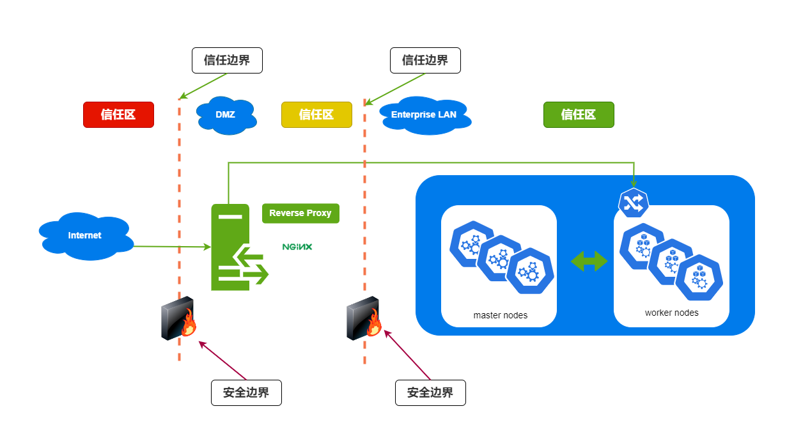
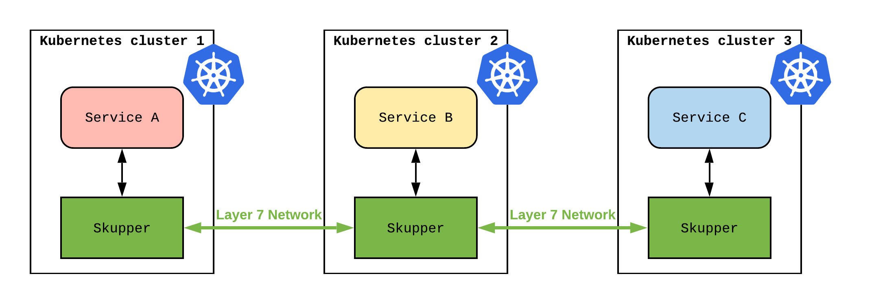
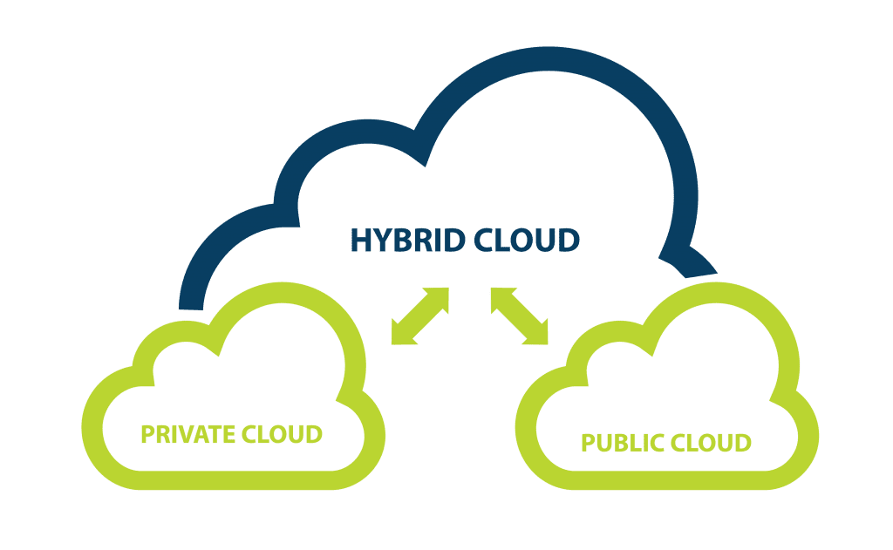
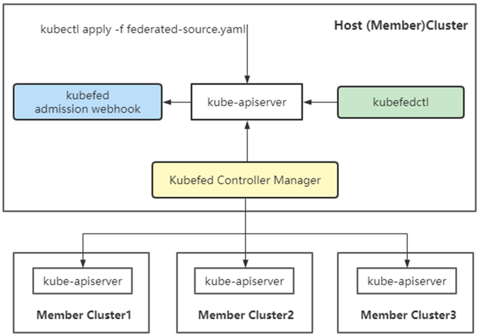
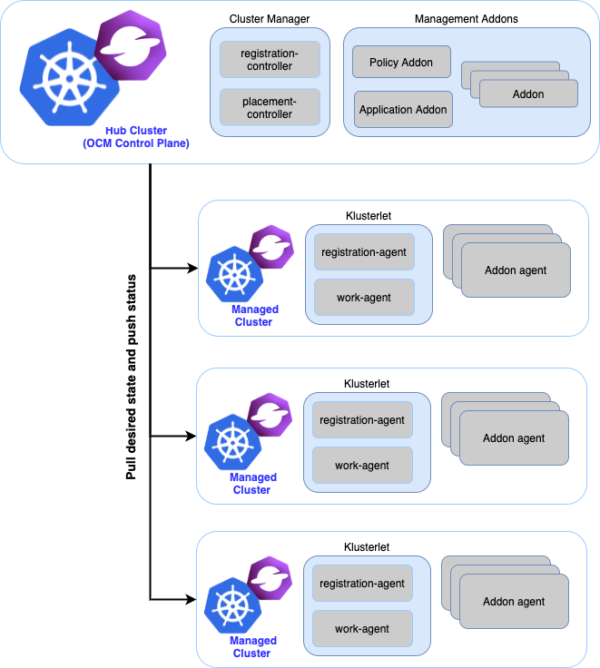
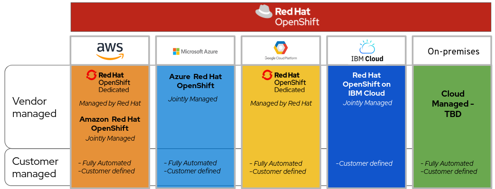
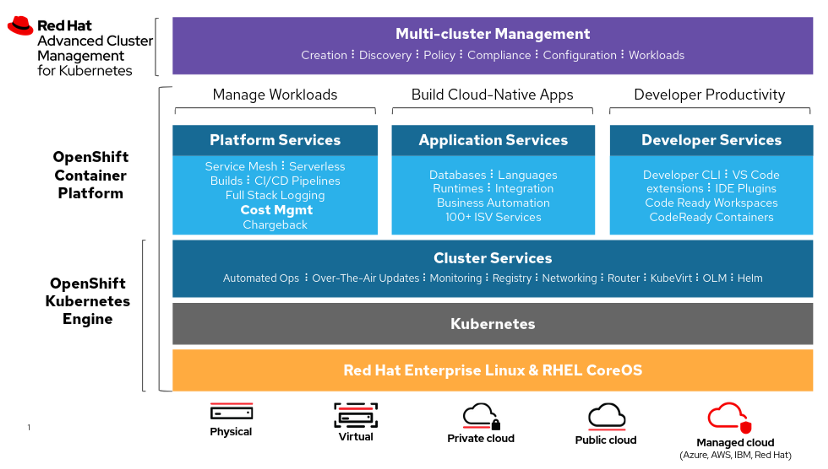

# Kubernetes 和 DMZ

很多企业为了安全，会对网络做网络分区，比如将直接对外提供服务的系统（internet facing systems）放在 DMZ 区域，而企业的内部系统放在内部网络中。如下图所示：



如果说，某企业在进行应用程序的容器化，并选择了 Kubernetes 作为容器编排工具。并且提出了这样的需求，对于 DMZ 和 Enterprise LAN 中的应用程序，期望可以共享同一个 Kubernetes 集群，如何做到安全最大化？

根据上面的需求，其实可以衍生出几个问题：

1. 如果共享同一个 Kubernetes 集群，如何强化 Kubernetes 集群安全？
2. 这个需求是否合理？不应该共享集群，而是在 DMZ 和 Enterprise LAN 中单独部署 Kubernetes 集群。
3. 其他 Kubernetes 集群部署方案？多集群管理方案？

### DMZ 和 Enterprise LAN 共享 Kubernetes 集群，如何强化 Kubernetes 集群安全？

#### 1. Namespace 逻辑隔离

为 DMZ 和 Enterprise LAN 创建各自的 Namespace，例如 Namespace，dmz，enterprise-lan，将 DMZ 和 Enterprise LAN 中的应用程序部署在各自的 Namespace 中，实现逻辑上的隔离。


#### 2. NetworkPolicy 实现网络隔离

使用 NetworkPolicy 实现网络隔离。

- 如：enterprise-lan 中的 Pod，只允许 namespace 内部的访问。

  ```yaml
  ---
  apiVersion: v1
  kind: Namespace
  metadata:
    name: enterprise-lan
    labels:
      name: enterprise-lan
  
  ---
  kind: NetworkPolicy
  apiVersion: networking.k8s.io/v1
  metadata:
    name: enterprise-lan
    namespace: enterprise-lan
  spec:
    podSelector: {}
    policyTypes:
    - Ingress
    - Egress
    ingress:
      - from:
        - namespaceSelector:
            matchLabels:
              name: enterprise-lan
    egress:
      - to:
        - namespaceSelector:
            matchLabels:
              name: enterprise-lan
  ```


#### 3. 专用节点 Dedicated Nodes

为 DMZ 和  Enterprise LAN 分配各自专用的 K8s 工作节点。使属于 DMZ 的 Pod 只能被调度到属于 DMZ 的工作节点。可以使用 Taints and Tolerations实现。

- 我们为 dmz-node1 添加污点 `node-type=dmz`, taint effect 为 `NoSchedule`。这意味着Pod就不能被调度到该节点，除非Pod具有相对应的 `Tolerations`。

  ```sh
  # 我们为 dmz-node1 添加污点 `node-type=dmz`, taint effect 为 `NoSchedule`。这意味着Pod就不能被调度到该节点，除非Pod具有相对应的 `Tolerations`
  kubectl taint nodes node1 node-type=dmz:NoSchedule
  ```

- 为 Pod 配置对应的 `Tolerations`。Pod 就可以被正常的调度到 dmz-node1上了。

  ```yaml
  apiVersion: v1
  kind: Pod
  metadata:
    name: nginx
    namespace: dmz
    labels:
      env: test
  spec:
    containers:
    - name: nginx
      image: nginx
      imagePullPolicy: IfNotPresent
    tolerations:
    - key: "node-type"
      operator: "Equal"
      value: "dmz"
      effect: "NoSchedule"
  ```

  

#### 4. RBAC 权限控制

- 创建两个 ServiceAccount，如 dmz-sa 和 enterprise-lan-sa，使用各自的 ServiceAccount 操作各自的 Namespace。
- 给 DMZ 的 ServiceAccount 依据最小权限原则，分配最小可用的权限，比如只能 get dmz 下的 k8s 资源。


#### 5. Namespace 与专用节点绑定

将创建在 dmz namespace 下的 Pod 与专用节点绑定，dmz namespace 下的 Pod只能被调度到专用节点上。可以使用 PodNodeSelector Admission Controller 达到此目的。

> 但 PodNodeSelector Admission Controller 至今还是 Kubernetes v1.5 [alpha]，慎用。

```yaml
# First, you need to enable PodNodeSelector Admission Controller in your kubernetes-apiserver
# Edit `/etc/kubernetes/manifests/kube-apiserver.yaml`
# - find `--enable-admission-plugins=`
# - add `PodNodeSelector` parameter

# Now, you can specify `scheduler.alpha.kubernetes.io/node-selector` option in annotations for your namespace, example:
---
apiVersion: v1
kind: Namespace
metadata:
  name: dmz
  labels:
    name: dmz
 annotations:
   scheduler.alpha.kubernetes.io/node-selector: node-type=dmz
   
# After these steps, all the pods created in this namespace will have this section automatically added:
nodeSelector
  node-type=dmz
```

> 参考资料：
>
> https://kubernetes.io/docs/reference/access-authn-authz/admission-controllers/#podnodeselector
>
> https://stackoverflow.com/questions/52487333/how-to-assign-a-namespace-to-certain-nodes


### 在 DMZ 和 Enterprise LAN 中单独部署 Kubernetes 集群

在 DMZ 和 Enterprise LAN 中单独部署两套 Kubernetes 集群，无疑是最安全的方式，网络存储等方面，可以直接做到硬隔离，更安全。

但缺点也是很明显的，需要维护两套 Kubernetes 集群，维护成本更高，两套 Kubernetes Master 节点的硬件资源，硬件成本上升。

但我们同时也要考虑共享集群带来的各种复杂度，各种强化 Kubernetes 集群安全带来的技术复杂度，以及维护成本。还有 DMZ 和 Enterprise LAN 之间的防火墙配置，会变得更复杂，由此而带来的维护成本。

一般而言，对于 Kubernetes Master 节点，我们不需要很高的硬件配置，只要满足 kube-system 基础组件的运行即可。（8 CPU 32 G RAM，Disk 200G）



> 参考资料：
>
> https://www.reddit.com/r/kubernetes/comments/8t4itf/kubernetes_and_the_dmz/


### 其他 Kubernetes 集群部署方案？多集群管理方案？

#### 为什么企业需要多集群？

##### 单集群 Kubernetes 承载能力有限

首先看看官方文档中关于单集群承载能力的描述：在 Kubernetes v1.12，Kubernetes 支持最多具有 5000 个节点的集群。更具体地说，Kubernetes 支持满足以下所有条件的配置：

-  不超过 5000 个节点
-  Pod 总数不超过 150000（15 万）
-  总共不超过 300000 （30万）个容器
-  每个节点不超过 100 个 Pod

虽然现在 Kubernetes 已经发展到 v1.25，但是关于单集群承载能力一直没有变化。可见提高单集群负载能力并不是社区的发展方向。

如果我们的业务规模超过了 5000 个节点，那么企业不得不考虑多个集群。


##### 混合云或是多云架构决定了需要多个集群

到目前，其实多云或是混合云的架构已经很普遍了。比如对于一家全球化的公司来说，提供全球（Global）服务，就需要在不同的地方建立数据中心，已满足不同地区的业务需要。

另外公有云并没有大家想象中的那样，具有海量资源。比如公有云的头部客户搞大促需要很大数量机器的时候，都是需要提前和公有云申请，然后公有云提前准备的。

为了避免被单家供应商锁定，或是出于成本等考虑，企业选择了多云架构，也决定了企业需要多个集群。



##### 不把鸡蛋放到一个篮子里

即使前面两条都未满足，那么我们是否要把所有的工作负载都部署到一个集群呢？

如果集群控制面出现故障，那么所有的服务都会受到影响。

也许大家认为 Kubernetes 的控制面本身就是高可用的（三个 api-server），不会有整个控制层不可用的可能。

其实则不然，我们在生产环境中，已经处理过很多次类似的故障了。如果一个应用（一般指需要调用 api-server 接口的应用）在大量地调用 api-server，会导致 api-server 接连挂掉，最终不可用。即使切换到了第二个 api-server，第二个 api-server 也会承受不住大量调用而最终奔溃。最终解决的办法只有找到故障应用，并把故障应用删除。

所以在生产环境中，一是需要严格控制访问 api-server 的权限，二是需要做好测试，三是可以考虑把业务应用和基础设施应用分开部署。其实单集群和多集群的选择就和”选择一台超级计算机 or 多台普通机器“的问题类似。后来分布式计算的发展，说明大家选择了多台普通机器。


#### 多集群的好处

多集群在以下三个方面，有着更好的表现：

-  可用性
-  隔离性
-  扩展性

#### 多集群应用程序架构

实际上，可以通过两种模型来构建多集群应用程序架构

-  副本 ：将应用程序复制到多个可用性区域或数据中心，每个集群都运行应用程序的完整副本。我们可以依靠 DNS Global 负载均衡器 将流量路由到距离用户最近的集群，以实现最小的网络延迟。如果我们一个集群发生故障，我们可以将流量路由到其他健康集群，实现故障转移。
-  按服务划分：按照业务相关程度，将应用部署在不同的集群。这种模型，提供了非常好的隔离性，但是服务划分却比较复杂。

#### 多集群落地方案

- Kubernetes Cluster Federation
- Open Cluster Management
- OpenShift Multi-Clustering

> 参考资料：
>
> https://www.51cto.com/article/698841.html


#### Kubernetes Cluster Federation

> Nov 13, 2020 第一版发布，至今还未正式 Release。KubeFed 还处于 beta 版本。

Kubernetes Cluster Federation，简称KubeFed。

KubeFed（Federation v2）即 Kubernetes 联邦，是开源的 Kubernetes 多集群解决方案，目前的最新版本是 v0.9.2，还处于beta阶段。Federation v1 版本因为在扩展性、权限管理、架构等方面存在一定缺陷而被废弃。v2版本对v1版本架构进行了优化，使用 Operator（CRD + Controller）的方式定义一系列自定义联邦资源，并通过自定义 Controller 实现跨集群资源协调能力。



KubeFed 的所有组件部署在一个集群中，该集群作为Host集群，KubeFed 通过 api 访问其他成员集群的 kube-apiserver 实现对成员集群的管理，KubeFed 所在集群也可以配置为成员集群。

KubeFed 主要由三个组件组成：

Kubefed admission webhook：提供了准入控制，作用在自定义资源的创建过程的校验阶段。

Kubefed controller-manager：KubeFed 控制平面，处理自定义资源以及协调不同集群间的资源状态。

Kubfedctl：二进制管理工具，实现用户和 KubeFed 的交互，比如集群注册、资源注册等。


##### 为什么要使用集群联邦

Federation 对于单个集群没有用处。基于下面这些原因你可能会需要多个集群：

- 高可用：通过在集群间分布负载并自动配置 DNS 服务和负载均衡，federation 最大限度地减少集群故障的影响。
- 避免厂商锁定：通过更简单的跨集群应用迁移方式，federation 可以防止集群厂商锁定。

- 低延迟：通过在多个区域部署集群可以最大限度减少区域近端用户的延迟。
- 故障隔离：拥有多个小集群可能比单个大集群更利于故障隔离（例如：在云服务提供商的不同可用区中的多个集群）。
- 混合云：可以在不同的云服务提供商或本地数据中心中拥有多个集群。

###### 警告

虽然 federation 有很多吸引人的使用案例，但也有一些注意事项：

- 增加网络带宽和成本：federation 控制平面监控所有集群以确保当前状态符合预期。如果集群在云服务提供商的不同区域或者不同的云服务提供商上运行时，这将导致明显的网络成本增加。
- 减少跨集群隔离：federation 控制平面中的 bug 可能影响所有集群。
- 成熟度：federation 项目相对比较新，还不是很成熟。并不是所有资源都可用，许多仍然处于 alpha 状态。


> 参考资料：
>
> https://github.com/kubernetes-sigs/kubefed
>
> https://cloud.tencent.com/developer/article/1943631


#### Open Cluster Management

Open Cluster Management 是一个由开源社区驱动的混合云多集群管理平台。可以通过简单开放的API去使用集群的注册，工作负载分发，以及动态的资源配置路由等功能。

> Open Cluster Management 属于 CNCF 项目，并由红帽开源。



> 参考资料：
>
> https://open-cluster-management.io/
>
> https://github.com/open-cluster-management


#### OpenShift Multi-Clustering

OpenShift 混合云，多家云供应商（例如 aws，azure，google，ibm）都提供 Openshift 服务。我们可以认为 Openshift 就是 Redhat 出品的安全强化版 Kubernetes 集群。同时 Openshift 也支持本地（On-premises ）部署。

通过  Red Hat Advanced Cluster Management — RHACM，我们可以将多个 Openshift 集群统一管理起来。



#####  Red Hat Advanced Cluster Management — RHACM



> 参考资料：
>
> https://jimmysong.io/kubernetes-handbook/concepts/multicluster.html
>
> https://www.sofastack.tech/blog/next-kubernetes-frontier-multi-cluster-management/


### 一些建议

一些个人建议，如果说对于金融行业来说。建议使用多集群方案，如果最终决定还是使用单集群方案，建议使用 OpenShift，不过 OpenShift 是商业版，需要花钱买 License。

多集群方案的话，建议使用 Open Cluster Management 或者  Red Hat Advanced Cluster Management — RHACM，Open Cluster Management 开源免费，RHACM 收费。但还是建议上 RHACM。

