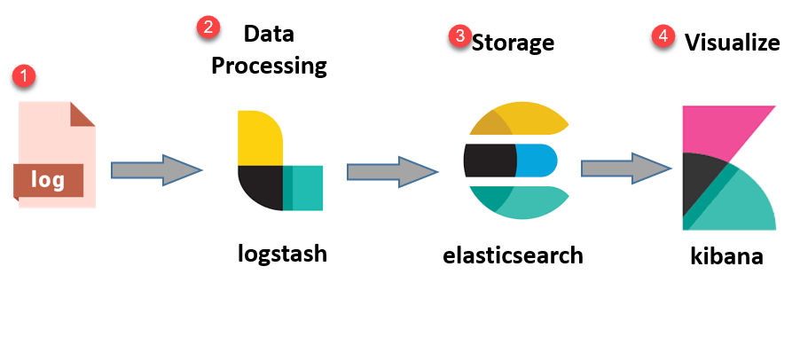
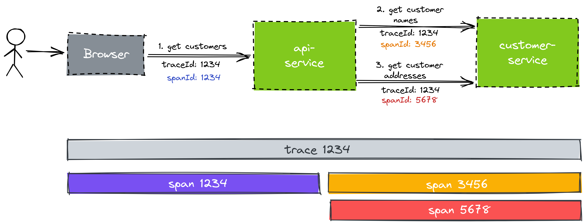
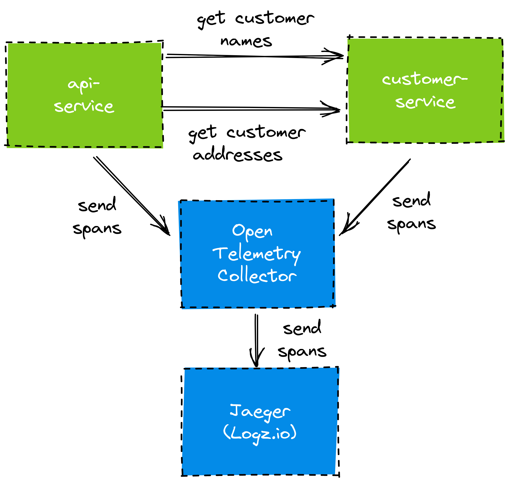
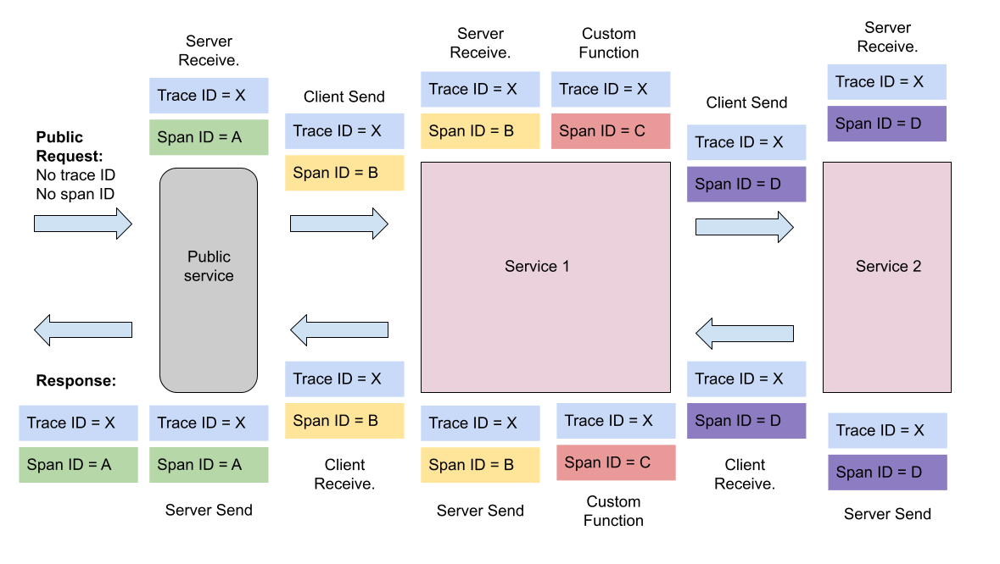
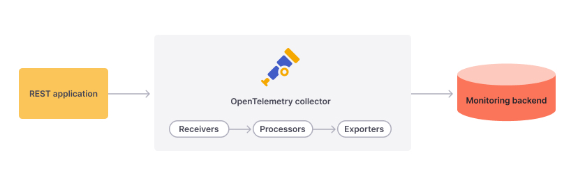
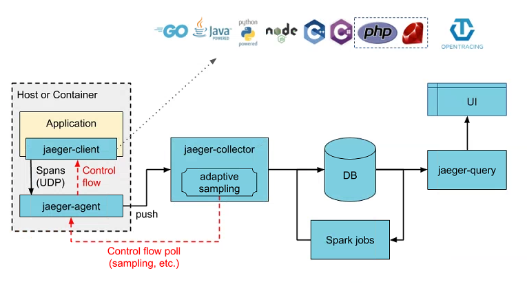
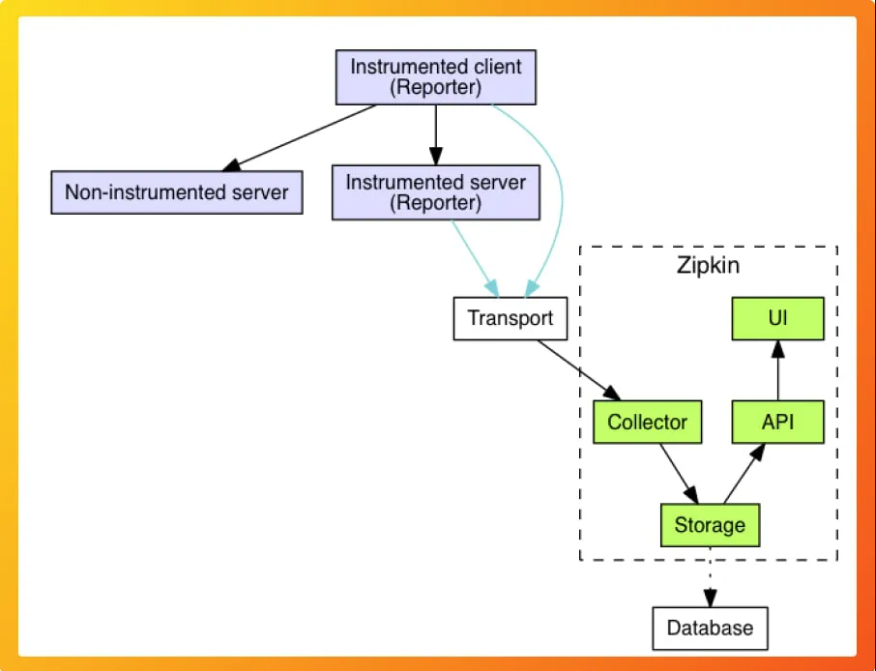
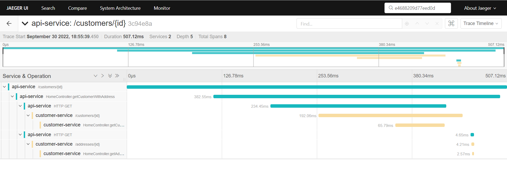
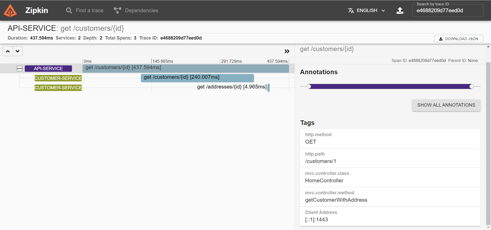

# 微服务日志链路追踪：Spring Cloud Sleuth

## 微服务日志存在的问题是什么？

假设：

- 我们有一个非常复杂的分布式系统，微服务之间通过HTTP进行通信；  
- 一个来自UI的请求需要两个来自不同微服务的数据才能完成；  
  - 这两个微服务也会调用其他服务组件，内部的或者外部的服务；  
- 如果请求失败，那么第一个操作可能是检查日志；  
  - 日志文件可能处于不同的服务器上，需要在不同的服务器之间跳转查看日志；
  - 检查日志发现，在对第一个服务的HTTP调用期间抛出了一个异常；
- 修复了第一个服务的异常情况，但是请求依然失败，现在我们需要开始检查第二个服务的日志；  
  - 但是第二个服务很忙，很难将哪些日志行与原始错误请求相关联；  
  - 我们只能不断的触发异常请求，期望能发现一些相关联的异常日志（费眼）；

那如何解决这个问题呢？大家第一想到的可能是 ELK 方案，Elasticsearch，Logstash 和 Kibana，Logstash 负责将日志解析并发送到Elasticsearch，Elasticsearch 负责存储已经索引日志文件，Kibana 用于页面展示日志。

虽然 ELK 可以帮助我们聚合和索引日志，但并不能达到日志链路追踪的目的。




## 什么是微服务日志链路追踪？

微服务的特点决定了它会存在较长的调用链路，一个请求一般会跨3个以上的服务（网关->应用聚合层->服务层）而跟踪它的调用情况是异常定位及性能优化的关键之一。要使得日志具备可跟踪性，我们势必需要在日志中，记录每个请求的唯一跟踪Id（trace id），我们可以在HTTP Header中添加跟踪Id来达到目的。

根据Http Header中是否存在 trace id，如果不存在则认为是新的请求，进而生成一个UUID作为 trace id，如果存在则沿用这个trace id，然后在打印日志信息的时候加上这个 trace id。

实际上这也是Google Dapper(《Dapper, a Large-Scale Distributed Systems Tracing Infrastructure》)的核心思路，Google Dapper是Google的日志追踪服务。

并且 Tracing（追踪），metrics（度量指标） 和 logs（日志）一起构成了可观察性的三个基石，可观察性旨在增加可见性，并让团队中的任何人在复杂的系统中从结果找到原因。 

在讲解如何实现日志链路追踪之前，我们需要先了解一些概念，什么是 trace id？什么是span id？

### Traces and Spans

即使在单体应用时代，通过日志文件追踪 bug 的线索也是极其困难的一件事情。 我们想要查找错误的根本原因，往往是在错误发生时间点的附近搜索可用的日志信息，比如一些 Exception 的堆栈信息。 

理想情况下，当一个请求进入系统的时候，此请求经过的每一个方法的日志信息都应该包含一个唯一标识的关联ID（correlation ID），这样我们就可以在日志文件中搜索此关联ID，并找出所有此请求相关的日志信息。

在分布式系统中，日志链路跟踪变得更加困难，因为响应单个请求的服务可能涉及到多个运行在不同服务器上的微服务。这个时候，不同的微服务，他们的关联ID是不同的，我们如何才能把不同服务之间的日志关联起来呢？（答案是 span id。）

首先，我们来看一下下面这张图，一个包含两个微服务的分布式系统。



浏览器向 api-service 发出请求，以获得客户的详细信息并将其展示给用户。 api-service 本身并不能处理该请求，它必须向 customer-service 发出两次调用，以分别获得客户的姓名和地址信息。 

这只是本文的一个简单示例。 在现实世界中，响应一个请求的服务可能达到数十个。 

从一个服务到下一个服务的每一次“跳跃”被称为“span”，一个”跨度“。 将所有的”span“聚合在一起，就构成了一个”trace“，一个“跟踪”。 

每个trace和span都有一个唯一性id。每个服务都希望将 trace id 传递给下一个服务，以便下一个服务可以在其日志中使用相同的 trace id作为关联ID。trace id 的传播通常通过HTTP Header完成。 

除了在日志中使用 trace id 和 span id 来关联来自不同服务的日志输出外，我们还可以将这些 trace id 和 span id 发送到一个中央跟踪服务器，例如 ZipKin 或者 Jaeger，该服务器允许我们分析跟踪日志。具体可以参考本文的 ”实践“ 部分。

*日志收集*




## 如何实现微服务日志链路追踪？

在具体讲解如何实现微服务日志链路追踪之前？我们需要首先了解一下下面这些有趣的项目？

- Spring Cloud Sleuth
- OpenTelemetry
- Jaeger
- Zipkin

### Spring Cloud Sleuth

我们可以使用 Spring Cloud Sleuth 将 trace id 和 span id 注入到日志条目中。 trace id 是整个请求流将共享的唯一标识符。它就像胶水一样把所有的日志条目粘在一起。span id 用于将两个微服务串联起来，可以认为是两个微服务之间的交互点。

 

根据上图，我们可以发现 Trace ID = X 在整个处理流中始终保持不变，根据 Trace ID 我们可以找到所有相关请求，但还不能确定他们之间的顺序。注意看 Span ID = B，它作为一个跨度，表明了 Public service 和 Service 1 之间的调用关系。


### OpenTelemetry

OpenTelemetry 属于 CNCF 的孵化项目。OpenTelemetry 是一个APIs 和 SDKs 的工具集，可以用它来测量、生成、收集和导出遥测数据(度量指标、日志和跟踪)，以帮助分析软件的性能和行为。

 

### Jaeger

Jaeger是由Uber开发的分布式跟踪平台，现在是CNCF的毕业项目，它的灵感来自于 Google's Dapper 和 Zipkin。 由于跟踪是由不同的服务生成的，因此可以将它们发送到 Jaeger (或Zipkin)集中存储。 一旦跟踪被发送到 Jaeger，Jaeger 提供了 UI 界面来可视化查询一个完整的跟踪，生成拓扑图，帮助分析定位异常的原因，并可以监视服务调用的性能和延迟。




### Jaeger vs Zipkin

Zipkin 和 Jaeger 都是非常流行的开源分布式跟踪工具。 Zipkin 最初的灵感来自于 Google's Dapper，由Twitter开发。 Zipkin 是一个比Jaeger 想到成熟（老旧）的项目，Zipkin 在2012年首次作为开源项目发布。 Jaeger 最初由Uber开发，在2015年开放源代码。 

#### Jaeger and Zipkin: 主要组件

Jaeger 的源代码主要是用Go编写的，而 Zipkin 的源代码主要是用 Java 编写的。 Jaeger 和 Zipkin 的架构有些相似。 两者的架构中都包括如下组件: 

- 工具库 / Instrumentation Libraries
  - 从应用程序代码生成遥测数据(日志、度量和跟踪)。 Jaeger 和 Zipkin 都提供特定于语言的工具库，能够在请求上添加 trace id 和 span id。
- Collectors
  - 收集遥测数据。
- Query Service and web UI
  - 提供了 UI 界面来可视化查询一个完整的跟踪。
- Database Storage
  - Jaeger 和 Zipkin 都为跟踪数据提供了可插拔的存储后端。 Cassandra 和 Elasticsearch 是 Jaeger主要支持的存储后端。
  - Zipkin 支持将数据存储在 Cassandra，Elasticsearch 和 MySQL 中。 




#### 对比 Jaeger 和 Zipkin

Jaeger 和 Zipkin 在架构上有很多相似之处。 虽然 Zipkin 更成熟，但 Jaeger 的设计更现代化，并且支持水平扩展。 

- Jaeger 支持水平扩展，而 Zipkin 属于单体应用。
- 由于 Jaeger 与 Kubernetes 同属于 CNCF 项目，更云原生。可以以容器的方式运行。Zipkin 也可以以容器方式运行。
- 在社区支持方面，Jaeger 也渐渐赶上 Zipkin。 Zipkin 是一个独立的项目，在容器化流行之前就已经存在。 但 Jaeger 作为 CNCF 的一部分，是云原生架构中公认的项目。 

在分布式跟踪工具领域，Jaeger 和 Zipkin 都是强有力的竞争者。 


## 实践

> 主要参考文章：https://reflectoring.io/spring-boot-tracing/

### 1. Install OpenTelemetry

 - Download OpenTelemetry Collector from

   - https://opentelemetry.io/docs/collector/getting-started/#windows-packaging
   - https://github.com/open-telemetry/opentelemetry-collector-releases/releases

 - Start otel-collector

   ```
   otelcol.exe --config=./otel-collector-config.yaml
   ```

   ```yaml
   # otel-collector-config.yaml
   receivers:
     # Make sure to add the otlp receiver.
     # This will open up the receiver on port 4317
     otlp:
       protocols:
         grpc:
           endpoint: "0.0.0.0:4317"
   processors:
   extensions:
     health_check: {}
   exporters:
     jaeger:
       endpoint: "http://localhost:14250/"
     zipkin:
       endpoint: "http://localhost:9411/api/v2/spans"
     logging:
       loglevel: debug
   service:
     extensions: [health_check]
     pipelines:
       traces:
         receivers: [otlp]
         processors: []
         exporters: [jaeger, zipkin, logging]
   ```


### 2. Install Jaeger

- Download Jaeger from https://www.jaegertracing.io/docs/1.38/getting-started/
- Use CMD to run `jaeger-all-in-one.exe`
- You can then navigate to `http://localhost:16686` to access the Jaeger UI.


### 3. Install Zipkin

If you have Java 8 or higher installed, the quickest way to get started is to fetch the [latest release](https://search.maven.org/remote_content?g=io.zipkin&a=zipkin-server&v=LATEST&c=exec) as a self-contained executable jar:

```sh
curl -sSL https://zipkin.io/quickstart.sh | bash -s
java -jar zipkin.jar
```


### 4. Start Spring Application

You can download the code from https://github.com/cainzhong/spring-cloud-sleuth-poc.

1. Start `api-service` with VM options:

   ```
   -javaagent:C:/Dev/repository/tzhong/tzhong/spring-cloud-sleuth-poc/otel-collector/opentelemetry-javaagent.jar
   -Dotel.service.name=api-service
   -Dotel.traces.exporter=jaeger
   -Dotel.exporter.jaeger.endpoint=http://localhost:14250
   -Dotel.javaagent.debug=true
   ```

2. Start `customer-service` with VM options:

   ```
   -javaagent:C:/Dev/repository/tzhong/tzhong/spring-cloud-sleuth-poc/otel-collector/opentelemetry-javaagent.jar
   -Dotel.service.name=customer-service -Dotel.traces.exporter=jaeger 
   -Dotel.exporter.jaeger.endpoint=http://localhost:14250 
   -Dotel.javaagent.debug=true
   ```

   

### 5. Test

```sh
curl --location --request GET 'http://localhost:9090/customers/1'
```


### 6. Open Jaeger or ZipKin

- You can then navigate to `http://localhost:16686` to access the Jaeger UI.

  

- You can then navigate to `http://127.0.0.1:9411/` to access the ZipKin UI.

  


## Reference

1. 微服务追踪：Spring Cloud Sleuth
   - https://www.jianshu.com/p/4303385b7512
   - https://spring.io/projects/spring-cloud-sleuth
   - https://blog.csdn.net/xibei19921101/article/details/119736123

2. Not seeing traceids in the http response headers.
   - From the security perspective, it is not too safe. spring-cloud-sleuth remove it officially.
     - https://github.com/spring-cloud/spring-cloud-sleuth/issues/424


3. ZipKin
   - https://zipkin.io/pages/quickstart

4. OpenTelemetry

   - Download OpenTelemetry Collector https://opentelemetry.io/docs/collector/getting-started/#windows-packaging


   - otel-collector-config.yaml

     - https://opentelemetry.io/docs/collector/configuration/


   - Automatic Instrumentation

     - https://opentelemetry.io/docs/instrumentation/java/automatic/
     - https://opentelemetry.io/docs/instrumentation/java/getting-started/


5. Jaeger
   - https://www.jaegertracing.io/docs/1.38/getting-started/
   - OpenTelemetry SDK Autoconfigure: Jaeger exporter
     - https://github.com/open-telemetry/opentelemetry-java/blob/main/sdk-extensions/autoconfigure/README.md#jaeger-exporter

6. Comparing Jaeger and Zipkin
   - https://signoz.io/blog/jaeger-vs-zipkin/#:~:text=Jaeger%20can%20be%20deployed%20as,query%20service%2C%20and%20web%20UI.

7. Spring Cloud Sleuth OTel Features
   - https://spring-projects-experimental.github.io/spring-cloud-sleuth-otel/docs/current/reference/html/index.html

8. Easy Distributed Tracing with Spring Cloud Sleuth
   - https://developer.okta.com/blog/2021/07/26/spring-cloud-sleuth

9. How to capture Spring Boot metrics with the OpenTelemetry Java Instrumentation Agent
   - https://grafana.com/blog/2022/05/04/how-to-capture-spring-boot-metrics-with-the-opentelemetry-java-instrumentation-agent/

