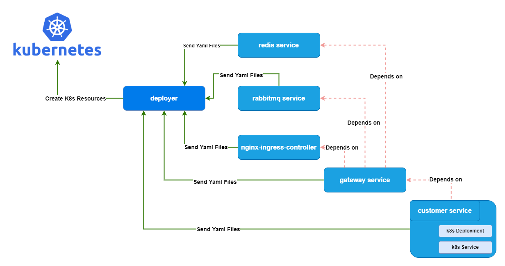
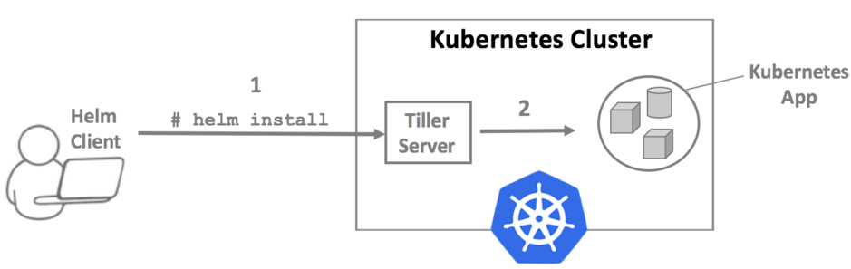
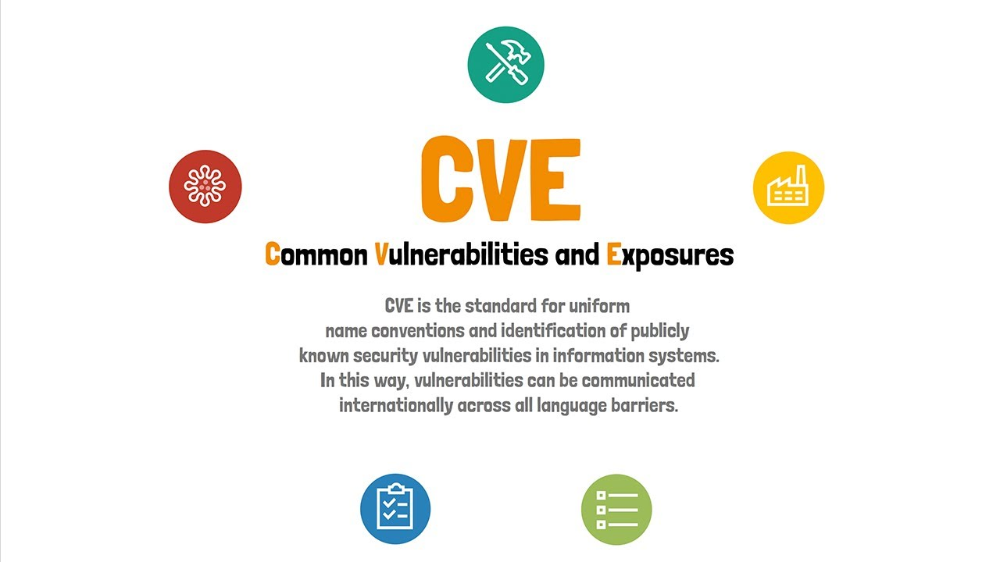

# 技术栈过于复杂，修不完的 CVEs

> 讲了太多知识点，大家可能都开始犯困了，尝试吊起大家的兴致，发起讨论。

我看大家有点开始犯困了。大家有什么问题，或者工作中有遇到什么困难，我们都可以一起聊聊？

> 听听大家的困难？一起随便聊聊。

聊聊我们项目中，目前遇到的困难或者说苦恼。先说一下项目背景。

## 我遇到的困难 & 苦恼

### 项目背景

- 大概从 2017 年开始，我所在的项目组开始将产品容器化，并用 Kubernetes 将产品（SMAX）部署在云端（包括 On-Premise，AWS，Azure，Google，OpenShift）。

- 微服务的理念是每个单独的服务可以自由选择开发语言，例如可以选择 Java， Python， GoLang 等开发自己的应用程序。这也让我们有了更多的机会去尝试新技术，例如使用 GoLang 开发我们的微服务。当时也是因为这个原因，我们基于 GoLang 和 Java 两种语言开发了我们自己的产品部署工具，类似于现在的 Helm。

- 我们自己的产品部署工具（暂且把它叫做 deployer）架构图如下：

  

  - 假设我们有 redis service，rabbitmq service，nginx-ingress-controller service，gateway service 和 customer service 这 5 个服务（service）。但是因为一些技术原因（历史遗留问题，这个技术债的坑有点大，也没有很大的动力去还这个技术债），我们的服务启动是有依赖关系的，否则服务将无法正常启动。
  - 例如 gateway service 的启动创建就依赖于 redis service，rabbitmq service 和 nginx-ingress-controller service。而 customer service 的启动依赖于 gateway service。
  - 我们当时也调研了 Helm，当然那时候的 Helm 架构还是有 Tiller Server的，从 deployer 和 helm 的架构图其实也可以看出，他们的架构很像。但最终发现 Helm 并不能满足我们服务依赖创建的问题。考虑到我们产品部署的特殊性，可能还有其他 Helm 不能满足的需求点，为了自己掌握灵活性，我们最终打算自研了类似 Helm 的 deployer。
  - 我们可以把 redis service，rabbitmq service，nginx-ingress-controller service，gateway service 和 customer service 理解为 helm chart，里面包含各个 service 所需的 yaml 文件，例如 Deployment，Service 等等资源。各个 service 将 k8s yaml 文件发送给 deployer 组件，由 deployer 组件控制 service 之间的顺序，并最终发送给 Kubernetes API Server 创建 K8s 资源。
  - 上面的组件中，deployer 是用 Java 语言开发的（还有 nodejs 和 React），而各个 service（helm chart）是由 GoLang 语言开发的。

### 遇到的问题

介绍了那么多项目背景，我们再来聊聊遇到的问题。因为我们使用了多种开发语言，有 Java，有 nodejs，React，还有 GoLang，就导致我们团队的技术栈特别多，需要修复的 CVEs 数量也往往是其他团队的好几倍。因为其他团队（业务团队，我们属于基础架构团队）大都使用的 Java 语言，技术栈比较单一，而且 Java 语言相对成熟，CVEs 修复起来也比较容易，一般只需升级 jar 包版本即可，一般也不会引起程序代码的兼容性问题，而导致需要大量的修改代码。

并且大家都是使用的 Java 语言，即使出现了兼容性问题，各个团队之间也可以分享修复方案，学习研究修复 CVEs 的成本相对较低。

因为我们团队有 nodejs，React，GoLang 语言，而且这几门语言相对较新，最近（2022年）有很多 CVEs 被暴露出来，特别是 GoLang 的 CVEs 特别多，而且往往不能通过简单的升级包版本来修复 CVEs，往往会导致大量的代码修改，弄得我们团队有点应接不暇。每天都在忙于修 CVEs。没有更多的时间去开发新功能。

目前我们也在打算用 Helm 替换掉我们的 deployer，待我们的 deployer 废弃后，也就没有那么多 CVEs 需要修复了。（但替换成 Helm 也不是件简单的事情，需要太多 cross team effort。）

### 经验教训

- 尽量保持单一的技术栈（Java 语言），方便各个团队之间分析修复 CVEs 的经验。
- 更多的技术栈，代表着更多的 CVEs 需要修复。
- 选用新技术新语言（GoLang）时需谨慎。新技术往往代表着还不够完善，可能存在着很多 CVEs。特别是对于金融行业选择新技术时，需更加谨慎。（我记得我以前，我在花旗银行工作过一年多时间，他们选择新技术就特别谨慎。）
- 如果能用开源软件的，尽量用开源软件，不要自己开发，或者魔改开源软件。后期维护，合并回主分支及其困难。除非公司有足够的人力投入，否则还是直接用开源软件吧。