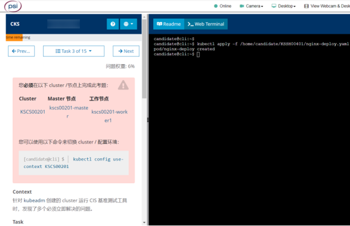
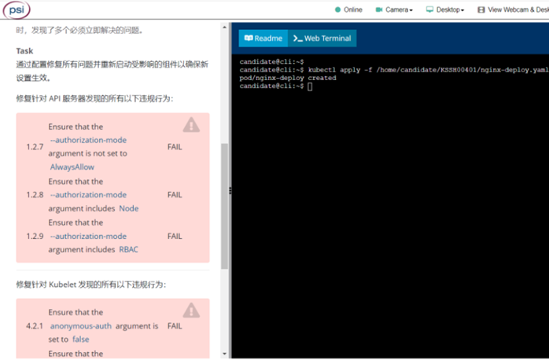
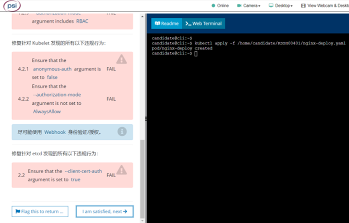

# kube-bench 修复不安全项





1.2 API Server

1.2.7  Ensure that the --authorization-mode argument is not set to AlwaysAllow  FAIL

1.2.8  Ensure that the --authorization-mode argument includes Node       FAIL

1.2.9  Ensure that the --authorization-mode argument includes RBAC       FAIL

1.2.18  Ensure that the  --insecure-bind-address argument is not set        FAIL  （1.22中，这两项题目里没有明确给出，但是最好也修改）

1.2.19  Ensure that the  --insecure-port argument is set to 0            FAIL （1.22中，这两项题目里没有明确给出，但是最好也修改）

```shell
# 按提示修改/etc/kubernetes/manifests/kube-apiserver.yaml
vi /etc/kubernetes/manifests/kube-apiserver.yaml
```

Fix all of the following violations that were found against the kubelet:

4.2 Kubelet

4.2.1  Ensure that the   anonymous-auth argument is set to false         FAIL

4.2.2  Ensure that the  --authorization-mode argument is not set to AlwaysAllow   FAIL (Use webhook auth where possible.)

```shell
# 按提示修改/var/lib/kubelet/config.yaml
vi /var/lib/kubelet/config.yaml
systemctl daemon-reload
systemctl restart kubelet.service
```

Fix all of the following violations that were found against etcd:

2 Etcd Node Configuration

2.2   Ensure that the  --client-cert-auth argument is set to true          FAIL

```shell
# 按提示修改/etc/kubernetes/manifests/etcd.yaml
vi /etc/kubernetes/manifests/etcd.yaml
```


> Reference:
>
> https://kubernetes.io/docs/reference/config-api/kubelet-config.v1beta1/#kubelet-config-k8s-io-v1beta1-KubeletAuthentication