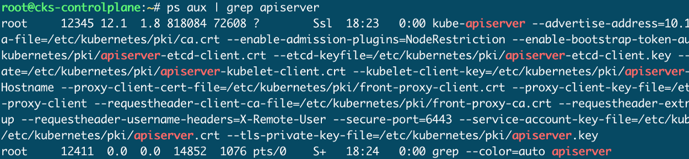

# Kubernetes CKS Example Exam Question Series

## #1 Create Cluster & Security Best Practices

> 参考资料：
>
> https://itnext.io/cks-exam-series-1-create-cluster-security-best-practices-50e35aaa67ae

## #2 Pods, Secrets and ServiceAccounts

### Rules!

1. Be fast, avoid creating yaml manually from scratch
2. Use only [kubernetes.io/docs](https://kubernetes.io/docs/home/) for help.
3. Check our solution after you did yours. You probably have a better one!

### Todays Task: Pod with ServiceAccount uses Secrets

1. Create new *Namespace* `ns-secure` and perform everything else in there
2. Create *ServiceAccount* `secret-manager`
3. Create *Secret* `sec-a1` with any literal content of your choice
4. Create *Secret* `sec-a2` with any file content of your choice (like `/etc/hosts`)
5. Create *Pod* `secret-manager` image nginx which uses the new *SA*
6. Make *Secret* `sec-a1` available as environment variable `SEC_A1`
7. Mount *Secret* `sec-a2` into the Pod read-only under `/etc/sec-a2`
8. Verify your solution worked

### Solution

To solve this we’re logged into our controlplane node `cks-controlplane` .

#### 1.

```
alias k=kubectlk create ns ns-secure
```

#### 2.

```
k -n ns-secure create sa secret-manager
```

#### 3.

```
k -n ns-secure create secret generic sec-a1 --from-literal user=admin
```

#### 4.

```
k -n ns-secure create secret generic sec-a2 --from-file index=/etc/hosts
```

#### 5. 6. 7.

```
k -n ns-secure run secret-manager --image=nginx -oyaml --dry-run=client > pod.yaml
```

Now edit the yaml to:

```
apiVersion: v1
kind: Pod
metadata:
  creationTimestamp: null
  labels:
    run: secret-manager
  name: secret-manager
  namespace: ns-secure
spec:
  volumes:
    - name: sec-a2
      secret:
        secretName: sec-a2
  serviceAccountName: secret-manager
  containers:
    - image: nginx
      name: secret-manager
      volumeMounts:
        - name: sec-a2
          mountPath: /etc/sec-a2
          readOnly: true
      env:
        - name: SEC_A1
          valueFrom:
            secretKeyRef:
              name: sec-a1
              key: user
  dnsPolicy: ClusterFirst
  restartPolicy: Always
```

#### **8.**

And to verify:

```
k -f pod.yaml create
k -n ns-secure exec secret-manager -- env | grep SEC
k -n ns-secure exec secret-manager -- mount | grep sec
```

> 参考资料：
>
> https://itnext.io/cks-exam-series-2-pods-and-secrets-3d92a6fba331


## #3 Immutable Pods

### Todays Task: Make Pods immutable

1. Create *Pod* `holiday` with two containers `c1` and `c2` of image `bash:5.1.0`, ensure the containers keep running
2. Create *Deployment* `snow` of image `nginx:1.19.6` with 3 replicas
3. Force container `c2` of *Pod* `holiday` to run immutable: no files can be changed during runtime
4. Make sure the container of *Deployment* `snow` will run immutable. Then make necessary paths writable for Nginx to work.
5. Verify everything

### Solution

#### 1.

```
alias k=kubectl
k run holiday --image=bash:5.1.0 --command -oyaml --dry-run=client -- sh -c 'sleep 1d' > holiday.yaml
vim holiday.yaml
```

Add second container and change container names:

```yaml
apiVersion: v1
kind: Pod
metadata:
  creationTimestamp: null
  labels:
    run: holiday
  name: holiday
spec:
  containers:
  - command:
    - sh
    - -c
    - sleep 1d
    image: bash:5.1.0
    name: c1
    resources: {}
  - command:
    - sh
    - -c
    - sleep 1d
    image: bash:5.1.0
    name: c2
    resources: {}
  dnsPolicy: ClusterFirst
  restartPolicy: Always
status: {}
```


#### 2.

```
k create deploy snow --image=nginx:1.19.6 -oyaml --dry-run=client > snow.yaml
vim snow.yaml
```

Change the replicas:

```yaml
apiVersion: apps/v1
kind: Deployment
metadata:
  creationTimestamp: null
  labels:
    app: snow
  name: snow
spec:
  replicas: 3
  selector:
    matchLabels:
      app: snow
  strategy: {}
  template:
    metadata:
      creationTimestamp: null
      labels:
        app: snow
    spec:
      containers:
      - image: nginx:1.19.6
        name: nginx
        resources: {}
status: {}
```

#### 3.

```
vim holiday.yaml
```

Add SecurityContext on container level:

```yaml
apiVersion: v1
kind: Pod
metadata:
  creationTimestamp: null
  labels:
    run: holiday
  name: holiday
spec:
  containers:
  - command:
    - sh
    - -c
    - sleep 1d
    image: bash:5.1.0
    name: c1
    resources: {}
  - command:
    - sh
    - -c
    - sleep 1d
    image: bash:5.1.0
    name: c2
    resources: {}
    securityContext:
      readOnlyRootFilesystem: true
  dnsPolicy: ClusterFirst
  restartPolicy: Always
status: {}
```

#### 4.

The idea is to make all filesystem readonly, then start the *Pod* and check container logs for errors. Based on the errors we can create emptyDir volumes for writing. Errors could look like:

```
"/var/cache/nginx/client_temp" failed (30: Read-only file system)
nginx: [emerg] mkdir() "/var/cache/nginx/client_temp" failed (30: Read-only file system)
```

With just Docker we could do something like:

```
docker run -d --read-only --tmpfs /var/cache nginx
```

To do this in a *Deployment*:

```
vim snow.yaml
```

Add volumes and volume mounts:

```yaml
apiVersion: apps/v1
kind: Deployment
metadata:
  creationTimestamp: null
  labels:
    app: snow
  name: snow
spec:
  replicas: 3
  selector:
    matchLabels:
      app: snow
  strategy: {}
  template:
    metadata:
      creationTimestamp: null
      labels:
        app: snow
    spec:
      containers:
      - image: nginx:1.19.6
        name: nginx
        resources: {}
        securityContext:
          readOnlyRootFilesystem: true
        volumeMounts:
        - name: write1
          mountPath: /var/cache/nginx
        - name: write2
          mountPath: /var/run
      volumes:
      - name: write1
        emptyDir: {}
      - name: write2
        emptyDir: {}
status: {}
```

#### 5.

```shell
k exec holiday -c c1 -- touch /tmp/test # works
k exec holiday -c c2 -- touch /tmp/test # error
k get deploy snow # should show 3 ready replicas
k exec snow-575cd78c85-ldplw -- touch /tmp/test # error
k exec snow-575cd78c85-ldplw -- touch /var/cache/nginx/test # works
```

## #4 Crash that Apiserver !

### Todays Task: Crash the Apiserver and check logs

*You should be very comfortable changing the Apiserver config. You will probably mess something up when altering Apiserver config, and this isn’t a bad thing if you know where to check for logs!*

1. Configure the Apiserver manifest with a new argument `--this-is-very-wrong`. Check if the Pod comes back up and what logs this causes. Fix the Apiserver again.
2. Change the existing Apiserver manifest argument to: `—-etcd-servers=this-is-very-wrong.` Check what the logs say, and fix it again.
3. Change the Apiserver manifest and add invalid YAML. Check what the logs say, and fix again.

### Solution

```
alias k=kubectl
```

**Log locations to check:**

- `/var/log/pods`
- `/var/log/containers`
- `docker ps` + `docker logs`
- kubelet logs: `/var/log/syslog` or `journalctl -u kubelet`

#### 1. Add unknown argument

```shell
cp /etc/kubernetes/manifests/kube-apiserver.yaml ~/kube-apiserver.yaml.ori # always make a backup !
vim /etc/kubernetes/manifests/kube-apiserver.yaml
```

Edit:

```yaml
...
spec:
  containers:
  - command:
    - kube-apiserver
    - --this-is-very-wrong
    - --advertise-address=10.156.0.53
    - --allow-privileged=true
...
```

Wait for it to come back:

```bash
k -n kube-system get pod # nothing there
```

Check for logs:

```bash
cd /var/log/pods
ls -lh | grep apiserver
tail -f kube-system_kube-apiserver-cks-master_7aef8559c5d7d59259044bb444b01ac3/kube-apiserver/4.log
```


And we remove the `unknown flag` to fix the Apiserver again:

```bash
cp ~/kube-apiserver.yaml.ori /etc/kubernetes/manifests/kube-apiserver.yaml # smart people use a backup
```


#### 2. Misconfigure ETCD connection

```bash
cp /etc/kubernetes/manifests/kube-apiserver.yaml ~/kube-apiserver.yaml.ori # always make a backup !
vim /etc/kubernetes/manifests/kube-apiserver.yaml
```

Edit:

```yaml
...
spec:
  containers:
  - command:
    - kube-apiserver
...
    - --etcd-certfile=/etc/kubernetes/pki/apiserver-etcd-client.crt
    - --etcd-keyfile=/etc/kubernetes/pki/apiserver-etcd-client.key
    - --etcd-servers=this-is-very-wrong
    - --insecure-port=0
...
```

The Apiserver needs to communicate with ETCD:


We can see the process running:



We see the container running:


We can check container logs: `docker logs 829f1d829a43`:


And we fix the Apiserver again:

```bash
cp ~/kube-apiserver.yaml.ori /etc/kubernetes/manifests/kube-apiserver.yaml # clever people use a backup
```

#### 3. Invalid Apiserver Manifest YAML

This will cause the kubelet not being able to even create a Container. So we cannot check Pod or Container logs.

```bash
cp /etc/kubernetes/manifests/kube-apiserver.yaml ~/kube-apiserver.yaml.ori # do you do backup?vim /etc/kubernetes/manifests/kube-apiserver.yaml
```

Edit to invalid YAML:

```yaml
apiVersion: v1
kind: Pod
metadata:
...
  name: kube-apiserver
  namespace: kube-system
specTHIS IS VERY ::::: WRONG
  containers:
  - command:
    - kube-apiserver
...
```

Hello apiserver process?

```bash
ps aux | grep apiserver # nada
```

Pod logs?

```bash
find /var/log/pods/ | grep apiserver # nichts
```

Container?

```bash
docker ps | grep apiserver # YUdGb1lTRWhJUW89Cg==
```

Kubelet syslog logs (`/var/log/syslog`)?

```bash
Jan  2 18:41:00 cks-controlplane kubelet[7000]: E0102 18:41:00.573469    7000 file.go:187] Can't process manifest file "/etc/kubernetes/manifests/kube-apiserver.yaml": /etc/kubernetes/manifests/kube-apiserver.yaml: couldn't parse as pod(yaml: line 13: mapping values are not allowed in this context), please check config file
```

Or also possible:

```bash
journalctl -u kubelet | tail
```

Now fix it again to make the apiserver happy:

```bash
cp ~/kube-apiserver.yaml.ori /etc/kubernetes/manifests/kube-apiserver.yaml # wise people use a backup
```